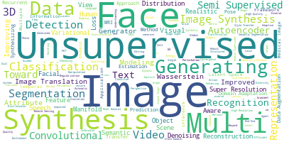
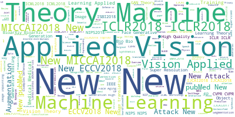
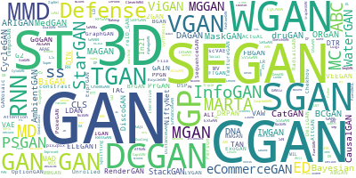

# All-About-the-GAN

### GAN(Generative Adversarial Networks) are the models that used in unsupervised machine learning, implemented by a system of two neural networks competing against each other in a zero-sum game framework. It was introduced by Ian Goodfellow et al. in 2014.

The purpose of this repository is providing the curated list of the state-of-the-art works on the field of Generative Adversarial Networks since their introduction in 2014.

 (Word Cloud of Title)

 (Word Cloud of Title)

 (Word cloud of Abbr. name)

It provides a list that merged information from various GAN lists and repositories as below:

### :link: Reference repositories
* [[GAN zoo]](https://github.com/hindupuravinash/the-gan-zoo) - A list of all named GANs! by hindupuravinash
* Delving deep into Generative Adversarial Networks (GANs) [[Delving]](https://github.com/GKalliatakis/Delving-deep-into-GANs) by GKalliatakis
* Awesome GAN for Medical Imaging  [[Medical]](https://github.com/xinario/awesome-gan-for-medical-imaging/) by xinario
* [[Adversarial Nets Papers]](https://github.com/zhangqianhui/AdversarialNetsPapers/) The classic about Generative Adversarial Networks
* [[Really Awesome GAN]](https://github.com/nightrome/really-awesome-gan) by nightrome
* [[GANs Paper Collection]](https://github.com/shawnyuen/GANsPaperCollection) by shawnyuen
* [[GAN awesome applications]](https://github.com/nashory/gans-awesome-applications) by nashory
* [[GAN timeline]](https://github.com/dongb5/GAN-Timeline) by dongb5
* [[GAN comparison without cherry-picking]](https://github.com/khanrc/tf.gans-comparison) by khanrc
* Collection of generative models in [[Keras]](https://github.com/eriklindernoren/Keras-GAN), [[Pytorch version]](https://github.com/znxlwm/pytorch-generative-model-collections), [[Tensorflow version]](https://github.com/hwalsuklee/tensorflow-generative-model-collections), [[Chainer version]](https://github.com/pfnet-research/chainer-gan-lib)
* [[Tensor layer]](https://github.com/tensorlayer/tensorlayer)
* [[Tensor pack]](https://github.com/ppwwyyxx/tensorpack)
----

You can also check out the same data in a tabular format with functionality to filter by year or do a quick search by title [here](https://github.com/hollobit/All-About-the-GAN/blob/master/AllGAN-r2.tsv).

Contributions are welcome. Please contact me at hollobit@etri.re.kr or send a pull request. You can have to add links through pull requests or create an issue which something I missed or need to start a discussion.

----

 1. __-__ -   ([Search](http://www.google.com/search?q=-))  ([Scholar](http://scholar.google.com/scholar?q=-))   ([PDF](http://openaccess.thecvf.com/content_cvpr_2018/papers/Poursaeed_Generative_Adversarial_Perturbations_CVPR_2018_paper.pdf))([arXiv](http://openaccess.thecvf.com/content_cvpr_2018/html/Poursaeed_Generative_Adversarial_Perturbations_CVPR_2018_paper.html)) 
    - `2018/6` `CVPR 2018` 

 2. __3-D Convolutional Encoder-Decoder Network for Low-Dose CT via Transfer Learning From a 2-D Trained Network__ -   ([Search](http://www.google.com/search?q=3-D%20Convolutional%20Encoder-Decoder%20Network%20for%20Low-Dose%20CT%20via%20Transfer%20Learning%20From%20a%202-D%20Trained%20Network))  ([Scholar](http://scholar.google.com/scholar?q=3-D%20Convolutional%20Encoder-Decoder%20Network%20for%20Low-Dose%20CT%20via%20Transfer%20Learning%20From%20a%202-D%20Trained%20Network))   ([PDF](-))([arXiv](https://ieeexplore.ieee.org/document/8353466/)) ([Web](https://www.ncbi.nlm.nih.gov/pubmed/29870379)) 
    - `2018/5` __`Medical: Synthersize`__ `New, 3D, LD-CT` 

 3. __3C-GAN: AN CONDITION-CONTEXT-COMPOSITE GENERATIVE ADVERSARIAL NETWORKS FOR GENERATING IMAGES SEPARATELY__ -   ([Search](http://www.google.com/search?q=3C-GAN%3A%20AN%20CONDITION-CONTEXT-COMPOSITE%20GENERATIVE%20ADVERSARIAL%20NETWORKS%20FOR%20GENERATING%20IMAGES%20SEPARATELY))  ([Scholar](http://scholar.google.com/scholar?q=3C-GAN%3A%20AN%20CONDITION-CONTEXT-COMPOSITE%20GENERATIVE%20ADVERSARIAL%20NETWORKS%20FOR%20GENERATING%20IMAGES%20SEPARATELY))   ([PDF](https://openreview.net/pdf?id=HkCvZXbC-))([Web](https://openreview.net/forum?id=HkCvZXbC-&noteId=SkLkB1aHM)) 
    - `2018/1` `ICLR2018`  __`3C-GAN`__  

 4. __3D cGAN based cross-modality MR image synthesis for brain tumor segmentation__ -   ([Search](http://www.google.com/search?q=3D%20cGAN%20based%20cross-modality%20MR%20image%20synthesis%20for%20brain%20tumor%20segmentation))  ([Scholar](http://scholar.google.com/scholar?q=3D%20cGAN%20based%20cross-modality%20MR%20image%20synthesis%20for%20brain%20tumor%20segmentation))   ([PDF](-))([arXiv](https://ieeexplore.ieee.org/abstract/document/8363653/)) 
    - `2018/4` `ISBI 2018`  __`3D cGAN`__  

 5. __3D conditional generative adversarial networks for high-quality PET image estimation at low dose__ -   ([Search](http://www.google.com/search?q=3D%20conditional%20generative%20adversarial%20networks%20for%20high-quality%20PET%20image%20estimation%20at%20low%20dose))  ([Scholar](http://scholar.google.com/scholar?q=3D%20conditional%20generative%20adversarial%20networks%20for%20high-quality%20PET%20image%20estimation%20at%20low%20dose))   ([PDF](-))([arXiv](https://www.sciencedirect.com/science/article/pii/S1053811918302507?via%3Dihub)) ([Web](https://www.ncbi.nlm.nih.gov/pubmed/29571715)) 
    - `2018/7` __`Medical: Reconstruction`__ `3D, CT` 

 6. __3D Consistent Biventricular Myocardial Segmentation Using Deep Learning for Mesh Generation__ -   ([Search](http://www.google.com/search?q=3D%20Consistent%20Biventricular%20Myocardial%20Segmentation%20Using%20Deep%20Learning%20for%20Mesh%20Generation))  ([Scholar](http://scholar.google.com/scholar?q=3D%20Consistent%20Biventricular%20Myocardial%20Segmentation%20Using%20Deep%20Learning%20for%20Mesh%20Generation))   ([PDF](https://arxiv.org/pdf/1803.11080))([arXiv](https://arxiv.org/abs/1803.11080)) 
    - `2018/3` __`Medical: Segmentation`__ `3D` 

 7. __3D Medical Image Synthesis using Generative Adversarial Networks__ -   ([Search](http://www.google.com/search?q=3D%20Medical%20Image%20Synthesis%20using%20Generative%20Adversarial%20Networks))  ([Scholar](http://scholar.google.com/scholar?q=3D%20Medical%20Image%20Synthesis%20using%20Generative%20Adversarial%20Networks))   ([PDF](https://womencourage.acm.org/wp-content/uploads/2017/07/womENcourage_2017_paper_58.pdf?189db0))
    - `2017/` __`Medical: Synthersize`__ `Medical` 

 8. __3D Object Reconstruction from a Single Depth View with Adversarial Learning__ -   ([Search](http://www.google.com/search?q=3D%20Object%20Reconstruction%20from%20a%20Single%20Depth%20View%20with%20Adversarial%20Learning))  ([Scholar](http://scholar.google.com/scholar?q=3D%20Object%20Reconstruction%20from%20a%20Single%20Depth%20View%20with%20Adversarial%20Learning))   ([PDF](https://arxiv.org/pdf/1708.07969.pdf))([arXiv](https://arxiv.org/abs/1708.07969)) ([github](https://github.com/Yang7879/3D-RecGAN)) 
    - `2017/8` `Applied Vision, 3D`  __`3D-RecGAN`__  

 9. __3D Reconstruction of Incomplete Archaeological Objects Using a Generative Adversary Network__ -   ([Search](http://www.google.com/search?q=3D%20Reconstruction%20of%20Incomplete%20Archaeological%20Objects%20Using%20a%20Generative%20Adversary%20Network))  ([Scholar](http://scholar.google.com/scholar?q=3D%20Reconstruction%20of%20Incomplete%20Archaeological%20Objects%20Using%20a%20Generative%20Adversary%20Network))   ([PDF](https://arxiv.org/pdf/1711.06363.pdf))([arXiv](https://arxiv.org/abs/1711.06363)) 
    - `2017/11`  __`ORGAN`__  

 10. __3D Shape Induction from 2D Views of Multiple Objects__ -   ([Search](http://www.google.com/search?q=3D%20Shape%20Induction%20from%202D%20Views%20of%20Multiple%20Objects))  ([Scholar](http://scholar.google.com/scholar?q=3D%20Shape%20Induction%20from%202D%20Views%20of%20Multiple%20Objects))   ([PDF](https://arxiv.org/pdf/1612.05872.pdf))([arXiv](https://arxiv.org/abs/1612.05872)) 
    - `2016/12` `3D Object generation`  __`PrGAN`__   `Citation: 9` 

 11. __3D-Aided Dual-Agent GANs for Unconstrained Face Recognition__ -   ([Search](http://www.google.com/search?q=3D-Aided%20Dual-Agent%20GANs%20for%20Unconstrained%20Face%20Recognition))  ([Scholar](http://scholar.google.com/scholar?q=3D-Aided%20Dual-Agent%20GANs%20for%20Unconstrained%20Face%20Recognition))   ([PDF](https://ieeexplore.ieee.org/document/8417439/))([arXiv](https://www.ncbi.nlm.nih.gov/pubmed/30040629)) ([Web](https://www.ncbi.nlm.nih.gov/pubmed/30040629)) 
    - `2018/7` `New, pubMed` 

 12. __3D-Scene-GAN: Three-dimensional Scene Reconstruction with Generative Adversarial Networks__ -   ([Search](http://www.google.com/search?q=3D-Scene-GAN%3A%20Three-dimensional%20Scene%20Reconstruction%20with%20Generative%20Adversarial%20Networks))  ([Scholar](http://scholar.google.com/scholar?q=3D-Scene-GAN%3A%20Three-dimensional%20Scene%20Reconstruction%20with%20Generative%20Adversarial%20Networks))   ([PDF](https://openreview.net/pdf?id=SkNEsmJwf))([Web](https://openreview.net/forum?id=SkNEsmJwf)) 
    - `2018/2` `ICLR2018`  __`3D-Scene-GAN`__  

 13. __A Bayesian Data Augmentation Approach for Learning Deep Models__ -   ([Search](http://www.google.com/search?q=A%20Bayesian%20Data%20Augmentation%20Approach%20for%20Learning%20Deep%20Models))  ([Scholar](http://scholar.google.com/scholar?q=A%20Bayesian%20Data%20Augmentation%20Approach%20for%20Learning%20Deep%20Models))   ([PDF](https://arxiv.org/pdf/1710.10564))([arXiv](https://arxiv.org/abs/1710.10564)) 
    - `2017/10` `Augmentation` 

 14. __A Classification-Based Perspective on GAN Distributions__ -   ([Search](http://www.google.com/search?q=A%20Classification-Based%20Perspective%20on%20GAN%20Distributions))  ([Scholar](http://scholar.google.com/scholar?q=A%20Classification-Based%20Perspective%20on%20GAN%20Distributions))   ([PDF](https://arxiv.org/pdf/1711.00970.pdf))([arXiv](https://arxiv.org/abs/1711.00970)) 
    - `2017/11` `Theory & Machine Learning`  `Citation: 1` 

 15. __A Classification-Based Perspective on GAN Distributions__ -   ([Search](http://www.google.com/search?q=A%20Classification-Based%20Perspective%20on%20GAN%20Distributions))  ([Scholar](http://scholar.google.com/scholar?q=A%20Classification-Based%20Perspective%20on%20GAN%20Distributions))   ([PDF](https://openreview.net/pdf?id=S1FQEfZA-))([Web](https://openreview.net/forum?id=S1FQEfZA-&noteId=H1JSIkaBf)) 
    - `2018/1` `ICLR2018` 

 16. __A Classification-Based Study of Covariate Shift in GAN Distributions__ -   ([Search](http://www.google.com/search?q=A%20Classification-Based%20Study%20of%20Covariate%20Shift%20in%20GAN%20Distributions))  ([Scholar](http://scholar.google.com/scholar?q=A%20Classification-Based%20Study%20of%20Covariate%20Shift%20in%20GAN%20Distributions))   ([PDF](http://proceedings.mlr.press/v80/santurkar18a/santurkar18a.pdf))([arXiv](http://proceedings.mlr.press/v80/santurkar18a.html)) 
    - `2018/7` `ICML2018` 

 17. __A conditional adversarial network for semantic segmentation of brain tumor__ -   ([Search](http://www.google.com/search?q=A%20conditional%20adversarial%20network%20for%20semantic%20segmentation%20of%20brain%20tumor))  ([Scholar](http://scholar.google.com/scholar?q=A%20conditional%20adversarial%20network%20for%20semantic%20segmentation%20of%20brain%20tumor))   ([PDF](-))([arXiv](https://link.springer.com/chapter/10.1007%2F978-3-319-75238-9_21)) 
    - `2018/2` __`Medical: Segmentation`__ `Medical` 

 18. __A Connection between Generative Adversarial Networks, Inverse Reinforcement Learning, and Energy-Based Models__ -   ([Search](http://www.google.com/search?q=A%20Connection%20between%20Generative%20Adversarial%20Networks%2C%20Inverse%20Reinforcement%20Learning%2C%20and%20Energy-Based%20Models))  ([Scholar](http://scholar.google.com/scholar?q=A%20Connection%20between%20Generative%20Adversarial%20Networks%2C%20Inverse%20Reinforcement%20Learning%2C%20and%20Energy-Based%20Models))   ([PDF](https://arxiv.org/pdf/1611.03852.pdf))([arXiv](https://arxiv.org/abs/1611.03852)) 
    - `2016/11` `Theory & Machine Learning`  `Citation: 16` 

 19. __A Deep Generative Adversarial Architecture for Network-Wide Spatial-Temporal Traffic State Estimation__ -   ([Search](http://www.google.com/search?q=A%20Deep%20Generative%20Adversarial%20Architecture%20for%20Network-Wide%20Spatial-Temporal%20Traffic%20State%20Estimation))  ([Scholar](http://scholar.google.com/scholar?q=A%20Deep%20Generative%20Adversarial%20Architecture%20for%20Network-Wide%20Spatial-Temporal%20Traffic%20State%20Estimation))   ([PDF](https://arxiv.org/pdf/1801.03818.pdf))([arXiv](https://arxiv.org/abs/1801.03818)) 
    - `2018/1` 

 20. __A Deep Predictive Coding Network for Learning Latent Representations__ -   ([Search](http://www.google.com/search?q=A%20Deep%20Predictive%20Coding%20Network%20for%20Learning%20Latent%20Representations))  ([Scholar](http://scholar.google.com/scholar?q=A%20Deep%20Predictive%20Coding%20Network%20for%20Learning%20Latent%20Representations))   ([PDF](https://www.biorxiv.org/content/early/2018/03/26/278218.full.pdf))([arXiv](https://www.biorxiv.org/content/early/2018/03/26/278218)) 
    - `2018/3` `Bio` 

 21. __A Deeper Look at 3D Shape Classifiers__ -   ([Search](http://www.google.com/search?q=A%20Deeper%20Look%20at%203D%20Shape%20Classifiers))  ([Scholar](http://scholar.google.com/scholar?q=A%20Deeper%20Look%20at%203D%20Shape%20Classifiers))   ([PDF](https://arxiv.org/pdf/1809.02560))([arXiv](https://arxiv.org/format/1809.02560)) 
    - `2018/9` `New, 3D` 

 22. __A Dual Approach to Scalable Verification of Deep Networks__ -   ([Search](http://www.google.com/search?q=A%20Dual%20Approach%20to%20Scalable%20Verification%20of%20Deep%20Networks))  ([Scholar](http://scholar.google.com/scholar?q=A%20Dual%20Approach%20to%20Scalable%20Verification%20of%20Deep%20Networks))   ([PDF](https://arxiv.org/pdf/1803.06567))([arXiv](https://arxiv.org/format/1803.06567)) 
    - `2018/3` `New` 

 23. __A general metric for identifying adversarial images__ -   ([Search](http://www.google.com/search?q=A%20general%20metric%20for%20identifying%20adversarial%20images))  ([Scholar](http://scholar.google.com/scholar?q=A%20general%20metric%20for%20identifying%20adversarial%20images))   ([PDF](https://arxiv.org/pdf/1807.10335))([arXiv](https://arxiv.org/format/1807.10335)) 
    - `2018/7` `New` 

 24. __A General Retraining Framework for Scalable Adversarial Classification__ -   ([Search](http://www.google.com/search?q=A%20General%20Retraining%20Framework%20for%20Scalable%20Adversarial%20Classification))  ([Scholar](http://scholar.google.com/scholar?q=A%20General%20Retraining%20Framework%20for%20Scalable%20Adversarial%20Classification))   ([PDF](https://arxiv.org/pdf/1604.02606.pdf))([arXiv](https://arxiv.org/abs/1604.02606)) 
    - `2016/4` `Theory & Machine Learning`  `Citation: 6` 

 25. __A Generalized Active Learning Approach for Unsupervised Anomaly Detection__ -   ([Search](http://www.google.com/search?q=A%20Generalized%20Active%20Learning%20Approach%20for%20Unsupervised%20Anomaly%20Detection))  ([Scholar](http://scholar.google.com/scholar?q=A%20Generalized%20Active%20Learning%20Approach%20for%20Unsupervised%20Anomaly%20Detection))   ([PDF](https://arxiv.org/pdf/1805.09411))([arXiv](https://arxiv.org/abs/1805.09411)) 
    - `2018/5` 

 26. __A Generative Adversarial Approach for Zero-Shot Learning From Noisy Texts__ -   ([Search](http://www.google.com/search?q=A%20Generative%20Adversarial%20Approach%20for%20Zero-Shot%20Learning%20From%20Noisy%20Texts))  ([Scholar](http://scholar.google.com/scholar?q=A%20Generative%20Adversarial%20Approach%20for%20Zero-Shot%20Learning%20From%20Noisy%20Texts))   ([PDF](http://openaccess.thecvf.com/content_cvpr_2018/papers/Zhu_A_Generative_Adversarial_CVPR_2018_paper.pdf))([arXiv](http://openaccess.thecvf.com/content_cvpr_2018/html/Zhu_A_Generative_Adversarial_CVPR_2018_paper.html)) 
    - `2018/6` `CVPR 2018` 

 27. __A generative adversarial framework for positive-unlabeled classification__ -   ([Search](http://www.google.com/search?q=A%20generative%20adversarial%20framework%20for%20positive-unlabeled%20classification))  ([Scholar](http://scholar.google.com/scholar?q=A%20generative%20adversarial%20framework%20for%20positive-unlabeled%20classification))   ([PDF](https://arxiv.org/pdf/1711.08054.pdf))([arXiv](https://arxiv.org/abs/1711.08054)) 
    - `2017/11`  __`GPU`__  

 28. __A Generative Model for Volume Rendering__ -   ([Search](http://www.google.com/search?q=A%20Generative%20Model%20for%20Volume%20Rendering))  ([Scholar](http://scholar.google.com/scholar?q=A%20Generative%20Model%20for%20Volume%20Rendering))   ([PDF](https://arxiv.org/pdf/1710.09545.pdf))([arXiv](https://arxiv.org/abs/1710.09545)) 
    - `2017/10` __`Medical: Volume Rendering`__ `Applied Other` 

 29. __A Hybrid Model for Identity Obfuscation by Face Replacement__ -   ([Search](http://www.google.com/search?q=A%20Hybrid%20Model%20for%20Identity%20Obfuscation%20by%20Face%20Replacement))  ([Scholar](http://scholar.google.com/scholar?q=A%20Hybrid%20Model%20for%20Identity%20Obfuscation%20by%20Face%20Replacement))   ([PDF](https://arxiv.org/pdf/1804.04779))([arXiv](https://arxiv.org/abs/1804.04779)) 
    - `2018/4` `ECCV2018` 

 30. __A Memristor based Unsupervised Neuromorphic System Towards Fast and Energy-Efficient GAN__ -   ([Search](http://www.google.com/search?q=A%20Memristor%20based%20Unsupervised%20Neuromorphic%20System%20Towards%20Fast%20and%20Energy-Efficient%20GAN))  ([Scholar](http://scholar.google.com/scholar?q=A%20Memristor%20based%20Unsupervised%20Neuromorphic%20System%20Towards%20Fast%20and%20Energy-Efficient%20GAN))   ([PDF](https://arxiv.org/pdf/1806.01775))([arXiv](https://arxiv.org/abs/1806.01775)) 
    - `2018/6` 

 31. __A Multi-Discriminator CycleGAN for Unsupervised Non-Parallel Speech Domain Adaptation__ -   ([Search](http://www.google.com/search?q=A%20Multi-Discriminator%20CycleGAN%20for%20Unsupervised%20Non-Parallel%20Speech%20Domain%20Adaptation))  ([Scholar](http://scholar.google.com/scholar?q=A%20Multi-Discriminator%20CycleGAN%20for%20Unsupervised%20Non-Parallel%20Speech%20Domain%20Adaptation))   ([PDF](https://arxiv.org/pdf/1804.00522v2))([arXiv](https://arxiv.org/abs/1804.00522v2)) 
    - `2018/4` `Interspeech 2018` 

 32. __A Multimodal Classifier Generative Adversarial Network for Carry and Place Tasks from Ambiguous Language Instructions__ -   ([Search](http://www.google.com/search?q=A%20Multimodal%20Classifier%20Generative%20Adversarial%20Network%20for%20Carry%20and%20Place%20Tasks%20from%20Ambiguous%20Language%20Instructions))  ([Scholar](http://scholar.google.com/scholar?q=A%20Multimodal%20Classifier%20Generative%20Adversarial%20Network%20for%20Carry%20and%20Place%20Tasks%20from%20Ambiguous%20Language%20Instructions))   ([PDF](https://arxiv.org/pdf/1806.03847))([arXiv](https://arxiv.org/abs/1806.03847)) 
    - `2018/6` 

 33. __A Novel Approach to Artistic Textual Visualization via GAN__ -   ([Search](http://www.google.com/search?q=A%20Novel%20Approach%20to%20Artistic%20Textual%20Visualization%20via%20GAN))  ([Scholar](http://scholar.google.com/scholar?q=A%20Novel%20Approach%20to%20Artistic%20Textual%20Visualization%20via%20GAN))   ([PDF](https://arxiv.org/pdf/1710.10553.pdf))([arXiv](https://arxiv.org/abs/1710.10553)) 
    - `2017/10` `Applied Vision`  __`GAN-ATV`__  

 34. __A Self-Training Method for Semi-Supervised GANs__ -   ([Search](http://www.google.com/search?q=A%20Self-Training%20Method%20for%20Semi-Supervised%20GANs))  ([Scholar](http://scholar.google.com/scholar?q=A%20Self-Training%20Method%20for%20Semi-Supervised%20GANs))   ([PDF](https://openreview.net/pdf?id=ry4S90l0b))([Web](https://openreview.net/forum?id=ry4S90l0b&noteId=B1skBkTBG)) 
    - `2018/1` `ICLR2018, Training` 

 35. __A Sensor Image Dehazing Algorithm Based on Feature Learning__ -   ([Search](http://www.google.com/search?q=A%20Sensor%20Image%20Dehazing%20Algorithm%20Based%20on%20Feature%20Learning))  ([Scholar](http://scholar.google.com/scholar?q=A%20Sensor%20Image%20Dehazing%20Algorithm%20Based%20on%20Feature%20Learning))   ([PDF](https://www.ncbi.nlm.nih.gov/pmc/articles/PMC6111301/pdf/sensors-18-02606.pdf))([arXiv](https://www.ncbi.nlm.nih.gov/pmc/articles/PMC6111301/)) ([Web](https://www.ncbi.nlm.nih.gov/pubmed/30096891)) 
    - `2018/8` `New, pubMed` 

 36. __A Solvable High-Dimensional Model of GAN__ -   ([Search](http://www.google.com/search?q=A%20Solvable%20High-Dimensional%20Model%20of%20GAN))  ([Scholar](http://scholar.google.com/scholar?q=A%20Solvable%20High-Dimensional%20Model%20of%20GAN))   ([PDF](https://arxiv.org/pdf/1805.08349))([arXiv](https://arxiv.org/abs/1805.08349)) 
    - `2018/5` 

 37. __A step towards procedural terrain generation with GANs__ -   ([Search](http://www.google.com/search?q=A%20step%20towards%20procedural%20terrain%20generation%20with%20GANs))  ([Scholar](http://scholar.google.com/scholar?q=A%20step%20towards%20procedural%20terrain%20generation%20with%20GANs))   ([PDF](https://arxiv.org/pdf/1707.03383.pdf))([arXiv](https://arxiv.org/abs/1707.03383)) 
    - `2017/7` `Applied Vision` 

 38. __A Study into the similarity in generator and discriminator in GAN architecture__ -   ([Search](http://www.google.com/search?q=A%20Study%20into%20the%20similarity%20in%20generator%20and%20discriminator%20in%20GAN%20architecture))  ([Scholar](http://scholar.google.com/scholar?q=A%20Study%20into%20the%20similarity%20in%20generator%20and%20discriminator%20in%20GAN%20architecture))   ([PDF](https://arxiv.org/pdf/1802.07401.pdf))([arXiv](https://arxiv.org/abs/1802.07401)) 
    - `2018/2` 

 39. __A Study of Cross-domain Generative Models applied to Cartoon Series__ -   ([Search](http://www.google.com/search?q=A%20Study%20of%20Cross-domain%20Generative%20Models%20applied%20to%20Cartoon%20Series))  ([Scholar](http://scholar.google.com/scholar?q=A%20Study%20of%20Cross-domain%20Generative%20Models%20applied%20to%20Cartoon%20Series))   ([PDF](https://arxiv.org/pdf/1710.00755.pdf))([arXiv](https://arxiv.org/abs/1710.00755)) 
    - `2017/9` 

 40. __A study on the use of Boundary Equilibrium GAN for Approximate Frontalization of Unconstrained Faces to aid in Surveillance__ -   ([Search](http://www.google.com/search?q=A%20study%20on%20the%20use%20of%20Boundary%20Equilibrium%20GAN%20for%20Approximate%20Frontalization%20of%20Unconstrained%20Faces%20to%20aid%20in%20Surveillance))  ([Scholar](http://scholar.google.com/scholar?q=A%20study%20on%20the%20use%20of%20Boundary%20Equilibrium%20GAN%20for%20Approximate%20Frontalization%20of%20Unconstrained%20Faces%20to%20aid%20in%20Surveillance))   ([PDF](https://arxiv.org/pdf/1809.05611))([arXiv](https://arxiv.org/format/1809.05611)) 
    - `2018/9` `New` 

 41. __A survey of image synthesis and editing with generative adversarial networks__ -   ([Search](http://www.google.com/search?q=A%20survey%20of%20image%20synthesis%20and%20editing%20with%20generative%20adversarial%20networks))  ([Scholar](http://scholar.google.com/scholar?q=A%20survey%20of%20image%20synthesis%20and%20editing%20with%20generative%20adversarial%20networks))   ([PDF](-))([arXiv](https://ieeexplore.ieee.org/document/8195348/)) 
    - `2017/12` __`Medical: Synthersize`__ `Medical` 

 42. __A Two-Step Computation of the Exact GAN Wasserstein Distance__ -   ([Search](http://www.google.com/search?q=A%20Two-Step%20Computation%20of%20the%20Exact%20GAN%20Wasserstein%20Distance))  ([Scholar](http://scholar.google.com/scholar?q=A%20Two-Step%20Computation%20of%20the%20Exact%20GAN%20Wasserstein%20Distance))   ([PDF](http://proceedings.mlr.press/v80/liu18d/liu18d.pdf))([arXiv](http://proceedings.mlr.press/v80/liu18d.html)) 
    - `2018/7` `ICML2018` 

 43. __A Variational Inequality Perspective on Generative Adversarial Nets__ -   ([Search](http://www.google.com/search?q=A%20Variational%20Inequality%20Perspective%20on%20Generative%20Adversarial%20Nets))  ([Scholar](http://scholar.google.com/scholar?q=A%20Variational%20Inequality%20Perspective%20on%20Generative%20Adversarial%20Nets))   ([PDF](https://arxiv.org/pdf/1802.10551.pdf))([arXiv](https://arxiv.org/abs/1802.10551)) 
    - `2018/2` 

 44. __A+D Net: Training a Shadow Detector with Adversarial Shadow Attenuation__ -   ([Search](http://www.google.com/search?q=A%2BD%20Net%3A%20Training%20a%20Shadow%20Detector%20with%20Adversarial%20Shadow%20Attenuation))  ([Scholar](http://scholar.google.com/scholar?q=A%2BD%20Net%3A%20Training%20a%20Shadow%20Detector%20with%20Adversarial%20Shadow%20Attenuation))   ([PDF](https://arxiv.org/pdf/1712.01361))([arXiv](https://arxiv.org/format/1712.01361)) 
    - `2017/12` `New` 

 45. __A-Fast-RCNN: Hard Positive Generation via Adversary for Object Detection__ -   ([Search](http://www.google.com/search?q=A-Fast-RCNN%3A%20Hard%20Positive%20Generation%20via%20Adversary%20for%20Object%20Detection))  ([Scholar](http://scholar.google.com/scholar?q=A-Fast-RCNN%3A%20Hard%20Positive%20Generation%20via%20Adversary%20for%20Object%20Detection))   ([PDF](https://arxiv.org/pdf/1704.03414.pdf))([arXiv](https://arxiv.org/abs/1704.03414)) 
    - `2017/4` `Object Detection`  `Citation: 12` 

 46. __A3Net: Adversarial-and-Attention Network for Machine Reading Comprehension__ -   ([Search](http://www.google.com/search?q=A3Net%3A%20Adversarial-and-Attention%20Network%20for%20Machine%20Reading%20Comprehension))  ([Scholar](http://scholar.google.com/scholar?q=A3Net%3A%20Adversarial-and-Attention%20Network%20for%20Machine%20Reading%20Comprehension))   ([PDF](https://arxiv.org/pdf/1809.00676))([arXiv](https://arxiv.org/format/1809.00676)) 
    - `2018/9` `New, Training` 

 47. __ABC-GAN: Adaptive Blur and Control for improved training stability of Generative Adversarial Networks__ -   ([Search](http://www.google.com/search?q=ABC-GAN%3A%20Adaptive%20Blur%20and%20Control%20for%20improved%20training%20stability%20of%20Generative%20Adversarial%20Networks))  ([Scholar](http://scholar.google.com/scholar?q=ABC-GAN%3A%20Adaptive%20Blur%20and%20Control%20for%20improved%20training%20stability%20of%20Generative%20Adversarial%20Networks))   ([PDF](https://drive.google.com/file/d/0B3wEP_lEl0laVTdGcHE2VnRiMlE/view))([github](https://github.com/IgorSusmelj/ABC-GAN)) 
    - `2017/8`  __`ABC-GAN`__   `Stars: 2` 

 48. __Abnormal Event Detection in Videos using Generative Adversarial Nets__ -   ([Search](http://www.google.com/search?q=Abnormal%20Event%20Detection%20in%20Videos%20using%20Generative%20Adversarial%20Nets))  ([Scholar](http://scholar.google.com/scholar?q=Abnormal%20Event%20Detection%20in%20Videos%20using%20Generative%20Adversarial%20Nets))   ([PDF](https://arxiv.org/pdf/1708.09644.pdf))([arXiv](https://arxiv.org/abs/1708.09644)) 
    - `2017/8` `Applied Vision` 

 49. __Accelerated Magnetic Resonance Imaging by Adversarial Neural Network__ -   ([Search](http://www.google.com/search?q=Accelerated%20Magnetic%20Resonance%20Imaging%20by%20Adversarial%20Neural%20Network))  ([Scholar](http://scholar.google.com/scholar?q=Accelerated%20Magnetic%20Resonance%20Imaging%20by%20Adversarial%20Neural%20Network))   ([PDF](https://link.springer.com/chapter/10.1007/978-3-319-67558-9_4))
    - `2017/9` __`Medical: Reconstruction`__ 

 50. __Accelerating Science with Generative Adversarial Networks: An Application to 3D Particle Showers in Multilayer Calorimeters__ -   ([Search](http://www.google.com/search?q=Accelerating%20Science%20with%20Generative%20Adversarial%20Networks%3A%20An%20Application%20to%203D%20Particle%20Showers%20in%20Multilayer%20Calorimeters))  ([Scholar](http://scholar.google.com/scholar?q=Accelerating%20Science%20with%20Generative%20Adversarial%20Networks%3A%20An%20Application%20to%203D%20Particle%20Showers%20in%20Multilayer%20Calorimeters))   ([PDF](https://journals.aps.org/prl/pdf/10.1103/PhysRevLett.120.042003))([arXiv](https://journals.aps.org/prl/abstract/10.1103/PhysRevLett.120.042003)) ([Web](https://www.ncbi.nlm.nih.gov/pubmed/29437460)) 
    - `2018/1` __`Medical: Reconstruction`__ `Medical` 

 51. __Activation Maximization Generative Adversarial Nets__ -   ([Search](http://www.google.com/search?q=Activation%20Maximization%20Generative%20Adversarial%20Nets))  ([Scholar](http://scholar.google.com/scholar?q=Activation%20Maximization%20Generative%20Adversarial%20Nets))   ([PDF](https://arxiv.org/pdf/1703.02000.pdf))([arXiv](https://arxiv.org/abs/1703.02000)) 
    - `2017/3` `Theory & Machine Learning`  __`AM-GAN`__  

 52. __Activation Maximization Generative Adversarial Nets__ -   ([Search](http://www.google.com/search?q=Activation%20Maximization%20Generative%20Adversarial%20Nets))  ([Scholar](http://scholar.google.com/scholar?q=Activation%20Maximization%20Generative%20Adversarial%20Nets))   ([PDF](https://openreview.net/pdf?id=HyyP33gAZ))([Web](https://openreview.net/forum?id=HyyP33gAZ&noteId=Bk3pXJTrG)) 
    - `2018/1` `ICLR2018` 

 53. __ACtuAL: Actor-Critic Under Adversarial Learning__ -   ([Search](http://www.google.com/search?q=ACtuAL%3A%20Actor-Critic%20Under%20Adversarial%20Learning))  ([Scholar](http://scholar.google.com/scholar?q=ACtuAL%3A%20Actor-Critic%20Under%20Adversarial%20Learning))   ([PDF](https://arxiv.org/pdf/1711.04755.pdf))([arXiv](https://arxiv.org/abs/1711.04755)) 
    - `2017/11`  __`ACtuAL`__  

 54. __AdaGAN: Boosting Generative Models__ -   ([Search](http://www.google.com/search?q=AdaGAN%3A%20Boosting%20Generative%20Models))  ([Scholar](http://scholar.google.com/scholar?q=AdaGAN%3A%20Boosting%20Generative%20Models))   ([PDF](https://arxiv.org/pdf/1701.02386.pdf))([arXiv](https://arxiv.org/abs/1701.02386v1)) 
    - `2017/1` `Ensemble, Theory & Machine Learning`  __`AdaGAN`__   `Citation: 19` 

 55. __Adaptive Adversarial Attack on Scene Text Recognition__ -   ([Search](http://www.google.com/search?q=Adaptive%20Adversarial%20Attack%20on%20Scene%20Text%20Recognition))  ([Scholar](http://scholar.google.com/scholar?q=Adaptive%20Adversarial%20Attack%20on%20Scene%20Text%20Recognition))   ([PDF](https://arxiv.org/pdf/1807.03326))([arXiv](https://arxiv.org/format/1807.03326)) 
    - `2018/7` `New, Attack` 

 56. __Adaptive Affinity Fields for Semantic Segmentation__ -   ([Search](http://www.google.com/search?q=Adaptive%20Affinity%20Fields%20for%20Semantic%20Segmentation))  ([Scholar](http://scholar.google.com/scholar?q=Adaptive%20Affinity%20Fields%20for%20Semantic%20Segmentation))   ([PDF](https://arxiv.org/pdf/1803.10335))([arXiv](https://arxiv.org/format/1803.10335)) 
    - `2018/3` `New, ECCV2018` 

 57. __Adaptive template generation for amyloid PET using a deep learning approach__ -   ([Search](http://www.google.com/search?q=Adaptive%20template%20generation%20for%20amyloid%20PET%20using%20a%20deep%20learning%20approach))  ([Scholar](http://scholar.google.com/scholar?q=Adaptive%20template%20generation%20for%20amyloid%20PET%20using%20a%20deep%20learning%20approach))   ([PDF](https://onlinelibrary.wiley.com/doi/pdf/10.1002/hbm.24210))([arXiv](http://dx.doi.org/10.1002/hbm.24210)) ([Web](https://www.ncbi.nlm.nih.gov/pubmed/29752765)) 
    - `2018/5` __`Medical: Synthersize`__ `Medical` 

 58. __Addressing Challenging Place Recognition Tasks using Generative Adversarial Networks__ -   ([Search](http://www.google.com/search?q=Addressing%20Challenging%20Place%20Recognition%20Tasks%20using%20Generative%20Adversarial%20Networks))  ([Scholar](http://scholar.google.com/scholar?q=Addressing%20Challenging%20Place%20Recognition%20Tasks%20using%20Generative%20Adversarial%20Networks))   ([PDF](https://arxiv.org/pdf/1709.08810.pdf))([arXiv](https://arxiv.org/abs/1709.08810)) 
    - `2017/9` 

 59. __Addressing Sample Inefficiency and Reward Bias in Inverse Reinforcement Learning__ -   ([Search](http://www.google.com/search?q=Addressing%20Sample%20Inefficiency%20and%20Reward%20Bias%20in%20Inverse%20Reinforcement%20Learning))  ([Scholar](http://scholar.google.com/scholar?q=Addressing%20Sample%20Inefficiency%20and%20Reward%20Bias%20in%20Inverse%20Reinforcement%20Learning))   ([PDF](https://arxiv.org/pdf/1809.02925))([arXiv](https://arxiv.org/format/1809.02925)) 
    - `2018/9` `New, GAIL` 

 60. __Adversarial Attack Type I: Generating False Positives__ -   ([Search](http://www.google.com/search?q=Adversarial%20Attack%20Type%20I%3A%20Generating%20False%20Positives))  ([Scholar](http://scholar.google.com/scholar?q=Adversarial%20Attack%20Type%20I%3A%20Generating%20False%20Positives))   ([PDF](https://arxiv.org/pdf/1809.00594))([arXiv](https://arxiv.org/format/1809.00594)) 
    - `2018/9` `New, Attack` 

 61. __Adversarial Attacks Beyond the Image Space__ -   ([Search](http://www.google.com/search?q=Adversarial%20Attacks%20Beyond%20the%20Image%20Space))  ([Scholar](http://scholar.google.com/scholar?q=Adversarial%20Attacks%20Beyond%20the%20Image%20Space))   ([PDF](https://arxiv.org/pdf/1711.07183))([arXiv](https://arxiv.org/format/1711.07183)) 
    - `2017/11` `New` 

 62. __Adversarial Attacks on Neural Network Policies__ -   ([Search](http://www.google.com/search?q=Adversarial%20Attacks%20on%20Neural%20Network%20Policies))  ([Scholar](http://scholar.google.com/scholar?q=Adversarial%20Attacks%20on%20Neural%20Network%20Policies))   ([PDF](https://arxiv.org/pdf/1702.02284.pdf))([arXiv](https://arxiv.org/abs/1702.02284)) 
    - `2017/2`  `Citation: 21` 

 63. __Adversarial Attacks on Node Embeddings__ -   ([Search](http://www.google.com/search?q=Adversarial%20Attacks%20on%20Node%20Embeddings))  ([Scholar](http://scholar.google.com/scholar?q=Adversarial%20Attacks%20on%20Node%20Embeddings))   ([PDF](https://arxiv.org/pdf/1809.01093))([arXiv](https://arxiv.org/format/1809.01093)) 
    - `2018/9` `New, Attack` 

 64. __Adversarial Auto-encoders for Speech Based Emotion Recognition__ -   ([Search](http://www.google.com/search?q=Adversarial%20Auto-encoders%20for%20Speech%20Based%20Emotion%20Recognition))  ([Scholar](http://scholar.google.com/scholar?q=Adversarial%20Auto-encoders%20for%20Speech%20Based%20Emotion%20Recognition))   ([PDF](https://arxiv.org/pdf/1806.02146))([arXiv](https://arxiv.org/abs/1806.02146)) 
    - `2018/6` `Speech Recognition` 

 65. __Adversarial Autoencoders__ -   ([Search](http://www.google.com/search?q=Adversarial%20Autoencoders))  ([Scholar](http://scholar.google.com/scholar?q=Adversarial%20Autoencoders))   ([PDF](https://arxiv.org/pdf/1511.05644.pdf))([arXiv](https://arxiv.org/abs/1511.05644)) ([github](https://github.com/musyoku/adversarial-autoencoder)) 
    - :dart:  :octocat:  `2015/11` `Theory & Machine Learning`  __`AAE`__   `Citation: 317`  `Stars: 130` 

 66. __Adversarial Complementary Learning for Weakly Supervised Object Localization__ -   ([Search](http://www.google.com/search?q=Adversarial%20Complementary%20Learning%20for%20Weakly%20Supervised%20Object%20Localization))  ([Scholar](http://scholar.google.com/scholar?q=Adversarial%20Complementary%20Learning%20for%20Weakly%20Supervised%20Object%20Localization))   ([PDF](https://arxiv.org/pdf/1804.06962))([arXiv](https://arxiv.org/abs/1804.06962)) 
    - `2018/4` 

 67. __Adversarial Coordination on Social Networks__ -   ([Search](http://www.google.com/search?q=Adversarial%20Coordination%20on%20Social%20Networks))  ([Scholar](http://scholar.google.com/scholar?q=Adversarial%20Coordination%20on%20Social%20Networks))   ([PDF](https://arxiv.org/pdf/1808.01173))([arXiv](https://arxiv.org/format/1808.01173)) 
    - `2018/8` `New` 

 68. __Adversarial Data Programming: Using GANs to Relax the Bottleneck of Curated Labeled Data__ -   ([Search](http://www.google.com/search?q=Adversarial%20Data%20Programming%3A%20Using%20GANs%20to%20Relax%20the%20Bottleneck%20of%20Curated%20Labeled%20Data))  ([Scholar](http://scholar.google.com/scholar?q=Adversarial%20Data%20Programming%3A%20Using%20GANs%20to%20Relax%20the%20Bottleneck%20of%20Curated%20Labeled%20Data))   ([PDF](https://arxiv.org/pdf/1803.05137))([arXiv](https://arxiv.org/abs/1803.05137)) 
    - `2018/3` 

 69. __Adversarial Deep Structural Networks for Mammographic Mass Segmentation__ -   ([Search](http://www.google.com/search?q=Adversarial%20Deep%20Structural%20Networks%20for%20Mammographic%20Mass%20Segmentation))  ([Scholar](http://scholar.google.com/scholar?q=Adversarial%20Deep%20Structural%20Networks%20for%20Mammographic%20Mass%20Segmentation))   ([PDF](https://arxiv.org/pdf/1612.05970.pdf))([arXiv](https://arxiv.org/abs/1612.05970)) 
    - `2016/12` `Semantic Segmentation`  `Citation: 7` 

 70. __Adversarial Deep Structural Networks for Mammographic Mass Segmentation__ -   ([Search](http://www.google.com/search?q=Adversarial%20Deep%20Structural%20Networks%20for%20Mammographic%20Mass%20Segmentation))  ([Scholar](http://scholar.google.com/scholar?q=Adversarial%20Deep%20Structural%20Networks%20for%20Mammographic%20Mass%20Segmentation))   ([PDF](https://www.biorxiv.org/content/early/2016/12/20/095786.full.pdf))([arXiv](https://www.biorxiv.org/content/early/2016/12/20/095786)) 
    - `2016/12` `BioarXiv` 

 71. __Adversarial Deep Structured Nets for Mass Segmentation from Mammograms__ -   ([Search](http://www.google.com/search?q=Adversarial%20Deep%20Structured%20Nets%20for%20Mass%20Segmentation%20from%20Mammograms))  ([Scholar](http://scholar.google.com/scholar?q=Adversarial%20Deep%20Structured%20Nets%20for%20Mass%20Segmentation%20from%20Mammograms))   ([PDF](https://arxiv.org/pdf/1710.09288.pdf))([arXiv](https://arxiv.org/abs/1710.09288)) ([github](https://github.com/wentaozhu/adversarial-deep-structural-networks)) 
    - :octocat:  `2017/10` __`Medical: Segmentation`__  `Stars: 13` 

 72. __Adversarial Discriminative Domain Adaptation__ -   ([Search](http://www.google.com/search?q=Adversarial%20Discriminative%20Domain%20Adaptation))  ([Scholar](http://scholar.google.com/scholar?q=Adversarial%20Discriminative%20Domain%20Adaptation))   ([PDF](https://arxiv.org/pdf/1702.05464.pdf))([arXiv](https://arxiv.org/abs/1702.05464)) 
    - :dart:  `2017/2` `Theory & Machine Learning`  `Citation: 52` 

 73. __Adversarial Distillation of Bayesian Neural Network Posteriors__ -   ([Search](http://www.google.com/search?q=Adversarial%20Distillation%20of%20Bayesian%20Neural%20Network%20Posteriors))  ([Scholar](http://scholar.google.com/scholar?q=Adversarial%20Distillation%20of%20Bayesian%20Neural%20Network%20Posteriors))   ([PDF](https://arxiv.org/pdf/1806.10317))([arXiv](https://arxiv.org/abs/1806.10317)) 
    - `2018/6` 

 74. __Adversarial Example Generation with Syntactically Controlled ParaphraseNetworks__ -   ([Search](http://www.google.com/search?q=Adversarial%20Example%20Generation%20with%20Syntactically%20Controlled%20ParaphraseNetworks))  ([Scholar](http://scholar.google.com/scholar?q=Adversarial%20Example%20Generation%20with%20Syntactically%20Controlled%20ParaphraseNetworks))   ([PDF](https://arxiv.org/pdf/1804.06059))([arXiv](https://arxiv.org/abs/1804.06059)) 
    - `2018/4` 

 75. __Adversarial examples for generative models__ -   ([Search](http://www.google.com/search?q=Adversarial%20examples%20for%20generative%20models))  ([Scholar](http://scholar.google.com/scholar?q=Adversarial%20examples%20for%20generative%20models))   ([PDF](https://arxiv.org/pdf/1702.06832.pdf))([arXiv](https://arxiv.org/abs/1702.06832)) 
    - `2017/2` `Adversarial Examples (Defense vs Attack)` 

 76. __Adversarial Examples for Semantic Segmentation and Object Detection__ -   ([Search](http://www.google.com/search?q=Adversarial%20Examples%20for%20Semantic%20Segmentation%20and%20Object%20Detection))  ([Scholar](http://scholar.google.com/scholar?q=Adversarial%20Examples%20for%20Semantic%20Segmentation%20and%20Object%20Detection))   ([PDF](https://arxiv.org/pdf/1703.08603.pdf))([arXiv](https://arxiv.org/abs/1703.08603)) 
    - `2017/7`  `Citation: 17` 

 77. __Adversarial Examples Generation and Defense Based on Generative Adversarial Network__ -   ([Search](http://www.google.com/search?q=Adversarial%20Examples%20Generation%20and%20Defense%20Based%20on%20Generative%20Adversarial%20Network))  ([Scholar](http://scholar.google.com/scholar?q=Adversarial%20Examples%20Generation%20and%20Defense%20Based%20on%20Generative%20Adversarial%20Network))   ([PDF](http://cs229.stanford.edu/proj2016/report/LiuXia-AdversarialExamplesGenerationAndDefenseBasedOnGenerativeAdversarialNetwork-report.pdf))([arXiv](https://openreview.net/forum?id=HknbyQbC-)) 
    - `2017/` `Adversarial Examples (Defense vs Attack)` 

 78. __Adversarial Examples: Attacks and Defenses for Deep Learning__ -   ([Search](http://www.google.com/search?q=Adversarial%20Examples%3A%20Attacks%20and%20Defenses%20for%20Deep%20Learning))  ([Scholar](http://scholar.google.com/scholar?q=Adversarial%20Examples%3A%20Attacks%20and%20Defenses%20for%20Deep%20Learning))   ([PDF](https://arxiv.org/pdf/1712.07107))([arXiv](https://arxiv.org/format/1712.07107)) ([github](https://github.com/chbrian/awesome-adversarial-examples-dl)) 
    - `2017/12` `New, ECCV2018` 

 79. __Adversarial Examples: Opportunities and Challenges__ -   ([Search](http://www.google.com/search?q=Adversarial%20Examples%3A%20Opportunities%20and%20Challenges))  ([Scholar](http://scholar.google.com/scholar?q=Adversarial%20Examples%3A%20Opportunities%20and%20Challenges))   ([PDF](https://arxiv.org/pdf/1809.04790))([arXiv](https://arxiv.org/format/1809.04790)) 
    - `2018/9` `New, Examples` 

 80. __Adversarial Feature Learning__ -   ([Search](http://www.google.com/search?q=Adversarial%20Feature%20Learning))  ([Scholar](http://scholar.google.com/scholar?q=Adversarial%20Feature%20Learning))   ([PDF](https://arxiv.org/pdf/1605.09782v6.pdf))([arXiv](https://arxiv.org/abs/1605.09782v7)) ([github](https://github.com/wiseodd/generative-models)) 
    - :dart:  `2016/5` `Theory & Machine Learning`  __`BiGAN`__   `Citation: 142` 

 81. __Adversarial Feature Sampling Learning for Efficient Visual Tracking__ -   ([Search](http://www.google.com/search?q=Adversarial%20Feature%20Sampling%20Learning%20for%20Efficient%20Visual%20Tracking))  ([Scholar](http://scholar.google.com/scholar?q=Adversarial%20Feature%20Sampling%20Learning%20for%20Efficient%20Visual%20Tracking))   ([PDF](https://arxiv.org/pdf/1809.04741))([arXiv](https://arxiv.org/format/1809.04741)) 
    - `2018/9` `New` 

 82. __Adversarial Generalized Method of Moments__ -   ([Search](http://www.google.com/search?q=Adversarial%20Generalized%20Method%20of%20Moments))  ([Scholar](http://scholar.google.com/scholar?q=Adversarial%20Generalized%20Method%20of%20Moments))   ([PDF](https://arxiv.org/pdf/1803.07164))([arXiv](https://arxiv.org/abs/1803.07164)) 
    - `2018/3` 

 83. __Adversarial Generation of Natural Language__ -   ([Search](http://www.google.com/search?q=Adversarial%20Generation%20of%20Natural%20Language))  ([Scholar](http://scholar.google.com/scholar?q=Adversarial%20Generation%20of%20Natural%20Language))   ([PDF](https://arxiv.org/pdf/1705.10929.pdf))([arXiv](https://arxiv.org/abs/1705.10929)) 
    - `2017/5` `Applied Other`  `Citation: 4` 

 84. __Adversarial Generation of Training Examples for Vehicle License Plate Recognition__ -   ([Search](http://www.google.com/search?q=Adversarial%20Generation%20of%20Training%20Examples%20for%20Vehicle%20License%20Plate%20Recognition))  ([Scholar](http://scholar.google.com/scholar?q=Adversarial%20Generation%20of%20Training%20Examples%20for%20Vehicle%20License%20Plate%20Recognition))   ([PDF](https://arxiv.org/pdf/1707.03124.pdf))([arXiv](https://arxiv.org/abs/1707.03124)) 
    - `2017/7` `Object Detection`  `Citation: 1` 

 85. __Adversarial Generative Nets: Neural Network Attacks on State-of-the-Art Face Recognition__ -   ([Search](http://www.google.com/search?q=Adversarial%20Generative%20Nets%3A%20Neural%20Network%20Attacks%20on%20State-of-the-Art%20Face%20Recognition))  ([Scholar](http://scholar.google.com/scholar?q=Adversarial%20Generative%20Nets%3A%20Neural%20Network%20Attacks%20on%20State-of-the-Art%20Face%20Recognition))   ([PDF](https://arxiv.org/pdf/1801.00349.pdf))([arXiv](https://arxiv.org/abs/1801.00349)) 
    - `2018/1` 

 86. __Adversarial Generator-Encoder Networks__ -   ([Search](http://www.google.com/search?q=Adversarial%20Generator-Encoder%20Networks))  ([Scholar](http://scholar.google.com/scholar?q=Adversarial%20Generator-Encoder%20Networks))   ([PDF](https://arxiv.org/pdf/1704.02304.pdf))([arXiv](https://arxiv.org/abs/1704.02304)) 
    - `2017/4` `Theory & Machine Learning`  `Citation: 9` 

 87. __Adversarial Geometry and Lighting using a Differentiable Renderer__ -   ([Search](http://www.google.com/search?q=Adversarial%20Geometry%20and%20Lighting%20using%20a%20Differentiable%20Renderer))  ([Scholar](http://scholar.google.com/scholar?q=Adversarial%20Geometry%20and%20Lighting%20using%20a%20Differentiable%20Renderer))   ([PDF](https://arxiv.org/pdf/1808.02651))([arXiv](https://arxiv.org/format/1808.02651)) 
    - `2018/8` `New` 

 88. __Adversarial Image Alignment and Interpolation__ -   ([Search](http://www.google.com/search?q=Adversarial%20Image%20Alignment%20and%20Interpolation))  ([Scholar](http://scholar.google.com/scholar?q=Adversarial%20Image%20Alignment%20and%20Interpolation))   ([PDF](https://arxiv.org/pdf/1707.00067.pdf))([arXiv](https://arxiv.org/abs/1707.00067)) 
    - `2017/6` 

 89. __Adversarial Image Perturbation for Privacy Protection--A Game Theory Perspective__ -   ([Search](http://www.google.com/search?q=Adversarial%20Image%20Perturbation%20for%20Privacy%20Protection--A%20Game%20Theory%20Perspective))  ([Scholar](http://scholar.google.com/scholar?q=Adversarial%20Image%20Perturbation%20for%20Privacy%20Protection--A%20Game%20Theory%20Perspective))   ([PDF](https://arxiv.org/pdf/1703.09471.pdf))([arXiv](https://arxiv.org/abs/1703.09471)) 
    - `2017/3`  `Citation: 6` 

 90. __Adversarial Image Registration with Application for MR and TRUS Image Fusion__ -   ([Search](http://www.google.com/search?q=Adversarial%20Image%20Registration%20with%20Application%20for%20MR%20and%20TRUS%20Image%20Fusion))  ([Scholar](http://scholar.google.com/scholar?q=Adversarial%20Image%20Registration%20with%20Application%20for%20MR%20and%20TRUS%20Image%20Fusion))   ([PDF](https://arxiv.org/pdf/1804.11024))([arXiv](https://arxiv.org/abs/1804.11024)) 
    - `2018/4` __`Medical: Synthersize`__ 

 91. __Adversarial Image Synthesis for Unpaired Multi-Modal Cardiac Data__ -   ([Search](http://www.google.com/search?q=Adversarial%20Image%20Synthesis%20for%20Unpaired%20Multi-Modal%20Cardiac%20Data))  ([Scholar](http://scholar.google.com/scholar?q=Adversarial%20Image%20Synthesis%20for%20Unpaired%20Multi-Modal%20Cardiac%20Data))   ([PDF](https://link.springer.com/chapter/10.1007/978-3-319-68127-6_1))
    - `2017/9` __`Medical: Synthersize`__ 

 92. __Adversarial Imitation via Variational Inverse Reinforcement Learning__ -   ([Search](http://www.google.com/search?q=Adversarial%20Imitation%20via%20Variational%20Inverse%20Reinforcement%20Learning))  ([Scholar](http://scholar.google.com/scholar?q=Adversarial%20Imitation%20via%20Variational%20Inverse%20Reinforcement%20Learning))   ([PDF](https://arxiv.org/pdf/1809.06404))([arXiv](https://arxiv.org/format/1809.06404)) 
    - `2018/9` `New` 

 93. __Adversarial Learning for Fine-grained Image Search__ -   ([Search](http://www.google.com/search?q=Adversarial%20Learning%20for%20Fine-grained%20Image%20Search))  ([Scholar](http://scholar.google.com/scholar?q=Adversarial%20Learning%20for%20Fine-grained%20Image%20Search))   ([PDF](https://arxiv.org/pdf/1807.02247))([arXiv](https://arxiv.org/abs/1807.02247)) 
    - `2018/7` 

 94. __Adversarial Learning for Image Forensics Deep Matching with Atrous Convolution__ -   ([Search](http://www.google.com/search?q=Adversarial%20Learning%20for%20Image%20Forensics%20Deep%20Matching%20with%20Atrous%20Convolution))  ([Scholar](http://scholar.google.com/scholar?q=Adversarial%20Learning%20for%20Image%20Forensics%20Deep%20Matching%20with%20Atrous%20Convolution))   ([PDF](https://arxiv.org/pdf/1809.02791))([arXiv](https://arxiv.org/format/1809.02791)) 
    - `2018/9` `New` 

 95. __Adversarial Learning for Semi-Supervised Semantic Segmentation__ -   ([Search](http://www.google.com/search?q=Adversarial%20Learning%20for%20Semi-Supervised%20Semantic%20Segmentation))  ([Scholar](http://scholar.google.com/scholar?q=Adversarial%20Learning%20for%20Semi-Supervised%20Semantic%20Segmentation))   ([PDF](https://openreview.net/pdf?id=SJQO7UJCW))([Web](https://openreview.net/forum?id=SJQO7UJCW&noteId=HkbyHyaBM)) 
    - `2018/1` `ICLR2018` 

 96. __Adversarial Learning with Local Coordinate Coding__ -   ([Search](http://www.google.com/search?q=Adversarial%20Learning%20with%20Local%20Coordinate%20Coding))  ([Scholar](http://scholar.google.com/scholar?q=Adversarial%20Learning%20with%20Local%20Coordinate%20Coding))   ([PDF](https://arxiv.org/pdf/1806.04895))([arXiv](https://arxiv.org/abs/1806.04895)) 
    - `2018/6` `ICML2018` 

 97. __Adversarial nets with perceptual losses for text-to-image synthesis__ -   ([Search](http://www.google.com/search?q=Adversarial%20nets%20with%20perceptual%20losses%20for%20text-to-image%20synthesis))  ([Scholar](http://scholar.google.com/scholar?q=Adversarial%20nets%20with%20perceptual%20losses%20for%20text-to-image%20synthesis))   ([PDF](https://arxiv.org/pdf/1708.09321.pdf))([arXiv](https://arxiv.org/abs/1708.09321)) 
    - `2017/8` `Applied Vision` 

 98. __Adversarial Networks for Spatial Context-Aware Spectral Image Reconstruction from RGB__ -   ([Search](http://www.google.com/search?q=Adversarial%20Networks%20for%20Spatial%20Context-Aware%20Spectral%20Image%20Reconstruction%20from%20RGB))  ([Scholar](http://scholar.google.com/scholar?q=Adversarial%20Networks%20for%20Spatial%20Context-Aware%20Spectral%20Image%20Reconstruction%20from%20RGB))   ([PDF](https://arxiv.org/pdf/1709.00265.pdf))([arXiv](https://arxiv.org/abs/1709.00265)) 
    - `2017/9` `Applied Vision` 

 99. __Adversarial Networks for the Detection of Aggressive Prostate Cancer__ -   ([Search](http://www.google.com/search?q=Adversarial%20Networks%20for%20the%20Detection%20of%20Aggressive%20Prostate%20Cancer))  ([Scholar](http://scholar.google.com/scholar?q=Adversarial%20Networks%20for%20the%20Detection%20of%20Aggressive%20Prostate%20Cancer))   ([PDF](https://arxiv.org/pdf/1702.08014.pdf))([arXiv](https://arxiv.org/abs/1702.08014)) 
    - `2017/2` __`Medical: Detection`__ `Applied Vision`  `Citation: 3` 

 100. __Adversarial neural networks for basal membrane segmentation of microinvasive cervix carcinoma in histopathology images__ -   ([Search](http://www.google.com/search?q=Adversarial%20neural%20networks%20for%20basal%20membrane%20segmentation%20of%20microinvasive%20cervix%20carcinoma%20in%20histopathology%20images))  ([Scholar](http://scholar.google.com/scholar?q=Adversarial%20neural%20networks%20for%20basal%20membrane%20segmentation%20of%20microinvasive%20cervix%20carcinoma%20in%20histopathology%20images))   ([PDF](-))([arXiv](https://ieeexplore.ieee.org/abstract/document/8108952/)) 
    - `2017/7` __`Medical: Segmentation`__ `ICMLC` 

 101. __Adversarial Open-World Person Re-Identification__ -   ([Search](http://www.google.com/search?q=Adversarial%20Open-World%20Person%20Re-Identification))  ([Scholar](http://scholar.google.com/scholar?q=Adversarial%20Open-World%20Person%20Re-Identification))   ([PDF](https://arxiv.org/pdf/1807.10482))([arXiv](https://arxiv.org/format/1807.10482)) 
    - `2018/7` `New, ECCV2018` 

 102. __Adversarial Over-Sensitivity and Over-Stability Strategies for Dialogue Models__ -   ([Search](http://www.google.com/search?q=Adversarial%20Over-Sensitivity%20and%20Over-Stability%20Strategies%20for%20Dialogue%20Models))  ([Scholar](http://scholar.google.com/scholar?q=Adversarial%20Over-Sensitivity%20and%20Over-Stability%20Strategies%20for%20Dialogue%20Models))   ([PDF](https://arxiv.org/pdf/1809.02079))([arXiv](https://arxiv.org/format/1809.02079)) 
    - `2018/9` `New, CoNLL2018` 

 103. __Adversarial Personalized Ranking for Recommendation__ -   ([Search](http://www.google.com/search?q=Adversarial%20Personalized%20Ranking%20for%20Recommendation))  ([Scholar](http://scholar.google.com/scholar?q=Adversarial%20Personalized%20Ranking%20for%20Recommendation))   ([PDF](https://arxiv.org/pdf/1808.03908))([arXiv](https://arxiv.org/format/1808.03908)) ([github](https://github.com/hexiangnan/adversarial_personalized_ranking)) 
    - `2018/8` `New, SIGIR2018` 

 104. __Adversarial Perturbations Against Real-Time Video Classification Systems__ -   ([Search](http://www.google.com/search?q=Adversarial%20Perturbations%20Against%20Real-Time%20Video%20Classification%20Systems))  ([Scholar](http://scholar.google.com/scholar?q=Adversarial%20Perturbations%20Against%20Real-Time%20Video%20Classification%20Systems))   ([PDF](https://arxiv.org/pdf/1807.00458))([arXiv](https://arxiv.org/abs/1807.00458)) 
    - `2018/7` `Attack` 

 105. __Adversarial PoseNet: A Structure-aware Convolutional Network for Human Pose Estimation__ -   ([Search](http://www.google.com/search?q=Adversarial%20PoseNet%3A%20A%20Structure-aware%20Convolutional%20Network%20for%20Human%20Pose%20Estimation))  ([Scholar](http://scholar.google.com/scholar?q=Adversarial%20PoseNet%3A%20A%20Structure-aware%20Convolutional%20Network%20for%20Human%20Pose%20Estimation))   ([PDF](https://arxiv.org/pdf/1705.00389.pdf))([arXiv](https://arxiv.org/abs/1705.00389)) 
    - `2017/5` `Applied Vision`  `Citation: 7` 

 106. __Adversarial Ranking for Language Generation__ -   ([Search](http://www.google.com/search?q=Adversarial%20Ranking%20for%20Language%20Generation))  ([Scholar](http://scholar.google.com/scholar?q=Adversarial%20Ranking%20for%20Language%20Generation))   ([PDF](https://arxiv.org/pdf/1705.11001.pdf))([arXiv](https://arxiv.org/abs/1705.11001)) 
    - `2017/5` `Applied Other`  __`RankGAN`__  

 107. __Adversarial Representation Learning for Domain Adaptation__ -   ([Search](http://www.google.com/search?q=Adversarial%20Representation%20Learning%20for%20Domain%20Adaptation))  ([Scholar](http://scholar.google.com/scholar?q=Adversarial%20Representation%20Learning%20for%20Domain%20Adaptation))   ([PDF](https://arxiv.org/pdf/1707.01217.pdf))([arXiv](https://arxiv.org/abs/1707.01217)) 
    - `2017/7`  __`ARDA`__  

 108. __Adversarial Sampling for Active Learning__ -   ([Search](http://www.google.com/search?q=Adversarial%20Sampling%20for%20Active%20Learning))  ([Scholar](http://scholar.google.com/scholar?q=Adversarial%20Sampling%20for%20Active%20Learning))   ([PDF](https://arxiv.org/pdf/1808.06671))([arXiv](https://arxiv.org/format/1808.06671)) 
    - `2018/8` `New, Attack` 

 109. __Adversarial Spatio-Temporal Learning for Video Deblurring__ -   ([Search](http://www.google.com/search?q=Adversarial%20Spatio-Temporal%20Learning%20for%20Video%20Deblurring))  ([Scholar](http://scholar.google.com/scholar?q=Adversarial%20Spatio-Temporal%20Learning%20for%20Video%20Deblurring))   ([PDF](https://arxiv.org/pdf/1804.00533))([arXiv](https://arxiv.org/format/1804.00533)) 
    - `2018/4` `New, TIP` 

 110. __Adversarial Spatio-Temporal Learning for Video Deblurring__ -   ([Search](http://www.google.com/search?q=Adversarial%20Spatio-Temporal%20Learning%20for%20Video%20Deblurring))  ([Scholar](http://scholar.google.com/scholar?q=Adversarial%20Spatio-Temporal%20Learning%20for%20Video%20Deblurring))   ([PDF](https://ieeexplore.ieee.org/document/8449842/))([arXiv](https://www.ncbi.nlm.nih.gov/pubmed/30176588)) ([Web](https://www.ncbi.nlm.nih.gov/pubmed/30176588)) 
    - `2019/1` `New, pubMed` 

 111. __Adversarial Stain Transfer for Histopathology Image Analysis__ -   ([Search](http://www.google.com/search?q=Adversarial%20Stain%20Transfer%20for%20Histopathology%20Image%20Analysis))  ([Scholar](http://scholar.google.com/scholar?q=Adversarial%20Stain%20Transfer%20for%20Histopathology%20Image%20Analysis))   ([PDF](-))([arXiv](http://ieeexplore.ieee.org/document/8170242/)) ([Web](https://www.ncbi.nlm.nih.gov/pubmed/29533895)) 
    - `2017/12` 

 112. __Adversarial Synthesis Learning Enables Segmentation Without Target Modality Ground Truth__ -   ([Search](http://www.google.com/search?q=Adversarial%20Synthesis%20Learning%20Enables%20Segmentation%20Without%20Target%20Modality%20Ground%20Truth))  ([Scholar](http://scholar.google.com/scholar?q=Adversarial%20Synthesis%20Learning%20Enables%20Segmentation%20Without%20Target%20Modality%20Ground%20Truth))   ([PDF](https://arxiv.org/pdf/1712.07695.pdf))([arXiv](https://arxiv.org/abs/1712.07695)) 
    - `2017/12` __`Medical: Segmentation`__ 

 113. __Adversarial Text Generation via Feature-Mover's Distance__ -   ([Search](http://www.google.com/search?q=Adversarial%20Text%20Generation%20via%20Feature-Mover%27s%20Distance))  ([Scholar](http://scholar.google.com/scholar?q=Adversarial%20Text%20Generation%20via%20Feature-Mover%27s%20Distance))   ([PDF](https://arxiv.org/pdf/1809.06297))([arXiv](https://arxiv.org/format/1809.06297)) 
    - `2018/9` `New` 

 114. __Adversarial training and dilated convolutions for brain MRI segmentation__ -   ([Search](http://www.google.com/search?q=Adversarial%20training%20and%20dilated%20convolutions%20for%20brain%20MRI%20segmentation))  ([Scholar](http://scholar.google.com/scholar?q=Adversarial%20training%20and%20dilated%20convolutions%20for%20brain%20MRI%20segmentation))   ([PDF](https://arxiv.org/pdf/1707.03195.pdf))([arXiv](https://arxiv.org/abs/1707.03195)) 
    - `2017/7` __`Medical: Segmentation`__ 

 115. __Adversarial training for multi-context joint entity and relation extraction__ -   ([Search](http://www.google.com/search?q=Adversarial%20training%20for%20multi-context%20joint%20entity%20and%20relation%20extraction))  ([Scholar](http://scholar.google.com/scholar?q=Adversarial%20training%20for%20multi-context%20joint%20entity%20and%20relation%20extraction))   ([PDF](https://arxiv.org/pdf/1808.06876))([arXiv](https://arxiv.org/format/1808.06876)) 
    - `2018/8` `New, EMNLP 2018` 

 116. __Adversarial Training For Sketch Retrieval__ -   ([Search](http://www.google.com/search?q=Adversarial%20Training%20For%20Sketch%20Retrieval))  ([Scholar](http://scholar.google.com/scholar?q=Adversarial%20Training%20For%20Sketch%20Retrieval))   ([PDF](https://arxiv.org/pdf/1607.02748.pdf))([arXiv](https://arxiv.org/abs/1607.02748)) 
    - `2016/7` `Applied Vision`  __`SketchGAN`__   `Citation: 4` 

 117. __Adversarial Training Methods for Semi-Supervised Text Classification__ -   ([Search](http://www.google.com/search?q=Adversarial%20Training%20Methods%20for%20Semi-Supervised%20Text%20Classification))  ([Scholar](http://scholar.google.com/scholar?q=Adversarial%20Training%20Methods%20for%20Semi-Supervised%20Text%20Classification))   ([PDF](https://arxiv.org/pdf/1605.07725.pdf))([arXiv](https://arxiv.org/abs/1605.07725)) 
    - `2016/5` `Semi-supervised learning, Training`  `Citation: 9` 

 118. __Adversarial training of quantum Born machine__ -   ([Search](http://www.google.com/search?q=Adversarial%20training%20of%20quantum%20Born%20machine))  ([Scholar](http://scholar.google.com/scholar?q=Adversarial%20training%20of%20quantum%20Born%20machine))   ([PDF](https://arxiv.org/pdf/1807.01235))([arXiv](https://arxiv.org/abs/1807.01235)) 
    - `2018/7` 

 119. __Adversarial Training of Variational Auto-encoders for High Fidelity Image Generation__ -   ([Search](http://www.google.com/search?q=Adversarial%20Training%20of%20Variational%20Auto-encoders%20for%20High%20Fidelity%20Image%20Generation))  ([Scholar](http://scholar.google.com/scholar?q=Adversarial%20Training%20of%20Variational%20Auto-encoders%20for%20High%20Fidelity%20Image%20Generation))   ([PDF](https://arxiv.org/pdf/1804.10323))([arXiv](https://arxiv.org/abs/1804.10323)) 
    - `2018/4` 

 120. __Adversarial Training Versus Weight Decay__ -   ([Search](http://www.google.com/search?q=Adversarial%20Training%20Versus%20Weight%20Decay))  ([Scholar](http://scholar.google.com/scholar?q=Adversarial%20Training%20Versus%20Weight%20Decay))   ([PDF](https://arxiv.org/pdf/1804.03308))([arXiv](https://arxiv.org/format/1804.03308)) 
    - `2018/4` `New, Training` 

 121. __Adversarial training with cycle consistency for unsupervised super-resolution in endomicroscopy__ -   ([Search](http://www.google.com/search?q=Adversarial%20training%20with%20cycle%20consistency%20for%20unsupervised%20super-resolution%20in%20endomicroscopy))  ([Scholar](http://scholar.google.com/scholar?q=Adversarial%20training%20with%20cycle%20consistency%20for%20unsupervised%20super-resolution%20in%20endomicroscopy))   ([PDF](https://openreview.net/pdf?id=BktMD6isM))([arXiv](https://openreview.net/forum?id=BktMD6isM)) 
    - `2018/4` __`Medical: Enhancement`__ `Super Resolution` 

 122. __Adversarial Transformation Networks: Learning to Generate Adversarial Examples__ -   ([Search](http://www.google.com/search?q=Adversarial%20Transformation%20Networks%3A%20Learning%20to%20Generate%20Adversarial%20Examples))  ([Scholar](http://scholar.google.com/scholar?q=Adversarial%20Transformation%20Networks%3A%20Learning%20to%20Generate%20Adversarial%20Examples))   ([PDF](https://arxiv.org/pdf/1703.09387.pdf))([arXiv](https://arxiv.org/abs/1703.09387)) 
    - `2017/3`  `Citation: 11` 

 123. __Adversarial Variational Bayes Unifying Variational Autoencoders and Generative Adversarial Networks__ -   ([Search](http://www.google.com/search?q=Adversarial%20Variational%20Bayes%20Unifying%20Variational%20Autoencoders%20and%20Generative%20Adversarial%20Networks))  ([Scholar](http://scholar.google.com/scholar?q=Adversarial%20Variational%20Bayes%20Unifying%20Variational%20Autoencoders%20and%20Generative%20Adversarial%20Networks))   ([PDF](https://arxiv.org/pdf/1701.04722.pdf))([arXiv](https://arxiv.org/abs/1701.04722)) 
    - `2017/1` 

 124. __Adversarial Variational Bayes: Unifying Variational Autoencoders and Generative Adversarial Networks__ -   ([Search](http://www.google.com/search?q=Adversarial%20Variational%20Bayes%3A%20Unifying%20Variational%20Autoencoders%20and%20Generative%20Adversarial%20Networks))  ([Scholar](http://scholar.google.com/scholar?q=Adversarial%20Variational%20Bayes%3A%20Unifying%20Variational%20Autoencoders%20and%20Generative%20Adversarial%20Networks))   ([PDF](http://proceedings.mlr.press/v70/mescheder17a/mescheder17a.pdf))([arXiv](http://proceedings.mlr.press/v70/mescheder17a.html)) ([Web](https://vimeo.com/238222336)) 
    - `2017/8` `ICML2017` 

 125. __Adversarial Vision Challenge__ -   ([Search](http://www.google.com/search?q=Adversarial%20Vision%20Challenge))  ([Scholar](http://scholar.google.com/scholar?q=Adversarial%20Vision%20Challenge))   ([PDF](https://arxiv.org/pdf/1808.01976))([arXiv](https://arxiv.org/format/1808.01976)) ([Web](https://www.crowdai.org/challenges/adversarial-vision-challenge)) 
    - `2018/8` `New, Attack` 

 126. __Adversarially Learned Inference__ -   ([Search](http://www.google.com/search?q=Adversarially%20Learned%20Inference))  ([Scholar](http://scholar.google.com/scholar?q=Adversarially%20Learned%20Inference))   ([PDF](https://arxiv.org/pdf/1606.00704.pdf))([arXiv](https://arxiv.org/abs/1606.00704)) ([github](https://github.com/IshmaelBelghazi/ALI)) 
    - :dart:  :octocat:  `2016/6` `Joint Probability`  __`ALI`__   `Citation: 129`  `Stars: 233` 

 127. __Adversarially Regularising Neural NLI Models to Integrate Logical Background Knowledge__ -   ([Search](http://www.google.com/search?q=Adversarially%20Regularising%20Neural%20NLI%20Models%20to%20Integrate%20Logical%20Background%20Knowledge))  ([Scholar](http://scholar.google.com/scholar?q=Adversarially%20Regularising%20Neural%20NLI%20Models%20to%20Integrate%20Logical%20Background%20Knowledge))   ([PDF](https://arxiv.org/pdf/1808.08609))([arXiv](https://arxiv.org/format/1808.08609)) 
    - `2018/8` `New, CoNLL2018` 

 128. __Adversarially Regularized Autoencoders for Generating Discrete Structures__ -   ([Search](http://www.google.com/search?q=Adversarially%20Regularized%20Autoencoders%20for%20Generating%20Discrete%20Structures))  ([Scholar](http://scholar.google.com/scholar?q=Adversarially%20Regularized%20Autoencoders%20for%20Generating%20Discrete%20Structures))   ([PDF](https://arxiv.org/pdf/1706.04223.pdf))([arXiv](https://arxiv.org/abs/1706.04223)) ([github](https://github.com/jakezhaojb/ARAE)) 
    - :octocat:  `2017/6` `ICML2018`  __`ARAE`__   `Stars: 131` 

 129. __AE-GAN: adversarial eliminating with GAN__ -   ([Search](http://www.google.com/search?q=AE-GAN%3A%20adversarial%20eliminating%20with%20GAN))  ([Scholar](http://scholar.google.com/scholar?q=AE-GAN%3A%20adversarial%20eliminating%20with%20GAN))   ([PDF](https://arxiv.org/pdf/1707.05474.pdf))([arXiv](https://arxiv.org/abs/1707.05474)) 
    - `2017/7` `Theory & Machine Learning`  __`AE-GAN`__  

 130. __Aesthetic-Driven Image Enhancement by Adversarial Learning__ -   ([Search](http://www.google.com/search?q=Aesthetic-Driven%20Image%20Enhancement%20by%20Adversarial%20Learning))  ([Scholar](http://scholar.google.com/scholar?q=Aesthetic-Driven%20Image%20Enhancement%20by%20Adversarial%20Learning))   ([PDF](https://arxiv.org/pdf/1707.05251.pdf))([arXiv](https://arxiv.org/abs/1707.05251)) 
    - `2017/7` `Applied Vision`  `Citation: 1` 

 131. __AF-DCGAN: Amplitude Feature Deep Convolutional GAN for Fingerprint Construction in Indoor Localization System__ -   ([Search](http://www.google.com/search?q=AF-DCGAN%3A%20Amplitude%20Feature%20Deep%20Convolutional%20GAN%20for%20Fingerprint%20Construction%20in%20Indoor%20Localization%20System))  ([Scholar](http://scholar.google.com/scholar?q=AF-DCGAN%3A%20Amplitude%20Feature%20Deep%20Convolutional%20GAN%20for%20Fingerprint%20Construction%20in%20Indoor%20Localization%20System))   ([PDF](https://arxiv.org/pdf/1804.05347))([arXiv](https://arxiv.org/abs/1804.05347)) 
    - `2018/4`  __`AF-DCGAN`__  

 132. __Age Progression / Regression by Conditional Adversarial Autoencoder__ -   ([Search](http://www.google.com/search?q=Age%20Progression%20/%20Regression%20by%20Conditional%20Adversarial%20Autoencoder))  ([Scholar](http://scholar.google.com/scholar?q=Age%20Progression%20/%20Regression%20by%20Conditional%20Adversarial%20Autoencoder))   ([PDF](https://arxiv.org/pdf/1702.08423.pdf))([arXiv](https://arxiv.org/abs/1702.08423)) ([github](https://github.com/ZZUTK/Face-Aging-CAAE)) 
    - `2017/2` `Face Aging`  `Citation: 12` 

 133. __Agnostic Domain Generalization__ -   ([Search](http://www.google.com/search?q=Agnostic%20Domain%20Generalization))  ([Scholar](http://scholar.google.com/scholar?q=Agnostic%20Domain%20Generalization))   ([PDF](https://arxiv.org/pdf/1808.01102))([arXiv](https://arxiv.org/format/1808.01102)) 
    - `2018/8` `New, Attack` 

 134. __Airline Passenger Name Record Generation using Generative Adversarial Networks__ -   ([Search](http://www.google.com/search?q=Airline%20Passenger%20Name%20Record%20Generation%20using%20Generative%20Adversarial%20Networks))  ([Scholar](http://scholar.google.com/scholar?q=Airline%20Passenger%20Name%20Record%20Generation%20using%20Generative%20Adversarial%20Networks))   ([PDF](https://arxiv.org/pdf/1807.06657))([arXiv](https://arxiv.org/format/1807.06657)) 
    - `2018/7` `New, ICML2018` 

 135. __ALICE: Towards Understanding Adversarial Learning for Joint Distribution Matching__ -   ([Search](http://www.google.com/search?q=ALICE%3A%20Towards%20Understanding%20Adversarial%20Learning%20for%20Joint%20Distribution%20Matching))  ([Scholar](http://scholar.google.com/scholar?q=ALICE%3A%20Towards%20Understanding%20Adversarial%20Learning%20for%20Joint%20Distribution%20Matching))   ([PDF](https://arxiv.org/pdf/1709.01215.pdf))([arXiv](https://arxiv.org/abs/1709.01215)) 
    - `2017/9`  __`ALICE`__   `Citation: 23` 

 136. __AlignGAN: Learning to Align Cross-Domain Images with Conditional Generative Adversarial Networks__ -   ([Search](http://www.google.com/search?q=AlignGAN%3A%20Learning%20to%20Align%20Cross-Domain%20Images%20with%20Conditional%20Generative%20Adversarial%20Networks))  ([Scholar](http://scholar.google.com/scholar?q=AlignGAN%3A%20Learning%20to%20Align%20Cross-Domain%20Images%20with%20Conditional%20Generative%20Adversarial%20Networks))   ([PDF](https://arxiv.org/pdf/1707.01400.pdf))([arXiv](https://arxiv.org/abs/1707.01400)) 
    - `2017/7` `Applied Vision`  __`AlignGAN`__   `Citation: 2` 

 137. __AlphaGAN: Generative adversarial networks for natural image matting__ -   ([Search](http://www.google.com/search?q=AlphaGAN%3A%20Generative%20adversarial%20networks%20for%20natural%20image%20matting))  ([Scholar](http://scholar.google.com/scholar?q=AlphaGAN%3A%20Generative%20adversarial%20networks%20for%20natural%20image%20matting))   ([PDF](https://arxiv.org/pdf/1807.10088))([arXiv](https://arxiv.org/format/1807.10088)) 
    - `2018/7` `New, BMVC2018`  __`AlphaGAN`__  

 138. __Altered Fingerprints: Detection and Localization__ -   ([Search](http://www.google.com/search?q=Altered%20Fingerprints%3A%20Detection%20and%20Localization))  ([Scholar](http://scholar.google.com/scholar?q=Altered%20Fingerprints%3A%20Detection%20and%20Localization))   ([PDF](https://arxiv.org/pdf/1805.00911))([arXiv](https://arxiv.org/format/1805.00911)) 
    - `2018/5` `New` 

 139. __AM-GAN: Improved Usage of Class-Labels in Generative Adversarial Nets__ -   ([Search](http://www.google.com/search?q=AM-GAN%3A%20Improved%20Usage%20of%20Class-Labels%20in%20Generative%20Adversarial%20Nets))  ([Scholar](http://scholar.google.com/scholar?q=AM-GAN%3A%20Improved%20Usage%20of%20Class-Labels%20in%20Generative%20Adversarial%20Nets))   ([PDF](https://arxiv.org/pdf/1703.02000))([arXiv](https://arxiv.org/format/1703.02000)) 
    - `2017/3` `New, ICLR2018`  __`AM-GAN`__  

 140. __Ambient Hidden Space of Generative Adversarial Networks__ -   ([Search](http://www.google.com/search?q=Ambient%20Hidden%20Space%20of%20Generative%20Adversarial%20Networks))  ([Scholar](http://scholar.google.com/scholar?q=Ambient%20Hidden%20Space%20of%20Generative%20Adversarial%20Networks))   ([PDF](https://arxiv.org/pdf/1807.00780))([arXiv](https://arxiv.org/abs/1807.00780)) 
    - `2018/7` `UAI2018` 

 141. __AmbientGAN : Generative models from lossy measurements__ -   ([Search](http://www.google.com/search?q=AmbientGAN%20%3A%20Generative%20models%20from%20lossy%20measurements))  ([Scholar](http://scholar.google.com/scholar?q=AmbientGAN%20%3A%20Generative%20models%20from%20lossy%20measurements))   ([PDF](https://openreview.net/pdf?id=Hy7fDog0b))([arXiv](https://openreview.net/forum?id=Hy7fDog0b)) 
    - `2018/4` `ICLR 2018`  __`AmbientGAN`__  

 142. __AmbientGAN: Generative models from lossy measurements__ -   ([Search](http://www.google.com/search?q=AmbientGAN%3A%20Generative%20models%20from%20lossy%20measurements))  ([Scholar](http://scholar.google.com/scholar?q=AmbientGAN%3A%20Generative%20models%20from%20lossy%20measurements))   ([PDF](https://openreview.net/pdf?id=Hy7fDog0b))([Web](https://openreview.net/forum?id=Hy7fDog0b)) 
    - `2018/2` `ICLR2018, Top100`  __`AmbientGAN`__  

 143. __Amortised MAP Inference for Image Super-resolution__ -   ([Search](http://www.google.com/search?q=Amortised%20MAP%20Inference%20for%20Image%20Super-resolution))  ([Scholar](http://scholar.google.com/scholar?q=Amortised%20MAP%20Inference%20for%20Image%20Super-resolution))   ([PDF](https://arxiv.org/pdf/1610.04490.pdf))([arXiv](https://arxiv.org/abs/1610.04490)) 
    - :dart:  `2016/10` `Applied Vision`  __`AffGAN`__   `Citation: 52` 

 144. __An Adversarial Regularisation for Semi-Supervised Training of Structured Output Neural Networks__ -   ([Search](http://www.google.com/search?q=An%20Adversarial%20Regularisation%20for%20Semi-Supervised%20Training%20of%20Structured%20Output%20Neural%20Networks))  ([Scholar](http://scholar.google.com/scholar?q=An%20Adversarial%20Regularisation%20for%20Semi-Supervised%20Training%20of%20Structured%20Output%20Neural%20Networks))   ([PDF](https://arxiv.org/pdf/1702.02382.pdf))([arXiv](https://arxiv.org/abs/1702.02382)) 
    - `2017/2` `Theory & Machine Learning` 

 145. __An Effective Image Denoising Method for UAV Images via Improved Generative AdversarialNetworks__ -   ([Search](http://www.google.com/search?q=An%20Effective%20Image%20Denoising%20Method%20for%20UAV%20Images%20via%20Improved%20Generative%20AdversarialNetworks))  ([Scholar](http://scholar.google.com/scholar?q=An%20Effective%20Image%20Denoising%20Method%20for%20UAV%20Images%20via%20Improved%20Generative%20AdversarialNetworks))   ([PDF](http://www.mdpi.com/1424-8220/18/7/1985))([arXiv](https://www.ncbi.nlm.nih.gov/pubmed/29933601)) 
    - `2018/6` __`Medical: Denoising`__ 

 146. __An Effective Image Denoising Method for UAV Images via Improved Generative AdversarialNetworks__ -   ([Search](http://www.google.com/search?q=An%20Effective%20Image%20Denoising%20Method%20for%20UAV%20Images%20via%20Improved%20Generative%20AdversarialNetworks))  ([Scholar](http://scholar.google.com/scholar?q=An%20Effective%20Image%20Denoising%20Method%20for%20UAV%20Images%20via%20Improved%20Generative%20AdversarialNetworks))   ([PDF](https://www.ncbi.nlm.nih.gov/pmc/articles/PMC6069080/pdf/sensors-18-01985.pdf))([arXiv](https://www.ncbi.nlm.nih.gov/pmc/articles/PMC6069080/)) ([Web](https://www.ncbi.nlm.nih.gov/pubmed/29933601)) 
    - `2018/6` __`Medical: Denoising`__ `New, pubMed` 

 147. __An empirical study on evaluation metrics of generative adversarial networks__ -   ([Search](http://www.google.com/search?q=An%20empirical%20study%20on%20evaluation%20metrics%20of%20generative%20adversarial%20networks))  ([Scholar](http://scholar.google.com/scholar?q=An%20empirical%20study%20on%20evaluation%20metrics%20of%20generative%20adversarial%20networks))   ([PDF](https://arxiv.org/pdf/1806.07755))([arXiv](https://arxiv.org/abs/1806.07755)) 
    - `2018/6` 

 148. __An Improved Evaluation Framework for Generative Adversarial Networks__ -   ([Search](http://www.google.com/search?q=An%20Improved%20Evaluation%20Framework%20for%20Generative%20Adversarial%20Networks))  ([Scholar](http://scholar.google.com/scholar?q=An%20Improved%20Evaluation%20Framework%20for%20Generative%20Adversarial%20Networks))   ([PDF](https://arxiv.org/pdf/1803.07474))([arXiv](https://arxiv.org/abs/1803.07474)) 
    - `2018/3` 

 149. __An Introduction to Image Synthesis with Generative Adversarial Nets__ -   ([Search](http://www.google.com/search?q=An%20Introduction%20to%20Image%20Synthesis%20with%20Generative%20Adversarial%20Nets))  ([Scholar](http://scholar.google.com/scholar?q=An%20Introduction%20to%20Image%20Synthesis%20with%20Generative%20Adversarial%20Nets))   ([PDF](https://arxiv.org/pdf/1803.04469))([arXiv](https://arxiv.org/abs/1803.04469)) 
    - `2018/3` 

 150. __An Online Learning Approach to Generative Adversarial Networks__ -   ([Search](http://www.google.com/search?q=An%20Online%20Learning%20Approach%20to%20Generative%20Adversarial%20Networks))  ([Scholar](http://scholar.google.com/scholar?q=An%20Online%20Learning%20Approach%20to%20Generative%20Adversarial%20Networks))   ([PDF](https://arxiv.org/pdf/1706.03269.pdf))([arXiv](https://arxiv.org/abs/1706.03269)) 
    - `2017/6`  __`Chekhov GAN`__  

 151. __An Unsupervised Approach to Solving Inverse Problems using Generative Adversarial Networks__ -   ([Search](http://www.google.com/search?q=An%20Unsupervised%20Approach%20to%20Solving%20Inverse%20Problems%20using%20Generative%20Adversarial%20Networks))  ([Scholar](http://scholar.google.com/scholar?q=An%20Unsupervised%20Approach%20to%20Solving%20Inverse%20Problems%20using%20Generative%20Adversarial%20Networks))   ([PDF](https://arxiv.org/pdf/1805.07281))([arXiv](https://arxiv.org/abs/1805.07281)) 
    - `2018/5` 

 152. __AnatomyNet: Deep 3D Squeeze-and-excitation U-Nets for fast and fully automated whole-volume anatomical segmentation__ -   ([Search](http://www.google.com/search?q=AnatomyNet%3A%20Deep%203D%20Squeeze-and-excitation%20U-Nets%20for%20fast%20and%20fully%20automated%20whole-volume%20anatomical%20segmentation))  ([Scholar](http://scholar.google.com/scholar?q=AnatomyNet%3A%20Deep%203D%20Squeeze-and-excitation%20U-Nets%20for%20fast%20and%20fully%20automated%20whole-volume%20anatomical%20segmentation))   ([PDF](https://www.biorxiv.org/content/early/2018/08/16/392969.full.pdf))([arXiv](https://www.biorxiv.org/content/early/2018/08/16/392969)) 
    - `2018/8` __`Medical: Segmentation`__ `New`  __`AnatomyNet`__  

 153. __Android HIV: A Study of Repackaging Malware for Evading Machine-Learning Detection__ -   ([Search](http://www.google.com/search?q=Android%20HIV%3A%20A%20Study%20of%20Repackaging%20Malware%20for%20Evading%20Machine-Learning%20Detection))  ([Scholar](http://scholar.google.com/scholar?q=Android%20HIV%3A%20A%20Study%20of%20Repackaging%20Malware%20for%20Evading%20Machine-Learning%20Detection))   ([PDF](https://arxiv.org/pdf/1808.04218))([arXiv](https://arxiv.org/format/1808.04218)) 
    - `2018/8` `New, Attack`  __`AndroidHIV`__  

 154. __Anime Style Space Exploration Using Metric Learning and Generative Adversarial Networks__ -   ([Search](http://www.google.com/search?q=Anime%20Style%20Space%20Exploration%20Using%20Metric%20Learning%20and%20Generative%20Adversarial%20Networks))  ([Scholar](http://scholar.google.com/scholar?q=Anime%20Style%20Space%20Exploration%20Using%20Metric%20Learning%20and%20Generative%20Adversarial%20Networks))   ([PDF](https://arxiv.org/pdf/1805.07997))([arXiv](https://arxiv.org/abs/1805.07997)) 
    - `2018/5` 

 155. __Anomaly Detection via Minimum Likelihood Generative Adversarial Networks__ -   ([Search](http://www.google.com/search?q=Anomaly%20Detection%20via%20Minimum%20Likelihood%20Generative%20Adversarial%20Networks))  ([Scholar](http://scholar.google.com/scholar?q=Anomaly%20Detection%20via%20Minimum%20Likelihood%20Generative%20Adversarial%20Networks))   ([PDF](https://arxiv.org/pdf/1808.00200))([arXiv](https://arxiv.org/format/1808.00200)) 
    - `2018/8` `New` 

 156. __Anomaly Detection with Generative Adversarial Networks__ -   ([Search](http://www.google.com/search?q=Anomaly%20Detection%20with%20Generative%20Adversarial%20Networks))  ([Scholar](http://scholar.google.com/scholar?q=Anomaly%20Detection%20with%20Generative%20Adversarial%20Networks))   ([PDF](https://openreview.net/pdf?id=S1EfylZ0Z))([Web](https://openreview.net/forum?id=S1EfylZ0Z&noteId=Hk6NIJ6rM)) 
    - `2018/1` `ICLR2018` 

 157. __Anomaly Detection with Generative Adversarial Networks for Multivariate Time Series__ -   ([Search](http://www.google.com/search?q=Anomaly%20Detection%20with%20Generative%20Adversarial%20Networks%20for%20Multivariate%20Time%20Series))  ([Scholar](http://scholar.google.com/scholar?q=Anomaly%20Detection%20with%20Generative%20Adversarial%20Networks%20for%20Multivariate%20Time%20Series))   ([PDF](https://arxiv.org/pdf/1809.04758))([arXiv](https://arxiv.org/format/1809.04758)) 
    - `2018/9` `New, Anomaly` 

 158. __Anti-Makeup: Learning A Bi-Level Adversarial Network for Makeup-Invariant Face Verification__ -   ([Search](http://www.google.com/search?q=Anti-Makeup%3A%20Learning%20A%20Bi-Level%20Adversarial%20Network%20for%20Makeup-Invariant%20Face%20Verification))  ([Scholar](http://scholar.google.com/scholar?q=Anti-Makeup%3A%20Learning%20A%20Bi-Level%20Adversarial%20Network%20for%20Makeup-Invariant%20Face%20Verification))   ([PDF](https://arxiv.org/pdf/1709.03654.pdf))([arXiv](https://arxiv.org/abs/1709.03654)) 
    - `2017/9` `Applied Vision`  __`Anti-Makeup`__  

 159. __APE-GAN: Adversarial Perturbation Elimination with GAN__ -   ([Search](http://www.google.com/search?q=APE-GAN%3A%20Adversarial%20Perturbation%20Elimination%20with%20GAN))  ([Scholar](http://scholar.google.com/scholar?q=APE-GAN%3A%20Adversarial%20Perturbation%20Elimination%20with%20GAN))   ([PDF](https://arxiv.org/pdf/1707.05474.pdf))([arXiv](https://arxiv.org/abs/1707.05474)) 
    - `2017/7` `Theory & Machine Learning`  __`APE-GAN`__  

 160. __Approximability of Discriminators Implies Diversity in GANs__ -   ([Search](http://www.google.com/search?q=Approximability%20of%20Discriminators%20Implies%20Diversity%20in%20GANs))  ([Scholar](http://scholar.google.com/scholar?q=Approximability%20of%20Discriminators%20Implies%20Diversity%20in%20GANs))   ([PDF](https://arxiv.org/pdf/1806.10586))([arXiv](https://arxiv.org/abs/1806.10586)) 
    - `2018/6` 

 161. __Approximating the Void: Learning Stochastic Channel Models from Observation with Variational Generative Adversarial Networks__ -   ([Search](http://www.google.com/search?q=Approximating%20the%20Void%3A%20Learning%20Stochastic%20Channel%20Models%20from%20Observation%20with%20Variational%20Generative%20Adversarial%20Networks))  ([Scholar](http://scholar.google.com/scholar?q=Approximating%20the%20Void%3A%20Learning%20Stochastic%20Channel%20Models%20from%20Observation%20with%20Variational%20Generative%20Adversarial%20Networks))   ([PDF](https://arxiv.org/pdf/1805.06350))([arXiv](https://arxiv.org/abs/1805.06350)) 
    - `2018/5` 

 162. __Approximating the Void: Learning Stochastic Channel Models from Observation with Variational Generative AdversarialNetworks__ -   ([Search](http://www.google.com/search?q=Approximating%20the%20Void%3A%20Learning%20Stochastic%20Channel%20Models%20from%20Observation%20with%20Variational%20Generative%20AdversarialNetworks))  ([Scholar](http://scholar.google.com/scholar?q=Approximating%20the%20Void%3A%20Learning%20Stochastic%20Channel%20Models%20from%20Observation%20with%20Variational%20Generative%20AdversarialNetworks))   ([PDF](https://arxiv.org/pdf/1805.06350))([arXiv](https://arxiv.org/format/1805.06350)) 
    - `2018/5` `New` 

 163. __Approximation and Convergence Properties of Generative Adversarial Learning__ -   ([Search](http://www.google.com/search?q=Approximation%20and%20Convergence%20Properties%20of%20Generative%20Adversarial%20Learning))  ([Scholar](http://scholar.google.com/scholar?q=Approximation%20and%20Convergence%20Properties%20of%20Generative%20Adversarial%20Learning))   ([PDF](http://papers.nips.cc/paper/7138-approximation-and-convergence-properties-of-generative-adversarial-learning.pdf))([arXiv](http://papers.nips.cc/paper/7138-approximation-and-convergence-properties-of-generative-adversarial-learning)) 
    - `2017/12` `NIPS 2017`  `Citation: 22` 

 164. __Arbitrary Facial Attribute Editing: Only Change What You Want__ -   ([Search](http://www.google.com/search?q=Arbitrary%20Facial%20Attribute%20Editing%3A%20Only%20Change%20What%20You%20Want))  ([Scholar](http://scholar.google.com/scholar?q=Arbitrary%20Facial%20Attribute%20Editing%3A%20Only%20Change%20What%20You%20Want))   ([PDF](https://arxiv.org/pdf/1711.10678.pdf))([arXiv](https://arxiv.org/abs/1711.10678)) ([TensorFlow](https://github.com/LynnHo/AttGAN-Tensorflow)) 
    - `2017/11`  __`AttGAN`__  

 165. __Are adversarial examples inevitable?__ -   ([Search](http://www.google.com/search?q=Are%20adversarial%20examples%20inevitable%3F))  ([Scholar](http://scholar.google.com/scholar?q=Are%20adversarial%20examples%20inevitable%3F))   ([PDF](https://arxiv.org/pdf/1809.02104))([arXiv](https://arxiv.org/format/1809.02104)) 
    - `2018/9` `New` 

 166. __Are GANs Created Equal? A Large-Scale Study__ -   ([Search](http://www.google.com/search?q=Are%20GANs%20Created%20Equal%3F%20A%20Large-Scale%20Study))  ([Scholar](http://scholar.google.com/scholar?q=Are%20GANs%20Created%20Equal%3F%20A%20Large-Scale%20Study))   ([PDF](https://arxiv.org/pdf/1711.10337.pdf))([arXiv](https://arxiv.org/abs/1711.10337)) 
    - `2017/11` 

 167. __Are Generative Classifiers More Robust to Adversarial Attacks?__ -   ([Search](http://www.google.com/search?q=Are%20Generative%20Classifiers%20More%20Robust%20to%20Adversarial%20Attacks%3F))  ([Scholar](http://scholar.google.com/scholar?q=Are%20Generative%20Classifiers%20More%20Robust%20to%20Adversarial%20Attacks%3F))   ([PDF](https://arxiv.org/pdf/1802.06552.pdf))([arXiv](https://arxiv.org/abs/1802.06552)) 
    - `2018/2` `ICML2018` 

 168. __Are You Talking to Me? Reasoned Visual Dialog Generation through Adversarial Learning__ -   ([Search](http://www.google.com/search?q=Are%20You%20Talking%20to%20Me%3F%20Reasoned%20Visual%20Dialog%20Generation%20through%20Adversarial%20Learning))  ([Scholar](http://scholar.google.com/scholar?q=Are%20You%20Talking%20to%20Me%3F%20Reasoned%20Visual%20Dialog%20Generation%20through%20Adversarial%20Learning))   ([PDF](https://arxiv.org/pdf/1711.07613.pdf))([arXiv](https://arxiv.org/abs/1711.07613)) 
    - `2017/11`  __`CoAtt-GAN`__  

 169. __Are You Tampering With My Data?__ -   ([Search](http://www.google.com/search?q=Are%20You%20Tampering%20With%20My%20Data%3F))  ([Scholar](http://scholar.google.com/scholar?q=Are%20You%20Tampering%20With%20My%20Data%3F))   ([PDF](https://arxiv.org/pdf/1808.06809))([arXiv](https://arxiv.org/format/1808.06809)) 
    - `2018/8` `New, Attack` 

 170. __ARIGAN: Synthetic Arabidopsis Plants using Generative Adversarial Network__ -   ([Search](http://www.google.com/search?q=ARIGAN%3A%20Synthetic%20Arabidopsis%20Plants%20using%20Generative%20Adversarial%20Network))  ([Scholar](http://scholar.google.com/scholar?q=ARIGAN%3A%20Synthetic%20Arabidopsis%20Plants%20using%20Generative%20Adversarial%20Network))   ([PDF](https://arxiv.org/pdf/1709.00938.pdf))([arXiv](https://arxiv.org/abs/1709.00938)) 
    - `2017/9` `Applied Vision`  __`ARIGAN`__  

 171. __ARIGAN: Synthetic Arabidopsis Plants using Generative Adversarial Network__ -   ([Search](http://www.google.com/search?q=ARIGAN%3A%20Synthetic%20Arabidopsis%20Plants%20using%20Generative%20Adversarial%20Network))  ([Scholar](http://scholar.google.com/scholar?q=ARIGAN%3A%20Synthetic%20Arabidopsis%20Plants%20using%20Generative%20Adversarial%20Network))   ([PDF](https://www.biorxiv.org/content/early/2017/09/04/184259.full.pdf))([arXiv](https://www.biorxiv.org/content/early/2017/09/04/184259)) 
    - `2017/9` `BioarXiv`  __`ARIGAN`__  

 172. __ArtGAN: Artwork Synthesis with Conditional Categorial GANs__ -   ([Search](http://www.google.com/search?q=ArtGAN%3A%20Artwork%20Synthesis%20with%20Conditional%20Categorial%20GANs))  ([Scholar](http://scholar.google.com/scholar?q=ArtGAN%3A%20Artwork%20Synthesis%20with%20Conditional%20Categorial%20GANs))   ([PDF](https://arxiv.org/pdf/1702.03410.pdf))([arXiv](https://arxiv.org/abs/1702.03410)) 
    - `2017/2` `Applied Vision`  __`ArtGAN`__   `Citation: 1` 

 173. __Artificial Generation of Big Data for Improving Image Classification: A Generative Adversarial Network Approach on SAR Data__ -   ([Search](http://www.google.com/search?q=Artificial%20Generation%20of%20Big%20Data%20for%20Improving%20Image%20Classification%3A%20A%20Generative%20Adversarial%20Network%20Approach%20on%20SAR%20Data))  ([Scholar](http://scholar.google.com/scholar?q=Artificial%20Generation%20of%20Big%20Data%20for%20Improving%20Image%20Classification%3A%20A%20Generative%20Adversarial%20Network%20Approach%20on%20SAR%20Data))   ([PDF](https://arxiv.org/pdf/1711.02010.pdf))([arXiv](https://arxiv.org/abs/1711.02010)) 
    - `2017/11` `Applied Vision` 

 174. __Artificial Intelligence Paradigm for Customer Experience Management in Next-Generation Networks: Challenges and Perspectives__ -   ([Search](http://www.google.com/search?q=Artificial%20Intelligence%20Paradigm%20for%20Customer%20Experience%20Management%20in%20Next-Generation%20Networks%3A%20Challenges%20and%20Perspectives))  ([Scholar](http://scholar.google.com/scholar?q=Artificial%20Intelligence%20Paradigm%20for%20Customer%20Experience%20Management%20in%20Next-Generation%20Networks%3A%20Challenges%20and%20Perspectives))   ([PDF](https://arxiv.org/pdf/1805.06254))([arXiv](https://arxiv.org/abs/1805.06254)) 
    - `2018/5` 

 175. __Ask, Acquire, and Attack: Data-free UAP Generation using Class Impressions__ -   ([Search](http://www.google.com/search?q=Ask%2C%20Acquire%2C%20and%20Attack%3A%20Data-free%20UAP%20Generation%20using%20Class%20Impressions))  ([Scholar](http://scholar.google.com/scholar?q=Ask%2C%20Acquire%2C%20and%20Attack%3A%20Data-free%20UAP%20Generation%20using%20Class%20Impressions))   ([PDF](https://arxiv.org/pdf/1808.01153))([arXiv](https://arxiv.org/format/1808.01153)) 
    - `2018/8` `New, ECCV2018` 

 176. __ASP:A Fast Adversarial Attack Example Generation Framework based on Adversarial Saliency Prediction__ -   ([Search](http://www.google.com/search?q=ASP%3AA%20Fast%20Adversarial%20Attack%20Example%20Generation%20Framework%20based%20on%20Adversarial%20Saliency%20Prediction))  ([Scholar](http://scholar.google.com/scholar?q=ASP%3AA%20Fast%20Adversarial%20Attack%20Example%20Generation%20Framework%20based%20on%20Adversarial%20Saliency%20Prediction))   ([PDF](https://arxiv.org/pdf/1802.05763.pdf))([arXiv](https://arxiv.org/abs/1802.05763)) 
    - `2018/2` 

 177. __Associative Adversarial Networks__ -   ([Search](http://www.google.com/search?q=Associative%20Adversarial%20Networks))  ([Scholar](http://scholar.google.com/scholar?q=Associative%20Adversarial%20Networks))   ([PDF](https://arxiv.org/pdf/1611.06953.pdf))([arXiv](https://arxiv.org/abs/1611.06953)) 
    - `2016/11` `Theory & Machine Learning`  `Citation: 1` 

 178. __Attacking Object Detectors via Imperceptible Patches on Background__ -   ([Search](http://www.google.com/search?q=Attacking%20Object%20Detectors%20via%20Imperceptible%20Patches%20on%20Background))  ([Scholar](http://scholar.google.com/scholar?q=Attacking%20Object%20Detectors%20via%20Imperceptible%20Patches%20on%20Background))   ([PDF](https://arxiv.org/pdf/1809.05966))([arXiv](https://arxiv.org/format/1809.05966)) 
    - `2018/9` `New, Attack` 

 179. __Attacking Speaker Recognition With Deep Generative Models__ -   ([Search](http://www.google.com/search?q=Attacking%20Speaker%20Recognition%20With%20Deep%20Generative%20Models))  ([Scholar](http://scholar.google.com/scholar?q=Attacking%20Speaker%20Recognition%20With%20Deep%20Generative%20Models))   ([PDF](https://arxiv.org/pdf/1801.02384.pdf))([arXiv](https://arxiv.org/abs/1801.02384)) 
    - `2018/1` 

 180. __Attend, infer, repeat: Fast scene understanding with generative models__ -   ([Search](http://www.google.com/search?q=Attend%2C%20infer%2C%20repeat%3A%20Fast%20scene%20understanding%20with%20generative%20models))  ([Scholar](http://scholar.google.com/scholar?q=Attend%2C%20infer%2C%20repeat%3A%20Fast%20scene%20understanding%20with%20generative%20models))   ([PDF](https://arxiv.org/pdf/1603.08575.pdf))([arXiv](https://arxiv.org/abs/1603.08575)) 
    - `2016/3`  `Citation: 42` 

 181. __Attention-Aware Generative Adversarial Networks (ATA-GANs)__ -   ([Search](http://www.google.com/search?q=Attention-Aware%20Generative%20Adversarial%20Networks%20%28ATA-GANs%29))  ([Scholar](http://scholar.google.com/scholar?q=Attention-Aware%20Generative%20Adversarial%20Networks%20%28ATA-GANs%29))   ([PDF](https://arxiv.org/pdf/1802.09070.pdf))([arXiv](https://arxiv.org/abs/1802.09070)) 
    - `2018/2`  __`ATA-GANs`__  

 182. __Attention-GAN for Object Transfiguration in Wild Images__ -   ([Search](http://www.google.com/search?q=Attention-GAN%20for%20Object%20Transfiguration%20in%20Wild%20Images))  ([Scholar](http://scholar.google.com/scholar?q=Attention-GAN%20for%20Object%20Transfiguration%20in%20Wild%20Images))   ([PDF](https://arxiv.org/pdf/1803.06798))([arXiv](https://arxiv.org/abs/1803.06798)) 
    - `2018/3`  __`Attention-GAN`__  

 183. __Attentive Generative Adversarial Network for Raindrop Removal from a Single Image__ -   ([Search](http://www.google.com/search?q=Attentive%20Generative%20Adversarial%20Network%20for%20Raindrop%20Removal%20from%20a%20Single%20Image))  ([Scholar](http://scholar.google.com/scholar?q=Attentive%20Generative%20Adversarial%20Network%20for%20Raindrop%20Removal%20from%20a%20Single%20Image))   ([PDF](https://arxiv.org/pdf/1711.10098.pdf))([arXiv](https://arxiv.org/abs/1711.10098)) 
    - `2017/11` `CVPR 2018` 

 184. __AttGAN: Facial Attribute Editing by Only Changing What You Want__ -   ([Search](http://www.google.com/search?q=AttGAN%3A%20Facial%20Attribute%20Editing%20by%20Only%20Changing%20What%20You%20Want))  ([Scholar](http://scholar.google.com/scholar?q=AttGAN%3A%20Facial%20Attribute%20Editing%20by%20Only%20Changing%20What%20You%20Want))   ([PDF](https://arxiv.org/pdf/1711.10678))([arXiv](https://arxiv.org/format/1711.10678)) ([github](https://github.com/LynnHo/AttGAN-Tensorflow)) 
    - `2017/11` `New`  __`AttGAN`__  

 185. __AttnGAN: Fine-Grained Text to Image Generation with Attentional Generative Adversarial Networks__ -   ([Search](http://www.google.com/search?q=AttnGAN%3A%20Fine-Grained%20Text%20to%20Image%20Generation%20with%20Attentional%20Generative%20Adversarial%20Networks))  ([Scholar](http://scholar.google.com/scholar?q=AttnGAN%3A%20Fine-Grained%20Text%20to%20Image%20Generation%20with%20Attentional%20Generative%20Adversarial%20Networks))   ([PDF](https://arxiv.org/pdf/1711.10485.pdf))([arXiv](https://arxiv.org/abs/1711.10485)) ([TensorFlow](https://github.com/LynnHo/AttGAN-Tensorflow)) 
    - `2017/11` `CVPR 2018`  __`AttnGAN`__  

 186. __Attribute Enhanced Face Aging with Wavelet-based Generative Adversarial Networks__ -   ([Search](http://www.google.com/search?q=Attribute%20Enhanced%20Face%20Aging%20with%20Wavelet-based%20Generative%20Adversarial%20Networks))  ([Scholar](http://scholar.google.com/scholar?q=Attribute%20Enhanced%20Face%20Aging%20with%20Wavelet-based%20Generative%20Adversarial%20Networks))   ([PDF](https://arxiv.org/pdf/1809.06647))([arXiv](https://arxiv.org/format/1809.06647)) 
    - `2018/9` `New` 

 187. __Augmented Cyclic Adversarial Learning for Domain Adaptation__ -   ([Search](http://www.google.com/search?q=Augmented%20Cyclic%20Adversarial%20Learning%20for%20Domain%20Adaptation))  ([Scholar](http://scholar.google.com/scholar?q=Augmented%20Cyclic%20Adversarial%20Learning%20for%20Domain%20Adaptation))   ([PDF](https://arxiv.org/pdf/1807.00374))([arXiv](https://arxiv.org/abs/1807.00374)) 
    - `2018/7` `Augmentation` 

 188. __Auto-Context R-CNN__ -   ([Search](http://www.google.com/search?q=Auto-Context%20R-CNN))  ([Scholar](http://scholar.google.com/scholar?q=Auto-Context%20R-CNN))   ([PDF](https://arxiv.org/pdf/1807.02842))([arXiv](https://arxiv.org/format/1807.02842)) 
    - `2018/7` `New, ECCV2018, Attack` 

 189. __Auto-Encoder Guided GAN for Chinese Calligraphy Synthesis__ -   ([Search](http://www.google.com/search?q=Auto-Encoder%20Guided%20GAN%20for%20Chinese%20Calligraphy%20Synthesis))  ([Scholar](http://scholar.google.com/scholar?q=Auto-Encoder%20Guided%20GAN%20for%20Chinese%20Calligraphy%20Synthesis))   ([PDF](https://arxiv.org/pdf/1706.08789.pdf))([arXiv](https://arxiv.org/abs/1706.08789)) 
    - `2017/6` `Applied Vision`  `Citation: 3` 

 190. __Auto-painter: Cartoon Image Generation from Sketch by Using Conditional Generative Adversarial Networks__ -   ([Search](http://www.google.com/search?q=Auto-painter%3A%20Cartoon%20Image%20Generation%20from%20Sketch%20by%20Using%20Conditional%20Generative%20Adversarial%20Networks))  ([Scholar](http://scholar.google.com/scholar?q=Auto-painter%3A%20Cartoon%20Image%20Generation%20from%20Sketch%20by%20Using%20Conditional%20Generative%20Adversarial%20Networks))   ([PDF](https://arxiv.org/pdf/1705.01908.pdf))([arXiv](https://arxiv.org/abs/1705.01908)) 
    - `2017/5` `Applied Vision`  `Citation: 2` 

 191. __Autoencoding beyond pixels using a learned similarity metric__ -   ([Search](http://www.google.com/search?q=Autoencoding%20beyond%20pixels%20using%20a%20learned%20similarity%20metric))  ([Scholar](http://scholar.google.com/scholar?q=Autoencoding%20beyond%20pixels%20using%20a%20learned%20similarity%20metric))   ([PDF](https://arxiv.org/pdf/1512.09300.pdf))([arXiv](https://arxiv.org/abs/1512.09300)) ([github](https://github.com/andersbll/autoencoding_beyond_pixels)) ([TensorFlow](https://github.com/timsainb/Tensorflow-MultiGPU-VAE-GAN)) 
    - :dart:  :octocat:  `2015/12` `Face Generative and Editing`  __`VAE-GAN`__   `Citation: 259`  `Stars: 281` 

 192. __Automated dataset generation for image recognition using the example of taxonomy__ -   ([Search](http://www.google.com/search?q=Automated%20dataset%20generation%20for%20image%20recognition%20using%20the%20example%20of%20taxonomy))  ([Scholar](http://scholar.google.com/scholar?q=Automated%20dataset%20generation%20for%20image%20recognition%20using%20the%20example%20of%20taxonomy))   ([PDF](https://arxiv.org/pdf/1802.02207.pdf))([arXiv](https://arxiv.org/abs/1802.02207)) 
    - `2018/2` 

 193. __Automated Segmentation of Epithelial Tissue Using Cycle-Consistent Generative Adversarial Networks__ -   ([Search](http://www.google.com/search?q=Automated%20Segmentation%20of%20Epithelial%20Tissue%20Using%20Cycle-Consistent%20Generative%20Adversarial%20Networks))  ([Scholar](http://scholar.google.com/scholar?q=Automated%20Segmentation%20of%20Epithelial%20Tissue%20Using%20Cycle-Consistent%20Generative%20Adversarial%20Networks))   ([PDF](https://www.biorxiv.org/content/early/2018/04/30/311373.full.pdf))([arXiv](https://www.biorxiv.org/content/early/2018/04/30/311373)) 
    - `2018/4` `Bio` 

 194. __Automated Treatment Planning in Radiation Therapy using Generative Adversarial Networks__ -   ([Search](http://www.google.com/search?q=Automated%20Treatment%20Planning%20in%20Radiation%20Therapy%20using%20Generative%20Adversarial%20Networks))  ([Scholar](http://scholar.google.com/scholar?q=Automated%20Treatment%20Planning%20in%20Radiation%20Therapy%20using%20Generative%20Adversarial%20Networks))   ([PDF](https://arxiv.org/pdf/1807.06489))([arXiv](https://arxiv.org/format/1807.06489)) 
    - `2018/7` `New` 

 195. __Automatic Detection of Vague Words and Sentences in Privacy Policies__ -   ([Search](http://www.google.com/search?q=Automatic%20Detection%20of%20Vague%20Words%20and%20Sentences%20in%20Privacy%20Policies))  ([Scholar](http://scholar.google.com/scholar?q=Automatic%20Detection%20of%20Vague%20Words%20and%20Sentences%20in%20Privacy%20Policies))   ([PDF](https://arxiv.org/pdf/1808.06219))([arXiv](https://arxiv.org/format/1808.06219)) 
    - `2018/8` `New, Attack` 

 196. __Automatic Generation of News Comments Based on Gated Attention Neural Networks__ -   ([Search](http://www.google.com/search?q=Automatic%20Generation%20of%20News%20Comments%20Based%20on%20Gated%20Attention%20Neural%20Networks))  ([Scholar](http://scholar.google.com/scholar?q=Automatic%20Generation%20of%20News%20Comments%20Based%20on%20Gated%20Attention%20Neural%20Networks))   ([PDF](-))([arXiv](https://ieeexplore.ieee.org/document/8114175/)) 
    - `2017/11` 

 197. __Automatic Goal Generation for Reinforcement Learning Agents__ -   ([Search](http://www.google.com/search?q=Automatic%20Goal%20Generation%20for%20Reinforcement%20Learning%20Agents))  ([Scholar](http://scholar.google.com/scholar?q=Automatic%20Goal%20Generation%20for%20Reinforcement%20Learning%20Agents))   ([PDF](https://openreview.net/pdf?id=SyhRVm-Rb))([Web](https://openreview.net/forum?id=SyhRVm-Rb&noteId=rJ3IIW4Sz)) 
    - `2018/1` `ICLR2018` 

 198. __Automatic lesion detection and segmentation of 18F-FET PET in gliomas: A full 3D U-Net convolutional neural network study__ -   ([Search](http://www.google.com/search?q=Automatic%20lesion%20detection%20and%20segmentation%20of%2018F-FET%20PET%20in%20gliomas%3A%20A%20full%203D%20U-Net%20convolutional%20neural%20network%20study))  ([Scholar](http://scholar.google.com/scholar?q=Automatic%20lesion%20detection%20and%20segmentation%20of%2018F-FET%20PET%20in%20gliomas%3A%20A%20full%203D%20U-Net%20convolutional%20neural%20network%20study))   ([PDF](https://www.ncbi.nlm.nih.gov/pmc/articles/PMC5898737/pdf/pone.0195798.pdf))([arXiv](https://www.ncbi.nlm.nih.gov/pmc/articles/PMC5898737/)) 
    - `2018/4` __`Medical: Segmentation`__ `Medical` 

 199. __Automatic Liver Segmentation Using an Adversarial Image-to-Image Network__ -   ([Search](http://www.google.com/search?q=Automatic%20Liver%20Segmentation%20Using%20an%20Adversarial%20Image-to-Image%20Network))  ([Scholar](http://scholar.google.com/scholar?q=Automatic%20Liver%20Segmentation%20Using%20an%20Adversarial%20Image-to-Image%20Network))   ([PDF](https://arxiv.org/pdf/1707.08037.pdf))([arXiv](https://arxiv.org/abs/1707.08037)) 
    - `2017/7` __`Medical: Segmentation`__ `Applied Vision`  `Citation: 1` 

 200. __Automatic Steganographic Distortion Learning Using a Generative AdversarialNetwork__ -   ([Search](http://www.google.com/search?q=Automatic%20Steganographic%20Distortion%20Learning%20Using%20a%20Generative%20AdversarialNetwork))  ([Scholar](http://scholar.google.com/scholar?q=Automatic%20Steganographic%20Distortion%20Learning%20Using%20a%20Generative%20AdversarialNetwork))   ([PDF](-))([arXiv](https://ieeexplore.ieee.org/document/8017430/)) 
    - `2017/8` 

 201. __Autonomously and Simultaneously Refining Deep Neural Network Parameters by Generative Adversarial Networks__ -   ([Search](http://www.google.com/search?q=Autonomously%20and%20Simultaneously%20Refining%20Deep%20Neural%20Network%20Parameters%20by%20Generative%20Adversarial%20Networks))  ([Scholar](http://scholar.google.com/scholar?q=Autonomously%20and%20Simultaneously%20Refining%20Deep%20Neural%20Network%20Parameters%20by%20Generative%20Adversarial%20Networks))   ([PDF](https://arxiv.org/pdf/1805.09712))([arXiv](https://arxiv.org/abs/1805.09712)) 
    - `2018/5` 

 202. __Autoregressive Generative Adversarial Networks__ -   ([Search](http://www.google.com/search?q=Autoregressive%20Generative%20Adversarial%20Networks))  ([Scholar](http://scholar.google.com/scholar?q=Autoregressive%20Generative%20Adversarial%20Networks))   ([PDF](https://openreview.net/pdf?id=Hyo9zDuIz))([Web](https://openreview.net/forum?id=Hyo9zDuIz)) 
    - `2018/2` `ICLR2018` 

 203. __AutoZOOM: Autoencoder-based Zeroth Order Optimization Method for Attacking Black-box Neural Networks__ -   ([Search](http://www.google.com/search?q=AutoZOOM%3A%20Autoencoder-based%20Zeroth%20Order%20Optimization%20Method%20for%20Attacking%20Black-box%20Neural%20Networks))  ([Scholar](http://scholar.google.com/scholar?q=AutoZOOM%3A%20Autoencoder-based%20Zeroth%20Order%20Optimization%20Method%20for%20Attacking%20Black-box%20Neural%20Networks))   ([PDF](https://arxiv.org/pdf/1805.11770))([arXiv](https://arxiv.org/format/1805.11770)) 
    - `2018/5` `New, Attack`  __`AutoZOOM`__  

 204. __Auxiliary Loss Multimodal GRU Model in Audio-Visual Speech Recognition__ -   ([Search](http://www.google.com/search?q=Auxiliary%20Loss%20Multimodal%20GRU%20Model%20in%20Audio-Visual%20Speech%20Recognition))  ([Scholar](http://scholar.google.com/scholar?q=Auxiliary%20Loss%20Multimodal%20GRU%20Model%20in%20Audio-Visual%20Speech%20Recognition))   ([PDF](-))([arXiv](https://ieeexplore.ieee.org/document/8279447/)) 
    - `2018/2` 

 205. __AVID: Adversarial Visual Irregularity Detection__ -   ([Search](http://www.google.com/search?q=AVID%3A%20Adversarial%20Visual%20Irregularity%20Detection))  ([Scholar](http://scholar.google.com/scholar?q=AVID%3A%20Adversarial%20Visual%20Irregularity%20Detection))   ([PDF](https://arxiv.org/pdf/1805.09521))([arXiv](https://arxiv.org/format/1805.09521)) 
    - `2018/5` `New`  __`AVID`__  

 206. __b-GAN: Unified Framework of Generative Adversarial Networks__ -   ([Search](http://www.google.com/search?q=b-GAN%3A%20Unified%20Framework%20of%20Generative%20Adversarial%20Networks))  ([Scholar](http://scholar.google.com/scholar?q=b-GAN%3A%20Unified%20Framework%20of%20Generative%20Adversarial%20Networks))   ([PDF](https://openreview.net/pdf?id=S1JG13oee))([arXiv](https://openreview.net/forum?id=S1JG13oee)) 
    - `2017/4` `ICLR 2017`  __`b-GAN`__  

 207. __Backdoor Embedding in Convolutional Neural Network Models via Invisible Perturbation__ -   ([Search](http://www.google.com/search?q=Backdoor%20Embedding%20in%20Convolutional%20Neural%20Network%20Models%20via%20Invisible%20Perturbation))  ([Scholar](http://scholar.google.com/scholar?q=Backdoor%20Embedding%20in%20Convolutional%20Neural%20Network%20Models%20via%20Invisible%20Perturbation))   ([PDF](https://arxiv.org/pdf/1808.10307))([arXiv](https://arxiv.org/format/1808.10307)) 
    - `2018/8` `New, Attack` 

 208. __BAGAN: Data Augmentation with Balancing GAN__ -   ([Search](http://www.google.com/search?q=BAGAN%3A%20Data%20Augmentation%20with%20Balancing%20GAN))  ([Scholar](http://scholar.google.com/scholar?q=BAGAN%3A%20Data%20Augmentation%20with%20Balancing%20GAN))   ([PDF](https://arxiv.org/pdf/1803.09655))([arXiv](https://arxiv.org/abs/1803.09655)) 
    - `2018/3` `Augmentation`  __`BAGAN`__  

 209. __Banach Wasserstein GAN__ -   ([Search](http://www.google.com/search?q=Banach%20Wasserstein%20GAN))  ([Scholar](http://scholar.google.com/scholar?q=Banach%20Wasserstein%20GAN))   ([PDF](https://arxiv.org/pdf/1806.06621))([arXiv](https://arxiv.org/abs/1806.06621)) 
    - `2018/6` 

 210. __Batch Effect Removal via Batch-Free Encoding__ -   ([Search](http://www.google.com/search?q=Batch%20Effect%20Removal%20via%20Batch-Free%20Encoding))  ([Scholar](http://scholar.google.com/scholar?q=Batch%20Effect%20Removal%20via%20Batch-Free%20Encoding))   ([PDF](https://www.biorxiv.org/content/early/2018/07/31/380816.full.pdf))([arXiv](https://www.biorxiv.org/content/early/2018/07/31/380816)) 
    - `2018/7` __`Medical: Synthesize`__ `New` 

 211. __Batch Normalization in the final layer of generative networks__ -   ([Search](http://www.google.com/search?q=Batch%20Normalization%20in%20the%20final%20layer%20of%20generative%20networks))  ([Scholar](http://scholar.google.com/scholar?q=Batch%20Normalization%20in%20the%20final%20layer%20of%20generative%20networks))   ([PDF](https://arxiv.org/pdf/1805.07389))([arXiv](https://arxiv.org/abs/1805.07389)) 
    - `2018/5` 

 212. __Bayesian Conditional Generative Adverserial Networks__ -   ([Search](http://www.google.com/search?q=Bayesian%20Conditional%20Generative%20Adverserial%20Networks))  ([Scholar](http://scholar.google.com/scholar?q=Bayesian%20Conditional%20Generative%20Adverserial%20Networks))   ([PDF](https://arxiv.org/pdf/1706.05477.pdf))([arXiv](https://arxiv.org/abs/1706.05477)) 
    - `2017/6` `Theory & Machine Learning`  __`BCGAN`__  

 213. __Bayesian GAN__ -   ([Search](http://www.google.com/search?q=Bayesian%20GAN))  ([Scholar](http://scholar.google.com/scholar?q=Bayesian%20GAN))   ([PDF](https://arxiv.org/pdf/1705.09558.pdf))([arXiv](https://arxiv.org/abs/1705.09558)) ([github](https://github.com/andrewgordonwilson/bayesgan)) 
    - :octocat:  `2017/5` `Theory & Machine Learning`  __`Bayesian GAN`__   `Citation: 3`  `Stars: 804` 

 214. __Be Your Own Prada: Fashion Synthesis with Structural Coherence__ -   ([Search](http://www.google.com/search?q=Be%20Your%20Own%20Prada%3A%20Fashion%20Synthesis%20with%20Structural%20Coherence))  ([Scholar](http://scholar.google.com/scholar?q=Be%20Your%20Own%20Prada%3A%20Fashion%20Synthesis%20with%20Structural%20Coherence))   ([PDF](https://arxiv.org/pdf/1710.07346.pdf))([arXiv](https://arxiv.org/abs/1710.07346)) ([github](https://github.com/zhusz/ICCV17-fashionGAN)) 
    - :octocat:  `2017/10`  __`FashionGAN`__   `Stars: 95` 

 215. __BEGAN: Boundary Equilibrium Generative Adversarial Networks__ -   ([Search](http://www.google.com/search?q=BEGAN%3A%20Boundary%20Equilibrium%20Generative%20Adversarial%20Networks))  ([Scholar](http://scholar.google.com/scholar?q=BEGAN%3A%20Boundary%20Equilibrium%20Generative%20Adversarial%20Networks))   ([PDF](https://arxiv.org/pdf/1703.10717.pdf))([arXiv](https://arxiv.org/abs/1703.10717)) ([github](https://github.com/artcg/BEGAN)) ([TensorFlow](https://github.com/carpedm20/BEGAN-tensorflow)) 
    - :dart:  :octocat:  `2017/3` `Theory & Machine Learning`  __`BEGAN`__   `Citation: 82`  `Stars: 553` 

 216. __Benchmarking Neural Network Robustness to Common Corruptions and Surface Variations__ -   ([Search](http://www.google.com/search?q=Benchmarking%20Neural%20Network%20Robustness%20to%20Common%20Corruptions%20and%20Surface%20Variations))  ([Scholar](http://scholar.google.com/scholar?q=Benchmarking%20Neural%20Network%20Robustness%20to%20Common%20Corruptions%20and%20Surface%20Variations))   ([PDF](https://arxiv.org/pdf/1807.01697))([arXiv](https://arxiv.org/format/1807.01697)) ([github](https://github.com/hendrycks/robustness)) 
    - `2018/7` `New, Robustness` 

 217. __Beyond Face Rotation: Global and Local Perception GAN for Photorealistic and Identity Preserving Frontal View Synthesis__ -   ([Search](http://www.google.com/search?q=Beyond%20Face%20Rotation%3A%20Global%20and%20Local%20Perception%20GAN%20for%20Photorealistic%20and%20Identity%20Preserving%20Frontal%20View%20Synthesis))  ([Scholar](http://scholar.google.com/scholar?q=Beyond%20Face%20Rotation%3A%20Global%20and%20Local%20Perception%20GAN%20for%20Photorealistic%20and%20Identity%20Preserving%20Frontal%20View%20Synthesis))   ([PDF](https://arxiv.org/pdf/1704.04086.pdf))([arXiv](https://arxiv.org/abs/1704.04086)) 
    - `2017/4` `Face Generative and Editing`  __`TP-GAN`__   `Citation: 26` 

 218. __Beyond Local Nash Equilibria for Adversarial Networks__ -   ([Search](http://www.google.com/search?q=Beyond%20Local%20Nash%20Equilibria%20for%20Adversarial%20Networks))  ([Scholar](http://scholar.google.com/scholar?q=Beyond%20Local%20Nash%20Equilibria%20for%20Adversarial%20Networks))   ([PDF](https://arxiv.org/pdf/1806.07268))([arXiv](https://arxiv.org/abs/1806.07268)) 
    - `2018/6` 

 219. __Beyond Narrative Description: Generating Poetry from Images by Multi-Adversarial Training__ -   ([Search](http://www.google.com/search?q=Beyond%20Narrative%20Description%3A%20Generating%20Poetry%20from%20Images%20by%20Multi-Adversarial%20Training))  ([Scholar](http://scholar.google.com/scholar?q=Beyond%20Narrative%20Description%3A%20Generating%20Poetry%20from%20Images%20by%20Multi-Adversarial%20Training))   ([PDF](https://arxiv.org/pdf/1804.08473))([arXiv](https://arxiv.org/format/1804.08473)) 
    - `2018/4` `New, Training` 

 220. __BFGAN: Backward and Forward Generative Adversarial Networks for Lexically Constrained Sentence Generation__ -   ([Search](http://www.google.com/search?q=BFGAN%3A%20Backward%20and%20Forward%20Generative%20Adversarial%20Networks%20for%20Lexically%20Constrained%20Sentence%20Generation))  ([Scholar](http://scholar.google.com/scholar?q=BFGAN%3A%20Backward%20and%20Forward%20Generative%20Adversarial%20Networks%20for%20Lexically%20Constrained%20Sentence%20Generation))   ([PDF](https://arxiv.org/pdf/1806.08097))([arXiv](https://arxiv.org/abs/1806.08097)) 
    - `2018/6`  __`BFGAN`__  

 221. __Bidirectional Conditional Generative Adversarial networks__ -   ([Search](http://www.google.com/search?q=Bidirectional%20Conditional%20Generative%20Adversarial%20networks))  ([Scholar](http://scholar.google.com/scholar?q=Bidirectional%20Conditional%20Generative%20Adversarial%20networks))   ([PDF](https://arxiv.org/pdf/1711.07461.pdf))([arXiv](https://arxiv.org/abs/1711.07461)) 
    - `2017/11`  __`BCGAN`__  

 222. __Binary Generative Adversarial Networks for Image Retrieval__ -   ([Search](http://www.google.com/search?q=Binary%20Generative%20Adversarial%20Networks%20for%20Image%20Retrieval))  ([Scholar](http://scholar.google.com/scholar?q=Binary%20Generative%20Adversarial%20Networks%20for%20Image%20Retrieval))   ([PDF](https://arxiv.org/pdf/1708.04150.pdf))([arXiv](https://arxiv.org/abs/1708.04150)) ([github](https://github.com/htconquer/BGAN)) 
    - `2017/8` `Theory & Machine Learning`  __`BGAN`__   `Stars: 8` 

 223. __BinGAN: Learning Compact Binary Descriptors with a Regularized GAN__ -   ([Search](http://www.google.com/search?q=BinGAN%3A%20Learning%20Compact%20Binary%20Descriptors%20with%20a%20Regularized%20GAN))  ([Scholar](http://scholar.google.com/scholar?q=BinGAN%3A%20Learning%20Compact%20Binary%20Descriptors%20with%20a%20Regularized%20GAN))   ([PDF](https://arxiv.org/pdf/1806.06778))([arXiv](https://arxiv.org/abs/1806.06778)) 
    - `2018/6` `NIPS2018`  __`BinGAN`__  

 224. __Biomedical Data Augmentation Using Generative Adversarial Neural Networks__ -   ([Search](http://www.google.com/search?q=Biomedical%20Data%20Augmentation%20Using%20Generative%20Adversarial%20Neural%20Networks))  ([Scholar](http://scholar.google.com/scholar?q=Biomedical%20Data%20Augmentation%20Using%20Generative%20Adversarial%20Neural%20Networks))   ([PDF](https://link.springer.com/chapter/10.1007/978-3-319-68612-7_71))([arXiv](https://www.researchgate.net/publication/320590845_Biomedical_Data_Augmentation_Using_Generative_Adversarial_Neural_Networks)) 
    - `2017/10` __`Medical: Synthersize`__ `Augmentation`  __`BDA-GANN`__  

 225. __Bitewing Radiography Semantic Segmentation Base on Conditional Generative Adversarial Nets__ -   ([Search](http://www.google.com/search?q=Bitewing%20Radiography%20Semantic%20Segmentation%20Base%20on%20Conditional%20Generative%20Adversarial%20Nets))  ([Scholar](http://scholar.google.com/scholar?q=Bitewing%20Radiography%20Semantic%20Segmentation%20Base%20on%20Conditional%20Generative%20Adversarial%20Nets))   ([PDF](https://arxiv.org/pdf/1802.02571.pdf))([arXiv](https://arxiv.org/abs/1802.02571)) 
    - `2018/2` 

 226. __Black-box Generation of Adversarial Text Sequences to Evade Deep Learning Classifiers__ -   ([Search](http://www.google.com/search?q=Black-box%20Generation%20of%20Adversarial%20Text%20Sequences%20to%20Evade%20Deep%20Learning%20Classifiers))  ([Scholar](http://scholar.google.com/scholar?q=Black-box%20Generation%20of%20Adversarial%20Text%20Sequences%20to%20Evade%20Deep%20Learning%20Classifiers))   ([PDF](https://arxiv.org/pdf/1801.04354.pdf))([arXiv](https://arxiv.org/abs/1801.04354)) 
    - `2018/1` 

 227. __Blood Vessel Geometry Synthesis using Generative Adversarial Networks__ -   ([Search](http://www.google.com/search?q=Blood%20Vessel%20Geometry%20Synthesis%20using%20Generative%20Adversarial%20Networks))  ([Scholar](http://scholar.google.com/scholar?q=Blood%20Vessel%20Geometry%20Synthesis%20using%20Generative%20Adversarial%20Networks))   ([PDF](https://arxiv.org/pdf/1804.04381))([arXiv](https://arxiv.org/abs/1804.04381)) 
    - `2018/4` __`Medical: Synthersize`__ 

 228. __Boundary Seeking GANs__ -   ([Search](http://www.google.com/search?q=Boundary%20Seeking%20GANs))  ([Scholar](http://scholar.google.com/scholar?q=Boundary%20Seeking%20GANs))   ([PDF](https://openreview.net/pdf?id=rkTS8lZAb))([Web](https://openreview.net/forum?id=rkTS8lZAb&noteId=S1zxV1TBG)) 
    - `2018/1` `ICLR2018` 

 229. __Boundary-Seeking Generative Adversarial Networks__ -   ([Search](http://www.google.com/search?q=Boundary-Seeking%20Generative%20Adversarial%20Networks))  ([Scholar](http://scholar.google.com/scholar?q=Boundary-Seeking%20Generative%20Adversarial%20Networks))   ([PDF](https://arxiv.org/pdf/1702.08431.pdf))([arXiv](https://arxiv.org/abs/1702.08431v1)) 
    - `2017/2` `For discrete distributions`  __`BS-GAN`__   `Citation: 18` 

 230. __BourGAN: Generative Networks with Metric Embeddings__ -   ([Search](http://www.google.com/search?q=BourGAN%3A%20Generative%20Networks%20with%20Metric%20Embeddings))  ([Scholar](http://scholar.google.com/scholar?q=BourGAN%3A%20Generative%20Networks%20with%20Metric%20Embeddings))   ([PDF](https://arxiv.org/pdf/1805.07674))([arXiv](https://arxiv.org/abs/1805.07674)) 
    - `2018/5`  __`BourGAN`__  

 231. __Brain MRI super-resolution using 3D generative adversarial networks__ -   ([Search](http://www.google.com/search?q=Brain%20MRI%20super-resolution%20using%203D%20generative%20adversarial%20networks))  ([Scholar](http://scholar.google.com/scholar?q=Brain%20MRI%20super-resolution%20using%203D%20generative%20adversarial%20networks))   ([PDF](https://openreview.net/pdf?id=rJevSbniM))([arXiv](https://openreview.net/forum?id=rJevSbniM)) 
    - `2018/4` __`Medical: Enhancement`__ `Super Resolution, MRI, 3D` 

 232. __Brain Tumor Segmentation Using an Adversarial Network__ -   ([Search](http://www.google.com/search?q=Brain%20Tumor%20Segmentation%20Using%20an%20Adversarial%20Network))  ([Scholar](http://scholar.google.com/scholar?q=Brain%20Tumor%20Segmentation%20Using%20an%20Adversarial%20Network))   ([PDF](-))([arXiv](https://link.springer.com/chapter/10.1007/978-3-319-75238-9_11)) 
    - `2018/2` __`Medical: Segmentation`__ 

 233. __Branched Generative Adversarial Networks for Multi-Scale Image Manifold Learning__ -   ([Search](http://www.google.com/search?q=Branched%20Generative%20Adversarial%20Networks%20for%20Multi-Scale%20Image%20Manifold%20Learning))  ([Scholar](http://scholar.google.com/scholar?q=Branched%20Generative%20Adversarial%20Networks%20for%20Multi-Scale%20Image%20Manifold%20Learning))   ([PDF](https://arxiv.org/pdf/1803.08467))([arXiv](https://arxiv.org/abs/1803.08467)) 
    - `2018/3` 

 234. __Breast Mass Segmentation and Shape Classification in Mammograms Using Deep Neural Networks__ -   ([Search](http://www.google.com/search?q=Breast%20Mass%20Segmentation%20and%20Shape%20Classification%20in%20Mammograms%20Using%20Deep%20Neural%20Networks))  ([Scholar](http://scholar.google.com/scholar?q=Breast%20Mass%20Segmentation%20and%20Shape%20Classification%20in%20Mammograms%20Using%20Deep%20Neural%20Networks))   ([PDF](https://arxiv.org/pdf/1809.01687))([arXiv](https://arxiv.org/format/1809.01687)) 
    - `2018/9` __`Medical: Segmentation`__ `New` 

 235. __BubGAN: Bubble Generative Adversarial Networks for Synthesizing Realistic Bubbly Flow Images__ -   ([Search](http://www.google.com/search?q=BubGAN%3A%20Bubble%20Generative%20Adversarial%20Networks%20for%20Synthesizing%20Realistic%20Bubbly%20Flow%20Images))  ([Scholar](http://scholar.google.com/scholar?q=BubGAN%3A%20Bubble%20Generative%20Adversarial%20Networks%20for%20Synthesizing%20Realistic%20Bubbly%20Flow%20Images))   ([PDF](https://arxiv.org/pdf/1809.02266))([arXiv](https://arxiv.org/format/1809.02266)) 
    - `2018/9` `New` 

 236. __Building a 3D Integrated Cell__ -   ([Search](http://www.google.com/search?q=Building%20a%203D%20Integrated%20Cell))  ([Scholar](http://scholar.google.com/scholar?q=Building%20a%203D%20Integrated%20Cell))   ([PDF](https://www.biorxiv.org/content/early/2017/12/21/238378.full.pdf))([arXiv](https://www.biorxiv.org/content/early/2017/12/21/238378)) 
    - `2017/12` `BioarXiv` 

 237. __C-RNN-GAN: Continuous recurrent neural networks with adversarial training__ -   ([Search](http://www.google.com/search?q=C-RNN-GAN%3A%20Continuous%20recurrent%20neural%20networks%20with%20adversarial%20training))  ([Scholar](http://scholar.google.com/scholar?q=C-RNN-GAN%3A%20Continuous%20recurrent%20neural%20networks%20with%20adversarial%20training))   ([PDF](https://arxiv.org/pdf/1611.09904.pdf))([arXiv](https://arxiv.org/abs/1611.09904)) ([github](https://github.com/olofmogren/c-rnn-gan/)) 
    - :octocat:  `2016/11` `RNN`  __`C-RNN-GAN`__   `Citation: 12`  `Stars: 108` 

 238. __CAGAN: Consistent Adversarial Training Enhanced GANs__ -   ([Search](http://www.google.com/search?q=CAGAN%3A%20Consistent%20Adversarial%20Training%20Enhanced%20GANs))  ([Scholar](http://scholar.google.com/scholar?q=CAGAN%3A%20Consistent%20Adversarial%20Training%20Enhanced%20GANs))   ([PDF](https://www.ijcai.org/proceedings/2018/0359.pdf))([arXiv](https://www.ijcai.org/proceedings/2018/359)) 
    - `2018/7` `IJCAI2018`  __`CAGAN`__  

 239. __Calibrating Energy-based Generative Adversarial Networks __ -   ([Search](http://www.google.com/search?q=Calibrating%20Energy-based%20Generative%20Adversarial%20Networks%20))  ([Scholar](http://scholar.google.com/scholar?q=Calibrating%20Energy-based%20Generative%20Adversarial%20Networks%20))   ([PDF](https://openreview.net/pdf?id=SyxeqhP9ll))([arXiv](https://openreview.net/forum?id=SyxeqhP9ll)) 
    - `2017/4` `ICLR 2017` 

 240. __CaloGAN: Simulating 3D High Energy Particle Showers in Multi-Layer Electromagnetic Calorimeters with Generative Adversarial Networks__ -   ([Search](http://www.google.com/search?q=CaloGAN%3A%20Simulating%203D%20High%20Energy%20Particle%20Showers%20in%20Multi-Layer%20Electromagnetic%20Calorimeters%20with%20Generative%20Adversarial%20Networks))  ([Scholar](http://scholar.google.com/scholar?q=CaloGAN%3A%20Simulating%203D%20High%20Energy%20Particle%20Showers%20in%20Multi-Layer%20Electromagnetic%20Calorimeters%20with%20Generative%20Adversarial%20Networks))   ([PDF](https://arxiv.org/pdf/1705.02355.pdf))([arXiv](https://arxiv.org/abs/1705.02355)) ([github](https://github.com/hep-lbdl/CaloGAN)) 
    - :octocat:  `2017/5`  __`CaloGAN`__   `Citation: 11`  `Stars: 51` 

 241. __Can AI reproduce observed chemical diversity?__ -   ([Search](http://www.google.com/search?q=Can%20AI%20reproduce%20observed%20chemical%20diversity%3F))  ([Scholar](http://scholar.google.com/scholar?q=Can%20AI%20reproduce%20observed%20chemical%20diversity%3F))   ([PDF](https://www.biorxiv.org/content/early/2018/03/30/292177.full.pdf))([arXiv](https://www.biorxiv.org/content/early/2018/03/30/292177)) 
    - `2018/3` `Bio` 

 242. __Can machine learning assess trunk alignment directly from raw video?__ -   ([Search](http://www.google.com/search?q=Can%20machine%20learning%20assess%20trunk%20alignment%20directly%20from%20raw%20video%3F))  ([Scholar](http://scholar.google.com/scholar?q=Can%20machine%20learning%20assess%20trunk%20alignment%20directly%20from%20raw%20video%3F))   ([PDF](https://www.biorxiv.org/content/early/2018/09/19/421172.full.pdf))([arXiv](https://www.biorxiv.org/content/early/2018/09/19/421172)) 
    - `2018/9` __`Medical: Survey`__ `New` 

 243. __Can surgical simulation be used to train detection and classification of neural networks?__ -   ([Search](http://www.google.com/search?q=Can%20surgical%20simulation%20be%20used%20to%20train%20detection%20and%20classification%20of%20neural%20networks%3F))  ([Scholar](http://scholar.google.com/scholar?q=Can%20surgical%20simulation%20be%20used%20to%20train%20detection%20and%20classification%20of%20neural%20networks%3F))   ([PDF](https://www.ncbi.nlm.nih.gov/pmc/articles/PMC5683210/pdf/HTL.2017.0064.pdf))([arXiv](https://www.ncbi.nlm.nih.gov/pmc/articles/PMC5683210/)) ([Web](https://www.ncbi.nlm.nih.gov/pubmed/29184668)) 
    - `2017/9` __`Medical: Detection`__ `Medical` 

 244. __Can surgical simulation be used to train detection and classification of neural networks?__ -   ([Search](http://www.google.com/search?q=Can%20surgical%20simulation%20be%20used%20to%20train%20detection%20and%20classification%20of%20neural%20networks%3F))  ([Scholar](http://scholar.google.com/scholar?q=Can%20surgical%20simulation%20be%20used%20to%20train%20detection%20and%20classification%20of%20neural%20networks%3F))   ([PDF](-))([arXiv](https://ieeexplore.ieee.org/document/8107157/)) 
    - `2017/11` 

 245. __Can we steal your vocal identity from the Internet?: Initial investigation of cloning Obama's voice using GAN, WaveNet and low-quality found data__ -   ([Search](http://www.google.com/search?q=Can%20we%20steal%20your%20vocal%20identity%20from%20the%20Internet%3F%3A%20Initial%20investigation%20of%20cloning%20Obama%27s%20voice%20using%20GAN%2C%20WaveNet%20and%20low-quality%20found%20data))  ([Scholar](http://scholar.google.com/scholar?q=Can%20we%20steal%20your%20vocal%20identity%20from%20the%20Internet%3F%3A%20Initial%20investigation%20of%20cloning%20Obama%27s%20voice%20using%20GAN%2C%20WaveNet%20and%20low-quality%20found%20data))   ([PDF](https://arxiv.org/pdf/1803.00860.pdf))([arXiv](https://arxiv.org/abs/1803.00860)) 
    - `2018/3` 

 246. __CAN: Creative Adversarial Networks Generating ��Art�� by Learning About Styles and Deviating from Style Norms__ -   ([Search](http://www.google.com/search?q=CAN%3A%20Creative%20Adversarial%20Networks%20Generating%20%EF%BF%BD%EF%BF%BDArt%EF%BF%BD%EF%BF%BD%20by%20Learning%20About%20Styles%20and%20Deviating%20from%20Style%20Norms))  ([Scholar](http://scholar.google.com/scholar?q=CAN%3A%20Creative%20Adversarial%20Networks%20Generating%20%EF%BF%BD%EF%BF%BDArt%EF%BF%BD%EF%BF%BD%20by%20Learning%20About%20Styles%20and%20Deviating%20from%20Style%20Norms))   ([PDF](https://arxiv.org/pdf/1706.07068.pdf))([arXiv](https://arxiv.org/abs/1706.07068)) 
    - `2017/6` `Face Aging`  __`CAN`__   `Citation: 1` 

 247. __CapsGAN: Using Dynamic Routing for Generative Adversarial Networks__ -   ([Search](http://www.google.com/search?q=CapsGAN%3A%20Using%20Dynamic%20Routing%20for%20Generative%20Adversarial%20Networks))  ([Scholar](http://scholar.google.com/scholar?q=CapsGAN%3A%20Using%20Dynamic%20Routing%20for%20Generative%20Adversarial%20Networks))   ([PDF](https://arxiv.org/pdf/1806.03968))([arXiv](https://arxiv.org/pdf/1806.03968)) 
    - `2018/6`  __`CapsGAN`__  

 248. __CapsuleGAN: Generative Adversarial Capsule Network__ -   ([Search](http://www.google.com/search?q=CapsuleGAN%3A%20Generative%20Adversarial%20Capsule%20Network))  ([Scholar](http://scholar.google.com/scholar?q=CapsuleGAN%3A%20Generative%20Adversarial%20Capsule%20Network))   ([PDF](https://arxiv.org/pdf/1802.06167.pdf))([arXiv](https://arxiv.org/abs/1802.06167)) 
    - `2018/2`  __`CapsuleGAN`__  

 249. __Capturing the diversity of biological tuning curves using generative adversarial networks__ -   ([Search](http://www.google.com/search?q=Capturing%20the%20diversity%20of%20biological%20tuning%20curves%20using%20generative%20adversarial%20networks))  ([Scholar](http://scholar.google.com/scholar?q=Capturing%20the%20diversity%20of%20biological%20tuning%20curves%20using%20generative%20adversarial%20networks))   ([PDF](https://www.biorxiv.org/content/early/2017/07/24/167916.full.pdf))([arXiv](https://www.biorxiv.org/content/early/2017/07/24/167916)) 
    - `2017/7` `BioarXiv` 

 250. __Capturing Variabilities from Computed Tomography Images with Generative Adversarial Networks__ -   ([Search](http://www.google.com/search?q=Capturing%20Variabilities%20from%20Computed%20Tomography%20Images%20with%20Generative%20Adversarial%20Networks))  ([Scholar](http://scholar.google.com/scholar?q=Capturing%20Variabilities%20from%20Computed%20Tomography%20Images%20with%20Generative%20Adversarial%20Networks))   ([PDF](http://arxiv.org/pdf/1805.11504.pdf))([arXiv](http://arxiv.org/abs/1805.11504)) 
    - `2018/5` __`Medical: Detection`__ `ESANN` 

 251. __CartoonGAN: Generative Adversarial Networks for Photo Cartoonization__ -   ([Search](http://www.google.com/search?q=CartoonGAN%3A%20Generative%20Adversarial%20Networks%20for%20Photo%20Cartoonization))  ([Scholar](http://scholar.google.com/scholar?q=CartoonGAN%3A%20Generative%20Adversarial%20Networks%20for%20Photo%20Cartoonization))   ([PDF](http://openaccess.thecvf.com/content_cvpr_2018/papers/Chen_CartoonGAN_Generative_Adversarial_CVPR_2018_paper.pdf))([arXiv](http://openaccess.thecvf.com/content_cvpr_2018/html/Chen_CartoonGAN_Generative_Adversarial_CVPR_2018_paper.html)) 
    - `2018/6` `CVPR 2018`  __`CatoonGAN`__  

 252. __Cascaded SR-GAN for Scale-Adaptive Low Resolution Person Re-identification__ -   ([Search](http://www.google.com/search?q=Cascaded%20SR-GAN%20for%20Scale-Adaptive%20Low%20Resolution%20Person%20Re-identification))  ([Scholar](http://scholar.google.com/scholar?q=Cascaded%20SR-GAN%20for%20Scale-Adaptive%20Low%20Resolution%20Person%20Re-identification))   ([PDF](https://www.ijcai.org/proceedings/2018/0541.pdf))([arXiv](https://www.ijcai.org/proceedings/2018/541)) 
    - `2018/7` `IJCAI2018` 

 253. __CatGAN: Coupled Adversarial Transfer for Domain Generation__ -   ([Search](http://www.google.com/search?q=CatGAN%3A%20Coupled%20Adversarial%20Transfer%20for%20Domain%20Generation))  ([Scholar](http://scholar.google.com/scholar?q=CatGAN%3A%20Coupled%20Adversarial%20Transfer%20for%20Domain%20Generation))   ([PDF](https://arxiv.org/pdf/1711.08904.pdf))([arXiv](https://arxiv.org/abs/1711.08904)) 
    - `2017/11`  __`CatGAN`__  

 254. __Causal Generative Domain Adaptation Networks__ -   ([Search](http://www.google.com/search?q=Causal%20Generative%20Domain%20Adaptation%20Networks))  ([Scholar](http://scholar.google.com/scholar?q=Causal%20Generative%20Domain%20Adaptation%20Networks))   ([PDF](https://arxiv.org/pdf/1804.04333))([arXiv](https://arxiv.org/abs/1804.04333)) 
    - `2018/4` 

 255. __CausalGAN: Learning Causal Implicit Generative Models with Adversarial Training__ -   ([Search](http://www.google.com/search?q=CausalGAN%3A%20Learning%20Causal%20Implicit%20Generative%20Models%20with%20Adversarial%20Training))  ([Scholar](http://scholar.google.com/scholar?q=CausalGAN%3A%20Learning%20Causal%20Implicit%20Generative%20Models%20with%20Adversarial%20Training))   ([PDF](https://arxiv.org/pdf/1709.02023.pdf))([arXiv](https://arxiv.org/abs/1709.02023)) ([github](https://github.com/mkocaoglu/CausalGAN)) 
    - :octocat:  `2017/9` `Theory & Machine Learning`  __`CausalGAN`__   `Citation: 1`  `Stars: 43` 

 256. __CausalGAN: Learning Causal Implicit Generative Models with Adversarial Training__ -   ([Search](http://www.google.com/search?q=CausalGAN%3A%20Learning%20Causal%20Implicit%20Generative%20Models%20with%20Adversarial%20Training))  ([Scholar](http://scholar.google.com/scholar?q=CausalGAN%3A%20Learning%20Causal%20Implicit%20Generative%20Models%20with%20Adversarial%20Training))   ([PDF](https://openreview.net/pdf?id=BJE-4xW0W))([Web](https://openreview.net/forum?id=BJE-4xW0W&noteId=BJ_amkTSf)) 
    - `2018/1` `ICLR2018, Top100`  __`CausalGAN`__  

 257. __CC-GAN: A Robust Transfer-Learning Framework for HEp-2 Specimen Image Segmentation__ -   ([Search](http://www.google.com/search?q=CC-GAN%3A%20A%20Robust%20Transfer-Learning%20Framework%20for%20HEp-2%20Specimen%20Image%20Segmentation))  ([Scholar](http://scholar.google.com/scholar?q=CC-GAN%3A%20A%20Robust%20Transfer-Learning%20Framework%20for%20HEp-2%20Specimen%20Image%20Segmentation))   ([PDF](-))([arXiv](https://ieeexplore.ieee.org/document/8301400/)) 
    - `2018/2` __`Medical: Segmentation`__ `Medical`  __`CC-GAN`__  

 258. __cGANs with Projection Discriminator__ -   ([Search](http://www.google.com/search?q=cGANs%20with%20Projection%20Discriminator))  ([Scholar](http://scholar.google.com/scholar?q=cGANs%20with%20Projection%20Discriminator))   ([PDF](https://openreview.net/pdf?id=ByS1VpgRZ))([Web](https://openreview.net/forum?id=ByS1VpgRZ&noteId=r14W7yTrf)) 
    - `2018/1` `ICLR2018`  __`cGANs`__  

 259. __Channel Agnostic End-to-End Learning based Communication Systems with Conditional GAN__ -   ([Search](http://www.google.com/search?q=Channel%20Agnostic%20End-to-End%20Learning%20based%20Communication%20Systems%20with%20Conditional%20GAN))  ([Scholar](http://scholar.google.com/scholar?q=Channel%20Agnostic%20End-to-End%20Learning%20based%20Communication%20Systems%20with%20Conditional%20GAN))   ([PDF](https://arxiv.org/pdf/1807.00447))([arXiv](https://arxiv.org/abs/1807.00447)) 
    - `2018/7` 

 260. __Channel Agnostic End-to-End Learning based Communication Systems with Conditional GAN__ -   ([Search](http://www.google.com/search?q=Channel%20Agnostic%20End-to-End%20Learning%20based%20Communication%20Systems%20with%20Conditional%20GAN))  ([Scholar](http://scholar.google.com/scholar?q=Channel%20Agnostic%20End-to-End%20Learning%20based%20Communication%20Systems%20with%20Conditional%20GAN))   ([PDF](https://arxiv.org/pdf/1807.00447))([arXiv](https://arxiv.org/format/1807.00447)) 
    - `2018/7` `New` 

 261. __Channel-Recurrent Variational Autoencoders__ -   ([Search](http://www.google.com/search?q=Channel-Recurrent%20Variational%20Autoencoders))  ([Scholar](http://scholar.google.com/scholar?q=Channel-Recurrent%20Variational%20Autoencoders))   ([PDF](https://arxiv.org/pdf/1706.03729.pdf))([arXiv](https://arxiv.org/abs/1706.03729)) 
    - `2017/6`  __`crVAE-GAN`__  

 262. __ChemGAN challenge for drug discovery: can AI reproduce natural chemical diversity?__ -   ([Search](http://www.google.com/search?q=ChemGAN%20challenge%20for%20drug%20discovery%3A%20can%20AI%20reproduce%20natural%20chemical%20diversity%3F))  ([Scholar](http://scholar.google.com/scholar?q=ChemGAN%20challenge%20for%20drug%20discovery%3A%20can%20AI%20reproduce%20natural%20chemical%20diversity%3F))   ([PDF](https://arxiv.org/pdf/1708.08227.pdf))([arXiv](https://arxiv.org/abs/1708.08227)) 
    - `2017/8` `Applied Other`  __`ChemGAN`__  

 263. __Chest x-ray generation and data augmentation for cardiovascular abnormality classification__ -   ([Search](http://www.google.com/search?q=Chest%20x-ray%20generation%20and%20data%20augmentation%20for%20cardiovascular%20abnormality%20classification))  ([Scholar](http://scholar.google.com/scholar?q=Chest%20x-ray%20generation%20and%20data%20augmentation%20for%20cardiovascular%20abnormality%20classification))   ([PDF](https://www.spiedigitallibrary.org/proceedings/Download?fullDOI=10.1117/12.2293971&casa_token=AaT-qfRDu24AAAAA:Dp5qxCnTJn6J4WdGxyC3VIW0Et7DkxSlgn_Gr-DGEamjJo18vYfBQSTyBPTfQraFV5QyPeXGIN8))([arXiv](https://www.spiedigitallibrary.org/conference-proceedings-of-spie/10574/2293971/Chest-x-ray-generation-and-data-augmentation-for-cardiovascular-abnormality/10.1117/12.2293971.full)) 
    - `2018/3` __`Medical: Classification`__ `Chest X-Ray, SPIE MI2018, Augmentation` 

 264. __Chest X-ray Inpainting with Deep Generative Models__ -   ([Search](http://www.google.com/search?q=Chest%20X-ray%20Inpainting%20with%20Deep%20Generative%20Models))  ([Scholar](http://scholar.google.com/scholar?q=Chest%20X-ray%20Inpainting%20with%20Deep%20Generative%20Models))   ([PDF](https://arxiv.org/pdf/1809.01471))([arXiv](https://arxiv.org/format/1809.01471)) 
    - `2018/9` __`Medical: Inpainting`__ `New, X-Ray` 

 265. __Chi-square Generative Adversarial Network__ -   ([Search](http://www.google.com/search?q=Chi-square%20Generative%20Adversarial%20Network))  ([Scholar](http://scholar.google.com/scholar?q=Chi-square%20Generative%20Adversarial%20Network))   ([PDF](http://proceedings.mlr.press/v80/tao18b/tao18b.pdf))([arXiv](http://proceedings.mlr.press/v80/tao18b.html)) 
    - `2018/7` `ICML2018` 

 266. __Chinese Typeface Transformation with Hierarchical Adversarial Network__ -   ([Search](http://www.google.com/search?q=Chinese%20Typeface%20Transformation%20with%20Hierarchical%20Adversarial%20Network))  ([Scholar](http://scholar.google.com/scholar?q=Chinese%20Typeface%20Transformation%20with%20Hierarchical%20Adversarial%20Network))   ([PDF](https://arxiv.org/pdf/1711.06448.pdf))([arXiv](https://arxiv.org/abs/1711.06448)) 
    - `2017/11`  __`HAN`__  

 267. __Class-Splitting Generative Adversarial Networks__ -   ([Search](http://www.google.com/search?q=Class-Splitting%20Generative%20Adversarial%20Networks))  ([Scholar](http://scholar.google.com/scholar?q=Class-Splitting%20Generative%20Adversarial%20Networks))   ([PDF](https://arxiv.org/pdf/1709.07359.pdf))([arXiv](https://arxiv.org/abs/1709.07359)) 
    - `2017/9` `Theory & Machine Learning`  __`Splitting GAN`__   `Citation: 1` 

 268. __cleverhans: A library for benchmarking vulnerability to adversarial examples__ -   ([Search](http://www.google.com/search?q=cleverhans%3A%20A%20library%20for%20benchmarking%20vulnerability%20to%20adversarial%20examples))  ([Scholar](http://scholar.google.com/scholar?q=cleverhans%3A%20A%20library%20for%20benchmarking%20vulnerability%20to%20adversarial%20examples))   ([PDF](-))([github](https://github.com/openai/cleverhans)) 
    - :octocat:  `2017/`  __`CleverHANS`__   `Stars: 1509` 

 269. __ClusterGAN : Latent Space Clustering in Generative Adversarial Networks__ -   ([Search](http://www.google.com/search?q=ClusterGAN%20%3A%20Latent%20Space%20Clustering%20in%20Generative%20Adversarial%20Networks))  ([Scholar](http://scholar.google.com/scholar?q=ClusterGAN%20%3A%20Latent%20Space%20Clustering%20in%20Generative%20Adversarial%20Networks))   ([PDF](https://arxiv.org/pdf/1809.03627))([arXiv](https://arxiv.org/format/1809.03627)) 
    - `2018/9` `New` 

 270. __Clustering With Pairwise Relationships: A Generative Approach__ -   ([Search](http://www.google.com/search?q=Clustering%20With%20Pairwise%20Relationships%3A%20A%20Generative%20Approach))  ([Scholar](http://scholar.google.com/scholar?q=Clustering%20With%20Pairwise%20Relationships%3A%20A%20Generative%20Approach))   ([PDF](https://arxiv.org/pdf/1805.02285))([arXiv](https://arxiv.org/abs/1805.02285)) 
    - `2018/5` 

 271. __CM-GANs: Cross-modal Generative Adversarial Networks for Common Representation Learning__ -   ([Search](http://www.google.com/search?q=CM-GANs%3A%20Cross-modal%20Generative%20Adversarial%20Networks%20for%20Common%20Representation%20Learning))  ([Scholar](http://scholar.google.com/scholar?q=CM-GANs%3A%20Cross-modal%20Generative%20Adversarial%20Networks%20for%20Common%20Representation%20Learning))   ([PDF](https://arxiv.org/pdf/1710.05106.pdf))([arXiv](https://arxiv.org/abs/1710.05106)) 
    - `2017/10` `Theory & Machine Learning`  __`CM-GAN`__  

 272. __Coloring with Words: Guiding Image Colorization Through Text-based Palette Generation__ -   ([Search](http://www.google.com/search?q=Coloring%20with%20Words%3A%20Guiding%20Image%20Colorization%20Through%20Text-based%20Palette%20Generation))  ([Scholar](http://scholar.google.com/scholar?q=Coloring%20with%20Words%3A%20Guiding%20Image%20Colorization%20Through%20Text-based%20Palette%20Generation))   ([PDF](https://arxiv.org/pdf/1804.04128))([arXiv](https://arxiv.org/format/1804.04128)) 
    - `2018/4` `New, ECCV2018` 

 273. __Comparative Study on Generative Adversarial Networks__ -   ([Search](http://www.google.com/search?q=Comparative%20Study%20on%20Generative%20Adversarial%20Networks))  ([Scholar](http://scholar.google.com/scholar?q=Comparative%20Study%20on%20Generative%20Adversarial%20Networks))   ([PDF](https://arxiv.org/pdf/1801.04271.pdf))([arXiv](https://arxiv.org/abs/1801.04271)) 
    - `2018/1` 

 274. __Comparing Attention-based Convolutional and Recurrent Neural Networks: Success and Limitations in Machine Reading Comprehension__ -   ([Search](http://www.google.com/search?q=Comparing%20Attention-based%20Convolutional%20and%20Recurrent%20Neural%20Networks%3A%20Success%20and%20Limitations%20in%20Machine%20Reading%20Comprehension))  ([Scholar](http://scholar.google.com/scholar?q=Comparing%20Attention-based%20Convolutional%20and%20Recurrent%20Neural%20Networks%3A%20Success%20and%20Limitations%20in%20Machine%20Reading%20Comprehension))   ([PDF](https://arxiv.org/pdf/1808.08744))([arXiv](https://arxiv.org/format/1808.08744)) 
    - `2018/8` `New, CoNLL2018` 

 275. __Comparing Generative Adversarial Network Techniques for Image Creation and Modification__ -   ([Search](http://www.google.com/search?q=Comparing%20Generative%20Adversarial%20Network%20Techniques%20for%20Image%20Creation%20and%20Modification))  ([Scholar](http://scholar.google.com/scholar?q=Comparing%20Generative%20Adversarial%20Network%20Techniques%20for%20Image%20Creation%20and%20Modification))   ([PDF](https://arxiv.org/pdf/1803.09093))([arXiv](https://arxiv.org/abs/1803.09093)) 
    - `2018/3` 

 276. __Comparison of Maximum Likelihood and GAN-based training of Real NVPs__ -   ([Search](http://www.google.com/search?q=Comparison%20of%20Maximum%20Likelihood%20and%20GAN-based%20training%20of%20Real%20NVPs))  ([Scholar](http://scholar.google.com/scholar?q=Comparison%20of%20Maximum%20Likelihood%20and%20GAN-based%20training%20of%20Real%20NVPs))   ([PDF](https://arxiv.org/pdf/1705.05263.pdf))([arXiv](https://arxiv.org/abs/1705.05263)) 
    - `2017/5` `Theory & Machine Learning`  `Citation: 7` 

 277. __Completely Unsupervised Phoneme Recognition byAdversariallyLearning Mapping Relationships from Audio Embeddings__ -   ([Search](http://www.google.com/search?q=Completely%20Unsupervised%20Phoneme%20Recognition%20byAdversariallyLearning%20Mapping%20Relationships%20from%20Audio%20Embeddings))  ([Scholar](http://scholar.google.com/scholar?q=Completely%20Unsupervised%20Phoneme%20Recognition%20byAdversariallyLearning%20Mapping%20Relationships%20from%20Audio%20Embeddings))   ([PDF](https://arxiv.org/pdf/1804.00316))([arXiv](https://arxiv.org/abs/1804.00316)) 
    - `2018/4` 

 278. __Composite Functional Gradient Learning of Generative Adversarial Models__ -   ([Search](http://www.google.com/search?q=Composite%20Functional%20Gradient%20Learning%20of%20Generative%20Adversarial%20Models))  ([Scholar](http://scholar.google.com/scholar?q=Composite%20Functional%20Gradient%20Learning%20of%20Generative%20Adversarial%20Models))   ([PDF](https://arxiv.org/pdf/1801.06309.pdf))([arXiv](https://arxiv.org/abs/1801.06309)) 
    - `2018/1` 

 279. __Composite Functional Gradient Learning of Generative Adversarial Models__ -   ([Search](http://www.google.com/search?q=Composite%20Functional%20Gradient%20Learning%20of%20Generative%20Adversarial%20Models))  ([Scholar](http://scholar.google.com/scholar?q=Composite%20Functional%20Gradient%20Learning%20of%20Generative%20Adversarial%20Models))   ([PDF](http://proceedings.mlr.press/v80/johnson18a/johnson18a.pdf))([arXiv](http://proceedings.mlr.press/v80/johnson18a.html)) 
    - `2018/7` `ICML2018` 

 280. __Composition-Aided Face Photo-Sketch Synthesis__ -   ([Search](http://www.google.com/search?q=Composition-Aided%20Face%20Photo-Sketch%20Synthesis))  ([Scholar](http://scholar.google.com/scholar?q=Composition-Aided%20Face%20Photo-Sketch%20Synthesis))   ([PDF](https://arxiv.org/pdf/1712.00899))([arXiv](https://arxiv.org/format/1712.00899)) 
    - `2017/12` `New` 

 281. __Composition-aided Sketch-realistic Portrait Generation__ -   ([Search](http://www.google.com/search?q=Composition-aided%20Sketch-realistic%20Portrait%20Generation))  ([Scholar](http://scholar.google.com/scholar?q=Composition-aided%20Sketch-realistic%20Portrait%20Generation))   ([PDF](https://arxiv.org/pdf/1712.00899.pdf))([arXiv](https://arxiv.org/abs/1712.00899)) 
    - `2017/12`  __`CA-GAN`__  

 282. __Compositional GAN: Learning Conditional Image Composition__ -   ([Search](http://www.google.com/search?q=Compositional%20GAN%3A%20Learning%20Conditional%20Image%20Composition))  ([Scholar](http://scholar.google.com/scholar?q=Compositional%20GAN%3A%20Learning%20Conditional%20Image%20Composition))   ([PDF](https://arxiv.org/pdf/1807.07560))([arXiv](https://arxiv.org/format/1807.07560)) 
    - `2018/7` `New` 

 283. __Compositional Pattern Producing GAN __ -   ([Search](http://www.google.com/search?q=Compositional%20Pattern%20Producing%20GAN%20))  ([Scholar](http://scholar.google.com/scholar?q=Compositional%20Pattern%20Producing%20GAN%20))   ([PDF](https://papers.nips.cc/paper/7109-triangle-generative-adversarial-networks.pdf))
    - `2017/` 

 284. __Compressed Sensing MRI Reconstruction using a Generative Adversarial Network with a Cyclic Loss__ -   ([Search](http://www.google.com/search?q=Compressed%20Sensing%20MRI%20Reconstruction%20using%20a%20Generative%20Adversarial%20Network%20with%20a%20Cyclic%20Loss))  ([Scholar](http://scholar.google.com/scholar?q=Compressed%20Sensing%20MRI%20Reconstruction%20using%20a%20Generative%20Adversarial%20Network%20with%20a%20Cyclic%20Loss))   ([PDF](https://arxiv.org/pdf/1709.00753))([arXiv](https://ieeexplore-ieee-org.cyber.usask.ca/abstract/document/8327637/)) ([Web](https://www.ncbi.nlm.nih.gov/pubmed/29870376)) 
    - `2017/9` __`Medical: Reconstruction`__ `Medical` 

 285. __Compressed Sensing MRI Reconstruction with Cyclic Loss in Generative Adversarial Networks__ -   ([Search](http://www.google.com/search?q=Compressed%20Sensing%20MRI%20Reconstruction%20with%20Cyclic%20Loss%20in%20Generative%20Adversarial%20Networks))  ([Scholar](http://scholar.google.com/scholar?q=Compressed%20Sensing%20MRI%20Reconstruction%20with%20Cyclic%20Loss%20in%20Generative%20Adversarial%20Networks))   ([PDF](https://arxiv.org/pdf/1709.00753.pdf))([arXiv](https://arxiv.org/abs/1709.00753)) 
    - `2017/9` __`Medical: Reconstruction`__ `Applied Vision`  __`RefineGAN`__   `Citation: 1` 

 286. __Conditional Adversarial Network for Semantic Segmentation of Brain Tumor__ -   ([Search](http://www.google.com/search?q=Conditional%20Adversarial%20Network%20for%20Semantic%20Segmentation%20of%20Brain%20Tumor))  ([Scholar](http://scholar.google.com/scholar?q=Conditional%20Adversarial%20Network%20for%20Semantic%20Segmentation%20of%20Brain%20Tumor))   ([PDF](https://arxiv.org/pdf/1708.05227.pdf))([arXiv](https://arxiv.org/abs/1708.05227)) 
    - `2017/8` __`Medical: Segmentation`__ `Applied Vision` 

 287. __Conditional Autoencoders with Adversarial Information Factorization__ -   ([Search](http://www.google.com/search?q=Conditional%20Autoencoders%20with%20Adversarial%20Information%20Factorization))  ([Scholar](http://scholar.google.com/scholar?q=Conditional%20Autoencoders%20with%20Adversarial%20Information%20Factorization))   ([PDF](https://arxiv.org/pdf/1711.05175.pdf))([arXiv](https://arxiv.org/abs/1711.05175)) 
    - `2017/11`  __`IFcVAEGAN`__  

 288. __Conditional CycleGAN for Attribute Guided Face Image Generation__ -   ([Search](http://www.google.com/search?q=Conditional%20CycleGAN%20for%20Attribute%20Guided%20Face%20Image%20Generation))  ([Scholar](http://scholar.google.com/scholar?q=Conditional%20CycleGAN%20for%20Attribute%20Guided%20Face%20Image%20Generation))   ([PDF](https://arxiv.org/pdf/1705.09966.pdf))([arXiv](https://arxiv.org/abs/1705.09966)) 
    - `2017/5` `Theory & Machine Learning`  __`Conditional cycleGAN`__   `Citation: 6` 

 289. __Conditional Generative Adversarial and Convolutional Networks for X-ray Breast Mass Segmentation and Shape Classification__ -   ([Search](http://www.google.com/search?q=Conditional%20Generative%20Adversarial%20and%20Convolutional%20Networks%20for%20X-ray%20Breast%20Mass%20Segmentation%20and%20Shape%20Classification))  ([Scholar](http://scholar.google.com/scholar?q=Conditional%20Generative%20Adversarial%20and%20Convolutional%20Networks%20for%20X-ray%20Breast%20Mass%20Segmentation%20and%20Shape%20Classification))   ([PDF](https://arxiv.org/pdf/1805.10207))([arXiv](https://arxiv.org/abs/1805.10207)) 
    - `2018/5` `MICCAI 2018` 

 290. __Conditional Generative Adversarial Nets__ -   ([Search](http://www.google.com/search?q=Conditional%20Generative%20Adversarial%20Nets))  ([Scholar](http://scholar.google.com/scholar?q=Conditional%20Generative%20Adversarial%20Nets))   ([PDF](https://arxiv.org/pdf/1411.1784v1.pdf))([arXiv](https://arxiv.org/abs/1411.1784v1)) ([github](https://github.com/zhangqianhui/Conditional-Gans)) 
    - :dart:  :octocat:  `2014/11` `Conditional adversarial`  __`CGAN`__   `Citation: 566`  `Stars: 70` 

 291. __Conditional generative adversarial nets for convolutional face generation__ -   ([Search](http://www.google.com/search?q=Conditional%20generative%20adversarial%20nets%20for%20convolutional%20face%20generation))  ([Scholar](http://scholar.google.com/scholar?q=Conditional%20generative%20adversarial%20nets%20for%20convolutional%20face%20generation))   ([PDF](https://pdfs.semanticscholar.org/42f6/f5454dda99d8989f9814989efd50fe807ee8.pdf))
    - :dart:  `2014/` `Applied Vision`  `Citation: 639` 

 292. __Conditional Generative Adversarial Network for Structured Domain Adaptation__ -   ([Search](http://www.google.com/search?q=Conditional%20Generative%20Adversarial%20Network%20for%20Structured%20Domain%20Adaptation))  ([Scholar](http://scholar.google.com/scholar?q=Conditional%20Generative%20Adversarial%20Network%20for%20Structured%20Domain%20Adaptation))   ([PDF](http://openaccess.thecvf.com/content_cvpr_2018/papers/Hong_Conditional_Generative_Adversarial_CVPR_2018_paper.pdf))([arXiv](http://openaccess.thecvf.com/content_cvpr_2018/html/Hong_Conditional_Generative_Adversarial_CVPR_2018_paper.html)) 
    - `2018/6` `CVPR 2018` 

 293. __Conditional Generative Adversarial Networks for Commonsense Machine Comprehension__ -   ([Search](http://www.google.com/search?q=Conditional%20Generative%20Adversarial%20Networks%20for%20Commonsense%20Machine%20Comprehension))  ([Scholar](http://scholar.google.com/scholar?q=Conditional%20Generative%20Adversarial%20Networks%20for%20Commonsense%20Machine%20Comprehension))   ([PDF](https://www.ijcai.org/proceedings/2017/0576.pdf))([arXiv](https://www.ijcai.org/proceedings/2017/576)) 
    - `2017/8` `IJCAI2017` 

 294. __Conditional Generative Adversarial Networks for Emoji Synthesis with Word Embedding Manipulation__ -   ([Search](http://www.google.com/search?q=Conditional%20Generative%20Adversarial%20Networks%20for%20Emoji%20Synthesis%20with%20Word%20Embedding%20Manipulation))  ([Scholar](http://scholar.google.com/scholar?q=Conditional%20Generative%20Adversarial%20Networks%20for%20Emoji%20Synthesis%20with%20Word%20Embedding%20Manipulation))   ([PDF](https://arxiv.org/pdf/1712.04421.pdf))([arXiv](https://arxiv.org/abs/1712.04421)) 
    - `2017/12` 

 295. __Conditional Generative Adversarial Networks for Speech Enhancement and Noise-Robust Speaker Verification__ -   ([Search](http://www.google.com/search?q=Conditional%20Generative%20Adversarial%20Networks%20for%20Speech%20Enhancement%20and%20Noise-Robust%20Speaker%20Verification))  ([Scholar](http://scholar.google.com/scholar?q=Conditional%20Generative%20Adversarial%20Networks%20for%20Speech%20Enhancement%20and%20Noise-Robust%20Speaker%20Verification))   ([PDF](https://arxiv.org/pdf/1709.01703.pdf))([arXiv](https://arxiv.org/abs/1709.01703)) 
    - `2017/9` 

 296. __Conditional Image Generation with PixelCNN Decoders__ -   ([Search](http://www.google.com/search?q=Conditional%20Image%20Generation%20with%20PixelCNN%20Decoders))  ([Scholar](http://scholar.google.com/scholar?q=Conditional%20Image%20Generation%20with%20PixelCNN%20Decoders))   ([PDF](https://arxiv.org/pdf/1606.05328.pdf))([arXiv](https://arxiv.org/abs/1606.05328)) 
    - :dart:  `2016/6`  `Citation: 140` 

 297. __Conditional Image Synthesis with Auxiliary Classifier GANs __ -   ([Search](http://www.google.com/search?q=Conditional%20Image%20Synthesis%20with%20Auxiliary%20Classifier%20GANs%20))  ([Scholar](http://scholar.google.com/scholar?q=Conditional%20Image%20Synthesis%20with%20Auxiliary%20Classifier%20GANs%20))   ([PDF](https://arxiv.org/pdf/1610.09585.pdf))([arXiv](https://arxiv.org/abs/1610.09585)) ([github](https://github.com/buriburisuri/ac-gan)) ([Web](https://vimeo.com/237814039)) 
    - :dart:  :octocat:  `2016/10` `Conditional adversarial, ICML2017`  __`AC-GAN`__   `Citation: 86`  `Stars: 287` 

 298. __Conditional Infilling GANs for Data Augmentation in Mammogram Classification__ -   ([Search](http://www.google.com/search?q=Conditional%20Infilling%20GANs%20for%20Data%20Augmentation%20in%20Mammogram%20Classification))  ([Scholar](http://scholar.google.com/scholar?q=Conditional%20Infilling%20GANs%20for%20Data%20Augmentation%20in%20Mammogram%20Classification))   ([PDF](https://arxiv.org/pdf/1807.08093))([arXiv](https://arxiv.org/format/1807.08093)) 
    - `2018/7` __`Medical: Classification`__ `New, MICCAI2018` 

 299. __Conditional molecular design with deep generative models__ -   ([Search](http://www.google.com/search?q=Conditional%20molecular%20design%20with%20deep%20generative%20models))  ([Scholar](http://scholar.google.com/scholar?q=Conditional%20molecular%20design%20with%20deep%20generative%20models))   ([PDF](https://arxiv.org/pdf/1805.00108))([arXiv](https://arxiv.org/abs/1805.00124)) 
    - `2018/5` 

 300. __Conditioning of three-dimensional generative adversarial networks for pore and reservoir-scale models__ -   ([Search](http://www.google.com/search?q=Conditioning%20of%20three-dimensional%20generative%20adversarial%20networks%20for%20pore%20and%20reservoir-scale%20models))  ([Scholar](http://scholar.google.com/scholar?q=Conditioning%20of%20three-dimensional%20generative%20adversarial%20networks%20for%20pore%20and%20reservoir-scale%20models))   ([PDF](https://arxiv.org/pdf/1802.05622.pdf))([arXiv](https://arxiv.org/abs/1802.05622)) 
    - `2018/2` 

 301. __Connecting Generative Adversarial Networks and Actor-Critic Methods__ -   ([Search](http://www.google.com/search?q=Connecting%20Generative%20Adversarial%20Networks%20and%20Actor-Critic%20Methods))  ([Scholar](http://scholar.google.com/scholar?q=Connecting%20Generative%20Adversarial%20Networks%20and%20Actor-Critic%20Methods))   ([PDF](https://arxiv.org/pdf/1610.01945.pdf))([arXiv](https://arxiv.org/abs/1610.01945)) 
    - `2016/10` `Theory & Machine Learning`  `Citation: 18` 

 302. __Constructing Unrestricted Adversarial Examples with Generative Models__ -   ([Search](http://www.google.com/search?q=Constructing%20Unrestricted%20Adversarial%20Examples%20with%20Generative%20Models))  ([Scholar](http://scholar.google.com/scholar?q=Constructing%20Unrestricted%20Adversarial%20Examples%20with%20Generative%20Models))   ([PDF](https://arxiv.org/pdf/1805.07894))([arXiv](https://arxiv.org/format/1805.07894)) 
    - `2018/5` `New, NIPS2018` 

 303. __Content-Aware Image Restoration: Pushing the Limits of Fluorescence Microscopy__ -   ([Search](http://www.google.com/search?q=Content-Aware%20Image%20Restoration%3A%20Pushing%20the%20Limits%20of%20Fluorescence%20Microscopy))  ([Scholar](http://scholar.google.com/scholar?q=Content-Aware%20Image%20Restoration%3A%20Pushing%20the%20Limits%20of%20Fluorescence%20Microscopy))   ([PDF](https://www.biorxiv.org/content/early/2018/07/03/236463.full.pdf))([arXiv](https://www.biorxiv.org/content/early/2018/07/03/236463)) 
    - `2018/7` __`Medical: Restoration\`__ `New` 

 304. __Context Encoders: Feature Learning by Inpainting__ -   ([Search](http://www.google.com/search?q=Context%20Encoders%3A%20Feature%20Learning%20by%20Inpainting))  ([Scholar](http://scholar.google.com/scholar?q=Context%20Encoders%3A%20Feature%20Learning%20by%20Inpainting))   ([PDF](https://arxiv.org/pdf/1604.07379.pdf))([arXiv](https://arxiv.org/abs/1604.07379)) ([github](https://github.com/jazzsaxmafia/Inpainting)) 
    - :dart:  `2016/4` `Image Inpainting`  `Citation: 390` 

 305. __Context-Aware Generative Adversarial Privacy__ -   ([Search](http://www.google.com/search?q=Context-Aware%20Generative%20Adversarial%20Privacy))  ([Scholar](http://scholar.google.com/scholar?q=Context-Aware%20Generative%20Adversarial%20Privacy))   ([PDF](https://arxiv.org/pdf/1710.09549.pdf))([arXiv](https://arxiv.org/abs/1710.09549)) 
    - `2017/10`  __`GAP`__  

 306. __Contextual RNN-GANs for Abstract Reasoning Diagram Generation__ -   ([Search](http://www.google.com/search?q=Contextual%20RNN-GANs%20for%20Abstract%20Reasoning%20Diagram%20Generation))  ([Scholar](http://scholar.google.com/scholar?q=Contextual%20RNN-GANs%20for%20Abstract%20Reasoning%20Diagram%20Generation))   ([PDF](https://arxiv.org/pdf/1609.09444.pdf))([arXiv](https://arxiv.org/abs/1609.09444)) 
    - `2016/9` `Applied Vision`  __`Context-RNN-GAN`__   `Citation: 6` 

 307. __Continual Learning in Generative Adversarial Nets__ -   ([Search](http://www.google.com/search?q=Continual%20Learning%20in%20Generative%20Adversarial%20Nets))  ([Scholar](http://scholar.google.com/scholar?q=Continual%20Learning%20in%20Generative%20Adversarial%20Nets))   ([PDF](https://arxiv.org/pdf/1705.08395.pdf))([arXiv](https://arxiv.org/abs/1705.08395)) 
    - `2017/5` `Theory & Machine Learning`  `Citation: 1` 

 308. __Continuous-Time Flows for Efficient Inference and Density Estimation__ -   ([Search](http://www.google.com/search?q=Continuous-Time%20Flows%20for%20Efficient%20Inference%20and%20Density%20Estimation))  ([Scholar](http://scholar.google.com/scholar?q=Continuous-Time%20Flows%20for%20Efficient%20Inference%20and%20Density%20Estimation))   ([PDF](http://proceedings.mlr.press/v80/chen18d/chen18d.pdf))([arXiv](http://proceedings.mlr.press/v80/chen18d.html)) 
    - `2018/7` `ICML2018` 

 309. __Controllable Generative Adversarial Network__ -   ([Search](http://www.google.com/search?q=Controllable%20Generative%20Adversarial%20Network))  ([Scholar](http://scholar.google.com/scholar?q=Controllable%20Generative%20Adversarial%20Network))   ([PDF](https://arxiv.org/pdf/1708.00598.pdf))([arXiv](https://arxiv.org/abs/1708.00598)) 
    - `2017/8` `Applied Vision`  __`CGAN`__  

 310. __Controllable Image-to-Video Translation: A Case Study on Facial Expression Generation__ -   ([Search](http://www.google.com/search?q=Controllable%20Image-to-Video%20Translation%3A%20A%20Case%20Study%20on%20Facial%20Expression%20Generation))  ([Scholar](http://scholar.google.com/scholar?q=Controllable%20Image-to-Video%20Translation%3A%20A%20Case%20Study%20on%20Facial%20Expression%20Generation))   ([PDF](https://arxiv.org/pdf/1808.02992))([arXiv](https://arxiv.org/format/1808.02992)) 
    - `2018/8` `New, Translation` 

 311. __Controllable Invariance through Adversarial Feature Learning__ -   ([Search](http://www.google.com/search?q=Controllable%20Invariance%20through%20Adversarial%20Feature%20Learning))  ([Scholar](http://scholar.google.com/scholar?q=Controllable%20Invariance%20through%20Adversarial%20Feature%20Learning))   ([PDF](https://arxiv.org/pdf/1705.11122.pdf))([arXiv](https://arxiv.org/abs/1705.11122)) ([github](https://github.com/github-pengge/adversarial_invariance_feature_learning)) 
    - `2017/5` `Improving Classification And Recong`  `Stars: 4` 

 312. __Controlling Over-generalization and its Effect on Adversarial Examples Generation and Detection__ -   ([Search](http://www.google.com/search?q=Controlling%20Over-generalization%20and%20its%20Effect%20on%20Adversarial%20Examples%20Generation%20and%20Detection))  ([Scholar](http://scholar.google.com/scholar?q=Controlling%20Over-generalization%20and%20its%20Effect%20on%20Adversarial%20Examples%20Generation%20and%20Detection))   ([PDF](https://arxiv.org/pdf/1808.08282))([arXiv](https://arxiv.org/format/1808.08282)) 
    - `2018/8` `New` 

 313. __Convergence Problems with Generative Adversarial Networks (GANs)__ -   ([Search](http://www.google.com/search?q=Convergence%20Problems%20with%20Generative%20Adversarial%20Networks%20%28GANs%29))  ([Scholar](http://scholar.google.com/scholar?q=Convergence%20Problems%20with%20Generative%20Adversarial%20Networks%20%28GANs%29))   ([PDF](https://arxiv.org/pdf/1806.11382))([arXiv](https://arxiv.org/abs/1806.11382)) 
    - `2018/6` 

 314. __Convolutional Generative Adversarial Networks with Binary Neurons for Polyphonic Music Generation__ -   ([Search](http://www.google.com/search?q=Convolutional%20Generative%20Adversarial%20Networks%20with%20Binary%20Neurons%20for%20Polyphonic%20Music%20Generation))  ([Scholar](http://scholar.google.com/scholar?q=Convolutional%20Generative%20Adversarial%20Networks%20with%20Binary%20Neurons%20for%20Polyphonic%20Music%20Generation))   ([PDF](https://arxiv.org/pdf/1804.09399))([arXiv](https://arxiv.org/abs/1804.09399)) 
    - `2018/4` 

 315. __Cooperative Training of Descriptor and Generator Networks__ -   ([Search](http://www.google.com/search?q=Cooperative%20Training%20of%20Descriptor%20and%20Generator%20Networks))  ([Scholar](http://scholar.google.com/scholar?q=Cooperative%20Training%20of%20Descriptor%20and%20Generator%20Networks))   ([PDF](https://arxiv.org/pdf/1609.09408.pdf))([arXiv](https://arxiv.org/abs/1609.09408)) 
    - `2016/9` `Theory & Machine Learning`  `Citation: 10` 

 316. __Correcting differences in multi-site neuroimaging data using Generative Adversarial Networks__ -   ([Search](http://www.google.com/search?q=Correcting%20differences%20in%20multi-site%20neuroimaging%20data%20using%20Generative%20Adversarial%20Networks))  ([Scholar](http://scholar.google.com/scholar?q=Correcting%20differences%20in%20multi-site%20neuroimaging%20data%20using%20Generative%20Adversarial%20Networks))   ([PDF](https://arxiv.org/pdf/1803.09375))([arXiv](https://arxiv.org/abs/1803.09375)) 
    - `2018/3` 

 317. __Correction by Projection: Denoising Images with Generative Adversarial Networks__ -   ([Search](http://www.google.com/search?q=Correction%20by%20Projection%3A%20Denoising%20Images%20with%20Generative%20Adversarial%20Networks))  ([Scholar](http://scholar.google.com/scholar?q=Correction%20by%20Projection%3A%20Denoising%20Images%20with%20Generative%20Adversarial%20Networks))   ([PDF](https://arxiv.org/pdf/1803.04477))([arXiv](https://arxiv.org/abs/1803.04477)) 
    - `2018/3` 

 318. __Correlated discrete data generation using adversarial training__ -   ([Search](http://www.google.com/search?q=Correlated%20discrete%20data%20generation%20using%20adversarial%20training))  ([Scholar](http://scholar.google.com/scholar?q=Correlated%20discrete%20data%20generation%20using%20adversarial%20training))   ([PDF](https://arxiv.org/pdf/1804.00925))([arXiv](https://arxiv.org/abs/1804.00925)) 
    - `2018/4` `Augmentation` 

 319. __CoT: Cooperative Training for Generative Modeling__ -   ([Search](http://www.google.com/search?q=CoT%3A%20Cooperative%20Training%20for%20Generative%20Modeling))  ([Scholar](http://scholar.google.com/scholar?q=CoT%3A%20Cooperative%20Training%20for%20Generative%20Modeling))   ([PDF](https://arxiv.org/pdf/1804.03782))([arXiv](https://arxiv.org/abs/1804.03782)) 
    - `2018/4`  __`CoT`__  

 320. __Coulomb GANs: Provably Optimal Nash Equilibria via Potential Fields__ -   ([Search](http://www.google.com/search?q=Coulomb%20GANs%3A%20Provably%20Optimal%20Nash%20Equilibria%20via%20Potential%20Fields))  ([Scholar](http://scholar.google.com/scholar?q=Coulomb%20GANs%3A%20Provably%20Optimal%20Nash%20Equilibria%20via%20Potential%20Fields))   ([PDF](https://arxiv.org/pdf/1708.08819.pdf))([arXiv](https://arxiv.org/abs/1708.08819)) 
    - `2017/8`  __`Coulomb GAN`__  

 321. __Coulomb GANs: Provably Optimal Nash Equilibria via Potential Fields__ -   ([Search](http://www.google.com/search?q=Coulomb%20GANs%3A%20Provably%20Optimal%20Nash%20Equilibria%20via%20Potential%20Fields))  ([Scholar](http://scholar.google.com/scholar?q=Coulomb%20GANs%3A%20Provably%20Optimal%20Nash%20Equilibria%20via%20Potential%20Fields))   ([PDF](https://openreview.net/pdf?id=SkVqXOxCb))([Web](https://openreview.net/forum?id=SkVqXOxCb&noteId=Sy66QJTrG)) 
    - `2018/1` `ICLR2018`  __`CoulombGAN`__  

 322. __Coupled Generative Adversarial Networks__ -   ([Search](http://www.google.com/search?q=Coupled%20Generative%20Adversarial%20Networks))  ([Scholar](http://scholar.google.com/scholar?q=Coupled%20Generative%20Adversarial%20Networks))   ([PDF](https://arxiv.org/pdf/1606.07536v2.pdf))([arXiv](https://arxiv.org/abs/1606.07536v2)) ([github](https://github.com/mingyuliutw/CoGAN)) 
    - :dart:  :octocat:  `2016/6` `Image translation, Face Generative and Editing`  __`CoGAN`__   `Citation: 90`  `Stars: 100` 

 323. __Coupled generative adversarial stacked Auto-encoder: CoGASA__ -   ([Search](http://www.google.com/search?q=Coupled%20generative%20adversarial%20stacked%20Auto-encoder%3A%20CoGASA))  ([Scholar](http://scholar.google.com/scholar?q=Coupled%20generative%20adversarial%20stacked%20Auto-encoder%3A%20CoGASA))   ([PDF](-))([arXiv](https://www.sciencedirect.com/science/article/pii/S0893608018300029)) ([Web](https://www.ncbi.nlm.nih.gov/pubmed/29428433)) 
    - `2018/`  __`CoGASA`__  

 324. __Coupled IGMM-GANs for deep multimodal anomaly detection in human mobility data__ -   ([Search](http://www.google.com/search?q=Coupled%20IGMM-GANs%20for%20deep%20multimodal%20anomaly%20detection%20in%20human%20mobility%20data))  ([Scholar](http://scholar.google.com/scholar?q=Coupled%20IGMM-GANs%20for%20deep%20multimodal%20anomaly%20detection%20in%20human%20mobility%20data))   ([PDF](https://arxiv.org/pdf/1809.02728))([arXiv](https://arxiv.org/format/1809.02728)) 
    - `2018/9` `New, AAAI2018` 

 325. __Coverless Information Hiding Based on Generative adversarial networks__ -   ([Search](http://www.google.com/search?q=Coverless%20Information%20Hiding%20Based%20on%20Generative%20adversarial%20networks))  ([Scholar](http://scholar.google.com/scholar?q=Coverless%20Information%20Hiding%20Based%20on%20Generative%20adversarial%20networks))   ([PDF](https://arxiv.org/pdf/1712.06951.pdf))([arXiv](https://arxiv.org/abs/1712.06951)) 
    - `2017/12` 

 326. __CR-GAN: Learning Complete Representations for Multi-view Generation__ -   ([Search](http://www.google.com/search?q=CR-GAN%3A%20Learning%20Complete%20Representations%20for%20Multi-view%20Generation))  ([Scholar](http://scholar.google.com/scholar?q=CR-GAN%3A%20Learning%20Complete%20Representations%20for%20Multi-view%20Generation))   ([PDF](https://arxiv.org/pdf/1806.11191))([arXiv](https://arxiv.org/abs/1806.11191)) 
    - `2018/6`  __`CR-GAN`__  

 327. __CRAFT: Complementary Recommendations Using Adversarial Feature Transformer__ -   ([Search](http://www.google.com/search?q=CRAFT%3A%20Complementary%20Recommendations%20Using%20Adversarial%20Feature%20Transformer))  ([Scholar](http://scholar.google.com/scholar?q=CRAFT%3A%20Complementary%20Recommendations%20Using%20Adversarial%20Feature%20Transformer))   ([PDF](https://arxiv.org/pdf/1804.10871))([arXiv](https://arxiv.org/format/1804.10871)) 
    - `2018/4` `New`  __`CRAFT`__  

 328. __CRAFT: Complementary Recommendations Using AdversarialFeature Transformer__ -   ([Search](http://www.google.com/search?q=CRAFT%3A%20Complementary%20Recommendations%20Using%20AdversarialFeature%20Transformer))  ([Scholar](http://scholar.google.com/scholar?q=CRAFT%3A%20Complementary%20Recommendations%20Using%20AdversarialFeature%20Transformer))   ([PDF](https://arxiv.org/pdf/1804.10871))([arXiv](https://arxiv.org/abs/1804.10871)) 
    - `2018/4`  __`CRAFT`__  

 329. __Creatism: A deep-learning photographer capable of creating professional work__ -   ([Search](http://www.google.com/search?q=Creatism%3A%20A%20deep-learning%20photographer%20capable%20of%20creating%20professional%20work))  ([Scholar](http://scholar.google.com/scholar?q=Creatism%3A%20A%20deep-learning%20photographer%20capable%20of%20creating%20professional%20work))   ([PDF](https://arxiv.org/pdf/1707.03491.pdf))([arXiv](https://arxiv.org/abs/1707.03491)) 
    - `2017/7` `Applied Vision`  `Citation: 1` 

 330. __Cross Domain Image Generation through Latent Space Exploration with Adversarial Loss__ -   ([Search](http://www.google.com/search?q=Cross%20Domain%20Image%20Generation%20through%20Latent%20Space%20Exploration%20with%20Adversarial%20Loss))  ([Scholar](http://scholar.google.com/scholar?q=Cross%20Domain%20Image%20Generation%20through%20Latent%20Space%20Exploration%20with%20Adversarial%20Loss))   ([PDF](https://arxiv.org/pdf/1805.10130))([arXiv](https://arxiv.org/abs/1805.10130)) 
    - `2018/5` 

 331. __Cross-dataset Person Re-Identification Using Similarity Preserved Generative Adversarial Networks__ -   ([Search](http://www.google.com/search?q=Cross-dataset%20Person%20Re-Identification%20Using%20Similarity%20Preserved%20Generative%20Adversarial%20Networks))  ([Scholar](http://scholar.google.com/scholar?q=Cross-dataset%20Person%20Re-Identification%20Using%20Similarity%20Preserved%20Generative%20Adversarial%20Networks))   ([PDF](https://arxiv.org/pdf/1806.04533))([arXiv](https://arxiv.org/abs/1806.04533)) 
    - `2018/6` 

 332. __Cross-modality image synthesis from unpaired data using CycleGAN: Effects of gradient consistency loss and training data size__ -   ([Search](http://www.google.com/search?q=Cross-modality%20image%20synthesis%20from%20unpaired%20data%20using%20CycleGAN%3A%20Effects%20of%20gradient%20consistency%20loss%20and%20training%20data%20size))  ([Scholar](http://scholar.google.com/scholar?q=Cross-modality%20image%20synthesis%20from%20unpaired%20data%20using%20CycleGAN%3A%20Effects%20of%20gradient%20consistency%20loss%20and%20training%20data%20size))   ([PDF](https://arxiv.org/pdf/1803.06629))([arXiv](https://arxiv.org/abs/1803.06629)) 
    - `2018/3` __`Medical: Detection`__ `Medical` 

 333. __Cross-Modality Person Re-Identification with Generative Adversarial Training__ -   ([Search](http://www.google.com/search?q=Cross-Modality%20Person%20Re-Identification%20with%20Generative%20Adversarial%20Training))  ([Scholar](http://scholar.google.com/scholar?q=Cross-Modality%20Person%20Re-Identification%20with%20Generative%20Adversarial%20Training))   ([PDF](https://www.ijcai.org/proceedings/2018/0094.pdf))([arXiv](https://www.ijcai.org/proceedings/2018/94)) 
    - `2018/7` `IJCAI2018` 

 334. __Cross-Modality Synthesis from CT to PET using FCN and GAN Networks for Improved Automated Lesion Detection__ -   ([Search](http://www.google.com/search?q=Cross-Modality%20Synthesis%20from%20CT%20to%20PET%20using%20FCN%20and%20GAN%20Networks%20for%20Improved%20Automated%20Lesion%20Detection))  ([Scholar](http://scholar.google.com/scholar?q=Cross-Modality%20Synthesis%20from%20CT%20to%20PET%20using%20FCN%20and%20GAN%20Networks%20for%20Improved%20Automated%20Lesion%20Detection))   ([PDF](https://arxiv.org/pdf/1802.07846.pdf))([arXiv](https://arxiv.org/abs/1802.07846)) 
    - `2018/2` __`Medical: Detection`__ `CT` 

 335. __Cross-View Image Synthesis using Conditional GANs__ -   ([Search](http://www.google.com/search?q=Cross-View%20Image%20Synthesis%20using%20Conditional%20GANs))  ([Scholar](http://scholar.google.com/scholar?q=Cross-View%20Image%20Synthesis%20using%20Conditional%20GANs))   ([PDF](https://arxiv.org/pdf/1803.03396.pdf))([arXiv](https://arxiv.org/abs/1803.03396)) 
    - `2018/3` 

 336. __Cross-view image synthesis using geometry-guided conditional GANs__ -   ([Search](http://www.google.com/search?q=Cross-view%20image%20synthesis%20using%20geometry-guided%20conditional%20GANs))  ([Scholar](http://scholar.google.com/scholar?q=Cross-view%20image%20synthesis%20using%20geometry-guided%20conditional%20GANs))   ([PDF](https://arxiv.org/pdf/1808.05469))([arXiv](https://arxiv.org/format/1808.05469)) 
    - `2018/8` `New` 

 337. __Crossing Generative Adversarial Networks for Cross-View Person Re-identification__ -   ([Search](http://www.google.com/search?q=Crossing%20Generative%20Adversarial%20Networks%20for%20Cross-View%20Person%20Re-identification))  ([Scholar](http://scholar.google.com/scholar?q=Crossing%20Generative%20Adversarial%20Networks%20for%20Cross-View%20Person%20Re-identification))   ([PDF](https://arxiv.org/pdf/1801.01760.pdf))([arXiv](https://arxiv.org/abs/1801.01760)) 
    - `2018/1` 

 338. __Crossing Nets: Combining GANs and VAEs with a Shared Latent Space for Hand Pose Estimation__ -   ([Search](http://www.google.com/search?q=Crossing%20Nets%3A%20Combining%20GANs%20and%20VAEs%20with%20a%20Shared%20Latent%20Space%20for%20Hand%20Pose%20Estimation))  ([Scholar](http://scholar.google.com/scholar?q=Crossing%20Nets%3A%20Combining%20GANs%20and%20VAEs%20with%20a%20Shared%20Latent%20Space%20for%20Hand%20Pose%20Estimation))   ([PDF](https://arxiv.org/pdf/1702.03431.pdf))([arXiv](https://arxiv.org/abs/1702.03431)) 
    - `2017/2` `Applied Vision, CVPR 2017`  `Citation: 5` 

 339. __CT Image Enhancement Using Stacked Generative Adversarial Networks and Transfer Learning for Lesion Segmentation Improvement__ -   ([Search](http://www.google.com/search?q=CT%20Image%20Enhancement%20Using%20Stacked%20Generative%20Adversarial%20Networks%20and%20Transfer%20Learning%20for%20Lesion%20Segmentation%20Improvement))  ([Scholar](http://scholar.google.com/scholar?q=CT%20Image%20Enhancement%20Using%20Stacked%20Generative%20Adversarial%20Networks%20and%20Transfer%20Learning%20for%20Lesion%20Segmentation%20Improvement))   ([PDF](https://arxiv.org/pdf/1807.07144))([arXiv](https://arxiv.org/format/1807.07144)) 
    - `2018/7` __`Medical: Enhancement`__ `New, MLMI2018` 

 340. __CT-GAN: Conditional Transformation Generative Adversarial Network for Image Attribute Modification__ -   ([Search](http://www.google.com/search?q=CT-GAN%3A%20Conditional%20Transformation%20Generative%20Adversarial%20Network%20for%20Image%20Attribute%20Modification))  ([Scholar](http://scholar.google.com/scholar?q=CT-GAN%3A%20Conditional%20Transformation%20Generative%20Adversarial%20Network%20for%20Image%20Attribute%20Modification))   ([PDF](https://arxiv.org/pdf/1807.04812))([arXiv](https://arxiv.org/format/1807.04812)) 
    - `2018/7` `New`  __`CT-GAN`__  

 341. __CT-Realistic Lung Nodule Simulation from 3D Conditional Generative Adversarial Networks for Robust Lung Segmentation__ -   ([Search](http://www.google.com/search?q=CT-Realistic%20Lung%20Nodule%20Simulation%20from%203D%20Conditional%20Generative%20Adversarial%20Networks%20for%20Robust%20Lung%20Segmentation))  ([Scholar](http://scholar.google.com/scholar?q=CT-Realistic%20Lung%20Nodule%20Simulation%20from%203D%20Conditional%20Generative%20Adversarial%20Networks%20for%20Robust%20Lung%20Segmentation))   ([PDF](https://arxiv.org/pdf/1806.04051))([arXiv](https://arxiv.org/abs/1806.04051)) 
    - `2018/6` __`Medical: Segmentation`__ `3D` 

 342. __Customizing an Adversarial Example Generator with Class-Conditional GANs__ -   ([Search](http://www.google.com/search?q=Customizing%20an%20Adversarial%20Example%20Generator%20with%20Class-Conditional%20GANs))  ([Scholar](http://scholar.google.com/scholar?q=Customizing%20an%20Adversarial%20Example%20Generator%20with%20Class-Conditional%20GANs))   ([PDF](https://arxiv.org/pdf/1806.10496))([arXiv](https://arxiv.org/abs/1806.10496)) 
    - `2018/6` 

 343. __CVAE-GAN: Fine-Grained Image Generation through Asymmetric Training__ -   ([Search](http://www.google.com/search?q=CVAE-GAN%3A%20Fine-Grained%20Image%20Generation%20through%20Asymmetric%20Training))  ([Scholar](http://scholar.google.com/scholar?q=CVAE-GAN%3A%20Fine-Grained%20Image%20Generation%20through%20Asymmetric%20Training))   ([PDF](https://arxiv.org/pdf/1703.10155.pdf))([arXiv](https://arxiv.org/abs/1703.10155)) 
    - `2017/3` `Applied Vision`  __`CVAE-GAN`__   `Citation: 3` 

 344. __CyCADA: Cycle-Consistent Adversarial Domain Adaptation__ -   ([Search](http://www.google.com/search?q=CyCADA%3A%20Cycle-Consistent%20Adversarial%20Domain%20Adaptation))  ([Scholar](http://scholar.google.com/scholar?q=CyCADA%3A%20Cycle-Consistent%20Adversarial%20Domain%20Adaptation))   ([PDF](http://proceedings.mlr.press/v80/hoffman18a/hoffman18a.pdf))([arXiv](http://proceedings.mlr.press/v80/hoffman18a.html)) 
    - `2018/7` `ICML2018`  __`CyCADA`__  

 345. __CycleGAN Face-off__ -   ([Search](http://www.google.com/search?q=CycleGAN%20Face-off))  ([Scholar](http://scholar.google.com/scholar?q=CycleGAN%20Face-off))   ([PDF](https://arxiv.org/pdf/1712.03451))([arXiv](https://arxiv.org/format/1712.03451)) ([github](https://github.com/ShangxuanWu/CycleGAN-Face-off)) 
    - `2017/12` `New` 

 346. __CytoGAN: Generative Modeling of Cell Images__ -   ([Search](http://www.google.com/search?q=CytoGAN%3A%20Generative%20Modeling%20of%20Cell%20Images))  ([Scholar](http://scholar.google.com/scholar?q=CytoGAN%3A%20Generative%20Modeling%20of%20Cell%20Images))   ([PDF](https://www.biorxiv.org/content/early/2017/12/02/227645.full.pdf))([arXiv](https://www.biorxiv.org/content/early/2017/12/02/227645)) 
    - `2017/12` `BioarXiv`  __`CytoGAN`__  

 347. __DA-GAN: Instance-level Image Translation by Deep Attention Generative Adversarial Networks (with Supplementary Materials)__ -   ([Search](http://www.google.com/search?q=DA-GAN%3A%20Instance-level%20Image%20Translation%20by%20Deep%20Attention%20Generative%20Adversarial%20Networks%20%28with%20Supplementary%20Materials%29))  ([Scholar](http://scholar.google.com/scholar?q=DA-GAN%3A%20Instance-level%20Image%20Translation%20by%20Deep%20Attention%20Generative%20Adversarial%20Networks%20%28with%20Supplementary%20Materials%29))   ([PDF](https://arxiv.org/pdf/1802.06454.pdf))([arXiv](https://arxiv.org/abs/1802.06454)) 
    - `2018/2` `CVPR 2018, Augmentation`  __`DA-GAN`__  

 348. __DADA: Deep Adversarial Data Augmentation for Extremely Low Data Regime Classification__ -   ([Search](http://www.google.com/search?q=DADA%3A%20Deep%20Adversarial%20Data%20Augmentation%20for%20Extremely%20Low%20Data%20Regime%20Classification))  ([Scholar](http://scholar.google.com/scholar?q=DADA%3A%20Deep%20Adversarial%20Data%20Augmentation%20for%20Extremely%20Low%20Data%20Regime%20Classification))   ([PDF](https://arxiv.org/pdf/1809.00981))([arXiv](https://arxiv.org/format/1809.00981)) 
    - `2018/9` `New`  __`DADA`__  

 349. __DAGAN: Deep De-Aliasing Generative Adversarial Networks for Fast Compressed Sensing MRI Reconstruction__ -   ([Search](http://www.google.com/search?q=DAGAN%3A%20Deep%20De-Aliasing%20Generative%20Adversarial%20Networks%20for%20Fast%20Compressed%20Sensing%20MRI%20Reconstruction))  ([Scholar](http://scholar.google.com/scholar?q=DAGAN%3A%20Deep%20De-Aliasing%20Generative%20Adversarial%20Networks%20for%20Fast%20Compressed%20Sensing%20MRI%20Reconstruction))   ([PDF](-))([arXiv](https://ieeexplore.ieee.org/document/8233175/)) ([Web](https://www.ncbi.nlm.nih.gov/pubmed/29870361)) 
    - `2017/12` __`Medical: Reconstruction`__ `MRI`  __`DAGAN`__  

 350. __DANCin SEQ2SEQ: Fooling Text Classifiers with Adversarial Text Example Generation__ -   ([Search](http://www.google.com/search?q=DANCin%20SEQ2SEQ%3A%20Fooling%20Text%20Classifiers%20with%20Adversarial%20Text%20Example%20Generation))  ([Scholar](http://scholar.google.com/scholar?q=DANCin%20SEQ2SEQ%3A%20Fooling%20Text%20Classifiers%20with%20Adversarial%20Text%20Example%20Generation))   ([PDF](https://arxiv.org/pdf/1712.05419.pdf))([arXiv](https://arxiv.org/abs/1712.05419)) 
    - `2017/12` 

 351. __Data Augmentation Generative Adversarial Networks__ -   ([Search](http://www.google.com/search?q=Data%20Augmentation%20Generative%20Adversarial%20Networks))  ([Scholar](http://scholar.google.com/scholar?q=Data%20Augmentation%20Generative%20Adversarial%20Networks))   ([PDF](https://arxiv.org/pdf/1711.04340.pdf))([arXiv](https://arxiv.org/abs/1711.04340)) 
    - `2017/11` `Augmentation`  __`DAGAN`__  

 352. __Data Augmentation in Classification using GAN__ -   ([Search](http://www.google.com/search?q=Data%20Augmentation%20in%20Classification%20using%20GAN))  ([Scholar](http://scholar.google.com/scholar?q=Data%20Augmentation%20in%20Classification%20using%20GAN))   ([PDF](https://arxiv.org/pdf/1711.00648.pdf))([arXiv](https://arxiv.org/abs/1711.00648)) 
    - `2017/11` `Applied Vision, Augmentation` 

 353. __Data Augmentation in Deep Learning using Generative Adversarial Networks__ -   ([Search](http://www.google.com/search?q=Data%20Augmentation%20in%20Deep%20Learning%20using%20Generative%20Adversarial%20Networks))  ([Scholar](http://scholar.google.com/scholar?q=Data%20Augmentation%20in%20Deep%20Learning%20using%20Generative%20Adversarial%20Networks))   ([PDF](https://www.tugraz.at/fileadmin/user_upload/Institute/ICG/Images/team_bischof/mib/paper_pdfs/StudentsMasterTheses/2018_03_DA_neff.pdf))
    - `2018/3` `Master thesis, Augmentation` 

 354. __Data Augmentation in Emotion Classification Using Generative Adversarial Networks__ -   ([Search](http://www.google.com/search?q=Data%20Augmentation%20in%20Emotion%20Classification%20Using%20Generative%20Adversarial%20Networks))  ([Scholar](http://scholar.google.com/scholar?q=Data%20Augmentation%20in%20Emotion%20Classification%20Using%20Generative%20Adversarial%20Networks))   ([PDF](https://arxiv.org/pdf/1711.00648.pdf))([arXiv](https://arxiv.org/abs/1711.00648)) 
    - `2017/11` `Augmentation` 

 355. __Data Poisoning Attacks against Online Learning__ -   ([Search](http://www.google.com/search?q=Data%20Poisoning%20Attacks%20against%20Online%20Learning))  ([Scholar](http://scholar.google.com/scholar?q=Data%20Poisoning%20Attacks%20against%20Online%20Learning))   ([PDF](https://arxiv.org/pdf/1808.08994))([arXiv](https://arxiv.org/format/1808.08994)) 
    - `2018/8` `New, Attack` 

 356. __Data Synthesis based on Generative Adversarial Networks__ -   ([Search](http://www.google.com/search?q=Data%20Synthesis%20based%20on%20Generative%20Adversarial%20Networks))  ([Scholar](http://scholar.google.com/scholar?q=Data%20Synthesis%20based%20on%20Generative%20Adversarial%20Networks))   ([PDF](https://arxiv.org/pdf/1806.03384))([arXiv](https://arxiv.org/abs/1806.03384)) 
    - `2018/6` `Data Synthesis` 

 357. __DeblurGAN: Blind Motion Deblurring Using Conditional Adversarial Networks__ -   ([Search](http://www.google.com/search?q=DeblurGAN%3A%20Blind%20Motion%20Deblurring%20Using%20Conditional%20Adversarial%20Networks))  ([Scholar](http://scholar.google.com/scholar?q=DeblurGAN%3A%20Blind%20Motion%20Deblurring%20Using%20Conditional%20Adversarial%20Networks))   ([PDF](https://arxiv.org/pdf/1711.07064.pdf))([arXiv](https://arxiv.org/abs/1711.07064)) ([github](https://github.com/KupynOrest/DeblurGAN)) 
    - :octocat:  `2017/11`  __`DeblurGAN`__   `Stars: 613` 

 358. __Deep Adversarial Networks for Biomedical Image Segmentation Utilizing Unannotated Images__ -   ([Search](http://www.google.com/search?q=Deep%20Adversarial%20Networks%20for%20Biomedical%20Image%20Segmentation%20Utilizing%20Unannotated%20Images))  ([Scholar](http://scholar.google.com/scholar?q=Deep%20Adversarial%20Networks%20for%20Biomedical%20Image%20Segmentation%20Utilizing%20Unannotated%20Images))   ([PDF](https://link.springer.com/chapter/10.1007/978-3-319-66179-7_47))
    - `2017/9` __`Medical: Segmentation`__ 

 359. __Deep and Hierarchical Implicit Models__ -   ([Search](http://www.google.com/search?q=Deep%20and%20Hierarchical%20Implicit%20Models))  ([Scholar](http://scholar.google.com/scholar?q=Deep%20and%20Hierarchical%20Implicit%20Models))   ([PDF](https://arxiv.org/pdf/1702.08896.pdf))([arXiv](https://arxiv.org/abs/1702.08896)) ([github](https://github.com/andrewgordonwilson/bayesgan/)) 
    - :octocat:  `2017/2` `Theory & Machine Learning`  __`Bayesian GAN`__   `Citation: 24`  `Stars: 804` 

 360. __Deep CT to MR Synthesis using Paired and Unpaired Data__ -   ([Search](http://www.google.com/search?q=Deep%20CT%20to%20MR%20Synthesis%20using%20Paired%20and%20Unpaired%20Data))  ([Scholar](http://scholar.google.com/scholar?q=Deep%20CT%20to%20MR%20Synthesis%20using%20Paired%20and%20Unpaired%20Data))   ([PDF](http://arxiv.org/pdf/1805.10790.pdf))([arXiv](http://arxiv.org/abs/1805.10790)) 
    - `2018/5` __`Medical: Synthersize`__ `Medical` 

 361. __Deep De-Aliasing for Fast Compressive Sensing MRI__ -   ([Search](http://www.google.com/search?q=Deep%20De-Aliasing%20for%20Fast%20Compressive%20Sensing%20MRI))  ([Scholar](http://scholar.google.com/scholar?q=Deep%20De-Aliasing%20for%20Fast%20Compressive%20Sensing%20MRI))   ([PDF](https://arxiv.org/pdf/1705.07137.pdf))([arXiv](https://arxiv.org/abs/1705.07137)) 
    - `2017/5` __`Medical: Reconstruction`__ 

 362. __Deep Future Gaze Gaze Anticipation on Egocentric Videos Using Adversarial Networks__ -   ([Search](http://www.google.com/search?q=Deep%20Future%20Gaze%20Gaze%20Anticipation%20on%20Egocentric%20Videos%20Using%20Adversarial%20Networks))  ([Scholar](http://scholar.google.com/scholar?q=Deep%20Future%20Gaze%20Gaze%20Anticipation%20on%20Egocentric%20Videos%20Using%20Adversarial%20Networks))   ([PDF](http://openaccess.thecvf.com/content_cvpr_2017/papers/Zhang_Deep_Future_Gaze_CVPR_2017_paper.pdf))
    - `2017/` 

 363. __Deep Generative Adversarial Compression Artifact Removal__ -   ([Search](http://www.google.com/search?q=Deep%20Generative%20Adversarial%20Compression%20Artifact%20Removal))  ([Scholar](http://scholar.google.com/scholar?q=Deep%20Generative%20Adversarial%20Compression%20Artifact%20Removal))   ([PDF](https://arxiv.org/pdf/1704.02518.pdf))([arXiv](https://arxiv.org/abs/1704.02518)) 
    - `2017/4` `Applied Vision`  `Citation: 1` 

 364. __Deep Generative Adversarial Networks for Compressed Sensing (GANCS) Automates MRI__ -   ([Search](http://www.google.com/search?q=Deep%20Generative%20Adversarial%20Networks%20for%20Compressed%20Sensing%20%28GANCS%29%20Automates%20MRI))  ([Scholar](http://scholar.google.com/scholar?q=Deep%20Generative%20Adversarial%20Networks%20for%20Compressed%20Sensing%20%28GANCS%29%20Automates%20MRI))   ([PDF](https://arxiv.org/pdf/1706.00051.pdf))([arXiv](https://arxiv.org/abs/1706.00051)) 
    - `2017/6` __`Medical: Reconstruction`__ `Applied Vision`  __`GANCS`__   `Citation: 9` 

 365. __Deep Generative Adversarial Neural Networks for Compressive Sensing (GANCS) MRI__ -   ([Search](http://www.google.com/search?q=Deep%20Generative%20Adversarial%20Neural%20Networks%20for%20Compressive%20Sensing%20%28GANCS%29%20MRI))  ([Scholar](http://scholar.google.com/scholar?q=Deep%20Generative%20Adversarial%20Neural%20Networks%20for%20Compressive%20Sensing%20%28GANCS%29%20MRI))   ([PDF](https://ieeexplore.ieee.org/document/8417964/))([arXiv](https://www.ncbi.nlm.nih.gov/pubmed/30040634)) ([Web](https://www.ncbi.nlm.nih.gov/pubmed/30040634)) 
    - `2018/7` __`Medical: MRI`__ `New, pubMed`  __`GANCS`__  

 366. __Deep Generative Adversarial Neural Networks for Realistic Prostate Lesion MRI Synthesis__ -   ([Search](http://www.google.com/search?q=Deep%20Generative%20Adversarial%20Neural%20Networks%20for%20Realistic%20Prostate%20Lesion%20MRI%20Synthesis))  ([Scholar](http://scholar.google.com/scholar?q=Deep%20Generative%20Adversarial%20Neural%20Networks%20for%20Realistic%20Prostate%20Lesion%20MRI%20Synthesis))   ([PDF](https://arxiv.org/pdf/1708.00129.pdf))([arXiv](https://arxiv.org/abs/1708.00129)) 
    - `2017/8` __`Medical: Synthesize`__ `Applied Vision` 

 367. __Deep Generative Filter for Motion Deblurring__ -   ([Search](http://www.google.com/search?q=Deep%20Generative%20Filter%20for%20Motion%20Deblurring))  ([Scholar](http://scholar.google.com/scholar?q=Deep%20Generative%20Filter%20for%20Motion%20Deblurring))   ([PDF](https://arxiv.org/pdf/1709.03481.pdf))([arXiv](https://arxiv.org/abs/1709.03481)) 
    - `2017/9`  __`DGF-MD`__  

 368. __Deep Generative Image Models using a Laplacian Pyramid of Adversarial Networks __ -   ([Search](http://www.google.com/search?q=Deep%20Generative%20Image%20Models%20using%20a%20Laplacian%20Pyramid%20of%20Adversarial%20Networks%20))  ([Scholar](http://scholar.google.com/scholar?q=Deep%20Generative%20Image%20Models%20using%20a%20Laplacian%20Pyramid%20of%20Adversarial%20Networks%20))   ([PDF](https://arxiv.org/pdf/1506.05751.pdf))([arXiv](https://arxiv.org/abs/1506.05751)) ([github](https://github.com/facebook/eyescream)) 
    - :dart:  :octocat:  `2015/6` `Applied Vision`  __`LAPGAN`__   `Citation: 600`  `Stars: 547` 

 369. __Deep Generative Markov State Models__ -   ([Search](http://www.google.com/search?q=Deep%20Generative%20Markov%20State%20Models))  ([Scholar](http://scholar.google.com/scholar?q=Deep%20Generative%20Markov%20State%20Models))   ([PDF](https://arxiv.org/pdf/1805.07601))([arXiv](https://arxiv.org/abs/1805.07601)) 
    - `2018/5` 

 370. __Deep Generative Models for Molecular Science__ -   ([Search](http://www.google.com/search?q=Deep%20Generative%20Models%20for%20Molecular%20Science))  ([Scholar](http://scholar.google.com/scholar?q=Deep%20Generative%20Models%20for%20Molecular%20Science))   ([PDF](-))([Web](https://www.ncbi.nlm.nih.gov/pubmed/29405647)) 
    - `2018/1` 

 371. __Deep Generative Networks For Sequence Prediction__ -   ([Search](http://www.google.com/search?q=Deep%20Generative%20Networks%20For%20Sequence%20Prediction))  ([Scholar](http://scholar.google.com/scholar?q=Deep%20Generative%20Networks%20For%20Sequence%20Prediction))   ([PDF](https://arxiv.org/pdf/1804.06546))([arXiv](https://arxiv.org/abs/1804.06546)) 
    - `2018/4` 

 372. __Deep Genomic Signature for early metastasis prediction in prostate cancer__ -   ([Search](http://www.google.com/search?q=Deep%20Genomic%20Signature%20for%20early%20metastasis%20prediction%20in%20prostate%20cancer))  ([Scholar](http://scholar.google.com/scholar?q=Deep%20Genomic%20Signature%20for%20early%20metastasis%20prediction%20in%20prostate%20cancer))   ([PDF](https://www.biorxiv.org/content/early/2018/03/04/276055.full.pdf))([arXiv](https://www.biorxiv.org/content/early/2018/03/04/276055)) 
    - `2018/3` `Bio` 

 373. __Deep Illumination: Approximating Dynamic Global Illumination with Generative Adversarial Network__ -   ([Search](http://www.google.com/search?q=Deep%20Illumination%3A%20Approximating%20Dynamic%20Global%20Illumination%20with%20Generative%20Adversarial%20Network))  ([Scholar](http://scholar.google.com/scholar?q=Deep%20Illumination%3A%20Approximating%20Dynamic%20Global%20Illumination%20with%20Generative%20Adversarial%20Network))   ([PDF](https://arxiv.org/pdf/1710.09834.pdf))([arXiv](https://arxiv.org/abs/1710.09834)) 
    - `2017/10` 

 374. __Deep learning achieves super-resolution in fluorescence microscopy__ -   ([Search](http://www.google.com/search?q=Deep%20learning%20achieves%20super-resolution%20in%20fluorescence%20microscopy))  ([Scholar](http://scholar.google.com/scholar?q=Deep%20learning%20achieves%20super-resolution%20in%20fluorescence%20microscopy))   ([PDF](https://www.biorxiv.org/content/early/2018/04/27/309641.full.pdf))([arXiv](https://www.biorxiv.org/content/early/2018/04/27/309641)) 
    - `2018/4` `Bio` 

 375. __Deep learning approach to Fourier ptychographic microscopy__ -   ([Search](http://www.google.com/search?q=Deep%20learning%20approach%20to%20Fourier%20ptychographic%20microscopy))  ([Scholar](http://scholar.google.com/scholar?q=Deep%20learning%20approach%20to%20Fourier%20ptychographic%20microscopy))   ([PDF](https://arxiv.org/pdf/1805.00334))([arXiv](https://arxiv.org/format/1805.00334)) 
    - `2018/5` __`Medical: Improve`__ `New, Bio` 

 376. __Deep learning enhancement of infrared face images using generative adversarial networks__ -   ([Search](http://www.google.com/search?q=Deep%20learning%20enhancement%20of%20infrared%20face%20images%20using%20generative%20adversarial%20networks))  ([Scholar](http://scholar.google.com/scholar?q=Deep%20learning%20enhancement%20of%20infrared%20face%20images%20using%20generative%20adversarial%20networks))   ([PDF](-))([arXiv](https://www.ncbi.nlm.nih.gov/pubmed/30117945)) ([Web](https://www.ncbi.nlm.nih.gov/pubmed/30117945)) 
    - `2018/6` `New, pubMed` 

 377. __Deep Learning for Imbalance Data Classification using Class Expert Generative Adversarial Network__ -   ([Search](http://www.google.com/search?q=Deep%20Learning%20for%20Imbalance%20Data%20Classification%20using%20Class%20Expert%20Generative%20Adversarial%20Network))  ([Scholar](http://scholar.google.com/scholar?q=Deep%20Learning%20for%20Imbalance%20Data%20Classification%20using%20Class%20Expert%20Generative%20Adversarial%20Network))   ([PDF](https://arxiv.org/pdf/1807.04585))([arXiv](https://arxiv.org/format/1807.04585)) 
    - `2018/7` `New` 

 378. __Deep Learning for Imbalance Data Classification using Class Expert?Generative?Adversarial?Network__ -   ([Search](http://www.google.com/search?q=Deep%20Learning%20for%20Imbalance%20Data%20Classification%20using%20Class%20Expert%3FGenerative%3FAdversarial%3FNetwork))  ([Scholar](http://scholar.google.com/scholar?q=Deep%20Learning%20for%20Imbalance%20Data%20Classification%20using%20Class%20Expert%3FGenerative%3FAdversarial%3FNetwork))   ([PDF](https://arxiv.org/pdf/1807.04585))([arXiv](https://arxiv.org/abs/1807.04585)) 
    - `2018/7` `ICCSCI 2018` 

 379. __Deep Learning for Launching and Mitigating Wireless Jamming Attacks__ -   ([Search](http://www.google.com/search?q=Deep%20Learning%20for%20Launching%20and%20Mitigating%20Wireless%20Jamming%20Attacks))  ([Scholar](http://scholar.google.com/scholar?q=Deep%20Learning%20for%20Launching%20and%20Mitigating%20Wireless%20Jamming%20Attacks))   ([PDF](https://arxiv.org/pdf/1807.02567))([arXiv](https://arxiv.org/format/1807.02567)) 
    - `2018/7` `New, Attack` 

 380. __Deep learning: Using machine learning to study biological vision__ -   ([Search](http://www.google.com/search?q=Deep%20learning%3A%20Using%20machine%20learning%20to%20study%20biological%20vision))  ([Scholar](http://scholar.google.com/scholar?q=Deep%20learning%3A%20Using%20machine%20learning%20to%20study%20biological%20vision))   ([PDF](https://www.biorxiv.org/content/early/2018/08/20/178152.full.pdf))([arXiv](https://www.biorxiv.org/content/early/2018/08/20/178152)) 
    - `2018/8` __`Medical: Synthersize`__ `New` 

 381. __Deep Lipschitz networks and Dudley GANs__ -   ([Search](http://www.google.com/search?q=Deep%20Lipschitz%20networks%20and%20Dudley%20GANs))  ([Scholar](http://scholar.google.com/scholar?q=Deep%20Lipschitz%20networks%20and%20Dudley%20GANs))   ([PDF](https://openreview.net/pdf?id=rkw-jlb0W))([Web](https://openreview.net/forum?id=rkw-jlb0W&noteId=HkYRIJTHM)) 
    - `2018/1` `ICLR2018` 

 382. __Deep Models Under the GAN: Information Leakage from Collaborative Deep Learning__ -   ([Search](http://www.google.com/search?q=Deep%20Models%20Under%20the%20GAN%3A%20Information%20Leakage%20from%20Collaborative%20Deep%20Learning))  ([Scholar](http://scholar.google.com/scholar?q=Deep%20Models%20Under%20the%20GAN%3A%20Information%20Leakage%20from%20Collaborative%20Deep%20Learning))   ([PDF](https://arxiv.org/pdf/1702.07464.pdf))([arXiv](https://arxiv.org/abs/1702.07464)) 
    - `2017/2`  `Citation: 9` 

 383. __Deep MR to CT Synthesis using Unpaired Data__ -   ([Search](http://www.google.com/search?q=Deep%20MR%20to%20CT%20Synthesis%20using%20Unpaired%20Data))  ([Scholar](http://scholar.google.com/scholar?q=Deep%20MR%20to%20CT%20Synthesis%20using%20Unpaired%20Data))   ([PDF](https://arxiv.org/pdf/1708.01155.pdf))([arXiv](https://arxiv.org/abs/1708.01155)) 
    - `2017/8` __`Medical: Synthersize`__ 

 384. __Deep multi-scale video prediction beyond mean square error__ -   ([Search](http://www.google.com/search?q=Deep%20multi-scale%20video%20prediction%20beyond%20mean%20square%20error))  ([Scholar](http://scholar.google.com/scholar?q=Deep%20multi-scale%20video%20prediction%20beyond%20mean%20square%20error))   ([PDF](https://arxiv.org/pdf/1511.05440.pdf))([arXiv](https://arxiv.org/abs/1511.05440)) ([github](https://github.com/dyelax/Adversarial_Video_Generation)) 
    - :dart:  :octocat:  `2015/11` `Video Prediction and Generation`  `Citation: 330`  `Stars: 382` 

 385. __Deep Photo Style Transfer__ -   ([Search](http://www.google.com/search?q=Deep%20Photo%20Style%20Transfer))  ([Scholar](http://scholar.google.com/scholar?q=Deep%20Photo%20Style%20Transfer))   ([PDF](https://arxiv.org/pdf/1703.07511.pdf))([arXiv](https://arxiv.org/abs/1703.07511)) ([github](https://github.com/luanfujun/deep-photo-styletransfer)) 
    - `2017/` `Domain-transfer` 

 386. __Deep Portrait Image Completion and Extrapolation__ -   ([Search](http://www.google.com/search?q=Deep%20Portrait%20Image%20Completion%20and%20Extrapolation))  ([Scholar](http://scholar.google.com/scholar?q=Deep%20Portrait%20Image%20Completion%20and%20Extrapolation))   ([PDF](https://arxiv.org/pdf/1808.07757))([arXiv](https://arxiv.org/format/1808.07757)) 
    - `2018/8` `New` 

 387. __Deep reinforcement learning for automated radiation adaptation in lung cancer__ -   ([Search](http://www.google.com/search?q=Deep%20reinforcement%20learning%20for%20automated%20radiation%20adaptation%20in%20lung%20cancer))  ([Scholar](http://scholar.google.com/scholar?q=Deep%20reinforcement%20learning%20for%20automated%20radiation%20adaptation%20in%20lung%20cancer))   ([PDF](https://aapm.onlinelibrary.wiley.com/doi/epdf/10.1002/mp.12625))([arXiv](https://aapm.onlinelibrary.wiley.com/doi/abs/10.1002/mp.12625)) ([Web](https://www.ncbi.nlm.nih.gov/pubmed/29034482)) 
    - `2017/11` __`Medical: Detection`__ `Medical` 

 388. __Deep Semantic Hashing with Generative Adversarial Networks__ -   ([Search](http://www.google.com/search?q=Deep%20Semantic%20Hashing%20with%20Generative%20Adversarial%20Networks))  ([Scholar](http://scholar.google.com/scholar?q=Deep%20Semantic%20Hashing%20with%20Generative%20Adversarial%20Networks))   ([PDF](https://arxiv.org/pdf/1804.08275))([arXiv](https://arxiv.org/abs/1804.08275)) 
    - `2018/4` 

 389. __Deep Structured Energy-Based Image Inpainting__ -   ([Search](http://www.google.com/search?q=Deep%20Structured%20Energy-Based%20Image%20Inpainting))  ([Scholar](http://scholar.google.com/scholar?q=Deep%20Structured%20Energy-Based%20Image%20Inpainting))   ([PDF](https://arxiv.org/pdf/1801.07939))([arXiv](https://arxiv.org/format/1801.07939)) 
    - `2018/1` `New, ICPR2018` 

 390. __Deep Structured Generative Models__ -   ([Search](http://www.google.com/search?q=Deep%20Structured%20Generative%20Models))  ([Scholar](http://scholar.google.com/scholar?q=Deep%20Structured%20Generative%20Models))   ([PDF](https://arxiv.org/pdf/1807.03877))([arXiv](https://arxiv.org/format/1807.03877)) 
    - `2018/7` `New` 

 391. __Deep Structured?Generative?Models__ -   ([Search](http://www.google.com/search?q=Deep%20Structured%3FGenerative%3FModels))  ([Scholar](http://scholar.google.com/scholar?q=Deep%20Structured%3FGenerative%3FModels))   ([PDF](https://arxiv.org/pdf/1807.03877))([arXiv](https://arxiv.org/abs/1807.03877)) 
    - `2018/7` `Super Resolution` 

 392. __DeepEM: Deep 3D ConvNets With EM For Weakly Supervised Pulmonary Nodule Detection__ -   ([Search](http://www.google.com/search?q=DeepEM%3A%20Deep%203D%20ConvNets%20With%20EM%20For%20Weakly%20Supervised%20Pulmonary%20Nodule%20Detection))  ([Scholar](http://scholar.google.com/scholar?q=DeepEM%3A%20Deep%203D%20ConvNets%20With%20EM%20For%20Weakly%20Supervised%20Pulmonary%20Nodule%20Detection))   ([PDF](https://www.biorxiv.org/content/early/2018/05/14/322370.full.pdf))([arXiv](https://www.biorxiv.org/content/early/2018/05/14/322370)) 
    - `2018/5` `Bio, 3D`  __`DeepEM`__  

 393. __DeepGauge: Multi-Granularity Testing Criteria for Deep Learning Systems__ -   ([Search](http://www.google.com/search?q=DeepGauge%3A%20Multi-Granularity%20Testing%20Criteria%20for%20Deep%20Learning%20Systems))  ([Scholar](http://scholar.google.com/scholar?q=DeepGauge%3A%20Multi-Granularity%20Testing%20Criteria%20for%20Deep%20Learning%20Systems))   ([PDF](https://arxiv.org/pdf/1803.07519))([arXiv](https://arxiv.org/format/1803.07519)) 
    - `2018/3` `New, Attack` 

 394. __DeepRoad: GAN-based Metamorphic Autonomous Driving System Testing__ -   ([Search](http://www.google.com/search?q=DeepRoad%3A%20GAN-based%20Metamorphic%20Autonomous%20Driving%20System%20Testing))  ([Scholar](http://scholar.google.com/scholar?q=DeepRoad%3A%20GAN-based%20Metamorphic%20Autonomous%20Driving%20System%20Testing))   ([PDF](https://arxiv.org/pdf/1802.02295.pdf))([arXiv](https://arxiv.org/abs/1802.02295)) 
    - `2018/2` 

 395. __DeepWrinkles: Accurate and Realistic Clothing Modeling__ -   ([Search](http://www.google.com/search?q=DeepWrinkles%3A%20Accurate%20and%20Realistic%20Clothing%20Modeling))  ([Scholar](http://scholar.google.com/scholar?q=DeepWrinkles%3A%20Accurate%20and%20Realistic%20Clothing%20Modeling))   ([PDF](https://arxiv.org/pdf/1808.03417))([arXiv](https://arxiv.org/format/1808.03417)) 
    - `2018/8` `New, ECCV2018` 

 396. __Defense-GAN: Protecting Classifiers Against Adversarial Attacks Using Generative Models__ -   ([Search](http://www.google.com/search?q=Defense-GAN%3A%20Protecting%20Classifiers%20Against%20Adversarial%20Attacks%20Using%20Generative%20Models))  ([Scholar](http://scholar.google.com/scholar?q=Defense-GAN%3A%20Protecting%20Classifiers%20Against%20Adversarial%20Attacks%20Using%20Generative%20Models))   ([PDF](https://openreview.net/pdf?id=BkJ3ibb0-))([Web](https://openreview.net/forum?id=BkJ3ibb0-&noteId=SJwPXJaHG)) 
    - `2018/1` `ICLR2018`  __`Defense-GAN`__  

 397. __Defense-GAN: Protecting Classifiers Against Adversarial Attacks Using Generative Models__ -   ([Search](http://www.google.com/search?q=Defense-GAN%3A%20Protecting%20Classifiers%20Against%20Adversarial%20Attacks%20Using%20Generative%20Models))  ([Scholar](http://scholar.google.com/scholar?q=Defense-GAN%3A%20Protecting%20Classifiers%20Against%20Adversarial%20Attacks%20Using%20Generative%20Models))   ([PDF](https://arxiv.org/pdf/1805.06605))([arXiv](https://arxiv.org/abs/1805.06605)) 
    - `2018/5`  __`Defense-GAN`__  

 398. __Defensive Dropout for Hardening Deep Neural Networks under Adversarial Attacks__ -   ([Search](http://www.google.com/search?q=Defensive%20Dropout%20for%20Hardening%20Deep%20Neural%20Networks%20under%20Adversarial%20Attacks))  ([Scholar](http://scholar.google.com/scholar?q=Defensive%20Dropout%20for%20Hardening%20Deep%20Neural%20Networks%20under%20Adversarial%20Attacks))   ([PDF](https://arxiv.org/pdf/1809.05165))([arXiv](https://arxiv.org/format/1809.05165)) 
    - `2018/9` `New, Attack, ICCAD2018` 

 399. __Defo-Net: Learning Body Deformation using Generative Adversarial Networks__ -   ([Search](http://www.google.com/search?q=Defo-Net%3A%20Learning%20Body%20Deformation%20using%20Generative%20Adversarial%20Networks))  ([Scholar](http://scholar.google.com/scholar?q=Defo-Net%3A%20Learning%20Body%20Deformation%20using%20Generative%20Adversarial%20Networks))   ([PDF](https://arxiv.org/pdf/1804.05928))([arXiv](https://arxiv.org/abs/1804.05928)) 
    - `2018/4` 

 400. __Deformable Deep Convolutional Generative Adversarial Network in Microwave Based Hand Gesture Recognition System__ -   ([Search](http://www.google.com/search?q=Deformable%20Deep%20Convolutional%20Generative%20Adversarial%20Network%20in%20Microwave%20Based%20Hand%20Gesture%20Recognition%20System))  ([Scholar](http://scholar.google.com/scholar?q=Deformable%20Deep%20Convolutional%20Generative%20Adversarial%20Network%20in%20Microwave%20Based%20Hand%20Gesture%20Recognition%20System))   ([PDF](https://arxiv.org/pdf/1711.01968.pdf))([arXiv](https://arxiv.org/abs/1711.01968)) 
    - `2017/11` 

 401. __Deformable GANs for Pose-based Human Image Generation__ -   ([Search](http://www.google.com/search?q=Deformable%20GANs%20for%20Pose-based%20Human%20Image%20Generation))  ([Scholar](http://scholar.google.com/scholar?q=Deformable%20GANs%20for%20Pose-based%20Human%20Image%20Generation))   ([PDF](https://arxiv.org/pdf/1801.00055.pdf))([arXiv](https://arxiv.org/abs/1801.00055)) 
    - `2018/1` 

 402. __Deformable medical image registration using generative adversarial networks__ -   ([Search](http://www.google.com/search?q=Deformable%20medical%20image%20registration%20using%20generative%20adversarial%20networks))  ([Scholar](http://scholar.google.com/scholar?q=Deformable%20medical%20image%20registration%20using%20generative%20adversarial%20networks))   ([PDF](-))([arXiv](https://ieeexplore.ieee.org/document/8363845/)) 
    - `2018/4` __`Medical: Synthersize`__ `ISBI2018` 

 403. __DehazeGAN: When Image Dehazing Meets Differential Programming__ -   ([Search](http://www.google.com/search?q=DehazeGAN%3A%20When%20Image%20Dehazing%20Meets%20Differential%20Programming))  ([Scholar](http://scholar.google.com/scholar?q=DehazeGAN%3A%20When%20Image%20Dehazing%20Meets%20Differential%20Programming))   ([PDF](https://www.ijcai.org/proceedings/2018/0172.pdf))([arXiv](https://www.ijcai.org/proceedings/2018/172)) 
    - `2018/7` `IJCAI2018` 

 404. __DeLiGAN : Generative Adversarial Networks for Diverse and Limited Data__ -   ([Search](http://www.google.com/search?q=DeLiGAN%20%3A%20Generative%20Adversarial%20Networks%20for%20Diverse%20and%20Limited%20Data))  ([Scholar](http://scholar.google.com/scholar?q=DeLiGAN%20%3A%20Generative%20Adversarial%20Networks%20for%20Diverse%20and%20Limited%20Data))   ([PDF](https://arxiv.org/pdf/1706.02071.pdf))([arXiv](https://arxiv.org/abs/1706.02071)) ([github](https://github.com/val-iisc/deligan)) 
    - :octocat:  `2017/6` `Applied Vision, CVPR 2017`  __`DeliGAN`__   `Citation: 7`  `Stars: 53` 

 405. __Demystifying AlphaGo Zero as AlphaGo GAN__ -   ([Search](http://www.google.com/search?q=Demystifying%20AlphaGo%20Zero%20as%20AlphaGo%20GAN))  ([Scholar](http://scholar.google.com/scholar?q=Demystifying%20AlphaGo%20Zero%20as%20AlphaGo%20GAN))   ([PDF](https://arxiv.org/pdf/1711.09091.pdf))([arXiv](https://arxiv.org/abs/1711.09091)) 
    - `2017/11`  __`AlphagoGAN`__  

 406. __Demystifying MMD GANs__ -   ([Search](http://www.google.com/search?q=Demystifying%20MMD%20GANs))  ([Scholar](http://scholar.google.com/scholar?q=Demystifying%20MMD%20GANs))   ([PDF](https://arxiv.org/pdf/1801.01401.pdf))([arXiv](https://arxiv.org/abs/1801.01401)) 
    - `2018/1`  __`MMD-GANs`__  

 407. __Demystifying MMD GANs__ -   ([Search](http://www.google.com/search?q=Demystifying%20MMD%20GANs))  ([Scholar](http://scholar.google.com/scholar?q=Demystifying%20MMD%20GANs))   ([PDF](https://openreview.net/pdf?id=r1lUOzWCW))([Web](https://openreview.net/forum?id=r1lUOzWCW&noteId=Bk0bQ1TrG)) 
    - `2018/1` `ICLR2018`  __`MMD GANs`__  

 408. __Denoising Adversarial Autoencoders__ -   ([Search](http://www.google.com/search?q=Denoising%20Adversarial%20Autoencoders))  ([Scholar](http://scholar.google.com/scholar?q=Denoising%20Adversarial%20Autoencoders))   ([PDF](https://ieeexplore.ieee.org/document/8438540/))([arXiv](https://www.ncbi.nlm.nih.gov/pubmed/30130236)) ([Web](https://www.ncbi.nlm.nih.gov/pubmed/30130236)) 
    - `2018/8` __`Medical: Synthersize`__ `New, pubMed` 

 409. __Dense 3D Object Reconstruction from a Single Depth View__ -   ([Search](http://www.google.com/search?q=Dense%203D%20Object%20Reconstruction%20from%20a%20Single%20Depth%20View))  ([Scholar](http://scholar.google.com/scholar?q=Dense%203D%20Object%20Reconstruction%20from%20a%20Single%20Depth%20View))   ([PDF](https://arxiv.org/pdf/1802.00411))([arXiv](https://arxiv.org/format/1802.00411)) ([github](https://github.com/Yang7879/3D-RecGAN-extended)) 
    - `2018/2` `New, 3DP, TPAMI2018` 

 410. __Dense Pose Transfer__ -   ([Search](http://www.google.com/search?q=Dense%20Pose%20Transfer))  ([Scholar](http://scholar.google.com/scholar?q=Dense%20Pose%20Transfer))   ([PDF](https://arxiv.org/pdf/1809.01995))([arXiv](https://arxiv.org/format/1809.01995)) 
    - `2018/9` `New` 

 411. __Depth prediction from a single image with conditional adversarial networks__ -   ([Search](http://www.google.com/search?q=Depth%20prediction%20from%20a%20single%20image%20with%20conditional%20adversarial%20networks))  ([Scholar](http://scholar.google.com/scholar?q=Depth%20prediction%20from%20a%20single%20image%20with%20conditional%20adversarial%20networks))   ([PDF](-))([arXiv](https://ieeexplore.ieee.org/document/8296575/)) 
    - `2017/9` __`Medical: Prediction`__ `Medical` 

 412. __Depth Structure Preserving Scene Image Generation__ -   ([Search](http://www.google.com/search?q=Depth%20Structure%20Preserving%20Scene%20Image%20Generation))  ([Scholar](http://scholar.google.com/scholar?q=Depth%20Structure%20Preserving%20Scene%20Image%20Generation))   ([PDF](https://arxiv.org/pdf/1706.00212.pdf))([arXiv](https://arxiv.org/abs/1706.00212)) 
    - `2017/6` `Applied Vision`  __`DSP-GAN`__  

 413. __Design Exploration of Hybrid CMOS-OxRAM Deep Generative Architectures__ -   ([Search](http://www.google.com/search?q=Design%20Exploration%20of%20Hybrid%20CMOS-OxRAM%20Deep%20Generative%20Architectures))  ([Scholar](http://scholar.google.com/scholar?q=Design%20Exploration%20of%20Hybrid%20CMOS-OxRAM%20Deep%20Generative%20Architectures))   ([PDF](https://arxiv.org/pdf/1801.02003.pdf))([arXiv](https://arxiv.org/abs/1801.02003)) 
    - `2018/1` 

 414. __DeSIGN: Design Inspiration from Generative Networks__ -   ([Search](http://www.google.com/search?q=DeSIGN%3A%20Design%20Inspiration%20from%20Generative%20Networks))  ([Scholar](http://scholar.google.com/scholar?q=DeSIGN%3A%20Design%20Inspiration%20from%20Generative%20Networks))   ([PDF](https://arxiv.org/pdf/1804.00921))([arXiv](https://arxiv.org/abs/1804.00921)) 
    - `2018/4`  __`DeSIGN`__  

 415. __Detecting Deceptive Reviews using Generative Adversarial Networks__ -   ([Search](http://www.google.com/search?q=Detecting%20Deceptive%20Reviews%20using%20Generative%20Adversarial%20Networks))  ([Scholar](http://scholar.google.com/scholar?q=Detecting%20Deceptive%20Reviews%20using%20Generative%20Adversarial%20Networks))   ([PDF](http://arxiv.org/pdf/1805.10364.pdf))([arXiv](http://arxiv.org/abs/1805.10364)) 
    - `2018/5` 

 416. __Detection of Deep Network Generated Images Using Disparities in Color Components__ -   ([Search](http://www.google.com/search?q=Detection%20of%20Deep%20Network%20Generated%20Images%20Using%20Disparities%20in%20Color%20Components))  ([Scholar](http://scholar.google.com/scholar?q=Detection%20of%20Deep%20Network%20Generated%20Images%20Using%20Disparities%20in%20Color%20Components))   ([PDF](https://arxiv.org/pdf/1808.07276))([arXiv](https://arxiv.org/format/1808.07276)) 
    - `2018/8` `New` 

 417. __DGPose: Disentangled Semi-supervised Deep Generative Models for Human Body Analysis__ -   ([Search](http://www.google.com/search?q=DGPose%3A%20Disentangled%20Semi-supervised%20Deep%20Generative%20Models%20for%20Human%20Body%20Analysis))  ([Scholar](http://scholar.google.com/scholar?q=DGPose%3A%20Disentangled%20Semi-supervised%20Deep%20Generative%20Models%20for%20Human%20Body%20Analysis))   ([PDF](https://arxiv.org/pdf/1804.06364))([arXiv](https://arxiv.org/abs/1804.06364)) 
    - `2018/4` 

 418. __Differential Generative Adversarial Networks: Synthesizing Non-linear Facial Variations with Limited Number of Training Data__ -   ([Search](http://www.google.com/search?q=Differential%20Generative%20Adversarial%20Networks%3A%20Synthesizing%20Non-linear%20Facial%20Variations%20with%20Limited%20Number%20of%20Training%20Data))  ([Scholar](http://scholar.google.com/scholar?q=Differential%20Generative%20Adversarial%20Networks%3A%20Synthesizing%20Non-linear%20Facial%20Variations%20with%20Limited%20Number%20of%20Training%20Data))   ([PDF](https://arxiv.org/pdf/1711.10267.pdf))([arXiv](https://arxiv.org/abs/1711.10267)) 
    - `2017/11` 

 419. __Differentially Private Generative Adversarial Network__ -   ([Search](http://www.google.com/search?q=Differentially%20Private%20Generative%20Adversarial%20Network))  ([Scholar](http://scholar.google.com/scholar?q=Differentially%20Private%20Generative%20Adversarial%20Network))   ([PDF](https://arxiv.org/pdf/1802.06739.pdf))([arXiv](https://arxiv.org/abs/1802.06739)) 
    - `2018/2` 

 420. __Differentially Private Releasing via Deep Generative Model__ -   ([Search](http://www.google.com/search?q=Differentially%20Private%20Releasing%20via%20Deep%20Generative%20Model))  ([Scholar](http://scholar.google.com/scholar?q=Differentially%20Private%20Releasing%20via%20Deep%20Generative%20Model))   ([PDF](https://arxiv.org/pdf/1801.01594.pdf))([arXiv](https://arxiv.org/abs/1801.01594)) 
    - `2018/1` 

 421. __Differentially-Private "Draw and Discard" Machine Learning__ -   ([Search](http://www.google.com/search?q=Differentially-Private%20%22Draw%20and%20Discard%22%20Machine%20Learning))  ([Scholar](http://scholar.google.com/scholar?q=Differentially-Private%20%22Draw%20and%20Discard%22%20Machine%20Learning))   ([PDF](https://arxiv.org/pdf/1807.04369))([arXiv](https://arxiv.org/format/1807.04369)) 
    - `2018/7` `New` 

 422. __Digital radiography image denoising using a generative adversarial network__ -   ([Search](http://www.google.com/search?q=Digital%20radiography%20image%20denoising%20using%20a%20generative%20adversarial%20network))  ([Scholar](http://scholar.google.com/scholar?q=Digital%20radiography%20image%20denoising%20using%20a%20generative%20adversarial%20network))   ([PDF](https://content.iospress.com/openurl?genre=article&id=doi:10.3233/XST-17356))([arXiv](https://www.ncbi.nlm.nih.gov/pubmed/29889095)) 
    - `2018/6` __`Medical: Denoising`__ 

 423. __Digital Signal Modulation Classification With Data Augmentation Using Generative Adversarial Nets in Cognitive Radio Networks__ -   ([Search](http://www.google.com/search?q=Digital%20Signal%20Modulation%20Classification%20With%20Data%20Augmentation%20Using%20Generative%20Adversarial%20Nets%20in%20Cognitive%20Radio%20Networks))  ([Scholar](http://scholar.google.com/scholar?q=Digital%20Signal%20Modulation%20Classification%20With%20Data%20Augmentation%20Using%20Generative%20Adversarial%20Nets%20in%20Cognitive%20Radio%20Networks))   ([PDF](-))([arXiv](https://ieeexplore.ieee.org/document/8319926/)) 
    - `2018/3` `Augmentation` 

 424. __Dihedral angle prediction using generative adversarial networks__ -   ([Search](http://www.google.com/search?q=Dihedral%20angle%20prediction%20using%20generative%20adversarial%20networks))  ([Scholar](http://scholar.google.com/scholar?q=Dihedral%20angle%20prediction%20using%20generative%20adversarial%20networks))   ([PDF](https://arxiv.org/pdf/1803.10996))([arXiv](https://arxiv.org/abs/1803.10996)) 
    - `2018/3` 

 425. __Discovering Interesting Plots in Production Yield Data Analytics__ -   ([Search](http://www.google.com/search?q=Discovering%20Interesting%20Plots%20in%20Production%20Yield%20Data%20Analytics))  ([Scholar](http://scholar.google.com/scholar?q=Discovering%20Interesting%20Plots%20in%20Production%20Yield%20Data%20Analytics))   ([PDF](https://arxiv.org/pdf/1807.03920))([arXiv](https://arxiv.org/abs/1807.03920)) 
    - `2018/7` 

 426. __Discrete Wasserstein Generative Adversarial Networks (DWGAN)__ -   ([Search](http://www.google.com/search?q=Discrete%20Wasserstein%20Generative%20Adversarial%20Networks%20%28DWGAN%29))  ([Scholar](http://scholar.google.com/scholar?q=Discrete%20Wasserstein%20Generative%20Adversarial%20Networks%20%28DWGAN%29))   ([PDF](https://openreview.net/pdf?id=Bkv76ilDz))([Web](https://openreview.net/forum?id=Bkv76ilDz)) 
    - `2018/2` `ICLR2018`  __`DWGAN`__  

 427. __Discriminative Region Proposal Adversarial Networks for High-Quality Image-to-Image Translation__ -   ([Search](http://www.google.com/search?q=Discriminative%20Region%20Proposal%20Adversarial%20Networks%20for%20High-Quality%20Image-to-Image%20Translation))  ([Scholar](http://scholar.google.com/scholar?q=Discriminative%20Region%20Proposal%20Adversarial%20Networks%20for%20High-Quality%20Image-to-Image%20Translation))   ([PDF](https://arxiv.org/pdf/1711.09554.pdf))([arXiv](https://arxiv.org/abs/1711.09554)) 
    - `2017/11` `ECCV2018`  __`DRPAN`__  

 428. __DiscrimNet: Semi-Supervised Action Recognition from Videos using Generative Adversarial Networks__ -   ([Search](http://www.google.com/search?q=DiscrimNet%3A%20Semi-Supervised%20Action%20Recognition%20from%20Videos%20using%20Generative%20Adversarial%20Networks))  ([Scholar](http://scholar.google.com/scholar?q=DiscrimNet%3A%20Semi-Supervised%20Action%20Recognition%20from%20Videos%20using%20Generative%20Adversarial%20Networks))   ([PDF](https://arxiv.org/pdf/1801.07230.pdf))([arXiv](https://arxiv.org/abs/1801.07230)) 
    - `2018/1` 

 429. __DiscrimNet: Semi-Supervised Action Recognition from Videos using Generative Adversarial Networks__ -   ([Search](http://www.google.com/search?q=DiscrimNet%3A%20Semi-Supervised%20Action%20Recognition%20from%20Videos%20using%20Generative%20Adversarial%20Networks))  ([Scholar](http://scholar.google.com/scholar?q=DiscrimNet%3A%20Semi-Supervised%20Action%20Recognition%20from%20Videos%20using%20Generative%20Adversarial%20Networks))   ([PDF](https://arxiv.org/pdf/1801.07230.pdf))([arXiv](https://arxiv.org/abs/1801.07230)) 
    - `2018/1` 

 430. __Disease Prediction from Electronic Health Records Using Generative Adversarial Networks__ -   ([Search](http://www.google.com/search?q=Disease%20Prediction%20from%20Electronic%20Health%20Records%20Using%20Generative%20Adversarial%20Networks))  ([Scholar](http://scholar.google.com/scholar?q=Disease%20Prediction%20from%20Electronic%20Health%20Records%20Using%20Generative%20Adversarial%20Networks))   ([PDF](https://arxiv.org/pdf/1711.04126.pdf))([arXiv](https://arxiv.org/abs/1711.04126)) 
    - `2017/11` __`Medical: EHRR`__ 

 431. __Disentangled Representation Learning GAN for Pose-Invariant Face Recognition__ -   ([Search](http://www.google.com/search?q=Disentangled%20Representation%20Learning%20GAN%20for%20Pose-Invariant%20Face%20Recognition))  ([Scholar](http://scholar.google.com/scholar?q=Disentangled%20Representation%20Learning%20GAN%20for%20Pose-Invariant%20Face%20Recognition))   ([PDF](http://cvlab.cse.msu.edu/pdfs/Tran_Yin_Liu_CVPR2017.pdf))
    - `2017/`  `Citation: 31` 

 432. __Disentangling Multiple Conditional Inputs in GANs__ -   ([Search](http://www.google.com/search?q=Disentangling%20Multiple%20Conditional%20Inputs%20in%20GANs))  ([Scholar](http://scholar.google.com/scholar?q=Disentangling%20Multiple%20Conditional%20Inputs%20in%20GANs))   ([PDF](https://arxiv.org/pdf/1806.07819))([arXiv](https://arxiv.org/abs/1806.07819)) 
    - `2018/6` `KDD2018` 

 433. __Dist-GAN: An Improved GAN using Distance Constraints__ -   ([Search](http://www.google.com/search?q=Dist-GAN%3A%20An%20Improved%20GAN%20using%20Distance%20Constraints))  ([Scholar](http://scholar.google.com/scholar?q=Dist-GAN%3A%20An%20Improved%20GAN%20using%20Distance%20Constraints))   ([PDF](https://arxiv.org/pdf/1803.08887))([arXiv](https://arxiv.org/format/1803.08887)) 
    - `2018/3` `New, Training, ECCV2018`  __`Dist-GAN`__  

 434. __Distillation Techniques for Pseudo-rehearsal Based Incremental Learning__ -   ([Search](http://www.google.com/search?q=Distillation%20Techniques%20for%20Pseudo-rehearsal%20Based%20Incremental%20Learning))  ([Scholar](http://scholar.google.com/scholar?q=Distillation%20Techniques%20for%20Pseudo-rehearsal%20Based%20Incremental%20Learning))   ([PDF](https://arxiv.org/pdf/1807.02799))([arXiv](https://arxiv.org/abs/1807.02799)) 
    - `2018/7` `Training` 

 435. __Distilling the Posterior in Bayesian Neural Networks__ -   ([Search](http://www.google.com/search?q=Distilling%20the%20Posterior%20in%20Bayesian%20Neural%20Networks))  ([Scholar](http://scholar.google.com/scholar?q=Distilling%20the%20Posterior%20in%20Bayesian%20Neural%20Networks))   ([PDF](http://proceedings.mlr.press/v80/wang18i/wang18i.pdf))([arXiv](http://proceedings.mlr.press/v80/wang18i.html)) 
    - `2018/7` `ICML2018` 

 436. __Distributional Adversarial Networks__ -   ([Search](http://www.google.com/search?q=Distributional%20Adversarial%20Networks))  ([Scholar](http://scholar.google.com/scholar?q=Distributional%20Adversarial%20Networks))   ([PDF](https://arxiv.org/pdf/1706.09549.pdf))([arXiv](https://arxiv.org/abs/1706.09549)) 
    - `2017/6`  __`DAN`__  

 437. __Distributional Adversarial Networks__ -   ([Search](http://www.google.com/search?q=Distributional%20Adversarial%20Networks))  ([Scholar](http://scholar.google.com/scholar?q=Distributional%20Adversarial%20Networks))   ([PDF](https://openreview.net/pdf?id=HJtk5HkDG))([Web](https://openreview.net/forum?id=HJtk5HkDG)) 
    - `2018/2` `ICLR2018, Synthesize` 

 438. __Distributional Multivariate Policy Evaluation and Exploration with the Bellman GAN__ -   ([Search](http://www.google.com/search?q=Distributional%20Multivariate%20Policy%20Evaluation%20and%20Exploration%20with%20the%20Bellman%20GAN))  ([Scholar](http://scholar.google.com/scholar?q=Distributional%20Multivariate%20Policy%20Evaluation%20and%20Exploration%20with%20the%20Bellman%20GAN))   ([PDF](https://arxiv.org/pdf/1808.01960))([arXiv](https://arxiv.org/format/1808.01960)) 
    - `2018/8` `New` 

 439. __Distributionally Adversarial Attack__ -   ([Search](http://www.google.com/search?q=Distributionally%20Adversarial%20Attack))  ([Scholar](http://scholar.google.com/scholar?q=Distributionally%20Adversarial%20Attack))   ([PDF](https://arxiv.org/pdf/1808.05537))([arXiv](https://arxiv.org/format/1808.05537)) 
    - `2018/8` `New, Attack` 

 440. __Diverse and Controllable Image Captioning with Part-of-Speech Guidance__ -   ([Search](http://www.google.com/search?q=Diverse%20and%20Controllable%20Image%20Captioning%20with%20Part-of-Speech%20Guidance))  ([Scholar](http://scholar.google.com/scholar?q=Diverse%20and%20Controllable%20Image%20Captioning%20with%20Part-of-Speech%20Guidance))   ([PDF](https://arxiv.org/pdf/1805.12589))([arXiv](https://arxiv.org/abs/1805.12589)) 
    - `2018/5` 

 441. __Diverse Conditional Image Generation by Stochastic Regression with Latent Drop-Out Codes__ -   ([Search](http://www.google.com/search?q=Diverse%20Conditional%20Image%20Generation%20by%20Stochastic%20Regression%20with%20Latent%20Drop-Out%20Codes))  ([Scholar](http://scholar.google.com/scholar?q=Diverse%20Conditional%20Image%20Generation%20by%20Stochastic%20Regression%20with%20Latent%20Drop-Out%20Codes))   ([PDF](https://arxiv.org/pdf/1808.01121))([arXiv](https://arxiv.org/abs/1808.01121)) 
    - `2018/8` `New` 

 442. __DNA-GAN: Learning Disentangled Representations from Multi-Attribute Images__ -   ([Search](http://www.google.com/search?q=DNA-GAN%3A%20Learning%20Disentangled%20Representations%20from%20Multi-Attribute%20Images))  ([Scholar](http://scholar.google.com/scholar?q=DNA-GAN%3A%20Learning%20Disentangled%20Representations%20from%20Multi-Attribute%20Images))   ([PDF](https://arxiv.org/pdf/1711.05415.pdf))([arXiv](https://arxiv.org/abs/1711.05415)) 
    - `2017/11`  __`DNA-GAN`__  

 443. __DNA-GAN: Learning Disentangled Representations from Multi-Attribute Images__ -   ([Search](http://www.google.com/search?q=DNA-GAN%3A%20Learning%20Disentangled%20Representations%20from%20Multi-Attribute%20Images))  ([Scholar](http://scholar.google.com/scholar?q=DNA-GAN%3A%20Learning%20Disentangled%20Representations%20from%20Multi-Attribute%20Images))   ([PDF](http://arxiv.org/pdf/1711.05415.pdf))([arXiv](http://arxiv.org/abs/1711.05415)) ([github](https://github.com/Prinsphield/DNA-GAN)) ([Web](https://openreview.net/forum?id=rkX1FF_UM)) 
    - `2018/2` `ICLR2018`  __`DNA-GAN`__  

 444. __Do GANs actually learn the distribution? An empirical study__ -   ([Search](http://www.google.com/search?q=Do%20GANs%20actually%20learn%20the%20distribution%3F%20An%20empirical%20study))  ([Scholar](http://scholar.google.com/scholar?q=Do%20GANs%20actually%20learn%20the%20distribution%3F%20An%20empirical%20study))   ([PDF](https://arxiv.org/pdf/1706.08224.pdf))([arXiv](https://arxiv.org/abs/1706.08224)) 
    - `2017/6` 

 445. __Do GANs learn the distribution? Some Theory and Empirics__ -   ([Search](http://www.google.com/search?q=Do%20GANs%20learn%20the%20distribution%3F%20Some%20Theory%20and%20Empirics))  ([Scholar](http://scholar.google.com/scholar?q=Do%20GANs%20learn%20the%20distribution%3F%20Some%20Theory%20and%20Empirics))   ([PDF](https://openreview.net/pdf?id=BJehNfW0-))([Web](https://openreview.net/forum?id=BJehNfW0-&noteId=rkUc7kpSG)) 
    - `2018/1` `ICLR2018` 

 446. __DOOM Level Generation using Generative Adversarial Networks__ -   ([Search](http://www.google.com/search?q=DOOM%20Level%20Generation%20using%20Generative%20Adversarial%20Networks))  ([Scholar](http://scholar.google.com/scholar?q=DOOM%20Level%20Generation%20using%20Generative%20Adversarial%20Networks))   ([PDF](https://arxiv.org/pdf/1804.09154))([arXiv](https://arxiv.org/abs/1804.09154)) 
    - `2018/4` 

 447. __DOPING: Generative Data Augmentation for Unsupervised Anomaly Detection with GAN__ -   ([Search](http://www.google.com/search?q=DOPING%3A%20Generative%20Data%20Augmentation%20for%20Unsupervised%20Anomaly%20Detection%20with%20GAN))  ([Scholar](http://scholar.google.com/scholar?q=DOPING%3A%20Generative%20Data%20Augmentation%20for%20Unsupervised%20Anomaly%20Detection%20with%20GAN))   ([PDF](https://arxiv.org/pdf/1808.07582))([arXiv](https://arxiv.org/format/1808.07582)) 
    - `2018/8` __`Medical: Detection`__ `New, Anomaly`  __`DOPING`__  

 448. __Dose evaluation of fast synthetic-CT generation using a generative adversarial network for general pelvis MR-only radiotherapy__ -   ([Search](http://www.google.com/search?q=Dose%20evaluation%20of%20fast%20synthetic-CT%20generation%20using%20a%20generative%20adversarial%20network%20for%20general%20pelvis%20MR-only%20radiotherapy))  ([Scholar](http://scholar.google.com/scholar?q=Dose%20evaluation%20of%20fast%20synthetic-CT%20generation%20using%20a%20generative%20adversarial%20network%20for%20general%20pelvis%20MR-only%20radiotherapy))   ([PDF](-))([arXiv](https://www.ncbi.nlm.nih.gov/pubmed/30109989)) ([Web](https://www.ncbi.nlm.nih.gov/pubmed/30109989)) 
    - `2018/9` __`Medical: Synthersize`__ `New, pubMed` 

 449. __Doubly Stochastic Adversarial Autoencoder__ -   ([Search](http://www.google.com/search?q=Doubly%20Stochastic%20Adversarial%20Autoencoder))  ([Scholar](http://scholar.google.com/scholar?q=Doubly%20Stochastic%20Adversarial%20Autoencoder))   ([PDF](https://arxiv.org/pdf/1807.07603))([arXiv](https://arxiv.org/format/1807.07603)) 
    - `2018/7` `New` 

 450. __DP-GAN: Diversity-Promoting Generative Adversarial Network for Generating Informative and Diversified Text__ -   ([Search](http://www.google.com/search?q=DP-GAN%3A%20Diversity-Promoting%20Generative%20Adversarial%20Network%20for%20Generating%20Informative%20and%20Diversified%20Text))  ([Scholar](http://scholar.google.com/scholar?q=DP-GAN%3A%20Diversity-Promoting%20Generative%20Adversarial%20Network%20for%20Generating%20Informative%20and%20Diversified%20Text))   ([PDF](https://arxiv.org/pdf/1802.01345.pdf))([arXiv](https://arxiv.org/abs/1802.01345)) 
    - `2018/2`  __`DP-GAN`__  

 451. __DP-GAN: Diversity-Promoting Generative Adversarial Network for Generating Informative and Diversified Text__ -   ([Search](http://www.google.com/search?q=DP-GAN%3A%20Diversity-Promoting%20Generative%20Adversarial%20Network%20for%20Generating%20Informative%20and%20Diversified%20Text))  ([Scholar](http://scholar.google.com/scholar?q=DP-GAN%3A%20Diversity-Promoting%20Generative%20Adversarial%20Network%20for%20Generating%20Informative%20and%20Diversified%20Text))   ([PDF](https://arxiv.org/pdf/1802.01345))([arXiv](https://arxiv.org/format/1802.01345)) 
    - `2018/2` `New, EMNLP2018`  __`DP-GAN`__  

 452. __Dropout-GAN: Learning from a Dynamic Ensemble of Discriminators__ -   ([Search](http://www.google.com/search?q=Dropout-GAN%3A%20Learning%20from%20a%20Dynamic%20Ensemble%20of%20Discriminators))  ([Scholar](http://scholar.google.com/scholar?q=Dropout-GAN%3A%20Learning%20from%20a%20Dynamic%20Ensemble%20of%20Discriminators))   ([PDF](https://arxiv.org/pdf/1807.11346))([arXiv](https://arxiv.org/format/1807.11346)) 
    - `2018/7` `New, KDD2018` 

 453. __druGAN: An Advanced Generative Adversarial Autoencoder Model for de Novo Generation of New Molecules with Desired Molecular Properties in Silico__ -   ([Search](http://www.google.com/search?q=druGAN%3A%20An%20Advanced%20Generative%20Adversarial%20Autoencoder%20Model%20for%20de%20Novo%20Generation%20of%20New%20Molecules%20with%20Desired%20Molecular%20Properties%20in%20Silico))  ([Scholar](http://scholar.google.com/scholar?q=druGAN%3A%20An%20Advanced%20Generative%20Adversarial%20Autoencoder%20Model%20for%20de%20Novo%20Generation%20of%20New%20Molecules%20with%20Desired%20Molecular%20Properties%20in%20Silico))   ([PDF](-))([arXiv](https://pubs.acs.org/doi/10.1021/acs.molpharmaceut.7b00346)) ([Web](https://www.ncbi.nlm.nih.gov/pubmed/28703000)) 
    - `2017/9`  __`druGAN`__  

 454. __druGAN: An Advanced Generative Adversarial Autoencoder Model for de Novo Generation of New Molecules with Desired Molecular Properties in Silico.__ -   ([Search](http://www.google.com/search?q=druGAN%3A%20An%20Advanced%20Generative%20Adversarial%20Autoencoder%20Model%20for%20de%20Novo%20Generation%20of%20New%20Molecules%20with%20Desired%20Molecular%20Properties%20in%20Silico.))  ([Scholar](http://scholar.google.com/scholar?q=druGAN%3A%20An%20Advanced%20Generative%20Adversarial%20Autoencoder%20Model%20for%20de%20Novo%20Generation%20of%20New%20Molecules%20with%20Desired%20Molecular%20Properties%20in%20Silico.))   ([PDF](-))([arXiv](https://dx.doi.org/10.1021/acs.molpharmaceut.7b00346)) ([Web](https://www.ncbi.nlm.nih.gov/pubmed/28703000)) 
    - `2017/8` __`Medical: Synthersize`__ `Medical`  __`druGAN`__  

 455. __DSGAN: Generative Adversarial Training for Distant Supervision Relation Extraction__ -   ([Search](http://www.google.com/search?q=DSGAN%3A%20Generative%20Adversarial%20Training%20for%20Distant%20Supervision%20Relation%20Extraction))  ([Scholar](http://scholar.google.com/scholar?q=DSGAN%3A%20Generative%20Adversarial%20Training%20for%20Distant%20Supervision%20Relation%20Extraction))   ([PDF](https://arxiv.org/pdf/1805.09929))([arXiv](https://arxiv.org/abs/1805.09929)) 
    - `2018/5`  __`DSGAN`__  

 456. __DTR-GAN: Dilated Temporal RelationalAdversarialNetworkfor Video Summarization__ -   ([Search](http://www.google.com/search?q=DTR-GAN%3A%20Dilated%20Temporal%20RelationalAdversarialNetworkfor%20Video%20Summarization))  ([Scholar](http://scholar.google.com/scholar?q=DTR-GAN%3A%20Dilated%20Temporal%20RelationalAdversarialNetworkfor%20Video%20Summarization))   ([PDF](https://arxiv.org/pdf/1804.11228))([arXiv](https://arxiv.org/abs/1804.11228)) 
    - `2018/4`  __`DTR-GAN`__  

 457. __Dual Conditional GANs for Face Aging and Rejuvenation__ -   ([Search](http://www.google.com/search?q=Dual%20Conditional%20GANs%20for%20Face%20Aging%20and%20Rejuvenation))  ([Scholar](http://scholar.google.com/scholar?q=Dual%20Conditional%20GANs%20for%20Face%20Aging%20and%20Rejuvenation))   ([PDF](https://www.ijcai.org/proceedings/2018/0125.pdf))([arXiv](https://www.ijcai.org/proceedings/2018/125)) 
    - `2018/7` `IJCAI2018`  __`DualCGAN`__  

 458. __Dual Discriminator Generative Adversarial Nets__ -   ([Search](http://www.google.com/search?q=Dual%20Discriminator%20Generative%20Adversarial%20Nets))  ([Scholar](http://scholar.google.com/scholar?q=Dual%20Discriminator%20Generative%20Adversarial%20Nets))   ([PDF](http://arxiv.org/pdf/1709.03831.pdf))([arXiv](http://arxiv.org/abs/1709.03831)) 
    - `2017/9` `NIPS 2017`  __`D2GAN`__  

 459. __Dual Motion GAN for Future-Flow Embedded Video Prediction__ -   ([Search](http://www.google.com/search?q=Dual%20Motion%20GAN%20for%20Future-Flow%20Embedded%20Video%20Prediction))  ([Scholar](http://scholar.google.com/scholar?q=Dual%20Motion%20GAN%20for%20Future-Flow%20Embedded%20Video%20Prediction))   ([PDF](https://arxiv.org/pdf/1708.00284.pdf))([arXiv](https://arxiv.org/abs/1708.00284)) 
    - `2017/8` `Applied Vision`  __`DM-GAN`__   `Citation: 5` 

 460. __Dual-Agent GANs for Photorealistic and Identity Preserving Profile Face Synthesis __ -   ([Search](http://www.google.com/search?q=Dual-Agent%20GANs%20for%20Photorealistic%20and%20Identity%20Preserving%20Profile%20Face%20Synthesis%20))  ([Scholar](http://scholar.google.com/scholar?q=Dual-Agent%20GANs%20for%20Photorealistic%20and%20Identity%20Preserving%20Profile%20Face%20Synthesis%20))   ([PDF](http://papers.nips.cc/paper/6612-dual-agent-gans-for-photorealistic-and-identity-preserving-profile-face-synthesis.pdf))([arXiv](http://papers.nips.cc/paper/6612-dual-agent-gans-for-photorealistic-and-identity-preserving-profile-face-synthesis)) 
    - `2017/12` `NIPS 2017` 

 461. __DualGAN: Unsupervised Dual Learning for Image-to-Image Translation__ -   ([Search](http://www.google.com/search?q=DualGAN%3A%20Unsupervised%20Dual%20Learning%20for%20Image-to-Image%20Translation))  ([Scholar](http://scholar.google.com/scholar?q=DualGAN%3A%20Unsupervised%20Dual%20Learning%20for%20Image-to-Image%20Translation))   ([PDF](https://arxiv.org/pdf/1704.02510.pdf))([arXiv](https://arxiv.org/abs/1704.02510v1)) ([github](https://github.com/duxingren14/DualGAN)) 
    - :octocat:  `2017/4` `Applied Vision`  __`DualGAN`__   `Citation: 32`  `Stars: 102` 

 462. __Dualing GANs__ -   ([Search](http://www.google.com/search?q=Dualing%20GANs))  ([Scholar](http://scholar.google.com/scholar?q=Dualing%20GANs))   ([PDF](https://arxiv.org/pdf/1706.06216.pdf))([arXiv](https://arxiv.org/abs/1706.06216)) 
    - `2017/6` `Theory & Machine Learning, NIPS 2017`  __`Dualing GAN`__  

 463. __Duplex Generative Adversarial Network for Unsupervised Domain Adaptation__ -   ([Search](http://www.google.com/search?q=Duplex%20Generative%20Adversarial%20Network%20for%20Unsupervised%20Domain%20Adaptation))  ([Scholar](http://scholar.google.com/scholar?q=Duplex%20Generative%20Adversarial%20Network%20for%20Unsupervised%20Domain%20Adaptation))   ([PDF](http://openaccess.thecvf.com/content_cvpr_2018/papers/Hu_Duplex_Generative_Adversarial_CVPR_2018_paper.pdf))([arXiv](http://openaccess.thecvf.com/content_cvpr_2018/html/Hu_Duplex_Generative_Adversarial_CVPR_2018_paper.html)) 
    - `2018/6` `CVPR 2018` 

 464. __DYAN: A Dynamical Atoms-Based Network for Video Prediction__ -   ([Search](http://www.google.com/search?q=DYAN%3A%20A%20Dynamical%20Atoms-Based%20Network%20for%20Video%20Prediction))  ([Scholar](http://scholar.google.com/scholar?q=DYAN%3A%20A%20Dynamical%20Atoms-Based%20Network%20for%20Video%20Prediction))   ([PDF](https://arxiv.org/pdf/1803.07201))([arXiv](https://arxiv.org/format/1803.07201)) 
    - `2018/3` `New`  __`DYAN`__  

 465. __Dyna Planning using a Feature Based Generative Model__ -   ([Search](http://www.google.com/search?q=Dyna%20Planning%20using%20a%20Feature%20Based%20Generative%20Model))  ([Scholar](http://scholar.google.com/scholar?q=Dyna%20Planning%20using%20a%20Feature%20Based%20Generative%20Model))   ([PDF](https://arxiv.org/pdf/1805.10129))([arXiv](https://arxiv.org/abs/1805.10129)) 
    - `2018/5` 

 466. __Dynamics Transfer GAN: Generating Video by Transferring Arbitrary Temporal Dynamics from a Source Video to a Single Target Image__ -   ([Search](http://www.google.com/search?q=Dynamics%20Transfer%20GAN%3A%20Generating%20Video%20by%20Transferring%20Arbitrary%20Temporal%20Dynamics%20from%20a%20Source%20Video%20to%20a%20Single%20Target%20Image))  ([Scholar](http://scholar.google.com/scholar?q=Dynamics%20Transfer%20GAN%3A%20Generating%20Video%20by%20Transferring%20Arbitrary%20Temporal%20Dynamics%20from%20a%20Source%20Video%20to%20a%20Single%20Target%20Image))   ([PDF](https://arxiv.org/pdf/1712.03534.pdf))([arXiv](https://arxiv.org/abs/1712.03534)) 
    - `2017/12`  __`Dynamics Transfer GAN`__  

 467. __Dynamics Transfer GAN: Generating Video by Transferring Arbitrary Temporal Dynamics from a Source Video to a Single Target Image__ -   ([Search](http://www.google.com/search?q=Dynamics%20Transfer%20GAN%3A%20Generating%20Video%20by%20Transferring%20Arbitrary%20Temporal%20Dynamics%20from%20a%20Source%20Video%20to%20a%20Single%20Target%20Image))  ([Scholar](http://scholar.google.com/scholar?q=Dynamics%20Transfer%20GAN%3A%20Generating%20Video%20by%20Transferring%20Arbitrary%20Temporal%20Dynamics%20from%20a%20Source%20Video%20to%20a%20Single%20Target%20Image))   ([PDF](https://arxiv.org/pdf/1712.03534.pdf))([arXiv](https://arxiv.org/abs/1712.03534)) 
    - `2017/12` 

 468. __Easy High-Dimensional Likelihood-Free Inference__ -   ([Search](http://www.google.com/search?q=Easy%20High-Dimensional%20Likelihood-Free%20Inference))  ([Scholar](http://scholar.google.com/scholar?q=Easy%20High-Dimensional%20Likelihood-Free%20Inference))   ([PDF](https://arxiv.org/pdf/1711.11139))([arXiv](https://arxiv.org/format/1711.11139)) 
    - `2017/11` `New` 

 469. __eCommerceGAN : A Generative Adversarial Network for E-commerce__ -   ([Search](http://www.google.com/search?q=eCommerceGAN%20%3A%20A%20Generative%20Adversarial%20Network%20for%20E-commerce))  ([Scholar](http://scholar.google.com/scholar?q=eCommerceGAN%20%3A%20A%20Generative%20Adversarial%20Network%20for%20E-commerce))   ([PDF](https://arxiv.org/pdf/1801.03244.pdf))([arXiv](https://arxiv.org/abs/1801.03244)) 
    - `2018/1`  __`eCommerceGAN`__  

 470. __eCommerceGAN: A Generative Adversarial Network for e-commerce__ -   ([Search](http://www.google.com/search?q=eCommerceGAN%3A%20A%20Generative%20Adversarial%20Network%20for%20e-commerce))  ([Scholar](http://scholar.google.com/scholar?q=eCommerceGAN%3A%20A%20Generative%20Adversarial%20Network%20for%20e-commerce))   ([PDF](https://openreview.net/pdf?id=H1V8G-0Iz))([Web](https://openreview.net/forum?id=H1V8G-0Iz)) 
    - `2018/2` `ICLR2018`  __`eCommerceGAN`__  

 471. __Editable Generative Adversarial Networks: Generating and Editing Faces Simultaneously__ -   ([Search](http://www.google.com/search?q=Editable%20Generative%20Adversarial%20Networks%3A%20Generating%20and%20Editing%20Faces%20Simultaneously))  ([Scholar](http://scholar.google.com/scholar?q=Editable%20Generative%20Adversarial%20Networks%3A%20Generating%20and%20Editing%20Faces%20Simultaneously))   ([PDF](https://arxiv.org/pdf/1807.07700))([arXiv](https://arxiv.org/format/1807.07700)) 
    - `2018/7` `New` 

 472. __EEG-GAN: Generative adversarial networks for electroencephalograhic (EEG) brain signals__ -   ([Search](http://www.google.com/search?q=EEG-GAN%3A%20Generative%20adversarial%20networks%20for%20electroencephalograhic%20%28EEG%29%20brain%20signals))  ([Scholar](http://scholar.google.com/scholar?q=EEG-GAN%3A%20Generative%20adversarial%20networks%20for%20electroencephalograhic%20%28EEG%29%20brain%20signals))   ([PDF](https://arxiv.org/pdf/1806.01875))([arXiv](https://arxiv.org/abs/1806.01875)) 
    - `2018/6` __`Medical: EEG`__  __`EEG-GAN`__  

 473. __Efficient Active Learning for Image Classification and Segmentation using a Sample Selection and Conditional Generative Adversarial Network__ -   ([Search](http://www.google.com/search?q=Efficient%20Active%20Learning%20for%20Image%20Classification%20and%20Segmentation%20using%20a%20Sample%20Selection%20and%20Conditional%20Generative%20Adversarial%20Network))  ([Scholar](http://scholar.google.com/scholar?q=Efficient%20Active%20Learning%20for%20Image%20Classification%20and%20Segmentation%20using%20a%20Sample%20Selection%20and%20Conditional%20Generative%20Adversarial%20Network))   ([PDF](https://arxiv.org/pdf/1806.05473))([arXiv](https://arxiv.org/abs/1806.05473)) 
    - `2018/6` __`Medical: Segmentation`__ 

 474. __Efficient and Accurate MRI Super-Resolution using a Generative Adversarial Network and 3D Multi-Level Densely Connected Network__ -   ([Search](http://www.google.com/search?q=Efficient%20and%20Accurate%20MRI%20Super-Resolution%20using%20a%20Generative%20Adversarial%20Network%20and%203D%20Multi-Level%20Densely%20Connected%20Network))  ([Scholar](http://scholar.google.com/scholar?q=Efficient%20and%20Accurate%20MRI%20Super-Resolution%20using%20a%20Generative%20Adversarial%20Network%20and%203D%20Multi-Level%20Densely%20Connected%20Network))   ([PDF](https://arxiv.org/pdf/1803.01417.pdf))([arXiv](https://arxiv.org/abs/1803.01417)) 
    - `2018/3` __`Medical: Enhancement`__ `3D` 

 475. __Efficient GAN-Based Anomaly Detection__ -   ([Search](http://www.google.com/search?q=Efficient%20GAN-Based%20Anomaly%20Detection))  ([Scholar](http://scholar.google.com/scholar?q=Efficient%20GAN-Based%20Anomaly%20Detection))   ([PDF](https://openreview.net/pdf?id=BkXADmJDM))([Web](https://openreview.net/forum?id=BkXADmJDM)) 
    - `2018/2` `ICLR2018` 

 476. __Efficient GAN-Based Anomaly Detection__ -   ([Search](http://www.google.com/search?q=Efficient%20GAN-Based%20Anomaly%20Detection))  ([Scholar](http://scholar.google.com/scholar?q=Efficient%20GAN-Based%20Anomaly%20Detection))   ([PDF](https://arxiv.org/pdf/1802.06222.pdf))([arXiv](https://arxiv.org/abs/1802.06222)) 
    - `2018/2` 

 477. __Efficient inverse graphics in biological face processing__ -   ([Search](http://www.google.com/search?q=Efficient%20inverse%20graphics%20in%20biological%20face%20processing))  ([Scholar](http://scholar.google.com/scholar?q=Efficient%20inverse%20graphics%20in%20biological%20face%20processing))   ([PDF](https://www.biorxiv.org/content/early/2018/04/02/282798.full.pdf))([arXiv](https://www.biorxiv.org/content/early/2018/04/02/282798)) 
    - `2018/4` `Bio` 

 478. __EL-GAN: Embedding Loss Driven Generative Adversarial Networks for Lane Detection__ -   ([Search](http://www.google.com/search?q=EL-GAN%3A%20Embedding%20Loss%20Driven%20Generative%20Adversarial%20Networks%20for%20Lane%20Detection))  ([Scholar](http://scholar.google.com/scholar?q=EL-GAN%3A%20Embedding%20Loss%20Driven%20Generative%20Adversarial%20Networks%20for%20Lane%20Detection))   ([PDF](https://arxiv.org/pdf/1806.05525))([arXiv](https://arxiv.org/abs/1806.05525)) 
    - `2018/6` `Lane Detection`  __`EL-GAN`__  

 479. __Elastic Registration of Medical Images With GANs__ -   ([Search](http://www.google.com/search?q=Elastic%20Registration%20of%20Medical%20Images%20With%20GANs))  ([Scholar](http://scholar.google.com/scholar?q=Elastic%20Registration%20of%20Medical%20Images%20With%20GANs))   ([PDF](https://arxiv.org/pdf/1805.02369))([arXiv](https://arxiv.org/abs/1805.02369)) 
    - `2018/5` __`Medical: Classification`__ 

 480. __ELEGANT: Exchanging Latent Encodings with GAN for Transferring Multiple Face Attributes__ -   ([Search](http://www.google.com/search?q=ELEGANT%3A%20Exchanging%20Latent%20Encodings%20with%20GAN%20for%20Transferring%20Multiple%20Face%20Attributes))  ([Scholar](http://scholar.google.com/scholar?q=ELEGANT%3A%20Exchanging%20Latent%20Encodings%20with%20GAN%20for%20Transferring%20Multiple%20Face%20Attributes))   ([PDF](https://arxiv.org/pdf/1803.10562))([arXiv](https://arxiv.org/abs/1803.10562)) ([github](https://github.com/Prinsphield/ELEGANT)) 
    - `2018/3` `ECCV2018`  __`ELEGANT`__  

 481. __Emerging From Water: Underwater Image Color Correction Based on Weakly Supervised Color Transfer__ -   ([Search](http://www.google.com/search?q=Emerging%20From%20Water%3A%20Underwater%20Image%20Color%20Correction%20Based%20on%20Weakly%20Supervised%20Color%20Transfer))  ([Scholar](http://scholar.google.com/scholar?q=Emerging%20From%20Water%3A%20Underwater%20Image%20Color%20Correction%20Based%20on%20Weakly%20Supervised%20Color%20Transfer))   ([PDF](-))([arXiv](https://ieeexplore.ieee.org/document/8253820/)) 
    - `2018/1` 

 482. __End-to-end Adversarial Learning for Generative Conversational Agents__ -   ([Search](http://www.google.com/search?q=End-to-end%20Adversarial%20Learning%20for%20Generative%20Conversational%20Agents))  ([Scholar](http://scholar.google.com/scholar?q=End-to-end%20Adversarial%20Learning%20for%20Generative%20Conversational%20Agents))   ([PDF](https://arxiv.org/pdf/1711.10122.pdf))([arXiv](https://arxiv.org/abs/1711.10122)) 
    - `2017/11` 

 483. __End-to-end Adversarial Retinal Image Synthesis__ -   ([Search](http://www.google.com/search?q=End-to-end%20Adversarial%20Retinal%20Image%20Synthesis))  ([Scholar](http://scholar.google.com/scholar?q=End-to-end%20Adversarial%20Retinal%20Image%20Synthesis))   ([PDF](http://ieeexplore.ieee.org/abstract/document/8055572/))([arXiv](http://ieeexplore.ieee.org/abstract/document/8055572/)) 
    - `2017/10` __`Medical: Synthersize`__ 

 484. __End-to-End Adversarial Retinal Image Synthesis__ -   ([Search](http://www.google.com/search?q=End-to-End%20Adversarial%20Retinal%20Image%20Synthesis))  ([Scholar](http://scholar.google.com/scholar?q=End-to-End%20Adversarial%20Retinal%20Image%20Synthesis))   ([PDF](-))([arXiv](https://ieeexplore.ieee.org/document/8055572/)) ([Web](https://www.ncbi.nlm.nih.gov/pubmed/28981409)) 
    - `2017/10` 

 485. __End-to-End Differentiable Adversarial Imitation Learning__ -   ([Search](http://www.google.com/search?q=End-to-End%20Differentiable%20Adversarial%20Imitation%20Learning))  ([Scholar](http://scholar.google.com/scholar?q=End-to-End%20Differentiable%20Adversarial%20Imitation%20Learning))   ([PDF](http://proceedings.mlr.press/v70/baram17a/baram17a.pdf))([arXiv](http://proceedings.mlr.press/v70/baram17a.html)) ([Web](https://vimeo.com/237272985)) 
    - `2017/8` `ICML2017` 

 486. __End-to-End Speech-Driven Facial Animation with Temporal GANs__ -   ([Search](http://www.google.com/search?q=End-to-End%20Speech-Driven%20Facial%20Animation%20with%20Temporal%20GANs))  ([Scholar](http://scholar.google.com/scholar?q=End-to-End%20Speech-Driven%20Facial%20Animation%20with%20Temporal%20GANs))   ([PDF](https://arxiv.org/pdf/1805.09313))([arXiv](https://arxiv.org/abs/1805.09313)) 
    - `2018/5` 

 487. __Energy-Based GANs & other Adversarial things__ -   ([Search](http://www.google.com/search?q=Energy-Based%20GANs%20%26%20other%20Adversarial%20things))  ([Scholar](http://scholar.google.com/scholar?q=Energy-Based%20GANs%20%26%20other%20Adversarial%20things))   ([PDF](https://tensorflowkorea.files.wordpress.com/2016/12/lecun-20161209-nips-workshop-adversarial-training.pdf))
    - `2016/12` 

 488. __Energy-based Generative Adversarial Network__ -   ([Search](http://www.google.com/search?q=Energy-based%20Generative%20Adversarial%20Network))  ([Scholar](http://scholar.google.com/scholar?q=Energy-based%20Generative%20Adversarial%20Network))   ([PDF](https://arxiv.org/pdf/1609.03126.pdf))([arXiv](https://arxiv.org/abs/1609.03126v4)) ([github](https://github.com/buriburisuri/ebgan)) 
    - :dart:  :octocat:  `2016/9` `GAN Theory`  __`EBGAN`__   `Citation: 158`  `Stars: 195` 

 489. __Energy-based Generative Adversarial Networks __ -   ([Search](http://www.google.com/search?q=Energy-based%20Generative%20Adversarial%20Networks%20))  ([Scholar](http://scholar.google.com/scholar?q=Energy-based%20Generative%20Adversarial%20Networks%20))   ([PDF](https://openreview.net/pdf?id=ryh9pmcee))([arXiv](https://openreview.net/forum?id=ryh9pmcee)) 
    - `2017/4` `ICLR 2017` 

 490. __Energy-relaxed Wasserstein GANs (EnergyWGAN): Towards More Stable and High Resolution Image Generation__ -   ([Search](http://www.google.com/search?q=Energy-relaxed%20Wasserstein%20GANs%20%28EnergyWGAN%29%3A%20Towards%20More%20Stable%20and%20High%20Resolution%20Image%20Generation))  ([Scholar](http://scholar.google.com/scholar?q=Energy-relaxed%20Wasserstein%20GANs%20%28EnergyWGAN%29%3A%20Towards%20More%20Stable%20and%20High%20Resolution%20Image%20Generation))   ([PDF](https://arxiv.org/pdf/1712.01026.pdf))([arXiv](https://arxiv.org/abs/1712.01026)) 
    - `2017/12`  __`EnergyWGAN`__  

 491. __Enforcing constraints for interpolation and extrapolation in Generative Adversarial Networks__ -   ([Search](http://www.google.com/search?q=Enforcing%20constraints%20for%20interpolation%20and%20extrapolation%20in%20Generative%20Adversarial%20Networks))  ([Scholar](http://scholar.google.com/scholar?q=Enforcing%20constraints%20for%20interpolation%20and%20extrapolation%20in%20Generative%20Adversarial%20Networks))   ([PDF](https://arxiv.org/pdf/1803.08182))([arXiv](https://arxiv.org/abs/1803.08182)) 
    - `2018/3` 

 492. __Enhanced Experience Replay Generation for Efficient Reinforcement Learning__ -   ([Search](http://www.google.com/search?q=Enhanced%20Experience%20Replay%20Generation%20for%20Efficient%20Reinforcement%20Learning))  ([Scholar](http://scholar.google.com/scholar?q=Enhanced%20Experience%20Replay%20Generation%20for%20Efficient%20Reinforcement%20Learning))   ([PDF](https://arxiv.org/pdf/1705.08245.pdf))([arXiv](https://arxiv.org/abs/1705.08245)) 
    - `2017/5`  __`EGAN`__  

 493. __EnhanceGAN__ -   ([Search](http://www.google.com/search?q=EnhanceGAN))  ([Scholar](http://scholar.google.com/scholar?q=EnhanceGAN))   ([PDF](https://medium.com/@richardherbert/faces-from-noise-super-enhancing-8x8-images-with-enhancegan-ebda015bb5e0))([arXiv](https://medium.com/@richardherbert/faces-from-noise-super-enhancing-8x8-images-with-enhancegan-ebda015bb5e0)) 
    - `2017/` `Super-Resolution`  __`EnhanceGAN`__  

 494. __EnhanceNet Single Image Super-Resolution through Automated Texture Synthesis__ -   ([Search](http://www.google.com/search?q=EnhanceNet%20Single%20Image%20Super-Resolution%20through%20Automated%20Texture%20Synthesis))  ([Scholar](http://scholar.google.com/scholar?q=EnhanceNet%20Single%20Image%20Super-Resolution%20through%20Automated%20Texture%20Synthesis))   ([PDF](https://arxiv.org/pdf/1612.07919.pdf))([arXiv](https://arxiv.org/abs/1612.07919)) 
    - `2016/12` 

 495. __Enhancing Image Quality via Style Transfer for Single Image Super-Resolution__ -   ([Search](http://www.google.com/search?q=Enhancing%20Image%20Quality%20via%20Style%20Transfer%20for%20Single%20Image%20Super-Resolution))  ([Scholar](http://scholar.google.com/scholar?q=Enhancing%20Image%20Quality%20via%20Style%20Transfer%20for%20Single%20Image%20Super-Resolution))   ([PDF](-))([arXiv](https://ieeexplore.ieee.org/document/8290957/)) 
    - `2018/2` __`Medical: Enhancement`__ `Medical` 

 496. __Enhancing Image Quality via Style Transfer for Single Image Super-Resolution__ -   ([Search](http://www.google.com/search?q=Enhancing%20Image%20Quality%20via%20Style%20Transfer%20for%20Single%20Image%20Super-Resolution))  ([Scholar](http://scholar.google.com/scholar?q=Enhancing%20Image%20Quality%20via%20Style%20Transfer%20for%20Single%20Image%20Super-Resolution))   ([PDF](-))([arXiv](https://ieeexplore.ieee.org/document/8290957/)) 
    - `2018/2` 

 497. __Enhancing Underwater Imagery using Generative Adversarial Networks__ -   ([Search](http://www.google.com/search?q=Enhancing%20Underwater%20Imagery%20using%20Generative%20Adversarial%20Networks))  ([Scholar](http://scholar.google.com/scholar?q=Enhancing%20Underwater%20Imagery%20using%20Generative%20Adversarial%20Networks))   ([PDF](https://arxiv.org/pdf/1801.04011.pdf))([arXiv](https://arxiv.org/abs/1801.04011)) 
    - `2018/1`  __`UGAN`__  

 498. __Ensembles of Generative Adversarial Networks__ -   ([Search](http://www.google.com/search?q=Ensembles%20of%20Generative%20Adversarial%20Networks))  ([Scholar](http://scholar.google.com/scholar?q=Ensembles%20of%20Generative%20Adversarial%20Networks))   ([PDF](https://arxiv.org/pdf/1612.00991.pdf))([arXiv](https://arxiv.org/abs/1612.00991)) 
    - `2016/12`  `Citation: 4` 

 499. __Entangled Conditional Adversarial Autoencoder for de Novo Drug Discovery__ -   ([Search](http://www.google.com/search?q=Entangled%20Conditional%20Adversarial%20Autoencoder%20for%20de%20Novo%20Drug%20Discovery))  ([Scholar](http://scholar.google.com/scholar?q=Entangled%20Conditional%20Adversarial%20Autoencoder%20for%20de%20Novo%20Drug%20Discovery))   ([PDF](https://pubs.acs.org/doi/10.1021/acs.molpharmaceut.8b00839))([arXiv](https://www.ncbi.nlm.nih.gov/pubmed/30180591)) ([Web](https://www.ncbi.nlm.nih.gov/pubmed/30180591)) 
    - `2018/9` __`Medical: Drug Discovery`__ `New, pubMed` 

 500. __Escaping from Collapsing Modes in a Constrained Space__ -   ([Search](http://www.google.com/search?q=Escaping%20from%20Collapsing%20Modes%20in%20a%20Constrained%20Space))  ([Scholar](http://scholar.google.com/scholar?q=Escaping%20from%20Collapsing%20Modes%20in%20a%20Constrained%20Space))   ([PDF](https://arxiv.org/pdf/1808.07258))([arXiv](https://arxiv.org/format/1808.07258)) 
    - `2018/8` `New, ECC2018` 

 501. __ESRGAN: Enhanced Super-Resolution Generative Adversarial Networks__ -   ([Search](http://www.google.com/search?q=ESRGAN%3A%20Enhanced%20Super-Resolution%20Generative%20Adversarial%20Networks))  ([Scholar](http://scholar.google.com/scholar?q=ESRGAN%3A%20Enhanced%20Super-Resolution%20Generative%20Adversarial%20Networks))   ([PDF](https://arxiv.org/pdf/1809.00219))([arXiv](https://arxiv.org/format/1809.00219)) ([github](https://github.com/xinntao/ESRGAN)) 
    - `2018/9` `New, ECCV2018, PIRM2018-SR`  __`ESRGAN`__  

 502. __Estimation of Tissue Oxygen Saturation from RGB Images based on Pixel-level Image Translation__ -   ([Search](http://www.google.com/search?q=Estimation%20of%20Tissue%20Oxygen%20Saturation%20from%20RGB%20Images%20based%20on%20Pixel-level%20Image%20Translation))  ([Scholar](http://scholar.google.com/scholar?q=Estimation%20of%20Tissue%20Oxygen%20Saturation%20from%20RGB%20Images%20based%20on%20Pixel-level%20Image%20Translation))   ([PDF](https://arxiv.org/pdf/1804.07116))([arXiv](https://arxiv.org/abs/1804.07116)) 
    - `2018/4` 

 503. __Event Extraction with Generative Adversarial Imitation Learning__ -   ([Search](http://www.google.com/search?q=Event%20Extraction%20with%20Generative%20Adversarial%20Imitation%20Learning))  ([Scholar](http://scholar.google.com/scholar?q=Event%20Extraction%20with%20Generative%20Adversarial%20Imitation%20Learning))   ([PDF](https://arxiv.org/pdf/1804.07881))([arXiv](https://arxiv.org/abs/1804.07881)) 
    - `2018/4` 

 504. __Event Factuality Identification via Generative Adversarial Networks with Auxiliary Classification__ -   ([Search](http://www.google.com/search?q=Event%20Factuality%20Identification%20via%20Generative%20Adversarial%20Networks%20with%20Auxiliary%20Classification))  ([Scholar](http://scholar.google.com/scholar?q=Event%20Factuality%20Identification%20via%20Generative%20Adversarial%20Networks%20with%20Auxiliary%20Classification))   ([PDF](https://www.ijcai.org/proceedings/2018/0597.pdf))([arXiv](https://www.ijcai.org/proceedings/2018/597)) 
    - `2018/7` `IJCAI2018` 

 505. __Evolutionary Generative Adversarial Networks__ -   ([Search](http://www.google.com/search?q=Evolutionary%20Generative%20Adversarial%20Networks))  ([Scholar](http://scholar.google.com/scholar?q=Evolutionary%20Generative%20Adversarial%20Networks))   ([PDF](https://arxiv.org/pdf/1803.00657.pdf))([arXiv](https://arxiv.org/abs/1803.00657)) 
    - `2018/3` 

 506. __Evolving Mario Levels in the Latent Space of a Deep Convolutional Generative Adversarial Network__ -   ([Search](http://www.google.com/search?q=Evolving%20Mario%20Levels%20in%20the%20Latent%20Space%20of%20a%20Deep%20Convolutional%20Generative%20Adversarial%20Network))  ([Scholar](http://scholar.google.com/scholar?q=Evolving%20Mario%20Levels%20in%20the%20Latent%20Space%20of%20a%20Deep%20Convolutional%20Generative%20Adversarial%20Network))   ([PDF](https://arxiv.org/pdf/1805.00728))([arXiv](https://arxiv.org/abs/1805.00728)) 
    - `2018/5` 

 507. __Excavate Condition-invariant Space by Intrinsic Encoder__ -   ([Search](http://www.google.com/search?q=Excavate%20Condition-invariant%20Space%20by%20Intrinsic%20Encoder))  ([Scholar](http://scholar.google.com/scholar?q=Excavate%20Condition-invariant%20Space%20by%20Intrinsic%20Encoder))   ([PDF](https://arxiv.org/pdf/1806.11306))([arXiv](https://arxiv.org/abs/1806.11306)) 
    - `2018/6` 

 508. __ExoGAN: Retrieving Exoplanetary Atmospheres Using Deep Convolutional Generative AdversarialNetworks__ -   ([Search](http://www.google.com/search?q=ExoGAN%3A%20Retrieving%20Exoplanetary%20Atmospheres%20Using%20Deep%20Convolutional%20Generative%20AdversarialNetworks))  ([Scholar](http://scholar.google.com/scholar?q=ExoGAN%3A%20Retrieving%20Exoplanetary%20Atmospheres%20Using%20Deep%20Convolutional%20Generative%20AdversarialNetworks))   ([PDF](https://arxiv.org/pdf/1806.02906))([arXiv](https://arxiv.org/abs/1806.02906)) 
    - `2018/6`  __`ExoGAN`__  

 509. __Explainable Learning: Implicit Generative Modelling during Training for Adversarial Robustness__ -   ([Search](http://www.google.com/search?q=Explainable%20Learning%3A%20Implicit%20Generative%20Modelling%20during%20Training%20for%20Adversarial%20Robustness))  ([Scholar](http://scholar.google.com/scholar?q=Explainable%20Learning%3A%20Implicit%20Generative%20Modelling%20during%20Training%20for%20Adversarial%20Robustness))   ([PDF](https://arxiv.org/pdf/1807.02188))([arXiv](https://arxiv.org/format/1807.02188)) 
    - `2018/7` `New, Explainable` 

 510. __Explaining and Harnessing Adversarial Examples __ -   ([Search](http://www.google.com/search?q=Explaining%20and%20Harnessing%20Adversarial%20Examples%20))  ([Scholar](http://scholar.google.com/scholar?q=Explaining%20and%20Harnessing%20Adversarial%20Examples%20))   ([PDF](https://arxiv.org/pdf/1412.6572.pdf))([arXiv](https://arxiv.org/abs/1412.6572)) 
    - :dart:  `2014/12` `Theory & Machine Learning`  `Citation: 987` 

 511. __Exploiting Images for Video Recognition with Hierarchical Generative Adversarial Networks__ -   ([Search](http://www.google.com/search?q=Exploiting%20Images%20for%20Video%20Recognition%20with%20Hierarchical%20Generative%20Adversarial%20Networks))  ([Scholar](http://scholar.google.com/scholar?q=Exploiting%20Images%20for%20Video%20Recognition%20with%20Hierarchical%20Generative%20Adversarial%20Networks))   ([PDF](https://arxiv.org/pdf/1805.04384))([arXiv](https://arxiv.org/abs/1805.04384)) 
    - `2018/5` `IJCAI2018` 

 512. __Exploiting the potential of unlabeled endoscopic video data with self-supervised learning__ -   ([Search](http://www.google.com/search?q=Exploiting%20the%20potential%20of%20unlabeled%20endoscopic%20video%20data%20with%20self-supervised%20learning))  ([Scholar](http://scholar.google.com/scholar?q=Exploiting%20the%20potential%20of%20unlabeled%20endoscopic%20video%20data%20with%20self-supervised%20learning))   ([PDF](-))([arXiv](https://link.springer.com/article/10.1007%2Fs11548-018-1772-0)) ([Web](https://www.ncbi.nlm.nih.gov/pubmed/29704196)) 
    - `2018/6` __`Medical: Synthersize`__ `Medical` 

 513. __Exploring Robust Property Preservation for Secure Compilation__ -   ([Search](http://www.google.com/search?q=Exploring%20Robust%20Property%20Preservation%20for%20Secure%20Compilation))  ([Scholar](http://scholar.google.com/scholar?q=Exploring%20Robust%20Property%20Preservation%20for%20Secure%20Compilation))   ([PDF](https://arxiv.org/pdf/1807.04603))([arXiv](https://arxiv.org/format/1807.04603)) 
    - `2018/7` `New, POPL2019` 

 514. __Exploring Speech Enhancement with Generative Adversarial Networks for Robust Speech Recognition__ -   ([Search](http://www.google.com/search?q=Exploring%20Speech%20Enhancement%20with%20Generative%20Adversarial%20Networks%20for%20Robust%20Speech%20Recognition))  ([Scholar](http://scholar.google.com/scholar?q=Exploring%20Speech%20Enhancement%20with%20Generative%20Adversarial%20Networks%20for%20Robust%20Speech%20Recognition))   ([PDF](https://arxiv.org/pdf/1711.05747.pdf))([arXiv](https://arxiv.org/abs/1711.05747)) 
    - `2017/11`  __`FSEGAN`__  

 515. __Exploring the Potential of Generative Adversarial Networks for Synthesizing Radiological Images of the Spine to be Used in In Silico Trials.__ -   ([Search](http://www.google.com/search?q=Exploring%20the%20Potential%20of%20Generative%20Adversarial%20Networks%20for%20Synthesizing%20Radiological%20Images%20of%20the%20Spine%20to%20be%20Used%20in%20In%20Silico%20Trials.))  ([Scholar](http://scholar.google.com/scholar?q=Exploring%20the%20Potential%20of%20Generative%20Adversarial%20Networks%20for%20Synthesizing%20Radiological%20Images%20of%20the%20Spine%20to%20be%20Used%20in%20In%20Silico%20Trials.))   ([PDF](https://www.ncbi.nlm.nih.gov/pmc/articles/pmid/29780802/))([arXiv](https://www.ncbi.nlm.nih.gov/pubmed/29780802)) ([Web](https://www.ncbi.nlm.nih.gov/pubmed/29780802)) 
    - `2018/5` __`Medical: Synthersize`__ 

 516. __Exploring the Potential of Generative Adversarial Networks for Synthesizing Radiological Images of the Spine to be Used inIn Silico Trials.__ -   ([Search](http://www.google.com/search?q=Exploring%20the%20Potential%20of%20Generative%20Adversarial%20Networks%20for%20Synthesizing%20Radiological%20Images%20of%20the%20Spine%20to%20be%20Used%20inIn%20Silico%20Trials.))  ([Scholar](http://scholar.google.com/scholar?q=Exploring%20the%20Potential%20of%20Generative%20Adversarial%20Networks%20for%20Synthesizing%20Radiological%20Images%20of%20the%20Spine%20to%20be%20Used%20inIn%20Silico%20Trials.))   ([PDF](https://www.ncbi.nlm.nih.gov/pmc/articles/PMC5946008/pdf/fbioe-06-00053.pdf))([arXiv](https://www.ncbi.nlm.nih.gov/pmc/articles/PMC5946008/)) ([Web](https://www.ncbi.nlm.nih.gov/pubmed/29780802)) 
    - `2018/5` __`Medical: Synthersize`__ `Medical` 

 517. __Exposure A White-Box Photo Post-Processing Framework__ -   ([Search](http://www.google.com/search?q=Exposure%20A%20White-Box%20Photo%20Post-Processing%20Framework))  ([Scholar](http://scholar.google.com/scholar?q=Exposure%20A%20White-Box%20Photo%20Post-Processing%20Framework))   ([PDF](https://arxiv.org/pdf/1709.09602.pdf))([arXiv](https://arxiv.org/abs/1709.09602)) 
    - `2017/9` 

 518. __ExprGAN: Facial Expression Editing with Controllable Expression Intensity__ -   ([Search](http://www.google.com/search?q=ExprGAN%3A%20Facial%20Expression%20Editing%20with%20Controllable%20Expression%20Intensity))  ([Scholar](http://scholar.google.com/scholar?q=ExprGAN%3A%20Facial%20Expression%20Editing%20with%20Controllable%20Expression%20Intensity))   ([PDF](https://arxiv.org/pdf/1709.03842.pdf))([arXiv](https://arxiv.org/abs/1709.03842)) 
    - `2017/9` `Applied Vision`  __`ExprGAN`__   `Citation: 2` 

 519. __Eye In-Painting with Exemplar Generative Adversarial Networks__ -   ([Search](http://www.google.com/search?q=Eye%20In-Painting%20with%20Exemplar%20Generative%20Adversarial%20Networks))  ([Scholar](http://scholar.google.com/scholar?q=Eye%20In-Painting%20with%20Exemplar%20Generative%20Adversarial%20Networks))   ([PDF](https://arxiv.org/pdf/1712.03999.pdf))([arXiv](https://arxiv.org/abs/1712.03999)) ([TensorFlow](https://github.com/zhangqianhui/Exemplar_GAN_Eye_Inpainting)) ([Web](https://github.com/zhangqianhui/Exemplar_GAN_Eye_Inpainting)) 
    - `2017/12` `CVPR 2018`  __`ExGAN`__  

 520. __f-GAN: Training Generative Neural Samplers using Variational Divergence Minimization__ -   ([Search](http://www.google.com/search?q=f-GAN%3A%20Training%20Generative%20Neural%20Samplers%20using%20Variational%20Divergence%20Minimization))  ([Scholar](http://scholar.google.com/scholar?q=f-GAN%3A%20Training%20Generative%20Neural%20Samplers%20using%20Variational%20Divergence%20Minimization))   ([PDF](https://arxiv.org/pdf/1606.00709.pdf))([arXiv](https://arxiv.org/abs/1606.00709)) ([github](https://github.com/wiseodd/generative-models)) 
    - :dart:  `2016/6` `Theory & Machine Learning, Training`  __`f-GAN`__   `Citation: 114` 

 521. __f-GANs in an Information Geometric Nutshell__ -   ([Search](http://www.google.com/search?q=f-GANs%20in%20an%20Information%20Geometric%20Nutshell))  ([Scholar](http://scholar.google.com/scholar?q=f-GANs%20in%20an%20Information%20Geometric%20Nutshell))   ([PDF](http://papers.nips.cc/paper/6649-f-gans-in-an-information-geometric-nutshell.pdf))([arXiv](http://papers.nips.cc/paper/6649-f-gans-in-an-information-geometric-nutshell)) 
    - `2017/12` `NIPS 2017` 

 522. __Face Aging With Conditional Generative Adversarial Networks__ -   ([Search](http://www.google.com/search?q=Face%20Aging%20With%20Conditional%20Generative%20Adversarial%20Networks))  ([Scholar](http://scholar.google.com/scholar?q=Face%20Aging%20With%20Conditional%20Generative%20Adversarial%20Networks))   ([PDF](https://arxiv.org/pdf/1702.01983.pdf))([arXiv](https://arxiv.org/abs/1702.01983)) 
    - `2017/2` `Face Aging`  __`acGAN`__   `Citation: 16` 

 523. __Face Aging with Contextual Generative Adversarial Nets__ -   ([Search](http://www.google.com/search?q=Face%20Aging%20with%20Contextual%20Generative%20Adversarial%20Nets))  ([Scholar](http://scholar.google.com/scholar?q=Face%20Aging%20with%20Contextual%20Generative%20Adversarial%20Nets))   ([PDF](https://arxiv.org/pdf/1802.00237.pdf))([arXiv](https://arxiv.org/abs/1802.00237)) 
    - `2018/2` 

 524. __Face Aging With Identity-Preserved Conditional Generative Adversarial Networks__ -   ([Search](http://www.google.com/search?q=Face%20Aging%20With%20Identity-Preserved%20Conditional%20Generative%20Adversarial%20Networks))  ([Scholar](http://scholar.google.com/scholar?q=Face%20Aging%20With%20Identity-Preserved%20Conditional%20Generative%20Adversarial%20Networks))   ([PDF](http://openaccess.thecvf.com/content_cvpr_2018/papers/Wang_Face_Aging_With_CVPR_2018_paper.pdf))([arXiv](http://openaccess.thecvf.com/content_cvpr_2018/html/Wang_Face_Aging_With_CVPR_2018_paper.html)) 
    - `2018/6` `CVPR 2018` 

 525. __Face Super-Resolution Through Wasserstein GANs__ -   ([Search](http://www.google.com/search?q=Face%20Super-Resolution%20Through%20Wasserstein%20GANs))  ([Scholar](http://scholar.google.com/scholar?q=Face%20Super-Resolution%20Through%20Wasserstein%20GANs))   ([PDF](https://arxiv.org/pdf/1705.02438.pdf))([arXiv](https://arxiv.org/abs/1705.02438)) 
    - `2017/5`  `Citation: 1` 

 526. __Face Synthesis from Visual Attributes via Sketch using Conditional VAEs and GANs__ -   ([Search](http://www.google.com/search?q=Face%20Synthesis%20from%20Visual%20Attributes%20via%20Sketch%20using%20Conditional%20VAEs%20and%20GANs))  ([Scholar](http://scholar.google.com/scholar?q=Face%20Synthesis%20from%20Visual%20Attributes%20via%20Sketch%20using%20Conditional%20VAEs%20and%20GANs))   ([PDF](https://arxiv.org/pdf/1801.00077.pdf))([arXiv](https://arxiv.org/abs/1801.00077)) 
    - `2018/1` 

 527. __Face Synthesis with Landmark Points from Generative Adversarial Networks and Inverse Latent Space Mapping__ -   ([Search](http://www.google.com/search?q=Face%20Synthesis%20with%20Landmark%20Points%20from%20Generative%20Adversarial%20Networks%20and%20Inverse%20Latent%20Space%20Mapping))  ([Scholar](http://scholar.google.com/scholar?q=Face%20Synthesis%20with%20Landmark%20Points%20from%20Generative%20Adversarial%20Networks%20and%20Inverse%20Latent%20Space%20Mapping))   ([PDF](https://arxiv.org/pdf/1802.00390.pdf))([arXiv](https://arxiv.org/abs/1802.00390)) 
    - `2018/2` 

 528. __Face Transfer with Generative Adversarial Network__ -   ([Search](http://www.google.com/search?q=Face%20Transfer%20with%20Generative%20Adversarial%20Network))  ([Scholar](http://scholar.google.com/scholar?q=Face%20Transfer%20with%20Generative%20Adversarial%20Network))   ([PDF](https://arxiv.org/pdf/1710.06090.pdf))([arXiv](https://arxiv.org/abs/1710.06090)) 
    - `2017/10` `Applied Vision` 

 529. __Face Translation between Images and Videos using Identity-aware CycleGAN__ -   ([Search](http://www.google.com/search?q=Face%20Translation%20between%20Images%20and%20Videos%20using%20Identity-aware%20CycleGAN))  ([Scholar](http://scholar.google.com/scholar?q=Face%20Translation%20between%20Images%20and%20Videos%20using%20Identity-aware%20CycleGAN))   ([PDF](https://arxiv.org/pdf/1712.00971.pdf))([arXiv](https://arxiv.org/abs/1712.00971)) 
    - `2017/12`  __`IdCycleGAN`__  

 530. __Face, hairstyle and clothing colour de-identification in video sequences__ -   ([Search](http://www.google.com/search?q=Face%2C%20hairstyle%20and%20clothing%20colour%20de-identification%20in%20video%20sequences))  ([Scholar](http://scholar.google.com/scholar?q=Face%2C%20hairstyle%20and%20clothing%20colour%20de-identification%20in%20video%20sequences))   ([PDF](-))([arXiv](https://ieeexplore.ieee.org/document/8221827/)) 
    - `2017/9` 

 531. __FaceGANs: Stable Generative Adversarial Networks with High-Quality Images__ -   ([Search](http://www.google.com/search?q=FaceGANs%3A%20Stable%20Generative%20Adversarial%20Networks%20with%20High-Quality%20Images))  ([Scholar](http://scholar.google.com/scholar?q=FaceGANs%3A%20Stable%20Generative%20Adversarial%20Networks%20with%20High-Quality%20Images))   ([PDF](https://openreview.net/pdf?id=HJn_vKyPM))([Web](https://openreview.net/forum?id=HJn_vKyPM)) 
    - `2018/2` `ICLR2018` 

 532. __Facial Aging and Rejuvenation by Conditional Multi-AdversarialAutoencoder with Ordinal Regression__ -   ([Search](http://www.google.com/search?q=Facial%20Aging%20and%20Rejuvenation%20by%20Conditional%20Multi-AdversarialAutoencoder%20with%20Ordinal%20Regression))  ([Scholar](http://scholar.google.com/scholar?q=Facial%20Aging%20and%20Rejuvenation%20by%20Conditional%20Multi-AdversarialAutoencoder%20with%20Ordinal%20Regression))   ([PDF](https://arxiv.org/pdf/1804.02740))([arXiv](https://arxiv.org/abs/1804.02740)) 
    - `2018/4` 

 533. __Facial Information Recovery from Heavily Damaged Images using Generative Adversarial Network- PART 1__ -   ([Search](http://www.google.com/search?q=Facial%20Information%20Recovery%20from%20Heavily%20Damaged%20Images%20using%20Generative%20Adversarial%20Network-%20PART%201))  ([Scholar](http://scholar.google.com/scholar?q=Facial%20Information%20Recovery%20from%20Heavily%20Damaged%20Images%20using%20Generative%20Adversarial%20Network-%20PART%201))   ([PDF](https://arxiv.org/pdf/1808.08867))([arXiv](https://arxiv.org/format/1808.08867)) 
    - `2018/8` `New` 

 534. __FairGAN: Fairness-aware Generative Adversarial Networks__ -   ([Search](http://www.google.com/search?q=FairGAN%3A%20Fairness-aware%20Generative%20Adversarial%20Networks))  ([Scholar](http://scholar.google.com/scholar?q=FairGAN%3A%20Fairness-aware%20Generative%20Adversarial%20Networks))   ([PDF](http://arxiv.org/pdf/1805.11202.pdf))([arXiv](http://arxiv.org/abs/1805.11202)) 
    - `2018/5`  __`FairGAN`__  

 535. __Fairness GAN__ -   ([Search](http://www.google.com/search?q=Fairness%20GAN))  ([Scholar](http://scholar.google.com/scholar?q=Fairness%20GAN))   ([PDF](https://arxiv.org/pdf/1805.09910))([arXiv](https://arxiv.org/abs/1805.09910)) 
    - `2018/5` 

 536. __Fast Cosmic Web Simulations with Generative Adversarial Networks__ -   ([Search](http://www.google.com/search?q=Fast%20Cosmic%20Web%20Simulations%20with%20Generative%20Adversarial%20Networks))  ([Scholar](http://scholar.google.com/scholar?q=Fast%20Cosmic%20Web%20Simulations%20with%20Generative%20Adversarial%20Networks))   ([PDF](https://arxiv.org/pdf/1801.09070.pdf))([arXiv](https://arxiv.org/abs/1801.09070)) 
    - `2018/1` 

 537. __Fast-converging Conditional Generative Adversarial Networks for Image Synthesis__ -   ([Search](http://www.google.com/search?q=Fast-converging%20Conditional%20Generative%20Adversarial%20Networks%20for%20Image%20Synthesis))  ([Scholar](http://scholar.google.com/scholar?q=Fast-converging%20Conditional%20Generative%20Adversarial%20Networks%20for%20Image%20Synthesis))   ([PDF](https://arxiv.org/pdf/1805.01972))([arXiv](https://arxiv.org/abs/1805.01972)) 
    - `2018/5` 

 538. __Feature Generating Networks for Zero-Shot Learning__ -   ([Search](http://www.google.com/search?q=Feature%20Generating%20Networks%20for%20Zero-Shot%20Learning))  ([Scholar](http://scholar.google.com/scholar?q=Feature%20Generating%20Networks%20for%20Zero-Shot%20Learning))   ([PDF](https://arxiv.org/pdf/1712.00981.pdf))([arXiv](https://arxiv.org/abs/1712.00981)) 
    - `2017/12`  __`f-CLSWGAN`__  

 539. __Feature Squeezing: Detecting Adversarial Examples in Deep Neural Networks__ -   ([Search](http://www.google.com/search?q=Feature%20Squeezing%3A%20Detecting%20Adversarial%20Examples%20in%20Deep%20Neural%20Networks))  ([Scholar](http://scholar.google.com/scholar?q=Feature%20Squeezing%3A%20Detecting%20Adversarial%20Examples%20in%20Deep%20Neural%20Networks))   ([PDF](https://arxiv.org/pdf/1704.01155.pdf))([arXiv](https://arxiv.org/abs/1704.01155)) 
    - `2017/4`  `Citation: 22` 

 540. __Feature-Based Metrics for Exploring the Latent Space of Generative Models__ -   ([Search](http://www.google.com/search?q=Feature-Based%20Metrics%20for%20Exploring%20the%20Latent%20Space%20of%20Generative%20Models))  ([Scholar](http://scholar.google.com/scholar?q=Feature-Based%20Metrics%20for%20Exploring%20the%20Latent%20Space%20of%20Generative%20Models))   ([PDF](https://openreview.net/pdf?id=BJslDBkwG))([Web](https://openreview.net/forum?id=BJslDBkwG)) 
    - `2018/2` `ICLR2018` 

 541. __Featurized Bidirectional GAN: Adversarial Defense via Adversarially Learned Semantic Inference__ -   ([Search](http://www.google.com/search?q=Featurized%20Bidirectional%20GAN%3A%20Adversarial%20Defense%20via%20Adversarially%20Learned%20Semantic%20Inference))  ([Scholar](http://scholar.google.com/scholar?q=Featurized%20Bidirectional%20GAN%3A%20Adversarial%20Defense%20via%20Adversarially%20Learned%20Semantic%20Inference))   ([PDF](https://arxiv.org/pdf/1805.07862))([arXiv](https://arxiv.org/abs/1805.07862)) 
    - `2018/5` 

 542. __Feedback GAN (FBGAN) for DNA: a Novel Feedback-Loop Architecture for Optimizing Protein Functions__ -   ([Search](http://www.google.com/search?q=Feedback%20GAN%20%28FBGAN%29%20for%20DNA%3A%20a%20Novel%20Feedback-Loop%20Architecture%20for%20Optimizing%20Protein%20Functions))  ([Scholar](http://scholar.google.com/scholar?q=Feedback%20GAN%20%28FBGAN%29%20for%20DNA%3A%20a%20Novel%20Feedback-Loop%20Architecture%20for%20Optimizing%20Protein%20Functions))   ([PDF](https://arxiv.org/pdf/1804.01694))([arXiv](https://arxiv.org/abs/1804.01694)) 
    - `2018/4`  __`FBGAN`__  

 543. __Fictitious GAN: Training GANs with Historical Models__ -   ([Search](http://www.google.com/search?q=Fictitious%20GAN%3A%20Training%20GANs%20with%20Historical%20Models))  ([Scholar](http://scholar.google.com/scholar?q=Fictitious%20GAN%3A%20Training%20GANs%20with%20Historical%20Models))   ([PDF](https://arxiv.org/pdf/1803.08647))([arXiv](https://arxiv.org/abs/1803.08647)) 
    - `2018/3` `Training` 

 544. __Filmy Cloud Removal on Satellite Imagery with Multispectral Conditional Generative Adversarial Nets__ -   ([Search](http://www.google.com/search?q=Filmy%20Cloud%20Removal%20on%20Satellite%20Imagery%20with%20Multispectral%20Conditional%20Generative%20Adversarial%20Nets))  ([Scholar](http://scholar.google.com/scholar?q=Filmy%20Cloud%20Removal%20on%20Satellite%20Imagery%20with%20Multispectral%20Conditional%20Generative%20Adversarial%20Nets))   ([PDF](https://arxiv.org/pdf/1710.04835.pdf))([arXiv](https://arxiv.org/abs/1710.04835)) 
    - `2017/10` `Applied Vision` 

 545. __Finding Tiny Faces in the Wild With Generative Adversarial Network__ -   ([Search](http://www.google.com/search?q=Finding%20Tiny%20Faces%20in%20the%20Wild%20With%20Generative%20Adversarial%20Network))  ([Scholar](http://scholar.google.com/scholar?q=Finding%20Tiny%20Faces%20in%20the%20Wild%20With%20Generative%20Adversarial%20Network))   ([PDF](http://openaccess.thecvf.com/content_cvpr_2018/papers/Bai_Finding_Tiny_Faces_CVPR_2018_paper.pdf))
    - `2018/6` `CVPR 2018` 

 546. __Fine-Tuning Neural Patient Question Retrieval Model with Generative Adversarial Networks__ -   ([Search](http://www.google.com/search?q=Fine-Tuning%20Neural%20Patient%20Question%20Retrieval%20Model%20with%20Generative%20Adversarial%20Networks))  ([Scholar](http://scholar.google.com/scholar?q=Fine-Tuning%20Neural%20Patient%20Question%20Retrieval%20Model%20with%20Generative%20Adversarial%20Networks))   ([PDF](http://ebooks.iospress.nl/publication/48886))([Web](https://www.ncbi.nlm.nih.gov/pubmed/29678055)) 
    - `2018/` __`Medical: Enhancement`__ `Medical` 

 547. __First Order Generative Adversarial Networks__ -   ([Search](http://www.google.com/search?q=First%20Order%20Generative%20Adversarial%20Networks))  ([Scholar](http://scholar.google.com/scholar?q=First%20Order%20Generative%20Adversarial%20Networks))   ([PDF](https://arxiv.org/pdf/1802.04591.pdf))([arXiv](https://arxiv.org/abs/1802.04591)) 
    - `2018/2` `ICML2018` 

 548. __Fisher GAN__ -   ([Search](http://www.google.com/search?q=Fisher%20GAN))  ([Scholar](http://scholar.google.com/scholar?q=Fisher%20GAN))   ([PDF](https://arxiv.org/pdf/1705.09675.pdf))([arXiv](https://arxiv.org/abs/1705.09675)) 
    - `2017/5`  __`Fisher GAN`__  

 549. __Flexible Prior Distributions for Deep Generative Models__ -   ([Search](http://www.google.com/search?q=Flexible%20Prior%20Distributions%20for%20Deep%20Generative%20Models))  ([Scholar](http://scholar.google.com/scholar?q=Flexible%20Prior%20Distributions%20for%20Deep%20Generative%20Models))   ([PDF](https://openreview.net/pdf?id=Byk4My-RZ))([Web](https://openreview.net/forum?id=Byk4My-RZ&noteId=HkQ7BJTSf)) 
    - `2018/1` `ICLR2018` 

 550. __Flow-GAN: Bridging implicit and prescribed learning in generative models__ -   ([Search](http://www.google.com/search?q=Flow-GAN%3A%20Bridging%20implicit%20and%20prescribed%20learning%20in%20generative%20models))  ([Scholar](http://scholar.google.com/scholar?q=Flow-GAN%3A%20Bridging%20implicit%20and%20prescribed%20learning%20in%20generative%20models))   ([PDF](https://arxiv.org/pdf/1705.08868.pdf))([arXiv](https://arxiv.org/abs/1705.08868)) 
    - `2017/5` `Theory & Machine Learning`  __`Flow-GAN`__   `Citation: 3` 

 551. __Fluorescence Microscopy Image Segmentation Using Convolutional Neural Network With Generative Adversarial Networks__ -   ([Search](http://www.google.com/search?q=Fluorescence%20Microscopy%20Image%20Segmentation%20Using%20Convolutional%20Neural%20Network%20With%20Generative%20Adversarial%20Networks))  ([Scholar](http://scholar.google.com/scholar?q=Fluorescence%20Microscopy%20Image%20Segmentation%20Using%20Convolutional%20Neural%20Network%20With%20Generative%20Adversarial%20Networks))   ([PDF](https://arxiv.org/pdf/1801.07198.pdf))([arXiv](https://arxiv.org/abs/1801.07198)) 
    - `2018/1` 

 552. __Fooling the classifier: Ligand antagonism and adversarial examples__ -   ([Search](http://www.google.com/search?q=Fooling%20the%20classifier%3A%20Ligand%20antagonism%20and%20adversarial%20examples))  ([Scholar](http://scholar.google.com/scholar?q=Fooling%20the%20classifier%3A%20Ligand%20antagonism%20and%20adversarial%20examples))   ([PDF](https://www.biorxiv.org/content/early/2018/07/11/366724.full.pdf))([arXiv](https://www.biorxiv.org/content/early/2018/07/11/366724)) 
    - `2018/7` __`Medical: Classification`__ `New` 

 553. __Fr?chet ChemblNet Distance: A metric for generative models for molecules__ -   ([Search](http://www.google.com/search?q=Fr%3Fchet%20ChemblNet%20Distance%3A%20A%20metric%20for%20generative%20models%20for%20molecules))  ([Scholar](http://scholar.google.com/scholar?q=Fr%3Fchet%20ChemblNet%20Distance%3A%20A%20metric%20for%20generative%20models%20for%20molecules))   ([PDF](https://arxiv.org/pdf/1803.09518))([arXiv](https://arxiv.org/abs/1803.09518)) 
    - `2018/3` 

 554. __Frame Interpolation with Multi-Scale Deep Loss Functions and Generative Adversarial Networks__ -   ([Search](http://www.google.com/search?q=Frame%20Interpolation%20with%20Multi-Scale%20Deep%20Loss%20Functions%20and%20Generative%20Adversarial%20Networks))  ([Scholar](http://scholar.google.com/scholar?q=Frame%20Interpolation%20with%20Multi-Scale%20Deep%20Loss%20Functions%20and%20Generative%20Adversarial%20Networks))   ([PDF](https://arxiv.org/pdf/1711.06045.pdf))([arXiv](https://arxiv.org/abs/1711.06045)) 
    - `2017/11`  __`FIGAN`__  

 555. __FrankenGAN: Guided Detail Synthesis for Building Mass-Models Using Style-Synchonized GANs__ -   ([Search](http://www.google.com/search?q=FrankenGAN%3A%20Guided%20Detail%20Synthesis%20for%20Building%20Mass-Models%20Using%20Style-Synchonized%20GANs))  ([Scholar](http://scholar.google.com/scholar?q=FrankenGAN%3A%20Guided%20Detail%20Synthesis%20for%20Building%20Mass-Models%20Using%20Style-Synchonized%20GANs))   ([PDF](https://arxiv.org/pdf/1806.07179))([arXiv](https://arxiv.org/abs/1806.07179)) 
    - `2018/6`  __`FrankenGAN`__  

 556. __Free-Form Image Inpainting with Gated Convolution__ -   ([Search](http://www.google.com/search?q=Free-Form%20Image%20Inpainting%20with%20Gated%20Convolution))  ([Scholar](http://scholar.google.com/scholar?q=Free-Form%20Image%20Inpainting%20with%20Gated%20Convolution))   ([PDF](https://arxiv.org/pdf/1806.03589))([arXiv](https://arxiv.org/abs/1806.03589)) ([Web](http://jiahuiyu.com/deepfill2)) 
    - `2018/6` 

 557. __Freehand Ultrasound Image Simulation with Spatially-Conditioned Generative Adversarial Networks__ -   ([Search](http://www.google.com/search?q=Freehand%20Ultrasound%20Image%20Simulation%20with%20Spatially-Conditioned%20Generative%20Adversarial%20Networks))  ([Scholar](http://scholar.google.com/scholar?q=Freehand%20Ultrasound%20Image%20Simulation%20with%20Spatially-Conditioned%20Generative%20Adversarial%20Networks))   ([PDF](https://arxiv.org/pdf/1707.05392.pdf))([arXiv](https://arxiv.org/abs/1707.05392)) 
    - `2017/7` __`Medical: Synthersize`__ `Applied Vision` 

 558. __From Adversarial Training to Generative Adversarial Networks__ -   ([Search](http://www.google.com/search?q=From%20Adversarial%20Training%20to%20Generative%20Adversarial%20Networks))  ([Scholar](http://scholar.google.com/scholar?q=From%20Adversarial%20Training%20to%20Generative%20Adversarial%20Networks))   ([PDF](https://arxiv.org/pdf/1807.10454))([arXiv](https://arxiv.org/format/1807.10454)) 
    - `2018/7` `New, NIPS2018` 

 559. __From Eyes to Face Synthesis: a New Approach for Human-Centered Smart Surveillance__ -   ([Search](http://www.google.com/search?q=From%20Eyes%20to%20Face%20Synthesis%3A%20a%20New%20Approach%20for%20Human-Centered%20Smart%20Surveillance))  ([Scholar](http://scholar.google.com/scholar?q=From%20Eyes%20to%20Face%20Synthesis%3A%20a%20New%20Approach%20for%20Human-Centered%20Smart%20Surveillance))   ([PDF](-))([arXiv](https://ieeexplore.ieee.org/document/8286933/)) 
    - `2018/2` 

 560. __From Rank Estimation to Rank Approximation: Rank Residual Constraint for Image Denoising__ -   ([Search](http://www.google.com/search?q=From%20Rank%20Estimation%20to%20Rank%20Approximation%3A%20Rank%20Residual%20Constraint%20for%20Image%20Denoising))  ([Scholar](http://scholar.google.com/scholar?q=From%20Rank%20Estimation%20to%20Rank%20Approximation%3A%20Rank%20Residual%20Constraint%20for%20Image%20Denoising))   ([PDF](https://arxiv.org/pdf/1807.02504))([arXiv](https://arxiv.org/abs/1807.02504)) 
    - `2018/7` 

 561. __From source to target and back: symmetric bi-directional adaptive GAN__ -   ([Search](http://www.google.com/search?q=From%20source%20to%20target%20and%20back%3A%20symmetric%20bi-directional%20adaptive%20GAN))  ([Scholar](http://scholar.google.com/scholar?q=From%20source%20to%20target%20and%20back%3A%20symmetric%20bi-directional%20adaptive%20GAN))   ([PDF](https://arxiv.org/pdf/1705.08824.pdf))([arXiv](https://arxiv.org/abs/1705.08824)) 
    - `2017/5` `Applied Vision`  __`SBADA-GAN`__   `Citation: 5` 

 562. __Full Resolution Image Compression with Recurrent Neural Networks__ -   ([Search](http://www.google.com/search?q=Full%20Resolution%20Image%20Compression%20with%20Recurrent%20Neural%20Networks))  ([Scholar](http://scholar.google.com/scholar?q=Full%20Resolution%20Image%20Compression%20with%20Recurrent%20Neural%20Networks))   ([PDF](https://arxiv.org/pdf/1608.05148.pdf))([arXiv](https://arxiv.org/abs/1608.05148)) 
    - `2016/8` `Applied Vision`  `Citation: 29` 

 563. __Full-body High-resolution Anime Generation with Progressive Structure-conditional Generative Adversarial Networks__ -   ([Search](http://www.google.com/search?q=Full-body%20High-resolution%20Anime%20Generation%20with%20Progressive%20Structure-conditional%20Generative%20Adversarial%20Networks))  ([Scholar](http://scholar.google.com/scholar?q=Full-body%20High-resolution%20Anime%20Generation%20with%20Progressive%20Structure-conditional%20Generative%20Adversarial%20Networks))   ([PDF](https://arxiv.org/pdf/1809.01890))([arXiv](https://arxiv.org/format/1809.01890)) 
    - `2018/9` `New, ECCV2018` 

 564. __Fully Connected Networks and Generative Neural Networks Applied to Sclera Segmentation__ -   ([Search](http://www.google.com/search?q=Fully%20Connected%20Networks%20and%20Generative%20Neural%20Networks%20Applied%20to%20Sclera%20Segmentation))  ([Scholar](http://scholar.google.com/scholar?q=Fully%20Connected%20Networks%20and%20Generative%20Neural%20Networks%20Applied%20to%20Sclera%20Segmentation))   ([PDF](https://arxiv.org/pdf/1806.08722))([arXiv](https://arxiv.org/abs/1806.08722)) 
    - `2018/6` `Segmentation, BAT2018` 

 565. __Fully Convolutional Networks and Generative Adversarial Networks Applied to Sclera Segmentation__ -   ([Search](http://www.google.com/search?q=Fully%20Convolutional%20Networks%20and%20Generative%20Adversarial%20Networks%20Applied%20to%20Sclera%20Segmentation))  ([Scholar](http://scholar.google.com/scholar?q=Fully%20Convolutional%20Networks%20and%20Generative%20Adversarial%20Networks%20Applied%20to%20Sclera%20Segmentation))   ([PDF](https://arxiv.org/pdf/1806.08722))([arXiv](https://arxiv.org/format/1806.08722)) 
    - `2018/6` __`Medical: Segmentation`__ `New, BTAS2018` 

 566. __Fully Convolutional Refined Auto-Encoding Generative Adversarial Networks for 3D Multi Object Scenes__ -   ([Search](http://www.google.com/search?q=Fully%20Convolutional%20Refined%20Auto-Encoding%20Generative%20Adversarial%20Networks%20for%203D%20Multi%20Object%20Scenes))  ([Scholar](http://scholar.google.com/scholar?q=Fully%20Convolutional%20Refined%20Auto-Encoding%20Generative%20Adversarial%20Networks%20for%203D%20Multi%20Object%20Scenes))   ([PDF](-))([arXiv](https://becominghuman.ai/3d-multi-object-gan-7b7cee4abf80?gi=e97b8327ed41)) ([github](https://github.com/yunishi3/3D-FCR-alphaGAN)) ([Web](https://www.youtube.com/watch?v=HO1LYJb818Q)) 
    - `2017/` `3D Object generation` 

 567. __Functional Generative Design: An Evolutionary Approach to 3D-Printing__ -   ([Search](http://www.google.com/search?q=Functional%20Generative%20Design%3A%20An%20Evolutionary%20Approach%20to%203D-Printing))  ([Scholar](http://scholar.google.com/scholar?q=Functional%20Generative%20Design%3A%20An%20Evolutionary%20Approach%20to%203D-Printing))   ([PDF](https://arxiv.org/pdf/1804.07284))([arXiv](https://arxiv.org/abs/1804.07284)) 
    - `2018/4` `3DP` 

 568. __GAGAN: Geometry-Aware Generative Adversarial Networks__ -   ([Search](http://www.google.com/search?q=GAGAN%3A%20Geometry-Aware%20Generative%20Adversarial%20Networks))  ([Scholar](http://scholar.google.com/scholar?q=GAGAN%3A%20Geometry-Aware%20Generative%20Adversarial%20Networks))   ([PDF](https://arxiv.org/pdf/1712.00684.pdf))([arXiv](https://arxiv.org/abs/1712.00684)) 
    - `2017/12` `CVPR 2018`  __`GAGAN`__  

 569. __GAIN: Missing Data Imputation using Generative Adversarial Nets__ -   ([Search](http://www.google.com/search?q=GAIN%3A%20Missing%20Data%20Imputation%20using%20Generative%20Adversarial%20Nets))  ([Scholar](http://scholar.google.com/scholar?q=GAIN%3A%20Missing%20Data%20Imputation%20using%20Generative%20Adversarial%20Nets))   ([PDF](http://proceedings.mlr.press/v80/yoon18a/yoon18a.pdf))([arXiv](http://proceedings.mlr.press/v80/yoon18a.html)) 
    - `2018/7` `ICML2018`  __`GAIN`__  

 570. __GAN Lab: Understanding Complex Deep Generative Models using Interactive Visual Experimentation__ -   ([Search](http://www.google.com/search?q=GAN%20Lab%3A%20Understanding%20Complex%20Deep%20Generative%20Models%20using%20Interactive%20Visual%20Experimentation))  ([Scholar](http://scholar.google.com/scholar?q=GAN%20Lab%3A%20Understanding%20Complex%20Deep%20Generative%20Models%20using%20Interactive%20Visual%20Experimentation))   ([PDF](https://arxiv.org/pdf/1809.01587))([arXiv](https://arxiv.org/format/1809.01587)) 
    - `2018/9` `New, IEEE VAST2018` 

 571. __GAN Lab: Understanding Complex Deep Generative Models using Interactive Visual Experimentation__ -   ([Search](http://www.google.com/search?q=GAN%20Lab%3A%20Understanding%20Complex%20Deep%20Generative%20Models%20using%20Interactive%20Visual%20Experimentation))  ([Scholar](http://scholar.google.com/scholar?q=GAN%20Lab%3A%20Understanding%20Complex%20Deep%20Generative%20Models%20using%20Interactive%20Visual%20Experimentation))   ([PDF](https://ieeexplore.ieee.org/document/8440049/))([arXiv](https://www.ncbi.nlm.nih.gov/pubmed/30130198)) ([Web](https://www.ncbi.nlm.nih.gov/pubmed/30130198)) 
    - `2018/8` __`Medical: Survey`__ `New, pubMed` 

 572. __GAN Playground__ -   ([Search](http://www.google.com/search?q=GAN%20Playground))  ([Scholar](http://scholar.google.com/scholar?q=GAN%20Playground))   ([PDF](-))([arXiv](https://reiinakano.github.io/gan-playground)) ([github](https://github.com/reiinakano/gan-playground)) 
    - :octocat:  `2017/`  `Stars: 235` 

 573. __GAN Q-learning__ -   ([Search](http://www.google.com/search?q=GAN%20Q-learning))  ([Scholar](http://scholar.google.com/scholar?q=GAN%20Q-learning))   ([PDF](https://arxiv.org/pdf/1805.04874))([arXiv](https://arxiv.org/abs/1805.04874)) 
    - `2018/5` 

 574. __GAN Quality Index (GQI) By GAN-induced Classifier__ -   ([Search](http://www.google.com/search?q=GAN%20Quality%20Index%20%28GQI%29%20By%20GAN-induced%20Classifier))  ([Scholar](http://scholar.google.com/scholar?q=GAN%20Quality%20Index%20%28GQI%29%20By%20GAN-induced%20Classifier))   ([PDF](https://openreview.net/pdf?id=S1CIev1vM))([Web](https://openreview.net/forum?id=S1CIev1vM)) 
    - `2018/2` `ICLR2018`  __`GQI`__  

 575. __GAN-based synthetic brain MR image generation__ -   ([Search](http://www.google.com/search?q=GAN-based%20synthetic%20brain%20MR%20image%20generation))  ([Scholar](http://scholar.google.com/scholar?q=GAN-based%20synthetic%20brain%20MR%20image%20generation))   ([PDF](http://www.nlab.ci.i.u-tokyo.ac.jp/pdf/isbi2018.pdf))([arXiv](https://ieeexplore.ieee.org/abstract/document/8363678/)) 
    - `2018/4` __`Medical: Synthersize`__ `MR, Brain, ISBI2018` 

 576. __GAN-based Synthetic Medical Image Augmentation for increased CNN Performance in Liver Lesion Classification__ -   ([Search](http://www.google.com/search?q=GAN-based%20Synthetic%20Medical%20Image%20Augmentation%20for%20increased%20CNN%20Performance%20in%20Liver%20Lesion%20Classification))  ([Scholar](http://scholar.google.com/scholar?q=GAN-based%20Synthetic%20Medical%20Image%20Augmentation%20for%20increased%20CNN%20Performance%20in%20Liver%20Lesion%20Classification))   ([PDF](https://arxiv.org/pdf/1803.01229.pdf))([arXiv](https://arxiv.org/abs/1803.01229)) 
    - `2018/3` __`Medical: Synthersize`__ `Augmentation` 

 577. __GAN-based Synthetic Medical Image Augmentation for increased CNN Performance in Liver Lesion Classification__ -   ([Search](http://www.google.com/search?q=GAN-based%20Synthetic%20Medical%20Image%20Augmentation%20for%20increased%20CNN%20Performance%20in%20Liver%20Lesion%20Classification))  ([Scholar](http://scholar.google.com/scholar?q=GAN-based%20Synthetic%20Medical%20Image%20Augmentation%20for%20increased%20CNN%20Performance%20in%20Liver%20Lesion%20Classification))   ([PDF](https://arxiv.org/pdf/1803.01229))([arXiv](https://arxiv.org/abs/1803.01229)) 
    - `2018/3` __`Medical: Classification`__ `Augmentation` 

 578. __GANAX: A Unified MIMD-SIMD Acceleration for Generative Adversarial Networks__ -   ([Search](http://www.google.com/search?q=GANAX%3A%20A%20Unified%20MIMD-SIMD%20Acceleration%20for%20Generative%20Adversarial%20Networks))  ([Scholar](http://scholar.google.com/scholar?q=GANAX%3A%20A%20Unified%20MIMD-SIMD%20Acceleration%20for%20Generative%20Adversarial%20Networks))   ([PDF](https://arxiv.org/pdf/1806.01107))([arXiv](https://arxiv.org/abs/1806.01107)) 
    - `2018/6`  __`GANAX`__  

 579. __GANE: A Generative Adversarial Network Embedding__ -   ([Search](http://www.google.com/search?q=GANE%3A%20A%20Generative%20Adversarial%20Network%20Embedding))  ([Scholar](http://scholar.google.com/scholar?q=GANE%3A%20A%20Generative%20Adversarial%20Network%20Embedding))   ([PDF](https://arxiv.org/pdf/1805.07324))([arXiv](https://arxiv.org/abs/1805.07324)) 
    - `2018/5`  __`GANE`__  

 580. __Gang of GANs: Generative Adversarial Networks with Maximum Margin Ranking__ -   ([Search](http://www.google.com/search?q=Gang%20of%20GANs%3A%20Generative%20Adversarial%20Networks%20with%20Maximum%20Margin%20Ranking))  ([Scholar](http://scholar.google.com/scholar?q=Gang%20of%20GANs%3A%20Generative%20Adversarial%20Networks%20with%20Maximum%20Margin%20Ranking))   ([PDF](https://arxiv.org/pdf/1704.04865.pdf))([arXiv](https://arxiv.org/abs/1704.04865)) 
    - `2017/4` `Theory & Machine Learning`  __`GoGAN`__   `Citation: 5` 

 581. __GANGs: Generative Adversarial Network Games__ -   ([Search](http://www.google.com/search?q=GANGs%3A%20Generative%20Adversarial%20Network%20Games))  ([Scholar](http://scholar.google.com/scholar?q=GANGs%3A%20Generative%20Adversarial%20Network%20Games))   ([PDF](https://arxiv.org/pdf/1712.00679.pdf))([arXiv](https://arxiv.org/abs/1712.00679)) 
    - `2017/12`  __`GANG`__  

 582. __GANimation: Anatomically-aware Facial Animation from a Single Image__ -   ([Search](http://www.google.com/search?q=GANimation%3A%20Anatomically-aware%20Facial%20Animation%20from%20a%20Single%20Image))  ([Scholar](http://scholar.google.com/scholar?q=GANimation%3A%20Anatomically-aware%20Facial%20Animation%20from%20a%20Single%20Image))   ([PDF](https://arxiv.org/pdf/1807.09251))([arXiv](https://arxiv.org/format/1807.09251)) 
    - `2018/7` `New, ECCV2018`  __`GANimation`__  

 583. __GANITE: Estimation of Individualized Treatment Effects using Generative Adversarial Nets__ -   ([Search](http://www.google.com/search?q=GANITE%3A%20Estimation%20of%20Individualized%20Treatment%20Effects%20using%20Generative%20Adversarial%20Nets))  ([Scholar](http://scholar.google.com/scholar?q=GANITE%3A%20Estimation%20of%20Individualized%20Treatment%20Effects%20using%20Generative%20Adversarial%20Nets))   ([PDF](https://openreview.net/pdf?id=ByKWUeWA-))([arXiv](https://openreview.net/forum?id=ByKWUeWA-)) 
    - `2018/4` `ICLR 2018`  __`GANITE`__  

 584. __GANomaly: Semi-Supervised Anomaly Detection via Adversarial Training__ -   ([Search](http://www.google.com/search?q=GANomaly%3A%20Semi-Supervised%20Anomaly%20Detection%20via%20Adversarial%20Training))  ([Scholar](http://scholar.google.com/scholar?q=GANomaly%3A%20Semi-Supervised%20Anomaly%20Detection%20via%20Adversarial%20Training))   ([PDF](https://arxiv.org/pdf/1805.06725))([arXiv](https://arxiv.org/format/1805.06725)) 
    - `2018/5` __`Medical: Detection`__ `New, Anomaly` 

 585. __GANosaic: Mosaic Creation with Generative Texture Manifolds__ -   ([Search](http://www.google.com/search?q=GANosaic%3A%20Mosaic%20Creation%20with%20Generative%20Texture%20Manifolds))  ([Scholar](http://scholar.google.com/scholar?q=GANosaic%3A%20Mosaic%20Creation%20with%20Generative%20Texture%20Manifolds))   ([PDF](https://arxiv.org/pdf/1712.00269.pdf))([arXiv](https://arxiv.org/abs/1712.00269)) 
    - `2017/12`  __`GANosaic`__  

 586. __GANs beyond divergence minimization__ -   ([Search](http://www.google.com/search?q=GANs%20beyond%20divergence%20minimization))  ([Scholar](http://scholar.google.com/scholar?q=GANs%20beyond%20divergence%20minimization))   ([PDF](https://arxiv.org/pdf/1809.02145))([arXiv](https://arxiv.org/format/1809.02145)) ([github](https://github.com/AlexiaJM/GANsBeyondDivergenceMin)) 
    - `2018/9` `New` 

 587. __GANs comparison without cherry-picking__ -   ([Search](http://www.google.com/search?q=GANs%20comparison%20without%20cherry-picking))  ([Scholar](http://scholar.google.com/scholar?q=GANs%20comparison%20without%20cherry-picking))   ([PDF](-))([arXiv](https://github.com/khanrc/tf.gans-comparison)) ([github](https://github.com/khanrc/tf.gans-comparison)) 
    - :octocat:  `2017/9`  `Stars: 362` 

 588. __GANs for Biological Image Synthesis__ -   ([Search](http://www.google.com/search?q=GANs%20for%20Biological%20Image%20Synthesis))  ([Scholar](http://scholar.google.com/scholar?q=GANs%20for%20Biological%20Image%20Synthesis))   ([PDF](https://arxiv.org/pdf/1708.04692.pdf))([arXiv](https://arxiv.org/abs/1708.04692)) ([github](https://github.com/aosokin/biogans)) 
    - :octocat:  `2017/8` `Applied Vision`  __`GAN-sep`__   `Citation: 3`  `Stars: 70` 

 589. __GANs for generating EFT models__ -   ([Search](http://www.google.com/search?q=GANs%20for%20generating%20EFT%20models))  ([Scholar](http://scholar.google.com/scholar?q=GANs%20for%20generating%20EFT%20models))   ([PDF](https://arxiv.org/pdf/1809.02612))([arXiv](https://arxiv.org/format/1809.02612)) 
    - `2018/9` `New` 

 590. __GANs for LIFE: Generative Adversarial Networks for Likelihood Free Inference__ -   ([Search](http://www.google.com/search?q=GANs%20for%20LIFE%3A%20Generative%20Adversarial%20Networks%20for%20Likelihood%20Free%20Inference))  ([Scholar](http://scholar.google.com/scholar?q=GANs%20for%20LIFE%3A%20Generative%20Adversarial%20Networks%20for%20Likelihood%20Free%20Inference))   ([PDF](https://arxiv.org/pdf/1711.11139.pdf))([arXiv](https://arxiv.org/abs/1711.11139)) 
    - `2017/11`  __`ABC-GAN`__  

 591. __GANs for Medical Image Analysis__ -   ([Search](http://www.google.com/search?q=GANs%20for%20Medical%20Image%20Analysis))  ([Scholar](http://scholar.google.com/scholar?q=GANs%20for%20Medical%20Image%20Analysis))   ([PDF](https://arxiv.org/pdf/1809.06222))([arXiv](https://arxiv.org/format/1809.06222)) 
    - `2018/9` __`Medical: Segmentation`__ `New` 

 592. __GANS for Sequences of Discrete Elements with the Gumbel-softmax Distribution__ -   ([Search](http://www.google.com/search?q=GANS%20for%20Sequences%20of%20Discrete%20Elements%20with%20the%20Gumbel-softmax%20Distribution))  ([Scholar](http://scholar.google.com/scholar?q=GANS%20for%20Sequences%20of%20Discrete%20Elements%20with%20the%20Gumbel-softmax%20Distribution))   ([PDF](https://arxiv.org/pdf/1611.04051.pdf))([arXiv](https://arxiv.org/abs/1611.04051)) 
    - `2016/11` `For discrete distributions` 

 593. __GANs for Simulation, Representation and Inference__ -   ([Search](http://www.google.com/search?q=GANs%20for%20Simulation%2C%20Representation%20and%20Inference))  ([Scholar](http://scholar.google.com/scholar?q=GANs%20for%20Simulation%2C%20Representation%20and%20Inference))   ([PDF](-))([Web](https://becominghuman.ai/gans-for-simulation-representation-and-inference-d215c251ed12?source=linkShare-63b654a4067b-1519863657)) 
    - `2018/2` 

 594. __GANs Trained by a Two Time-Scale Update Rule Converge to a Local Nash Equilibrium__ -   ([Search](http://www.google.com/search?q=GANs%20Trained%20by%20a%20Two%20Time-Scale%20Update%20Rule%20Converge%20to%20a%20Local%20Nash%20Equilibrium))  ([Scholar](http://scholar.google.com/scholar?q=GANs%20Trained%20by%20a%20Two%20Time-Scale%20Update%20Rule%20Converge%20to%20a%20Local%20Nash%20Equilibrium))   ([PDF](https://arxiv.org/pdf/1706.08500.pdf))([arXiv](https://arxiv.org/abs/1706.08500)) 
    - `2017/6` `NIPS 2017` 

 595. __GANViz: A Visual Analytics Approach to Understand the Adversarial Game__ -   ([Search](http://www.google.com/search?q=GANViz%3A%20A%20Visual%20Analytics%20Approach%20to%20Understand%20the%20Adversarial%20Game))  ([Scholar](http://scholar.google.com/scholar?q=GANViz%3A%20A%20Visual%20Analytics%20Approach%20to%20Understand%20the%20Adversarial%20Game))   ([PDF](https://ieeexplore.ieee.org/document/8320546/))([arXiv](https://www.ncbi.nlm.nih.gov/pubmed/29723140)) ([Web](https://www.ncbi.nlm.nih.gov/pubmed/29723140)) 
    - `2018/6` __`Medical: Analyze`__ `New, pubMed`  __`GANViz`__  

 596. __GANViz: A Visual Analytics Approach to Understand the?Adversarial?Game.__ -   ([Search](http://www.google.com/search?q=GANViz%3A%20A%20Visual%20Analytics%20Approach%20to%20Understand%20the%3FAdversarial%3FGame.))  ([Scholar](http://scholar.google.com/scholar?q=GANViz%3A%20A%20Visual%20Analytics%20Approach%20to%20Understand%20the%3FAdversarial%3FGame.))   ([PDF](-))([arXiv](https://www.ncbi.nlm.nih.gov/pubmed/29723140)) 
    - `2018/6` __`Medical: Synthersize`__ `pubMed`  __`GANViz`__  

 597. __GANVO: Unsupervised Deep Monocular Visual Odometry and Depth Estimation with Generative Adversarial Networks__ -   ([Search](http://www.google.com/search?q=GANVO%3A%20Unsupervised%20Deep%20Monocular%20Visual%20Odometry%20and%20Depth%20Estimation%20with%20Generative%20Adversarial%20Networks))  ([Scholar](http://scholar.google.com/scholar?q=GANVO%3A%20Unsupervised%20Deep%20Monocular%20Visual%20Odometry%20and%20Depth%20Estimation%20with%20Generative%20Adversarial%20Networks))   ([PDF](https://arxiv.org/pdf/1809.05786))([arXiv](https://arxiv.org/format/1809.05786)) 
    - `2018/9` `New` 

 598. __Gated-GAN: Adversarial Gated Networks for Multi-Collection Style Transfer__ -   ([Search](http://www.google.com/search?q=Gated-GAN%3A%20Adversarial%20Gated%20Networks%20for%20Multi-Collection%20Style%20Transfer))  ([Scholar](http://scholar.google.com/scholar?q=Gated-GAN%3A%20Adversarial%20Gated%20Networks%20for%20Multi-Collection%20Style%20Transfer))   ([PDF](https://ieeexplore.ieee.org/document/8463508/))([arXiv](https://www.ncbi.nlm.nih.gov/pubmed/30222565)) ([Web](https://www.ncbi.nlm.nih.gov/pubmed/30222565)) 
    - `2018/9` `New, pubMed`  __`Gated-GAN`__  

 599. __Gaussian Mixture Generative Adversarial Networks for Diverse Datasets, and the Unsupervised Clustering of Images__ -   ([Search](http://www.google.com/search?q=Gaussian%20Mixture%20Generative%20Adversarial%20Networks%20for%20Diverse%20Datasets%2C%20and%20the%20Unsupervised%20Clustering%20of%20Images))  ([Scholar](http://scholar.google.com/scholar?q=Gaussian%20Mixture%20Generative%20Adversarial%20Networks%20for%20Diverse%20Datasets%2C%20and%20the%20Unsupervised%20Clustering%20of%20Images))   ([PDF](https://arxiv.org/pdf/1808.10356))([arXiv](https://arxiv.org/format/1808.10356)) 
    - `2018/8` `New, Attack` 

 600. __GazeGAN - Unpaired Adversarial Image Generation for Gaze Estimation__ -   ([Search](http://www.google.com/search?q=GazeGAN%20-%20Unpaired%20Adversarial%20Image%20Generation%20for%20Gaze%20Estimation))  ([Scholar](http://scholar.google.com/scholar?q=GazeGAN%20-%20Unpaired%20Adversarial%20Image%20Generation%20for%20Gaze%20Estimation))   ([PDF](https://arxiv.org/pdf/1711.09767.pdf))([arXiv](https://arxiv.org/abs/1711.09767)) 
    - `2017/11`  __`GazeGAN`__  

 601. __GEESE: Metabolically driven latent space learning for gene expression data__ -   ([Search](http://www.google.com/search?q=GEESE%3A%20Metabolically%20driven%20latent%20space%20learning%20for%20gene%20expression%20data))  ([Scholar](http://scholar.google.com/scholar?q=GEESE%3A%20Metabolically%20driven%20latent%20space%20learning%20for%20gene%20expression%20data))   ([PDF](https://www.biorxiv.org/content/early/2018/07/11/365643.full.pdf))([arXiv](https://www.biorxiv.org/content/early/2018/07/11/365643)) 
    - `2018/7` `bioarXiv`  __`GEESE`__  

 602. __GEESE: Metabolically driven latent space learning for gene expression data__ -   ([Search](http://www.google.com/search?q=GEESE%3A%20Metabolically%20driven%20latent%20space%20learning%20for%20gene%20expression%20data))  ([Scholar](http://scholar.google.com/scholar?q=GEESE%3A%20Metabolically%20driven%20latent%20space%20learning%20for%20gene%20expression%20data))   ([PDF](https://www.biorxiv.org/content/early/2018/07/11/365643.full.pdf))([arXiv](https://www.biorxiv.org/content/early/2018/07/11/365643)) 
    - `2018/7` __`Medical: Gene`__ `New`  __`GEESE`__  

 603. __Gender Privacy: An Ensemble of Semi Adversarial Networks for Confounding Arbitrary Gender Classifiers__ -   ([Search](http://www.google.com/search?q=Gender%20Privacy%3A%20An%20Ensemble%20of%20Semi%20Adversarial%20Networks%20for%20Confounding%20Arbitrary%20Gender%20Classifiers))  ([Scholar](http://scholar.google.com/scholar?q=Gender%20Privacy%3A%20An%20Ensemble%20of%20Semi%20Adversarial%20Networks%20for%20Confounding%20Arbitrary%20Gender%20Classifiers))   ([PDF](https://arxiv.org/pdf/1807.11936))([arXiv](https://arxiv.org/format/1807.11936)) 
    - `2018/7` `New, BTAS2018` 

 604. __GeneGAN: Learning Object Transfiguration and Attribute Subspace from Unpaired Data__ -   ([Search](http://www.google.com/search?q=GeneGAN%3A%20Learning%20Object%20Transfiguration%20and%20Attribute%20Subspace%20from%20Unpaired%20Data))  ([Scholar](http://scholar.google.com/scholar?q=GeneGAN%3A%20Learning%20Object%20Transfiguration%20and%20Attribute%20Subspace%20from%20Unpaired%20Data))   ([PDF](https://arxiv.org/pdf/1705.04932.pdf))([arXiv](https://arxiv.org/abs/1705.04932)) ([github](https://github.com/Prinsphield/GeneGAN)) 
    - :octocat:  `2017/5` `Face Generative and Editing`  __`GeneGAN`__   `Citation: 4`  `Stars: 67` 

 605. __Generalizable Data-free Objective for Crafting Universal Adversarial Perturbations__ -   ([Search](http://www.google.com/search?q=Generalizable%20Data-free%20Objective%20for%20Crafting%20Universal%20Adversarial%20Perturbations))  ([Scholar](http://scholar.google.com/scholar?q=Generalizable%20Data-free%20Objective%20for%20Crafting%20Universal%20Adversarial%20Perturbations))   ([PDF](https://arxiv.org/pdf/1801.08092))([arXiv](https://arxiv.org/format/1801.08092)) ([github](https://github.com/val-iisc/GD-UAP)) 
    - `2018/1` `New` 

 606. __Generalization and Equilibrium in Generative Adversarial Nets__ -   ([Search](http://www.google.com/search?q=Generalization%20and%20Equilibrium%20in%20Generative%20Adversarial%20Nets))  ([Scholar](http://scholar.google.com/scholar?q=Generalization%20and%20Equilibrium%20in%20Generative%20Adversarial%20Nets))   ([PDF](https://arxiv.org/pdf/1703.00573.pdf))([arXiv](https://arxiv.org/abs/1703.00573v3)) ([Web](https://vimeo.com/238265209)) 
    - `2017/3` `GAN Theory, ICML2017`  __`MIX+GAN`__   `Citation: 35` 

 607. __Generalization Bounds for Unsupervised Cross-Domain Mapping with WGANs__ -   ([Search](http://www.google.com/search?q=Generalization%20Bounds%20for%20Unsupervised%20Cross-Domain%20Mapping%20with%20WGANs))  ([Scholar](http://scholar.google.com/scholar?q=Generalization%20Bounds%20for%20Unsupervised%20Cross-Domain%20Mapping%20with%20WGANs))   ([PDF](https://arxiv.org/pdf/1807.08501))([arXiv](https://arxiv.org/format/1807.08501)) 
    - `2018/7` `New` 

 608. __Generalization of Deep Neural Networks for Chest Pathology Classification in X-Rays Using Generative Adversarial Networks__ -   ([Search](http://www.google.com/search?q=Generalization%20of%20Deep%20Neural%20Networks%20for%20Chest%20Pathology%20Classification%20in%20X-Rays%20Using%20Generative%20Adversarial%20Networks))  ([Scholar](http://scholar.google.com/scholar?q=Generalization%20of%20Deep%20Neural%20Networks%20for%20Chest%20Pathology%20Classification%20in%20X-Rays%20Using%20Generative%20Adversarial%20Networks))   ([PDF](https://arxiv.org/pdf/1712.01636.pdf))([arXiv](https://arxiv.org/abs/1712.01636)) 
    - `2017/12` __`Medical: Classification`__ 

 609. __Generalized Cross Entropy Loss for Training Deep Neural Networks with Noisy Labels__ -   ([Search](http://www.google.com/search?q=Generalized%20Cross%20Entropy%20Loss%20for%20Training%20Deep%20Neural%20Networks%20with%20Noisy%20Labels))  ([Scholar](http://scholar.google.com/scholar?q=Generalized%20Cross%20Entropy%20Loss%20for%20Training%20Deep%20Neural%20Networks%20with%20Noisy%20Labels))   ([PDF](https://arxiv.org/pdf/1805.07836))([arXiv](https://arxiv.org/abs/1805.07836)) 
    - `2018/5` 

 610. __Generalized Scene Reconstruction__ -   ([Search](http://www.google.com/search?q=Generalized%20Scene%20Reconstruction))  ([Scholar](http://scholar.google.com/scholar?q=Generalized%20Scene%20Reconstruction))   ([PDF](https://arxiv.org/pdf/1803.08496))([arXiv](https://arxiv.org/abs/1803.08496)) 
    - `2018/3` 

 611. __Generalizing GANs: A Turing Perspective__ -   ([Search](http://www.google.com/search?q=Generalizing%20GANs%3A%20A%20Turing%20Perspective))  ([Scholar](http://scholar.google.com/scholar?q=Generalizing%20GANs%3A%20A%20Turing%20Perspective))   ([PDF](http://papers.nips.cc/paper/7211-generalizing-gans-a-turing-perspective.pdf))([arXiv](http://papers.nips.cc/paper/7211-generalizing-gans-a-turing-perspective)) 
    - `2017/12` `NIPS 2017` 

 612. __Generate Identity-Preserving Faces by Generative Adversarial Networks__ -   ([Search](http://www.google.com/search?q=Generate%20Identity-Preserving%20Faces%20by%20Generative%20Adversarial%20Networks))  ([Scholar](http://scholar.google.com/scholar?q=Generate%20Identity-Preserving%20Faces%20by%20Generative%20Adversarial%20Networks))   ([PDF](https://arxiv.org/pdf/1706.03227.pdf))([arXiv](https://arxiv.org/abs/1706.03227)) 
    - `2017/6` `Applied Vision`  `Citation: 2` 

 613. __Generate the corresponding Image from Text Description using Modified GAN-CLS Algorithm__ -   ([Search](http://www.google.com/search?q=Generate%20the%20corresponding%20Image%20from%20Text%20Description%20using%20Modified%20GAN-CLS%20Algorithm))  ([Scholar](http://scholar.google.com/scholar?q=Generate%20the%20corresponding%20Image%20from%20Text%20Description%20using%20Modified%20GAN-CLS%20Algorithm))   ([PDF](https://arxiv.org/pdf/1806.11302))([arXiv](https://arxiv.org/abs/1806.11302)) 
    - `2018/6`  __`GAN-CLS`__  

 614. __Generate To Adapt: Aligning Domains using Generative Adversarial Networks__ -   ([Search](http://www.google.com/search?q=Generate%20To%20Adapt%3A%20Aligning%20Domains%20using%20Generative%20Adversarial%20Networks))  ([Scholar](http://scholar.google.com/scholar?q=Generate%20To%20Adapt%3A%20Aligning%20Domains%20using%20Generative%20Adversarial%20Networks))   ([PDF](https://arxiv.org/pdf/1704.01705.pdf))([arXiv](https://arxiv.org/abs/1704.01705)) 
    - `2017/4` `Applied Vision, CVPR 2018`  `Citation: 7` 

 615. __Generating 3D Adversarial Point Clouds__ -   ([Search](http://www.google.com/search?q=Generating%203D%20Adversarial%20Point%20Clouds))  ([Scholar](http://scholar.google.com/scholar?q=Generating%203D%20Adversarial%20Point%20Clouds))   ([PDF](https://arxiv.org/pdf/1809.07016))([arXiv](https://arxiv.org/format/1809.07016)) 
    - `2018/9` `New, 3D` 

 616. __Generating Adversarial Examples with Adversarial Networks__ -   ([Search](http://www.google.com/search?q=Generating%20Adversarial%20Examples%20with%20Adversarial%20Networks))  ([Scholar](http://scholar.google.com/scholar?q=Generating%20Adversarial%20Examples%20with%20Adversarial%20Networks))   ([PDF](https://arxiv.org/pdf/1801.02610.pdf))([arXiv](https://arxiv.org/abs/1801.02610)) 
    - `2018/1` 

 617. __Generating Adversarial Examples with Adversarial Networks__ -   ([Search](http://www.google.com/search?q=Generating%20Adversarial%20Examples%20with%20Adversarial%20Networks))  ([Scholar](http://scholar.google.com/scholar?q=Generating%20Adversarial%20Examples%20with%20Adversarial%20Networks))   ([PDF](https://openreview.net/pdf?id=HknbyQbC-))([Web](https://openreview.net/forum?id=HknbyQbC-&noteId=ryHFSJpHG)) 
    - `2018/1` `ICLR2018` 

 618. __Generating Adversarial Malware Examples for Black-Box Attacks Based on GAN__ -   ([Search](http://www.google.com/search?q=Generating%20Adversarial%20Malware%20Examples%20for%20Black-Box%20Attacks%20Based%20on%20GAN))  ([Scholar](http://scholar.google.com/scholar?q=Generating%20Adversarial%20Malware%20Examples%20for%20Black-Box%20Attacks%20Based%20on%20GAN))   ([PDF](https://arxiv.org/pdf/1702.05983.pdf))([arXiv](https://arxiv.org/abs/1702.05983v1)) 
    - `2017/2` `Applied Other`  __`MalGAN`__   `Citation: 15` 

 619. __Generating and refining particle detector simulations using the Wasserstein distance in adversarial networks__ -   ([Search](http://www.google.com/search?q=Generating%20and%20refining%20particle%20detector%20simulations%20using%20the%20Wasserstein%20distance%20in%20adversarial%20networks))  ([Scholar](http://scholar.google.com/scholar?q=Generating%20and%20refining%20particle%20detector%20simulations%20using%20the%20Wasserstein%20distance%20in%20adversarial%20networks))   ([PDF](https://arxiv.org/pdf/1802.03325.pdf))([arXiv](https://arxiv.org/abs/1802.03325)) 
    - `2018/2` 

 620. __Generating Continuous Representations of Medical Texts__ -   ([Search](http://www.google.com/search?q=Generating%20Continuous%20Representations%20of%20Medical%20Texts))  ([Scholar](http://scholar.google.com/scholar?q=Generating%20Continuous%20Representations%20of%20Medical%20Texts))   ([PDF](https://arxiv.org/pdf/1805.05691))([arXiv](https://arxiv.org/abs/1805.05691)) 
    - `2018/5` __`Medical: Representation`__ 

 621. __Generating Differentially Private Datasets Using GANs__ -   ([Search](http://www.google.com/search?q=Generating%20Differentially%20Private%20Datasets%20Using%20GANs))  ([Scholar](http://scholar.google.com/scholar?q=Generating%20Differentially%20Private%20Datasets%20Using%20GANs))   ([PDF](https://openreview.net/pdf?id=rJv4XWZA-))([Web](https://openreview.net/forum?id=rJv4XWZA-&noteId=BynjVJaSG)) 
    - `2018/1` `ICLR2018` 

 622. __Generating Differentially Private Datasets Using GANs__ -   ([Search](http://www.google.com/search?q=Generating%20Differentially%20Private%20Datasets%20Using%20GANs))  ([Scholar](http://scholar.google.com/scholar?q=Generating%20Differentially%20Private%20Datasets%20Using%20GANs))   ([PDF](https://arxiv.org/pdf/1803.03148.pdf))([arXiv](https://arxiv.org/abs/1803.03148)) 
    - `2018/3` 

 623. __Generating Diverse and Accurate Visual Captions by Comparative Adversarial Learning__ -   ([Search](http://www.google.com/search?q=Generating%20Diverse%20and%20Accurate%20Visual%20Captions%20by%20Comparative%20Adversarial%20Learning))  ([Scholar](http://scholar.google.com/scholar?q=Generating%20Diverse%20and%20Accurate%20Visual%20Captions%20by%20Comparative%20Adversarial%20Learning))   ([PDF](https://arxiv.org/pdf/1804.00861))([arXiv](https://arxiv.org/abs/1804.00861)) 
    - `2018/4` 

 624. __Generating Highly Realistic Images of Skin Lesions with GANs__ -   ([Search](http://www.google.com/search?q=Generating%20Highly%20Realistic%20Images%20of%20Skin%20Lesions%20with%20GANs))  ([Scholar](http://scholar.google.com/scholar?q=Generating%20Highly%20Realistic%20Images%20of%20Skin%20Lesions%20with%20GANs))   ([PDF](https://arxiv.org/pdf/1809.01410))([arXiv](https://arxiv.org/format/1809.01410)) 
    - `2018/9` __`Medical: Generating`__ `New, MICCAI2018` 

 625. __Generating Image Sequence from Description with LSTM Conditional GAN__ -   ([Search](http://www.google.com/search?q=Generating%20Image%20Sequence%20from%20Description%20with%20LSTM%20Conditional%20GAN))  ([Scholar](http://scholar.google.com/scholar?q=Generating%20Image%20Sequence%20from%20Description%20with%20LSTM%20Conditional%20GAN))   ([PDF](https://arxiv.org/pdf/1806.03027))([arXiv](https://arxiv.org/abs/1806.03027)) 
    - `2018/6` 

 626. __Generating Images with Perceptual Similarity Metrics based on Deep Networks__ -   ([Search](http://www.google.com/search?q=Generating%20Images%20with%20Perceptual%20Similarity%20Metrics%20based%20on%20Deep%20Networks))  ([Scholar](http://scholar.google.com/scholar?q=Generating%20Images%20with%20Perceptual%20Similarity%20Metrics%20based%20on%20Deep%20Networks))   ([PDF](https://arxiv.org/pdf/1602.02644.pdf))([arXiv](https://arxiv.org/abs/1602.02644)) 
    - :dart:  `2016/2` `Unclassified`  `Citation: 168` 

 627. __Generating images with recurrent adversarial networks__ -   ([Search](http://www.google.com/search?q=Generating%20images%20with%20recurrent%20adversarial%20networks))  ([Scholar](http://scholar.google.com/scholar?q=Generating%20images%20with%20recurrent%20adversarial%20networks))   ([PDF](https://arxiv.org/pdf/1602.05110.pdf))([arXiv](https://arxiv.org/abs/1602.05110)) ([github](https://github.com/jiwoongim/GRAN)) 
    - :dart:  :octocat:  `2016/2` `Theory & Machine Learning`  __`GRAN`__   `Citation: 85`  `Stars: 99` 

 628. __Generating Informative and Diverse Conversational Responses via Adversarial Information Maximization__ -   ([Search](http://www.google.com/search?q=Generating%20Informative%20and%20Diverse%20Conversational%20Responses%20via%20Adversarial%20Information%20Maximization))  ([Scholar](http://scholar.google.com/scholar?q=Generating%20Informative%20and%20Diverse%20Conversational%20Responses%20via%20Adversarial%20Information%20Maximization))   ([PDF](https://arxiv.org/pdf/1809.05972))([arXiv](https://arxiv.org/format/1809.05972)) 
    - `2018/9` `New` 

 629. __Generating Instance Segmentation Annotation by Geometry-guided GAN__ -   ([Search](http://www.google.com/search?q=Generating%20Instance%20Segmentation%20Annotation%20by%20Geometry-guided%20GAN))  ([Scholar](http://scholar.google.com/scholar?q=Generating%20Instance%20Segmentation%20Annotation%20by%20Geometry-guided%20GAN))   ([PDF](https://arxiv.org/pdf/1801.08839.pdf))([arXiv](https://arxiv.org/abs/1801.08839)) 
    - `2018/1` 

 630. __Generating Large Images from Latent Vectors__ -   ([Search](http://www.google.com/search?q=Generating%20Large%20Images%20from%20Latent%20Vectors))  ([Scholar](http://scholar.google.com/scholar?q=Generating%20Large%20Images%20from%20Latent%20Vectors))   ([PDF](-))([arXiv](http://blog.otoro.net/2016/04/01/generating-large-images-from-latent-vectors/)) ([github](https://github.com/hardmaru/cppn-gan-vae-tensorflow)) 
    - `2017/` `High-resolution image generation (large-scale image)` 

 631. __Generating Multi-Categorical Samples with Generative Adversarial Networks__ -   ([Search](http://www.google.com/search?q=Generating%20Multi-Categorical%20Samples%20with%20Generative%20Adversarial%20Networks))  ([Scholar](http://scholar.google.com/scholar?q=Generating%20Multi-Categorical%20Samples%20with%20Generative%20Adversarial%20Networks))   ([PDF](https://arxiv.org/pdf/1807.01202))([arXiv](https://arxiv.org/abs/1807.01202)) 
    - `2018/7` `ICML2018` 

 632. __Generating Multi-label Discrete Electronic Health Records using Generative Adversarial Networks__ -   ([Search](http://www.google.com/search?q=Generating%20Multi-label%20Discrete%20Electronic%20Health%20Records%20using%20Generative%20Adversarial%20Networks))  ([Scholar](http://scholar.google.com/scholar?q=Generating%20Multi-label%20Discrete%20Electronic%20Health%20Records%20using%20Generative%20Adversarial%20Networks))   ([PDF](https://arxiv.org/pdf/1703.06490.pdf))([arXiv](https://arxiv.org/abs/1703.06490v1)) 
    - `2017/3` __`Medical: EHRR`__ `Applied Other`  __`MedGAN`__   `Citation: 5` 

 633. __Generating Natural Adversarial Examples__ -   ([Search](http://www.google.com/search?q=Generating%20Natural%20Adversarial%20Examples))  ([Scholar](http://scholar.google.com/scholar?q=Generating%20Natural%20Adversarial%20Examples))   ([PDF](https://openreview.net/pdf?id=H1BLjgZCb))([Web](https://openreview.net/forum?id=H1BLjgZCb&noteId=r1dkEyaSG)) 
    - `2018/1` `ICLR2018` 

 634. __Generating objects going well with the surroundings__ -   ([Search](http://www.google.com/search?q=Generating%20objects%20going%20well%20with%20the%20surroundings))  ([Scholar](http://scholar.google.com/scholar?q=Generating%20objects%20going%20well%20with%20the%20surroundings))   ([PDF](https://arxiv.org/pdf/1807.02925))([arXiv](https://arxiv.org/format/1807.02925)) 
    - `2018/7` `New` 

 635. __Generating Pokemon with a Generative Adversarial Network__ -   ([Search](http://www.google.com/search?q=Generating%20Pokemon%20with%20a%20Generative%20Adversarial%20Network))  ([Scholar](http://scholar.google.com/scholar?q=Generating%20Pokemon%20with%20a%20Generative%20Adversarial%20Network))   ([PDF](-))([arXiv](https://www.youtube.com/watch?v=yz6dNf7X7SA&feature=youtu.be)) ([github](https://github.com/llSourcell/Pokemon_GAN)) 
    - :octocat:  `2017/11`  __`PokeGAN`__   `Stars: 121` 

 636. __Generating Realistic Geology Conditioned on Physical Measurements with Generative Adversarial Networks__ -   ([Search](http://www.google.com/search?q=Generating%20Realistic%20Geology%20Conditioned%20on%20Physical%20Measurements%20with%20Generative%20Adversarial%20Networks))  ([Scholar](http://scholar.google.com/scholar?q=Generating%20Realistic%20Geology%20Conditioned%20on%20Physical%20Measurements%20with%20Generative%20Adversarial%20Networks))   ([PDF](https://arxiv.org/pdf/1802.03065.pdf))([arXiv](https://arxiv.org/abs/1802.03065)) 
    - `2018/2` 

 637. __Generating Realistic Morphologies of Neurons in Rodent Hippocampus with DCGAN__ -   ([Search](http://www.google.com/search?q=Generating%20Realistic%20Morphologies%20of%20Neurons%20in%20Rodent%20Hippocampus%20with%20DCGAN))  ([Scholar](http://scholar.google.com/scholar?q=Generating%20Realistic%20Morphologies%20of%20Neurons%20in%20Rodent%20Hippocampus%20with%20DCGAN))   ([PDF](https://www.biorxiv.org/content/early/2018/07/08/363481.full.pdf))([arXiv](https://www.biorxiv.org/content/early/2018/07/08/363481)) 
    - `2018/7` __`Medical: Synthersize`__ `bioarXiv`  __`RH-DCGAN`__  

 638. __Generating Realistic Morphologies of Neurons in Rodent Hippocampus with DCGAN__ -   ([Search](http://www.google.com/search?q=Generating%20Realistic%20Morphologies%20of%20Neurons%20in%20Rodent%20Hippocampus%20with%20DCGAN))  ([Scholar](http://scholar.google.com/scholar?q=Generating%20Realistic%20Morphologies%20of%20Neurons%20in%20Rodent%20Hippocampus%20with%20DCGAN))   ([PDF](https://www.biorxiv.org/content/early/2018/07/08/363481.full.pdf))([arXiv](https://www.biorxiv.org/content/early/2018/07/08/363481)) 
    - `2018/7` __`Medical: Synthesize`__ `New` 

 639. __Generating Synthetic but Plausible Healthcare Record Datasets__ -   ([Search](http://www.google.com/search?q=Generating%20Synthetic%20but%20Plausible%20Healthcare%20Record%20Datasets))  ([Scholar](http://scholar.google.com/scholar?q=Generating%20Synthetic%20but%20Plausible%20Healthcare%20Record%20Datasets))   ([PDF](https://arxiv.org/pdf/1807.01514))([arXiv](https://arxiv.org/abs/1807.01514)) 
    - `2018/7` __`Medical: EHRR`__ `MLMH 2018` 

 640. __Generating Synthetic CTs from Magnetic Resonance Images using Generative Adversarial Networks__ -   ([Search](http://www.google.com/search?q=Generating%20Synthetic%20CTs%20from%20Magnetic%20Resonance%20Images%20using%20Generative%20Adversarial%20Networks))  ([Scholar](http://scholar.google.com/scholar?q=Generating%20Synthetic%20CTs%20from%20Magnetic%20Resonance%20Images%20using%20Generative%20Adversarial%20Networks))   ([PDF](http://dx.doi.org/10.1002/mp.13047))([arXiv](https://www.ncbi.nlm.nih.gov/pubmed/29901223)) 
    - `2018/6` __`Medical: Synthersize`__ 

 641. __Generating Text through Adversarial Training using Skip-Thought Vectors__ -   ([Search](http://www.google.com/search?q=Generating%20Text%20through%20Adversarial%20Training%20using%20Skip-Thought%20Vectors))  ([Scholar](http://scholar.google.com/scholar?q=Generating%20Text%20through%20Adversarial%20Training%20using%20Skip-Thought%20Vectors))   ([PDF](https://arxiv.org/pdf/1808.08703))([arXiv](https://arxiv.org/format/1808.08703)) 
    - `2018/8` `New` 

 642. __Generating Triples with Adversarial Networks for Scene Graph Construction__ -   ([Search](http://www.google.com/search?q=Generating%20Triples%20with%20Adversarial%20Networks%20for%20Scene%20Graph%20Construction))  ([Scholar](http://scholar.google.com/scholar?q=Generating%20Triples%20with%20Adversarial%20Networks%20for%20Scene%20Graph%20Construction))   ([PDF](https://arxiv.org/pdf/1802.02598.pdf))([arXiv](https://arxiv.org/abs/1802.02598)) 
    - `2018/2` 

 643. __Generating Videos with Scene Dynamics__ -   ([Search](http://www.google.com/search?q=Generating%20Videos%20with%20Scene%20Dynamics))  ([Scholar](http://scholar.google.com/scholar?q=Generating%20Videos%20with%20Scene%20Dynamics))   ([PDF](http://web.mit.edu/vondrick/tinyvideo/paper.pdf))([arXiv](https://arxiv.org/abs/1609.02612)) ([github](https://github.com/cvondrick/videogan)) ([Web](http://web.mit.edu/vondrick/tinyvideo/)) 
    - :dart:  :octocat:  `2016/9` `Video Prediction and Generation`  __`VGAN`__   `Citation: 114`  `Stars: 504` 

 644. __Generatinga Fusion Image: One's Identity and Another's Shape__ -   ([Search](http://www.google.com/search?q=Generatinga%20Fusion%20Image%3A%20One%27s%20Identity%20and%20Another%27s%20Shape))  ([Scholar](http://scholar.google.com/scholar?q=Generatinga%20Fusion%20Image%3A%20One%27s%20Identity%20and%20Another%27s%20Shape))   ([PDF](https://arxiv.org/pdf/1804.07455))([arXiv](https://arxiv.org/abs/1804.07455)) 
    - `2018/4` 

 645. __Generation of structural MR images from amyloid PET: Application to MR-less quantification.__ -   ([Search](http://www.google.com/search?q=Generation%20of%20structural%20MR%20images%20from%20amyloid%20PET%3A%20Application%20to%20MR-less%20quantification.))  ([Scholar](http://scholar.google.com/scholar?q=Generation%20of%20structural%20MR%20images%20from%20amyloid%20PET%3A%20Application%20to%20MR-less%20quantification.))   ([PDF](-))([arXiv](http://jnm.snmjournals.org/content/early/2017/12/06/jnumed.117.199414.long)) ([Web](https://www.ncbi.nlm.nih.gov/pubmed/29217736)) 
    - `2017/12` __`Medical: Synthersize`__ `Medical` 

 646. __Generative Adversarial Autoencoder Networks__ -   ([Search](http://www.google.com/search?q=Generative%20Adversarial%20Autoencoder%20Networks))  ([Scholar](http://scholar.google.com/scholar?q=Generative%20Adversarial%20Autoencoder%20Networks))   ([PDF](https://arxiv.org/pdf/1803.08887))([arXiv](https://arxiv.org/abs/1803.08887)) 
    - `2018/3` 

 647. __Generative Adversarial Estimation of Channel Covariance in Vehicular Millimeter Wave Systems__ -   ([Search](http://www.google.com/search?q=Generative%20Adversarial%20Estimation%20of%20Channel%20Covariance%20in%20Vehicular%20Millimeter%20Wave%20Systems))  ([Scholar](http://scholar.google.com/scholar?q=Generative%20Adversarial%20Estimation%20of%20Channel%20Covariance%20in%20Vehicular%20Millimeter%20Wave%20Systems))   ([PDF](https://arxiv.org/pdf/1808.02208))([arXiv](https://arxiv.org/format/1808.02208)) 
    - `2018/8` `New, ACSSC2018` 

 648. __Generative Adversarial Examples__ -   ([Search](http://www.google.com/search?q=Generative%20Adversarial%20Examples))  ([Scholar](http://scholar.google.com/scholar?q=Generative%20Adversarial%20Examples))   ([PDF](https://arxiv.org/pdf/1805.07894))([arXiv](https://arxiv.org/abs/1805.07894)) 
    - `2018/5` 

 649. __Generative Adversarial Forests for Better Conditioned Adversarial Learning__ -   ([Search](http://www.google.com/search?q=Generative%20Adversarial%20Forests%20for%20Better%20Conditioned%20Adversarial%20Learning))  ([Scholar](http://scholar.google.com/scholar?q=Generative%20Adversarial%20Forests%20for%20Better%20Conditioned%20Adversarial%20Learning))   ([PDF](https://arxiv.org/pdf/1805.05185))([arXiv](https://arxiv.org/abs/1805.05185)) 
    - `2018/5` 

 650. __Generative Adversarial Frontal View to Bird View Synthesis__ -   ([Search](http://www.google.com/search?q=Generative%20Adversarial%20Frontal%20View%20to%20Bird%20View%20Synthesis))  ([Scholar](http://scholar.google.com/scholar?q=Generative%20Adversarial%20Frontal%20View%20to%20Bird%20View%20Synthesis))   ([PDF](https://arxiv.org/pdf/1808.00327))([arXiv](https://arxiv.org/format/1808.00327)) 
    - `2018/8` `New, 3DV2018, 3D` 

 651. __Generative Adversarial Image Synthesis with Decision Tree Latent Controller__ -   ([Search](http://www.google.com/search?q=Generative%20Adversarial%20Image%20Synthesis%20with%20Decision%20Tree%20Latent%20Controller))  ([Scholar](http://scholar.google.com/scholar?q=Generative%20Adversarial%20Image%20Synthesis%20with%20Decision%20Tree%20Latent%20Controller))   ([PDF](http://arxiv.org/pdf/1805.09898.pdf))([arXiv](http://arxiv.org/abs/1805.10603)) 
    - `2018/5` `CVPR 2018` 

 652. __Generative Adversarial Imitation from Observation__ -   ([Search](http://www.google.com/search?q=Generative%20Adversarial%20Imitation%20from%20Observation))  ([Scholar](http://scholar.google.com/scholar?q=Generative%20Adversarial%20Imitation%20from%20Observation))   ([PDF](https://arxiv.org/pdf/1807.06158))([arXiv](https://arxiv.org/format/1807.06158)) 
    - `2018/7` `New` 

 653. __Generative Adversarial Imitation Learning__ -   ([Search](http://www.google.com/search?q=Generative%20Adversarial%20Imitation%20Learning))  ([Scholar](http://scholar.google.com/scholar?q=Generative%20Adversarial%20Imitation%20Learning))   ([PDF](https://arxiv.org/pdf/1606.03476.pdf))([arXiv](https://arxiv.org/abs/1606.03476)) 
    - :dart:  `2016/6`  `Citation: 61` 

 654. __Generative adversarial interpolative autoencoding: adversarial training on latent space interpolations encourage convex latent distributions__ -   ([Search](http://www.google.com/search?q=Generative%20adversarial%20interpolative%20autoencoding%3A%20adversarial%20training%20on%20latent%20space%20interpolations%20encourage%20convex%20latent%20distributions))  ([Scholar](http://scholar.google.com/scholar?q=Generative%20adversarial%20interpolative%20autoencoding%3A%20adversarial%20training%20on%20latent%20space%20interpolations%20encourage%20convex%20latent%20distributions))   ([PDF](https://arxiv.org/pdf/1807.06650))([arXiv](https://arxiv.org/format/1807.06650)) 
    - `2018/7` `New` 

 655. __Generative Adversarial Learning for Spectrum Sensing__ -   ([Search](http://www.google.com/search?q=Generative%20Adversarial%20Learning%20for%20Spectrum%20Sensing))  ([Scholar](http://scholar.google.com/scholar?q=Generative%20Adversarial%20Learning%20for%20Spectrum%20Sensing))   ([PDF](https://arxiv.org/pdf/1804.00709))([arXiv](https://arxiv.org/abs/1804.00709)) 
    - `2018/4` 

 656. __Generative Adversarial Learning Towards Fast Weakly Supervised Detection__ -   ([Search](http://www.google.com/search?q=Generative%20Adversarial%20Learning%20Towards%20Fast%20Weakly%20Supervised%20Detection))  ([Scholar](http://scholar.google.com/scholar?q=Generative%20Adversarial%20Learning%20Towards%20Fast%20Weakly%20Supervised%20Detection))   ([PDF](http://openaccess.thecvf.com/content_cvpr_2018/papers/Shen_Generative_Adversarial_Learning_CVPR_2018_paper.pdf))([arXiv](http://openaccess.thecvf.com/content_cvpr_2018/html/Shen_Generative_Adversarial_Learning_CVPR_2018_paper.html)) 
    - `2018/6` `CVPR 2018` 

 657. __Generative Adversarial Mapping Networks__ -   ([Search](http://www.google.com/search?q=Generative%20Adversarial%20Mapping%20Networks))  ([Scholar](http://scholar.google.com/scholar?q=Generative%20Adversarial%20Mapping%20Networks))   ([PDF](https://arxiv.org/pdf/1709.09820.pdf))([arXiv](https://arxiv.org/abs/1709.09820)) 
    - `2017/9`  __`GAMN`__  

 658. __Generative Adversarial Models for People Attribute Recognition in Surveillance__ -   ([Search](http://www.google.com/search?q=Generative%20Adversarial%20Models%20for%20People%20Attribute%20Recognition%20in%20Surveillance))  ([Scholar](http://scholar.google.com/scholar?q=Generative%20Adversarial%20Models%20for%20People%20Attribute%20Recognition%20in%20Surveillance))   ([PDF](https://arxiv.org/pdf/1707.02240.pdf))([arXiv](https://arxiv.org/abs/1707.02240)) 
    - `2017/7` `Applied Vision`  `Citation: 1` 

 659. __Generative Adversarial Nets__ -   ([Search](http://www.google.com/search?q=Generative%20Adversarial%20Nets))  ([Scholar](http://scholar.google.com/scholar?q=Generative%20Adversarial%20Nets))   ([PDF](https://arxiv.org/pdf/1406.2661.pdf))([arXiv](https://arxiv.org/abs/1406.2661)) ([github](https://github.com/goodfeli/adversarial)) 
    - :dart:  :octocat:  `2014/6` `The First paper`  __`GAN`__   `Citation: 3675`  `Stars: 1230` 

 660. __Generative Adversarial Nets for Information Retrieval: Fundamentals and Advances__ -   ([Search](http://www.google.com/search?q=Generative%20Adversarial%20Nets%20for%20Information%20Retrieval%3A%20Fundamentals%20and%20Advances))  ([Scholar](http://scholar.google.com/scholar?q=Generative%20Adversarial%20Nets%20for%20Information%20Retrieval%3A%20Fundamentals%20and%20Advances))   ([PDF](https://arxiv.org/pdf/1806.03577))([arXiv](https://arxiv.org/abs/1806.03577)) 
    - `2018/6` `SIGIR2018` 

 661. __Generative Adversarial Nets for Multiple Text Corpora__ -   ([Search](http://www.google.com/search?q=Generative%20Adversarial%20Nets%20for%20Multiple%20Text%20Corpora))  ([Scholar](http://scholar.google.com/scholar?q=Generative%20Adversarial%20Nets%20for%20Multiple%20Text%20Corpora))   ([PDF](https://arxiv.org/pdf/1712.09127.pdf))([arXiv](https://arxiv.org/abs/1712.09127)) 
    - `2017/12` 

 662. __Generative Adversarial Nets from a Density Ratio Estimation Perspective__ -   ([Search](http://www.google.com/search?q=Generative%20Adversarial%20Nets%20from%20a%20Density%20Ratio%20Estimation%20Perspective))  ([Scholar](http://scholar.google.com/scholar?q=Generative%20Adversarial%20Nets%20from%20a%20Density%20Ratio%20Estimation%20Perspective))   ([PDF](https://arxiv.org/pdf/1610.02920.pdf))([arXiv](https://arxiv.org/abs/1610.02920)) 
    - `2016/11`  __`b-GAN`__  

 663. __Generative Adversarial Nets with Labeled Data by Activation Maximization__ -   ([Search](http://www.google.com/search?q=Generative%20Adversarial%20Nets%20with%20Labeled%20Data%20by%20Activation%20Maximization))  ([Scholar](http://scholar.google.com/scholar?q=Generative%20Adversarial%20Nets%20with%20Labeled%20Data%20by%20Activation%20Maximization))   ([PDF](https://arxiv.org/pdf/1703.02000.pdf))([arXiv](https://arxiv.org/abs/1703.02000)) 
    - `2017/3`  __`AMGAN`__   `Citation: 2` 

 664. __Generative Adversarial Network Architectures For Image Synthesis Using Capsule Networks__ -   ([Search](http://www.google.com/search?q=Generative%20Adversarial%20Network%20Architectures%20For%20Image%20Synthesis%20Using%20Capsule%20Networks))  ([Scholar](http://scholar.google.com/scholar?q=Generative%20Adversarial%20Network%20Architectures%20For%20Image%20Synthesis%20Using%20Capsule%20Networks))   ([PDF](https://arxiv.org/pdf/1806.03796))([arXiv](https://arxiv.org/abs/1806.03796)) 
    - `2018/6` `NIPS2018` 

 665. __Generative Adversarial Network based Autoencoder: Application to fault detection problem for closed loop dynamical systems__ -   ([Search](http://www.google.com/search?q=Generative%20Adversarial%20Network%20based%20Autoencoder%3A%20Application%20to%20fault%20detection%20problem%20for%20closed%20loop%20dynamical%20systems))  ([Scholar](http://scholar.google.com/scholar?q=Generative%20Adversarial%20Network%20based%20Autoencoder%3A%20Application%20to%20fault%20detection%20problem%20for%20closed%20loop%20dynamical%20systems))   ([PDF](https://arxiv.org/pdf/1804.05320))([arXiv](https://arxiv.org/abs/1804.05320)) 
    - `2018/4` 

 666. __Generative Adversarial Network based on Resnet for Conditional Image Restoration__ -   ([Search](http://www.google.com/search?q=Generative%20Adversarial%20Network%20based%20on%20Resnet%20for%20Conditional%20Image%20Restoration))  ([Scholar](http://scholar.google.com/scholar?q=Generative%20Adversarial%20Network%20based%20on%20Resnet%20for%20Conditional%20Image%20Restoration))   ([PDF](https://arxiv.org/pdf/1707.04881.pdf))([arXiv](https://arxiv.org/abs/1707.04881)) 
    - `2017/7` `Applied Vision`  __`ResGAN`__  

 667. __Generative adversarial network based telecom fraud detection at the receiving bank__ -   ([Search](http://www.google.com/search?q=Generative%20adversarial%20network%20based%20telecom%20fraud%20detection%20at%20the%20receiving%20bank))  ([Scholar](http://scholar.google.com/scholar?q=Generative%20adversarial%20network%20based%20telecom%20fraud%20detection%20at%20the%20receiving%20bank))   ([PDF](-))([arXiv](https://linkinghub.elsevier.com/retrieve/pii/S0893-6080(18)30069-8)) ([Web](https://www.ncbi.nlm.nih.gov/pubmed/29558653)) 
    - `2018/6` __`Medical: Classification`__ 

 668. __Generative Adversarial Network for Abstractive Text Summarization__ -   ([Search](http://www.google.com/search?q=Generative%20Adversarial%20Network%20for%20Abstractive%20Text%20Summarization))  ([Scholar](http://scholar.google.com/scholar?q=Generative%20Adversarial%20Network%20for%20Abstractive%20Text%20Summarization))   ([PDF](https://arxiv.org/pdf/1711.09357.pdf))([arXiv](https://arxiv.org/abs/1711.09357)) 
    - `2017/11` 

 669. __Generative Adversarial Network in Medical Imaging: A Review__ -   ([Search](http://www.google.com/search?q=Generative%20Adversarial%20Network%20in%20Medical%20Imaging%3A%20A%20Review))  ([Scholar](http://scholar.google.com/scholar?q=Generative%20Adversarial%20Network%20in%20Medical%20Imaging%3A%20A%20Review))   ([PDF](https://arxiv.org/pdf/1809.07294))([arXiv](https://arxiv.org/format/1809.07294)) 
    - `2018/9` __`Medical: Segmentation`__ `New, Review` 

 670. __Generative adversarial network-based approach to signal reconstruction from magnitude spectrograms__ -   ([Search](http://www.google.com/search?q=Generative%20adversarial%20network-based%20approach%20to%20signal%20reconstruction%20from%20magnitude%20spectrograms))  ([Scholar](http://scholar.google.com/scholar?q=Generative%20adversarial%20network-based%20approach%20to%20signal%20reconstruction%20from%20magnitude%20spectrograms))   ([PDF](https://arxiv.org/pdf/1804.02181))([arXiv](https://arxiv.org/abs/1804.02181)) 
    - `2018/4` 

 671. __Generative adversarial network-based image super-resolution using perceptual content losses__ -   ([Search](http://www.google.com/search?q=Generative%20adversarial%20network-based%20image%20super-resolution%20using%20perceptual%20content%20losses))  ([Scholar](http://scholar.google.com/scholar?q=Generative%20adversarial%20network-based%20image%20super-resolution%20using%20perceptual%20content%20losses))   ([PDF](https://arxiv.org/pdf/1809.04783))([arXiv](https://arxiv.org/format/1809.04783)) 
    - `2018/9` `New, ECCV2018` 

 672. __Generative Adversarial Network-based Synthesis of Visible Faces from Polarimetric Thermal Faces__ -   ([Search](http://www.google.com/search?q=Generative%20Adversarial%20Network-based%20Synthesis%20of%20Visible%20Faces%20from%20Polarimetric%20Thermal%20Faces))  ([Scholar](http://scholar.google.com/scholar?q=Generative%20Adversarial%20Network-based%20Synthesis%20of%20Visible%20Faces%20from%20Polarimetric%20Thermal%20Faces))   ([PDF](https://arxiv.org/pdf/1708.02681.pdf))([arXiv](https://arxiv.org/abs/1708.02681)) 
    - `2017/8` `Applied Vision`  __`GAN-VFS`__   `Citation: 1` 

 673. __Generative Adversarial Network-Based Virtual Try-On with Clothing Region__ -   ([Search](http://www.google.com/search?q=Generative%20Adversarial%20Network-Based%20Virtual%20Try-On%20with%20Clothing%20Region))  ([Scholar](http://scholar.google.com/scholar?q=Generative%20Adversarial%20Network-Based%20Virtual%20Try-On%20with%20Clothing%20Region))   ([PDF](https://openreview.net/pdf?id=B1WLiDJvM))([Web](https://openreview.net/forum?id=B1WLiDJvM)) 
    - `2018/2` `ICLR2018` 

 674. __Generative adversarial networks (GAN) applied to sequential data via recurrent neural networks (RNN)__ -   ([Search](http://www.google.com/search?q=Generative%20adversarial%20networks%20%28GAN%29%20applied%20to%20sequential%20data%20via%20recurrent%20neural%20networks%20%28RNN%29))  ([Scholar](http://scholar.google.com/scholar?q=Generative%20adversarial%20networks%20%28GAN%29%20applied%20to%20sequential%20data%20via%20recurrent%20neural%20networks%20%28RNN%29))   ([PDF](-))([github](https://github.com/ofirnachum/sequence_gan)) 
    - :octocat:  `2017/`  __`SequenceGAN`__   `Stars: 264` 

 675. __Generative Adversarial Networks (GANs): What it can generate and What it cannot?__ -   ([Search](http://www.google.com/search?q=Generative%20Adversarial%20Networks%20%28GANs%29%3A%20What%20it%20can%20generate%20and%20What%20it%20cannot%3F))  ([Scholar](http://scholar.google.com/scholar?q=Generative%20Adversarial%20Networks%20%28GANs%29%3A%20What%20it%20can%20generate%20and%20What%20it%20cannot%3F))   ([PDF](https://arxiv.org/pdf/1804.00140))([arXiv](https://arxiv.org/abs/1804.00140)) 
    - `2018/4` 

 676. __Generative Adversarial Networks and Perceptual Losses for Video Super-Resolution__ -   ([Search](http://www.google.com/search?q=Generative%20Adversarial%20Networks%20and%20Perceptual%20Losses%20for%20Video%20Super-Resolution))  ([Scholar](http://scholar.google.com/scholar?q=Generative%20Adversarial%20Networks%20and%20Perceptual%20Losses%20for%20Video%20Super-Resolution))   ([PDF](https://arxiv.org/pdf/1806.05764))([arXiv](https://arxiv.org/abs/1806.05764)) 
    - `2018/6` `Super Resolution` 

 677. __Generative Adversarial Networks and Probabilistic Graph Models for Hyperspectral Image Classification__ -   ([Search](http://www.google.com/search?q=Generative%20Adversarial%20Networks%20and%20Probabilistic%20Graph%20Models%20for%20Hyperspectral%20Image%20Classification))  ([Scholar](http://scholar.google.com/scholar?q=Generative%20Adversarial%20Networks%20and%20Probabilistic%20Graph%20Models%20for%20Hyperspectral%20Image%20Classification))   ([PDF](https://arxiv.org/pdf/1802.03495.pdf))([arXiv](https://arxiv.org/abs/1802.03495)) 
    - `2018/2` 

 678. __Generative adversarial networks as a tool to recover structural information from cryo-electron microscopy data__ -   ([Search](http://www.google.com/search?q=Generative%20adversarial%20networks%20as%20a%20tool%20to%20recover%20structural%20information%20from%20cryo-electron%20microscopy%20data))  ([Scholar](http://scholar.google.com/scholar?q=Generative%20adversarial%20networks%20as%20a%20tool%20to%20recover%20structural%20information%20from%20cryo-electron%20microscopy%20data))   ([PDF](https://www.biorxiv.org/content/early/2018/02/12/256792.full.pdf))([arXiv](https://www.biorxiv.org/content/early/2018/02/12/256792)) 
    - `2018/2` 

 679. __Generative Adversarial Networks as Variational Training of Energy Based Models__ -   ([Search](http://www.google.com/search?q=Generative%20Adversarial%20Networks%20as%20Variational%20Training%20of%20Energy%20Based%20Models))  ([Scholar](http://scholar.google.com/scholar?q=Generative%20Adversarial%20Networks%20as%20Variational%20Training%20of%20Energy%20Based%20Models))   ([PDF](https://arxiv.org/pdf/1611.01799.pdf))([arXiv](https://arxiv.org/abs/1611.01799)) ([github](https://github.com/Shuangfei/vgan)) 
    - :octocat:  `2016/11` `Theory & Machine Learning, ICLR 2017, Training`  __`VGAN`__   `Citation: 3`  `Stars: 14` 

 680. __Generative Adversarial Networks Based Heterogeneous Data Integration and Its Application for Intelligent Power Distribution and Utilization__ -   ([Search](http://www.google.com/search?q=Generative%20Adversarial%20Networks%20Based%20Heterogeneous%20Data%20Integration%20and%20Its%20Application%20for%20Intelligent%20Power%20Distribution%20and%20Utilization))  ([Scholar](http://scholar.google.com/scholar?q=Generative%20Adversarial%20Networks%20Based%20Heterogeneous%20Data%20Integration%20and%20Its%20Application%20for%20Intelligent%20Power%20Distribution%20and%20Utilization))   ([PDF](http://www.mdpi.com/2076-3417/8/1/93/pdf))([Web](http://www.mdpi.com/2076-3417/8/1/93)) 
    - `2018/1` `Applied Science` 

 681. __Generative Adversarial Networks Conditioned on Brain Activity Reconstruct Seen Images__ -   ([Search](http://www.google.com/search?q=Generative%20Adversarial%20Networks%20Conditioned%20on%20Brain%20Activity%20Reconstruct%20Seen%20Images))  ([Scholar](http://scholar.google.com/scholar?q=Generative%20Adversarial%20Networks%20Conditioned%20on%20Brain%20Activity%20Reconstruct%20Seen%20Images))   ([PDF](https://www.biorxiv.org/content/early/2018/04/20/304774.full.pdf))([arXiv](https://www.biorxiv.org/content/early/2018/04/20/304774)) 
    - `2018/4` __`Medical: Reconstruction`__ `Bio` 

 682. __Generative adversarial networks for brain lesion detection__ -   ([Search](http://www.google.com/search?q=Generative%20adversarial%20networks%20for%20brain%20lesion%20detection))  ([Scholar](http://scholar.google.com/scholar?q=Generative%20adversarial%20networks%20for%20brain%20lesion%20detection))   ([PDF](https://www.spiedigitallibrary.org/conference-proceedings-of-spie/10133/1/Generative-adversarial-networks-for-brain-lesion-detection/10.1117/12.2254487.short))
    - `2017/2` __`Medical: Detection`__ 

 683. __Generative Adversarial Networks for Change Detection in Multispectral Imagery__ -   ([Search](http://www.google.com/search?q=Generative%20Adversarial%20Networks%20for%20Change%20Detection%20in%20Multispectral%20Imagery))  ([Scholar](http://scholar.google.com/scholar?q=Generative%20Adversarial%20Networks%20for%20Change%20Detection%20in%20Multispectral%20Imagery))   ([PDF](-))([arXiv](https://ieeexplore.ieee.org/document/8094357/)) 
    - `2017/11` 

 684. __Generative Adversarial Networks for Electronic Health Records: A Framework for Exploring and Evaluating Methods for Predicting Drug-Induced Laboratory Test Trajectories__ -   ([Search](http://www.google.com/search?q=Generative%20Adversarial%20Networks%20for%20Electronic%20Health%20Records%3A%20A%20Framework%20for%20Exploring%20and%20Evaluating%20Methods%20for%20Predicting%20Drug-Induced%20Laboratory%20Test%20Trajectories))  ([Scholar](http://scholar.google.com/scholar?q=Generative%20Adversarial%20Networks%20for%20Electronic%20Health%20Records%3A%20A%20Framework%20for%20Exploring%20and%20Evaluating%20Methods%20for%20Predicting%20Drug-Induced%20Laboratory%20Test%20Trajectories))   ([PDF](https://arxiv.org/pdf/1712.00164.pdf))([arXiv](https://arxiv.org/abs/1712.00164)) 
    - `2017/12` 

 685. __Generative Adversarial Networks for Extreme Learned Image Compression__ -   ([Search](http://www.google.com/search?q=Generative%20Adversarial%20Networks%20for%20Extreme%20Learned%20Image%20Compression))  ([Scholar](http://scholar.google.com/scholar?q=Generative%20Adversarial%20Networks%20for%20Extreme%20Learned%20Image%20Compression))   ([PDF](https://arxiv.org/pdf/1804.02958))([arXiv](https://arxiv.org/abs/1804.02958)) 
    - `2018/4` 

 686. __Generative Adversarial Networks for Image Steganography __ -   ([Search](http://www.google.com/search?q=Generative%20Adversarial%20Networks%20for%20Image%20Steganography%20))  ([Scholar](http://scholar.google.com/scholar?q=Generative%20Adversarial%20Networks%20for%20Image%20Steganography%20))   ([PDF](https://openreview.net/pdf?id=H1hoFU9xe))([arXiv](https://openreview.net/forum?id=H1hoFU9xe)) 
    - `2017/4` `ICLR 2017` 

 687. __Generative Adversarial Networks for Image-to-Image Translation on Multi-Contrast MR Images - A Comparison of CycleGAN and UNIT__ -   ([Search](http://www.google.com/search?q=Generative%20Adversarial%20Networks%20for%20Image-to-Image%20Translation%20on%20Multi-Contrast%20MR%20Images%20-%20A%20Comparison%20of%20CycleGAN%20and%20UNIT))  ([Scholar](http://scholar.google.com/scholar?q=Generative%20Adversarial%20Networks%20for%20Image-to-Image%20Translation%20on%20Multi-Contrast%20MR%20Images%20-%20A%20Comparison%20of%20CycleGAN%20and%20UNIT))   ([PDF](https://arxiv.org/pdf/1806.07777))([arXiv](https://arxiv.org/abs/1806.07777)) 
    - `2018/6` __`Medical: Translation`__ 

 688. __Generative Adversarial Networks for Improving Face Classification__ -   ([Search](http://www.google.com/search?q=Generative%20Adversarial%20Networks%20for%20Improving%20Face%20Classification))  ([Scholar](http://scholar.google.com/scholar?q=Generative%20Adversarial%20Networks%20for%20Improving%20Face%20Classification))   ([PDF](https://brage.bibsys.no/xmlui/bitstream/handle/11250/2454822/Natten%2C%20Jonas.pdf?sequence=1))([arXiv](https://brage.bibsys.no/xmlui/handle/11250/2454822)) 
    - `2017/12` `Master thesis` 

 689. __Generative Adversarial Networks for MR-CT Deformable Image Registration__ -   ([Search](http://www.google.com/search?q=Generative%20Adversarial%20Networks%20for%20MR-CT%20Deformable%20Image%20Registration))  ([Scholar](http://scholar.google.com/scholar?q=Generative%20Adversarial%20Networks%20for%20MR-CT%20Deformable%20Image%20Registration))   ([PDF](https://arxiv.org/pdf/1807.07349))([arXiv](https://arxiv.org/format/1807.07349)) 
    - `2018/7` __`Medical: Synthersize`__ `New, CT, MR` 

 690. __Generative Adversarial Networks for Multimodal Representation Learning in Video Hyperlinking__ -   ([Search](http://www.google.com/search?q=Generative%20Adversarial%20Networks%20for%20Multimodal%20Representation%20Learning%20in%20Video%20Hyperlinking))  ([Scholar](http://scholar.google.com/scholar?q=Generative%20Adversarial%20Networks%20for%20Multimodal%20Representation%20Learning%20in%20Video%20Hyperlinking))   ([PDF](https://arxiv.org/pdf/1705.05103.pdf))([arXiv](https://arxiv.org/abs/1705.05103)) 
    - `2017/5` `Applied Vision`  `Citation: 1` 

 691. __Generative Adversarial Networks for Noise Reduction in Low-Dose CT__ -   ([Search](http://www.google.com/search?q=Generative%20Adversarial%20Networks%20for%20Noise%20Reduction%20in%20Low-Dose%20CT))  ([Scholar](http://scholar.google.com/scholar?q=Generative%20Adversarial%20Networks%20for%20Noise%20Reduction%20in%20Low-Dose%20CT))   ([PDF](http://ieeexplore.ieee.org/document/7934380/))([Web](https://www.ncbi.nlm.nih.gov/pubmed/28574346)) 
    - `2017/5` __`Medical: LD-CT`__ 

 692. __Generative Adversarial Networks for Realistic Synthesis of Hyperspectral Samples__ -   ([Search](http://www.google.com/search?q=Generative%20Adversarial%20Networks%20for%20Realistic%20Synthesis%20of%20Hyperspectral%20Samples))  ([Scholar](http://scholar.google.com/scholar?q=Generative%20Adversarial%20Networks%20for%20Realistic%20Synthesis%20of%20Hyperspectral%20Samples))   ([PDF](https://arxiv.org/pdf/1806.02583))([arXiv](https://arxiv.org/abs/1806.02583)) 
    - `2018/6` `IGARSS 2018` 

 693. __Generative adversarial networks for reconstructing natural images from brain activity__ -   ([Search](http://www.google.com/search?q=Generative%20adversarial%20networks%20for%20reconstructing%20natural%20images%20from%20brain%20activity))  ([Scholar](http://scholar.google.com/scholar?q=Generative%20adversarial%20networks%20for%20reconstructing%20natural%20images%20from%20brain%20activity))   ([PDF](https://www.biorxiv.org/content/early/2017/12/08/226688.full.pdf))([arXiv](https://www.biorxiv.org/content/early/2017/12/08/226688)) 
    - `2017/12` `BioarXiv` 

 694. __Generative adversarial networks for reconstructing natural images from brain activity__ -   ([Search](http://www.google.com/search?q=Generative%20adversarial%20networks%20for%20reconstructing%20natural%20images%20from%20brain%20activity))  ([Scholar](http://scholar.google.com/scholar?q=Generative%20adversarial%20networks%20for%20reconstructing%20natural%20images%20from%20brain%20activity))   ([PDF](https://www.biorxiv.org/content/early/2018/06/29/226688.full.pdf))([arXiv](https://www.biorxiv.org/content/early/2018/06/29/226688)) 
    - `2018/6` __`Medical: Reconstruction`__ `bioarXiv` 

 695. __Generative Adversarial Networks for Unsupervised Object Co-localization__ -   ([Search](http://www.google.com/search?q=Generative%20Adversarial%20Networks%20for%20Unsupervised%20Object%20Co-localization))  ([Scholar](http://scholar.google.com/scholar?q=Generative%20Adversarial%20Networks%20for%20Unsupervised%20Object%20Co-localization))   ([PDF](https://arxiv.org/pdf/1806.00236))([arXiv](https://arxiv.org/format/1806.00236)) 
    - `2018/6` `New` 

 696. __Generative adversarial networks simulate gene expression and predict perturbations in single cells__ -   ([Search](http://www.google.com/search?q=Generative%20adversarial%20networks%20simulate%20gene%20expression%20and%20predict%20perturbations%20in%20single%20cells))  ([Scholar](http://scholar.google.com/scholar?q=Generative%20adversarial%20networks%20simulate%20gene%20expression%20and%20predict%20perturbations%20in%20single%20cells))   ([PDF](https://www.biorxiv.org/content/early/2018/07/30/262501.full.pdf))([arXiv](https://www.biorxiv.org/content/early/2018/07/30/262501)) 
    - `2018/7` __`Medical: Representation`__ `New` 

 697. __Generative Adversarial Networks to Segment Skin Lesions__ -   ([Search](http://www.google.com/search?q=Generative%20Adversarial%20Networks%20to%20Segment%20Skin%20Lesions))  ([Scholar](http://scholar.google.com/scholar?q=Generative%20Adversarial%20Networks%20to%20Segment%20Skin%20Lesions))   ([PDF](http://www.cs.sfu.ca/~hamarneh/ecopy/isbi2018b.pdf))([arXiv](https://ieeexplore.ieee.org/abstract/document/8363712/)) 
    - `2018/4` __`Medical: Segmentation`__ `ISBI2018` 

 698. __Generative Adversarial Networks to Synthetically Augment Data for Deep Learning based Image Segmentation__ -   ([Search](http://www.google.com/search?q=Generative%20Adversarial%20Networks%20to%20Synthetically%20Augment%20Data%20for%20Deep%20Learning%20based%20Image%20Segmentation))  ([Scholar](http://scholar.google.com/scholar?q=Generative%20Adversarial%20Networks%20to%20Synthetically%20Augment%20Data%20for%20Deep%20Learning%20based%20Image%20Segmentation))   ([PDF](https://workshops.aapr.at/wp-content/uploads/Proceedings/2018/OAGM_2018_paper_07.pdf))
    - `2018/4` __`Medical: Synthersize`__ `Augmentation` 

 699. __Generative adversarial networks uncover epidermal regulators and predict single cell perturbations__ -   ([Search](http://www.google.com/search?q=Generative%20adversarial%20networks%20uncover%20epidermal%20regulators%20and%20predict%20single%20cell%20perturbations))  ([Scholar](http://scholar.google.com/scholar?q=Generative%20adversarial%20networks%20uncover%20epidermal%20regulators%20and%20predict%20single%20cell%20perturbations))   ([PDF](https://www.biorxiv.org/content/early/2018/02/08/262501.full.pdf))([arXiv](https://www.biorxiv.org/content/early/2018/02/08/262501)) 
    - `2018/2` `BioarXiv` 

 700. __Generative Adversarial Networks using Adaptive Convolution__ -   ([Search](http://www.google.com/search?q=Generative%20Adversarial%20Networks%20using%20Adaptive%20Convolution))  ([Scholar](http://scholar.google.com/scholar?q=Generative%20Adversarial%20Networks%20using%20Adaptive%20Convolution))   ([PDF](https://arxiv.org/pdf/1802.02226.pdf))([arXiv](https://arxiv.org/abs/1802.02226)) 
    - `2018/2` 

 701. __Generative Adversarial Networks using Adaptive Convolution__ -   ([Search](http://www.google.com/search?q=Generative%20Adversarial%20Networks%20using%20Adaptive%20Convolution))  ([Scholar](http://scholar.google.com/scholar?q=Generative%20Adversarial%20Networks%20using%20Adaptive%20Convolution))   ([PDF](https://openreview.net/pdf?id=rkQsMCJCb))([Web](https://openreview.net/forum?id=rkQsMCJCb&noteId=H1dJB1aHz)) 
    - `2018/1` `ICLR2018` 

 702. __Generative Adversarial Networks with Decoder-Encoder Output Noise__ -   ([Search](http://www.google.com/search?q=Generative%20Adversarial%20Networks%20with%20Decoder-Encoder%20Output%20Noise))  ([Scholar](http://scholar.google.com/scholar?q=Generative%20Adversarial%20Networks%20with%20Decoder-Encoder%20Output%20Noise))   ([PDF](https://arxiv.org/pdf/1807.03923))([arXiv](https://arxiv.org/format/1807.03923)) 
    - `2018/7` `New` 

 703. __Generative Adversarial Networks with Inverse Transformation Unit__ -   ([Search](http://www.google.com/search?q=Generative%20Adversarial%20Networks%20with%20Inverse%20Transformation%20Unit))  ([Scholar](http://scholar.google.com/scholar?q=Generative%20Adversarial%20Networks%20with%20Inverse%20Transformation%20Unit))   ([PDF](https://arxiv.org/pdf/1709.09354.pdf))([arXiv](https://arxiv.org/abs/1709.09354)) 
    - `2017/9` `Theory & Machine Learning` 

 704. __Generative Adversarial Networks-Based Semi-Supervised Learning for Hyperspectral Image Classification__ -   ([Search](http://www.google.com/search?q=Generative%20Adversarial%20Networks-Based%20Semi-Supervised%20Learning%20for%20Hyperspectral%20Image%20Classification))  ([Scholar](http://scholar.google.com/scholar?q=Generative%20Adversarial%20Networks-Based%20Semi-Supervised%20Learning%20for%20Hyperspectral%20Image%20Classification))   ([PDF](http://www.mdpi.com/2072-4292/9/10/1042/pdf))([arXiv](http://www.mdpi.com/2072-4292/9/10/1042)) 
    - `2017/10` __`Medical: Classification`__ `Medical` 

 705. __Generative Adversarial Networks: An Overview__ -   ([Search](http://www.google.com/search?q=Generative%20Adversarial%20Networks%3A%20An%20Overview))  ([Scholar](http://scholar.google.com/scholar?q=Generative%20Adversarial%20Networks%3A%20An%20Overview))   ([PDF](https://arxiv.org/pdf/1710.07035.pdf))([arXiv](https://arxiv.org/abs/1710.07035)) 
    - `2017/10` `Overview` 

 706. __Generative Adversarial Networks: An Overview__ -   ([Search](http://www.google.com/search?q=Generative%20Adversarial%20Networks%3A%20An%20Overview))  ([Scholar](http://scholar.google.com/scholar?q=Generative%20Adversarial%20Networks%3A%20An%20Overview))   ([PDF](-))([arXiv](https://ieeexplore.ieee.org/document/8253599/)) 
    - `2018/1` __`Medical: Survey`__ `Medical` 

 707. __Generative Adversarial Neural Networks for Pigmented and Non-Pigmented Skin Lesions Detection in Clinical Images__ -   ([Search](http://www.google.com/search?q=Generative%20Adversarial%20Neural%20Networks%20for%20Pigmented%20and%20Non-Pigmented%20Skin%20Lesions%20Detection%20in%20Clinical%20Images))  ([Scholar](http://scholar.google.com/scholar?q=Generative%20Adversarial%20Neural%20Networks%20for%20Pigmented%20and%20Non-Pigmented%20Skin%20Lesions%20Detection%20in%20Clinical%20Images))   ([PDF](https://www.computer.org/csdl/proceedings/cscs/2017/1839/00/07968584.pdf))([arXiv](https://ieeexplore.ieee.org/document/7968584/)) 
    - `2017/5` __`Medical: Detection`__ `CSCS2017` 

 708. __Generative Adversarial Parallelization__ -   ([Search](http://www.google.com/search?q=Generative%20Adversarial%20Parallelization))  ([Scholar](http://scholar.google.com/scholar?q=Generative%20Adversarial%20Parallelization))   ([PDF](https://arxiv.org/pdf/1612.04021.pdf))([arXiv](https://arxiv.org/abs/1612.04021)) 
    - `2016/12` `Theory & Machine Learning, ICLR 2017`  `Citation: 3` 

 709. __Generative Adversarial Positive-Unlabelled Learning__ -   ([Search](http://www.google.com/search?q=Generative%20Adversarial%20Positive-Unlabelled%20Learning))  ([Scholar](http://scholar.google.com/scholar?q=Generative%20Adversarial%20Positive-Unlabelled%20Learning))   ([PDF](https://www.ijcai.org/proceedings/2018/0312.pdf))([arXiv](https://www.ijcai.org/proceedings/2018/312)) 
    - `2018/7` `IJCAI2018` 

 710. __Generative Adversarial Privacy__ -   ([Search](http://www.google.com/search?q=Generative%20Adversarial%20Privacy))  ([Scholar](http://scholar.google.com/scholar?q=Generative%20Adversarial%20Privacy))   ([PDF](https://arxiv.org/pdf/1807.05306))([arXiv](https://arxiv.org/format/1807.05306)) 
    - `2018/7` `New, Privacy` 

 711. __Generative Adversarial Residual Pairwise Networks for One Shot Learning__ -   ([Search](http://www.google.com/search?q=Generative%20Adversarial%20Residual%20Pairwise%20Networks%20for%20One%20Shot%20Learning))  ([Scholar](http://scholar.google.com/scholar?q=Generative%20Adversarial%20Residual%20Pairwise%20Networks%20for%20One%20Shot%20Learning))   ([PDF](https://arxiv.org/pdf/1703.08033.pdf))([arXiv](https://arxiv.org/abs/1703.08033)) 
    - `2017/3` `Theory & Machine Learning`  `Citation: 6` 

 712. __Generative Adversarial Source Separation__ -   ([Search](http://www.google.com/search?q=Generative%20Adversarial%20Source%20Separation))  ([Scholar](http://scholar.google.com/scholar?q=Generative%20Adversarial%20Source%20Separation))   ([PDF](https://arxiv.org/pdf/1710.10779.pdf))([arXiv](https://arxiv.org/abs/1710.10779)) 
    - `2017/10` 

 713. __Generative Adversarial Structured Networks__ -   ([Search](http://www.google.com/search?q=Generative%20Adversarial%20Structured%20Networks))  ([Scholar](http://scholar.google.com/scholar?q=Generative%20Adversarial%20Structured%20Networks))   ([PDF](https://sites.google.com/site/nips2016adversarial/WAT16_paper_14.pdf))
    - `2017/` `Theory & Machine Learning`  __`GASN`__   `Citation: 1` 

 714. __Generative Adversarial Talking Head: Bringing Portraits to Life with a Weakly Supervised Neural Network__ -   ([Search](http://www.google.com/search?q=Generative%20Adversarial%20Talking%20Head%3A%20Bringing%20Portraits%20to%20Life%20with%20a%20Weakly%20Supervised%20Neural%20Network))  ([Scholar](http://scholar.google.com/scholar?q=Generative%20Adversarial%20Talking%20Head%3A%20Bringing%20Portraits%20to%20Life%20with%20a%20Weakly%20Supervised%20Neural%20Network))   ([PDF](https://arxiv.org/pdf/1803.07716))([arXiv](https://arxiv.org/abs/1803.07716)) 
    - `2018/3` 

 715. __Generative Adversarial Text to Image Synthesis__ -   ([Search](http://www.google.com/search?q=Generative%20Adversarial%20Text%20to%20Image%20Synthesis))  ([Scholar](http://scholar.google.com/scholar?q=Generative%20Adversarial%20Text%20to%20Image%20Synthesis))   ([PDF](https://arxiv.org/pdf/1605.05396.pdf))([arXiv](https://arxiv.org/abs/1605.05396)) ([github](https://github.com/reedscot/icml2016)) 
    - :dart:  :octocat:  `2016/5` `Generation High-Quality Images`  __`GAN-CLS`__   `Citation: 368`  `Stars: 579` 

 716. __Generative Adversarial Trainer: Defense to Adversarial Perturbations with GAN__ -   ([Search](http://www.google.com/search?q=Generative%20Adversarial%20Trainer%3A%20Defense%20to%20Adversarial%20Perturbations%20with%20GAN))  ([Scholar](http://scholar.google.com/scholar?q=Generative%20Adversarial%20Trainer%3A%20Defense%20to%20Adversarial%20Perturbations%20with%20GAN))   ([PDF](https://arxiv.org/pdf/1705.03387.pdf))([arXiv](https://arxiv.org/abs/1705.03387)) 
    - `2017/5` 

 717. __Generative Adversarial Training for MRA Image Synthesis Using Multi-Contrast MRI__ -   ([Search](http://www.google.com/search?q=Generative%20Adversarial%20Training%20for%20MRA%20Image%20Synthesis%20Using%20Multi-Contrast%20MRI))  ([Scholar](http://scholar.google.com/scholar?q=Generative%20Adversarial%20Training%20for%20MRA%20Image%20Synthesis%20Using%20Multi-Contrast%20MRI))   ([PDF](https://arxiv.org/pdf/1804.04366))([arXiv](https://arxiv.org/abs/1804.04366)) 
    - `2018/4` __`Medical: Synthersize`__ 

 718. __Generative Attribute Controller With Conditional Filtered Generative Adversarial Networks__ -   ([Search](http://www.google.com/search?q=Generative%20Attribute%20Controller%20With%20Conditional%20Filtered%20Generative%20Adversarial%20Networks))  ([Scholar](http://scholar.google.com/scholar?q=Generative%20Attribute%20Controller%20With%20Conditional%20Filtered%20Generative%20Adversarial%20Networks))   ([PDF](http://openaccess.thecvf.com/content_cvpr_2017/papers/Kaneko_Generative_Attribute_Controller_CVPR_2017_paper.pdf))([arXiv](http://openaccess.thecvf.com/content_cvpr_2017/supplemental/Kaneko_Generative_Attribute_Controller_2017_CVPR_supplemental.pdf)) 
    - `2017/7` `CVPR 2017` 

 719. __Generative Cooperative Net for Image Generation and Data Augmentation__ -   ([Search](http://www.google.com/search?q=Generative%20Cooperative%20Net%20for%20Image%20Generation%20and%20Data%20Augmentation))  ([Scholar](http://scholar.google.com/scholar?q=Generative%20Cooperative%20Net%20for%20Image%20Generation%20and%20Data%20Augmentation))   ([PDF](https://arxiv.org/pdf/1705.02887.pdf))([arXiv](https://arxiv.org/abs/1705.02887)) 
    - `2017/5` `Augmentation` 

 720. __Generative Creativity: Adversarial Learning for Bionic Design__ -   ([Search](http://www.google.com/search?q=Generative%20Creativity%3A%20Adversarial%20Learning%20for%20Bionic%20Design))  ([Scholar](http://scholar.google.com/scholar?q=Generative%20Creativity%3A%20Adversarial%20Learning%20for%20Bionic%20Design))   ([PDF](https://arxiv.org/pdf/1805.07615))([arXiv](https://arxiv.org/abs/1805.07615)) 
    - `2018/5` 

 721. __Generative face completion__ -   ([Search](http://www.google.com/search?q=Generative%20face%20completion))  ([Scholar](http://scholar.google.com/scholar?q=Generative%20face%20completion))   ([PDF](https://arxiv.org/pdf/1704.05838.pdf))([arXiv](https://arxiv.org/abs/1704.05838)) ([github](https://github.com/Yijunmaverick/GenerativeFaceCompletion)) 
    - :octocat:  `2017/4` `Image Inpainting`  `Citation: 15`  `Stars: 111` 

 722. __Generative Image Inpainting with Contextual Attention__ -   ([Search](http://www.google.com/search?q=Generative%20Image%20Inpainting%20with%20Contextual%20Attention))  ([Scholar](http://scholar.google.com/scholar?q=Generative%20Image%20Inpainting%20with%20Contextual%20Attention))   ([PDF](https://arxiv.org/pdf/1801.07892))([arXiv](https://arxiv.org/abs/1801.07892)) ([github](https://github.com/JiahuiYu/generative_inpainting)) ([Web](http://jiahuiyu.com/deepfill)) 
    - `2018/1` `CVPR 2018` 

 723. __Generative Image Modeling using Style and Structure Adversarial Networks__ -   ([Search](http://www.google.com/search?q=Generative%20Image%20Modeling%20using%20Style%20and%20Structure%20Adversarial%20Networks))  ([Scholar](http://scholar.google.com/scholar?q=Generative%20Image%20Modeling%20using%20Style%20and%20Structure%20Adversarial%20Networks))   ([PDF](https://arxiv.org/pdf/1603.05631.pdf))([arXiv](https://arxiv.org/abs/1603.05631v2)) ([github](https://github.com/xiaolonw/ss-gan)) 
    - :dart:  :octocat:  `2016/3` `Unclassified`  __`S^2GAN`__   `Citation: 133`  `Stars: 95` 

 724. __Generative Invertible Networks (GIN): Pathophysiology-Interpretable Feature Mapping and Virtual Patient Generation__ -   ([Search](http://www.google.com/search?q=Generative%20Invertible%20Networks%20%28GIN%29%3A%20Pathophysiology-Interpretable%20Feature%20Mapping%20and%20Virtual%20Patient%20Generation))  ([Scholar](http://scholar.google.com/scholar?q=Generative%20Invertible%20Networks%20%28GIN%29%3A%20Pathophysiology-Interpretable%20Feature%20Mapping%20and%20Virtual%20Patient%20Generation))   ([PDF](https://arxiv.org/pdf/1808.04495))([arXiv](https://arxiv.org/format/1808.04495)) 
    - `2018/8` `New` 

 725. __Generative Mixture of Networks__ -   ([Search](http://www.google.com/search?q=Generative%20Mixture%20of%20Networks))  ([Scholar](http://scholar.google.com/scholar?q=Generative%20Mixture%20of%20Networks))   ([PDF](https://arxiv.org/pdf/1702.03307.pdf))([arXiv](https://arxiv.org/abs/1702.03307)) 
    - `2017/2` 

 726. __Generative Model for Heterogeneous Inference__ -   ([Search](http://www.google.com/search?q=Generative%20Model%20for%20Heterogeneous%20Inference))  ([Scholar](http://scholar.google.com/scholar?q=Generative%20Model%20for%20Heterogeneous%20Inference))   ([PDF](https://arxiv.org/pdf/1804.09858))([arXiv](https://arxiv.org/abs/1804.09858)) 
    - `2018/4` 

 727. __Generative Model: Membership Attack,Generalization and Diversity__ -   ([Search](http://www.google.com/search?q=Generative%20Model%3A%20Membership%20Attack%2CGeneralization%20and%20Diversity))  ([Scholar](http://scholar.google.com/scholar?q=Generative%20Model%3A%20Membership%20Attack%2CGeneralization%20and%20Diversity))   ([PDF](https://arxiv.org/pdf/1805.09898))([arXiv](https://arxiv.org/abs/1805.09898)) 
    - `2018/5` 

 728. __Generative Modeling using the Sliced Wasserstein Distance__ -   ([Search](http://www.google.com/search?q=Generative%20Modeling%20using%20the%20Sliced%20Wasserstein%20Distance))  ([Scholar](http://scholar.google.com/scholar?q=Generative%20Modeling%20using%20the%20Sliced%20Wasserstein%20Distance))   ([PDF](https://arxiv.org/pdf/1803.11188))([arXiv](https://arxiv.org/abs/1803.11188)) 
    - `2018/3` 

 729. __Generative models for local network community detection__ -   ([Search](http://www.google.com/search?q=Generative%20models%20for%20local%20network%20community%20detection))  ([Scholar](http://scholar.google.com/scholar?q=Generative%20models%20for%20local%20network%20community%20detection))   ([PDF](https://arxiv.org/pdf/1804.04469))([arXiv](https://arxiv.org/abs/1804.04469)) 
    - `2018/4` 

 730. __Generative Models for Stochastic Processes Using Convolutional Neural Networks__ -   ([Search](http://www.google.com/search?q=Generative%20Models%20for%20Stochastic%20Processes%20Using%20Convolutional%20Neural%20Networks))  ([Scholar](http://scholar.google.com/scholar?q=Generative%20Models%20for%20Stochastic%20Processes%20Using%20Convolutional%20Neural%20Networks))   ([PDF](https://arxiv.org/pdf/1801.03523.pdf))([arXiv](https://arxiv.org/abs/1801.03523)) 
    - `2018/1` 

 731. __Generative Models of Visually Grounded Imagination__ -   ([Search](http://www.google.com/search?q=Generative%20Models%20of%20Visually%20Grounded%20Imagination))  ([Scholar](http://scholar.google.com/scholar?q=Generative%20Models%20of%20Visually%20Grounded%20Imagination))   ([PDF](https://openreview.net/pdf?id=HkCsm6lRb))([arXiv](https://openreview.net/forum?id=HkCsm6lRb)) 
    - `2018/4` `ICLR 2018` 

 732. __Generative Moment Matching Networks__ -   ([Search](http://www.google.com/search?q=Generative%20Moment%20Matching%20Networks))  ([Scholar](http://scholar.google.com/scholar?q=Generative%20Moment%20Matching%20Networks))   ([PDF](https://arxiv.org/pdf/1502.02761.pdf))([arXiv](https://arxiv.org/abs/1502.02761)) 
    - :dart:  `2015/2` `Theory & Machine Learning`  `Citation: 177` 

 733. __Generative Multi-Adversarial Networks__ -   ([Search](http://www.google.com/search?q=Generative%20Multi-Adversarial%20Networks))  ([Scholar](http://scholar.google.com/scholar?q=Generative%20Multi-Adversarial%20Networks))   ([PDF](https://arxiv.org/pdf/1611.01673.pdf))([arXiv](http://arxiv.org/abs/1611.01673)) 
    - `2016/11`  __`GMAN`__   `Citation: 19` 

 734. __Generative Multi-Agent Behavioral Cloning__ -   ([Search](http://www.google.com/search?q=Generative%20Multi-Agent%20Behavioral%20Cloning))  ([Scholar](http://scholar.google.com/scholar?q=Generative%20Multi-Agent%20Behavioral%20Cloning))   ([PDF](https://arxiv.org/pdf/1803.07612))([arXiv](https://arxiv.org/abs/1803.07612)) 
    - `2018/3` 

 735. __Generative networks as inverse problems with Scattering transforms__ -   ([Search](http://www.google.com/search?q=Generative%20networks%20as%20inverse%20problems%20with%20Scattering%20transforms))  ([Scholar](http://scholar.google.com/scholar?q=Generative%20networks%20as%20inverse%20problems%20with%20Scattering%20transforms))   ([PDF](https://arxiv.org/pdf/1805.06621))([arXiv](https://arxiv.org/abs/1805.06621)) 
    - `2018/5` 

 736. __Generative OpenMax for Multi-Class Open Set Classification __ -   ([Search](http://www.google.com/search?q=Generative%20OpenMax%20for%20Multi-Class%20Open%20Set%20Classification%20))  ([Scholar](http://scholar.google.com/scholar?q=Generative%20OpenMax%20for%20Multi-Class%20Open%20Set%20Classification%20))   ([PDF](https://arxiv.org/pdf/1707.07418.pdf))([arXiv](https://arxiv.org/abs/1707.07418)) 
    - `2017/7` `Improving Classification And Recong` 

 737. __Generative Probabilistic Novelty Detection with Adversarial Autoencoders__ -   ([Search](http://www.google.com/search?q=Generative%20Probabilistic%20Novelty%20Detection%20with%20Adversarial%20Autoencoders))  ([Scholar](http://scholar.google.com/scholar?q=Generative%20Probabilistic%20Novelty%20Detection%20with%20Adversarial%20Autoencoders))   ([PDF](https://arxiv.org/pdf/1807.02588))([arXiv](https://arxiv.org/format/1807.02588)) 
    - `2018/7` `New, Detection` 

 738. __Generative Semantic Manipulation with Contrasting GAN__ -   ([Search](http://www.google.com/search?q=Generative%20Semantic%20Manipulation%20with%20Contrasting%20GAN))  ([Scholar](http://scholar.google.com/scholar?q=Generative%20Semantic%20Manipulation%20with%20Contrasting%20GAN))   ([PDF](https://arxiv.org/pdf/1708.00315.pdf))([arXiv](https://arxiv.org/abs/1708.00315)) 
    - `2017/8` `Theory & Machine Learning`  __`constrast-GAN`__  

 739. __Generative Sensing: Transforming Unreliable Sensor Data for Reliable Recognition__ -   ([Search](http://www.google.com/search?q=Generative%20Sensing%3A%20Transforming%20Unreliable%20Sensor%20Data%20for%20Reliable%20Recognition))  ([Scholar](http://scholar.google.com/scholar?q=Generative%20Sensing%3A%20Transforming%20Unreliable%20Sensor%20Data%20for%20Reliable%20Recognition))   ([PDF](https://arxiv.org/pdf/1801.02684.pdf))([arXiv](https://arxiv.org/abs/1801.02684)) 
    - `2018/1` 

 740. __Generative Spatiotemporal Modeling Of Neutrophil Behavior__ -   ([Search](http://www.google.com/search?q=Generative%20Spatiotemporal%20Modeling%20Of%20Neutrophil%20Behavior))  ([Scholar](http://scholar.google.com/scholar?q=Generative%20Spatiotemporal%20Modeling%20Of%20Neutrophil%20Behavior))   ([PDF](https://arxiv.org/pdf/1804.00393))([arXiv](https://arxiv.org/abs/1804.00393)) 
    - `2018/4` __`Medical: Modeling`__ `ISBI2018` 

 741. __Generative Steganography with Kerckhoffs' Principle based on Generative Adversarial Networks__ -   ([Search](http://www.google.com/search?q=Generative%20Steganography%20with%20Kerckhoffs%27%20Principle%20based%20on%20Generative%20Adversarial%20Networks))  ([Scholar](http://scholar.google.com/scholar?q=Generative%20Steganography%20with%20Kerckhoffs%27%20Principle%20based%20on%20Generative%20Adversarial%20Networks))   ([PDF](https://arxiv.org/pdf/1711.04916.pdf))([arXiv](https://arxiv.org/abs/1711.04916)) 
    - `2017/11`  __`Cover-GAN`__  

 742. __Generative Temporal Models with Memory__ -   ([Search](http://www.google.com/search?q=Generative%20Temporal%20Models%20with%20Memory))  ([Scholar](http://scholar.google.com/scholar?q=Generative%20Temporal%20Models%20with%20Memory))   ([PDF](https://arxiv.org/pdf/1702.04649.pdf))([arXiv](https://arxiv.org/abs/1702.04649)) 
    - `2017/2`  `Citation: 7` 

 743. __Generative Visual Manipulation on the Natural Image Manifold__ -   ([Search](http://www.google.com/search?q=Generative%20Visual%20Manipulation%20on%20the%20Natural%20Image%20Manifold))  ([Scholar](http://scholar.google.com/scholar?q=Generative%20Visual%20Manipulation%20on%20the%20Natural%20Image%20Manifold))   ([PDF](https://arxiv.org/pdf/1609.03552.pdf))([arXiv](https://arxiv.org/abs/1609.03552v2)) ([github](https://github.com/junyanz/iGAN)) 
    - :dart:  :octocat:  `2016/9` `Interactive Image generation`  __`iGAN`__   `Citation: 102`  `Stars: 2364` 

 744. __Generative Warfare Nets: Ensemble via Adversaries and Collaborators__ -   ([Search](http://www.google.com/search?q=Generative%20Warfare%20Nets%3A%20Ensemble%20via%20Adversaries%20and%20Collaborators))  ([Scholar](http://scholar.google.com/scholar?q=Generative%20Warfare%20Nets%3A%20Ensemble%20via%20Adversaries%20and%20Collaborators))   ([PDF](https://www.ijcai.org/proceedings/2018/0427.pdf))([arXiv](https://www.ijcai.org/proceedings/2018/427)) 
    - `2018/7` `IJCAI2018` 

 745. __Generative Zero-Shot Learning via Low-Rank Embedded Semantic Dictionary__ -   ([Search](http://www.google.com/search?q=Generative%20Zero-Shot%20Learning%20via%20Low-Rank%20Embedded%20Semantic%20Dictionary))  ([Scholar](http://scholar.google.com/scholar?q=Generative%20Zero-Shot%20Learning%20via%20Low-Rank%20Embedded%20Semantic%20Dictionary))   ([PDF](https://ieeexplore.ieee.org/document/8451907/))([arXiv](https://www.ncbi.nlm.nih.gov/pubmed/30176581)) ([Web](https://www.ncbi.nlm.nih.gov/pubmed/30176581)) 
    - `2018/8` `New, pubMed` 

 746. __Generative?Adversarial?Networks?with Decoder-Encoder Output Noise__ -   ([Search](http://www.google.com/search?q=Generative%3FAdversarial%3FNetworks%3Fwith%20Decoder-Encoder%20Output%20Noise))  ([Scholar](http://scholar.google.com/scholar?q=Generative%3FAdversarial%3FNetworks%3Fwith%20Decoder-Encoder%20Output%20Noise))   ([PDF](https://arxiv.org/pdf/1807.03923))([arXiv](https://arxiv.org/abs/1807.03923)) 
    - `2018/7` 

 747. __Generic Deriving of Generic Traversals__ -   ([Search](http://www.google.com/search?q=Generic%20Deriving%20of%20Generic%20Traversals))  ([Scholar](http://scholar.google.com/scholar?q=Generic%20Deriving%20of%20Generic%20Traversals))   ([PDF](https://arxiv.org/pdf/1805.06798))([arXiv](https://arxiv.org/abs/1805.06798)) 
    - `2018/5` 

 748. __Geometric GAN__ -   ([Search](http://www.google.com/search?q=Geometric%20GAN))  ([Scholar](http://scholar.google.com/scholar?q=Geometric%20GAN))   ([PDF](https://arxiv.org/pdf/1705.02894.pdf))([arXiv](https://arxiv.org/abs/1705.02894)) 
    - `2017/5` `Theory & Machine Learning`  __`Geometric GAN`__   `Citation: 1` 

 749. __Geometry Guided Adversarial Facial Expression Synthesis__ -   ([Search](http://www.google.com/search?q=Geometry%20Guided%20Adversarial%20Facial%20Expression%20Synthesis))  ([Scholar](http://scholar.google.com/scholar?q=Geometry%20Guided%20Adversarial%20Facial%20Expression%20Synthesis))   ([PDF](https://arxiv.org/pdf/1712.03474.pdf))([arXiv](https://arxiv.org/abs/1712.03474)) 
    - `2017/12`  __`G2-GAN`__  

 750. __Geometry Score: A Method For Comparing Generative Adversarial Networks__ -   ([Search](http://www.google.com/search?q=Geometry%20Score%3A%20A%20Method%20For%20Comparing%20Generative%20Adversarial%20Networks))  ([Scholar](http://scholar.google.com/scholar?q=Geometry%20Score%3A%20A%20Method%20For%20Comparing%20Generative%20Adversarial%20Networks))   ([PDF](https://arxiv.org/pdf/1802.02664.pdf))([arXiv](https://arxiv.org/abs/1802.02664)) 
    - `2018/2` `ICML2018` 

 751. __Geometry-Consistent Adversarial Networks for One-Sided Unsupervised Domain Mapping__ -   ([Search](http://www.google.com/search?q=Geometry-Consistent%20Adversarial%20Networks%20for%20One-Sided%20Unsupervised%20Domain%20Mapping))  ([Scholar](http://scholar.google.com/scholar?q=Geometry-Consistent%20Adversarial%20Networks%20for%20One-Sided%20Unsupervised%20Domain%20Mapping))   ([PDF](https://arxiv.org/pdf/1809.05852))([arXiv](https://arxiv.org/format/1809.05852)) 
    - `2018/9` `New` 

 752. __Geometry-Contrastive Generative Adversarial Network for Facial Expression Synthesis__ -   ([Search](http://www.google.com/search?q=Geometry-Contrastive%20Generative%20Adversarial%20Network%20for%20Facial%20Expression%20Synthesis))  ([Scholar](http://scholar.google.com/scholar?q=Geometry-Contrastive%20Generative%20Adversarial%20Network%20for%20Facial%20Expression%20Synthesis))   ([PDF](https://arxiv.org/pdf/1802.01822.pdf))([arXiv](https://arxiv.org/abs/1802.01822)) 
    - `2018/2` 

 753. __GestureGAN for Hand Gesture-to-Gesture Translation in the Wild__ -   ([Search](http://www.google.com/search?q=GestureGAN%20for%20Hand%20Gesture-to-Gesture%20Translation%20in%20the%20Wild))  ([Scholar](http://scholar.google.com/scholar?q=GestureGAN%20for%20Hand%20Gesture-to-Gesture%20Translation%20in%20the%20Wild))   ([PDF](https://arxiv.org/pdf/1808.04859))([arXiv](https://arxiv.org/format/1808.04859)) 
    - `2018/8` `New, MM2018`  __`GestureGAN`__  

 754. __Global and Local Consistent Age Generative Adversarial Networks__ -   ([Search](http://www.google.com/search?q=Global%20and%20Local%20Consistent%20Age%20Generative%20Adversarial%20Networks))  ([Scholar](http://scholar.google.com/scholar?q=Global%20and%20Local%20Consistent%20Age%20Generative%20Adversarial%20Networks))   ([PDF](https://arxiv.org/pdf/1801.08390.pdf))([arXiv](https://arxiv.org/abs/1801.08390)) 
    - `2018/1` 

 755. __Global Convergence to the Equilibrium of GANs using Variational Inequalities__ -   ([Search](http://www.google.com/search?q=Global%20Convergence%20to%20the%20Equilibrium%20of%20GANs%20using%20Variational%20Inequalities))  ([Scholar](http://scholar.google.com/scholar?q=Global%20Convergence%20to%20the%20Equilibrium%20of%20GANs%20using%20Variational%20Inequalities))   ([PDF](https://arxiv.org/pdf/1808.01531))([arXiv](https://arxiv.org/format/1808.01531)) 
    - `2018/8` `New` 

 756. __Global versus Localized Generative Adversarial Nets__ -   ([Search](http://www.google.com/search?q=Global%20versus%20Localized%20Generative%20Adversarial%20Nets))  ([Scholar](http://scholar.google.com/scholar?q=Global%20versus%20Localized%20Generative%20Adversarial%20Nets))   ([PDF](https://arxiv.org/pdf/1711.06020.pdf))([arXiv](https://arxiv.org/abs/1711.06020)) 
    - `2017/11` `CVPR 2018`  __`LGAN`__  

 757. __Globally and Locally Consistent Image Completion__ -   ([Search](http://www.google.com/search?q=Globally%20and%20Locally%20Consistent%20Image%20Completion))  ([Scholar](http://scholar.google.com/scholar?q=Globally%20and%20Locally%20Consistent%20Image%20Completion))   ([PDF](http://hi.cs.waseda.ac.jp/~iizuka/projects/completion/data/completion_sig2017.pdf))([arXiv](https://dl.acm.org/citation.cfm?id=3073659)) ([github](https://github.com/satoshiiizuka/siggraph2017_inpainting)) ([Web](http://hi.cs.waseda.ac.jp/~iizuka/projects/completion/en/)) 
    - `2017/7` `Image Inpainting, SIGGRAPH 2017` 

 758. __Glow: Better Reversible Generative Models__ -   ([Search](http://www.google.com/search?q=Glow%3A%20Better%20Reversible%20Generative%20Models))  ([Scholar](http://scholar.google.com/scholar?q=Glow%3A%20Better%20Reversible%20Generative%20Models))   ([PDF](https://arxiv.org/pdf/1807.03039))([arXiv](https://arxiv.org/abs/1807.03039)) ([github](https://github.com/openai/glow)) ([Web](https://blog.openai.com/glow/)) 
    - `2018/7` 

 759. __Good Semi-supervised Learning that Requires a Bad GAN__ -   ([Search](http://www.google.com/search?q=Good%20Semi-supervised%20Learning%20that%20Requires%20a%20Bad%20GAN))  ([Scholar](http://scholar.google.com/scholar?q=Good%20Semi-supervised%20Learning%20that%20Requires%20a%20Bad%20GAN))   ([PDF](https://arxiv.org/pdf/1705.09783.pdf))([arXiv](https://arxiv.org/abs/1705.09783)) 
    - `2017/5` `Semi-supervised learning`  `Citation: 7` 

 760. __GP-GAN: Gender Preserving GAN for Synthesizing Faces from Landmarks__ -   ([Search](http://www.google.com/search?q=GP-GAN%3A%20Gender%20Preserving%20GAN%20for%20Synthesizing%20Faces%20from%20Landmarks))  ([Scholar](http://scholar.google.com/scholar?q=GP-GAN%3A%20Gender%20Preserving%20GAN%20for%20Synthesizing%20Faces%20from%20Landmarks))   ([PDF](https://arxiv.org/pdf/1710.00962.pdf))([arXiv](https://arxiv.org/abs/1710.00962)) 
    - `2017/10` `Applied Vision`  __`GP-GAN`__  

 761. __GP-GAN: Towards Realistic High-Resolution Image Blending__ -   ([Search](http://www.google.com/search?q=GP-GAN%3A%20Towards%20Realistic%20High-Resolution%20Image%20Blending))  ([Scholar](http://scholar.google.com/scholar?q=GP-GAN%3A%20Towards%20Realistic%20High-Resolution%20Image%20Blending))   ([PDF](https://arxiv.org/pdf/1703.07195.pdf))([arXiv](https://arxiv.org/abs/1703.07195)) ([github](https://github.com/wuhuikai/GP-GAN)) 
    - :octocat:  `2017/3` `Image blending`  __`GP-GAN`__   `Citation: 3`  `Stars: 80` 

 762. __Gradient Band-based Adversarial Training for Generalized Attack Immunity of A3C Path Finding__ -   ([Search](http://www.google.com/search?q=Gradient%20Band-based%20Adversarial%20Training%20for%20Generalized%20Attack%20Immunity%20of%20A3C%20Path%20Finding))  ([Scholar](http://scholar.google.com/scholar?q=Gradient%20Band-based%20Adversarial%20Training%20for%20Generalized%20Attack%20Immunity%20of%20A3C%20Path%20Finding))   ([PDF](https://arxiv.org/pdf/1807.06752))([arXiv](https://arxiv.org/format/1807.06752)) 
    - `2018/7` `New, Attack` 

 763. __Gradient descent GAN optimization is locally stable__ -   ([Search](http://www.google.com/search?q=Gradient%20descent%20GAN%20optimization%20is%20locally%20stable))  ([Scholar](http://scholar.google.com/scholar?q=Gradient%20descent%20GAN%20optimization%20is%20locally%20stable))   ([PDF](https://arxiv.org/pdf/1706.04156.pdf))([arXiv](https://arxiv.org/abs/1706.04156)) 
    - `2017/6` `Theory & Machine Learning`  `Citation: 1` 

 764. __Gradient Layer: Enhancing the Convergence of Adversarial Training for Generative Models__ -   ([Search](http://www.google.com/search?q=Gradient%20Layer%3A%20Enhancing%20the%20Convergence%20of%20Adversarial%20Training%20for%20Generative%20Models))  ([Scholar](http://scholar.google.com/scholar?q=Gradient%20Layer%3A%20Enhancing%20the%20Convergence%20of%20Adversarial%20Training%20for%20Generative%20Models))   ([PDF](https://arxiv.org/pdf/1801.02227.pdf))([arXiv](https://arxiv.org/abs/1801.02227)) 
    - `2018/1` 

 765. __GraphGAN: Graph Representation Learning with Generative Adversarial Nets__ -   ([Search](http://www.google.com/search?q=GraphGAN%3A%20Graph%20Representation%20Learning%20with%20Generative%20Adversarial%20Nets))  ([Scholar](http://scholar.google.com/scholar?q=GraphGAN%3A%20Graph%20Representation%20Learning%20with%20Generative%20Adversarial%20Nets))   ([PDF](https://arxiv.org/pdf/1711.08267.pdf))([arXiv](https://arxiv.org/abs/1711.08267)) 
    - `2017/11`  __`GraphGAN`__  

 766. __Graphical Generative Adversarial Networks__ -   ([Search](http://www.google.com/search?q=Graphical%20Generative%20Adversarial%20Networks))  ([Scholar](http://scholar.google.com/scholar?q=Graphical%20Generative%20Adversarial%20Networks))   ([PDF](https://arxiv.org/pdf/1804.03429))([arXiv](https://arxiv.org/abs/1804.03429)) 
    - `2018/4`  __`GraphicalGAN`__  

 767. __Graphite: Iterative Generative Modeling of Graphs__ -   ([Search](http://www.google.com/search?q=Graphite%3A%20Iterative%20Generative%20Modeling%20of%20Graphs))  ([Scholar](http://scholar.google.com/scholar?q=Graphite%3A%20Iterative%20Generative%20Modeling%20of%20Graphs))   ([PDF](https://arxiv.org/pdf/1803.10459))([arXiv](https://arxiv.org/abs/1803.10459)) 
    - `2018/3` 

 768. __Gray-box Adversarial Training__ -   ([Search](http://www.google.com/search?q=Gray-box%20Adversarial%20Training))  ([Scholar](http://scholar.google.com/scholar?q=Gray-box%20Adversarial%20Training))   ([PDF](https://arxiv.org/pdf/1808.01753))([arXiv](https://arxiv.org/format/1808.01753)) 
    - `2018/8` `New, ECCV2018` 

 769. __Grounded Language Understanding for Manipulation Instructions Using GAN-Based Classification__ -   ([Search](http://www.google.com/search?q=Grounded%20Language%20Understanding%20for%20Manipulation%20Instructions%20Using%20GAN-Based%20Classification))  ([Scholar](http://scholar.google.com/scholar?q=Grounded%20Language%20Understanding%20for%20Manipulation%20Instructions%20Using%20GAN-Based%20Classification))   ([PDF](https://arxiv.org/pdf/1801.05096.pdf))([arXiv](https://arxiv.org/abs/1801.05096)) 
    - `2018/1` 

 770. __Group Anomaly Detection using Deep Generative Models__ -   ([Search](http://www.google.com/search?q=Group%20Anomaly%20Detection%20using%20Deep%20Generative%20Models))  ([Scholar](http://scholar.google.com/scholar?q=Group%20Anomaly%20Detection%20using%20Deep%20Generative%20Models))   ([PDF](https://arxiv.org/pdf/1804.04876))([arXiv](https://arxiv.org/abs/1804.04876)) 
    - `2018/4` 

 771. __GSOS: Gauss-Seidel Operator Splitting Algorithm for Multi-Term Nonsmooth Convex Composite Optimization__ -   ([Search](http://www.google.com/search?q=GSOS%3A%20Gauss-Seidel%20Operator%20Splitting%20Algorithm%20for%20Multi-Term%20Nonsmooth%20Convex%20Composite%20Optimization))  ([Scholar](http://scholar.google.com/scholar?q=GSOS%3A%20Gauss-Seidel%20Operator%20Splitting%20Algorithm%20for%20Multi-Term%20Nonsmooth%20Convex%20Composite%20Optimization))   ([PDF](http://proceedings.mlr.press/v70/shen17b/shen17b.pdf))([arXiv](http://proceedings.mlr.press/v70/shen17b.html)) ([Web](https://vimeo.com/238265990)) 
    - `2017/8` `ICML2017`  __`GSOS`__  

 772. __Guiding InfoGAN with Semi-Supervision__ -   ([Search](http://www.google.com/search?q=Guiding%20InfoGAN%20with%20Semi-Supervision))  ([Scholar](http://scholar.google.com/scholar?q=Guiding%20InfoGAN%20with%20Semi-Supervision))   ([PDF](https://arxiv.org/pdf/1707.04487.pdf))([arXiv](https://arxiv.org/abs/1707.04487)) 
    - `2017/7` `Applied Vision`  __`ss-InfoGAN`__   `Citation: 1` 

 773. __Guiding the search in continuous state-action spaces by learning an action sampling distribution from off-target samples__ -   ([Search](http://www.google.com/search?q=Guiding%20the%20search%20in%20continuous%20state-action%20spaces%20by%20learning%20an%20action%20sampling%20distribution%20from%20off-target%20samples))  ([Scholar](http://scholar.google.com/scholar?q=Guiding%20the%20search%20in%20continuous%20state-action%20spaces%20by%20learning%20an%20action%20sampling%20distribution%20from%20off-target%20samples))   ([PDF](https://arxiv.org/pdf/1711.01391.pdf))([arXiv](https://arxiv.org/abs/1711.01391)) 
    - `2017/11`  __`GANDI`__  

 774. __Hallucinating Very Low-Resolution Unaligned and Noisy Face Images by Transformative Discriminative Autoencoders__ -   ([Search](http://www.google.com/search?q=Hallucinating%20Very%20Low-Resolution%20Unaligned%20and%20Noisy%20Face%20Images%20by%20Transformative%20Discriminative%20Autoencoders))  ([Scholar](http://scholar.google.com/scholar?q=Hallucinating%20Very%20Low-Resolution%20Unaligned%20and%20Noisy%20Face%20Images%20by%20Transformative%20Discriminative%20Autoencoders))   ([PDF](http://openaccess.thecvf.com/content_cvpr_2017/papers/Yu_Hallucinating_Very_Low-Resolution_CVPR_2017_paper.pdf))([arXiv](http://openaccess.thecvf.com/content_cvpr_2017/html/Yu_Hallucinating_Very_Low-Resolution_CVPR_2017_paper.html)) 
    - `2017/` 

 775. __Harmonic Adversarial Attack Method__ -   ([Search](http://www.google.com/search?q=Harmonic%20Adversarial%20Attack%20Method))  ([Scholar](http://scholar.google.com/scholar?q=Harmonic%20Adversarial%20Attack%20Method))   ([PDF](https://arxiv.org/pdf/1807.10590))([arXiv](https://arxiv.org/format/1807.10590)) 
    - `2018/7` `New, Attack` 

 776. __Harnessing Synthesized Abstraction Images to Improve Facial Attribute Recognition__ -   ([Search](http://www.google.com/search?q=Harnessing%20Synthesized%20Abstraction%20Images%20to%20Improve%20Facial%20Attribute%20Recognition))  ([Scholar](http://scholar.google.com/scholar?q=Harnessing%20Synthesized%20Abstraction%20Images%20to%20Improve%20Facial%20Attribute%20Recognition))   ([PDF](https://www.ijcai.org/proceedings/2018/0102.pdf))([arXiv](https://www.ijcai.org/proceedings/2018/102)) 
    - `2018/7` `IJCAI2018` 

 777. __Hierarchical Detail Enhancing Mesh-Based Shape Generation with 3D Generative Adversarial Network__ -   ([Search](http://www.google.com/search?q=Hierarchical%20Detail%20Enhancing%20Mesh-Based%20Shape%20Generation%20with%203D%20Generative%20Adversarial%20Network))  ([Scholar](http://scholar.google.com/scholar?q=Hierarchical%20Detail%20Enhancing%20Mesh-Based%20Shape%20Generation%20with%203D%20Generative%20Adversarial%20Network))   ([PDF](https://arxiv.org/pdf/1709.07581.pdf))([arXiv](https://arxiv.org/abs/1709.07581)) 
    - `2017/9` `Applied Vision` 

 778. __Hierarchical Video Generation from Orthogonal Information: Optical Flow and Texture__ -   ([Search](http://www.google.com/search?q=Hierarchical%20Video%20Generation%20from%20Orthogonal%20Information%3A%20Optical%20Flow%20and%20Texture))  ([Scholar](http://scholar.google.com/scholar?q=Hierarchical%20Video%20Generation%20from%20Orthogonal%20Information%3A%20Optical%20Flow%20and%20Texture))   ([PDF](https://arxiv.org/pdf/1711.09618.pdf))([arXiv](https://arxiv.org/abs/1711.09618)) 
    - `2017/11`  __`FTGAN`__  

 779. __Hierarchy of GANs for learning embodied self-awareness model__ -   ([Search](http://www.google.com/search?q=Hierarchy%20of%20GANs%20for%20learning%20embodied%20self-awareness%20model))  ([Scholar](http://scholar.google.com/scholar?q=Hierarchy%20of%20GANs%20for%20learning%20embodied%20self-awareness%20model))   ([PDF](https://arxiv.org/pdf/1806.04012))([arXiv](https://arxiv.org/abs/1806.04012)) 
    - `2018/6` 

 780. __High Diversity Attribute Guided Face Generation with GANs__ -   ([Search](http://www.google.com/search?q=High%20Diversity%20Attribute%20Guided%20Face%20Generation%20with%20GANs))  ([Scholar](http://scholar.google.com/scholar?q=High%20Diversity%20Attribute%20Guided%20Face%20Generation%20with%20GANs))   ([PDF](https://arxiv.org/pdf/1806.10982))([arXiv](https://arxiv.org/abs/1806.10982)) 
    - `2018/6` 

 781. __High Quality Bidirectional Generative Adversarial Networks__ -   ([Search](http://www.google.com/search?q=High%20Quality%20Bidirectional%20Generative%20Adversarial%20Networks))  ([Scholar](http://scholar.google.com/scholar?q=High%20Quality%20Bidirectional%20Generative%20Adversarial%20Networks))   ([PDF](http://arxiv.org/pdf/1805.10717.pdf))([arXiv](http://arxiv.org/abs/1805.10717)) 
    - `2018/5` 

 782. __High Quality Facial Surface and Texture Synthesis via Generative Adversarial Networks__ -   ([Search](http://www.google.com/search?q=High%20Quality%20Facial%20Surface%20and%20Texture%20Synthesis%20via%20Generative%20Adversarial%20Networks))  ([Scholar](http://scholar.google.com/scholar?q=High%20Quality%20Facial%20Surface%20and%20Texture%20Synthesis%20via%20Generative%20Adversarial%20Networks))   ([PDF](https://arxiv.org/pdf/1808.08281))([arXiv](https://arxiv.org/format/1808.08281)) 
    - `2018/8` `New, ECCV GMDL workshop 2018` 

 783. __High Resolution Face Completion with Multiple Controllable Attributes via Fully End-to-End Progressive Generative Adversarial Networks__ -   ([Search](http://www.google.com/search?q=High%20Resolution%20Face%20Completion%20with%20Multiple%20Controllable%20Attributes%20via%20Fully%20End-to-End%20Progressive%20Generative%20Adversarial%20Networks))  ([Scholar](http://scholar.google.com/scholar?q=High%20Resolution%20Face%20Completion%20with%20Multiple%20Controllable%20Attributes%20via%20Fully%20End-to-End%20Progressive%20Generative%20Adversarial%20Networks))   ([PDF](https://arxiv.org/pdf/1801.07632.pdf))([arXiv](https://arxiv.org/abs/1801.07632)) 
    - `2018/1` 

 784. __High Resolution Face Completion with Multiple Controllable Attributes via Fully End-to-End Progressive Generative Adversarial Networks__ -   ([Search](http://www.google.com/search?q=High%20Resolution%20Face%20Completion%20with%20Multiple%20Controllable%20Attributes%20via%20Fully%20End-to-End%20Progressive%20Generative%20Adversarial%20Networks))  ([Scholar](http://scholar.google.com/scholar?q=High%20Resolution%20Face%20Completion%20with%20Multiple%20Controllable%20Attributes%20via%20Fully%20End-to-End%20Progressive%20Generative%20Adversarial%20Networks))   ([PDF](https://arxiv.org/pdf/1801.07632.pdf))([arXiv](https://arxiv.org/abs/1801.07632)) 
    - `2018/1` 

 785. __High-quality face image generated with conditional boundary equilibrium generative adversarial networks__ -   ([Search](http://www.google.com/search?q=High-quality%20face%20image%20generated%20with%20conditional%20boundary%20equilibrium%20generative%20adversarial%20networks))  ([Scholar](http://scholar.google.com/scholar?q=High-quality%20face%20image%20generated%20with%20conditional%20boundary%20equilibrium%20generative%20adversarial%20networks))   ([PDF](-))([arXiv](https://www.sciencedirect.com/science/article/pii/S016786551830148X?via%3Dihub)) 
    - `2018/4` __`Medical: Synthersize`__ `Medical` 

 786. __High-Quality Face Image Super-Resolution Using Conditional Generative Adversarial Networks__ -   ([Search](http://www.google.com/search?q=High-Quality%20Face%20Image%20Super-Resolution%20Using%20Conditional%20Generative%20Adversarial%20Networks))  ([Scholar](http://scholar.google.com/scholar?q=High-Quality%20Face%20Image%20Super-Resolution%20Using%20Conditional%20Generative%20Adversarial%20Networks))   ([PDF](https://arxiv.org/pdf/1707.00737.pdf))([arXiv](https://arxiv.org/abs/1707.00737)) 
    - `2017/7` `Super-Resolution` 

 787. __High-Quality Facial Photo-Sketch Synthesis Using Multi-Adversarial Networks__ -   ([Search](http://www.google.com/search?q=High-Quality%20Facial%20Photo-Sketch%20Synthesis%20Using%20Multi-Adversarial%20Networks))  ([Scholar](http://scholar.google.com/scholar?q=High-Quality%20Facial%20Photo-Sketch%20Synthesis%20Using%20Multi-Adversarial%20Networks))   ([PDF](https://arxiv.org/pdf/1710.10182.pdf))([arXiv](https://arxiv.org/abs/1710.10182)) 
    - `2017/10` `Applied Vision`  __`PS��-GAN`__   `Citation: 1` 

 788. __High-Resolution Deep Convolutional Generative Adversarial Networks__ -   ([Search](http://www.google.com/search?q=High-Resolution%20Deep%20Convolutional%20Generative%20Adversarial%20Networks))  ([Scholar](http://scholar.google.com/scholar?q=High-Resolution%20Deep%20Convolutional%20Generative%20Adversarial%20Networks))   ([PDF](https://arxiv.org/pdf/1711.06491.pdf))([arXiv](https://arxiv.org/abs/1711.06491)) 
    - `2017/11`  __`HR-DCGAN`__  

 789. __High-Resolution Image Inpainting using Multi-Scale Neural Patch Synthesis__ -   ([Search](http://www.google.com/search?q=High-Resolution%20Image%20Inpainting%20using%20Multi-Scale%20Neural%20Patch%20Synthesis))  ([Scholar](http://scholar.google.com/scholar?q=High-Resolution%20Image%20Inpainting%20using%20Multi-Scale%20Neural%20Patch%20Synthesis))   ([PDF](https://arxiv.org/pdf/1611.09969))([arXiv](https://arxiv.org/abs/1611.09969)) ([github](https://github.com/leehomyc/Faster-High-Res-Neural-Inpainting)) 
    - `2016/11` `CVPR 2017` 

 790. __High-Resolution Image Synthesis and Semantic Manipulation with Conditional GANs__ -   ([Search](http://www.google.com/search?q=High-Resolution%20Image%20Synthesis%20and%20Semantic%20Manipulation%20with%20Conditional%20GANs))  ([Scholar](http://scholar.google.com/scholar?q=High-Resolution%20Image%20Synthesis%20and%20Semantic%20Manipulation%20with%20Conditional%20GANs))   ([PDF](https://arxiv.org/pdf/1711.11585.pdf))([arXiv](https://arxiv.org/abs/1711.11585)) ([github](https://github.com/NVIDIA/pix2pixHD)) 
    - :octocat:  `2017/11` `Image translation`  __`pix2pixHD`__   `Stars: 1953` 

 791. __High-Resolution Mammogram Synthesis using Progressive Generative Adversarial Networks__ -   ([Search](http://www.google.com/search?q=High-Resolution%20Mammogram%20Synthesis%20using%20Progressive%20Generative%20Adversarial%20Networks))  ([Scholar](http://scholar.google.com/scholar?q=High-Resolution%20Mammogram%20Synthesis%20using%20Progressive%20Generative%20Adversarial%20Networks))   ([PDF](https://arxiv.org/pdf/1807.03401))([arXiv](https://arxiv.org/abs/1807.03401)) 
    - `2018/7` __`Medical: Synthersize`__ `Mammogram` 

 792. __High-resolution medical image synthesis using progressively grown generative adversarial networks__ -   ([Search](http://www.google.com/search?q=High-resolution%20medical%20image%20synthesis%20using%20progressively%20grown%20generative%20adversarial%20networks))  ([Scholar](http://scholar.google.com/scholar?q=High-resolution%20medical%20image%20synthesis%20using%20progressively%20grown%20generative%20adversarial%20networks))   ([PDF](https://arxiv.org/pdf/1805.03144))([arXiv](https://arxiv.org/abs/1805.03144)) 
    - `2018/5` __`Medical: Synthersize`__ `Super Resolution` 

 793. __High-throughput, high-resolution Generated Adversarial Network Microscopy__ -   ([Search](http://www.google.com/search?q=High-throughput%2C%20high-resolution%20Generated%20Adversarial%20Network%20Microscopy))  ([Scholar](http://scholar.google.com/scholar?q=High-throughput%2C%20high-resolution%20Generated%20Adversarial%20Network%20Microscopy))   ([PDF](https://arxiv.org/pdf/1801.07330.pdf))([arXiv](https://arxiv.org/abs/1801.07330)) 
    - `2018/1` 

 794. __Histopathology Stain-Color Normalization Using Generative Neural Networks__ -   ([Search](http://www.google.com/search?q=Histopathology%20Stain-Color%20Normalization%20Using%20Generative%20Neural%20Networks))  ([Scholar](http://scholar.google.com/scholar?q=Histopathology%20Stain-Color%20Normalization%20Using%20Generative%20Neural%20Networks))   ([PDF](https://openreview.net/pdf?id=SkjdxkhoG))([arXiv](https://openreview.net/forum?id=SkjdxkhoG)) 
    - `2018/4` __`Medical: Normalization`__ `MIDL2018` 

 795. __Hockey-Stick GAN__ -   ([Search](http://www.google.com/search?q=Hockey-Stick%20GAN))  ([Scholar](http://scholar.google.com/scholar?q=Hockey-Stick%20GAN))   ([PDF](https://openreview.net/pdf?id=HJOt7P1wz))([Web](https://openreview.net/forum?id=HJOt7P1wz)) 
    - `2018/2` `ICLR2018`  __`Hocky-Stick-GAN`__  

 796. __How Generative Adversarial Networks and its variants Work: An Overview of GAN__ -   ([Search](http://www.google.com/search?q=How%20Generative%20Adversarial%20Networks%20and%20its%20variants%20Work%3A%20An%20Overview%20of%20GAN))  ([Scholar](http://scholar.google.com/scholar?q=How%20Generative%20Adversarial%20Networks%20and%20its%20variants%20Work%3A%20An%20Overview%20of%20GAN))   ([PDF](https://arxiv.org/pdf/1711.05914.pdf))([arXiv](https://arxiv.org/abs/1711.05914)) 
    - `2017/11` `Overview` 

 797. __How Generative Adversarial Networks and Their Variants Work: An Overview of GAN__ -   ([Search](http://www.google.com/search?q=How%20Generative%20Adversarial%20Networks%20and%20Their%20Variants%20Work%3A%20An%20Overview%20of%20GAN))  ([Scholar](http://scholar.google.com/scholar?q=How%20Generative%20Adversarial%20Networks%20and%20Their%20Variants%20Work%3A%20An%20Overview%20of%20GAN))   ([PDF](https://arxiv.org/pdf/1711.05914))([arXiv](https://arxiv.org/format/1711.05914)) 
    - `2017/11` `New` 

 798. __How good is my GAN?__ -   ([Search](http://www.google.com/search?q=How%20good%20is%20my%20GAN%3F))  ([Scholar](http://scholar.google.com/scholar?q=How%20good%20is%20my%20GAN%3F))   ([PDF](https://arxiv.org/pdf/1807.09499))([arXiv](https://arxiv.org/format/1807.09499)) 
    - `2018/7` `New, ECCV2018` 

 799. __How many labeled license plates are needed?__ -   ([Search](http://www.google.com/search?q=How%20many%20labeled%20license%20plates%20are%20needed%3F))  ([Scholar](http://scholar.google.com/scholar?q=How%20many%20labeled%20license%20plates%20are%20needed%3F))   ([PDF](https://arxiv.org/pdf/1808.08410))([arXiv](https://arxiv.org/format/1808.08410)) 
    - `2018/8` `New` 

 800. __How to Fool Radiologists with Generative Adversarial Networks? A Visual Turing Test for Lung Cancer Diagnosis__ -   ([Search](http://www.google.com/search?q=How%20to%20Fool%20Radiologists%20with%20Generative%20Adversarial%20Networks%3F%20A%20Visual%20Turing%20Test%20for%20Lung%20Cancer%20Diagnosis))  ([Scholar](http://scholar.google.com/scholar?q=How%20to%20Fool%20Radiologists%20with%20Generative%20Adversarial%20Networks%3F%20A%20Visual%20Turing%20Test%20for%20Lung%20Cancer%20Diagnosis))   ([PDF](https://arxiv.org/pdf/1710.09762.pdf))([arXiv](https://arxiv.org/abs/1710.09762)) 
    - `2017/10` __`Medical: Synthersize`__ `Applied Vision, Augmentation` 

 801. __How to train Gans__ -   ([Search](http://www.google.com/search?q=How%20to%20train%20Gans))  ([Scholar](http://scholar.google.com/scholar?q=How%20to%20train%20Gans))   ([PDF](-))([arXiv](https://github.com/soumith/ganhacks)) ([github](https://github.com/soumith/ganhacks)) 
    - :octocat:  `2017/` `GAN Theory`  `Stars: 2961` 

 802. __How to Train Your DRAGAN__ -   ([Search](http://www.google.com/search?q=How%20to%20Train%20Your%20DRAGAN))  ([Scholar](http://scholar.google.com/scholar?q=How%20to%20Train%20Your%20DRAGAN))   ([PDF](https://arxiv.org/pdf/1705.07215.pdf))([arXiv](https://arxiv.org/abs/1705.07215)) ([github](https://github.com/kodalinaveen3/DRAGAN)) 
    - :octocat:  `2017/5` `Theory & Machine Learning`  __`DRAGAN`__   `Citation: 9`  `Stars: 101` 

 803. __How Well Can Generative Adversarial Networks (GAN) Learn Densities: A Nonparametric View__ -   ([Search](http://www.google.com/search?q=How%20Well%20Can%20Generative%20Adversarial%20Networks%20%28GAN%29%20Learn%20Densities%3A%20A%20Nonparametric%20View))  ([Scholar](http://scholar.google.com/scholar?q=How%20Well%20Can%20Generative%20Adversarial%20Networks%20%28GAN%29%20Learn%20Densities%3A%20A%20Nonparametric%20View))   ([PDF](https://arxiv.org/pdf/1712.08244.pdf))([arXiv](https://arxiv.org/abs/1712.08244)) 
    - `2017/12` 

 804. __HP-GAN: Probabilistic 3D human motion prediction via GAN__ -   ([Search](http://www.google.com/search?q=HP-GAN%3A%20Probabilistic%203D%20human%20motion%20prediction%20via%20GAN))  ([Scholar](http://scholar.google.com/scholar?q=HP-GAN%3A%20Probabilistic%203D%20human%20motion%20prediction%20via%20GAN))   ([PDF](https://arxiv.org/pdf/1711.09561.pdf))([arXiv](https://arxiv.org/abs/1711.09561)) 
    - `2017/11`  __`HP-GAN`__  

 805. __Human Action Generation with Generative Adversarial Networks__ -   ([Search](http://www.google.com/search?q=Human%20Action%20Generation%20with%20Generative%20Adversarial%20Networks))  ([Scholar](http://scholar.google.com/scholar?q=Human%20Action%20Generation%20with%20Generative%20Adversarial%20Networks))   ([PDF](http://arxiv.org/pdf/1805.10416.pdf))([arXiv](http://arxiv.org/abs/1805.10416)) 
    - `2018/5` 

 806. __Human Motion Modeling using DVGANs__ -   ([Search](http://www.google.com/search?q=Human%20Motion%20Modeling%20using%20DVGANs))  ([Scholar](http://scholar.google.com/scholar?q=Human%20Motion%20Modeling%20using%20DVGANs))   ([PDF](https://arxiv.org/pdf/1804.10652v1))([arXiv](https://arxiv.org/abs/1804.10652v1)) 
    - `2018/4`  __`DVGANs`__  

 807. __Human Sensitivity to Perturbations Constrained by a Model of the Natural Image Manifold__ -   ([Search](http://www.google.com/search?q=Human%20Sensitivity%20to%20Perturbations%20Constrained%20by%20a%20Model%20of%20the%20Natural%20Image%20Manifold))  ([Scholar](http://scholar.google.com/scholar?q=Human%20Sensitivity%20to%20Perturbations%20Constrained%20by%20a%20Model%20of%20the%20Natural%20Image%20Manifold))   ([PDF](https://www.biorxiv.org/content/early/2018/07/11/320531.full.pdf))([arXiv](https://www.biorxiv.org/content/early/2018/07/11/320531)) 
    - `2018/7` __`Medical: Synthersize`__ `bioarXiv` 

 808. __Human Sensitivity to Perturbations Constrained by a Model of the Natural Image Manifold__ -   ([Search](http://www.google.com/search?q=Human%20Sensitivity%20to%20Perturbations%20Constrained%20by%20a%20Model%20of%20the%20Natural%20Image%20Manifold))  ([Scholar](http://scholar.google.com/scholar?q=Human%20Sensitivity%20to%20Perturbations%20Constrained%20by%20a%20Model%20of%20the%20Natural%20Image%20Manifold))   ([PDF](https://www.biorxiv.org/content/early/2018/07/11/320531.full.pdf))([arXiv](https://www.biorxiv.org/content/early/2018/07/11/320531)) 
    - `2018/7` __`Medical: Synthesize`__ `New` 

 809. __HyperGAN__ -   ([Search](http://www.google.com/search?q=HyperGAN))  ([Scholar](http://scholar.google.com/scholar?q=HyperGAN))   ([PDF](-))([github](https://github.com/255bits/HyperGAN)) 
    - :octocat:  `2017/`  __`HyperGAN`__   `Stars: 688` 

 810. __I-vector Transformation Using Conditional Generative Adversarial Networks for Short Utterance Speaker Verification__ -   ([Search](http://www.google.com/search?q=I-vector%20Transformation%20Using%20Conditional%20Generative%20Adversarial%20Networks%20for%20Short%20Utterance%20Speaker%20Verification))  ([Scholar](http://scholar.google.com/scholar?q=I-vector%20Transformation%20Using%20Conditional%20Generative%20Adversarial%20Networks%20for%20Short%20Utterance%20Speaker%20Verification))   ([PDF](https://arxiv.org/pdf/1804.00290))([arXiv](https://arxiv.org/abs/1804.00290)) 
    - `2018/4` 

 811. __ID Preserving Generative Adversarial Network for Partial Latent Fingerprint Reconstruction__ -   ([Search](http://www.google.com/search?q=ID%20Preserving%20Generative%20Adversarial%20Network%20for%20Partial%20Latent%20Fingerprint%20Reconstruction))  ([Scholar](http://scholar.google.com/scholar?q=ID%20Preserving%20Generative%20Adversarial%20Network%20for%20Partial%20Latent%20Fingerprint%20Reconstruction))   ([PDF](https://arxiv.org/pdf/1808.00035))([arXiv](https://arxiv.org/format/1808.00035)) 
    - `2018/8` `New, BTAS2018` 

 812. __IDSGAN: Generative Adversarial Networks for Attack Generation against Intrusion Detection__ -   ([Search](http://www.google.com/search?q=IDSGAN%3A%20Generative%20Adversarial%20Networks%20for%20Attack%20Generation%20against%20Intrusion%20Detection))  ([Scholar](http://scholar.google.com/scholar?q=IDSGAN%3A%20Generative%20Adversarial%20Networks%20for%20Attack%20Generation%20against%20Intrusion%20Detection))   ([PDF](https://arxiv.org/pdf/1809.02077))([arXiv](https://arxiv.org/format/1809.02077)) 
    - `2018/9` `New`  __`IDSGAN`__  

 813. __Image Blind Denoising With Generative Adversarial Network Based Noise Modeling__ -   ([Search](http://www.google.com/search?q=Image%20Blind%20Denoising%20With%20Generative%20Adversarial%20Network%20Based%20Noise%20Modeling))  ([Scholar](http://scholar.google.com/scholar?q=Image%20Blind%20Denoising%20With%20Generative%20Adversarial%20Network%20Based%20Noise%20Modeling))   ([PDF](http://openaccess.thecvf.com/content_cvpr_2018/papers/Chen_Image_Blind_Denoising_CVPR_2018_paper.pdf))([arXiv](http://openaccess.thecvf.com/content_cvpr_2018/html/Chen_Image_Blind_Denoising_CVPR_2018_paper.html)) 
    - `2018/6` `CVPR 2018` 

 814. __Image Colorization with Generative Adversarial Networks__ -   ([Search](http://www.google.com/search?q=Image%20Colorization%20with%20Generative%20Adversarial%20Networks))  ([Scholar](http://scholar.google.com/scholar?q=Image%20Colorization%20with%20Generative%20Adversarial%20Networks))   ([PDF](https://arxiv.org/pdf/1803.05400))([arXiv](https://arxiv.org/abs/1803.05400)) 
    - `2018/3` 

 815. __Image De-raining Using a Conditional Generative Adversarial Network__ -   ([Search](http://www.google.com/search?q=Image%20De-raining%20Using%20a%20Conditional%20Generative%20Adversarial%20Network))  ([Scholar](http://scholar.google.com/scholar?q=Image%20De-raining%20Using%20a%20Conditional%20Generative%20Adversarial%20Network))   ([PDF](https://arxiv.org/pdf/1701.05957.pdf))([arXiv](https://arxiv.org/abs/1701.05957v3)) ([github](https://github.com/hezhangsprinter/ID-CGAN)) 
    - :octocat:  `2017/1` `Image Editing`  __`ID-CGAN`__   `Citation: 11`  `Stars: 77` 

 816. __Image Generation and Editing with Variational Info Generative Adversarial Networks__ -   ([Search](http://www.google.com/search?q=Image%20Generation%20and%20Editing%20with%20Variational%20Info%20Generative%20Adversarial%20Networks))  ([Scholar](http://scholar.google.com/scholar?q=Image%20Generation%20and%20Editing%20with%20Variational%20Info%20Generative%20Adversarial%20Networks))   ([PDF](https://arxiv.org/pdf/1701.04568.pdf))([arXiv](https://arxiv.org/abs/1701.04568v1)) 
    - `2017/1` `Applied Vision`  __`ViGAN`__   `Citation: 1` 

 817. __Image Generation from Sketch Constraint Using Contextual GAN__ -   ([Search](http://www.google.com/search?q=Image%20Generation%20from%20Sketch%20Constraint%20Using%20Contextual%20GAN))  ([Scholar](http://scholar.google.com/scholar?q=Image%20Generation%20from%20Sketch%20Constraint%20Using%20Contextual%20GAN))   ([PDF](https://arxiv.org/pdf/1711.08972))([arXiv](https://arxiv.org/format/1711.08972)) 
    - `2017/11` `New` 

 818. __Image Manipulation with Perceptual Discriminators__ -   ([Search](http://www.google.com/search?q=Image%20Manipulation%20with%20Perceptual%20Discriminators))  ([Scholar](http://scholar.google.com/scholar?q=Image%20Manipulation%20with%20Perceptual%20Discriminators))   ([PDF](https://arxiv.org/pdf/1809.01396))([arXiv](https://arxiv.org/format/1809.01396)) 
    - `2018/9` `New, ECCV2018` 

 819. __Image Quality Assessment Techniques Show Improved Training and Evaluation of Autoencoder Generative Adversarial Networks__ -   ([Search](http://www.google.com/search?q=Image%20Quality%20Assessment%20Techniques%20Show%20Improved%20Training%20and%20Evaluation%20of%20Autoencoder%20Generative%20Adversarial%20Networks))  ([Scholar](http://scholar.google.com/scholar?q=Image%20Quality%20Assessment%20Techniques%20Show%20Improved%20Training%20and%20Evaluation%20of%20Autoencoder%20Generative%20Adversarial%20Networks))   ([PDF](https://arxiv.org/pdf/1708.02237.pdf))([arXiv](https://arxiv.org/abs/1708.02237)) 
    - `2017/8` `Theory & Machine Learning` 

 820. __Image super-resolution through deep learning__ -   ([Search](http://www.google.com/search?q=Image%20super-resolution%20through%20deep%20learning))  ([Scholar](http://scholar.google.com/scholar?q=Image%20super-resolution%20through%20deep%20learning))   ([PDF](-))([github](https://github.com/david-gpu/srez)) 
    - :dart:  `2016/8` `Super-Resolution`  `Citation: 553` 

 821. __Image Super-Resolution via Deterministic-Stochastic Synthesis and Local Statistical Rectification__ -   ([Search](http://www.google.com/search?q=Image%20Super-Resolution%20via%20Deterministic-Stochastic%20Synthesis%20and%20Local%20Statistical%20Rectification))  ([Scholar](http://scholar.google.com/scholar?q=Image%20Super-Resolution%20via%20Deterministic-Stochastic%20Synthesis%20and%20Local%20Statistical%20Rectification))   ([PDF](https://arxiv.org/pdf/1809.06557))([arXiv](https://arxiv.org/format/1809.06557)) 
    - `2018/9` `New, SIGGRAPH Asia 2018` 

 822. __Image Synthesis in Multi-Contrast MRI with Conditional Generative Adversarial Networks__ -   ([Search](http://www.google.com/search?q=Image%20Synthesis%20in%20Multi-Contrast%20MRI%20with%20Conditional%20Generative%20Adversarial%20Networks))  ([Scholar](http://scholar.google.com/scholar?q=Image%20Synthesis%20in%20Multi-Contrast%20MRI%20with%20Conditional%20Generative%20Adversarial%20Networks))   ([PDF](https://arxiv.org/pdf/1802.01221.pdf))([arXiv](https://arxiv.org/abs/1802.01221)) 
    - `2018/2` __`Medical: Synthersize`__ `MRI` 

 823. __Image Translation by Domain-Adversarial Training__ -   ([Search](http://www.google.com/search?q=Image%20Translation%20by%20Domain-Adversarial%20Training))  ([Scholar](http://scholar.google.com/scholar?q=Image%20Translation%20by%20Domain-Adversarial%20Training))   ([PDF](https://www.ncbi.nlm.nih.gov/pmc/articles/PMC6046163/pdf/CIN2018-8974638.pdf))([arXiv](https://www.ncbi.nlm.nih.gov/pmc/articles/PMC6046163/)) ([Web](https://www.ncbi.nlm.nih.gov/pubmed/30050568)) 
    - `2018/6` __`Medical: Translation`__ `New, pubMed` 

 824. __Image-derived generative modeling of pseudo-macromolecular structures - towards the statistical assessment of Electron CryoTomography template matching__ -   ([Search](http://www.google.com/search?q=Image-derived%20generative%20modeling%20of%20pseudo-macromolecular%20structures%20-%20towards%20the%20statistical%20assessment%20of%20Electron%20CryoTomography%20template%20matching))  ([Scholar](http://scholar.google.com/scholar?q=Image-derived%20generative%20modeling%20of%20pseudo-macromolecular%20structures%20-%20towards%20the%20statistical%20assessment%20of%20Electron%20CryoTomography%20template%20matching))   ([PDF](https://arxiv.org/pdf/1805.04634))([arXiv](https://arxiv.org/abs/1805.04634)) 
    - `2018/5` 

 825. __Image-to-Image Translation with Conditional Adversarial Networks__ -   ([Search](http://www.google.com/search?q=Image-to-Image%20Translation%20with%20Conditional%20Adversarial%20Networks))  ([Scholar](http://scholar.google.com/scholar?q=Image-to-Image%20Translation%20with%20Conditional%20Adversarial%20Networks))   ([PDF](https://arxiv.org/pdf/1611.07004.pdf))([arXiv](https://arxiv.org/abs/1611.07004)) ([github](https://github.com/phillipi/pix2pix)) 
    - :dart:  :octocat:  `2016/11` `Image translation`  __`pix2pix`__   `Citation: 706`  `Stars: 4233` 

 826. __Imagine it for me: Generative Adversarial Approach for Zero-Shot Learning from Noisy Texts__ -   ([Search](http://www.google.com/search?q=Imagine%20it%20for%20me%3A%20Generative%20Adversarial%20Approach%20for%20Zero-Shot%20Learning%20from%20Noisy%20Texts))  ([Scholar](http://scholar.google.com/scholar?q=Imagine%20it%20for%20me%3A%20Generative%20Adversarial%20Approach%20for%20Zero-Shot%20Learning%20from%20Noisy%20Texts))   ([PDF](https://arxiv.org/pdf/1712.01381.pdf))([arXiv](https://arxiv.org/abs/1712.01381)) 
    - `2017/12` 

 827. __IMG2DSM: Height Simulation From Single Imagery Using Conditional Generative Adversarial Net__ -   ([Search](http://www.google.com/search?q=IMG2DSM%3A%20Height%20Simulation%20From%20Single%20Imagery%20Using%20Conditional%20Generative%20Adversarial%20Net))  ([Scholar](http://scholar.google.com/scholar?q=IMG2DSM%3A%20Height%20Simulation%20From%20Single%20Imagery%20Using%20Conditional%20Generative%20Adversarial%20Net))   ([PDF](-))([arXiv](https://ieeexplore.ieee.org/document/8306501/)) 
    - `2018/3`  __`IMG2DSM`__  

 828. __Imitating Driver Behavior with Generative Adversarial Networks__ -   ([Search](http://www.google.com/search?q=Imitating%20Driver%20Behavior%20with%20Generative%20Adversarial%20Networks))  ([Scholar](http://scholar.google.com/scholar?q=Imitating%20Driver%20Behavior%20with%20Generative%20Adversarial%20Networks))   ([PDF](https://arxiv.org/pdf/1701.06699.pdf))([arXiv](https://arxiv.org/abs/1701.06699)) 
    - `2017/1` `Applied Vision`  `Citation: 11` 

 829. __Improve Training Stability of Semi-supervised Generative Adversarial Networks with Collaborative Training__ -   ([Search](http://www.google.com/search?q=Improve%20Training%20Stability%20of%20Semi-supervised%20Generative%20Adversarial%20Networks%20with%20Collaborative%20Training))  ([Scholar](http://scholar.google.com/scholar?q=Improve%20Training%20Stability%20of%20Semi-supervised%20Generative%20Adversarial%20Networks%20with%20Collaborative%20Training))   ([PDF](https://openreview.net/pdf?id=ry4SNTe0-))([Web](https://openreview.net/forum?id=ry4SNTe0-&noteId=SyVHUy6Sz)) 
    - `2018/1` `ICLR2018, Training` 

 830. __Improved Adversarial Systems for 3D Object Generation and Reconstruction__ -   ([Search](http://www.google.com/search?q=Improved%20Adversarial%20Systems%20for%203D%20Object%20Generation%20and%20Reconstruction))  ([Scholar](http://scholar.google.com/scholar?q=Improved%20Adversarial%20Systems%20for%203D%20Object%20Generation%20and%20Reconstruction))   ([PDF](https://arxiv.org/pdf/1707.09557.pdf))([arXiv](https://arxiv.org/abs/1707.09557)) ([github](https://github.com/EdwardSmith1884/3D-IWGAN)) 
    - :octocat:  `2017/7` `Applied Vision`  __`3D-IWGAN`__   `Stars: 14` 

 831. __Improved ArtGAN for Conditional Synthesis of Natural Image and Artwork__ -   ([Search](http://www.google.com/search?q=Improved%20ArtGAN%20for%20Conditional%20Synthesis%20of%20Natural%20Image%20and%20Artwork))  ([Scholar](http://scholar.google.com/scholar?q=Improved%20ArtGAN%20for%20Conditional%20Synthesis%20of%20Natural%20Image%20and%20Artwork))   ([PDF](https://arxiv.org/pdf/1708.09533))([arXiv](https://arxiv.org/format/1708.09533)) 
    - `2017/8` `New, T-IP`  __`ImprovedArtGAN`__  

 832. __Improved ArtGAN for Conditional Synthesis of Natural Image and Artwork__ -   ([Search](http://www.google.com/search?q=Improved%20ArtGAN%20for%20Conditional%20Synthesis%20of%20Natural%20Image%20and%20Artwork))  ([Scholar](http://scholar.google.com/scholar?q=Improved%20ArtGAN%20for%20Conditional%20Synthesis%20of%20Natural%20Image%20and%20Artwork))   ([PDF](https://ieeexplore.ieee.org/document/8444471/))([arXiv](https://www.ncbi.nlm.nih.gov/pubmed/30136942)) ([Web](https://www.ncbi.nlm.nih.gov/pubmed/30136942)) 
    - `2018/8` `New, pubMed` 

 833. __Improved Boundary Equilibrium Generative Adversarial Networks__ -   ([Search](http://www.google.com/search?q=Improved%20Boundary%20Equilibrium%20Generative%20Adversarial%20Networks))  ([Scholar](http://scholar.google.com/scholar?q=Improved%20Boundary%20Equilibrium%20Generative%20Adversarial%20Networks))   ([PDF](-))([arXiv](https://ieeexplore.ieee.org/document/8288664/)) 
    - `2018/2` 

 834. __Improved generator objectives for GANs__ -   ([Search](http://www.google.com/search?q=Improved%20generator%20objectives%20for%20GANs))  ([Scholar](http://scholar.google.com/scholar?q=Improved%20generator%20objectives%20for%20GANs))   ([PDF](https://arxiv.org/pdf/1612.02780.pdf))([arXiv](https://arxiv.org/abs/1612.02780)) 
    - `2016/12`  `Citation: 10` 

 835. __Improved Part Segmentation Performance by Optimising Realism of Synthetic Images using Cycle Generative Adversarial Networks__ -   ([Search](http://www.google.com/search?q=Improved%20Part%20Segmentation%20Performance%20by%20Optimising%20Realism%20of%20Synthetic%20Images%20using%20Cycle%20Generative%20Adversarial%20Networks))  ([Scholar](http://scholar.google.com/scholar?q=Improved%20Part%20Segmentation%20Performance%20by%20Optimising%20Realism%20of%20Synthetic%20Images%20using%20Cycle%20Generative%20Adversarial%20Networks))   ([PDF](https://arxiv.org/pdf/1803.06301))([arXiv](https://arxiv.org/abs/1803.06301)) 
    - `2018/3` 

 836. __Improved Semi-supervised Learning with GANs using Manifold Invariances__ -   ([Search](http://www.google.com/search?q=Improved%20Semi-supervised%20Learning%20with%20GANs%20using%20Manifold%20Invariances))  ([Scholar](http://scholar.google.com/scholar?q=Improved%20Semi-supervised%20Learning%20with%20GANs%20using%20Manifold%20Invariances))   ([PDF](https://arxiv.org/pdf/1705.08850.pdf))([arXiv](https://arxiv.org/abs/1705.08850)) 
    - `2017/5` `Theory & Machine Learning`  `Citation: 11` 

 837. __Improved Techniques for Training GANs__ -   ([Search](http://www.google.com/search?q=Improved%20Techniques%20for%20Training%20GANs))  ([Scholar](http://scholar.google.com/scholar?q=Improved%20Techniques%20for%20Training%20GANs))   ([PDF](https://arxiv.org/pdf/1606.03498v1.pdf))([arXiv](https://arxiv.org/abs/1606.03498v1)) ([github](https://github.com/openai/improved-gan)) ([TensorFlow](https://github.com/gitlimlab/SSGAN-Tensorflow)) 
    - :dart:  :octocat:  `2016/6` `Training`  __`Improved GAN`__   `Citation: 748`  `Stars: 1339` 

 838. __Improved Techniques for Training GANs__ -   ([Search](http://www.google.com/search?q=Improved%20Techniques%20for%20Training%20GANs))  ([Scholar](http://scholar.google.com/scholar?q=Improved%20Techniques%20for%20Training%20GANs))   ([PDF](https://arxiv.org/pdf/1606.03498.pdf))([arXiv](https://arxiv.org/abs/1606.03498)) ([github](https://github.com/openai/improved-gan)) 
    - :dart:  :octocat:  `2016/6` `Generation High-Quality Images, Training`  `Citation: 442`  `Stars: 1150` 

 839. __Improved Training of Generative Adversarial Networks Using Representative Features__ -   ([Search](http://www.google.com/search?q=Improved%20Training%20of%20Generative%20Adversarial%20Networks%20Using%20Representative%20Features))  ([Scholar](http://scholar.google.com/scholar?q=Improved%20Training%20of%20Generative%20Adversarial%20Networks%20Using%20Representative%20Features))   ([PDF](https://arxiv.org/pdf/1801.09195.pdf))([arXiv](https://arxiv.org/abs/1801.09195)) 
    - `2018/1` `ICML2018` 

 840. __Improved Training of Wasserstein GANs__ -   ([Search](http://www.google.com/search?q=Improved%20Training%20of%20Wasserstein%20GANs))  ([Scholar](http://scholar.google.com/scholar?q=Improved%20Training%20of%20Wasserstein%20GANs))   ([PDF](https://arxiv.org/pdf/1704.00028.pdf))([arXiv](https://arxiv.org/abs/1704.00028)) ([github](https://github.com/igul222/improved_wgan_training)) ([PyTorch](https://github.com/caogang/wgan-gp)) 
    - :dart:  :octocat:  `2017/4` `Generation High-Quality Images, NIPS 2017`  __`WGAN-GP`__   `Citation: 331`  `Stars: 856` 

 841. __Improved Training with Curriculum GANs__ -   ([Search](http://www.google.com/search?q=Improved%20Training%20with%20Curriculum%20GANs))  ([Scholar](http://scholar.google.com/scholar?q=Improved%20Training%20with%20Curriculum%20GANs))   ([PDF](https://arxiv.org/pdf/1807.09295))([arXiv](https://arxiv.org/format/1807.09295)) 
    - `2018/7` `New, Training` 

 842. __Improving Adversarial Discriminative Domain Adaptation__ -   ([Search](http://www.google.com/search?q=Improving%20Adversarial%20Discriminative%20Domain%20Adaptation))  ([Scholar](http://scholar.google.com/scholar?q=Improving%20Adversarial%20Discriminative%20Domain%20Adaptation))   ([PDF](https://arxiv.org/pdf/1809.03625))([arXiv](https://arxiv.org/format/1809.03625)) 
    - `2018/9` `New` 

 843. __Improving Automatic Skin Lesion Segmentation using Adversarial Learning based Data Augmentation__ -   ([Search](http://www.google.com/search?q=Improving%20Automatic%20Skin%20Lesion%20Segmentation%20using%20Adversarial%20Learning%20based%20Data%20Augmentation))  ([Scholar](http://scholar.google.com/scholar?q=Improving%20Automatic%20Skin%20Lesion%20Segmentation%20using%20Adversarial%20Learning%20based%20Data%20Augmentation))   ([PDF](https://arxiv.org/pdf/1807.08392))([arXiv](https://arxiv.org/format/1807.08392)) 
    - `2018/7` __`Medical: Segmentation`__ `New` 

 844. __Improving brain computer interface performance by data augmentation with conditional Deep Convolutional Generative Adversarial Networks__ -   ([Search](http://www.google.com/search?q=Improving%20brain%20computer%20interface%20performance%20by%20data%20augmentation%20with%20conditional%20Deep%20Convolutional%20Generative%20Adversarial%20Networks))  ([Scholar](http://scholar.google.com/scholar?q=Improving%20brain%20computer%20interface%20performance%20by%20data%20augmentation%20with%20conditional%20Deep%20Convolutional%20Generative%20Adversarial%20Networks))   ([PDF](https://arxiv.org/pdf/1806.07108))([arXiv](https://arxiv.org/abs/1806.07108)) 
    - `2018/6` `BCI, Augmentation` 

 845. __Improving Conditional Sequence Generative Adversarial Networks by Stepwise Evaluation__ -   ([Search](http://www.google.com/search?q=Improving%20Conditional%20Sequence%20Generative%20Adversarial%20Networks%20by%20Stepwise%20Evaluation))  ([Scholar](http://scholar.google.com/scholar?q=Improving%20Conditional%20Sequence%20Generative%20Adversarial%20Networks%20by%20Stepwise%20Evaluation))   ([PDF](https://arxiv.org/pdf/1808.05599))([arXiv](https://arxiv.org/format/1808.05599)) 
    - `2018/8` `New` 

 846. __Improving Consistency and Correctness of Sequence Inpainting using Semantically Guided Generative Adversarial Network__ -   ([Search](http://www.google.com/search?q=Improving%20Consistency%20and%20Correctness%20of%20Sequence%20Inpainting%20using%20Semantically%20Guided%20Generative%20Adversarial%20Network))  ([Scholar](http://scholar.google.com/scholar?q=Improving%20Consistency%20and%20Correctness%20of%20Sequence%20Inpainting%20using%20Semantically%20Guided%20Generative%20Adversarial%20Network))   ([PDF](https://arxiv.org/pdf/1711.06106.pdf))([arXiv](https://arxiv.org/abs/1711.06106)) 
    - `2017/11` 

 847. __Improving Discriminator-Generator Balance in Generative Adversarial Networks__ -   ([Search](http://www.google.com/search?q=Improving%20Discriminator-Generator%20Balance%20in%20Generative%20Adversarial%20Networks))  ([Scholar](http://scholar.google.com/scholar?q=Improving%20Discriminator-Generator%20Balance%20in%20Generative%20Adversarial%20Networks))   ([PDF](https://openreview.net/pdf?id=SyBPtQfAZ))([Web](https://openreview.net/forum?id=SyBPtQfAZ&noteId=BkzREk6rz)) 
    - `2018/1` `ICLR2018` 

 848. __Improving DNN Robustness to Adversarial Attacks using Jacobian Regularization__ -   ([Search](http://www.google.com/search?q=Improving%20DNN%20Robustness%20to%20Adversarial%20Attacks%20using%20Jacobian%20Regularization))  ([Scholar](http://scholar.google.com/scholar?q=Improving%20DNN%20Robustness%20to%20Adversarial%20Attacks%20using%20Jacobian%20Regularization))   ([PDF](https://arxiv.org/pdf/1803.08680))([arXiv](https://arxiv.org/format/1803.08680)) 
    - `2018/3` `New, Attack` 

 849. __Improving GAN Training via Binarized Representation Entropy (BRE) Regularization__ -   ([Search](http://www.google.com/search?q=Improving%20GAN%20Training%20via%20Binarized%20Representation%20Entropy%20%28BRE%29%20Regularization))  ([Scholar](http://scholar.google.com/scholar?q=Improving%20GAN%20Training%20via%20Binarized%20Representation%20Entropy%20%28BRE%29%20Regularization))   ([PDF](https://openreview.net/pdf?id=BkLhaGZRW))([Web](https://openreview.net/forum?id=BkLhaGZRW&noteId=BJRZuRJIz)) 
    - `2018/1` `ICLR2018, Training` 

 850. __Improving GAN Training via Binarized Representation Entropy (BRE) Regularization__ -   ([Search](http://www.google.com/search?q=Improving%20GAN%20Training%20via%20Binarized%20Representation%20Entropy%20%28BRE%29%20Regularization))  ([Scholar](http://scholar.google.com/scholar?q=Improving%20GAN%20Training%20via%20Binarized%20Representation%20Entropy%20%28BRE%29%20Regularization))   ([PDF](https://arxiv.org/pdf/1805.03644))([arXiv](https://arxiv.org/abs/1805.03644)) 
    - `2018/5` 

 851. __Improving GANs Using Optimal Transport__ -   ([Search](http://www.google.com/search?q=Improving%20GANs%20Using%20Optimal%20Transport))  ([Scholar](http://scholar.google.com/scholar?q=Improving%20GANs%20Using%20Optimal%20Transport))   ([PDF](https://openreview.net/pdf?id=rkQkBnJAb))([Web](https://openreview.net/forum?id=rkQkBnJAb&noteId=H1ikQJTBz)) 
    - `2018/1` `ICLR2018` 

 852. __Improving GANs Using Optimal Transport__ -   ([Search](http://www.google.com/search?q=Improving%20GANs%20Using%20Optimal%20Transport))  ([Scholar](http://scholar.google.com/scholar?q=Improving%20GANs%20Using%20Optimal%20Transport))   ([PDF](https://arxiv.org/pdf/1803.05573))([arXiv](https://arxiv.org/abs/1803.05573)) 
    - `2018/3` 

 853. __Improving Generative Adversarial Networks with Denoising Feature Matching__ -   ([Search](http://www.google.com/search?q=Improving%20Generative%20Adversarial%20Networks%20with%20Denoising%20Feature%20Matching))  ([Scholar](http://scholar.google.com/scholar?q=Improving%20Generative%20Adversarial%20Networks%20with%20Denoising%20Feature%20Matching))   ([PDF](https://pdfs.semanticscholar.org/424a/f8e96c76de69153a0d528cf7d41d5c69a1a1.pdf))([arXiv](https://openreview.net/forum?id=S1X7nhsxl)) ([github](https://github.com/hvy/chainer-gan-denoising-feature-matching)) 
    - :octocat:  `2017/3` `GAN Theory, ICLR 2017`  `Stars: 12` 

 854. __Improving Heterogeneous Face Recognition with Conditional Adversarial Networks__ -   ([Search](http://www.google.com/search?q=Improving%20Heterogeneous%20Face%20Recognition%20with%20Conditional%20Adversarial%20Networks))  ([Scholar](http://scholar.google.com/scholar?q=Improving%20Heterogeneous%20Face%20Recognition%20with%20Conditional%20Adversarial%20Networks))   ([PDF](https://arxiv.org/pdf/1709.02848.pdf))([arXiv](https://arxiv.org/abs/1709.02848)) 
    - `2017/9` `Applied Vision`  `Citation: 1` 

 855. __Improving Image Captioning with Conditional Generative Adversarial Nets__ -   ([Search](http://www.google.com/search?q=Improving%20Image%20Captioning%20with%20Conditional%20Generative%20Adversarial%20Nets))  ([Scholar](http://scholar.google.com/scholar?q=Improving%20Image%20Captioning%20with%20Conditional%20Generative%20Adversarial%20Nets))   ([PDF](https://arxiv.org/pdf/1805.07112))([arXiv](https://arxiv.org/abs/1805.07112)) 
    - `2018/5` `AAAI2019` 

 856. __Improving image generative models with human interactions__ -   ([Search](http://www.google.com/search?q=Improving%20image%20generative%20models%20with%20human%20interactions))  ([Scholar](http://scholar.google.com/scholar?q=Improving%20image%20generative%20models%20with%20human%20interactions))   ([PDF](https://arxiv.org/pdf/1709.10459.pdf))([arXiv](https://arxiv.org/abs/1709.10459)) 
    - `2017/9` `Applied Vision` 

 857. __Improving Neural Machine Translation with Conditional Sequence Generative Adversarial Nets__ -   ([Search](http://www.google.com/search?q=Improving%20Neural%20Machine%20Translation%20with%20Conditional%20Sequence%20Generative%20Adversarial%20Nets))  ([Scholar](http://scholar.google.com/scholar?q=Improving%20Neural%20Machine%20Translation%20with%20Conditional%20Sequence%20Generative%20Adversarial%20Nets))   ([PDF](https://arxiv.org/pdf/1703.04887.pdf))([arXiv](https://arxiv.org/abs/1703.04887)) 
    - `2017/3`  __`CS-GAN`__  

 858. __Improving resolution of MR images with an adversarial network in corporating images with different contrast__ -   ([Search](http://www.google.com/search?q=Improving%20resolution%20of%20MR%20images%20with%20an%20adversarial%20network%20in%20corporating%20images%20with%20different%20contrast))  ([Scholar](http://scholar.google.com/scholar?q=Improving%20resolution%20of%20MR%20images%20with%20an%20adversarial%20network%20in%20corporating%20images%20with%20different%20contrast))   ([PDF](-))([arXiv](http://dx.doi.org/10.1002/mp.12945)) ([Web](https://www.ncbi.nlm.nih.gov/pubmed/29729006)) 
    - `2018/5` __`Medical: Enhancement`__ `Medical` 

 859. __Improving resolution of MR images with an adversarial network incorporating images with different contrast__ -   ([Search](http://www.google.com/search?q=Improving%20resolution%20of%20MR%20images%20with%20an%20adversarial%20network%20incorporating%20images%20with%20different%20contrast))  ([Scholar](http://scholar.google.com/scholar?q=Improving%20resolution%20of%20MR%20images%20with%20an%20adversarial%20network%20incorporating%20images%20with%20different%20contrast))   ([PDF](https://aapm.onlinelibrary.wiley.com/doi/epdf/10.1002/mp.12945))([arXiv](https://www.ncbi.nlm.nih.gov/pubmed/29729006)) ([Web](https://www.ncbi.nlm.nih.gov/pubmed/29729006)) 
    - `2018/7` __`Medical: Enhancement`__ `New, pubMed` 

 860. __Improving Surgical Training Phantoms by Hyperrealism: Deep Unpaired Image-to-Image Translation from Real Surgeries__ -   ([Search](http://www.google.com/search?q=Improving%20Surgical%20Training%20Phantoms%20by%20Hyperrealism%3A%20Deep%20Unpaired%20Image-to-Image%20Translation%20from%20Real%20Surgeries))  ([Scholar](http://scholar.google.com/scholar?q=Improving%20Surgical%20Training%20Phantoms%20by%20Hyperrealism%3A%20Deep%20Unpaired%20Image-to-Image%20Translation%20from%20Real%20Surgeries))   ([PDF](https://arxiv.org/pdf/1806.03627))([arXiv](https://arxiv.org/abs/1806.03627)) 
    - `2018/6` __`Medical: Translation`__ `Surgical Phantom` 

 861. __Improving the Improved Training of Wasserstein GANs__ -   ([Search](http://www.google.com/search?q=Improving%20the%20Improved%20Training%20of%20Wasserstein%20GANs))  ([Scholar](http://scholar.google.com/scholar?q=Improving%20the%20Improved%20Training%20of%20Wasserstein%20GANs))   ([PDF](https://openreview.net/pdf?id=SJx9GQb0-))([github](https://github.com/igul222/improved_wgan_training)) ([Web](https://openreview.net/forum?id=SJx9GQb0-&noteId=S1CamJpHG)) 
    - :octocat:  `2018/1` `ICLR2018`  `Stars: 1111` 

 862. __Improving the Improved Training of Wasserstein GANs: A Consistency Term and Its Dual Effect__ -   ([Search](http://www.google.com/search?q=Improving%20the%20Improved%20Training%20of%20Wasserstein%20GANs%3A%20A%20Consistency%20Term%20and%20Its%20Dual%20Effect))  ([Scholar](http://scholar.google.com/scholar?q=Improving%20the%20Improved%20Training%20of%20Wasserstein%20GANs%3A%20A%20Consistency%20Term%20and%20Its%20Dual%20Effect))   ([PDF](https://arxiv.org/pdf/1803.01541.pdf))([arXiv](https://arxiv.org/abs/1803.01541)) 
    - `2018/3` 

 863. __Improving Variational Autoencoder with Deep Feature Consistent and Generative Adversarial Training__ -   ([Search](http://www.google.com/search?q=Improving%20Variational%20Autoencoder%20with%20Deep%20Feature%20Consistent%20and%20Generative%20Adversarial%20Training))  ([Scholar](http://scholar.google.com/scholar?q=Improving%20Variational%20Autoencoder%20with%20Deep%20Feature%20Consistent%20and%20Generative%20Adversarial%20Training))   ([PDF](https://openreview.net/pdf?id=ryn-581vM))([Web](https://openreview.net/forum?id=ryn-581vM)) 
    - `2018/2` `ICLR2018` 

 864. __Improving Variational Inference with Inverse Autoregressive Flow__ -   ([Search](http://www.google.com/search?q=Improving%20Variational%20Inference%20with%20Inverse%20Autoregressive%20Flow))  ([Scholar](http://scholar.google.com/scholar?q=Improving%20Variational%20Inference%20with%20Inverse%20Autoregressive%20Flow))   ([PDF](https://arxiv.org/pdf/1606.04934.pdf))([arXiv](https://arxiv.org/abs/1606.04934)) 
    - :dart:  `2016/6`  `Citation: 82` 

 865. __In2I : Unsupervised Multi-Image-to-Image Translation Using Generative Adversarial Networks__ -   ([Search](http://www.google.com/search?q=In2I%20%3A%20Unsupervised%20Multi-Image-to-Image%20Translation%20Using%20Generative%20Adversarial%20Networks))  ([Scholar](http://scholar.google.com/scholar?q=In2I%20%3A%20Unsupervised%20Multi-Image-to-Image%20Translation%20Using%20Generative%20Adversarial%20Networks))   ([PDF](https://arxiv.org/pdf/1711.09334.pdf))([arXiv](https://arxiv.org/abs/1711.09334)) 
    - `2017/11`  __`In2I`__  

 866. __Incremental Classifier Learning with Generative Adversarial Networks__ -   ([Search](http://www.google.com/search?q=Incremental%20Classifier%20Learning%20with%20Generative%20Adversarial%20Networks))  ([Scholar](http://scholar.google.com/scholar?q=Incremental%20Classifier%20Learning%20with%20Generative%20Adversarial%20Networks))   ([PDF](https://arxiv.org/pdf/1802.00853.pdf))([arXiv](https://arxiv.org/abs/1802.00853)) 
    - `2018/2` 

 867. __InfoGAN: Interpretable Representation Learning by Information Maximizing Generative Adversarial Nets__ -   ([Search](http://www.google.com/search?q=InfoGAN%3A%20Interpretable%20Representation%20Learning%20by%20Information%20Maximizing%20Generative%20Adversarial%20Nets))  ([Scholar](http://scholar.google.com/scholar?q=InfoGAN%3A%20Interpretable%20Representation%20Learning%20by%20Information%20Maximizing%20Generative%20Adversarial%20Nets))   ([PDF](https://arxiv.org/pdf/1606.03657.pdf))([arXiv](https://arxiv.org/abs/1606.03657v1)) ([github](https://github.com/openai/InfoGAN)) ([TensorFlow](https://github.com/buriburisuri/timeseries_gan)) 
    - :dart:  :octocat:  `2016/6` `Conditional adversarial`  __`InfoGAN`__   `Citation: 394`  `Stars: 544` 

 868. __Inner Space Preserving Generative Pose Machine__ -   ([Search](http://www.google.com/search?q=Inner%20Space%20Preserving%20Generative%20Pose%20Machine))  ([Scholar](http://scholar.google.com/scholar?q=Inner%20Space%20Preserving%20Generative%20Pose%20Machine))   ([PDF](https://arxiv.org/pdf/1808.02104))([arXiv](https://arxiv.org/format/1808.02104)) 
    - `2018/8` `New, ECCV2018` 

 869. __Instance Map based Image Synthesis with a Denoising Generative Adversarial Network__ -   ([Search](http://www.google.com/search?q=Instance%20Map%20based%20Image%20Synthesis%20with%20a%20Denoising%20Generative%20Adversarial%20Network))  ([Scholar](http://scholar.google.com/scholar?q=Instance%20Map%20based%20Image%20Synthesis%20with%20a%20Denoising%20Generative%20Adversarial%20Network))   ([PDF](https://arxiv.org/pdf/1801.03252.pdf))([arXiv](https://arxiv.org/abs/1801.03252)) 
    - `2018/1` 

 870. __Instance Map based Image Synthesis with a Denoising GenerativeAdversarial Network__ -   ([Search](http://www.google.com/search?q=Instance%20Map%20based%20Image%20Synthesis%20with%20a%20Denoising%20GenerativeAdversarial%20Network))  ([Scholar](http://scholar.google.com/scholar?q=Instance%20Map%20based%20Image%20Synthesis%20with%20a%20Denoising%20GenerativeAdversarial%20Network))   ([PDF](-))([arXiv](https://ieeexplore.ieee.org/document/8389206/)) 
    - `2018/6` 

 871. __Integral Privacy for Density Estimation with Approximation Guarantees__ -   ([Search](http://www.google.com/search?q=Integral%20Privacy%20for%20Density%20Estimation%20with%20Approximation%20Guarantees))  ([Scholar](http://scholar.google.com/scholar?q=Integral%20Privacy%20for%20Density%20Estimation%20with%20Approximation%20Guarantees))   ([PDF](https://arxiv.org/pdf/1806.04819))([arXiv](https://arxiv.org/abs/1806.04819)) 
    - `2018/6` 

 872. __Interaction Matters: A Note on Non-asymptotic Local Convergence of Generative Adversarial Networks__ -   ([Search](http://www.google.com/search?q=Interaction%20Matters%3A%20A%20Note%20on%20Non-asymptotic%20Local%20Convergence%20of%20Generative%20Adversarial%20Networks))  ([Scholar](http://scholar.google.com/scholar?q=Interaction%20Matters%3A%20A%20Note%20on%20Non-asymptotic%20Local%20Convergence%20of%20Generative%20Adversarial%20Networks))   ([PDF](https://arxiv.org/pdf/1802.06132.pdf))([arXiv](https://arxiv.org/abs/1802.06132)) 
    - `2018/2` 

 873. __Interactive 3D Modeling with a Generative Adversarial Network__ -   ([Search](http://www.google.com/search?q=Interactive%203D%20Modeling%20with%20a%20Generative%20Adversarial%20Network))  ([Scholar](http://scholar.google.com/scholar?q=Interactive%203D%20Modeling%20with%20a%20Generative%20Adversarial%20Network))   ([PDF](https://arxiv.org/pdf/1706.05170.pdf))([arXiv](https://arxiv.org/abs/1706.05170)) 
    - `2017/6` `Applied Vision`  `Citation: 6` 

 874. __Interactive Generative Adversarial Networks for Facial Expression Generation in Dyadic Interactions__ -   ([Search](http://www.google.com/search?q=Interactive%20Generative%20Adversarial%20Networks%20for%20Facial%20Expression%20Generation%20in%20Dyadic%20Interactions))  ([Scholar](http://scholar.google.com/scholar?q=Interactive%20Generative%20Adversarial%20Networks%20for%20Facial%20Expression%20Generation%20in%20Dyadic%20Interactions))   ([PDF](https://arxiv.org/pdf/1801.09092.pdf))([arXiv](https://arxiv.org/abs/1801.09092)) 
    - `2018/1` 

 875. __Intraoperative Organ Motion Models with an Ensemble of Conditional Generative Adversarial Networks__ -   ([Search](http://www.google.com/search?q=Intraoperative%20Organ%20Motion%20Models%20with%20an%20Ensemble%20of%20Conditional%20Generative%20Adversarial%20Networks))  ([Scholar](http://scholar.google.com/scholar?q=Intraoperative%20Organ%20Motion%20Models%20with%20an%20Ensemble%20of%20Conditional%20Generative%20Adversarial%20Networks))   ([PDF](https://arxiv.org/pdf/1709.02255.pdf))([arXiv](https://arxiv.org/abs/1709.02255)) 
    - `2017/9` `Applied Vision`  `Citation: 1` 

 876. __Introducing Adversarial Dropout in Generative Multi-Adversarial Networks__ -   ([Search](http://www.google.com/search?q=Introducing%20Adversarial%20Dropout%20in%20Generative%20Multi-Adversarial%20Networks))  ([Scholar](http://scholar.google.com/scholar?q=Introducing%20Adversarial%20Dropout%20in%20Generative%20Multi-Adversarial%20Networks))   ([PDF](https://openreview.net/pdf?id=S1VbrdpIz))([Web](https://openreview.net/forum?id=S1VbrdpIz)) 
    - `2018/2` `ICLR2018` 

 877. __Invertible Conditional GANs for image editing__ -   ([Search](http://www.google.com/search?q=Invertible%20Conditional%20GANs%20for%20image%20editing))  ([Scholar](http://scholar.google.com/scholar?q=Invertible%20Conditional%20GANs%20for%20image%20editing))   ([PDF](https://arxiv.org/pdf/1611.06355.pdf))([arXiv](https://arxiv.org/abs/1611.06355)) ([github](https://github.com/Guim3/IcGAN)) 
    - :octocat:  `2016/11` `Image Editing`  __`IcGAN`__   `Citation: 25`  `Stars: 160` 

 878. __Inverting The Generator Of A Generative Adversarial Network__ -   ([Search](http://www.google.com/search?q=Inverting%20The%20Generator%20Of%20A%20Generative%20Adversarial%20Network))  ([Scholar](http://scholar.google.com/scholar?q=Inverting%20The%20Generator%20Of%20A%20Generative%20Adversarial%20Network))   ([PDF](https://arxiv.org/pdf/1611.05644.pdf))([arXiv](https://arxiv.org/abs/1611.05644)) 
    - `2016/11` `Theory & Machine Learning`  `Citation: 10` 

 879. __Inverting The Generator Of A Generative Adversarial Network (II)__ -   ([Search](http://www.google.com/search?q=Inverting%20The%20Generator%20Of%20A%20Generative%20Adversarial%20Network%20%28II%29))  ([Scholar](http://scholar.google.com/scholar?q=Inverting%20The%20Generator%20Of%20A%20Generative%20Adversarial%20Network%20%28II%29))   ([PDF](https://arxiv.org/pdf/1802.05701.pdf))([arXiv](https://arxiv.org/abs/1802.05701)) 
    - `2018/2` 

 880. __Investigating Generative Adversarial Networks based Speech Dereverberation for Robust Speech Recognition__ -   ([Search](http://www.google.com/search?q=Investigating%20Generative%20Adversarial%20Networks%20based%20Speech%20Dereverberation%20for%20Robust%20Speech%20Recognition))  ([Scholar](http://scholar.google.com/scholar?q=Investigating%20Generative%20Adversarial%20Networks%20based%20Speech%20Dereverberation%20for%20Robust%20Speech%20Recognition))   ([PDF](https://arxiv.org/pdf/1803.10132))([arXiv](https://arxiv.org/abs/1803.10132)) 
    - `2018/3` 

 881. __Invisible Steganography via Generative Adversarial Network__ -   ([Search](http://www.google.com/search?q=Invisible%20Steganography%20via%20Generative%20Adversarial%20Network))  ([Scholar](http://scholar.google.com/scholar?q=Invisible%20Steganography%20via%20Generative%20Adversarial%20Network))   ([PDF](https://arxiv.org/pdf/1807.08571))([arXiv](https://arxiv.org/format/1807.08571)) 
    - `2018/7` `New` 

 882. __IR2VI: Enhanced Night Environmental Perception by Unsupervised Thermal Image Translation__ -   ([Search](http://www.google.com/search?q=IR2VI%3A%20Enhanced%20Night%20Environmental%20Perception%20by%20Unsupervised%20Thermal%20Image%20Translation))  ([Scholar](http://scholar.google.com/scholar?q=IR2VI%3A%20Enhanced%20Night%20Environmental%20Perception%20by%20Unsupervised%20Thermal%20Image%20Translation))   ([PDF](https://arxiv.org/pdf/1806.09565))([arXiv](https://arxiv.org/abs/1806.09565)) 
    - `2018/6`  __`IR2VI`__  

 883. __IRGAN: A Minimax Game for Unifying Generative and Discriminative Information Retrieval models__ -   ([Search](http://www.google.com/search?q=IRGAN%3A%20A%20Minimax%20Game%20for%20Unifying%20Generative%20and%20Discriminative%20Information%20Retrieval%20models))  ([Scholar](http://scholar.google.com/scholar?q=IRGAN%3A%20A%20Minimax%20Game%20for%20Unifying%20Generative%20and%20Discriminative%20Information%20Retrieval%20models))   ([PDF](https://arxiv.org/pdf/1705.10513v1.pdf))([arXiv](https://arxiv.org/abs/1705.10513v1)) 
    - `2017/5`  __`IRGAN`__  

 884. __Is Generator Conditioning Causally Related to GAN Performance?__ -   ([Search](http://www.google.com/search?q=Is%20Generator%20Conditioning%20Causally%20Related%20to%20GAN%20Performance%3F))  ([Scholar](http://scholar.google.com/scholar?q=Is%20Generator%20Conditioning%20Causally%20Related%20to%20GAN%20Performance%3F))   ([PDF](https://arxiv.org/pdf/1802.08768.pdf))([arXiv](https://arxiv.org/abs/1802.08768)) 
    - `2018/2` `ICML2018` 

 885. __Is Machine Learning in Power Systems Vulnerable?__ -   ([Search](http://www.google.com/search?q=Is%20Machine%20Learning%20in%20Power%20Systems%20Vulnerable%3F))  ([Scholar](http://scholar.google.com/scholar?q=Is%20Machine%20Learning%20in%20Power%20Systems%20Vulnerable%3F))   ([PDF](https://arxiv.org/pdf/1808.08197))([arXiv](https://arxiv.org/format/1808.08197)) 
    - `2018/8` `New, Attack, IEEE SmartGridComm2018` 

 886. __It Takes (Only) Two: Adversarial Generator-Encoder Networks__ -   ([Search](http://www.google.com/search?q=It%20Takes%20%28Only%29%20Two%3A%20Adversarial%20Generator-Encoder%20Networks))  ([Scholar](http://scholar.google.com/scholar?q=It%20Takes%20%28Only%29%20Two%3A%20Adversarial%20Generator-Encoder%20Networks))   ([PDF](https://arxiv.org/pdf/1704.02304.pdf))([arXiv](https://arxiv.org/abs/1704.02304)) 
    - `2017/4` `Theory & Machine Learning`  `Citation: 9` 

 887. __Iterative GANs for Rotating Visual Objects__ -   ([Search](http://www.google.com/search?q=Iterative%20GANs%20for%20Rotating%20Visual%20Objects))  ([Scholar](http://scholar.google.com/scholar?q=Iterative%20GANs%20for%20Rotating%20Visual%20Objects))   ([PDF](https://openreview.net/pdf?id=HJ7rdGkPz))([Web](https://openreview.net/forum?id=HJ7rdGkPz)) 
    - `2018/2` `ICLR2018` 

 888. __IterGANs: Iterative GANs to Learn and Control 3D Object Transformation__ -   ([Search](http://www.google.com/search?q=IterGANs%3A%20Iterative%20GANs%20to%20Learn%20and%20Control%203D%20Object%20Transformation))  ([Scholar](http://scholar.google.com/scholar?q=IterGANs%3A%20Iterative%20GANs%20to%20Learn%20and%20Control%203D%20Object%20Transformation))   ([PDF](https://arxiv.org/pdf/1804.05651))([arXiv](https://arxiv.org/abs/1804.05651)) 
    - `2018/4` `3D` 

 889. __IVE-GAN: Invariant Encoding Generative Adversarial Networks__ -   ([Search](http://www.google.com/search?q=IVE-GAN%3A%20Invariant%20Encoding%20Generative%20Adversarial%20Networks))  ([Scholar](http://scholar.google.com/scholar?q=IVE-GAN%3A%20Invariant%20Encoding%20Generative%20Adversarial%20Networks))   ([PDF](https://arxiv.org/pdf/1711.08646.pdf))([arXiv](https://arxiv.org/abs/1711.08646)) 
    - `2017/11`  __`IVE-GAN`__  

 890. __Joint Craniomaxillofacial Bone Segmentation and Landmark Digitization by Context-Guided Fully Convolutional Networks__ -   ([Search](http://www.google.com/search?q=Joint%20Craniomaxillofacial%20Bone%20Segmentation%20and%20Landmark%20Digitization%20by%20Context-Guided%20Fully%20Convolutional%20Networks))  ([Scholar](http://scholar.google.com/scholar?q=Joint%20Craniomaxillofacial%20Bone%20Segmentation%20and%20Landmark%20Digitization%20by%20Context-Guided%20Fully%20Convolutional%20Networks))   ([PDF](https://www.ncbi.nlm.nih.gov/pmc/articles/PMC5786437/pdf/nihms915074.pdf))([arXiv](https://www.ncbi.nlm.nih.gov/pmc/articles/PMC5786437/)) 
    - `2017/9` __`Medical: Segmentation`__ `Medical` 

 891. __Joint Demosaicing and Denoising with Perceptual Optimization on a Generative Adversarial Network__ -   ([Search](http://www.google.com/search?q=Joint%20Demosaicing%20and%20Denoising%20with%20Perceptual%20Optimization%20on%20a%20Generative%20Adversarial%20Network))  ([Scholar](http://scholar.google.com/scholar?q=Joint%20Demosaicing%20and%20Denoising%20with%20Perceptual%20Optimization%20on%20a%20Generative%20Adversarial%20Network))   ([PDF](https://arxiv.org/pdf/1802.04723.pdf))([arXiv](https://arxiv.org/abs/1802.04723)) 
    - `2018/2` 

 892. __JointGAN: Multi-Domain Joint Distribution Learning with Generative Adversarial Nets__ -   ([Search](http://www.google.com/search?q=JointGAN%3A%20Multi-Domain%20Joint%20Distribution%20Learning%20with%20Generative%20Adversarial%20Nets))  ([Scholar](http://scholar.google.com/scholar?q=JointGAN%3A%20Multi-Domain%20Joint%20Distribution%20Learning%20with%20Generative%20Adversarial%20Nets))   ([PDF](https://arxiv.org/pdf/1806.02978))([arXiv](https://arxiv.org/abs/1806.02978)) 
    - `2018/6` `ICML2018`  __`JointGAN`__  

 893. __JR-GAN: Jacobian Regularization for Generative Adversarial Networks__ -   ([Search](http://www.google.com/search?q=JR-GAN%3A%20Jacobian%20Regularization%20for%20Generative%20Adversarial%20Networks))  ([Scholar](http://scholar.google.com/scholar?q=JR-GAN%3A%20Jacobian%20Regularization%20for%20Generative%20Adversarial%20Networks))   ([PDF](https://arxiv.org/pdf/1806.09235))([arXiv](https://arxiv.org/abs/1806.09235)) 
    - `2018/6`  __`JR-GAN`__  

 894. __K-Beam Minimax: Efficient Optimization for Deep Adversarial Learning__ -   ([Search](http://www.google.com/search?q=K-Beam%20Minimax%3A%20Efficient%20Optimization%20for%20Deep%20Adversarial%20Learning))  ([Scholar](http://scholar.google.com/scholar?q=K-Beam%20Minimax%3A%20Efficient%20Optimization%20for%20Deep%20Adversarial%20Learning))   ([PDF](http://proceedings.mlr.press/v80/hamm18a/hamm18a.pdf))([arXiv](http://proceedings.mlr.press/v80/hamm18a.html)) 
    - `2018/7` `ICML2018` 

 895. __KBGAN: Adversarial Learning for Knowledge Graph Embeddings__ -   ([Search](http://www.google.com/search?q=KBGAN%3A%20Adversarial%20Learning%20for%20Knowledge%20Graph%20Embeddings))  ([Scholar](http://scholar.google.com/scholar?q=KBGAN%3A%20Adversarial%20Learning%20for%20Knowledge%20Graph%20Embeddings))   ([PDF](https://arxiv.org/pdf/1711.04071.pdf))([arXiv](https://arxiv.org/abs/1711.04071)) 
    - `2017/11`  __`KBGAN`__  

 896. __KGAN: How to Break The Minimax Game in GAN__ -   ([Search](http://www.google.com/search?q=KGAN%3A%20How%20to%20Break%20The%20Minimax%20Game%20in%20GAN))  ([Scholar](http://scholar.google.com/scholar?q=KGAN%3A%20How%20to%20Break%20The%20Minimax%20Game%20in%20GAN))   ([PDF](https://arxiv.org/pdf/1711.01744.pdf))([arXiv](https://arxiv.org/abs/1711.01744)) 
    - `2017/11` `Theory & Machine Learning`  __`KGAN`__  

 897. __KinshipGAN: Synthesizing of Kinship Faces From Family Photos by Regularizing a Deep Face Network__ -   ([Search](http://www.google.com/search?q=KinshipGAN%3A%20Synthesizing%20of%20Kinship%20Faces%20From%20Family%20Photos%20by%20Regularizing%20a%20Deep%20Face%20Network))  ([Scholar](http://scholar.google.com/scholar?q=KinshipGAN%3A%20Synthesizing%20of%20Kinship%20Faces%20From%20Family%20Photos%20by%20Regularizing%20a%20Deep%20Face%20Network))   ([PDF](https://arxiv.org/pdf/1806.08600))([arXiv](https://arxiv.org/format/1806.08600)) 
    - `2018/6` `New`  __`KinshipGAN`__  

 898. __L2-Nonexpansive Neural Networks__ -   ([Search](http://www.google.com/search?q=L2-Nonexpansive%20Neural%20Networks))  ([Scholar](http://scholar.google.com/scholar?q=L2-Nonexpansive%20Neural%20Networks))   ([PDF](https://arxiv.org/pdf/1802.07896))([arXiv](https://arxiv.org/format/1802.07896)) 
    - `2018/2` `New, Attack` 

 899. __Label Denoising Adversarial Network (LDAN) for Inverse Lighting of Face Images__ -   ([Search](http://www.google.com/search?q=Label%20Denoising%20Adversarial%20Network%20%28LDAN%29%20for%20Inverse%20Lighting%20of%20Face%20Images))  ([Scholar](http://scholar.google.com/scholar?q=Label%20Denoising%20Adversarial%20Network%20%28LDAN%29%20for%20Inverse%20Lighting%20of%20Face%20Images))   ([PDF](https://arxiv.org/pdf/1709.01993.pdf))([arXiv](https://arxiv.org/abs/1709.01993)) 
    - `2017/9` `Applied Vision`  __`LDAN`__   `Citation: 1` 

 900. __Language and Noise Transfer in Speech Enhancement Generative Adversarial Network__ -   ([Search](http://www.google.com/search?q=Language%20and%20Noise%20Transfer%20in%20Speech%20Enhancement%20Generative%20Adversarial%20Network))  ([Scholar](http://scholar.google.com/scholar?q=Language%20and%20Noise%20Transfer%20in%20Speech%20Enhancement%20Generative%20Adversarial%20Network))   ([PDF](https://arxiv.org/pdf/1712.06340.pdf))([arXiv](https://arxiv.org/abs/1712.06340)) 
    - `2017/12`  __`LNT-SEGAN`__  

 901. __Language Generation with Recurrent Generative Adversarial Networks without Pre-training__ -   ([Search](http://www.google.com/search?q=Language%20Generation%20with%20Recurrent%20Generative%20Adversarial%20Networks%20without%20Pre-training))  ([Scholar](http://scholar.google.com/scholar?q=Language%20Generation%20with%20Recurrent%20Generative%20Adversarial%20Networks%20without%20Pre-training))   ([PDF](https://arxiv.org/pdf/1706.01399.pdf))([arXiv](https://arxiv.org/abs/1706.01399)) ([github](https://github.com/amirbar/rnn.wgan)) 
    - :octocat:  `2017/6` `Applied Other`  __`RNN-WGAN`__   `Citation: 4`  `Stars: 153` 

 902. __Language Modeling with Generative AdversarialNetworks__ -   ([Search](http://www.google.com/search?q=Language%20Modeling%20with%20Generative%20AdversarialNetworks))  ([Scholar](http://scholar.google.com/scholar?q=Language%20Modeling%20with%20Generative%20AdversarialNetworks))   ([PDF](https://arxiv.org/pdf/1804.02617))([arXiv](https://arxiv.org/abs/1804.02617)) 
    - `2018/4` 

 903. __Language/Dialect Recognition Based on Unsupervised Deep Learning__ -   ([Search](http://www.google.com/search?q=Language/Dialect%20Recognition%20Based%20on%20Unsupervised%20Deep%20Learning))  ([Scholar](http://scholar.google.com/scholar?q=Language/Dialect%20Recognition%20Based%20on%20Unsupervised%20Deep%20Learning))   ([PDF](-))([arXiv](https://ieeexplore.ieee.org/document/8268099/)) 
    - `2018/1` 

 904. __Laplacian Smoothing Gradient Descent__ -   ([Search](http://www.google.com/search?q=Laplacian%20Smoothing%20Gradient%20Descent))  ([Scholar](http://scholar.google.com/scholar?q=Laplacian%20Smoothing%20Gradient%20Descent))   ([PDF](https://arxiv.org/pdf/1806.06317))([arXiv](https://arxiv.org/format/1806.06317)) 
    - `2018/6` `New, Training` 

 905. __LAPRAN: A Scalable Laplacian Pyramid Reconstructive Adversarial Network for Flexible Compressive Sensing Reconstruction__ -   ([Search](http://www.google.com/search?q=LAPRAN%3A%20A%20Scalable%20Laplacian%20Pyramid%20Reconstructive%20Adversarial%20Network%20for%20Flexible%20Compressive%20Sensing%20Reconstruction))  ([Scholar](http://scholar.google.com/scholar?q=LAPRAN%3A%20A%20Scalable%20Laplacian%20Pyramid%20Reconstructive%20Adversarial%20Network%20for%20Flexible%20Compressive%20Sensing%20Reconstruction))   ([PDF](https://arxiv.org/pdf/1807.09388))([arXiv](https://arxiv.org/format/1807.09388)) 
    - `2018/7` `New`  __`LAPRAN`__  

 906. __Last-Iterate Convergence: Zero-Sum Games and Constrained Min-Max Optimization__ -   ([Search](http://www.google.com/search?q=Last-Iterate%20Convergence%3A%20Zero-Sum%20Games%20and%20Constrained%20Min-Max%20Optimization))  ([Scholar](http://scholar.google.com/scholar?q=Last-Iterate%20Convergence%3A%20Zero-Sum%20Games%20and%20Constrained%20Min-Max%20Optimization))   ([PDF](https://arxiv.org/pdf/1807.04252))([arXiv](https://arxiv.org/abs/1807.04252)) 
    - `2018/7` `GAN Theory` 

 907. __Latent Constraints: Learning to Generate Conditionally from Unconditional Generative Models__ -   ([Search](http://www.google.com/search?q=Latent%20Constraints%3A%20Learning%20to%20Generate%20Conditionally%20from%20Unconditional%20Generative%20Models))  ([Scholar](http://scholar.google.com/scholar?q=Latent%20Constraints%3A%20Learning%20to%20Generate%20Conditionally%20from%20Unconditional%20Generative%20Models))   ([PDF](https://openreview.net/pdf?id=Sy8XvGb0-))([arXiv](https://openreview.net/forum?id=Sy8XvGb0-)) 
    - `2018/4` `ICLR 2018` 

 908. __Layer-wise Learning of Stochastic Neural Networks with Information Bottleneck__ -   ([Search](http://www.google.com/search?q=Layer-wise%20Learning%20of%20Stochastic%20Neural%20Networks%20with%20Information%20Bottleneck))  ([Scholar](http://scholar.google.com/scholar?q=Layer-wise%20Learning%20of%20Stochastic%20Neural%20Networks%20with%20Information%20Bottleneck))   ([PDF](https://arxiv.org/pdf/1712.01272))([arXiv](https://arxiv.org/format/1712.01272)) 
    - `2017/12` `New` 

 909. __Lead Sheet Generation and Arrangement by Conditional Generative Adversarial Network__ -   ([Search](http://www.google.com/search?q=Lead%20Sheet%20Generation%20and%20Arrangement%20by%20Conditional%20Generative%20Adversarial%20Network))  ([Scholar](http://scholar.google.com/scholar?q=Lead%20Sheet%20Generation%20and%20Arrangement%20by%20Conditional%20Generative%20Adversarial%20Network))   ([PDF](https://arxiv.org/pdf/1807.11161))([arXiv](https://arxiv.org/format/1807.11161)) 
    - `2018/7` `New` 

 910. __Learning a Driving Simulator__ -   ([Search](http://www.google.com/search?q=Learning%20a%20Driving%20Simulator))  ([Scholar](http://scholar.google.com/scholar?q=Learning%20a%20Driving%20Simulator))   ([PDF](https://arxiv.org/pdf/1608.01230.pdf))([arXiv](https://arxiv.org/abs/1608.01230)) 
    - `2016/8` `Applied Vision`  `Citation: 25` 

 911. __Learning a Generative Adversarial Network for High Resolution Artwork Synthesis__ -   ([Search](http://www.google.com/search?q=Learning%20a%20Generative%20Adversarial%20Network%20for%20High%20Resolution%20Artwork%20Synthesis))  ([Scholar](http://scholar.google.com/scholar?q=Learning%20a%20Generative%20Adversarial%20Network%20for%20High%20Resolution%20Artwork%20Synthesis))   ([PDF](https://arxiv.org/pdf/1708.09533.pdf))([arXiv](https://arxiv.org/abs/1708.09533)) 
    - `2017/8` `Applied Vision` 

 912. __Learning a Probabilistic Latent Space of Object Shapes via 3D Generative-Adversarial Modeling__ -   ([Search](http://www.google.com/search?q=Learning%20a%20Probabilistic%20Latent%20Space%20of%20Object%20Shapes%20via%203D%20Generative-Adversarial%20Modeling))  ([Scholar](http://scholar.google.com/scholar?q=Learning%20a%20Probabilistic%20Latent%20Space%20of%20Object%20Shapes%20via%203D%20Generative-Adversarial%20Modeling))   ([PDF](https://arxiv.org/pdf/1610.07584.pdf))([arXiv](https://arxiv.org/abs/1610.07584)) ([github](https://github.com/zck119/3dgan-release)) 
    - :dart:  :octocat:  `2016/10` `3D`  __`3D-GAN`__   `Citation: 99`  `Stars: 281` 

 913. __Learning a Probabilistic Latent Space of Object Shapes via 3D Generative-Adversarial Modeling__ -   ([Search](http://www.google.com/search?q=Learning%20a%20Probabilistic%20Latent%20Space%20of%20Object%20Shapes%20via%203D%20Generative-Adversarial%20Modeling))  ([Scholar](http://scholar.google.com/scholar?q=Learning%20a%20Probabilistic%20Latent%20Space%20of%20Object%20Shapes%20via%203D%20Generative-Adversarial%20Modeling))   ([PDF](http://papers.nips.cc/paper/6096-learning-a-probabilistic-latent-space-of-object-shapes-via-3d-generative-adversarial-modeling.pdf))([github](https://github.com/zck119/3dgan-release)) ([Web](https://www.youtube.com/watch?v=HO1LYJb818Q)) 
    - `2017/` `3D Object generation` 

 914. __Learning and Inference Movement with Deep Generative Model__ -   ([Search](http://www.google.com/search?q=Learning%20and%20Inference%20Movement%20with%20Deep%20Generative%20Model))  ([Scholar](http://scholar.google.com/scholar?q=Learning%20and%20Inference%20Movement%20with%20Deep%20Generative%20Model))   ([PDF](https://arxiv.org/pdf/1805.07252))([arXiv](https://arxiv.org/abs/1805.07252)) 
    - `2018/5` 

 915. __Learning Beyond Human Expertise with Generative Models for Dental Restorations__ -   ([Search](http://www.google.com/search?q=Learning%20Beyond%20Human%20Expertise%20with%20Generative%20Models%20for%20Dental%20Restorations))  ([Scholar](http://scholar.google.com/scholar?q=Learning%20Beyond%20Human%20Expertise%20with%20Generative%20Models%20for%20Dental%20Restorations))   ([PDF](https://arxiv.org/pdf/1804.00064))([arXiv](https://arxiv.org/abs/1804.00064)) 
    - `2018/4` 

 916. __Learning Compositional Visual Concepts with Mutual Consistency__ -   ([Search](http://www.google.com/search?q=Learning%20Compositional%20Visual%20Concepts%20with%20Mutual%20Consistency))  ([Scholar](http://scholar.google.com/scholar?q=Learning%20Compositional%20Visual%20Concepts%20with%20Mutual%20Consistency))   ([PDF](https://arxiv.org/pdf/1711.06148.pdf))([arXiv](https://arxiv.org/abs/1711.06148)) 
    - `2017/11`  __`ConceptGAN`__  

 917. __Learning Data Augmentation for Brain Tumor Segmentation with Coarse-to-Fine Generative Adversarial Networks__ -   ([Search](http://www.google.com/search?q=Learning%20Data%20Augmentation%20for%20Brain%20Tumor%20Segmentation%20with%20Coarse-to-Fine%20Generative%20Adversarial%20Networks))  ([Scholar](http://scholar.google.com/scholar?q=Learning%20Data%20Augmentation%20for%20Brain%20Tumor%20Segmentation%20with%20Coarse-to-Fine%20Generative%20Adversarial%20Networks))   ([PDF](http://arxiv.org/pdf/1805.11291.pdf))([arXiv](http://arxiv.org/abs/1805.11291)) 
    - `2018/5` __`Medical: Segmentation`__ `Augmentation` 

 918. __Learning Deep Energy Models: Contrastive Divergence vs. Amortized MLE__ -   ([Search](http://www.google.com/search?q=Learning%20Deep%20Energy%20Models%3A%20Contrastive%20Divergence%20vs.%20Amortized%20MLE))  ([Scholar](http://scholar.google.com/scholar?q=Learning%20Deep%20Energy%20Models%3A%20Contrastive%20Divergence%20vs.%20Amortized%20MLE))   ([PDF](https://arxiv.org/pdf/1707.00797.pdf))([arXiv](https://arxiv.org/abs/1707.00797)) 
    - `2017/7`  __`SteinGAN`__  

 919. __Learning Discriminative Video Representations Using Adversarial Perturbations__ -   ([Search](http://www.google.com/search?q=Learning%20Discriminative%20Video%20Representations%20Using%20Adversarial%20Perturbations))  ([Scholar](http://scholar.google.com/scholar?q=Learning%20Discriminative%20Video%20Representations%20Using%20Adversarial%20Perturbations))   ([PDF](https://arxiv.org/pdf/1807.09380))([arXiv](https://arxiv.org/format/1807.09380)) 
    - `2018/7` `New, ECCV2018` 

 920. __Learning Disentangled Representations of Texts with Application to Biomedical Abstracts__ -   ([Search](http://www.google.com/search?q=Learning%20Disentangled%20Representations%20of%20Texts%20with%20Application%20to%20Biomedical%20Abstracts))  ([Scholar](http://scholar.google.com/scholar?q=Learning%20Disentangled%20Representations%20of%20Texts%20with%20Application%20to%20Biomedical%20Abstracts))   ([PDF](https://arxiv.org/pdf/1804.07212))([arXiv](https://arxiv.org/format/1804.07212)) 
    - `2018/4` __`Medical: Representation`__ `New, EMNLP2018` 

 921. __Learning Disentangling and Fusing Networks for Face Completion Under Structured Occlusions__ -   ([Search](http://www.google.com/search?q=Learning%20Disentangling%20and%20Fusing%20Networks%20for%20Face%20Completion%20Under%20Structured%20Occlusions))  ([Scholar](http://scholar.google.com/scholar?q=Learning%20Disentangling%20and%20Fusing%20Networks%20for%20Face%20Completion%20Under%20Structured%20Occlusions))   ([PDF](https://arxiv.org/pdf/1712.04646.pdf))([arXiv](https://arxiv.org/abs/1712.04646)) 
    - `2017/12`  __`DF-GAN`__  

 922. __Learning from Simulated and Unsupervised Images through Adversarial Training__ -   ([Search](http://www.google.com/search?q=Learning%20from%20Simulated%20and%20Unsupervised%20Images%20through%20Adversarial%20Training))  ([Scholar](http://scholar.google.com/scholar?q=Learning%20from%20Simulated%20and%20Unsupervised%20Images%20through%20Adversarial%20Training))   ([PDF](https://arxiv.org/pdf/1612.07828v1.pdf))([arXiv](https://arxiv.org/abs/1612.07828v1)) ([github](https://github.com/wayaai/SimGAN)) ([TensorFlow](https://github.com/carpedm20/simulated-unsupervised-tensorflow)) 
    - :dart:  :octocat:  `2016/12` `Augmentation, CVPR 2017, Best`  __`SimGAN`__   `Citation: 80`  `Stars: 264` 

 923. __Learning Generative Models of Tissue Organization with Supervised GANs__ -   ([Search](http://www.google.com/search?q=Learning%20Generative%20Models%20of%20Tissue%20Organization%20with%20Supervised%20GANs))  ([Scholar](http://scholar.google.com/scholar?q=Learning%20Generative%20Models%20of%20Tissue%20Organization%20with%20Supervised%20GANs))   ([PDF](https://www.ncbi.nlm.nih.gov/pmc/articles/PMC6119234/pdf/nihms984893.pdf))([arXiv](https://www.ncbi.nlm.nih.gov/pmc/articles/PMC6119234/)) ([Web](https://www.ncbi.nlm.nih.gov/pubmed/30177974)) 
    - `2018/3` __`Medical: Generating`__ `New, pubMed` 

 924. __Learning Graph Topological Features via GAN__ -   ([Search](http://www.google.com/search?q=Learning%20Graph%20Topological%20Features%20via%20GAN))  ([Scholar](http://scholar.google.com/scholar?q=Learning%20Graph%20Topological%20Features%20via%20GAN))   ([PDF](https://arxiv.org/pdf/1709.03545.pdf))([arXiv](https://arxiv.org/abs/1709.03545)) 
    - `2017/9` 

 925. __Learning Implicit Brain MRI Manifolds with Deep Learning__ -   ([Search](http://www.google.com/search?q=Learning%20Implicit%20Brain%20MRI%20Manifolds%20with%20Deep%20Learning))  ([Scholar](http://scholar.google.com/scholar?q=Learning%20Implicit%20Brain%20MRI%20Manifolds%20with%20Deep%20Learning))   ([PDF](https://www.ncbi.nlm.nih.gov/pmc/articles/pmid/29887659/))([arXiv](https://www.ncbi.nlm.nih.gov/pubmed/29887659)) ([Web](https://www.ncbi.nlm.nih.gov/pubmed/29887659)) 
    - `2018/3` __`Medical: Synthersize`__ 

 926. __Learning Implicit Generative Models by Teaching Explicit Ones__ -   ([Search](http://www.google.com/search?q=Learning%20Implicit%20Generative%20Models%20by%20Teaching%20Explicit%20Ones))  ([Scholar](http://scholar.google.com/scholar?q=Learning%20Implicit%20Generative%20Models%20by%20Teaching%20Explicit%20Ones))   ([PDF](https://arxiv.org/pdf/1807.03870))([arXiv](https://arxiv.org/format/1807.03870)) 
    - `2018/7` `New, Learning` 

 927. __Learning Implicit Generative Models with the Method of Learned Moments__ -   ([Search](http://www.google.com/search?q=Learning%20Implicit%20Generative%20Models%20with%20the%20Method%20of%20Learned%20Moments))  ([Scholar](http://scholar.google.com/scholar?q=Learning%20Implicit%20Generative%20Models%20with%20the%20Method%20of%20Learned%20Moments))   ([PDF](http://proceedings.mlr.press/v80/ravuri18a/ravuri18a.pdf))([arXiv](http://proceedings.mlr.press/v80/ravuri18a.html)) 
    - `2018/7` `ICML2018` 

 928. __Learning Implicit?Generative?Models by Teaching Explicit Ones__ -   ([Search](http://www.google.com/search?q=Learning%20Implicit%3FGenerative%3FModels%20by%20Teaching%20Explicit%20Ones))  ([Scholar](http://scholar.google.com/scholar?q=Learning%20Implicit%3FGenerative%3FModels%20by%20Teaching%20Explicit%20Ones))   ([PDF](https://arxiv.org/pdf/1807.03870))([arXiv](https://arxiv.org/abs/1807.03870)) 
    - `2018/7` 

 929. __Learning in Implicit Generative Models__ -   ([Search](http://www.google.com/search?q=Learning%20in%20Implicit%20Generative%20Models))  ([Scholar](http://scholar.google.com/scholar?q=Learning%20in%20Implicit%20Generative%20Models))   ([PDF](https://arxiv.org/pdf/1610.03483.pdf))([arXiv](https://arxiv.org/abs/1610.03483)) 
    - `2016/10` `Theory & Machine Learning`  `Citation: 43` 

 930. __Learning Invariances for Policy Generalization__ -   ([Search](http://www.google.com/search?q=Learning%20Invariances%20for%20Policy%20Generalization))  ([Scholar](http://scholar.google.com/scholar?q=Learning%20Invariances%20for%20Policy%20Generalization))   ([PDF](https://arxiv.org/pdf/1809.02591))([arXiv](https://arxiv.org/format/1809.02591)) 
    - `2018/9` `New` 

 931. __Learning Inverse Mapping by Autoencoder based Generative Adversarial Nets__ -   ([Search](http://www.google.com/search?q=Learning%20Inverse%20Mapping%20by%20Autoencoder%20based%20Generative%20Adversarial%20Nets))  ([Scholar](http://scholar.google.com/scholar?q=Learning%20Inverse%20Mapping%20by%20Autoencoder%20based%20Generative%20Adversarial%20Nets))   ([PDF](https://arxiv.org/pdf/1703.10094.pdf))([arXiv](https://arxiv.org/abs/1703.10094)) 
    - `2017/3`  __`AEGAN`__  

 932. __Learning Loss for Knowledge Distillation with Conditional Adversarial Networks__ -   ([Search](http://www.google.com/search?q=Learning%20Loss%20for%20Knowledge%20Distillation%20with%20Conditional%20Adversarial%20Networks))  ([Scholar](http://scholar.google.com/scholar?q=Learning%20Loss%20for%20Knowledge%20Distillation%20with%20Conditional%20Adversarial%20Networks))   ([PDF](https://arxiv.org/pdf/1709.00513.pdf))([arXiv](https://arxiv.org/abs/1709.00513)) 
    - `2017/9` `Theory & Machine Learning` 

 933. __Learning Myelin Content in Multiple Sclerosis from Multimodal MRI through Adversarial Training__ -   ([Search](http://www.google.com/search?q=Learning%20Myelin%20Content%20in%20Multiple%20Sclerosis%20from%20Multimodal%20MRI%20through%20Adversarial%20Training))  ([Scholar](http://scholar.google.com/scholar?q=Learning%20Myelin%20Content%20in%20Multiple%20Sclerosis%20from%20Multimodal%20MRI%20through%20Adversarial%20Training))   ([PDF](https://arxiv.org/pdf/1804.08039))([arXiv](https://arxiv.org/abs/1804.08039)) 
    - `2018/4` __`Medical: Synthersize`__ 

 934. __Learning Particle Physics by Example: Location-Aware Generative Adversarial Networks for Physics Synthesis__ -   ([Search](http://www.google.com/search?q=Learning%20Particle%20Physics%20by%20Example%3A%20Location-Aware%20Generative%20Adversarial%20Networks%20for%20Physics%20Synthesis))  ([Scholar](http://scholar.google.com/scholar?q=Learning%20Particle%20Physics%20by%20Example%3A%20Location-Aware%20Generative%20Adversarial%20Networks%20for%20Physics%20Synthesis))   ([PDF](https://arxiv.org/pdf/1701.05927.pdf))([arXiv](https://arxiv.org/abs/1701.05927)) ([github](https://github.com/hep-lbdl/adversarial-jets)) 
    - `2017/1` `Physics Synthesis`  __`LAGAN`__  

 935. __Learning Representations and Generative Models for 3D Point Clouds__ -   ([Search](http://www.google.com/search?q=Learning%20Representations%20and%20Generative%20Models%20for%203D%20Point%20Clouds))  ([Scholar](http://scholar.google.com/scholar?q=Learning%20Representations%20and%20Generative%20Models%20for%203D%20Point%20Clouds))   ([PDF](https://openreview.net/pdf?id=r14RP5AUz))([Web](https://openreview.net/forum?id=r14RP5AUz)) 
    - `2018/2` `ICLR2018` 

 936. __Learning Representations of Emotional Speech with Deep Convolutional Generative Adversarial Networks__ -   ([Search](http://www.google.com/search?q=Learning%20Representations%20of%20Emotional%20Speech%20with%20Deep%20Convolutional%20Generative%20Adversarial%20Networks))  ([Scholar](http://scholar.google.com/scholar?q=Learning%20Representations%20of%20Emotional%20Speech%20with%20Deep%20Convolutional%20Generative%20Adversarial%20Networks))   ([PDF](https://arxiv.org/pdf/1705.02394.pdf))([arXiv](https://arxiv.org/abs/1705.02394)) 
    - `2017/5`  `Citation: 6` 

 937. __Learning Residual Images for Face Attribute Manipulation __ -   ([Search](http://www.google.com/search?q=Learning%20Residual%20Images%20for%20Face%20Attribute%20Manipulation%20))  ([Scholar](http://scholar.google.com/scholar?q=Learning%20Residual%20Images%20for%20Face%20Attribute%20Manipulation%20))   ([PDF](https://arxiv.org/pdf/1612.05363.pdf))([arXiv](https://arxiv.org/abs/1612.05363)) ([github](https://github.com/Zhongdao/FaceAttributeManipulation)) 
    - :octocat:  `2017/4` `Face Generative and Editing`  `Stars: 26` 

 938. __Learning Shape Priors for Single-View 3D Completion and Reconstruction__ -   ([Search](http://www.google.com/search?q=Learning%20Shape%20Priors%20for%20Single-View%203D%20Completion%20and%20Reconstruction))  ([Scholar](http://scholar.google.com/scholar?q=Learning%20Shape%20Priors%20for%20Single-View%203D%20Completion%20and%20Reconstruction))   ([PDF](https://arxiv.org/pdf/1809.05068))([arXiv](https://arxiv.org/format/1809.05068)) 
    - `2018/9` `New, ECCV2018` 

 939. __Learning Temporal Strategic Relationships using Generative Adversarial Imitation Learning__ -   ([Search](http://www.google.com/search?q=Learning%20Temporal%20Strategic%20Relationships%20using%20Generative%20Adversarial%20Imitation%20Learning))  ([Scholar](http://scholar.google.com/scholar?q=Learning%20Temporal%20Strategic%20Relationships%20using%20Generative%20Adversarial%20Imitation%20Learning))   ([PDF](https://arxiv.org/pdf/1805.04969))([arXiv](https://arxiv.org/abs/1805.04969)) 
    - `2018/5` 

 940. __Learning Temporal Transformations from Time-lapse Videos__ -   ([Search](http://www.google.com/search?q=Learning%20Temporal%20Transformations%20from%20Time-lapse%20Videos))  ([Scholar](http://scholar.google.com/scholar?q=Learning%20Temporal%20Transformations%20from%20Time-lapse%20Videos))   ([PDF](-))([arXiv](https://link.springer.com/chapter/10.1007/978-3-319-46484-8_16)) 
    - `2016/9` 

 941. __Learning Texture Manifolds with the Periodic Spatial GAN__ -   ([Search](http://www.google.com/search?q=Learning%20Texture%20Manifolds%20with%20the%20Periodic%20Spatial%20GAN))  ([Scholar](http://scholar.google.com/scholar?q=Learning%20Texture%20Manifolds%20with%20the%20Periodic%20Spatial%20GAN))   ([PDF](https://arxiv.org/pdf/1705.06566.pdf))([arXiv](https://arxiv.org/abs/1705.06566)) ([Web](https://vimeo.com/238265245)) 
    - `2017/5` `Theory & Machine Learning, ICML2017`  __`PSGAN`__   `Citation: 2` 

 942. __Learning the Base Distribution in Implicit Generative Models__ -   ([Search](http://www.google.com/search?q=Learning%20the%20Base%20Distribution%20in%20Implicit%20Generative%20Models))  ([Scholar](http://scholar.google.com/scholar?q=Learning%20the%20Base%20Distribution%20in%20Implicit%20Generative%20Models))   ([PDF](https://arxiv.org/pdf/1803.04357))([arXiv](https://arxiv.org/abs/1803.04357)) 
    - `2018/3` 

 943. __Learning to Avoid Errors in GANs by Manipulating Input Spaces__ -   ([Search](http://www.google.com/search?q=Learning%20to%20Avoid%20Errors%20in%20GANs%20by%20Manipulating%20Input%20Spaces))  ([Scholar](http://scholar.google.com/scholar?q=Learning%20to%20Avoid%20Errors%20in%20GANs%20by%20Manipulating%20Input%20Spaces))   ([PDF](https://arxiv.org/pdf/1707.00768.pdf))([arXiv](https://arxiv.org/abs/1707.00768)) 
    - `2017/7` 

 944. __Learning to Compose Domain-Specific Transformations for Data Augmentation__ -   ([Search](http://www.google.com/search?q=Learning%20to%20Compose%20Domain-Specific%20Transformations%20for%20Data%20Augmentation))  ([Scholar](http://scholar.google.com/scholar?q=Learning%20to%20Compose%20Domain-Specific%20Transformations%20for%20Data%20Augmentation))   ([PDF](https://www.ncbi.nlm.nih.gov/pmc/articles/PMC5786274/pdf/nihms933862.pdf))([arXiv](https://www.ncbi.nlm.nih.gov/pmc/articles/PMC5786274/)) ([Web](https://www.ncbi.nlm.nih.gov/pubmed/29375240)) 
    - `2017/12` __`Medical: Augmentation`__ `Augmentation` 

 945. __Learning to Discover Cross-Domain Relations with Generative Adversarial Networks__ -   ([Search](http://www.google.com/search?q=Learning%20to%20Discover%20Cross-Domain%20Relations%20with%20Generative%20Adversarial%20Networks))  ([Scholar](http://scholar.google.com/scholar?q=Learning%20to%20Discover%20Cross-Domain%20Relations%20with%20Generative%20Adversarial%20Networks))   ([PDF](https://arxiv.org/pdf/1703.05192.pdf))([arXiv](https://arxiv.org/abs/1703.05192v1)) ([github](https://github.com/SKTBrain/DiscoGAN)) ([PyTorch](https://github.com/carpedm20/DiscoGAN-pytorch)) ([Web](https://vimeo.com/238265133)) 
    - :dart:  :octocat:  `2017/3` `Image translation, ICML2017`  __`DiscoGAN`__   `Citation: 54`  `Stars: 601` 

 946. __Learning to Draw Samples: With Application to Amortized MLE for Generative Adversarial Learning __ -   ([Search](http://www.google.com/search?q=Learning%20to%20Draw%20Samples%3A%20With%20Application%20to%20Amortized%20MLE%20for%20Generative%20Adversarial%20Learning%20))  ([Scholar](http://scholar.google.com/scholar?q=Learning%20to%20Draw%20Samples%3A%20With%20Application%20to%20Amortized%20MLE%20for%20Generative%20Adversarial%20Learning%20))   ([PDF](https://openreview.net/pdf?id=H1oRQDqlg))([arXiv](https://openreview.net/forum?id=H1oRQDqlg)) 
    - `2017/4` `ICLR 2017` 

 947. __Learning to Encode Text as Human-Readable Summaries using Generative Adversarial Networks__ -   ([Search](http://www.google.com/search?q=Learning%20to%20Encode%20Text%20as%20Human-Readable%20Summaries%20using%20Generative%20Adversarial%20Networks))  ([Scholar](http://scholar.google.com/scholar?q=Learning%20to%20Encode%20Text%20as%20Human-Readable%20Summaries%20using%20Generative%20Adversarial%20Networks))   ([PDF](https://openreview.net/pdf?id=r1kNDlbCb))([Web](https://openreview.net/forum?id=r1kNDlbCb&noteId=HyVbIkTrG)) 
    - `2018/1` `ICLR2018` 

 948. __Learning to Fuse Music Genres with Generative Adversarial Dual Learning__ -   ([Search](http://www.google.com/search?q=Learning%20to%20Fuse%20Music%20Genres%20with%20Generative%20Adversarial%20Dual%20Learning))  ([Scholar](http://scholar.google.com/scholar?q=Learning%20to%20Fuse%20Music%20Genres%20with%20Generative%20Adversarial%20Dual%20Learning))   ([PDF](https://arxiv.org/pdf/1712.01456.pdf))([arXiv](https://arxiv.org/abs/1712.01456)) 
    - `2017/12`  __`FusionGAN`__  

 949. __Learning to Generate Chairs with Generative Adversarial Nets__ -   ([Search](http://www.google.com/search?q=Learning%20to%20Generate%20Chairs%20with%20Generative%20Adversarial%20Nets))  ([Scholar](http://scholar.google.com/scholar?q=Learning%20to%20Generate%20Chairs%20with%20Generative%20Adversarial%20Nets))   ([PDF](https://arxiv.org/pdf/1705.10413.pdf))([arXiv](https://arxiv.org/abs/1705.10413)) 
    - `2017/5` `Applied Vision` 

 950. __Learning to Generate Images of Outdoor Scenes from Attributes and Semantic Layouts__ -   ([Search](http://www.google.com/search?q=Learning%20to%20Generate%20Images%20of%20Outdoor%20Scenes%20from%20Attributes%20and%20Semantic%20Layouts))  ([Scholar](http://scholar.google.com/scholar?q=Learning%20to%20Generate%20Images%20of%20Outdoor%20Scenes%20from%20Attributes%20and%20Semantic%20Layouts))   ([PDF](https://arxiv.org/pdf/1612.00215.pdf))([arXiv](https://arxiv.org/abs/1612.00215)) 
    - `2016/12`  __`AL-CGAN`__   `Citation: 7` 

 951. __Learning to Generate Time-Lapse Videos Using Multi-Stage Dynamic Generative Adversarial Networks__ -   ([Search](http://www.google.com/search?q=Learning%20to%20Generate%20Time-Lapse%20Videos%20Using%20Multi-Stage%20Dynamic%20Generative%20Adversarial%20Networks))  ([Scholar](http://scholar.google.com/scholar?q=Learning%20to%20Generate%20Time-Lapse%20Videos%20Using%20Multi-Stage%20Dynamic%20Generative%20Adversarial%20Networks))   ([PDF](https://arxiv.org/pdf/1709.07592.pdf))([arXiv](https://arxiv.org/abs/1709.07592)) 
    - `2017/9` `Applied Vision, CVPR 2018`  __`MD-GAN`__  

 952. __Learning to Protect Communications with Adversarial Neural Cryptography__ -   ([Search](http://www.google.com/search?q=Learning%20to%20Protect%20Communications%20with%20Adversarial%20Neural%20Cryptography))  ([Scholar](http://scholar.google.com/scholar?q=Learning%20to%20Protect%20Communications%20with%20Adversarial%20Neural%20Cryptography))   ([PDF](https://arxiv.org/pdf/1610.06918.pdf))([arXiv](https://arxiv.org/abs/1610.06918)) 
    - `2016/10` `Applied Other`  `Citation: 21` 

 953. __Learning to Repair Software Vulnerabilities with Generative Adversarial Networks__ -   ([Search](http://www.google.com/search?q=Learning%20to%20Repair%20Software%20Vulnerabilities%20with%20Generative%20Adversarial%20Networks))  ([Scholar](http://scholar.google.com/scholar?q=Learning%20to%20Repair%20Software%20Vulnerabilities%20with%20Generative%20Adversarial%20Networks))   ([PDF](https://arxiv.org/pdf/1805.07475))([arXiv](https://arxiv.org/abs/1805.07475)) 
    - `2018/5` 

 954. __Learning What and Where to Draw__ -   ([Search](http://www.google.com/search?q=Learning%20What%20and%20Where%20to%20Draw))  ([Scholar](http://scholar.google.com/scholar?q=Learning%20What%20and%20Where%20to%20Draw))   ([PDF](https://arxiv.org/pdf/1610.02454v1.pdf))([arXiv](https://arxiv.org/abs/1610.02454v1)) ([github](https://github.com/reedscot/nips2016)) 
    - :octocat:  `2016/10` `Text2Image`  __`GAWWN`__   `Citation: 49`  `Stars: 277` 

 955. __Learning with Opponent-Learning Awareness__ -   ([Search](http://www.google.com/search?q=Learning%20with%20Opponent-Learning%20Awareness))  ([Scholar](http://scholar.google.com/scholar?q=Learning%20with%20Opponent-Learning%20Awareness))   ([PDF](https://arxiv.org/pdf/1709.04326))([arXiv](https://arxiv.org/format/1709.04326)) 
    - `2017/9` `New` 

 956. __Least Squares Generative Adversarial Networks__ -   ([Search](http://www.google.com/search?q=Least%20Squares%20Generative%20Adversarial%20Networks))  ([Scholar](http://scholar.google.com/scholar?q=Least%20Squares%20Generative%20Adversarial%20Networks))   ([PDF](https://arxiv.org/pdf/1611.04076.pdf))([arXiv](https://arxiv.org/abs/1611.04076v3)) ([github](https://github.com/pfnet-research/chainer-LSGAN)) ([Web](http://musyoku.github.io/2017/03/06/Least-Squares-Generative-Adversarial-Networks/)) 
    - :dart:  `2016/11` `GAN Theory`  __`LSGAN`__   `Citation: 58`  `Stars: 8` 

 957. __Less is More: Unified Model for Unsupervised Multi-Domain Image-to-Image Translation__ -   ([Search](http://www.google.com/search?q=Less%20is%20More%3A%20Unified%20Model%20for%20Unsupervised%20Multi-Domain%20Image-to-Image%20Translation))  ([Scholar](http://scholar.google.com/scholar?q=Less%20is%20More%3A%20Unified%20Model%20for%20Unsupervised%20Multi-Domain%20Image-to-Image%20Translation))   ([PDF](http://arxiv.org/pdf/1805.10871.pdf))([arXiv](http://arxiv.org/abs/1805.10871)) 
    - `2018/5` 

 958. __Likelihood Estimation for Generative Adversarial Networks__ -   ([Search](http://www.google.com/search?q=Likelihood%20Estimation%20for%20Generative%20Adversarial%20Networks))  ([Scholar](http://scholar.google.com/scholar?q=Likelihood%20Estimation%20for%20Generative%20Adversarial%20Networks))   ([PDF](https://arxiv.org/pdf/1707.07530.pdf))([arXiv](https://arxiv.org/abs/1707.07530)) 
    - `2017/7`  __`LeGAN`__  

 959. __Linear Discriminant Generative Adversarial Networks__ -   ([Search](http://www.google.com/search?q=Linear%20Discriminant%20Generative%20Adversarial%20Networks))  ([Scholar](http://scholar.google.com/scholar?q=Linear%20Discriminant%20Generative%20Adversarial%20Networks))   ([PDF](https://arxiv.org/pdf/1707.07831.pdf))([arXiv](https://arxiv.org/abs/1707.07831)) 
    - `2017/7`  __`LD-GAN`__  

 960. __Link Prediction through Deep Learning__ -   ([Search](http://www.google.com/search?q=Link%20Prediction%20through%20Deep%20Learning))  ([Scholar](http://scholar.google.com/scholar?q=Link%20Prediction%20through%20Deep%20Learning))   ([PDF](https://www.biorxiv.org/content/early/2018/01/14/247577.full.pdf))([arXiv](https://www.biorxiv.org/content/early/2018/01/14/247577)) 
    - `2018/1` `BioarXiv` 

 961. __Linking Generative Adversarial Learning and Binary Classification__ -   ([Search](http://www.google.com/search?q=Linking%20Generative%20Adversarial%20Learning%20and%20Binary%20Classification))  ([Scholar](http://scholar.google.com/scholar?q=Linking%20Generative%20Adversarial%20Learning%20and%20Binary%20Classification))   ([PDF](https://arxiv.org/pdf/1709.01509.pdf))([arXiv](https://arxiv.org/abs/1709.01509)) 
    - `2017/9` `Theory & Machine Learning` 

 962. __Load Balanced GANs for Multi-view Face Image Synthesis__ -   ([Search](http://www.google.com/search?q=Load%20Balanced%20GANs%20for%20Multi-view%20Face%20Image%20Synthesis))  ([Scholar](http://scholar.google.com/scholar?q=Load%20Balanced%20GANs%20for%20Multi-view%20Face%20Image%20Synthesis))   ([PDF](https://arxiv.org/pdf/1802.07447.pdf))([arXiv](https://arxiv.org/abs/1802.07447)) 
    - `2018/2` 

 963. __Logo Synthesis and Manipulation with Clustered Generative Adversarial Networks__ -   ([Search](http://www.google.com/search?q=Logo%20Synthesis%20and%20Manipulation%20with%20Clustered%20Generative%20Adversarial%20Networks))  ([Scholar](http://scholar.google.com/scholar?q=Logo%20Synthesis%20and%20Manipulation%20with%20Clustered%20Generative%20Adversarial%20Networks))   ([PDF](https://arxiv.org/pdf/1712.04407.pdf))([arXiv](https://arxiv.org/abs/1712.04407)) 
    - `2017/12` `CVPR 2018` 

 964. __Long Text Generation via Adversarial Training with Leaked Information__ -   ([Search](http://www.google.com/search?q=Long%20Text%20Generation%20via%20Adversarial%20Training%20with%20Leaked%20Information))  ([Scholar](http://scholar.google.com/scholar?q=Long%20Text%20Generation%20via%20Adversarial%20Training%20with%20Leaked%20Information))   ([PDF](https://arxiv.org/pdf/1709.08624.pdf))([arXiv](https://arxiv.org/abs/1709.08624)) ([github](https://github.com/CR-Gjx/LeakGAN)) 
    - :octocat:  `2017/9` `Applied Other`  __`LeakGAN`__   `Stars: 105` 

 965. __Loss-Sensitive Generative Adversarial Networks on Lipschitz Densities__ -   ([Search](http://www.google.com/search?q=Loss-Sensitive%20Generative%20Adversarial%20Networks%20on%20Lipschitz%20Densities))  ([Scholar](http://scholar.google.com/scholar?q=Loss-Sensitive%20Generative%20Adversarial%20Networks%20on%20Lipschitz%20Densities))   ([PDF](https://arxiv.org/pdf/1701.06264.pdf))([arXiv](https://arxiv.org/abs/1701.06264)) ([github](https://github.com/guojunq/lsgan)) ([TensorFlow](https://github.com/guojunq/glsgan)) 
    - :octocat:  `2017/1` `Theory & Machine Learning`  __`LS-GAN`__   `Citation: 24`  `Stars: 181` 

 966. __Low Dose CT Image Denoising Using a Generative Adversarial Network with Wasserstein Distance and Perceptual Loss__ -   ([Search](http://www.google.com/search?q=Low%20Dose%20CT%20Image%20Denoising%20Using%20a%20Generative%20Adversarial%20Network%20with%20Wasserstein%20Distance%20and%20Perceptual%20Loss))  ([Scholar](http://scholar.google.com/scholar?q=Low%20Dose%20CT%20Image%20Denoising%20Using%20a%20Generative%20Adversarial%20Network%20with%20Wasserstein%20Distance%20and%20Perceptual%20Loss))   ([PDF](https://arxiv.org/pdf/1708.00961.pdf))([arXiv](https://arxiv.org/abs/1708.00961)) 
    - `2017/8` __`Medical: LD-CT`__ `Applied Vision`  `Citation: 1` 

 967. __Low Resource Black-Box End-to-End Attack Against State of the Art API Call Based Malware Classifiers__ -   ([Search](http://www.google.com/search?q=Low%20Resource%20Black-Box%20End-to-End%20Attack%20Against%20State%20of%20the%20Art%20API%20Call%20Based%20Malware%20Classifiers))  ([Scholar](http://scholar.google.com/scholar?q=Low%20Resource%20Black-Box%20End-to-End%20Attack%20Against%20State%20of%20the%20Art%20API%20Call%20Based%20Malware%20Classifiers))   ([PDF](https://arxiv.org/pdf/1804.08778))([arXiv](https://arxiv.org/format/1804.08778)) 
    - `2018/4` `New, Attack, ACSAC2018` 

 968. __Low-Dose CT Image Denoising Using a Generative Adversarial Network With Wasserstein Distance and Perceptual Loss__ -   ([Search](http://www.google.com/search?q=Low-Dose%20CT%20Image%20Denoising%20Using%20a%20Generative%20Adversarial%20Network%20With%20Wasserstein%20Distance%20and%20Perceptual%20Loss))  ([Scholar](http://scholar.google.com/scholar?q=Low-Dose%20CT%20Image%20Denoising%20Using%20a%20Generative%20Adversarial%20Network%20With%20Wasserstein%20Distance%20and%20Perceptual%20Loss))   ([PDF](-))([arXiv](https://ieeexplore.ieee.org/document/8340157/)) ([Web](https://www.ncbi.nlm.nih.gov/pubmed/29870364)) 
    - `2018/4` __`Medical: Denoising`__ `LD-CT` 

 969. __LR-GAN: Layered Recursive Generative Adversarial Networks for Image Generation__ -   ([Search](http://www.google.com/search?q=LR-GAN%3A%20Layered%20Recursive%20Generative%20Adversarial%20Networks%20for%20Image%20Generation))  ([Scholar](http://scholar.google.com/scholar?q=LR-GAN%3A%20Layered%20Recursive%20Generative%20Adversarial%20Networks%20for%20Image%20Generation))   ([PDF](https://arxiv.org/pdf/1703.01560.pdf))([arXiv](https://arxiv.org/abs/1703.01560v1)) 
    - `2017/3` `Theory & Machine Learning, ICLR 2017`  __`LR-GAN`__   `Citation: 13` 

 970. __Luigi: Large-scale histopathological image retrieval system using deep texture representations__ -   ([Search](http://www.google.com/search?q=Luigi%3A%20Large-scale%20histopathological%20image%20retrieval%20system%20using%20deep%20texture%20representations))  ([Scholar](http://scholar.google.com/scholar?q=Luigi%3A%20Large-scale%20histopathological%20image%20retrieval%20system%20using%20deep%20texture%20representations))   ([PDF](https://www.biorxiv.org/content/early/2018/06/22/345785.full.pdf))([arXiv](https://www.biorxiv.org/content/early/2018/06/22/345785)) 
    - `2018/6` __`Medical: Representation`__  __`Luigi`__  

 971. __Macro-Micro Adversarial Network for Human Parsing__ -   ([Search](http://www.google.com/search?q=Macro-Micro%20Adversarial%20Network%20for%20Human%20Parsing))  ([Scholar](http://scholar.google.com/scholar?q=Macro-Micro%20Adversarial%20Network%20for%20Human%20Parsing))   ([PDF](https://arxiv.org/pdf/1807.08260))([arXiv](https://arxiv.org/format/1807.08260)) 
    - `2018/7` `New, ECCV2018` 

 972. __MAGAN: Aligning Biological Manifolds__ -   ([Search](http://www.google.com/search?q=MAGAN%3A%20Aligning%20Biological%20Manifolds))  ([Scholar](http://scholar.google.com/scholar?q=MAGAN%3A%20Aligning%20Biological%20Manifolds))   ([PDF](https://arxiv.org/pdf/1803.00385.pdf))([arXiv](https://arxiv.org/abs/1803.00385)) 
    - `2018/3` `ICML2018`  __`MAGAN`__  

 973. __MAGAN: Margin Adaptation for Generative Adversarial Networks__ -   ([Search](http://www.google.com/search?q=MAGAN%3A%20Margin%20Adaptation%20for%20Generative%20Adversarial%20Networks))  ([Scholar](http://scholar.google.com/scholar?q=MAGAN%3A%20Margin%20Adaptation%20for%20Generative%20Adversarial%20Networks))   ([PDF](https://arxiv.org/pdf/1704.03817.pdf))([arXiv](https://arxiv.org/abs/1704.03817v1)) 
    - `2017/4` `Theory & Machine Learning`  __`MAGAN`__   `Citation: 8` 

 974. __Maintaining Natural Image Statistics with the Contextual Loss__ -   ([Search](http://www.google.com/search?q=Maintaining%20Natural%20Image%20Statistics%20with%20the%20Contextual%20Loss))  ([Scholar](http://scholar.google.com/scholar?q=Maintaining%20Natural%20Image%20Statistics%20with%20the%20Contextual%20Loss))   ([PDF](https://arxiv.org/pdf/1803.04626))([arXiv](https://arxiv.org/format/1803.04626)) 
    - `2018/3` `New, Training` 

 975. __Manifold Adversarial Learning__ -   ([Search](http://www.google.com/search?q=Manifold%20Adversarial%20Learning))  ([Scholar](http://scholar.google.com/scholar?q=Manifold%20Adversarial%20Learning))   ([PDF](https://arxiv.org/pdf/1807.05832))([arXiv](https://arxiv.org/format/1807.05832)) 
    - `2018/7` `New, NIPS2018` 

 976. __Manifold regularization with GANs for semi-supervised learning__ -   ([Search](http://www.google.com/search?q=Manifold%20regularization%20with%20GANs%20for%20semi-supervised%20learning))  ([Scholar](http://scholar.google.com/scholar?q=Manifold%20regularization%20with%20GANs%20for%20semi-supervised%20learning))   ([PDF](https://arxiv.org/pdf/1807.04307))([arXiv](https://arxiv.org/format/1807.04307)) 
    - `2018/7` `New` 

 977. __Manifold regularization with?GANs?for semi-supervised learning__ -   ([Search](http://www.google.com/search?q=Manifold%20regularization%20with%3FGANs%3Ffor%20semi-supervised%20learning))  ([Scholar](http://scholar.google.com/scholar?q=Manifold%20regularization%20with%3FGANs%3Ffor%20semi-supervised%20learning))   ([PDF](https://arxiv.org/pdf/1807.04307))([arXiv](https://arxiv.org/abs/1807.04307)) 
    - `2018/7` 

 978. __Manifold-valued Image Generation with Wasserstein Adversarial Networks__ -   ([Search](http://www.google.com/search?q=Manifold-valued%20Image%20Generation%20with%20Wasserstein%20Adversarial%20Networks))  ([Scholar](http://scholar.google.com/scholar?q=Manifold-valued%20Image%20Generation%20with%20Wasserstein%20Adversarial%20Networks))   ([PDF](https://arxiv.org/pdf/1712.01551.pdf))([arXiv](https://arxiv.org/abs/1712.01551)) 
    - `2017/12`  __`manifold-WGAN`__  

 979. __Many Paths to Equilibrium: GANs Do Not Need to Decrease a Divergence At Every Step__ -   ([Search](http://www.google.com/search?q=Many%20Paths%20to%20Equilibrium%3A%20GANs%20Do%20Not%20Need%20to%20Decrease%20a%20Divergence%20At%20Every%20Step))  ([Scholar](http://scholar.google.com/scholar?q=Many%20Paths%20to%20Equilibrium%3A%20GANs%20Do%20Not%20Need%20to%20Decrease%20a%20Divergence%20At%20Every%20Step))   ([PDF](https://arxiv.org/pdf/1710.08446.pdf))([arXiv](https://arxiv.org/abs/1710.08446)) 
    - `2017/10` 

 980. __MARTA GANs Unsupervised Representation Learning for Remote Sensing Image Classification__ -   ([Search](http://www.google.com/search?q=MARTA%20GANs%20Unsupervised%20Representation%20Learning%20for%20Remote%20Sensing%20Image%20Classification))  ([Scholar](http://scholar.google.com/scholar?q=MARTA%20GANs%20Unsupervised%20Representation%20Learning%20for%20Remote%20Sensing%20Image%20Classification))   ([PDF](-))([arXiv](http://ieeexplore.ieee.org/document/8059820/)) 
    - `2017/`  __`MARTA-GANs`__  

 981. __MARTA GANs: Unsupervised Representation Learning for Remote Sensing Image Classification__ -   ([Search](http://www.google.com/search?q=MARTA%20GANs%3A%20Unsupervised%20Representation%20Learning%20for%20Remote%20Sensing%20Image%20Classification))  ([Scholar](http://scholar.google.com/scholar?q=MARTA%20GANs%3A%20Unsupervised%20Representation%20Learning%20for%20Remote%20Sensing%20Image%20Classification))   ([PDF](https://arxiv.org/pdf/1612.08879.pdf))([arXiv](https://arxiv.org/abs/1612.08879)) 
    - `2016/12` `Applied Vision`  __`MARTA-GAN`__   `Citation: 1` 

 982. __MARTA GANs: Unsupervised Representation Learning for Remote Sensing Image Classification__ -   ([Search](http://www.google.com/search?q=MARTA%20GANs%3A%20Unsupervised%20Representation%20Learning%20for%20Remote%20Sensing%20Image%20Classification))  ([Scholar](http://scholar.google.com/scholar?q=MARTA%20GANs%3A%20Unsupervised%20Representation%20Learning%20for%20Remote%20Sensing%20Image%20Classification))   ([PDF](https://arxiv.org/pdf/1612.08879.pdf))([arXiv](https://arxiv.org/abs/1612.08879)) 
    - `2016/12` `Applied Vision`  `Citation: 1` 

 983. __Mask-aware Photorealistic Face Attribute Manipulation__ -   ([Search](http://www.google.com/search?q=Mask-aware%20Photorealistic%20Face%20Attribute%20Manipulation))  ([Scholar](http://scholar.google.com/scholar?q=Mask-aware%20Photorealistic%20Face%20Attribute%20Manipulation))   ([PDF](https://arxiv.org/pdf/1804.08882))([arXiv](https://arxiv.org/abs/1804.08882)) 
    - `2018/4` 

 984. __MaskGAN: Better Text Generation via Filling in the _________ -   ([Search](http://www.google.com/search?q=MaskGAN%3A%20Better%20Text%20Generation%20via%20Filling%20in%20the%20_______))  ([Scholar](http://scholar.google.com/scholar?q=MaskGAN%3A%20Better%20Text%20Generation%20via%20Filling%20in%20the%20_______))   ([PDF](https://openreview.net/pdf?id=ByOExmWAb))([Web](https://openreview.net/forum?id=ByOExmWAb&noteId=HJbx71pBM)) 
    - `2018/1` `ICLR2018, Top100`  __`MaskGAN`__  

 985. __MaskGAN: Textual Generative Adversarial Networks from Filling-in-the-Blank__ -   ([Search](http://www.google.com/search?q=MaskGAN%3A%20Textual%20Generative%20Adversarial%20Networks%20from%20Filling-in-the-Blank))  ([Scholar](http://scholar.google.com/scholar?q=MaskGAN%3A%20Textual%20Generative%20Adversarial%20Networks%20from%20Filling-in-the-Blank))   ([PDF](https://openreview.net/pdf?id=ByOExmWAb))([arXiv](https://openreview.net/forum?id=ByOExmWAb)) 
    - `2018/4` `ICLR 2018`  __`MaskGAN`__  

 986. __Maximum-Likelihood Augmented Discrete Generative Adversarial Networks__ -   ([Search](http://www.google.com/search?q=Maximum-Likelihood%20Augmented%20Discrete%20Generative%20Adversarial%20Networks))  ([Scholar](http://scholar.google.com/scholar?q=Maximum-Likelihood%20Augmented%20Discrete%20Generative%20Adversarial%20Networks))   ([PDF](https://arxiv.org/pdf/1702.07983.pdf))([arXiv](https://arxiv.org/abs/1702.07983)) 
    - `2017/2` `For discrete distributions`  __`MaliGAN`__   `Citation: 13` 

 987. __MC-GAN: Multi-conditional Generative Adversarial Network for Image Synthesis__ -   ([Search](http://www.google.com/search?q=MC-GAN%3A%20Multi-conditional%20Generative%20Adversarial%20Network%20for%20Image%20Synthesis))  ([Scholar](http://scholar.google.com/scholar?q=MC-GAN%3A%20Multi-conditional%20Generative%20Adversarial%20Network%20for%20Image%20Synthesis))   ([PDF](https://arxiv.org/pdf/1805.01123))([arXiv](https://arxiv.org/abs/1805.01123)) 
    - `2018/5`  __`MC-GAN`__  

 988. __MC-GAN: Multi-conditional Generative Adversarial Network for Image Synthesis__ -   ([Search](http://www.google.com/search?q=MC-GAN%3A%20Multi-conditional%20Generative%20Adversarial%20Network%20for%20Image%20Synthesis))  ([Scholar](http://scholar.google.com/scholar?q=MC-GAN%3A%20Multi-conditional%20Generative%20Adversarial%20Network%20for%20Image%20Synthesis))   ([PDF](https://arxiv.org/pdf/1805.01123))([arXiv](https://arxiv.org/format/1805.01123)) 
    - `2018/5` `New, BMVC2018`  __`MC-GAN`__  

 989. __McGan: Mean and Covariance Feature Matching GAN__ -   ([Search](http://www.google.com/search?q=McGan%3A%20Mean%20and%20Covariance%20Feature%20Matching%20GAN))  ([Scholar](http://scholar.google.com/scholar?q=McGan%3A%20Mean%20and%20Covariance%20Feature%20Matching%20GAN))   ([PDF](https://arxiv.org/pdf/1702.08398.pdf))([arXiv](https://arxiv.org/abs/1702.08398v1)) ([Web](https://vimeo.com/238265174)) 
    - `2017/2` `Theory & Machine Learning, ICML2017`  __`McGAN`__   `Citation: 14` 

 990. __Measuring human sensitivity to perturbations within the manifold of natural images__ -   ([Search](http://www.google.com/search?q=Measuring%20human%20sensitivity%20to%20perturbations%20within%20the%20manifold%20of%20natural%20images))  ([Scholar](http://scholar.google.com/scholar?q=Measuring%20human%20sensitivity%20to%20perturbations%20within%20the%20manifold%20of%20natural%20images))   ([PDF](https://www.biorxiv.org/content/early/2018/05/11/320531.full.pdf))([arXiv](https://www.biorxiv.org/content/early/2018/05/11/320531)) 
    - `2018/5` `Bio` 

 991. __MedGAN: Medical Image Translation using GANs__ -   ([Search](http://www.google.com/search?q=MedGAN%3A%20Medical%20Image%20Translation%20using%20GANs))  ([Scholar](http://scholar.google.com/scholar?q=MedGAN%3A%20Medical%20Image%20Translation%20using%20GANs))   ([PDF](https://arxiv.org/pdf/1806.06397))([arXiv](https://arxiv.org/abs/1806.06397)) 
    - `2018/6` __`Medical: Translation`__  __`MedGAN`__  

 992. __Median Filtered Image Restoration and Anti-Forensics Using AdversarialNetworks__ -   ([Search](http://www.google.com/search?q=Median%20Filtered%20Image%20Restoration%20and%20Anti-Forensics%20Using%20AdversarialNetworks))  ([Scholar](http://scholar.google.com/scholar?q=Median%20Filtered%20Image%20Restoration%20and%20Anti-Forensics%20Using%20AdversarialNetworks))   ([PDF](-))([arXiv](https://ieeexplore.ieee.org/document/8186196/)) 
    - `2017/12` 

 993. __Medical Image Synthesis for Data Augmentation and Anonymization using Generative Adversarial Networks__ -   ([Search](http://www.google.com/search?q=Medical%20Image%20Synthesis%20for%20Data%20Augmentation%20and%20Anonymization%20using%20Generative%20Adversarial%20Networks))  ([Scholar](http://scholar.google.com/scholar?q=Medical%20Image%20Synthesis%20for%20Data%20Augmentation%20and%20Anonymization%20using%20Generative%20Adversarial%20Networks))   ([PDF](https://arxiv.org/pdf/1807.10225))([arXiv](https://arxiv.org/format/1807.10225)) 
    - `2018/7` __`Medical: Synthesize`__ `New, SASHIMI2018` 

 994. __Medical Image Synthesis with Context-Aware Generative Adversarial Networks__ -   ([Search](http://www.google.com/search?q=Medical%20Image%20Synthesis%20with%20Context-Aware%20Generative%20Adversarial%20Networks))  ([Scholar](http://scholar.google.com/scholar?q=Medical%20Image%20Synthesis%20with%20Context-Aware%20Generative%20Adversarial%20Networks))   ([PDF](https://arxiv.org/pdf/1612.05362.pdf))([arXiv](https://arxiv.org/abs/1612.05362)) 
    - `2016/12` __`Medical: Synthersize`__ 

 995. __Medical Image Synthesis with Deep Convolutional Adversarial Networks__ -   ([Search](http://www.google.com/search?q=Medical%20Image%20Synthesis%20with%20Deep%20Convolutional%20Adversarial%20Networks))  ([Scholar](http://scholar.google.com/scholar?q=Medical%20Image%20Synthesis%20with%20Deep%20Convolutional%20Adversarial%20Networks))   ([PDF](-))([arXiv](https://ieeexplore.ieee.org/document/8310638/)) 
    - `2018/3` __`Medical: Synthersize`__ 

 996. __MEGAN: Mixture of Experts of Generative Adversarial Networks for Multimodal Image Generation__ -   ([Search](http://www.google.com/search?q=MEGAN%3A%20Mixture%20of%20Experts%20of%20Generative%20Adversarial%20Networks%20for%20Multimodal%20Image%20Generation))  ([Scholar](http://scholar.google.com/scholar?q=MEGAN%3A%20Mixture%20of%20Experts%20of%20Generative%20Adversarial%20Networks%20for%20Multimodal%20Image%20Generation))   ([PDF](https://arxiv.org/pdf/1805.02481))([arXiv](https://arxiv.org/abs/1805.02481)) 
    - `2018/5` `IJCAI2018`  __`MEGAN`__  

 997. __Megapixel Size Image Creation using Generative Adversarial Networks__ -   ([Search](http://www.google.com/search?q=Megapixel%20Size%20Image%20Creation%20using%20Generative%20Adversarial%20Networks))  ([Scholar](http://scholar.google.com/scholar?q=Megapixel%20Size%20Image%20Creation%20using%20Generative%20Adversarial%20Networks))   ([PDF](https://arxiv.org/pdf/1706.00082.pdf))([arXiv](https://arxiv.org/abs/1706.00082)) 
    - `2017/6` `Applied Vision`  `Citation: 3` 

 998. __MelanoGANs: High Resolution Skin Lesion Synthesis with GANs__ -   ([Search](http://www.google.com/search?q=MelanoGANs%3A%20High%20Resolution%20Skin%20Lesion%20Synthesis%20with%20GANs))  ([Scholar](http://scholar.google.com/scholar?q=MelanoGANs%3A%20High%20Resolution%20Skin%20Lesion%20Synthesis%20with%20GANs))   ([PDF](https://arxiv.org/pdf/1804.04338))([arXiv](https://arxiv.org/abs/1804.04338)) 
    - `2018/4` __`Medical: Synthersize`__  __`MelanoGANs`__  

 999. __Memorization Precedes Generation: Learning Unsupervised GANs with Memory Networks__ -   ([Search](http://www.google.com/search?q=Memorization%20Precedes%20Generation%3A%20Learning%20Unsupervised%20GANs%20with%20Memory%20Networks))  ([Scholar](http://scholar.google.com/scholar?q=Memorization%20Precedes%20Generation%3A%20Learning%20Unsupervised%20GANs%20with%20Memory%20Networks))   ([PDF](https://openreview.net/pdf?id=rkO3uTkAZ))([Web](https://openreview.net/forum?id=rkO3uTkAZ&noteId=S1YNmkarG)) 
    - `2018/1` `ICLR2018` 

 1000. __Memorization Precedes Generation: Learning Unsupervised GANs with Memory Networks__ -   ([Search](http://www.google.com/search?q=Memorization%20Precedes%20Generation%3A%20Learning%20Unsupervised%20GANs%20with%20Memory%20Networks))  ([Scholar](http://scholar.google.com/scholar?q=Memorization%20Precedes%20Generation%3A%20Learning%20Unsupervised%20GANs%20with%20Memory%20Networks))   ([PDF](https://arxiv.org/pdf/1803.01500.pdf))([arXiv](https://arxiv.org/abs/1803.01500)) 
    - `2018/3` 

 1001. __Memory Replay GANs: learning to generate images from new categories without forgetting__ -   ([Search](http://www.google.com/search?q=Memory%20Replay%20GANs%3A%20learning%20to%20generate%20images%20from%20new%20categories%20without%20forgetting))  ([Scholar](http://scholar.google.com/scholar?q=Memory%20Replay%20GANs%3A%20learning%20to%20generate%20images%20from%20new%20categories%20without%20forgetting))   ([PDF](https://arxiv.org/pdf/1809.02058))([arXiv](https://arxiv.org/format/1809.02058)) 
    - `2018/9` `New, NIPS2018` 

 1002. __Message Passing Multi-Agent GANs__ -   ([Search](http://www.google.com/search?q=Message%20Passing%20Multi-Agent%20GANs))  ([Scholar](http://scholar.google.com/scholar?q=Message%20Passing%20Multi-Agent%20GANs))   ([PDF](https://arxiv.org/pdf/1612.01294.pdf))([arXiv](https://arxiv.org/abs/1612.01294)) 
    - `2016/12` `Theory & Machine Learning`  __`MPM-GAN`__   `Citation: 4` 

 1003. __Metric Learning-based Generative Adversarial Network__ -   ([Search](http://www.google.com/search?q=Metric%20Learning-based%20Generative%20Adversarial%20Network))  ([Scholar](http://scholar.google.com/scholar?q=Metric%20Learning-based%20Generative%20Adversarial%20Network))   ([PDF](https://arxiv.org/pdf/1711.02792.pdf))([arXiv](https://arxiv.org/abs/1711.02792)) 
    - `2017/11`  __`MLGAN`__  

 1004. __MGAN: Training Generative Adversarial Nets with Multiple Generators__ -   ([Search](http://www.google.com/search?q=MGAN%3A%20Training%20Generative%20Adversarial%20Nets%20with%20Multiple%20Generators))  ([Scholar](http://scholar.google.com/scholar?q=MGAN%3A%20Training%20Generative%20Adversarial%20Nets%20with%20Multiple%20Generators))   ([PDF](https://openreview.net/pdf?id=rkmu5b0a-))([Web](https://openreview.net/forum?id=rkmu5b0a-&noteId=B12lQyarz)) 
    - `2018/1` `ICLR2018`  __`MGAN`__  

 1005. __MGGAN: Solving Mode Collapse using Manifold Guided Training__ -   ([Search](http://www.google.com/search?q=MGGAN%3A%20Solving%20Mode%20Collapse%20using%20Manifold%20Guided%20Training))  ([Scholar](http://scholar.google.com/scholar?q=MGGAN%3A%20Solving%20Mode%20Collapse%20using%20Manifold%20Guided%20Training))   ([PDF](https://arxiv.org/pdf/1804.04391))([arXiv](https://arxiv.org/abs/1804.04391)) 
    - `2018/4`  __`MGGAN`__  

 1006. __Microscopy Cell Segmentation via Adversarial Neural Networks__ -   ([Search](http://www.google.com/search?q=Microscopy%20Cell%20Segmentation%20via%20Adversarial%20Neural%20Networks))  ([Scholar](http://scholar.google.com/scholar?q=Microscopy%20Cell%20Segmentation%20via%20Adversarial%20Neural%20Networks))   ([PDF](https://arxiv.org/pdf/1709.05860.pdf))([arXiv](https://arxiv.org/abs/1709.05860)) 
    - `2017/9` `Applied Vision` 

 1007. __Microscopy Cell Segmentation via Adversarial Neural Networks__ -   ([Search](http://www.google.com/search?q=Microscopy%20Cell%20Segmentation%20via%20Adversarial%20Neural%20Networks))  ([Scholar](http://scholar.google.com/scholar?q=Microscopy%20Cell%20Segmentation%20via%20Adversarial%20Neural%20Networks))   ([PDF](https://arxiv.org/pdf/1709.05860))([arXiv](https://arxiv.org/format/1709.05860)) 
    - `2017/9` `New, ISBI2018` 

 1008. __MidiNet: A Convolutional Generative Adversarial Network for Symbolic-domain Music Generation using 1D and 2D Conditions__ -   ([Search](http://www.google.com/search?q=MidiNet%3A%20A%20Convolutional%20Generative%20Adversarial%20Network%20for%20Symbolic-domain%20Music%20Generation%20using%201D%20and%202D%20Conditions))  ([Scholar](http://scholar.google.com/scholar?q=MidiNet%3A%20A%20Convolutional%20Generative%20Adversarial%20Network%20for%20Symbolic-domain%20Music%20Generation%20using%201D%20and%202D%20Conditions))   ([PDF](https://arxiv.org/pdf/1703.10847.pdf))([arXiv](https://arxiv.org/abs/1703.10847)) 
    - `2017/3` `MUSIC`  `Citation: 2` 

 1009. __Mirror descent in saddle-point problems: Going the extra (gradient) mile__ -   ([Search](http://www.google.com/search?q=Mirror%20descent%20in%20saddle-point%20problems%3A%20Going%20the%20extra%20%28gradient%29%20mile))  ([Scholar](http://scholar.google.com/scholar?q=Mirror%20descent%20in%20saddle-point%20problems%3A%20Going%20the%20extra%20%28gradient%29%20mile))   ([PDF](https://arxiv.org/pdf/1807.02629))([arXiv](https://arxiv.org/abs/1807.02629)) 
    - `2018/7` `Training` 

 1010. __Mixed batches and symmetric discriminators for GAN training__ -   ([Search](http://www.google.com/search?q=Mixed%20batches%20and%20symmetric%20discriminators%20for%20GAN%20training))  ([Scholar](http://scholar.google.com/scholar?q=Mixed%20batches%20and%20symmetric%20discriminators%20for%20GAN%20training))   ([PDF](https://arxiv.org/pdf/1806.07185))([arXiv](https://arxiv.org/abs/1806.07185)) 
    - `2018/6` `ICML2018` 

 1011. __Mixed batches and symmetric discriminators for GAN training__ -   ([Search](http://www.google.com/search?q=Mixed%20batches%20and%20symmetric%20discriminators%20for%20GAN%20training))  ([Scholar](http://scholar.google.com/scholar?q=Mixed%20batches%20and%20symmetric%20discriminators%20for%20GAN%20training))   ([PDF](http://proceedings.mlr.press/v80/lucas18a/lucas18a.pdf))([arXiv](http://proceedings.mlr.press/v80/lucas18a.html)) 
    - `2018/7` `ICML2018` 

 1012. __MIXGAN: Learning Concepts from Different Domains for Mixture Generation__ -   ([Search](http://www.google.com/search?q=MIXGAN%3A%20Learning%20Concepts%20from%20Different%20Domains%20for%20Mixture%20Generation))  ([Scholar](http://scholar.google.com/scholar?q=MIXGAN%3A%20Learning%20Concepts%20from%20Different%20Domains%20for%20Mixture%20Generation))   ([PDF](https://arxiv.org/pdf/1807.01659))([arXiv](https://arxiv.org/abs/1807.01659)) 
    - `2018/7` `IJCAI-ECAI 2018` 

 1013. __Mixture of GANs for Clustering__ -   ([Search](http://www.google.com/search?q=Mixture%20of%20GANs%20for%20Clustering))  ([Scholar](http://scholar.google.com/scholar?q=Mixture%20of%20GANs%20for%20Clustering))   ([PDF](https://www.ijcai.org/proceedings/2018/0423.pdf))([arXiv](https://www.ijcai.org/proceedings/2018/423)) 
    - `2018/7` `IJCAI2018` 

 1014. __MMD GAN: Towards Deeper Understanding of Moment Matching Network__ -   ([Search](http://www.google.com/search?q=MMD%20GAN%3A%20Towards%20Deeper%20Understanding%20of%20Moment%20Matching%20Network))  ([Scholar](http://scholar.google.com/scholar?q=MMD%20GAN%3A%20Towards%20Deeper%20Understanding%20of%20Moment%20Matching%20Network))   ([PDF](https://arxiv.org/pdf/1705.08584.pdf))([arXiv](https://arxiv.org/abs/1705.08584)) ([github](https://github.com/dougalsutherland/opt-mmd)) 
    - :octocat:  `2017/5` `Theory & Machine Learning`  __`MMD-GAN`__   `Citation: 19`  `Stars: 72` 

 1015. __MMGAN: Manifold Matching Generative Adversarial Network for Generating Images__ -   ([Search](http://www.google.com/search?q=MMGAN%3A%20Manifold%20Matching%20Generative%20Adversarial%20Network%20for%20Generating%20Images))  ([Scholar](http://scholar.google.com/scholar?q=MMGAN%3A%20Manifold%20Matching%20Generative%20Adversarial%20Network%20for%20Generating%20Images))   ([PDF](https://arxiv.org/pdf/1707.08273.pdf))([arXiv](https://arxiv.org/abs/1707.08273)) 
    - `2017/7`  __`MMGAN`__  

 1016. __MoCoGAN: Decomposing Motion and Content for Video Generation__ -   ([Search](http://www.google.com/search?q=MoCoGAN%3A%20Decomposing%20Motion%20and%20Content%20for%20Video%20Generation))  ([Scholar](http://scholar.google.com/scholar?q=MoCoGAN%3A%20Decomposing%20Motion%20and%20Content%20for%20Video%20Generation))   ([PDF](https://arxiv.org/pdf/1707.04993.pdf))([arXiv](https://arxiv.org/abs/1707.04993)) ([github](https://github.com/sergeytulyakov/mocogan)) 
    - :octocat:  `2017/7` `Video Prediction and Generation`  __`MoCoGAN`__   `Citation: 11`  `Stars: 103` 

 1017. __Mode Regularized Generative Adversarial Networks__ -   ([Search](http://www.google.com/search?q=Mode%20Regularized%20Generative%20Adversarial%20Networks))  ([Scholar](http://scholar.google.com/scholar?q=Mode%20Regularized%20Generative%20Adversarial%20Networks))   ([PDF](https://arxiv.org/pdf/1612.02136.pdf))([arXiv](https://arxiv.org/abs/1612.02136)) 
    - `2016/12` `Theory & Machine Learning`  __`MDGAN`__   `Citation: 50` 

 1018. __Mode Regularized Generative Adversarial Networks__ -   ([Search](http://www.google.com/search?q=Mode%20Regularized%20Generative%20Adversarial%20Networks))  ([Scholar](http://scholar.google.com/scholar?q=Mode%20Regularized%20Generative%20Adversarial%20Networks))   ([PDF](https://arxiv.org/pdf/1612.02136.pdf))([arXiv](https://arxiv.org/abs/1612.02136)) 
    - `2017/3` `GAN Theory, ICLR 2017` 

 1019. __Model-Free Renewable Scenario Generation Using Generative AdversarialNetworks__ -   ([Search](http://www.google.com/search?q=Model-Free%20Renewable%20Scenario%20Generation%20Using%20Generative%20AdversarialNetworks))  ([Scholar](http://scholar.google.com/scholar?q=Model-Free%20Renewable%20Scenario%20Generation%20Using%20Generative%20AdversarialNetworks))   ([PDF](-))([arXiv](https://ieeexplore.ieee.org/document/8260947/)) 
    - `2018/1` 

 1020. __Modeling urbanization patterns with generative adversarial networks__ -   ([Search](http://www.google.com/search?q=Modeling%20urbanization%20patterns%20with%20generative%20adversarial%20networks))  ([Scholar](http://scholar.google.com/scholar?q=Modeling%20urbanization%20patterns%20with%20generative%20adversarial%20networks))   ([PDF](https://arxiv.org/pdf/1801.02710.pdf))([arXiv](https://arxiv.org/abs/1801.02710)) 
    - `2018/1` 

 1021. __Modular Generative Adversarial Networks__ -   ([Search](http://www.google.com/search?q=Modular%20Generative%20Adversarial%20Networks))  ([Scholar](http://scholar.google.com/scholar?q=Modular%20Generative%20Adversarial%20Networks))   ([PDF](https://arxiv.org/pdf/1804.03343))([arXiv](https://arxiv.org/abs/1804.03343)) 
    - `2018/4`  __`ModularGAN`__  

 1022. __Modular Vehicle Control for Transferring Semantic Information to Unseen Weather Conditions using GANs__ -   ([Search](http://www.google.com/search?q=Modular%20Vehicle%20Control%20for%20Transferring%20Semantic%20Information%20to%20Unseen%20Weather%20Conditions%20using%20GANs))  ([Scholar](http://scholar.google.com/scholar?q=Modular%20Vehicle%20Control%20for%20Transferring%20Semantic%20Information%20to%20Unseen%20Weather%20Conditions%20using%20GANs))   ([PDF](https://arxiv.org/pdf/1807.01001))([arXiv](https://arxiv.org/abs/1807.01001)) 
    - `2018/7` `Vehicle` 

 1023. __MolGAN: An implicit generative model for small molecular graphs__ -   ([Search](http://www.google.com/search?q=MolGAN%3A%20An%20implicit%20generative%20model%20for%20small%20molecular%20graphs))  ([Scholar](http://scholar.google.com/scholar?q=MolGAN%3A%20An%20implicit%20generative%20model%20for%20small%20molecular%20graphs))   ([PDF](http://arxiv.org/pdf/1805.11973.pdf))([arXiv](http://arxiv.org/abs/1805.11973)) 
    - `2018/5`  __`MolGAN`__  

 1024. __Monge beats Bayes: Hardness Results for Adversarial Training__ -   ([Search](http://www.google.com/search?q=Monge%20beats%20Bayes%3A%20Hardness%20Results%20for%20Adversarial%20Training))  ([Scholar](http://scholar.google.com/scholar?q=Monge%20beats%20Bayes%3A%20Hardness%20Results%20for%20Adversarial%20Training))   ([PDF](https://arxiv.org/pdf/1806.02977))([arXiv](https://arxiv.org/format/1806.02977)) 
    - `2018/6` `New, Training` 

 1025. __Motivating the Rules of the Game for Adversarial Example Research__ -   ([Search](http://www.google.com/search?q=Motivating%20the%20Rules%20of%20the%20Game%20for%20Adversarial%20Example%20Research))  ([Scholar](http://scholar.google.com/scholar?q=Motivating%20the%20Rules%20of%20the%20Game%20for%20Adversarial%20Example%20Research))   ([PDF](https://arxiv.org/pdf/1807.06732))([arXiv](https://arxiv.org/format/1807.06732)) 
    - `2018/7` `New, Attack` 

 1026. __MR-to-CT Synthesis using Cycle-Consistent Generative Adversarial Networks__ -   ([Search](http://www.google.com/search?q=MR-to-CT%20Synthesis%20using%20Cycle-Consistent%20Generative%20Adversarial%20Networks))  ([Scholar](http://scholar.google.com/scholar?q=MR-to-CT%20Synthesis%20using%20Cycle-Consistent%20Generative%20Adversarial%20Networks))   ([PDF](https://www.doc.ic.ac.uk/~bglocker/public/mednips2017/med-nips_2017_paper_8.pdf))
    - `2017/` __`Medical: Synthesize`__ `Medical` 

 1027. __MRI Cross-Modality NeuroImage-to-NeuroImage Translation__ -   ([Search](http://www.google.com/search?q=MRI%20Cross-Modality%20NeuroImage-to-NeuroImage%20Translation))  ([Scholar](http://scholar.google.com/scholar?q=MRI%20Cross-Modality%20NeuroImage-to-NeuroImage%20Translation))   ([PDF](https://arxiv.org/pdf/1801.06940))([arXiv](https://arxiv.org/format/1801.06940)) 
    - `2018/1` __`Medical: Translation`__ `New` 

 1028. __MRI Image-to-Image Translation for Cross-Modality Image Registration and Segmentation__ -   ([Search](http://www.google.com/search?q=MRI%20Image-to-Image%20Translation%20for%20Cross-Modality%20Image%20Registration%20and%20Segmentation))  ([Scholar](http://scholar.google.com/scholar?q=MRI%20Image-to-Image%20Translation%20for%20Cross-Modality%20Image%20Registration%20and%20Segmentation))   ([PDF](https://arxiv.org/pdf/1801.06940))([arXiv](https://arxiv.org/abs/1801.06940)) 
    - `2018/1` __`Medical: Segmentation`__ `Medical` 

 1029. __MRI2MRI: A deep convolutional network that accurately transforms between brain MRI contrasts__ -   ([Search](http://www.google.com/search?q=MRI2MRI%3A%20A%20deep%20convolutional%20network%20that%20accurately%20transforms%20between%20brain%20MRI%20contrasts))  ([Scholar](http://scholar.google.com/scholar?q=MRI2MRI%3A%20A%20deep%20convolutional%20network%20that%20accurately%20transforms%20between%20brain%20MRI%20contrasts))   ([PDF](https://www.biorxiv.org/content/early/2018/03/27/289926.full.pdf))([arXiv](https://www.biorxiv.org/content/early/2018/03/27/289926)) 
    - `2018/3` __`Medical: Translation`__ `Bio, MRI`  __`MRI2MRI`__  

 1030. __MTGAN: Speaker Verification through Multitasking Triplet Generative Adversarial Networks__ -   ([Search](http://www.google.com/search?q=MTGAN%3A%20Speaker%20Verification%20through%20Multitasking%20Triplet%20Generative%20Adversarial%20Networks))  ([Scholar](http://scholar.google.com/scholar?q=MTGAN%3A%20Speaker%20Verification%20through%20Multitasking%20Triplet%20Generative%20Adversarial%20Networks))   ([PDF](https://arxiv.org/pdf/1803.09059))([arXiv](https://arxiv.org/abs/1803.09059)) 
    - `2018/3`  __`MTGAN`__  

 1031. __MULDEF: Multi-model-based Defense Against Adversarial Examples for Neural Networks__ -   ([Search](http://www.google.com/search?q=MULDEF%3A%20Multi-model-based%20Defense%20Against%20Adversarial%20Examples%20for%20Neural%20Networks))  ([Scholar](http://scholar.google.com/scholar?q=MULDEF%3A%20Multi-model-based%20Defense%20Against%20Adversarial%20Examples%20for%20Neural%20Networks))   ([PDF](https://arxiv.org/pdf/1809.00065))([arXiv](https://arxiv.org/format/1809.00065)) 
    - `2018/9` `New, Attack` 

 1032. __Multi-Agent Diverse Generative Adversarial Networks __ -   ([Search](http://www.google.com/search?q=Multi-Agent%20Diverse%20Generative%20Adversarial%20Networks%20))  ([Scholar](http://scholar.google.com/scholar?q=Multi-Agent%20Diverse%20Generative%20Adversarial%20Networks%20))   ([PDF](https://arxiv.org/pdf/1704.02906.pdf))([arXiv](https://arxiv.org/abs/1704.02906)) 
    - `2017/4` `Theory & Machine Learning, CVPR 2018`  __`MAD-GAN`__   `Citation: 6` 

 1033. __Multi-Agent Generative Adversarial Imitation Learning__ -   ([Search](http://www.google.com/search?q=Multi-Agent%20Generative%20Adversarial%20Imitation%20Learning))  ([Scholar](http://scholar.google.com/scholar?q=Multi-Agent%20Generative%20Adversarial%20Imitation%20Learning))   ([PDF](https://arxiv.org/pdf/1807.09936))([arXiv](https://arxiv.org/format/1807.09936)) 
    - `2018/7` `New` 

 1034. __Multi-chart Generative Surface Modeling__ -   ([Search](http://www.google.com/search?q=Multi-chart%20Generative%20Surface%20Modeling))  ([Scholar](http://scholar.google.com/scholar?q=Multi-chart%20Generative%20Surface%20Modeling))   ([PDF](https://arxiv.org/pdf/1806.02143))([arXiv](https://arxiv.org/abs/1806.02143)) 
    - `2018/6` 

 1035. __Multi-Content GAN for Few-Shot Font Style Transfer__ -   ([Search](http://www.google.com/search?q=Multi-Content%20GAN%20for%20Few-Shot%20Font%20Style%20Transfer))  ([Scholar](http://scholar.google.com/scholar?q=Multi-Content%20GAN%20for%20Few-Shot%20Font%20Style%20Transfer))   ([PDF](https://arxiv.org/pdf/1712.00516.pdf))([arXiv](https://arxiv.org/abs/1712.00516)) ([github](https://github.com/azadis/MC-GAN)) ([Web](http://bair.berkeley.edu/blog/2018/03/13/mcgan/)) 
    - `2017/12`  __`MC-GAN`__   `Stars: 5` 

 1036. __Multi-Content GAN for Few-Shot Font Style Transfer__ -   ([Search](http://www.google.com/search?q=Multi-Content%20GAN%20for%20Few-Shot%20Font%20Style%20Transfer))  ([Scholar](http://scholar.google.com/scholar?q=Multi-Content%20GAN%20for%20Few-Shot%20Font%20Style%20Transfer))   ([PDF](https://arxiv.org/pdf/1712.00516.pdf))([arXiv](https://arxiv.org/abs/1712.00516)) 
    - `2017/12` 

 1037. __Multi-Generator Gernerative Adversarial Nets__ -   ([Search](http://www.google.com/search?q=Multi-Generator%20Gernerative%20Adversarial%20Nets))  ([Scholar](http://scholar.google.com/scholar?q=Multi-Generator%20Gernerative%20Adversarial%20Nets))   ([PDF](https://arxiv.org/pdf/1708.02556.pdf))([arXiv](https://arxiv.org/abs/1708.02556)) 
    - `2017/8` `Theory & Machine Learning`  __`MGGAN`__   `Citation: 4` 

 1038. __Multi-modal Cycle-consistent Generalized Zero-Shot Learning__ -   ([Search](http://www.google.com/search?q=Multi-modal%20Cycle-consistent%20Generalized%20Zero-Shot%20Learning))  ([Scholar](http://scholar.google.com/scholar?q=Multi-modal%20Cycle-consistent%20Generalized%20Zero-Shot%20Learning))   ([PDF](https://arxiv.org/pdf/1808.00136))([arXiv](https://arxiv.org/format/1808.00136)) 
    - `2018/8` `New, ECCV2018` 

 1039. __Multi-Modal Imitation Learning from Unstructured Demonstrations using Generative Adversarial Nets__ -   ([Search](http://www.google.com/search?q=Multi-Modal%20Imitation%20Learning%20from%20Unstructured%20Demonstrations%20using%20Generative%20Adversarial%20Nets))  ([Scholar](http://scholar.google.com/scholar?q=Multi-Modal%20Imitation%20Learning%20from%20Unstructured%20Demonstrations%20using%20Generative%20Adversarial%20Nets))   ([PDF](http://papers.nips.cc/paper/6723-multi-modal-imitation-learning-from-unstructured-demonstrations-using-generative-adversarial-nets.pdf))([arXiv](http://papers.nips.cc/paper/6723-multi-modal-imitation-learning-from-unstructured-demonstrations-using-generative-adversarial-nets)) 
    - `2017/12` `NIPS 2017` 

 1040. __Multi-Task Generative Adversarial Nets with Shared Memory for Cross-Domain Coordination Control__ -   ([Search](http://www.google.com/search?q=Multi-Task%20Generative%20Adversarial%20Nets%20with%20Shared%20Memory%20for%20Cross-Domain%20Coordination%20Control))  ([Scholar](http://scholar.google.com/scholar?q=Multi-Task%20Generative%20Adversarial%20Nets%20with%20Shared%20Memory%20for%20Cross-Domain%20Coordination%20Control))   ([PDF](https://arxiv.org/pdf/1807.00298))([arXiv](https://arxiv.org/abs/1807.00298)) 
    - `2018/7` 

 1041. __Multi-temporal Sentinel-1 and -2 Data Fusion for Optical Image Simulation__ -   ([Search](http://www.google.com/search?q=Multi-temporal%20Sentinel-1%20and%20-2%20Data%20Fusion%20for%20Optical%20Image%20Simulation))  ([Scholar](http://scholar.google.com/scholar?q=Multi-temporal%20Sentinel-1%20and%20-2%20Data%20Fusion%20for%20Optical%20Image%20Simulation))   ([PDF](https://arxiv.org/pdf/1807.09954))([arXiv](https://arxiv.org/format/1807.09954)) 
    - `2018/7` `New` 

 1042. __Multi-turn Dialogue Response Generation in an Adversarial Learning Framework__ -   ([Search](http://www.google.com/search?q=Multi-turn%20Dialogue%20Response%20Generation%20in%20an%20Adversarial%20Learning%20Framework))  ([Scholar](http://scholar.google.com/scholar?q=Multi-turn%20Dialogue%20Response%20Generation%20in%20an%20Adversarial%20Learning%20Framework))   ([PDF](https://arxiv.org/pdf/1805.11752))([arXiv](https://arxiv.org/format/1805.11752)) 
    - `2018/5` `New, Learning` 

 1043. __Multi-view Generative Adversarial Networks__ -   ([Search](http://www.google.com/search?q=Multi-view%20Generative%20Adversarial%20Networks))  ([Scholar](http://scholar.google.com/scholar?q=Multi-view%20Generative%20Adversarial%20Networks))   ([PDF](https://arxiv.org/pdf/1611.02019.pdf))([arXiv](https://arxiv.org/abs/1611.02019v1)) 
    - `2016/11` `Applied Vision, ICLR 2017`  __`MV-BiGAN`__   `Citation: 2` 

 1044. __Multi-View Image Generation from a Single-View__ -   ([Search](http://www.google.com/search?q=Multi-View%20Image%20Generation%20from%20a%20Single-View))  ([Scholar](http://scholar.google.com/scholar?q=Multi-View%20Image%20Generation%20from%20a%20Single-View))   ([PDF](https://arxiv.org/pdf/1704.04886.pdf))([arXiv](https://arxiv.org/abs/1704.04886)) 
    - `2017/4`  __`VariGAN`__   `Citation: 11` 

 1045. __Multimodal Storytelling via Generative Adversarial Imitation Learning__ -   ([Search](http://www.google.com/search?q=Multimodal%20Storytelling%20via%20Generative%20Adversarial%20Imitation%20Learning))  ([Scholar](http://scholar.google.com/scholar?q=Multimodal%20Storytelling%20via%20Generative%20Adversarial%20Imitation%20Learning))   ([PDF](https://arxiv.org/pdf/1712.01455.pdf))([arXiv](https://arxiv.org/abs/1712.01455)) 
    - `2017/12` `IJCAI2017`  __`MIL-GAN`__  

 1046. __MuseGAN: Multi-track Sequential Generative Adversarial Networks for Symbolic Music Generation and Accompaniment__ -   ([Search](http://www.google.com/search?q=MuseGAN%3A%20Multi-track%20Sequential%20Generative%20Adversarial%20Networks%20for%20Symbolic%20Music%20Generation%20and%20Accompaniment))  ([Scholar](http://scholar.google.com/scholar?q=MuseGAN%3A%20Multi-track%20Sequential%20Generative%20Adversarial%20Networks%20for%20Symbolic%20Music%20Generation%20and%20Accompaniment))   ([PDF](https://arxiv.org/pdf/1709.06298.pdf))([arXiv](https://arxiv.org/abs/1709.06298)) 
    - `2017/9` `Applied Other`  __`MuseGAN`__  

 1047. __NAG: Network for Adversary Generation__ -   ([Search](http://www.google.com/search?q=NAG%3A%20Network%20for%20Adversary%20Generation))  ([Scholar](http://scholar.google.com/scholar?q=NAG%3A%20Network%20for%20Adversary%20Generation))   ([PDF](https://arxiv.org/pdf/1712.03390.pdf))([arXiv](https://arxiv.org/abs/1712.03390)) 
    - `2017/12` 

 1048. __NAM - Unsupervised Cross-Domain Image Mapping without Cycles or GANs__ -   ([Search](http://www.google.com/search?q=NAM%20-%20Unsupervised%20Cross-Domain%20Image%20Mapping%20without%20Cycles%20or%20GANs))  ([Scholar](http://scholar.google.com/scholar?q=NAM%20-%20Unsupervised%20Cross-Domain%20Image%20Mapping%20without%20Cycles%20or%20GANs))   ([PDF](https://openreview.net/pdf?id=BJPlJVywz))([Web](https://openreview.net/forum?id=BJPlJVywz)) 
    - `2018/2` `ICLR2018` 

 1049. __NAM: Non-Adversarial Unsupervised Domain Mapping__ -   ([Search](http://www.google.com/search?q=NAM%3A%20Non-Adversarial%20Unsupervised%20Domain%20Mapping))  ([Scholar](http://scholar.google.com/scholar?q=NAM%3A%20Non-Adversarial%20Unsupervised%20Domain%20Mapping))   ([PDF](https://arxiv.org/pdf/1806.00804))([arXiv](https://arxiv.org/format/1806.00804)) 
    - `2018/6` `New, ECCV2018`  __`NAM`__  

 1050. __Negative Momentum for Improved Game Dynamics__ -   ([Search](http://www.google.com/search?q=Negative%20Momentum%20for%20Improved%20Game%20Dynamics))  ([Scholar](http://scholar.google.com/scholar?q=Negative%20Momentum%20for%20Improved%20Game%20Dynamics))   ([PDF](https://arxiv.org/pdf/1807.04740))([arXiv](https://arxiv.org/abs/1807.04740)) 
    - `2018/7` `Game` 

 1051. __NetGAN: Generating Graphs via Random Walks__ -   ([Search](http://www.google.com/search?q=NetGAN%3A%20Generating%20Graphs%20via%20Random%20Walks))  ([Scholar](http://scholar.google.com/scholar?q=NetGAN%3A%20Generating%20Graphs%20via%20Random%20Walks))   ([PDF](https://arxiv.org/pdf/1803.00816.pdf))([arXiv](https://arxiv.org/abs/1803.00816)) 
    - `2018/3` `ICML2018`  __`NetGAN`__  

 1052. __Neural Animation and Reenactment of Human Actor Videos__ -   ([Search](http://www.google.com/search?q=Neural%20Animation%20and%20Reenactment%20of%20Human%20Actor%20Videos))  ([Scholar](http://scholar.google.com/scholar?q=Neural%20Animation%20and%20Reenactment%20of%20Human%20Actor%20Videos))   ([PDF](https://arxiv.org/pdf/1809.03658))([arXiv](https://arxiv.org/format/1809.03658)) ([Web]( http://gvv.mpi-inf.mpg.de/projects/wxu/HumanReenactment/)) 
    - `2018/9` `New` 

 1053. __Neural Face Editing with Intrinsic Image Disentangling__ -   ([Search](http://www.google.com/search?q=Neural%20Face%20Editing%20with%20Intrinsic%20Image%20Disentangling))  ([Scholar](http://scholar.google.com/scholar?q=Neural%20Face%20Editing%20with%20Intrinsic%20Image%20Disentangling))   ([PDF](https://arxiv.org/pdf/1704.04131.pdf))([arXiv](https://arxiv.org/abs/1704.04131)) 
    - `2017/5` `Face Generative and Editing`  `Citation: 11` 

 1054. __Neural Generative Models for Global Optimization with Gradients__ -   ([Search](http://www.google.com/search?q=Neural%20Generative%20Models%20for%20Global%20Optimization%20with%20Gradients))  ([Scholar](http://scholar.google.com/scholar?q=Neural%20Generative%20Models%20for%20Global%20Optimization%20with%20Gradients))   ([PDF](https://arxiv.org/pdf/1805.08594))([arXiv](https://arxiv.org/abs/1805.08594)) 
    - `2018/5` 

 1055. __Neural Networks for Efficient Bayesian Decoding of Natural Images from Retinal Neurons__ -   ([Search](http://www.google.com/search?q=Neural%20Networks%20for%20Efficient%20Bayesian%20Decoding%20of%20Natural%20Images%20from%20Retinal%20Neurons))  ([Scholar](http://scholar.google.com/scholar?q=Neural%20Networks%20for%20Efficient%20Bayesian%20Decoding%20of%20Natural%20Images%20from%20Retinal%20Neurons))   ([PDF](https://www.biorxiv.org/content/early/2018/05/28/153759.full.pdf))([arXiv](https://www.biorxiv.org/content/early/2018/05/28/153759)) 
    - `2018/5` `Bio` 

 1056. __Neural Photo Editing with Introspective Adversarial Networks__ -   ([Search](http://www.google.com/search?q=Neural%20Photo%20Editing%20with%20Introspective%20Adversarial%20Networks))  ([Scholar](http://scholar.google.com/scholar?q=Neural%20Photo%20Editing%20with%20Introspective%20Adversarial%20Networks))   ([PDF](https://arxiv.org/pdf/1609.07093.pdf))([arXiv](https://arxiv.org/abs/1609.07093)) ([github](https://github.com/ajbrock/Neural-Photo-Editor)) 
    - :octocat:  `2016/9` `Face Generative and Editing`  __`IAN`__   `Citation: 37`  `Stars: 1608` 

 1057. __Neural Stain-Style Transfer Learning using GAN for Histopathological Images__ -   ([Search](http://www.google.com/search?q=Neural%20Stain-Style%20Transfer%20Learning%20using%20GAN%20for%20Histopathological%20Images))  ([Scholar](http://scholar.google.com/scholar?q=Neural%20Stain-Style%20Transfer%20Learning%20using%20GAN%20for%20Histopathological%20Images))   ([PDF](https://arxiv.org/pdf/1710.08543.pdf))([arXiv](https://arxiv.org/abs/1710.08543)) 
    - `2017/10` `Applied Vision` 

 1058. __New Losses for Generative Adversarial Learning__ -   ([Search](http://www.google.com/search?q=New%20Losses%20for%20Generative%20Adversarial%20Learning))  ([Scholar](http://scholar.google.com/scholar?q=New%20Losses%20for%20Generative%20Adversarial%20Learning))   ([PDF](https://arxiv.org/pdf/1807.01290))([arXiv](https://arxiv.org/abs/1807.01290)) 
    - `2018/7` `NIPS 2018` 

 1059. __NiftyNet: a deep-learning platform for medical imaging__ -   ([Search](http://www.google.com/search?q=NiftyNet%3A%20a%20deep-learning%20platform%20for%20medical%20imaging))  ([Scholar](http://scholar.google.com/scholar?q=NiftyNet%3A%20a%20deep-learning%20platform%20for%20medical%20imaging))   ([PDF](https://www.ncbi.nlm.nih.gov/pmc/articles/PMC5869052/pdf/main.pdf))([arXiv](https://www.ncbi.nlm.nih.gov/pmc/articles/PMC5869052/)) ([Web](https://www.ncbi.nlm.nih.gov/pubmed/29544777)) 
    - `2018/5` __`Medical: Reconstruction`__ `Medical`  __`NiftyNet`__  

 1060. __No Metrics Are Perfect: Adversarial Reward Learning for Visual Storytelling__ -   ([Search](http://www.google.com/search?q=No%20Metrics%20Are%20Perfect%3A%20Adversarial%20Reward%20Learning%20for%20Visual%20Storytelling))  ([Scholar](http://scholar.google.com/scholar?q=No%20Metrics%20Are%20Perfect%3A%20Adversarial%20Reward%20Learning%20for%20Visual%20Storytelling))   ([PDF](https://arxiv.org/pdf/1804.09160))([arXiv](https://arxiv.org/format/1804.09160)) 
    - `2018/4` `New, Learning` 

 1061. __No Modes left behind: Capturing the data distribution effectively using GANs__ -   ([Search](http://www.google.com/search?q=No%20Modes%20left%20behind%3A%20Capturing%20the%20data%20distribution%20effectively%20using%20GANs))  ([Scholar](http://scholar.google.com/scholar?q=No%20Modes%20left%20behind%3A%20Capturing%20the%20data%20distribution%20effectively%20using%20GANs))   ([PDF](https://arxiv.org/pdf/1802.00771.pdf))([arXiv](https://arxiv.org/abs/1802.00771)) 
    - `2018/2` 

 1062. __Noise Adaptive Speech Enhancement using Domain Adversarial Training__ -   ([Search](http://www.google.com/search?q=Noise%20Adaptive%20Speech%20Enhancement%20using%20Domain%20Adversarial%20Training))  ([Scholar](http://scholar.google.com/scholar?q=Noise%20Adaptive%20Speech%20Enhancement%20using%20Domain%20Adversarial%20Training))   ([PDF](https://arxiv.org/pdf/1807.07501))([arXiv](https://arxiv.org/format/1807.07501)) 
    - `2018/7` `New` 

 1063. __Non-Adversarial Unsupervised Word Translation__ -   ([Search](http://www.google.com/search?q=Non-Adversarial%20Unsupervised%20Word%20Translation))  ([Scholar](http://scholar.google.com/scholar?q=Non-Adversarial%20Unsupervised%20Word%20Translation))   ([PDF](https://arxiv.org/pdf/1801.06126))([arXiv](https://arxiv.org/format/1801.06126)) 
    - `2018/1` `New, EMNLP2018` 

 1064. __NOVEL AND EFFECTIVE PARALLEL MIX-GENERATOR GENERATIVE ADVERSARIAL NETWORKS__ -   ([Search](http://www.google.com/search?q=NOVEL%20AND%20EFFECTIVE%20PARALLEL%20MIX-GENERATOR%20GENERATIVE%20ADVERSARIAL%20NETWORKS))  ([Scholar](http://scholar.google.com/scholar?q=NOVEL%20AND%20EFFECTIVE%20PARALLEL%20MIX-GENERATOR%20GENERATIVE%20ADVERSARIAL%20NETWORKS))   ([PDF](https://openreview.net/pdf?id=rJHcpW-CW))([Web](https://openreview.net/forum?id=rJHcpW-CW&noteId=HJCVL1arz)) 
    - `2018/1` `ICLR2018` 

 1065. __Novelty Detection with GAN__ -   ([Search](http://www.google.com/search?q=Novelty%20Detection%20with%20GAN))  ([Scholar](http://scholar.google.com/scholar?q=Novelty%20Detection%20with%20GAN))   ([PDF](https://openreview.net/pdf?id=Hy7EPh10W))([Web](https://openreview.net/forum?id=Hy7EPh10W&noteId=r1nEUypBM)) 
    - `2018/1` `ICLR2018` 

 1066. __Novelty Detection with GAN__ -   ([Search](http://www.google.com/search?q=Novelty%20Detection%20with%20GAN))  ([Scholar](http://scholar.google.com/scholar?q=Novelty%20Detection%20with%20GAN))   ([PDF](https://arxiv.org/pdf/1802.10560.pdf))([arXiv](https://arxiv.org/abs/1802.10560)) 
    - `2018/2` 

 1067. __Object Discovery By Generative Adversarial & Ranking Networks__ -   ([Search](http://www.google.com/search?q=Object%20Discovery%20By%20Generative%20Adversarial%20%26%20Ranking%20Networks))  ([Scholar](http://scholar.google.com/scholar?q=Object%20Discovery%20By%20Generative%20Adversarial%20%26%20Ranking%20Networks))   ([PDF](https://arxiv.org/pdf/1711.08174.pdf))([arXiv](https://arxiv.org/abs/1711.08174)) 
    - `2017/11` 

 1068. __Objective-Reinforced Generative Adversarial Networks (ORGAN) for Sequence Generation Models__ -   ([Search](http://www.google.com/search?q=Objective-Reinforced%20Generative%20Adversarial%20Networks%20%28ORGAN%29%20for%20Sequence%20Generation%20Models))  ([Scholar](http://scholar.google.com/scholar?q=Objective-Reinforced%20Generative%20Adversarial%20Networks%20%28ORGAN%29%20for%20Sequence%20Generation%20Models))   ([PDF](https://arxiv.org/pdf/1705.10843.pdf))([arXiv](https://arxiv.org/abs/1705.10843)) 
    - `2017/5` `Theory & Machine Learning`  __`ORGAN`__   `Citation: 3` 

 1069. __Occluded object reconstruction for first responders with augmented reality glasses using conditional generative adversarial networks__ -   ([Search](http://www.google.com/search?q=Occluded%20object%20reconstruction%20for%20first%20responders%20with%20augmented%20reality%20glasses%20using%20conditional%20generative%20adversarial%20networks))  ([Scholar](http://scholar.google.com/scholar?q=Occluded%20object%20reconstruction%20for%20first%20responders%20with%20augmented%20reality%20glasses%20using%20conditional%20generative%20adversarial%20networks))   ([PDF](https://arxiv.org/pdf/1805.00322))([arXiv](https://arxiv.org/abs/1805.00322)) 
    - `2018/5` 

 1070. __OffsetNet: Deep Learning for Localization in the Lung using Rendered Images__ -   ([Search](http://www.google.com/search?q=OffsetNet%3A%20Deep%20Learning%20for%20Localization%20in%20the%20Lung%20using%20Rendered%20Images))  ([Scholar](http://scholar.google.com/scholar?q=OffsetNet%3A%20Deep%20Learning%20for%20Localization%20in%20the%20Lung%20using%20Rendered%20Images))   ([PDF](https://arxiv.org/pdf/1809.05645))([arXiv](https://arxiv.org/format/1809.05645)) 
    - `2018/9` `New` 

 1071. __On Accurate Evaluation of GANs for Language Generation__ -   ([Search](http://www.google.com/search?q=On%20Accurate%20Evaluation%20of%20GANs%20for%20Language%20Generation))  ([Scholar](http://scholar.google.com/scholar?q=On%20Accurate%20Evaluation%20of%20GANs%20for%20Language%20Generation))   ([PDF](https://arxiv.org/pdf/1806.04936))([arXiv](https://arxiv.org/abs/1806.04936)) 
    - `2018/6` 

 1072. __On catastrophic forgetting and mode collapse in Generative Adversarial Networks__ -   ([Search](http://www.google.com/search?q=On%20catastrophic%20forgetting%20and%20mode%20collapse%20in%20Generative%20Adversarial%20Networks))  ([Scholar](http://scholar.google.com/scholar?q=On%20catastrophic%20forgetting%20and%20mode%20collapse%20in%20Generative%20Adversarial%20Networks))   ([PDF](https://arxiv.org/pdf/1807.04015))([arXiv](https://arxiv.org/format/1807.04015)) 
    - `2018/7` `New` 

 1073. __On catastrophic forgetting and mode collapse in?Generative?AdversarialNetworks__ -   ([Search](http://www.google.com/search?q=On%20catastrophic%20forgetting%20and%20mode%20collapse%20in%3FGenerative%3FAdversarialNetworks))  ([Scholar](http://scholar.google.com/scholar?q=On%20catastrophic%20forgetting%20and%20mode%20collapse%20in%3FGenerative%3FAdversarialNetworks))   ([PDF](https://arxiv.org/pdf/1807.04015))([arXiv](https://arxiv.org/abs/1807.04015)) 
    - `2018/7` `ICML Workshop 2018` 

 1074. __On Convergence and Stability of GANs__ -   ([Search](http://www.google.com/search?q=On%20Convergence%20and%20Stability%20of%20GANs))  ([Scholar](http://scholar.google.com/scholar?q=On%20Convergence%20and%20Stability%20of%20GANs))   ([PDF](https://arxiv.org/pdf/1705.07215.pdf))([arXiv](https://arxiv.org/abs/1705.07215)) 
    - `2017/5` `Theory & Machine Learning`  `Citation: 9` 

 1075. __On Convergence and Stability of GANs__ -   ([Search](http://www.google.com/search?q=On%20Convergence%20and%20Stability%20of%20GANs))  ([Scholar](http://scholar.google.com/scholar?q=On%20Convergence%20and%20Stability%20of%20GANs))   ([PDF](https://openreview.net/pdf?id=ryepFJbA-))([Web](https://openreview.net/forum?id=ryepFJbA-&noteId=S1zS8JpSf)) 
    - `2018/1` `ICLR2018` 

 1076. __On Enhancing Speech Emotion Recognition using Generative Adversarial Networks__ -   ([Search](http://www.google.com/search?q=On%20Enhancing%20Speech%20Emotion%20Recognition%20using%20Generative%20Adversarial%20Networks))  ([Scholar](http://scholar.google.com/scholar?q=On%20Enhancing%20Speech%20Emotion%20Recognition%20using%20Generative%20Adversarial%20Networks))   ([PDF](https://arxiv.org/pdf/1806.06626))([arXiv](https://arxiv.org/abs/1806.06626)) 
    - `2018/6` `Speech Emotion Recognition` 

 1077. __On Generation of Adversarial Examples using Convex Programming__ -   ([Search](http://www.google.com/search?q=On%20Generation%20of%20Adversarial%20Examples%20using%20Convex%20Programming))  ([Scholar](http://scholar.google.com/scholar?q=On%20Generation%20of%20Adversarial%20Examples%20using%20Convex%20Programming))   ([PDF](https://arxiv.org/pdf/1803.03607))([arXiv](https://arxiv.org/abs/1803.03607)) 
    - `2018/3` 

 1078. __On reproduction of On the regularization of Wasserstein GANs__ -   ([Search](http://www.google.com/search?q=On%20reproduction%20of%20On%20the%20regularization%20of%20Wasserstein%20GANs))  ([Scholar](http://scholar.google.com/scholar?q=On%20reproduction%20of%20On%20the%20regularization%20of%20Wasserstein%20GANs))   ([PDF](https://arxiv.org/pdf/1712.05882.pdf))([arXiv](https://arxiv.org/abs/1712.05882)) 
    - `2017/12` 

 1079. __On the convergence properties of GAN training__ -   ([Search](http://www.google.com/search?q=On%20the%20convergence%20properties%20of%20GAN%20training))  ([Scholar](http://scholar.google.com/scholar?q=On%20the%20convergence%20properties%20of%20GAN%20training))   ([PDF](https://arxiv.org/pdf/1801.04406.pdf))([arXiv](https://arxiv.org/abs/1801.04406)) 
    - `2018/1` 

 1080. __On the Decision Boundary of Deep Neural Networks__ -   ([Search](http://www.google.com/search?q=On%20the%20Decision%20Boundary%20of%20Deep%20Neural%20Networks))  ([Scholar](http://scholar.google.com/scholar?q=On%20the%20Decision%20Boundary%20of%20Deep%20Neural%20Networks))   ([PDF](https://arxiv.org/pdf/1808.05385))([arXiv](https://arxiv.org/format/1808.05385)) ([github](https://github.com/lykaust15/NN_decision_boundary)) 
    - `2018/8` `New, Attack` 

 1081. __On the difference between building and extracting patterns: a causal analysis of deep generative models.__ -   ([Search](http://www.google.com/search?q=On%20the%20difference%20between%20building%20and%20extracting%20patterns%3A%20a%20causal%20analysis%20of%20deep%20generative%20models.))  ([Scholar](http://scholar.google.com/scholar?q=On%20the%20difference%20between%20building%20and%20extracting%20patterns%3A%20a%20causal%20analysis%20of%20deep%20generative%20models.))   ([PDF](https://openreview.net/pdf?id=SySisz-CW))([Web](https://openreview.net/forum?id=SySisz-CW&noteId=r1FGr16HG)) 
    - `2018/1` `ICLR2018` 

 1082. __On the Discrimination-Generalization Tradeoff in GANs__ -   ([Search](http://www.google.com/search?q=On%20the%20Discrimination-Generalization%20Tradeoff%20in%20GANs))  ([Scholar](http://scholar.google.com/scholar?q=On%20the%20Discrimination-Generalization%20Tradeoff%20in%20GANs))   ([PDF](https://arxiv.org/pdf/1711.02771.pdf))([arXiv](https://arxiv.org/abs/1711.02771)) 
    - `2017/11` 

 1083. __On the effect of Batch Normalization and Weight Normalization in Generative Adversarial Networks__ -   ([Search](http://www.google.com/search?q=On%20the%20effect%20of%20Batch%20Normalization%20and%20Weight%20Normalization%20in%20Generative%20Adversarial%20Networks))  ([Scholar](http://scholar.google.com/scholar?q=On%20the%20effect%20of%20Batch%20Normalization%20and%20Weight%20Normalization%20in%20Generative%20Adversarial%20Networks))   ([PDF](https://arxiv.org/pdf/1704.03971.pdf))([arXiv](https://arxiv.org/abs/1704.03971)) ([github](https://github.com/stormraiser/GAN-weight-norm)) 
    - :octocat:  `2017/4` `Theory & Machine Learning`  `Stars: 156` 

 1084. __On the Effectiveness of Least Squares Generative Adversarial Networks__ -   ([Search](http://www.google.com/search?q=On%20the%20Effectiveness%20of%20Least%20Squares%20Generative%20Adversarial%20Networks))  ([Scholar](http://scholar.google.com/scholar?q=On%20the%20Effectiveness%20of%20Least%20Squares%20Generative%20Adversarial%20Networks))   ([PDF](https://arxiv.org/pdf/1712.06391.pdf))([arXiv](https://arxiv.org/abs/1712.06391)) 
    - `2017/12` 

 1085. __On the Equivalence of Generative and Discriminative Formulations of the Sequential Dependence Model__ -   ([Search](http://www.google.com/search?q=On%20the%20Equivalence%20of%20Generative%20and%20Discriminative%20Formulations%20of%20the%20Sequential%20Dependence%20Model))  ([Scholar](http://scholar.google.com/scholar?q=On%20the%20Equivalence%20of%20Generative%20and%20Discriminative%20Formulations%20of%20the%20Sequential%20Dependence%20Model))   ([PDF](https://arxiv.org/pdf/1805.00152))([arXiv](https://arxiv.org/abs/1805.00152)) 
    - `2018/5` 

 1086. __On the Expressive Power of Deep Neural Networks__ -   ([Search](http://www.google.com/search?q=On%20the%20Expressive%20Power%20of%20Deep%20Neural%20Networks))  ([Scholar](http://scholar.google.com/scholar?q=On%20the%20Expressive%20Power%20of%20Deep%20Neural%20Networks))   ([PDF](http://proceedings.mlr.press/v70/raghu17a/raghu17a.pdf))([arXiv](http://proceedings.mlr.press/v70/raghu17a.html)) ([Web](https://vimeo.com/237276052)) 
    - `2017/8` `ICML2017` 

 1087. __On the Learning Dynamics of Deep Neural Networks__ -   ([Search](http://www.google.com/search?q=On%20the%20Learning%20Dynamics%20of%20Deep%20Neural%20Networks))  ([Scholar](http://scholar.google.com/scholar?q=On%20the%20Learning%20Dynamics%20of%20Deep%20Neural%20Networks))   ([PDF](https://arxiv.org/pdf/1809.06848))([arXiv](https://arxiv.org/format/1809.06848)) 
    - `2018/9` `New, Learning` 

 1088. __On the limitations of first order approximation in GAN dynamics__ -   ([Search](http://www.google.com/search?q=On%20the%20limitations%20of%20first%20order%20approximation%20in%20GAN%20dynamics))  ([Scholar](http://scholar.google.com/scholar?q=On%20the%20limitations%20of%20first%20order%20approximation%20in%20GAN%20dynamics))   ([PDF](https://openreview.net/pdf?id=HJYQLb-RW))([Web](https://openreview.net/forum?id=HJYQLb-RW&noteId=HJDUNJaBf)) 
    - `2018/1` `ICLR2018` 

 1089. __On the Limitations of First-Order Approximation in GAN Dynamics__ -   ([Search](http://www.google.com/search?q=On%20the%20Limitations%20of%20First-Order%20Approximation%20in%20GAN%20Dynamics))  ([Scholar](http://scholar.google.com/scholar?q=On%20the%20Limitations%20of%20First-Order%20Approximation%20in%20GAN%20Dynamics))   ([PDF](http://proceedings.mlr.press/v80/li18d/li18d.pdf))([arXiv](http://proceedings.mlr.press/v80/li18d.html)) 
    - `2018/7` `ICML2018` 

 1090. __On the Quantitative Analysis of Decoder-Based Generative Models__ -   ([Search](http://www.google.com/search?q=On%20the%20Quantitative%20Analysis%20of%20Decoder-Based%20Generative%20Models))  ([Scholar](http://scholar.google.com/scholar?q=On%20the%20Quantitative%20Analysis%20of%20Decoder-Based%20Generative%20Models))   ([PDF](https://arxiv.org/pdf/1611.04273.pdf))([arXiv](https://arxiv.org/abs/1611.04273)) 
    - `2016/11` `Theory & Machine Learning`  `Citation: 36` 

 1091. __On the regularization of Wasserstein GANs__ -   ([Search](http://www.google.com/search?q=On%20the%20regularization%20of%20Wasserstein%20GANs))  ([Scholar](http://scholar.google.com/scholar?q=On%20the%20regularization%20of%20Wasserstein%20GANs))   ([PDF](https://arxiv.org/pdf/1709.08894.pdf))([arXiv](https://arxiv.org/abs/1709.08894)) 
    - `2017/9` 

 1092. __On the Robustness of Semantic Segmentation Models to Adversarial Attacks__ -   ([Search](http://www.google.com/search?q=On%20the%20Robustness%20of%20Semantic%20Segmentation%20Models%20to%20Adversarial%20Attacks))  ([Scholar](http://scholar.google.com/scholar?q=On%20the%20Robustness%20of%20Semantic%20Segmentation%20Models%20to%20Adversarial%20Attacks))   ([PDF](https://arxiv.org/pdf/1711.09856))([arXiv](https://arxiv.org/format/1711.09856)) 
    - `2017/11` `New, CVPR2018` 

 1093. __On Unifying Deep Generative Models__ -   ([Search](http://www.google.com/search?q=On%20Unifying%20Deep%20Generative%20Models))  ([Scholar](http://scholar.google.com/scholar?q=On%20Unifying%20Deep%20Generative%20Models))   ([PDF](https://arxiv.org/pdf/1706.00550.pdf))([arXiv](https://arxiv.org/abs/1706.00550)) 
    - `2017/6`  __`IWGAN`__  

 1094. __On Unifying Deep Generative Models__ -   ([Search](http://www.google.com/search?q=On%20Unifying%20Deep%20Generative%20Models))  ([Scholar](http://scholar.google.com/scholar?q=On%20Unifying%20Deep%20Generative%20Models))   ([PDF](https://openreview.net/pdf?id=rylSzl-R-))([Web](https://openreview.net/forum?id=rylSzl-R-&noteId=rJkg4yTSM)) 
    - `2018/1` `ICLR2018` 

 1095. __On-line Adaptative Curriculum Learning for GANs__ -   ([Search](http://www.google.com/search?q=On-line%20Adaptative%20Curriculum%20Learning%20for%20GANs))  ([Scholar](http://scholar.google.com/scholar?q=On-line%20Adaptative%20Curriculum%20Learning%20for%20GANs))   ([PDF](https://arxiv.org/pdf/1808.00020))([arXiv](https://arxiv.org/format/1808.00020)) 
    - `2018/8` `New` 

 1096. __One-Class Adversarial Nets for Fraud Detection__ -   ([Search](http://www.google.com/search?q=One-Class%20Adversarial%20Nets%20for%20Fraud%20Detection))  ([Scholar](http://scholar.google.com/scholar?q=One-Class%20Adversarial%20Nets%20for%20Fraud%20Detection))   ([PDF](https://arxiv.org/pdf/1803.01798.pdf))([arXiv](https://arxiv.org/abs/1803.01798)) 
    - `2018/3` 

 1097. __One-Sided Unsupervised Domain Mapping__ -   ([Search](http://www.google.com/search?q=One-Sided%20Unsupervised%20Domain%20Mapping))  ([Scholar](http://scholar.google.com/scholar?q=One-Sided%20Unsupervised%20Domain%20Mapping))   ([PDF](https://arxiv.org/pdf/1706.00826.pdf))([arXiv](https://arxiv.org/abs/1706.00826)) 
    - `2017/6`  __`DistanceGAN`__  

 1098. __One-to-Many Network for Visually Pleasing Compression Artifacts Reduction__ -   ([Search](http://www.google.com/search?q=One-to-Many%20Network%20for%20Visually%20Pleasing%20Compression%20Artifacts%20Reduction))  ([Scholar](http://scholar.google.com/scholar?q=One-to-Many%20Network%20for%20Visually%20Pleasing%20Compression%20Artifacts%20Reduction))   ([PDF](https://arxiv.org/pdf/1611.04994.pdf))([arXiv](https://arxiv.org/abs/1611.04994)) 
    - `2016/11` 

 1099. __Online Detection of Action Start in Untrimmed, Streaming Videos__ -   ([Search](http://www.google.com/search?q=Online%20Detection%20of%20Action%20Start%20in%20Untrimmed%2C%20Streaming%20Videos))  ([Scholar](http://scholar.google.com/scholar?q=Online%20Detection%20of%20Action%20Start%20in%20Untrimmed%2C%20Streaming%20Videos))   ([PDF](https://arxiv.org/pdf/1802.06822))([arXiv](https://arxiv.org/format/1802.06822)) 
    - `2018/2` `New` 

 1100. __Online Robust Policy Learning in the Presence of Unknown Adversaries__ -   ([Search](http://www.google.com/search?q=Online%20Robust%20Policy%20Learning%20in%20the%20Presence%20of%20Unknown%20Adversaries))  ([Scholar](http://scholar.google.com/scholar?q=Online%20Robust%20Policy%20Learning%20in%20the%20Presence%20of%20Unknown%20Adversaries))   ([PDF](https://arxiv.org/pdf/1807.06064))([arXiv](https://arxiv.org/format/1807.06064)) 
    - `2018/7` `New, Attack` 

 1101. __Open Set Adversarial Examples__ -   ([Search](http://www.google.com/search?q=Open%20Set%20Adversarial%20Examples))  ([Scholar](http://scholar.google.com/scholar?q=Open%20Set%20Adversarial%20Examples))   ([PDF](https://arxiv.org/pdf/1809.02681))([arXiv](https://arxiv.org/format/1809.02681)) 
    - `2018/9` `New, Examples` 

 1102. __Open Set Domain Adaptation by Backpropagation__ -   ([Search](http://www.google.com/search?q=Open%20Set%20Domain%20Adaptation%20by%20Backpropagation))  ([Scholar](http://scholar.google.com/scholar?q=Open%20Set%20Domain%20Adaptation%20by%20Backpropagation))   ([PDF](https://arxiv.org/pdf/1804.10427))([arXiv](https://arxiv.org/format/1804.10427)) 
    - `2018/4` `New, Training` 

 1103. __Opportunities and obstacles for deep learning in biology and medicine__ -   ([Search](http://www.google.com/search?q=Opportunities%20and%20obstacles%20for%20deep%20learning%20in%20biology%20and%20medicine))  ([Scholar](http://scholar.google.com/scholar?q=Opportunities%20and%20obstacles%20for%20deep%20learning%20in%20biology%20and%20medicine))   ([PDF](https://www.ncbi.nlm.nih.gov/pmc/articles/PMC5938574/pdf/rsif20170387.pdf))([arXiv](https://www.ncbi.nlm.nih.gov/pmc/articles/PMC5938574/)) 
    - `2018/4` __`Medical: Survey`__ `Medical` 

 1104. __Optimized generation of high-resolution phantom images using cGAN: Application to quantification of Ki67 breast cancer images__ -   ([Search](http://www.google.com/search?q=Optimized%20generation%20of%20high-resolution%20phantom%20images%20using%20cGAN%3A%20Application%20to%20quantification%20of%20Ki67%20breast%20cancer%20images))  ([Scholar](http://scholar.google.com/scholar?q=Optimized%20generation%20of%20high-resolution%20phantom%20images%20using%20cGAN%3A%20Application%20to%20quantification%20of%20Ki67%20breast%20cancer%20images))   ([PDF](https://www.ncbi.nlm.nih.gov/pmc/articles/PMC5942823/pdf/pone.0196846.pdf))([arXiv](https://www.ncbi.nlm.nih.gov/pmc/articles/PMC5942823/)) ([github](https://github.com/cialab/DeepSlides)) ([Web](https://www.ncbi.nlm.nih.gov/pubmed/29742125)) 
    - `2018/5` __`Medical: Segmentation`__ `Medical` 

 1105. __Optimizing the Latent Space of Generative Networks__ -   ([Search](http://www.google.com/search?q=Optimizing%20the%20Latent%20Space%20of%20Generative%20Networks))  ([Scholar](http://scholar.google.com/scholar?q=Optimizing%20the%20Latent%20Space%20of%20Generative%20Networks))   ([PDF](https://arxiv.org/pdf/1707.05776.pdf))([arXiv](https://arxiv.org/abs/1707.05776)) 
    - `2017/7` `Theory & Machine Learning, ICML2018`  `Citation: 4` 

 1106. __OptionGAN: Learning Joint Reward-Policy Options using Generative Adversarial Inverse Reinforcement Learning__ -   ([Search](http://www.google.com/search?q=OptionGAN%3A%20Learning%20Joint%20Reward-Policy%20Options%20using%20Generative%20Adversarial%20Inverse%20Reinforcement%20Learning))  ([Scholar](http://scholar.google.com/scholar?q=OptionGAN%3A%20Learning%20Joint%20Reward-Policy%20Options%20using%20Generative%20Adversarial%20Inverse%20Reinforcement%20Learning))   ([PDF](https://arxiv.org/pdf/1709.06683.pdf))([arXiv](https://arxiv.org/abs/1709.06683)) 
    - `2017/9`  __`OptionGAN`__  

 1107. __Outline Colorization through Tandem Adversarial Networks__ -   ([Search](http://www.google.com/search?q=Outline%20Colorization%20through%20Tandem%20Adversarial%20Networks))  ([Scholar](http://scholar.google.com/scholar?q=Outline%20Colorization%20through%20Tandem%20Adversarial%20Networks))   ([PDF](https://arxiv.org/pdf/1704.08834.pdf))([arXiv](https://arxiv.org/abs/1704.08834)) 
    - `2017/4` `Applied Vision`  __`TAN`__   `Citation: 2` 

 1108. __Overcoming Missing and Incomplete Modalities with Generative Adversarial Networks for Building Footprint Segmentation__ -   ([Search](http://www.google.com/search?q=Overcoming%20Missing%20and%20Incomplete%20Modalities%20with%20Generative%20Adversarial%20Networks%20for%20Building%20Footprint%20Segmentation))  ([Scholar](http://scholar.google.com/scholar?q=Overcoming%20Missing%20and%20Incomplete%20Modalities%20with%20Generative%20Adversarial%20Networks%20for%20Building%20Footprint%20Segmentation))   ([PDF](https://arxiv.org/pdf/1808.03195))([arXiv](https://arxiv.org/format/1808.03195)) 
    - `2018/8` `New` 

 1109. __PacGAN: The power of two samples in generative adversarial networks__ -   ([Search](http://www.google.com/search?q=PacGAN%3A%20The%20power%20of%20two%20samples%20in%20generative%20adversarial%20networks))  ([Scholar](http://scholar.google.com/scholar?q=PacGAN%3A%20The%20power%20of%20two%20samples%20in%20generative%20adversarial%20networks))   ([PDF](https://arxiv.org/pdf/1712.04086.pdf))([arXiv](https://arxiv.org/abs/1712.04086)) 
    - `2017/12`  __`PacGAN`__  

 1110. __Painting Outside the Box: Image Outpainting with GANs__ -   ([Search](http://www.google.com/search?q=Painting%20Outside%20the%20Box%3A%20Image%20Outpainting%20with%20GANs))  ([Scholar](http://scholar.google.com/scholar?q=Painting%20Outside%20the%20Box%3A%20Image%20Outpainting%20with%20GANs))   ([PDF](https://arxiv.org/pdf/1808.08483))([arXiv](https://arxiv.org/format/1808.08483)) 
    - `2018/8` `New` 

 1111. __Paired 3D Model Generation with Conditional Generative Adversarial Networks__ -   ([Search](http://www.google.com/search?q=Paired%203D%20Model%20Generation%20with%20Conditional%20Generative%20Adversarial%20Networks))  ([Scholar](http://scholar.google.com/scholar?q=Paired%203D%20Model%20Generation%20with%20Conditional%20Generative%20Adversarial%20Networks))   ([PDF](https://arxiv.org/pdf/1808.03082))([arXiv](https://arxiv.org/format/1808.03082)) 
    - `2018/8` `New, 3D` 

 1112. __Parametric 3D Exploration with Stacked Adversarial Networks__ -   ([Search](http://www.google.com/search?q=Parametric%203D%20Exploration%20with%20Stacked%20Adversarial%20Networks))  ([Scholar](http://scholar.google.com/scholar?q=Parametric%203D%20Exploration%20with%20Stacked%20Adversarial%20Networks))   ([PDF](-))([arXiv](https://www.youtube.com/watch?v=ITATOXVvWEM)) ([github](https://github.com/maxorange/pix2vox)) 
    - `2017/` `3D Object generation`  __`Pix2vox`__  

 1113. __Parametric Adversarial Divergences are Good Task Losses for Generative Modeling__ -   ([Search](http://www.google.com/search?q=Parametric%20Adversarial%20Divergences%20are%20Good%20Task%20Losses%20for%20Generative%20Modeling))  ([Scholar](http://scholar.google.com/scholar?q=Parametric%20Adversarial%20Divergences%20are%20Good%20Task%20Losses%20for%20Generative%20Modeling))   ([PDF](https://openreview.net/pdf?id=B1TgRe-Iz))([Web](https://openreview.net/forum?id=B1TgRe-Iz)) 
    - `2018/2` `ICLR2018` 

 1114. __Parametrizing filters of a CNN with a GAN__ -   ([Search](http://www.google.com/search?q=Parametrizing%20filters%20of%20a%20CNN%20with%20a%20GAN))  ([Scholar](http://scholar.google.com/scholar?q=Parametrizing%20filters%20of%20a%20CNN%20with%20a%20GAN))   ([PDF](https://arxiv.org/pdf/1710.11386.pdf))([arXiv](https://arxiv.org/abs/1710.11386)) 
    - `2017/10` `Theory & Machine Learning` 

 1115. __PassGAN: A Deep Learning Approach for Password Guessing__ -   ([Search](http://www.google.com/search?q=PassGAN%3A%20A%20Deep%20Learning%20Approach%20for%20Password%20Guessing))  ([Scholar](http://scholar.google.com/scholar?q=PassGAN%3A%20A%20Deep%20Learning%20Approach%20for%20Password%20Guessing))   ([PDF](https://arxiv.org/pdf/1709.00440.pdf))([arXiv](https://arxiv.org/abs/1709.00440)) ([github](https://github.com/brannondorsey/PassGAN)) 
    - :octocat:  `2017/9`  __`PassGAN`__   `Stars: 281` 

 1116. __Patch-Based Image Inpainting with Generative Adversarial Networks__ -   ([Search](http://www.google.com/search?q=Patch-Based%20Image%20Inpainting%20with%20Generative%20Adversarial%20Networks))  ([Scholar](http://scholar.google.com/scholar?q=Patch-Based%20Image%20Inpainting%20with%20Generative%20Adversarial%20Networks))   ([PDF](https://arxiv.org/pdf/1803.07422))([arXiv](https://arxiv.org/abs/1803.07422)) 
    - `2018/3` 

 1117. __Path Planning in Support of Smart Mobility Applications using Generative Adversarial Networks__ -   ([Search](http://www.google.com/search?q=Path%20Planning%20in%20Support%20of%20Smart%20Mobility%20Applications%20using%20Generative%20Adversarial%20Networks))  ([Scholar](http://scholar.google.com/scholar?q=Path%20Planning%20in%20Support%20of%20Smart%20Mobility%20Applications%20using%20Generative%20Adversarial%20Networks))   ([PDF](https://arxiv.org/pdf/1804.08396))([arXiv](https://arxiv.org/abs/1804.08396)) 
    - `2018/4` 

 1118. __PathGAN: Visual Scanpath Prediction with Generative Adversarial Networks__ -   ([Search](http://www.google.com/search?q=PathGAN%3A%20Visual%20Scanpath%20Prediction%20with%20Generative%20Adversarial%20Networks))  ([Scholar](http://scholar.google.com/scholar?q=PathGAN%3A%20Visual%20Scanpath%20Prediction%20with%20Generative%20Adversarial%20Networks))   ([PDF](https://arxiv.org/pdf/1809.00567))([arXiv](https://arxiv.org/format/1809.00567)) 
    - `2018/9` `New, ECCV2018, EPIC, ICME2018`  __`PathGAN`__  

 1119. __PBGAN: Partial Binarization of Deconvolution Based Generators__ -   ([Search](http://www.google.com/search?q=PBGAN%3A%20Partial%20Binarization%20of%20Deconvolution%20Based%20Generators))  ([Scholar](http://scholar.google.com/scholar?q=PBGAN%3A%20Partial%20Binarization%20of%20Deconvolution%20Based%20Generators))   ([PDF](https://arxiv.org/pdf/1802.09153.pdf))([arXiv](https://arxiv.org/abs/1802.09153)) 
    - `2018/2` 

 1120. __Pedestrian-Synthesis-GAN: Generating Pedestrian Data in Real Scene and Beyond__ -   ([Search](http://www.google.com/search?q=Pedestrian-Synthesis-GAN%3A%20Generating%20Pedestrian%20Data%20in%20Real%20Scene%20and%20Beyond))  ([Scholar](http://scholar.google.com/scholar?q=Pedestrian-Synthesis-GAN%3A%20Generating%20Pedestrian%20Data%20in%20Real%20Scene%20and%20Beyond))   ([PDF](https://arxiv.org/pdf/1804.02047))([arXiv](https://arxiv.org/abs/1804.02047)) 
    - `2018/4` `Synthesis`  __`Pedestrian-Synthesis-GAN`__  

 1121. __Peeking Behind Objects: Layered Depth Prediction from a Single Image__ -   ([Search](http://www.google.com/search?q=Peeking%20Behind%20Objects%3A%20Layered%20Depth%20Prediction%20from%20a%20Single%20Image))  ([Scholar](http://scholar.google.com/scholar?q=Peeking%20Behind%20Objects%3A%20Layered%20Depth%20Prediction%20from%20a%20Single%20Image))   ([PDF](https://arxiv.org/pdf/1807.08776))([arXiv](https://arxiv.org/format/1807.08776)) 
    - `2018/7` `New` 

 1122. __Perceptual Adversarial Networks for Image-to-Image Transformation__ -   ([Search](http://www.google.com/search?q=Perceptual%20Adversarial%20Networks%20for%20Image-to-Image%20Transformation))  ([Scholar](http://scholar.google.com/scholar?q=Perceptual%20Adversarial%20Networks%20for%20Image-to-Image%20Transformation))   ([PDF](https://arxiv.org/pdf/1706.09138.pdf))([arXiv](https://arxiv.org/abs/1706.09138)) 
    - `2017/6` `Applied Vision`  __`PAN`__   `Citation: 4` 

 1123. __Perceptual Generative Adversarial Networks for Small Object Detection__ -   ([Search](http://www.google.com/search?q=Perceptual%20Generative%20Adversarial%20Networks%20for%20Small%20Object%20Detection))  ([Scholar](http://scholar.google.com/scholar?q=Perceptual%20Generative%20Adversarial%20Networks%20for%20Small%20Object%20Detection))   ([PDF](https://arxiv.org/pdf/1706.05274.pdf))([arXiv](https://arxiv.org/abs/1706.05274)) 
    - `2017/6` `Object Detection, CVPR 2017`  __`Perceptual GAN`__   `Citation: 10` 

 1124. __Perceptually Optimized Generative Adversarial Network for Single Image Dehazing__ -   ([Search](http://www.google.com/search?q=Perceptually%20Optimized%20Generative%20Adversarial%20Network%20for%20Single%20Image%20Dehazing))  ([Scholar](http://scholar.google.com/scholar?q=Perceptually%20Optimized%20Generative%20Adversarial%20Network%20for%20Single%20Image%20Dehazing))   ([PDF](https://arxiv.org/pdf/1805.01084))([arXiv](https://arxiv.org/abs/1805.01084)) 
    - `2018/5` 

 1125. __Performance Comparison of Convolutional AutoEncoders, Generative Adversarial Networks and Super-Resolution for Image Compression__ -   ([Search](http://www.google.com/search?q=Performance%20Comparison%20of%20Convolutional%20AutoEncoders%2C%20Generative%20Adversarial%20Networks%20and%20Super-Resolution%20for%20Image%20Compression))  ([Scholar](http://scholar.google.com/scholar?q=Performance%20Comparison%20of%20Convolutional%20AutoEncoders%2C%20Generative%20Adversarial%20Networks%20and%20Super-Resolution%20for%20Image%20Compression))   ([PDF](https://arxiv.org/pdf/1807.00270))([arXiv](https://arxiv.org/abs/1807.00270)) 
    - `2018/7` `Super Resolution` 

 1126. __Personalized and Occupational-aware Age Progression by Generative Adversarial Networks__ -   ([Search](http://www.google.com/search?q=Personalized%20and%20Occupational-aware%20Age%20Progression%20by%20Generative%20Adversarial%20Networks))  ([Scholar](http://scholar.google.com/scholar?q=Personalized%20and%20Occupational-aware%20Age%20Progression%20by%20Generative%20Adversarial%20Networks))   ([PDF](https://arxiv.org/pdf/1711.09368.pdf))([arXiv](https://arxiv.org/abs/1711.09368)) 
    - `2017/11` 

 1127. __Persuasive Faces: Generating Faces in Advertisements__ -   ([Search](http://www.google.com/search?q=Persuasive%20Faces%3A%20Generating%20Faces%20in%20Advertisements))  ([Scholar](http://scholar.google.com/scholar?q=Persuasive%20Faces%3A%20Generating%20Faces%20in%20Advertisements))   ([PDF](https://arxiv.org/pdf/1807.09882))([arXiv](https://arxiv.org/format/1807.09882)) 
    - `2018/7` `New, BMVC2018` 

 1128. __Photo-Realistic Single Image Super-Resolution Using a Generative Adversarial Network__ -   ([Search](http://www.google.com/search?q=Photo-Realistic%20Single%20Image%20Super-Resolution%20Using%20a%20Generative%20Adversarial%20Network))  ([Scholar](http://scholar.google.com/scholar?q=Photo-Realistic%20Single%20Image%20Super-Resolution%20Using%20a%20Generative%20Adversarial%20Network))   ([PDF](https://arxiv.org/pdf/1609.04802.pdf))([arXiv](https://arxiv.org/abs/1609.04802)) ([github](https://github.com/leehomyc/Photo-Realistic-Super-Resoluton)) ([TensorFlow](https://github.com/tensorlayer/SRGAN)) 
    - :dart:  :octocat:  `2016/9` `Super-resolution, CVPR 2017`  __`SRGAN`__   `Citation: 549`  `Stars: 486` 

 1129. __Photographic Text-to-Image Synthesis with a Hierarchically-nested Adversarial Network__ -   ([Search](http://www.google.com/search?q=Photographic%20Text-to-Image%20Synthesis%20with%20a%20Hierarchically-nested%20Adversarial%20Network))  ([Scholar](http://scholar.google.com/scholar?q=Photographic%20Text-to-Image%20Synthesis%20with%20a%20Hierarchically-nested%20Adversarial%20Network))   ([PDF](https://arxiv.org/pdf/1802.09178.pdf))([arXiv](https://arxiv.org/abs/1802.09178)) 
    - `2018/2` 

 1130. __Photorealistic Video Super Resolution__ -   ([Search](http://www.google.com/search?q=Photorealistic%20Video%20Super%20Resolution))  ([Scholar](http://scholar.google.com/scholar?q=Photorealistic%20Video%20Super%20Resolution))   ([PDF](https://arxiv.org/pdf/1807.07930))([arXiv](https://arxiv.org/format/1807.07930)) 
    - `2018/7` `New, Super Resolution` 

 1131. __Physical Adversarial Examples for Object Detectors__ -   ([Search](http://www.google.com/search?q=Physical%20Adversarial%20Examples%20for%20Object%20Detectors))  ([Scholar](http://scholar.google.com/scholar?q=Physical%20Adversarial%20Examples%20for%20Object%20Detectors))   ([PDF](https://arxiv.org/pdf/1807.07769))([arXiv](https://arxiv.org/format/1807.07769)) 
    - `2018/7` `New, WOOT2018` 

 1132. __Physics-Based Generative Adversarial Models for Image Restoration and Beyond__ -   ([Search](http://www.google.com/search?q=Physics-Based%20Generative%20Adversarial%20Models%20for%20Image%20Restoration%20and%20Beyond))  ([Scholar](http://scholar.google.com/scholar?q=Physics-Based%20Generative%20Adversarial%20Models%20for%20Image%20Restoration%20and%20Beyond))   ([PDF](https://arxiv.org/pdf/1808.00605))([arXiv](https://arxiv.org/format/1808.00605)) 
    - `2018/8` `New` 

 1133. __Pioneer Networks: Progressively Growing Generative Autoencoder__ -   ([Search](http://www.google.com/search?q=Pioneer%20Networks%3A%20Progressively%20Growing%20Generative%20Autoencoder))  ([Scholar](http://scholar.google.com/scholar?q=Pioneer%20Networks%3A%20Progressively%20Growing%20Generative%20Autoencoder))   ([PDF](https://arxiv.org/pdf/1807.03026))([arXiv](https://arxiv.org/abs/1807.03026)) 
    - `2018/7` 

 1134. __Pioneer Networks: Progressively Growing Generative Autoencoder__ -   ([Search](http://www.google.com/search?q=Pioneer%20Networks%3A%20Progressively%20Growing%20Generative%20Autoencoder))  ([Scholar](http://scholar.google.com/scholar?q=Pioneer%20Networks%3A%20Progressively%20Growing%20Generative%20Autoencoder))   ([PDF](https://arxiv.org/pdf/1807.03026))([arXiv](https://arxiv.org/format/1807.03026)) 
    - `2018/7` `New` 

 1135. __Pipeline Generative Adversarial Networks for Facial Images Generation with Multiple Attributes__ -   ([Search](http://www.google.com/search?q=Pipeline%20Generative%20Adversarial%20Networks%20for%20Facial%20Images%20Generation%20with%20Multiple%20Attributes))  ([Scholar](http://scholar.google.com/scholar?q=Pipeline%20Generative%20Adversarial%20Networks%20for%20Facial%20Images%20Generation%20with%20Multiple%20Attributes))   ([PDF](https://arxiv.org/pdf/1711.10742.pdf))([arXiv](https://arxiv.org/abs/1711.10742)) 
    - `2017/11`  __`Pip-GAN`__  

 1136. __Pixel-Level Domain Transfer__ -   ([Search](http://www.google.com/search?q=Pixel-Level%20Domain%20Transfer))  ([Scholar](http://scholar.google.com/scholar?q=Pixel-Level%20Domain%20Transfer))   ([PDF](https://arxiv.org/pdf/1603.07442.pdf))([arXiv](https://arxiv.org/abs/1603.07442)) ([github](https://github.com/fxia22/PixelDTGAN)) 
    - :dart:  :octocat:  `2016/3` `Conditional adversarial`  __`PixelDTGAN`__   `Citation: 57`  `Stars: 162` 

 1137. __PixelDefend: Leveraging Generative Models to Understand and Defend against Adversarial Examples__ -   ([Search](http://www.google.com/search?q=PixelDefend%3A%20Leveraging%20Generative%20Models%20to%20Understand%20and%20Defend%20against%20Adversarial%20Examples))  ([Scholar](http://scholar.google.com/scholar?q=PixelDefend%3A%20Leveraging%20Generative%20Models%20to%20Understand%20and%20Defend%20against%20Adversarial%20Examples))   ([PDF](https://arxiv.org/pdf/1710.10766.pdf))([arXiv](https://arxiv.org/abs/1710.10766)) 
    - `2017/10` 

 1138. __PixelDefend: Leveraging Generative Models to Understand and Defend against Adversarial Examples__ -   ([Search](http://www.google.com/search?q=PixelDefend%3A%20Leveraging%20Generative%20Models%20to%20Understand%20and%20Defend%20against%20Adversarial%20Examples))  ([Scholar](http://scholar.google.com/scholar?q=PixelDefend%3A%20Leveraging%20Generative%20Models%20to%20Understand%20and%20Defend%20against%20Adversarial%20Examples))   ([PDF](https://openreview.net/pdf?id=rJUYGxbCW))([Web](https://openreview.net/forum?id=rJUYGxbCW)) 
    - `2018/2` `ICLR2018, Top100`  __`PixelDefend`__  

 1139. __PixelGAN Autoencoders__ -   ([Search](http://www.google.com/search?q=PixelGAN%20Autoencoders))  ([Scholar](http://scholar.google.com/scholar?q=PixelGAN%20Autoencoders))   ([PDF](https://arxiv.org/pdf/1706.00531.pdf))([arXiv](https://arxiv.org/abs/1706.00531)) 
    - `2017/6` `Theory & Machine Learning`  __`PixelGAN`__   `Citation: 3` 

 1140. __PixelSNAIL: An Improved Autoregressive Generative Model__ -   ([Search](http://www.google.com/search?q=PixelSNAIL%3A%20An%20Improved%20Autoregressive%20Generative%20Model))  ([Scholar](http://scholar.google.com/scholar?q=PixelSNAIL%3A%20An%20Improved%20Autoregressive%20Generative%20Model))   ([PDF](https://arxiv.org/pdf/1712.09763.pdf))([arXiv](https://arxiv.org/abs/1712.09763)) 
    - `2017/12`  __`PixelSNAIL`__  

 1141. __Plug & Play Generative Networks: Conditional Iterative Generation of Images in Latent Space__ -   ([Search](http://www.google.com/search?q=Plug%20%26%20Play%20Generative%20Networks%3A%20Conditional%20Iterative%20Generation%20of%20Images%20in%20Latent%20Space))  ([Scholar](http://scholar.google.com/scholar?q=Plug%20%26%20Play%20Generative%20Networks%3A%20Conditional%20Iterative%20Generation%20of%20Images%20in%20Latent%20Space))   ([PDF](https://arxiv.org/pdf/1612.00005.pdf))([arXiv](https://arxiv.org/abs/1612.00005)) ([github](https://github.com/Evolving-AI-Lab/ppgn)) 
    - :dart:  :octocat:  `2016/12`  __`PPGN`__   `Citation: 58`  `Stars: 423` 

 1142. __PM-GANs: Discriminative Representation Learning for Action Recognition Using Partial-modalities__ -   ([Search](http://www.google.com/search?q=PM-GANs%3A%20Discriminative%20Representation%20Learning%20for%20Action%20Recognition%20Using%20Partial-modalities))  ([Scholar](http://scholar.google.com/scholar?q=PM-GANs%3A%20Discriminative%20Representation%20Learning%20for%20Action%20Recognition%20Using%20Partial-modalities))   ([PDF](https://arxiv.org/pdf/1804.06248))([arXiv](https://arxiv.org/abs/1804.06248)) 
    - `2018/4`  __`PM-GANs`__  

 1143. __Polyphonic Music Generation with Sequence Generative Adversarial Networks__ -   ([Search](http://www.google.com/search?q=Polyphonic%20Music%20Generation%20with%20Sequence%20Generative%20Adversarial%20Networks))  ([Scholar](http://scholar.google.com/scholar?q=Polyphonic%20Music%20Generation%20with%20Sequence%20Generative%20Adversarial%20Networks))   ([PDF](https://arxiv.org/pdf/1710.11418))([arXiv](https://arxiv.org/format/1710.11418)) 
    - `2017/10` `New` 

 1144. __Pose Guided Human Video Generation__ -   ([Search](http://www.google.com/search?q=Pose%20Guided%20Human%20Video%20Generation))  ([Scholar](http://scholar.google.com/scholar?q=Pose%20Guided%20Human%20Video%20Generation))   ([PDF](https://arxiv.org/pdf/1807.11152))([arXiv](https://arxiv.org/format/1807.11152)) 
    - `2018/7` `New, ECCV2018` 

 1145. __Pose Guided Person Image Generation__ -   ([Search](http://www.google.com/search?q=Pose%20Guided%20Person%20Image%20Generation))  ([Scholar](http://scholar.google.com/scholar?q=Pose%20Guided%20Person%20Image%20Generation))   ([PDF](https://arxiv.org/pdf/1705.09368.pdf))([arXiv](https://arxiv.org/abs/1705.09368)) 
    - `2017/5` `Human Pose Estimation`  `Citation: 7` 

 1146. __Pose-Normalized Image Generation for Person Re-identification__ -   ([Search](http://www.google.com/search?q=Pose-Normalized%20Image%20Generation%20for%20Person%20Re-identification))  ([Scholar](http://scholar.google.com/scholar?q=Pose-Normalized%20Image%20Generation%20for%20Person%20Re-identification))   ([PDF](https://arxiv.org/pdf/1712.02225.pdf))([arXiv](https://arxiv.org/abs/1712.02225)) 
    - `2017/12`  __`PN-GAN`__  

 1147. __Practical Black-Box Attacks against Deep Learning Systems using Adversarial Examples__ -   ([Search](http://www.google.com/search?q=Practical%20Black-Box%20Attacks%20against%20Deep%20Learning%20Systems%20using%20Adversarial%20Examples))  ([Scholar](http://scholar.google.com/scholar?q=Practical%20Black-Box%20Attacks%20against%20Deep%20Learning%20Systems%20using%20Adversarial%20Examples))   ([PDF](https://arxiv.org/pdf/1602.02697.pdf))([arXiv](https://arxiv.org/abs/1602.02697)) 
    - :dart:  `2016/2`  `Citation: 170` 

 1148. __Precise Recovery of Latent Vectors from Generative Adversarial Networks__ -   ([Search](http://www.google.com/search?q=Precise%20Recovery%20of%20Latent%20Vectors%20from%20Generative%20Adversarial%20Networks))  ([Scholar](http://scholar.google.com/scholar?q=Precise%20Recovery%20of%20Latent%20Vectors%20from%20Generative%20Adversarial%20Networks))   ([PDF](https://arxiv.org/pdf/1702.04782.pdf))([arXiv](https://arxiv.org/abs/1702.04782)) 
    - `2017/2`  `Citation: 9` 

 1149. __Precise simulation of electromagnetic calorimeter showers using a Wasserstein Generative Adversarial Network__ -   ([Search](http://www.google.com/search?q=Precise%20simulation%20of%20electromagnetic%20calorimeter%20showers%20using%20a%20Wasserstein%20Generative%20Adversarial%20Network))  ([Scholar](http://scholar.google.com/scholar?q=Precise%20simulation%20of%20electromagnetic%20calorimeter%20showers%20using%20a%20Wasserstein%20Generative%20Adversarial%20Network))   ([PDF](https://arxiv.org/pdf/1807.01954))([arXiv](https://arxiv.org/abs/1807.01954)) 
    - `2018/7` 

 1150. __Precomputed Real-Time Texture Synthesis with Markovian Generative Adversarial Networks__ -   ([Search](http://www.google.com/search?q=Precomputed%20Real-Time%20Texture%20Synthesis%20with%20Markovian%20Generative%20Adversarial%20Networks))  ([Scholar](http://scholar.google.com/scholar?q=Precomputed%20Real-Time%20Texture%20Synthesis%20with%20Markovian%20Generative%20Adversarial%20Networks))   ([PDF](https://arxiv.org/pdf/1604.04382.pdf))([arXiv](https://arxiv.org/abs/1604.04382)) ([github](https://github.com/chuanli11/MGANs)) 
    - :dart:  `2016/4` `Texture Synthesis & style transfer`  __`MGAN`__   `Citation: 74` 

 1151. __Predicting Rapid Fire Growth (Flashover) Using Conditional Generative Adversarial Networks__ -   ([Search](http://www.google.com/search?q=Predicting%20Rapid%20Fire%20Growth%20%28Flashover%29%20Using%20Conditional%20Generative%20Adversarial%20Networks))  ([Scholar](http://scholar.google.com/scholar?q=Predicting%20Rapid%20Fire%20Growth%20%28Flashover%29%20Using%20Conditional%20Generative%20Adversarial%20Networks))   ([PDF](https://arxiv.org/pdf/1801.09804.pdf))([arXiv](https://arxiv.org/abs/1801.09804)) 
    - `2018/1` 

 1152. __Primal-Dual Wasserstein GAN__ -   ([Search](http://www.google.com/search?q=Primal-Dual%20Wasserstein%20GAN))  ([Scholar](http://scholar.google.com/scholar?q=Primal-Dual%20Wasserstein%20GAN))   ([PDF](https://arxiv.org/pdf/1805.09575))([arXiv](https://arxiv.org/abs/1805.09575)) 
    - `2018/5` 

 1153. __Privacy-preserving generative deep neural networks support clinical data sharing__ -   ([Search](http://www.google.com/search?q=Privacy-preserving%20generative%20deep%20neural%20networks%20support%20clinical%20data%20sharing))  ([Scholar](http://scholar.google.com/scholar?q=Privacy-preserving%20generative%20deep%20neural%20networks%20support%20clinical%20data%20sharing))   ([PDF](https://www.biorxiv.org/content/early/2017/11/15/159756.full.pdf))([arXiv](https://www.biorxiv.org/content/early/2017/11/15/159756)) 
    - `2017/11` `BioarXiv` 

 1154. __Privacy-Protective-GAN for Face De-identification__ -   ([Search](http://www.google.com/search?q=Privacy-Protective-GAN%20for%20Face%20De-identification))  ([Scholar](http://scholar.google.com/scholar?q=Privacy-Protective-GAN%20for%20Face%20De-identification))   ([PDF](https://arxiv.org/pdf/1806.08906))([arXiv](https://arxiv.org/abs/1806.08906)) 
    - `2018/6` 

 1155. __Probabilistic Generative Adversarial Networks__ -   ([Search](http://www.google.com/search?q=Probabilistic%20Generative%20Adversarial%20Networks))  ([Scholar](http://scholar.google.com/scholar?q=Probabilistic%20Generative%20Adversarial%20Networks))   ([PDF](https://arxiv.org/pdf/1708.01886.pdf))([arXiv](https://arxiv.org/abs/1708.01886)) 
    - `2017/8`  __`PGAN`__  

 1156. __Progressive Generative Hashing for Image Retrieval__ -   ([Search](http://www.google.com/search?q=Progressive%20Generative%20Hashing%20for%20Image%20Retrieval))  ([Scholar](http://scholar.google.com/scholar?q=Progressive%20Generative%20Hashing%20for%20Image%20Retrieval))   ([PDF](https://www.ijcai.org/proceedings/2018/0121.pdf))([arXiv](https://www.ijcai.org/proceedings/2018/121)) 
    - `2018/7` `IJCAI2018` 

 1157. __Progressive Growing of GANs for Improved Quality, Stability, and Variation__ -   ([Search](http://www.google.com/search?q=Progressive%20Growing%20of%20GANs%20for%20Improved%20Quality%2C%20Stability%2C%20and%20Variation))  ([Scholar](http://scholar.google.com/scholar?q=Progressive%20Growing%20of%20GANs%20for%20Improved%20Quality%2C%20Stability%2C%20and%20Variation))   ([PDF](https://openreview.net/pdf?id=Hk99zCeAb))([Web](https://openreview.net/forum?id=Hk99zCeAb&noteId=ryOnMk6rM)) 
    - `2018/1` `ICLR2018` 

 1158. __Progressive Growing of GANs for Improved Quality, Stability, and Variation __ -   ([Search](http://www.google.com/search?q=Progressive%20Growing%20of%20GANs%20for%20Improved%20Quality%2C%20Stability%2C%20and%20Variation%20))  ([Scholar](http://scholar.google.com/scholar?q=Progressive%20Growing%20of%20GANs%20for%20Improved%20Quality%2C%20Stability%2C%20and%20Variation%20))   ([PDF](https://arxiv.org/pdf/1710.10196.pdf))([arXiv](http://research.nvidia.com/publication/2017-10_Progressive-Growing-of)) ([github](https://github.com/tkarras/progressive_growing_of_gans)) ([TensorFlow](https://github.com/zhangqianhui/PGGAN-tensorflow<; display: inline !important; float: none;">https://github.com/zhangqianhui/PGGAN-tensorflow)) 
    - :octocat:  `2017/10` `Generation High-Quality Images`  __`PGoGAN`__   `Stars: 2683` 

 1159. __Pros and Cons of GAN Evaluation Measures__ -   ([Search](http://www.google.com/search?q=Pros%20and%20Cons%20of%20GAN%20Evaluation%20Measures))  ([Scholar](http://scholar.google.com/scholar?q=Pros%20and%20Cons%20of%20GAN%20Evaluation%20Measures))   ([PDF](https://arxiv.org/pdf/1802.03446.pdf))([arXiv](https://arxiv.org/abs/1802.03446)) 
    - `2018/2` 

 1160. __PSFGAN: A generative adversarial network system for separating quasar point sources and host galaxy light__ -   ([Search](http://www.google.com/search?q=PSFGAN%3A%20A%20generative%20adversarial%20network%20system%20for%20separating%20quasar%20point%20sources%20and%20host%20galaxy%20light))  ([Scholar](http://scholar.google.com/scholar?q=PSFGAN%3A%20A%20generative%20adversarial%20network%20system%20for%20separating%20quasar%20point%20sources%20and%20host%20galaxy%20light))   ([PDF](-))([arXiv](https://academic.oup.com/mnras/article-abstract/477/2/2513/4951616?redirectedFrom=fulltext)) 
    - `2018/3`  __`PSFGAN`__  

 1161. __PSGAN: A Generative Adversarial Network for Remote Sensing Image Pan-Sharpening__ -   ([Search](http://www.google.com/search?q=PSGAN%3A%20A%20Generative%20Adversarial%20Network%20for%20Remote%20Sensing%20Image%20Pan-Sharpening))  ([Scholar](http://scholar.google.com/scholar?q=PSGAN%3A%20A%20Generative%20Adversarial%20Network%20for%20Remote%20Sensing%20Image%20Pan-Sharpening))   ([PDF](https://arxiv.org/pdf/1805.03371))([arXiv](https://arxiv.org/abs/1805.03371)) 
    - `2018/5`  __`PSGAN`__  

 1162. __Quantitatively Evaluating GANs With Divergences Proposed for Training__ -   ([Search](http://www.google.com/search?q=Quantitatively%20Evaluating%20GANs%20With%20Divergences%20Proposed%20for%20Training))  ([Scholar](http://scholar.google.com/scholar?q=Quantitatively%20Evaluating%20GANs%20With%20Divergences%20Proposed%20for%20Training))   ([PDF](https://openreview.net/pdf?id=SJQHjzZ0-))([Web](https://openreview.net/forum?id=SJQHjzZ0-&noteId=rk4um1TBf)) 
    - `2018/1` `ICLR2018` 

 1163. __Quantitatively Evaluating GANs With Divergences Proposed for Training__ -   ([Search](http://www.google.com/search?q=Quantitatively%20Evaluating%20GANs%20With%20Divergences%20Proposed%20for%20Training))  ([Scholar](http://scholar.google.com/scholar?q=Quantitatively%20Evaluating%20GANs%20With%20Divergences%20Proposed%20for%20Training))   ([PDF](https://arxiv.org/pdf/1803.01045.pdf))([arXiv](https://arxiv.org/abs/1803.01045)) 
    - `2018/3` 

 1164. __Quantum Generative Adversarial Learning__ -   ([Search](http://www.google.com/search?q=Quantum%20Generative%20Adversarial%20Learning))  ([Scholar](http://scholar.google.com/scholar?q=Quantum%20Generative%20Adversarial%20Learning))   ([PDF](https://journals.aps.org/prl/abstract/10.1103/PhysRevLett.121.040502))([arXiv](https://www.ncbi.nlm.nih.gov/pubmed/30095952)) ([Web](https://www.ncbi.nlm.nih.gov/pubmed/30095952)) 
    - `2018/7` `New, pubMed` 

 1165. __Quantum generative adversarial networks__ -   ([Search](http://www.google.com/search?q=Quantum%20generative%20adversarial%20networks))  ([Scholar](http://scholar.google.com/scholar?q=Quantum%20generative%20adversarial%20networks))   ([PDF](https://arxiv.org/pdf/1804.08641))([arXiv](https://arxiv.org/abs/1804.08641)) 
    - `2018/4` 

 1166. __Query-Conditioned Three-Player Adversarial Network for Video Summarization__ -   ([Search](http://www.google.com/search?q=Query-Conditioned%20Three-Player%20Adversarial%20Network%20for%20Video%20Summarization))  ([Scholar](http://scholar.google.com/scholar?q=Query-Conditioned%20Three-Player%20Adversarial%20Network%20for%20Video%20Summarization))   ([PDF](https://arxiv.org/pdf/1807.06677))([arXiv](https://arxiv.org/format/1807.06677)) 
    - `2018/7` `New, BMVC2018` 

 1167. __Query-Efficient Black-Box Attack by Active Learning__ -   ([Search](http://www.google.com/search?q=Query-Efficient%20Black-Box%20Attack%20by%20Active%20Learning))  ([Scholar](http://scholar.google.com/scholar?q=Query-Efficient%20Black-Box%20Attack%20by%20Active%20Learning))   ([PDF](https://arxiv.org/pdf/1809.04913))([arXiv](https://arxiv.org/format/1809.04913)) 
    - `2018/9` `New, Attack` 

 1168. __RadialGAN: Leveraging multiple datasets to improve target-specific predictive models using Generative Adversarial Networks__ -   ([Search](http://www.google.com/search?q=RadialGAN%3A%20Leveraging%20multiple%20datasets%20to%20improve%20target-specific%20predictive%20models%20using%20Generative%20Adversarial%20Networks))  ([Scholar](http://scholar.google.com/scholar?q=RadialGAN%3A%20Leveraging%20multiple%20datasets%20to%20improve%20target-specific%20predictive%20models%20using%20Generative%20Adversarial%20Networks))   ([PDF](https://arxiv.org/pdf/1802.06403.pdf))([arXiv](https://arxiv.org/abs/1802.06403)) 
    - `2018/2` `ICML2018`  __`RadialGAN`__  

 1169. __Ranking CGANs: Subjective Control over Semantic Image Attributes__ -   ([Search](http://www.google.com/search?q=Ranking%20CGANs%3A%20Subjective%20Control%20over%20Semantic%20Image%20Attributes))  ([Scholar](http://scholar.google.com/scholar?q=Ranking%20CGANs%3A%20Subjective%20Control%20over%20Semantic%20Image%20Attributes))   ([PDF](https://arxiv.org/pdf/1804.04082))([arXiv](https://arxiv.org/format/1804.04082)) 
    - `2018/4` `New` 

 1170. __Ranking Generative Adversarial Networks: Subjective Control over Semantic Image Attributes__ -   ([Search](http://www.google.com/search?q=Ranking%20Generative%20Adversarial%20Networks%3A%20Subjective%20Control%20over%20Semantic%20Image%20Attributes))  ([Scholar](http://scholar.google.com/scholar?q=Ranking%20Generative%20Adversarial%20Networks%3A%20Subjective%20Control%20over%20Semantic%20Image%20Attributes))   ([PDF](https://arxiv.org/pdf/1804.04082))([arXiv](https://arxiv.org/abs/1804.04082)) 
    - `2018/4` 

 1171. __Rapid seismic domain transfer: Seismic velocity inversion and modeling using deep generative neural networks__ -   ([Search](http://www.google.com/search?q=Rapid%20seismic%20domain%20transfer%3A%20Seismic%20velocity%20inversion%20and%20modeling%20using%20deep%20generative%20neural%20networks))  ([Scholar](http://scholar.google.com/scholar?q=Rapid%20seismic%20domain%20transfer%3A%20Seismic%20velocity%20inversion%20and%20modeling%20using%20deep%20generative%20neural%20networks))   ([PDF](https://arxiv.org/pdf/1805.08826))([arXiv](https://arxiv.org/abs/1805.08826)) 
    - `2018/5` `submitted to EAGE 2018` 

 1172. __Real-Time Adaptive Image Compression__ -   ([Search](http://www.google.com/search?q=Real-Time%20Adaptive%20Image%20Compression))  ([Scholar](http://scholar.google.com/scholar?q=Real-Time%20Adaptive%20Image%20Compression))   ([PDF](https://arxiv.org/pdf/1705.05823.pdf))([arXiv](https://arxiv.org/abs/1705.05823)) 
    - `2017/5` 

 1173. __Real-time Deep Pose Estimation with Geodesic Loss for Image-to-Template Rigid Registration__ -   ([Search](http://www.google.com/search?q=Real-time%20Deep%20Pose%20Estimation%20with%20Geodesic%20Loss%20for%20Image-to-Template%20Rigid%20Registration))  ([Scholar](http://scholar.google.com/scholar?q=Real-time%20Deep%20Pose%20Estimation%20with%20Geodesic%20Loss%20for%20Image-to-Template%20Rigid%20Registration))   ([PDF](https://arxiv.org/pdf/1803.05982))([arXiv](https://arxiv.org/format/1803.05982)) 
    - `2018/3` `New` 

 1174. __Real-time Deep Pose Estimation with Geodesic Loss for Image-to-Template Rigid Registration__ -   ([Search](http://www.google.com/search?q=Real-time%20Deep%20Pose%20Estimation%20with%20Geodesic%20Loss%20for%20Image-to-Template%20Rigid%20Registration))  ([Scholar](http://scholar.google.com/scholar?q=Real-time%20Deep%20Pose%20Estimation%20with%20Geodesic%20Loss%20for%20Image-to-Template%20Rigid%20Registration))   ([PDF](https://ieeexplore.ieee.org/document/8443391/))([arXiv](https://www.ncbi.nlm.nih.gov/pubmed/30138909)) ([Web](https://www.ncbi.nlm.nih.gov/pubmed/30138909)) 
    - `2018/8` `New, pubMed` 

 1175. __Real-valued (Medical) Time Series Generation with Recurrent Conditional GANs__ -   ([Search](http://www.google.com/search?q=Real-valued%20%28Medical%29%20Time%20Series%20Generation%20with%20Recurrent%20Conditional%20GANs))  ([Scholar](http://scholar.google.com/scholar?q=Real-valued%20%28Medical%29%20Time%20Series%20Generation%20with%20Recurrent%20Conditional%20GANs))   ([PDF](https://arxiv.org/pdf/1706.02633.pdf))([arXiv](https://arxiv.org/abs/1706.02633)) 
    - `2017/6` __`Medical: ICU prediction`__  __`RCGAN`__  

 1176. __Realistic in silico generation and augmentation of single cell RNA-seq data using Generative Adversarial Neural Networks__ -   ([Search](http://www.google.com/search?q=Realistic%20in%20silico%20generation%20and%20augmentation%20of%20single%20cell%20RNA-seq%20data%20using%20Generative%20Adversarial%20Neural%20Networks))  ([Scholar](http://scholar.google.com/scholar?q=Realistic%20in%20silico%20generation%20and%20augmentation%20of%20single%20cell%20RNA-seq%20data%20using%20Generative%20Adversarial%20Neural%20Networks))   ([PDF](https://www.biorxiv.org/content/early/2018/08/14/390153.full.pdf))([arXiv](https://www.biorxiv.org/content/early/2018/08/14/390153)) 
    - `2018/8` __`Medical: Augmentation`__ `New` 

 1177. __Reconstruction of Simulation-Based Physical Field by Reconstruction Neural Network Method__ -   ([Search](http://www.google.com/search?q=Reconstruction%20of%20Simulation-Based%20Physical%20Field%20by%20Reconstruction%20Neural%20Network%20Method))  ([Scholar](http://scholar.google.com/scholar?q=Reconstruction%20of%20Simulation-Based%20Physical%20Field%20by%20Reconstruction%20Neural%20Network%20Method))   ([PDF](https://arxiv.org/pdf/1805.00528))([arXiv](https://arxiv.org/format/1805.00528)) 
    - `2018/5` `New` 

 1178. __Reconstruction of three-dimensional porous media using generative adversarial neural networks__ -   ([Search](http://www.google.com/search?q=Reconstruction%20of%20three-dimensional%20porous%20media%20using%20generative%20adversarial%20neural%20networks))  ([Scholar](http://scholar.google.com/scholar?q=Reconstruction%20of%20three-dimensional%20porous%20media%20using%20generative%20adversarial%20neural%20networks))   ([PDF](https://arxiv.org/pdf/1704.03225.pdf))([arXiv](https://arxiv.org/abs/1704.03225)) ([github](https://github.com/LukasMosser/PorousMediaGan)) ([Web](https://www.ncbi.nlm.nih.gov/pubmed/29347591)) 
    - :octocat:  `2017/4` __`Medical: Reconstruction`__ `3D`  `Citation: 6`  `Stars: 19` 

 1179. __Recurrent Generative Adversarial Networks for Proximal Learning and Automated Compressive Image Recovery__ -   ([Search](http://www.google.com/search?q=Recurrent%20Generative%20Adversarial%20Networks%20for%20Proximal%20Learning%20and%20Automated%20Compressive%20Image%20Recovery))  ([Scholar](http://scholar.google.com/scholar?q=Recurrent%20Generative%20Adversarial%20Networks%20for%20Proximal%20Learning%20and%20Automated%20Compressive%20Image%20Recovery))   ([PDF](https://arxiv.org/pdf/1711.10046.pdf))([arXiv](https://arxiv.org/abs/1711.10046)) 
    - `2017/11` 

 1180. __Recurrent Topic-Transition GAN for Visual Paragraph Generation__ -   ([Search](http://www.google.com/search?q=Recurrent%20Topic-Transition%20GAN%20for%20Visual%20Paragraph%20Generation))  ([Scholar](http://scholar.google.com/scholar?q=Recurrent%20Topic-Transition%20GAN%20for%20Visual%20Paragraph%20Generation))   ([PDF](https://arxiv.org/pdf/1703.07022.pdf))([arXiv](https://arxiv.org/abs/1703.07022v2)) 
    - `2017/3` `Applied Vision`  __`RTT-GAN`__   `Citation: 14` 

 1181. __Recycle-GAN: Unsupervised Video Retargeting__ -   ([Search](http://www.google.com/search?q=Recycle-GAN%3A%20Unsupervised%20Video%20Retargeting))  ([Scholar](http://scholar.google.com/scholar?q=Recycle-GAN%3A%20Unsupervised%20Video%20Retargeting))   ([PDF](https://arxiv.org/pdf/1808.05174))([arXiv](https://arxiv.org/format/1808.05174)) ([Web](http://www.cs.cmu.edu/~aayushb/Recycle-GAN)) 
    - `2018/8` `New, ECCV2018`  __`Recycle-GAN`__  

 1182. __ReGAN: RE[LAX|BAR|INFORCE] based Sequence Generation using GANs__ -   ([Search](http://www.google.com/search?q=ReGAN%3A%20RE%5BLAX%7CBAR%7CINFORCE%5D%20based%20Sequence%20Generation%20using%20GANs))  ([Scholar](http://scholar.google.com/scholar?q=ReGAN%3A%20RE%5BLAX%7CBAR%7CINFORCE%5D%20based%20Sequence%20Generation%20using%20GANs))   ([PDF](https://arxiv.org/pdf/1805.02788))([arXiv](https://arxiv.org/abs/1805.02788)) 
    - `2018/5`  __`ReGAN`__  

 1183. __Regularizing Deep Hashing Networks Using GAN Generated Fake Images__ -   ([Search](http://www.google.com/search?q=Regularizing%20Deep%20Hashing%20Networks%20Using%20GAN%20Generated%20Fake%20Images))  ([Scholar](http://scholar.google.com/scholar?q=Regularizing%20Deep%20Hashing%20Networks%20Using%20GAN%20Generated%20Fake%20Images))   ([PDF](https://arxiv.org/pdf/1803.09466))([arXiv](https://arxiv.org/abs/1803.09466)) 
    - `2018/3` `Attack` 

 1184. __Reinforced Adversarial Neural Computer for de Novo Molecular Design__ -   ([Search](http://www.google.com/search?q=Reinforced%20Adversarial%20Neural%20Computer%20for%20de%20Novo%20Molecular%20Design))  ([Scholar](http://scholar.google.com/scholar?q=Reinforced%20Adversarial%20Neural%20Computer%20for%20de%20Novo%20Molecular%20Design))   ([PDF](https://pubs.acs.org/doi/10.1021/acs.jcim.7b00690))([arXiv](https://www.ncbi.nlm.nih.gov/pubmed/29762023)) ([Web](https://www.ncbi.nlm.nih.gov/pubmed/29762023)) 
    - `2018/6` `New, pubMed` 

 1185. __Reinforced?Adversarial?Neural Computer for de Novo Molecular Design.__ -   ([Search](http://www.google.com/search?q=Reinforced%3FAdversarial%3FNeural%20Computer%20for%20de%20Novo%20Molecular%20Design.))  ([Scholar](http://scholar.google.com/scholar?q=Reinforced%3FAdversarial%3FNeural%20Computer%20for%20de%20Novo%20Molecular%20Design.))   ([PDF](https://dx.doi.org/10.1021/acs.jcim.7b00690))([arXiv](https://www.ncbi.nlm.nih.gov/pubmed/29762023)) 
    - `2018/6` __`Medical: Synthersize`__ `pubMed` 

 1186. __Relaxed Wasserstein with Applications to GANs __ -   ([Search](http://www.google.com/search?q=Relaxed%20Wasserstein%20with%20Applications%20to%20GANs%20))  ([Scholar](http://scholar.google.com/scholar?q=Relaxed%20Wasserstein%20with%20Applications%20to%20GANs%20))   ([PDF](https://arxiv.org/pdf/1705.07164.pdf))([arXiv](https://arxiv.org/abs/1705.07164)) 
    - `2017/5`  __`RWGAN`__   `Citation: 4` 

 1187. __Remote sensing image scene classification based on generative adversarial networks__ -   ([Search](http://www.google.com/search?q=Remote%20sensing%20image%20scene%20classification%20based%20on%20generative%20adversarial%20networks))  ([Scholar](http://scholar.google.com/scholar?q=Remote%20sensing%20image%20scene%20classification%20based%20on%20generative%20adversarial%20networks))   ([PDF](-))([arXiv](https://www.tandfonline.com/doi/abs/10.1080/2150704X.2018.1453173)) 
    - `2018/7` __`Medical: Classification`__ `Medical` 

 1188. __RenderGAN: Generating Realistic Labeled Data__ -   ([Search](http://www.google.com/search?q=RenderGAN%3A%20Generating%20Realistic%20Labeled%20Data))  ([Scholar](http://scholar.google.com/scholar?q=RenderGAN%3A%20Generating%20Realistic%20Labeled%20Data))   ([PDF](https://arxiv.org/pdf/1611.01331.pdf))([arXiv](https://arxiv.org/abs/1611.01331)) 
    - `2016/11` `Applied Vision`  __`RenderGAN`__   `Citation: 7` 

 1189. __Replicating Active Appearance Model by Generator Network__ -   ([Search](http://www.google.com/search?q=Replicating%20Active%20Appearance%20Model%20by%20Generator%20Network))  ([Scholar](http://scholar.google.com/scholar?q=Replicating%20Active%20Appearance%20Model%20by%20Generator%20Network))   ([PDF](https://arxiv.org/pdf/1805.08704))([arXiv](https://arxiv.org/abs/1805.08704)) 
    - `2018/5` 

 1190. __Representation Learning and Adversarial Generation of 3D Point Clouds__ -   ([Search](http://www.google.com/search?q=Representation%20Learning%20and%20Adversarial%20Generation%20of%203D%20Point%20Clouds))  ([Scholar](http://scholar.google.com/scholar?q=Representation%20Learning%20and%20Adversarial%20Generation%20of%203D%20Point%20Clouds))   ([PDF](https://arxiv.org/pdf/1707.02392.pdf))([arXiv](https://arxiv.org/abs/1707.02392)) 
    - `2017/7` `Applied Vision`  __`l-GAN`__   `Citation: 1` 

 1191. __Representation Learning by Rotating Your Faces__ -   ([Search](http://www.google.com/search?q=Representation%20Learning%20by%20Rotating%20Your%20Faces))  ([Scholar](http://scholar.google.com/scholar?q=Representation%20Learning%20by%20Rotating%20Your%20Faces))   ([PDF](https://arxiv.org/pdf/1705.11136.pdf))([arXiv](https://arxiv.org/abs/1705.11136)) 
    - `2017/5`  __`DR-GAN`__  

 1192. __Representation Learning by Rotating Your Faces__ -   ([Search](http://www.google.com/search?q=Representation%20Learning%20by%20Rotating%20Your%20Faces))  ([Scholar](http://scholar.google.com/scholar?q=Representation%20Learning%20by%20Rotating%20Your%20Faces))   ([PDF](https://ieeexplore.ieee.org/document/8453880/))([arXiv](https://www.ncbi.nlm.nih.gov/pubmed/30183620)) ([Web](https://www.ncbi.nlm.nih.gov/pubmed/30183620)) 
    - `2018/9` __`Medical: Representation`__ `New, pubMed` 

 1193. __Resembled Generative Adversarial Networks: Two Domains with Similar Attributes__ -   ([Search](http://www.google.com/search?q=Resembled%20Generative%20Adversarial%20Networks%3A%20Two%20Domains%20with%20Similar%20Attributes))  ([Scholar](http://scholar.google.com/scholar?q=Resembled%20Generative%20Adversarial%20Networks%3A%20Two%20Domains%20with%20Similar%20Attributes))   ([PDF](https://arxiv.org/pdf/1807.00947))([arXiv](https://arxiv.org/abs/1807.00947)) 
    - `2018/7` `BMVC2018` 

 1194. __Restricting Greed in Training of Generative Adversarial Network__ -   ([Search](http://www.google.com/search?q=Restricting%20Greed%20in%20Training%20of%20Generative%20Adversarial%20Network))  ([Scholar](http://scholar.google.com/scholar?q=Restricting%20Greed%20in%20Training%20of%20Generative%20Adversarial%20Network))   ([PDF](https://arxiv.org/pdf/1711.10152.pdf))([arXiv](https://arxiv.org/abs/1711.10152)) 
    - `2017/11` 

 1195. __Rethinking Diversified and Discriminative Proposal Generation for Visual Grounding__ -   ([Search](http://www.google.com/search?q=Rethinking%20Diversified%20and%20Discriminative%20Proposal%20Generation%20for%20Visual%20Grounding))  ([Scholar](http://scholar.google.com/scholar?q=Rethinking%20Diversified%20and%20Discriminative%20Proposal%20Generation%20for%20Visual%20Grounding))   ([PDF](https://arxiv.org/pdf/1805.03508))([arXiv](https://arxiv.org/abs/1805.03508)) 
    - `2018/5` `Accepted in IJCAI 2018` 

 1196. __Rethinking Monocular Depth Estimation with Adversarial Training__ -   ([Search](http://www.google.com/search?q=Rethinking%20Monocular%20Depth%20Estimation%20with%20Adversarial%20Training))  ([Scholar](http://scholar.google.com/scholar?q=Rethinking%20Monocular%20Depth%20Estimation%20with%20Adversarial%20Training))   ([PDF](https://arxiv.org/pdf/1808.07528))([arXiv](https://arxiv.org/format/1808.07528)) 
    - `2018/8` `New` 

 1197. __Retinal Optic Disc Segmentation using Conditional Generative Adversarial Network__ -   ([Search](http://www.google.com/search?q=Retinal%20Optic%20Disc%20Segmentation%20using%20Conditional%20Generative%20Adversarial%20Network))  ([Scholar](http://scholar.google.com/scholar?q=Retinal%20Optic%20Disc%20Segmentation%20using%20Conditional%20Generative%20Adversarial%20Network))   ([PDF](https://arxiv.org/pdf/1806.03905))([arXiv](https://arxiv.org/abs/1806.03905)) 
    - `2018/6` `Optic Disc Segmentation` 

 1198. __Retinal Vasculature Segmentation Using Local Saliency Maps and Generative Adversarial Networks For Image Super Resolution__ -   ([Search](http://www.google.com/search?q=Retinal%20Vasculature%20Segmentation%20Using%20Local%20Saliency%20Maps%20and%20Generative%20Adversarial%20Networks%20For%20Image%20Super%20Resolution))  ([Scholar](http://scholar.google.com/scholar?q=Retinal%20Vasculature%20Segmentation%20Using%20Local%20Saliency%20Maps%20and%20Generative%20Adversarial%20Networks%20For%20Image%20Super%20Resolution))   ([PDF](https://arxiv.org/pdf/1710.04783.pdf))([arXiv](https://arxiv.org/abs/1710.04783)) 
    - `2017/10` `Applied Vision` 

 1199. __Retinal Vessel Segmentation Based on Conditional Deep Convolutional Generative Adversarial Networks__ -   ([Search](http://www.google.com/search?q=Retinal%20Vessel%20Segmentation%20Based%20on%20Conditional%20Deep%20Convolutional%20Generative%20Adversarial%20Networks))  ([Scholar](http://scholar.google.com/scholar?q=Retinal%20Vessel%20Segmentation%20Based%20on%20Conditional%20Deep%20Convolutional%20Generative%20Adversarial%20Networks))   ([PDF](https://arxiv.org/pdf/1805.04224))([arXiv](https://arxiv.org/abs/1805.04224)) 
    - `2018/5` 

 1200. __Retinal Vessel Segmentation in Fundoscopic Images with Generative Adversarial Networks__ -   ([Search](http://www.google.com/search?q=Retinal%20Vessel%20Segmentation%20in%20Fundoscopic%20Images%20with%20Generative%20Adversarial%20Networks))  ([Scholar](http://scholar.google.com/scholar?q=Retinal%20Vessel%20Segmentation%20in%20Fundoscopic%20Images%20with%20Generative%20Adversarial%20Networks))   ([PDF](https://arxiv.org/pdf/1706.09318.pdf))([arXiv](https://arxiv.org/abs/1706.09318)) 
    - `2017/6` __`Medical: Segmentation`__ `Applied Vision`  `Citation: 2` 

 1201. __Retinal Vessel Segmentation under Extreme Low Annotation: A Generative Adversarial Network Approach__ -   ([Search](http://www.google.com/search?q=Retinal%20Vessel%20Segmentation%20under%20Extreme%20Low%20Annotation%3A%20A%20Generative%20Adversarial%20Network%20Approach))  ([Scholar](http://scholar.google.com/scholar?q=Retinal%20Vessel%20Segmentation%20under%20Extreme%20Low%20Annotation%3A%20A%20Generative%20Adversarial%20Network%20Approach))   ([PDF](https://arxiv.org/pdf/1809.01348))([arXiv](https://arxiv.org/format/1809.01348)) 
    - `2018/9` __`Medical: Segmentation`__ `New` 

 1202. __Retrieval-Enhanced Adversarial Training for Neural Response Generation__ -   ([Search](http://www.google.com/search?q=Retrieval-Enhanced%20Adversarial%20Training%20for%20Neural%20Response%20Generation))  ([Scholar](http://scholar.google.com/scholar?q=Retrieval-Enhanced%20Adversarial%20Training%20for%20Neural%20Response%20Generation))   ([PDF](https://arxiv.org/pdf/1809.04276))([arXiv](https://arxiv.org/format/1809.04276)) 
    - `2018/9` `New` 

 1203. __Retrospective correction of Rigid and Non-Rigid MR motion artifacts using GANs__ -   ([Search](http://www.google.com/search?q=Retrospective%20correction%20of%20Rigid%20and%20Non-Rigid%20MR%20motion%20artifacts%20using%20GANs))  ([Scholar](http://scholar.google.com/scholar?q=Retrospective%20correction%20of%20Rigid%20and%20Non-Rigid%20MR%20motion%20artifacts%20using%20GANs))   ([PDF](https://arxiv.org/pdf/1809.06276))([arXiv](https://arxiv.org/format/1809.06276)) 
    - `2018/9` __`Medical: Correction`__ `New, MR` 

 1204. __Rhythm-Flexible Voice Conversion without Parallel Data Using Cycle-GAN over Phoneme Posteriorgram Sequences__ -   ([Search](http://www.google.com/search?q=Rhythm-Flexible%20Voice%20Conversion%20without%20Parallel%20Data%20Using%20Cycle-GAN%20over%20Phoneme%20Posteriorgram%20Sequences))  ([Scholar](http://scholar.google.com/scholar?q=Rhythm-Flexible%20Voice%20Conversion%20without%20Parallel%20Data%20Using%20Cycle-GAN%20over%20Phoneme%20Posteriorgram%20Sequences))   ([PDF](https://arxiv.org/pdf/1808.03113))([arXiv](https://arxiv.org/format/1808.03113)) 
    - `2018/8` `New, STL2018` 

 1205. __Risk-Sensitive Generative Adversarial Imitation Learning__ -   ([Search](http://www.google.com/search?q=Risk-Sensitive%20Generative%20Adversarial%20Imitation%20Learning))  ([Scholar](http://scholar.google.com/scholar?q=Risk-Sensitive%20Generative%20Adversarial%20Imitation%20Learning))   ([PDF](https://arxiv.org/pdf/1808.04468))([arXiv](https://arxiv.org/format/1808.04468)) 
    - `2018/8` `New` 

 1206. __Road Detection From Remote Sensing Images by Generative Adversarial Networks__ -   ([Search](http://www.google.com/search?q=Road%20Detection%20From%20Remote%20Sensing%20Images%20by%20Generative%20Adversarial%20Networks))  ([Scholar](http://scholar.google.com/scholar?q=Road%20Detection%20From%20Remote%20Sensing%20Images%20by%20Generative%20Adversarial%20Networks))   ([PDF](-))([arXiv](https://ieeexplore.ieee.org/document/8106771/)) 
    - `2017/11` 

 1207. __Robust Conditional Generative Adversarial Networks__ -   ([Search](http://www.google.com/search?q=Robust%20Conditional%20Generative%20Adversarial%20Networks))  ([Scholar](http://scholar.google.com/scholar?q=Robust%20Conditional%20Generative%20Adversarial%20Networks))   ([PDF](https://arxiv.org/pdf/1805.08657))([arXiv](https://arxiv.org/abs/1805.08657)) 
    - `2018/5` 

 1208. __Robust Face Sketch Synthesis via Generative Adversarial Fusion of Priors and Parametric Sigmoid__ -   ([Search](http://www.google.com/search?q=Robust%20Face%20Sketch%20Synthesis%20via%20Generative%20Adversarial%20Fusion%20of%20Priors%20and%20Parametric%20Sigmoid))  ([Scholar](http://scholar.google.com/scholar?q=Robust%20Face%20Sketch%20Synthesis%20via%20Generative%20Adversarial%20Fusion%20of%20Priors%20and%20Parametric%20Sigmoid))   ([PDF](https://www.ijcai.org/proceedings/2018/0162.pdf))([arXiv](https://www.ijcai.org/proceedings/2018/162)) 
    - `2018/7` `IJCAI2018` 

 1209. __Robust GANs against Dishonest Adversaries__ -   ([Search](http://www.google.com/search?q=Robust%20GANs%20against%20Dishonest%20Adversaries))  ([Scholar](http://scholar.google.com/scholar?q=Robust%20GANs%20against%20Dishonest%20Adversaries))   ([PDF](https://arxiv.org/pdf/1802.09700.pdf))([arXiv](https://arxiv.org/abs/1802.09700)) 
    - `2018/2` 

 1210. __Robust Iris Segmentation Based on Fully Convolutional Networks and Generative Adversarial Networks__ -   ([Search](http://www.google.com/search?q=Robust%20Iris%20Segmentation%20Based%20on%20Fully%20Convolutional%20Networks%20and%20Generative%20Adversarial%20Networks))  ([Scholar](http://scholar.google.com/scholar?q=Robust%20Iris%20Segmentation%20Based%20on%20Fully%20Convolutional%20Networks%20and%20Generative%20Adversarial%20Networks))   ([PDF](https://arxiv.org/pdf/1809.00769))([arXiv](https://arxiv.org/format/1809.00769)) 
    - `2018/9` __`Medical: Segmentation`__ `New, SIBGRAPI2018` 

 1211. __Robust LSTM-Autoencoders for Face De-Occlusion in the Wild__ -   ([Search](http://www.google.com/search?q=Robust%20LSTM-Autoencoders%20for%20Face%20De-Occlusion%20in%20the%20Wild))  ([Scholar](http://scholar.google.com/scholar?q=Robust%20LSTM-Autoencoders%20for%20Face%20De-Occlusion%20in%20the%20Wild))   ([PDF](https://arxiv.org/pdf/1612.08534.pdf))([arXiv](https://arxiv.org/abs/1612.08534)) 
    - `2016/12` `Disocclusion`  `Citation: 4` 

 1212. __Robust Speech Recognition Using Generative Adversarial Networks__ -   ([Search](http://www.google.com/search?q=Robust%20Speech%20Recognition%20Using%20Generative%20Adversarial%20Networks))  ([Scholar](http://scholar.google.com/scholar?q=Robust%20Speech%20Recognition%20Using%20Generative%20Adversarial%20Networks))   ([PDF](https://arxiv.org/pdf/1711.01567.pdf))([arXiv](https://arxiv.org/abs/1711.01567)) 
    - `2017/11` 

 1213. __SAD-GAN: Synthetic Autonomous Driving using Generative Adversarial Networks__ -   ([Search](http://www.google.com/search?q=SAD-GAN%3A%20Synthetic%20Autonomous%20Driving%20using%20Generative%20Adversarial%20Networks))  ([Scholar](http://scholar.google.com/scholar?q=SAD-GAN%3A%20Synthetic%20Autonomous%20Driving%20using%20Generative%20Adversarial%20Networks))   ([PDF](https://arxiv.org/pdf/1611.08788.pdf))([arXiv](https://arxiv.org/abs/1611.08788v1)) 
    - `2016/11` `Applied Vision`  __`SAD-GAN`__   `Citation: 1` 

 1214. __SafetyNet: Detecting and Rejecting Adversarial Examples Robustly__ -   ([Search](http://www.google.com/search?q=SafetyNet%3A%20Detecting%20and%20Rejecting%20Adversarial%20Examples%20Robustly))  ([Scholar](http://scholar.google.com/scholar?q=SafetyNet%3A%20Detecting%20and%20Rejecting%20Adversarial%20Examples%20Robustly))   ([PDF](https://arxiv.org/pdf/1704.00103.pdf))([arXiv](https://arxiv.org/abs/1704.00103)) 
    - `2017/4` `Adversarial Examples (Defense vs Attack)` 

 1215. __SalGAN: Visual Saliency Prediction with Generative Adversarial Networks__ -   ([Search](http://www.google.com/search?q=SalGAN%3A%20Visual%20Saliency%20Prediction%20with%20Generative%20Adversarial%20Networks))  ([Scholar](http://scholar.google.com/scholar?q=SalGAN%3A%20Visual%20Saliency%20Prediction%20with%20Generative%20Adversarial%20Networks))   ([PDF](https://arxiv.org/pdf/1701.01081.pdf))([arXiv](https://arxiv.org/abs/1701.01081)) ([github](https://github.com/imatge-upc/saliency-salgan-2017)) ([Web](https://imatge-upc.github.io/saliency-salgan-2017/)) 
    - :octocat:  `2017/1` `Visual Saliency Prediction (attention prediction)`  __`SalGAN`__   `Citation: 11`  `Stars: 131` 

 1216. __SalGAN: Visual Saliency Prediction with Generative Adversarial Networks__ -   ([Search](http://www.google.com/search?q=SalGAN%3A%20Visual%20Saliency%20Prediction%20with%20Generative%20Adversarial%20Networks))  ([Scholar](http://scholar.google.com/scholar?q=SalGAN%3A%20Visual%20Saliency%20Prediction%20with%20Generative%20Adversarial%20Networks))   ([PDF](https://arxiv.org/pdf/1701.01081))([arXiv](https://arxiv.org/format/1701.01081)) 
    - `2017/1` `New, CVIU`  __`SalGAN`__  

 1217. __Sample-Efficient Imitation Learning via Generative Adversarial Nets__ -   ([Search](http://www.google.com/search?q=Sample-Efficient%20Imitation%20Learning%20via%20Generative%20Adversarial%20Nets))  ([Scholar](http://scholar.google.com/scholar?q=Sample-Efficient%20Imitation%20Learning%20via%20Generative%20Adversarial%20Nets))   ([PDF](https://arxiv.org/pdf/1809.02064))([arXiv](https://arxiv.org/format/1809.02064)) 
    - `2018/9` `New` 

 1218. __Sampling Generative Networks__ -   ([Search](http://www.google.com/search?q=Sampling%20Generative%20Networks))  ([Scholar](http://scholar.google.com/scholar?q=Sampling%20Generative%20Networks))   ([PDF](https://arxiv.org/pdf/1609.04468.pdf))([arXiv](https://arxiv.org/abs/1609.04468)) ([github](https://github.com/dribnet/plat)) 
    - :octocat:  `2016/9` `GAN Theory`  `Citation: 10`  `Stars: 176` 

 1219. __Sampling Neuron Morphologies__ -   ([Search](http://www.google.com/search?q=Sampling%20Neuron%20Morphologies))  ([Scholar](http://scholar.google.com/scholar?q=Sampling%20Neuron%20Morphologies))   ([PDF](https://www.biorxiv.org/content/early/2018/01/15/248385.full.pdf))([arXiv](https://www.biorxiv.org/content/early/2018/01/15/248385)) 
    - `2018/1` `BioarXiv` 

 1220. __Satellite Image Forgery Detection and Localization Using GAN and One-Class Classifier<Framework__ -   ([Search](http://www.google.com/search?q=Satellite%20Image%20Forgery%20Detection%20and%20Localization%20Using%20GAN%20and%20One-Class%20Classifier%3CFramework))  ([Scholar](http://scholar.google.com/scholar?q=Satellite%20Image%20Forgery%20Detection%20and%20Localization%20Using%20GAN%20and%20One-Class%20Classifier%3CFramework))   ([PDF](https://arxiv.org/pdf/1802.04881.pdf))([arXiv](https://arxiv.org/abs/1802.04881)) 
    - `2018/2` 

 1221. __SCAN: Structure Correcting Adversarial Network for Organ Segmentation in Chest X-rays__ -   ([Search](http://www.google.com/search?q=SCAN%3A%20Structure%20Correcting%20Adversarial%20Network%20for%20Organ%20Segmentation%20in%20Chest%20X-rays))  ([Scholar](http://scholar.google.com/scholar?q=SCAN%3A%20Structure%20Correcting%20Adversarial%20Network%20for%20Organ%20Segmentation%20in%20Chest%20X-rays))   ([PDF](https://arxiv.org/pdf/1703.08770.pdf))([arXiv](https://arxiv.org/abs/1703.08770)) 
    - `2017/3` __`Medical: Segmentation`__  `Citation: 6` 

 1222. __ScarGAN: Chained Generative Adversarial Networks to Simulate Pathological Tissue on Cardiovascular MR Scans__ -   ([Search](http://www.google.com/search?q=ScarGAN%3A%20Chained%20Generative%20Adversarial%20Networks%20to%20Simulate%20Pathological%20Tissue%20on%20Cardiovascular%20MR%20Scans))  ([Scholar](http://scholar.google.com/scholar?q=ScarGAN%3A%20Chained%20Generative%20Adversarial%20Networks%20to%20Simulate%20Pathological%20Tissue%20on%20Cardiovascular%20MR%20Scans))   ([PDF](https://arxiv.org/pdf/1808.04500))([arXiv](https://arxiv.org/format/1808.04500)) 
    - `2018/8` `New, MICCAI DLMIA 2018`  __`ScarGAN`__  

 1223. __SCH-GAN: Semi-supervised Cross-modal Hashing by Generative Adversarial Network__ -   ([Search](http://www.google.com/search?q=SCH-GAN%3A%20Semi-supervised%20Cross-modal%20Hashing%20by%20Generative%20Adversarial%20Network))  ([Scholar](http://scholar.google.com/scholar?q=SCH-GAN%3A%20Semi-supervised%20Cross-modal%20Hashing%20by%20Generative%20Adversarial%20Network))   ([PDF](https://arxiv.org/pdf/1802.02488.pdf))([arXiv](https://arxiv.org/abs/1802.02488)) 
    - `2018/2`  __`SCH-GAN`__  

 1224. __SciSports: Learning football kinematics through two-dimensional tracking data__ -   ([Search](http://www.google.com/search?q=SciSports%3A%20Learning%20football%20kinematics%20through%20two-dimensional%20tracking%20data))  ([Scholar](http://scholar.google.com/scholar?q=SciSports%3A%20Learning%20football%20kinematics%20through%20two-dimensional%20tracking%20data))   ([PDF](https://arxiv.org/pdf/1808.04550))([arXiv](https://arxiv.org/format/1808.04550)) 
    - `2018/8` `New` 

 1225. __scVAE: Variational auto-encoders for single-cell gene expression data__ -   ([Search](http://www.google.com/search?q=scVAE%3A%20Variational%20auto-encoders%20for%20single-cell%20gene%20expression%20data))  ([Scholar](http://scholar.google.com/scholar?q=scVAE%3A%20Variational%20auto-encoders%20for%20single-cell%20gene%20expression%20data))   ([PDF](https://www.biorxiv.org/content/early/2018/05/16/318295.full.pdf))([arXiv](https://www.biorxiv.org/content/early/2018/05/16/318295)) 
    - `2018/5` `Bio`  __`scVAE`__  

 1226. __Security and Protocol Exploit Analysis of the 5G Specifications__ -   ([Search](http://www.google.com/search?q=Security%20and%20Protocol%20Exploit%20Analysis%20of%20the%205G%20Specifications))  ([Scholar](http://scholar.google.com/scholar?q=Security%20and%20Protocol%20Exploit%20Analysis%20of%20the%205G%20Specifications))   ([PDF](https://arxiv.org/pdf/1809.06925))([arXiv](https://arxiv.org/format/1809.06925)) 
    - `2018/9` `New, Attack` 

 1227. __SegAN: Adversarial Network with Multi-scale L1 Loss for Medical Image Segmentation__ -   ([Search](http://www.google.com/search?q=SegAN%3A%20Adversarial%20Network%20with%20Multi-scale%20L1%20Loss%20for%20Medical%20Image%20Segmentation))  ([Scholar](http://scholar.google.com/scholar?q=SegAN%3A%20Adversarial%20Network%20with%20Multi-scale%20L1%20Loss%20for%20Medical%20Image%20Segmentation))   ([PDF](https://arxiv.org/pdf/1706.01805.pdf))([arXiv](https://arxiv.org/abs/1706.01805)) ([Web](https://www.ncbi.nlm.nih.gov/pubmed/29725916)) 
    - `2017/6` __`Medical: Segmentation`__ `Theory & Machine Learning`  __`SegAN`__   `Citation: 4` 

 1228. __SegAN: Adversarial Network with Multi-scale L1Loss for Medical Image Segmentation__ -   ([Search](http://www.google.com/search?q=SegAN%3A%20Adversarial%20Network%20with%20Multi-scale%20L1Loss%20for%20Medical%20Image%20Segmentation))  ([Scholar](http://scholar.google.com/scholar?q=SegAN%3A%20Adversarial%20Network%20with%20Multi-scale%20L1Loss%20for%20Medical%20Image%20Segmentation))   ([PDF](-))([arXiv](https://link.springer.com/article/10.1007%2Fs12021-018-9377-x)) ([Web](https://www.ncbi.nlm.nih.gov/pubmed/29725916)) 
    - `2018/5` __`Medical: Segmentation`__ `Medical`  __`SegAN`__  

 1229. __SeGAN: Segmenting and Generating the Invisible__ -   ([Search](http://www.google.com/search?q=SeGAN%3A%20Segmenting%20and%20Generating%20the%20Invisible))  ([Scholar](http://scholar.google.com/scholar?q=SeGAN%3A%20Segmenting%20and%20Generating%20the%20Invisible))   ([PDF](https://arxiv.org/pdf/1703.10239.pdf))([arXiv](https://arxiv.org/abs/1703.10239)) 
    - `2017/3` `Applied Vision`  __`SeGAN`__   `Citation: 2` 

 1230. __SEGAN: Speech Enhancement Generative Adversarial Network__ -   ([Search](http://www.google.com/search?q=SEGAN%3A%20Speech%20Enhancement%20Generative%20Adversarial%20Network))  ([Scholar](http://scholar.google.com/scholar?q=SEGAN%3A%20Speech%20Enhancement%20Generative%20Adversarial%20Network))   ([PDF](https://arxiv.org/pdf/1703.09452.pdf))([arXiv](https://arxiv.org/abs/1703.09452v1)) ([github](https://github.com/santi-pdp/segan)) 
    - :octocat:  `2017/3` `Applied Other`  __`SEGAN`__   `Citation: 20`  `Stars: 192` 

 1231. __Segmentation of Oil Spills on Side-Looking Airborne Radar Imagery with Autoencoders__ -   ([Search](http://www.google.com/search?q=Segmentation%20of%20Oil%20Spills%20on%20Side-Looking%20Airborne%20Radar%20Imagery%20with%20Autoencoders))  ([Scholar](http://scholar.google.com/scholar?q=Segmentation%20of%20Oil%20Spills%20on%20Side-Looking%20Airborne%20Radar%20Imagery%20with%20Autoencoders))   ([PDF](https://www.ncbi.nlm.nih.gov/pmc/articles/PMC5876930/pdf/sensors-18-00797.pdf))([arXiv](https://www.ncbi.nlm.nih.gov/pmc/articles/PMC5876930/)) 
    - `2018/3` __`Medical: Segmentation`__ `Medical` 

 1232. __Selecting the Best in GANs Family: a Post Selection Inference Framework__ -   ([Search](http://www.google.com/search?q=Selecting%20the%20Best%20in%20GANs%20Family%3A%20a%20Post%20Selection%20Inference%20Framework))  ([Scholar](http://scholar.google.com/scholar?q=Selecting%20the%20Best%20in%20GANs%20Family%3A%20a%20Post%20Selection%20Inference%20Framework))   ([PDF](https://openreview.net/pdf?id=SkpC5K1vG))([Web](https://openreview.net/forum?id=SkpC5K1vG)) 
    - `2018/2` `ICLR2018` 

 1233. __Selecting the Best in GANs Family: a Post Selection Inference Framework__ -   ([Search](http://www.google.com/search?q=Selecting%20the%20Best%20in%20GANs%20Family%3A%20a%20Post%20Selection%20Inference%20Framework))  ([Scholar](http://scholar.google.com/scholar?q=Selecting%20the%20Best%20in%20GANs%20Family%3A%20a%20Post%20Selection%20Inference%20Framework))   ([PDF](https://arxiv.org/pdf/1802.05411.pdf))([arXiv](https://arxiv.org/abs/1802.05411)) 
    - `2018/2` 

 1234. __Selective Sampling and Mixture Models in Generative Adversarial Networks__ -   ([Search](http://www.google.com/search?q=Selective%20Sampling%20and%20Mixture%20Models%20in%20Generative%20Adversarial%20Networks))  ([Scholar](http://scholar.google.com/scholar?q=Selective%20Sampling%20and%20Mixture%20Models%20in%20Generative%20Adversarial%20Networks))   ([PDF](https://arxiv.org/pdf/1802.01568.pdf))([arXiv](https://arxiv.org/abs/1802.01568)) 
    - `2018/2` 

 1235. __Self Adversarial Training for Human Pose Estimation__ -   ([Search](http://www.google.com/search?q=Self%20Adversarial%20Training%20for%20Human%20Pose%20Estimation))  ([Scholar](http://scholar.google.com/scholar?q=Self%20Adversarial%20Training%20for%20Human%20Pose%20Estimation))   ([PDF](https://arxiv.org/pdf/1707.02439.pdf))([arXiv](https://arxiv.org/abs/1707.02439)) 
    - `2017/7` 

 1236. __Self-Attention Generative Adversarial Networks__ -   ([Search](http://www.google.com/search?q=Self-Attention%20Generative%20Adversarial%20Networks))  ([Scholar](http://scholar.google.com/scholar?q=Self-Attention%20Generative%20Adversarial%20Networks))   ([PDF](https://arxiv.org/pdf/1805.08318))([arXiv](https://arxiv.org/abs/1805.08318)) ([github](https://github.com/heykeetae/Self-Attention-GAN)) 
    - `2018/5` 

 1237. __Sem-GAN: Semantically-Consistent Image-to-Image Translation__ -   ([Search](http://www.google.com/search?q=Sem-GAN%3A%20Semantically-Consistent%20Image-to-Image%20Translation))  ([Scholar](http://scholar.google.com/scholar?q=Sem-GAN%3A%20Semantically-Consistent%20Image-to-Image%20Translation))   ([PDF](https://arxiv.org/pdf/1807.04409))([arXiv](https://arxiv.org/abs/1807.04409)) 
    - `2018/7`  __`Sem-GAN`__  

 1238. __Semantic Image Inpainting with Deep Generative Models__ -   ([Search](http://www.google.com/search?q=Semantic%20Image%20Inpainting%20with%20Deep%20Generative%20Models))  ([Scholar](http://scholar.google.com/scholar?q=Semantic%20Image%20Inpainting%20with%20Deep%20Generative%20Models))   ([PDF](https://arxiv.org/pdf/1607.07539.pdf))([arXiv](https://arxiv.org/abs/1607.07539)) 
    - `2016/7` `Applied Vision`  `Citation: 11` 

 1239. __Semantic Image Inpainting with Perceptual and Contextual Losses__ -   ([Search](http://www.google.com/search?q=Semantic%20Image%20Inpainting%20with%20Perceptual%20and%20Contextual%20Losses))  ([Scholar](http://scholar.google.com/scholar?q=Semantic%20Image%20Inpainting%20with%20Perceptual%20and%20Contextual%20Losses))   ([PDF](https://arxiv.org/pdf/1607.07539.pdf))([arXiv](https://arxiv.org/abs/1607.07539)) ([github](https://github.com/bamos/dcgan-completion.tensorflow)) 
    - `2016/7` `Image Inpainting`  `Citation: 48` 

 1240. __Semantic Image Synthesis via Adversarial Learning__ -   ([Search](http://www.google.com/search?q=Semantic%20Image%20Synthesis%20via%20Adversarial%20Learning))  ([Scholar](http://scholar.google.com/scholar?q=Semantic%20Image%20Synthesis%20via%20Adversarial%20Learning))   ([PDF](https://arxiv.org/pdf/1707.06873.pdf))([arXiv](https://arxiv.org/abs/1707.06873)) 
    - `2017/7` `Applied Vision`  `Citation: 2` 

 1241. __Semantic Road Layout Understanding by Generative Adversarial Inpainting__ -   ([Search](http://www.google.com/search?q=Semantic%20Road%20Layout%20Understanding%20by%20Generative%20Adversarial%20Inpainting))  ([Scholar](http://scholar.google.com/scholar?q=Semantic%20Road%20Layout%20Understanding%20by%20Generative%20Adversarial%20Inpainting))   ([PDF](https://arxiv.org/pdf/1805.11746))([arXiv](https://arxiv.org/abs/1805.11746)) 
    - `2018/5` 

 1242. __Semantic Segmentation using Adversarial Networks__ -   ([Search](http://www.google.com/search?q=Semantic%20Segmentation%20using%20Adversarial%20Networks))  ([Scholar](http://scholar.google.com/scholar?q=Semantic%20Segmentation%20using%20Adversarial%20Networks))   ([PDF](https://arxiv.org/pdf/1611.08408.pdf))([arXiv](https://arxiv.org/abs/1611.08408)) 
    - `2016/11` `Semantic Segmentation`  `Citation: 40` 

 1243. __Semantic-aware Grad-GAN for Virtual-to-Real Urban Scene Adaption__ -   ([Search](http://www.google.com/search?q=Semantic-aware%20Grad-GAN%20for%20Virtual-to-Real%20Urban%20Scene%20Adaption))  ([Scholar](http://scholar.google.com/scholar?q=Semantic-aware%20Grad-GAN%20for%20Virtual-to-Real%20Urban%20Scene%20Adaption))   ([PDF](https://arxiv.org/pdf/1801.01726.pdf))([arXiv](https://arxiv.org/abs/1801.01726)) 
    - `2018/1` 

 1244. __Semantically Decomposing the Latent Spaces of Generative Adversarial Networks__ -   ([Search](http://www.google.com/search?q=Semantically%20Decomposing%20the%20Latent%20Spaces%20of%20Generative%20Adversarial%20Networks))  ([Scholar](http://scholar.google.com/scholar?q=Semantically%20Decomposing%20the%20Latent%20Spaces%20of%20Generative%20Adversarial%20Networks))   ([PDF](https://openreview.net/pdf?id=S1nQvfgA-))([Web](https://openreview.net/forum?id=S1nQvfgA-&noteId=rJuKQJ6BG)) 
    - `2018/1` `ICLR2018` 

 1245. __Semantically Decomposing the Latent Spaces of Generative Adversarial Networks (SD-GAN)__ -   ([Search](http://www.google.com/search?q=Semantically%20Decomposing%20the%20Latent%20Spaces%20of%20Generative%20Adversarial%20Networks%20%28SD-GAN%29))  ([Scholar](http://scholar.google.com/scholar?q=Semantically%20Decomposing%20the%20Latent%20Spaces%20of%20Generative%20Adversarial%20Networks%20%28SD-GAN%29))   ([PDF](https://arxiv.org/pdf/1705.07904.pdf))([arXiv](https://arxiv.org/abs/1705.07904)) 
    - `2017/5` `Applied Vision`  __`SD-GAN`__   `Citation: 5` 

 1246. __Semi-Latent GAN: Learning to generate and modify facial images from attributes__ -   ([Search](http://www.google.com/search?q=Semi-Latent%20GAN%3A%20Learning%20to%20generate%20and%20modify%20facial%20images%20from%20attributes))  ([Scholar](http://scholar.google.com/scholar?q=Semi-Latent%20GAN%3A%20Learning%20to%20generate%20and%20modify%20facial%20images%20from%20attributes))   ([PDF](https://arxiv.org/pdf/1704.02166.pdf))([arXiv](https://arxiv.org/abs/1704.02166)) 
    - `2017/4` `Applied Vision`  __`SL-GAN`__   `Citation: 5` 

 1247. __Semi-supervised Adversarial Learning to Generate Photorealistic Face Images of New Identities from 3D Morphable Model__ -   ([Search](http://www.google.com/search?q=Semi-supervised%20Adversarial%20Learning%20to%20Generate%20Photorealistic%20Face%20Images%20of%20New%20Identities%20from%203D%20Morphable%20Model))  ([Scholar](http://scholar.google.com/scholar?q=Semi-supervised%20Adversarial%20Learning%20to%20Generate%20Photorealistic%20Face%20Images%20of%20New%20Identities%20from%203D%20Morphable%20Model))   ([PDF](https://arxiv.org/pdf/1804.03675))([arXiv](https://arxiv.org/abs/1804.03675)) 
    - `2018/4` `3D` 

 1248. __Semi-supervised Anomaly Detection Using GANs for Visual Inspection in Noisy Training Data__ -   ([Search](http://www.google.com/search?q=Semi-supervised%20Anomaly%20Detection%20Using%20GANs%20for%20Visual%20Inspection%20in%20Noisy%20Training%20Data))  ([Scholar](http://scholar.google.com/scholar?q=Semi-supervised%20Anomaly%20Detection%20Using%20GANs%20for%20Visual%20Inspection%20in%20Noisy%20Training%20Data))   ([PDF](https://arxiv.org/pdf/1807.01136))([arXiv](https://arxiv.org/abs/1807.01136)) 
    - `2018/7` __`Medical: Detection`__ `Anomaly Detection` 

 1249. __Semi-supervised Assessment of Incomplete LV Coverage in Cardiac MRI Using Generative Adversarial Nets__ -   ([Search](http://www.google.com/search?q=Semi-supervised%20Assessment%20of%20Incomplete%20LV%20Coverage%20in%20Cardiac%20MRI%20Using%20Generative%20Adversarial%20Nets))  ([Scholar](http://scholar.google.com/scholar?q=Semi-supervised%20Assessment%20of%20Incomplete%20LV%20Coverage%20in%20Cardiac%20MRI%20Using%20Generative%20Adversarial%20Nets))   ([PDF](https://link.springer.com/chapter/10.1007/978-3-319-68127-6_7))
    - `2017/9` __`Medical: Classification`__ 

 1250. __Semi-supervised Conditional GANs__ -   ([Search](http://www.google.com/search?q=Semi-supervised%20Conditional%20GANs))  ([Scholar](http://scholar.google.com/scholar?q=Semi-supervised%20Conditional%20GANs))   ([PDF](https://arxiv.org/pdf/1708.05789.pdf))([arXiv](https://arxiv.org/abs/1708.05789)) 
    - `2017/8`  __`SS-GAN`__  

 1251. __Semi-supervised FusedGAN for Conditional Image Generation__ -   ([Search](http://www.google.com/search?q=Semi-supervised%20FusedGAN%20for%20Conditional%20Image%20Generation))  ([Scholar](http://scholar.google.com/scholar?q=Semi-supervised%20FusedGAN%20for%20Conditional%20Image%20Generation))   ([PDF](https://arxiv.org/pdf/1801.05551.pdf))([arXiv](https://arxiv.org/abs/1801.05551)) 
    - `2018/1` 

 1252. __Semi-Supervised Generative Adversarial Nets with Multiple Generators for SAR Image Recognition__ -   ([Search](http://www.google.com/search?q=Semi-Supervised%20Generative%20Adversarial%20Nets%20with%20Multiple%20Generators%20for%20SAR%20Image%20Recognition))  ([Scholar](http://scholar.google.com/scholar?q=Semi-Supervised%20Generative%20Adversarial%20Nets%20with%20Multiple%20Generators%20for%20SAR%20Image%20Recognition))   ([PDF](https://www.ncbi.nlm.nih.gov/pmc/articles/PMC6111978/pdf/sensors-18-02706.pdf))([arXiv](https://www.ncbi.nlm.nih.gov/pmc/articles/PMC6111978/)) ([Web](https://www.ncbi.nlm.nih.gov/pubmed/30126120)) 
    - `2018/8` __`Medical: Recognition`__ `New, pubMed` 

 1253. __Semi-Supervised Learning for Optical Flow with Generative Adversarial Networks__ -   ([Search](http://www.google.com/search?q=Semi-Supervised%20Learning%20for%20Optical%20Flow%20with%20Generative%20Adversarial%20Networks))  ([Scholar](http://scholar.google.com/scholar?q=Semi-Supervised%20Learning%20for%20Optical%20Flow%20with%20Generative%20Adversarial%20Networks))   ([PDF](http://papers.nips.cc/paper/6639-semi-supervised-learning-for-optical-flow-with-generative-adversarial-networks.pdf))([arXiv](http://papers.nips.cc/paper/6639-semi-supervised-learning-for-optical-flow-with-generative-adversarial-networks)) 
    - `2017/12` `NIPS 2017` 

 1254. __Semi-supervised Learning on Graphs with Generative Adversarial Nets__ -   ([Search](http://www.google.com/search?q=Semi-supervised%20Learning%20on%20Graphs%20with%20Generative%20Adversarial%20Nets))  ([Scholar](http://scholar.google.com/scholar?q=Semi-supervised%20Learning%20on%20Graphs%20with%20Generative%20Adversarial%20Nets))   ([PDF](https://arxiv.org/pdf/1809.00130))([arXiv](https://arxiv.org/format/1809.00130)) 
    - `2018/9` `New, CIKM2018` 

 1255. __Semi-Supervised Learning with Context-Conditional Generative Adversarial Networks__ -   ([Search](http://www.google.com/search?q=Semi-Supervised%20Learning%20with%20Context-Conditional%20Generative%20Adversarial%20Networks))  ([Scholar](http://scholar.google.com/scholar?q=Semi-Supervised%20Learning%20with%20Context-Conditional%20Generative%20Adversarial%20Networks))   ([PDF](https://arxiv.org/pdf/1611.06430.pdf))([arXiv](https://arxiv.org/abs/1611.06430v1)) 
    - `2016/11` `Image Inpainting, ICLR 2017`  __`SSL-GAN`__   `Citation: 8` 

 1256. __Semi-Supervised Learning with Deep Generative Models__ -   ([Search](http://www.google.com/search?q=Semi-Supervised%20Learning%20with%20Deep%20Generative%20Models))  ([Scholar](http://scholar.google.com/scholar?q=Semi-Supervised%20Learning%20with%20Deep%20Generative%20Models))   ([PDF](https://arxiv.org/pdf/1406.5298v2.pdf))([arXiv](https://arxiv.org/abs/1406.5298v2)) 
    - :dart:  `2014/6`  `Citation: 530` 

 1257. __Semi-supervised Learning with GANs: Manifold Invariance with Improved Inference__ -   ([Search](http://www.google.com/search?q=Semi-supervised%20Learning%20with%20GANs%3A%20Manifold%20Invariance%20with%20Improved%20Inference))  ([Scholar](http://scholar.google.com/scholar?q=Semi-supervised%20Learning%20with%20GANs%3A%20Manifold%20Invariance%20with%20Improved%20Inference))   ([PDF](http://papers.nips.cc/paper/7137-semi-supervised-learning-with-gans-manifold-invariance-with-improved-inference.pdf))([arXiv](http://papers.nips.cc/paper/7137-semi-supervised-learning-with-gans-manifold-invariance-with-improved-inference)) 
    - `2017/12` `NIPS 2017` 

 1258. __Semi-Supervised Learning With GANs: Revisiting Manifold Regularization__ -   ([Search](http://www.google.com/search?q=Semi-Supervised%20Learning%20With%20GANs%3A%20Revisiting%20Manifold%20Regularization))  ([Scholar](http://scholar.google.com/scholar?q=Semi-Supervised%20Learning%20With%20GANs%3A%20Revisiting%20Manifold%20Regularization))   ([PDF](https://openreview.net/pdf?id=Hy5QRt1wz))([Web](https://openreview.net/forum?id=Hy5QRt1wz)) 
    - `2018/2` `ICLR2018` 

 1259. __Semi-Supervised Learning with GANs: Revisiting Manifold Regularization__ -   ([Search](http://www.google.com/search?q=Semi-Supervised%20Learning%20with%20GANs%3A%20Revisiting%20Manifold%20Regularization))  ([Scholar](http://scholar.google.com/scholar?q=Semi-Supervised%20Learning%20with%20GANs%3A%20Revisiting%20Manifold%20Regularization))   ([PDF](https://arxiv.org/pdf/1805.08957))([arXiv](https://arxiv.org/abs/1805.08957)) 
    - `2018/5` `Workshop track - ICLR 2018` 

 1260. __Semi-supervised learning with generative adversarial networks for chest X-ray classification with ability of data domain adaptation__ -   ([Search](http://www.google.com/search?q=Semi-supervised%20learning%20with%20generative%20adversarial%20networks%20for%20chest%20X-ray%20classification%20with%20ability%20of%20data%20domain%20adaptation))  ([Scholar](http://scholar.google.com/scholar?q=Semi-supervised%20learning%20with%20generative%20adversarial%20networks%20for%20chest%20X-ray%20classification%20with%20ability%20of%20data%20domain%20adaptation))   ([PDF](-))([arXiv](https://ieeexplore.ieee.org/abstract/document/8363749/)) 
    - `2018/4` __`Medical: Classification`__ `ISBI2018, Augmentation` 

 1261. __Semi-Supervised Learning with IPM-based GANs: an Empirical Study__ -   ([Search](http://www.google.com/search?q=Semi-Supervised%20Learning%20with%20IPM-based%20GANs%3A%20an%20Empirical%20Study))  ([Scholar](http://scholar.google.com/scholar?q=Semi-Supervised%20Learning%20with%20IPM-based%20GANs%3A%20an%20Empirical%20Study))   ([PDF](https://arxiv.org/pdf/1712.02505.pdf))([arXiv](https://arxiv.org/abs/1712.02505)) 
    - `2017/12` 

 1262. __Semi-Supervised QA with Generative Domain-Adaptive Nets__ -   ([Search](http://www.google.com/search?q=Semi-Supervised%20QA%20with%20Generative%20Domain-Adaptive%20Nets))  ([Scholar](http://scholar.google.com/scholar?q=Semi-Supervised%20QA%20with%20Generative%20Domain-Adaptive%20Nets))   ([PDF](https://arxiv.org/pdf/1702.02206.pdf))([arXiv](https://arxiv.org/abs/1702.02206)) 
    - `2017/4` `Semi-supervised learning` 

 1263. __Semi-supervised Regression with Generative Adversarial Networks for End to End Learning in Autonomous Driving__ -   ([Search](http://www.google.com/search?q=Semi-supervised%20Regression%20with%20Generative%20Adversarial%20Networks%20for%20End%20to%20End%20Learning%20in%20Autonomous%20Driving))  ([Scholar](http://scholar.google.com/scholar?q=Semi-supervised%20Regression%20with%20Generative%20Adversarial%20Networks%20for%20End%20to%20End%20Learning%20in%20Autonomous%20Driving))   ([PDF](https://openreview.net/pdf?id=SJ2ZjsyC-))([Web](https://openreview.net/forum?id=SJ2ZjsyC-&noteId=rJb0EJ6rG)) 
    - `2018/1` `ICLR2018` 

 1264. __Semi-supervised Seizure Prediction with Generative Adversarial Networks__ -   ([Search](http://www.google.com/search?q=Semi-supervised%20Seizure%20Prediction%20with%20Generative%20Adversarial%20Networks))  ([Scholar](http://scholar.google.com/scholar?q=Semi-supervised%20Seizure%20Prediction%20with%20Generative%20Adversarial%20Networks))   ([PDF](https://arxiv.org/pdf/1806.08235))([arXiv](https://arxiv.org/abs/1806.08235)) 
    - `2018/6` 

 1265. __Semisupervised and weakly supervised road detection based on generative adversarial networks__ -   ([Search](http://www.google.com/search?q=Semisupervised%20and%20weakly%20supervised%20road%20detection%20based%20on%20generative%20adversarial%20networks))  ([Scholar](http://scholar.google.com/scholar?q=Semisupervised%20and%20weakly%20supervised%20road%20detection%20based%20on%20generative%20adversarial%20networks))   ([PDF](-))([arXiv](https://ieeexplore.ieee.org/document/8302923/)) 
    - `2018/2` __`Medical: Detection`__ `Medical` 

 1266. __Semisupervised Hyperspectral Image Classification Based on GenerativeAdversarial Networks__ -   ([Search](http://www.google.com/search?q=Semisupervised%20Hyperspectral%20Image%20Classification%20Based%20on%20GenerativeAdversarial%20Networks))  ([Scholar](http://scholar.google.com/scholar?q=Semisupervised%20Hyperspectral%20Image%20Classification%20Based%20on%20GenerativeAdversarial%20Networks))   ([PDF](-))([arXiv](https://ieeexplore.ieee.org/document/8241773/)) 
    - `2017/12` 

 1267. __SentiGAN: Generating Sentimental Texts via Mixture Adversarial Networks__ -   ([Search](http://www.google.com/search?q=SentiGAN%3A%20Generating%20Sentimental%20Texts%20via%20Mixture%20Adversarial%20Networks))  ([Scholar](http://scholar.google.com/scholar?q=SentiGAN%3A%20Generating%20Sentimental%20Texts%20via%20Mixture%20Adversarial%20Networks))   ([PDF](https://www.ijcai.org/proceedings/2018/0618.pdf))([arXiv](https://www.ijcai.org/proceedings/2018/618)) 
    - `2018/7` `IJCAI2018`  __`SentiGAN`__  

 1268. __SeqGAN: Sequence Generative Adversarial Nets with Policy Gradient__ -   ([Search](http://www.google.com/search?q=SeqGAN%3A%20Sequence%20Generative%20Adversarial%20Nets%20with%20Policy%20Gradient))  ([Scholar](http://scholar.google.com/scholar?q=SeqGAN%3A%20Sequence%20Generative%20Adversarial%20Nets%20with%20Policy%20Gradient))   ([PDF](https://arxiv.org/pdf/1609.05473.pdf))([arXiv](https://arxiv.org/abs/1609.05473v5)) ([github](https://github.com/LantaoYu/SeqGAN)) 
    - :dart:  :octocat:  `2016/9` `Theory & Machine Learning`  __`SeqGAN`__   `Citation: 73`  `Stars: 858` 

 1269. __Sequence to Logic with Copy and Cache__ -   ([Search](http://www.google.com/search?q=Sequence%20to%20Logic%20with%20Copy%20and%20Cache))  ([Scholar](http://scholar.google.com/scholar?q=Sequence%20to%20Logic%20with%20Copy%20and%20Cache))   ([PDF](https://arxiv.org/pdf/1807.07333))([arXiv](https://arxiv.org/format/1807.07333)) 
    - `2018/7` `New, Attack` 

 1270. __Sequential Attacks on Agents for Long-Term Adversarial Goals__ -   ([Search](http://www.google.com/search?q=Sequential%20Attacks%20on%20Agents%20for%20Long-Term%20Adversarial%20Goals))  ([Scholar](http://scholar.google.com/scholar?q=Sequential%20Attacks%20on%20Agents%20for%20Long-Term%20Adversarial%20Goals))   ([PDF](https://arxiv.org/pdf/1805.12487))([arXiv](https://arxiv.org/format/1805.12487)) 
    - `2018/5` `New` 

 1271. __SGAN: An Alternative Training of Generative Adversarial Networks__ -   ([Search](http://www.google.com/search?q=SGAN%3A%20An%20Alternative%20Training%20of%20Generative%20Adversarial%20Networks))  ([Scholar](http://scholar.google.com/scholar?q=SGAN%3A%20An%20Alternative%20Training%20of%20Generative%20Adversarial%20Networks))   ([PDF](https://arxiv.org/pdf/1712.02330.pdf))([arXiv](https://arxiv.org/abs/1712.02330)) 
    - `2017/12` `CVPR 2018`  __`SGAN`__  

 1272. __Shape Inpainting using 3D Generative Adversarial Network and Recurrent Convolutional Networks__ -   ([Search](http://www.google.com/search?q=Shape%20Inpainting%20using%203D%20Generative%20Adversarial%20Network%20and%20Recurrent%20Convolutional%20Networks))  ([Scholar](http://scholar.google.com/scholar?q=Shape%20Inpainting%20using%203D%20Generative%20Adversarial%20Network%20and%20Recurrent%20Convolutional%20Networks))   ([PDF](https://arxiv.org/pdf/1711.06375.pdf))([arXiv](https://arxiv.org/abs/1711.06375)) 
    - `2017/11`  __`3D-ED-GAN`__  

 1273. __ShapeShifter: Robust Physical Adversarial Attack on Faster R-CNN Object Detector__ -   ([Search](http://www.google.com/search?q=ShapeShifter%3A%20Robust%20Physical%20Adversarial%20Attack%20on%20Faster%20R-CNN%20Object%20Detector))  ([Scholar](http://scholar.google.com/scholar?q=ShapeShifter%3A%20Robust%20Physical%20Adversarial%20Attack%20on%20Faster%20R-CNN%20Object%20Detector))   ([PDF](https://arxiv.org/pdf/1804.05810))([arXiv](https://arxiv.org/format/1804.05810)) 
    - `2018/4` `New, Attack` 

 1274. __Sharpness-aware Low dose CT denoising using conditional generative adversarial network__ -   ([Search](http://www.google.com/search?q=Sharpness-aware%20Low%20dose%20CT%20denoising%20using%20conditional%20generative%20adversarial%20network))  ([Scholar](http://scholar.google.com/scholar?q=Sharpness-aware%20Low%20dose%20CT%20denoising%20using%20conditional%20generative%20adversarial%20network))   ([PDF](https://arxiv.org/pdf/1708.06453.pdf))([arXiv](https://arxiv.org/abs/1708.06453)) ([github](https://github.com/xinario/SAGAN)) 
    - `2017/8` __`Medical: LD-CT`__ `Applied Vision`  __`SAGAN`__   `Stars: 3` 

 1275. __Sharpness-Aware Low-Dose CT Denoising Using Conditional Generative Adversarial Network__ -   ([Search](http://www.google.com/search?q=Sharpness-Aware%20Low-Dose%20CT%20Denoising%20Using%20Conditional%20Generative%20Adversarial%20Network))  ([Scholar](http://scholar.google.com/scholar?q=Sharpness-Aware%20Low-Dose%20CT%20Denoising%20Using%20Conditional%20Generative%20Adversarial%20Network))   ([PDF](-))([arXiv](https://link.springer.com/article/10.1007%2Fs10278-018-0056-0)) ([Web](https://www.ncbi.nlm.nih.gov/pubmed/29464432)) 
    - `2018/2` __`Medical: Synthersize`__ `Medical` 

 1276. __Siamese Generative Adversarial Privatizer for Biometric Data__ -   ([Search](http://www.google.com/search?q=Siamese%20Generative%20Adversarial%20Privatizer%20for%20Biometric%20Data))  ([Scholar](http://scholar.google.com/scholar?q=Siamese%20Generative%20Adversarial%20Privatizer%20for%20Biometric%20Data))   ([PDF](https://arxiv.org/pdf/1804.08757))([arXiv](https://arxiv.org/abs/1804.08757)) 
    - `2018/4` __`Medical: Representation`__ `Bio`  __`SGAP`__  

 1277. __Siamese networks for generating adversarial examples__ -   ([Search](http://www.google.com/search?q=Siamese%20networks%20for%20generating%20adversarial%20examples))  ([Scholar](http://scholar.google.com/scholar?q=Siamese%20networks%20for%20generating%20adversarial%20examples))   ([PDF](https://arxiv.org/pdf/1805.01431))([arXiv](https://arxiv.org/abs/1805.01431)) 
    - `2018/5` 

 1278. __SiftingGAN: Generating and Sifting Labeled Samples to Improve the Remote Sensing Image Scene Classification Baseline in vitro__ -   ([Search](http://www.google.com/search?q=SiftingGAN%3A%20Generating%20and%20Sifting%20Labeled%20Samples%20to%20Improve%20the%20Remote%20Sensing%20Image%20Scene%20Classification%20Baseline%20in%20vitro))  ([Scholar](http://scholar.google.com/scholar?q=SiftingGAN%3A%20Generating%20and%20Sifting%20Labeled%20Samples%20to%20Improve%20the%20Remote%20Sensing%20Image%20Scene%20Classification%20Baseline%20in%20vitro))   ([PDF](https://arxiv.org/pdf/1809.04985))([arXiv](https://arxiv.org/format/1809.04985)) 
    - `2018/9` `New` 

 1279. __SiGAN: Siamese Generative Adversarial Network for Identity-Preserving Face Hallucination__ -   ([Search](http://www.google.com/search?q=SiGAN%3A%20Siamese%20Generative%20Adversarial%20Network%20for%20Identity-Preserving%20Face%20Hallucination))  ([Scholar](http://scholar.google.com/scholar?q=SiGAN%3A%20Siamese%20Generative%20Adversarial%20Network%20for%20Identity-Preserving%20Face%20Hallucination))   ([PDF](https://arxiv.org/pdf/1807.08370))([arXiv](https://arxiv.org/format/1807.08370)) 
    - `2018/7` `New`  __`SiGAN`__  

 1280. __Simple Black-Box Adversarial Perturbations for Deep Networks__ -   ([Search](http://www.google.com/search?q=Simple%20Black-Box%20Adversarial%20Perturbations%20for%20Deep%20Networks))  ([Scholar](http://scholar.google.com/scholar?q=Simple%20Black-Box%20Adversarial%20Perturbations%20for%20Deep%20Networks))   ([PDF](https://arxiv.org/pdf/1612.06299.pdf))([arXiv](https://arxiv.org/abs/1612.06299)) 
    - `2016/12` `Theory & Machine Learning`  `Citation: 10` 

 1281. __Simulation-based Adversarial Test Generation for Autonomous Vehicles with Machine Learning Components__ -   ([Search](http://www.google.com/search?q=Simulation-based%20Adversarial%20Test%20Generation%20for%20Autonomous%20Vehicles%20with%20Machine%20Learning%20Components))  ([Scholar](http://scholar.google.com/scholar?q=Simulation-based%20Adversarial%20Test%20Generation%20for%20Autonomous%20Vehicles%20with%20Machine%20Learning%20Components))   ([PDF](https://arxiv.org/pdf/1804.06760))([arXiv](https://arxiv.org/format/1804.06760)) 
    - `2018/4` `New, IV2018` 

 1282. __Simultaneous Adversarial Training - Learn from Others Mistakes__ -   ([Search](http://www.google.com/search?q=Simultaneous%20Adversarial%20Training%20-%20Learn%20from%20Others%20Mistakes))  ([Scholar](http://scholar.google.com/scholar?q=Simultaneous%20Adversarial%20Training%20-%20Learn%20from%20Others%20Mistakes))   ([PDF](https://arxiv.org/pdf/1807.08108))([arXiv](https://arxiv.org/format/1807.08108)) 
    - `2018/7` `New` 

 1283. __Simultaneously Color-Depth Super-Resolution with Conditional Generative Adversarial Network__ -   ([Search](http://www.google.com/search?q=Simultaneously%20Color-Depth%20Super-Resolution%20with%20Conditional%20Generative%20Adversarial%20Network))  ([Scholar](http://scholar.google.com/scholar?q=Simultaneously%20Color-Depth%20Super-Resolution%20with%20Conditional%20Generative%20Adversarial%20Network))   ([PDF](https://arxiv.org/pdf/1708.09105.pdf))([arXiv](https://arxiv.org/abs/1708.09105)) 
    - `2017/8` `Applied Vision`  __`CDcGAN`__  

 1284. __Singing Style Transfer Using Cycle-Consistent Boundary Equilibrium Generative Adversarial Networks__ -   ([Search](http://www.google.com/search?q=Singing%20Style%20Transfer%20Using%20Cycle-Consistent%20Boundary%20Equilibrium%20Generative%20Adversarial%20Networks))  ([Scholar](http://scholar.google.com/scholar?q=Singing%20Style%20Transfer%20Using%20Cycle-Consistent%20Boundary%20Equilibrium%20Generative%20Adversarial%20Networks))   ([PDF](https://arxiv.org/pdf/1807.02254))([arXiv](https://arxiv.org/format/1807.02254)) 
    - `2018/7` `New, ICML workshop 2018` 

 1285. __Singing Style Transfer Using Cycle-Consistent Boundary Equilibrium GenerativeAdversarial Networks__ -   ([Search](http://www.google.com/search?q=Singing%20Style%20Transfer%20Using%20Cycle-Consistent%20Boundary%20Equilibrium%20GenerativeAdversarial%20Networks))  ([Scholar](http://scholar.google.com/scholar?q=Singing%20Style%20Transfer%20Using%20Cycle-Consistent%20Boundary%20Equilibrium%20GenerativeAdversarial%20Networks))   ([PDF](https://arxiv.org/pdf/1807.02254))([arXiv](https://arxiv.org/abs/1807.02254)) 
    - `2018/7` `ICML Workshop 2018` 

 1286. __Single Image Dehazing via Conditional Generative Adversarial Network__ -   ([Search](http://www.google.com/search?q=Single%20Image%20Dehazing%20via%20Conditional%20Generative%20Adversarial%20Network))  ([Scholar](http://scholar.google.com/scholar?q=Single%20Image%20Dehazing%20via%20Conditional%20Generative%20Adversarial%20Network))   ([PDF](http://openaccess.thecvf.com/content_cvpr_2018/papers/Li_Single_Image_Dehazing_CVPR_2018_paper.pdf))([arXiv](http://openaccess.thecvf.com/content_cvpr_2018/html/Li_Single_Image_Dehazing_CVPR_2018_paper.html)) 
    - `2018/6` `CVPR 2018` 

 1287. __Single-View Food Portion Estimation: Learning Image-to-Energy Mappings Using Generative Adversarial Networks__ -   ([Search](http://www.google.com/search?q=Single-View%20Food%20Portion%20Estimation%3A%20Learning%20Image-to-Energy%20Mappings%20Using%20Generative%20Adversarial%20Networks))  ([Scholar](http://scholar.google.com/scholar?q=Single-View%20Food%20Portion%20Estimation%3A%20Learning%20Image-to-Energy%20Mappings%20Using%20Generative%20Adversarial%20Networks))   ([PDF](https://arxiv.org/pdf/1802.09670.pdf))([arXiv](https://arxiv.org/abs/1802.09670)) 
    - `2018/2` 

 1288. __Sliced-Wasserstein Autoencoder: An Embarrassingly Simple Generative Model__ -   ([Search](http://www.google.com/search?q=Sliced-Wasserstein%20Autoencoder%3A%20An%20Embarrassingly%20Simple%20Generative%20Model))  ([Scholar](http://scholar.google.com/scholar?q=Sliced-Wasserstein%20Autoencoder%3A%20An%20Embarrassingly%20Simple%20Generative%20Model))   ([PDF](https://arxiv.org/pdf/1804.01947))([arXiv](https://arxiv.org/abs/1804.01947)) 
    - `2018/4` 

 1289. __Sobolev GAN__ -   ([Search](http://www.google.com/search?q=Sobolev%20GAN))  ([Scholar](http://scholar.google.com/scholar?q=Sobolev%20GAN))   ([PDF](https://arxiv.org/pdf/1711.04894.pdf))([arXiv](https://arxiv.org/abs/1711.04894)) 
    - `2017/11`  __`Sobolev GAN`__  

 1290. __Social GAN: Socially Acceptable Trajectories with Generative Adversarial Networks__ -   ([Search](http://www.google.com/search?q=Social%20GAN%3A%20Socially%20Acceptable%20Trajectories%20with%20Generative%20Adversarial%20Networks))  ([Scholar](http://scholar.google.com/scholar?q=Social%20GAN%3A%20Socially%20Acceptable%20Trajectories%20with%20Generative%20Adversarial%20Networks))   ([PDF](https://arxiv.org/pdf/1803.10892))([arXiv](https://arxiv.org/abs/1803.10892)) 
    - `2018/3` `CVPR 2018`  __`Social GAN`__  

 1291. __Socially-compliant Navigation through Raw Depth Inputs with Generative Adversarial Imitation Learning__ -   ([Search](http://www.google.com/search?q=Socially-compliant%20Navigation%20through%20Raw%20Depth%20Inputs%20with%20Generative%20Adversarial%20Imitation%20Learning))  ([Scholar](http://scholar.google.com/scholar?q=Socially-compliant%20Navigation%20through%20Raw%20Depth%20Inputs%20with%20Generative%20Adversarial%20Imitation%20Learning))   ([PDF](https://arxiv.org/pdf/1710.02543.pdf))([arXiv](https://arxiv.org/abs/1710.02543)) 
    - `2017/10` `Applied Vision` 

 1292. __Softmax GAN__ -   ([Search](http://www.google.com/search?q=Softmax%20GAN))  ([Scholar](http://scholar.google.com/scholar?q=Softmax%20GAN))   ([PDF](https://arxiv.org/pdf/1704.06191.pdf))([arXiv](https://arxiv.org/abs/1704.06191)) 
    - `2017/4` `Theory & Machine Learning`  __`Softmax-GAN`__   `Citation: 2` 

 1293. __Solving Approximate Wasserstein GANs to Stationarity__ -   ([Search](http://www.google.com/search?q=Solving%20Approximate%20Wasserstein%20GANs%20to%20Stationarity))  ([Scholar](http://scholar.google.com/scholar?q=Solving%20Approximate%20Wasserstein%20GANs%20to%20Stationarity))   ([PDF](https://arxiv.org/pdf/1802.08249.pdf))([arXiv](https://arxiv.org/abs/1802.08249)) 
    - `2018/2` 

 1294. __Solving Linear Inverse Problems Using GAN Priors: An Algorithm with Provable Guarantees__ -   ([Search](http://www.google.com/search?q=Solving%20Linear%20Inverse%20Problems%20Using%20GAN%20Priors%3A%20An%20Algorithm%20with%20Provable%20Guarantees))  ([Scholar](http://scholar.google.com/scholar?q=Solving%20Linear%20Inverse%20Problems%20Using%20GAN%20Priors%3A%20An%20Algorithm%20with%20Provable%20Guarantees))   ([PDF](https://arxiv.org/pdf/1802.08406.pdf))([arXiv](https://arxiv.org/abs/1802.08406)) 
    - `2018/2` 

 1295. __Some Theoretical Properties of GANs__ -   ([Search](http://www.google.com/search?q=Some%20Theoretical%20Properties%20of%20GANs))  ([Scholar](http://scholar.google.com/scholar?q=Some%20Theoretical%20Properties%20of%20GANs))   ([PDF](https://arxiv.org/pdf/1803.07819))([arXiv](https://arxiv.org/abs/1803.07819)) 
    - `2018/3` 

 1296. __SoPhie: An Attentive GAN for Predicting Paths Compliant to Social and Physical Constraints__ -   ([Search](http://www.google.com/search?q=SoPhie%3A%20An%20Attentive%20GAN%20for%20Predicting%20Paths%20Compliant%20to%20Social%20and%20Physical%20Constraints))  ([Scholar](http://scholar.google.com/scholar?q=SoPhie%3A%20An%20Attentive%20GAN%20for%20Predicting%20Paths%20Compliant%20to%20Social%20and%20Physical%20Constraints))   ([PDF](https://arxiv.org/pdf/1806.01482))([arXiv](https://arxiv.org/format/1806.01482)) 
    - `2018/6` `New` 

 1297. __Sounderfeit: Cloning a Physical Model using a Conditional Adversarial Autoencoder__ -   ([Search](http://www.google.com/search?q=Sounderfeit%3A%20Cloning%20a%20Physical%20Model%20using%20a%20Conditional%20Adversarial%20Autoencoder))  ([Scholar](http://scholar.google.com/scholar?q=Sounderfeit%3A%20Cloning%20a%20Physical%20Model%20using%20a%20Conditional%20Adversarial%20Autoencoder))   ([PDF](https://arxiv.org/pdf/1806.09617))([arXiv](https://arxiv.org/abs/1806.09617)) 
    - `2018/6` 

 1298. __Sparsely Grouped Multi-task Generative Adversarial Networks for Facial Attribute Manipulation__ -   ([Search](http://www.google.com/search?q=Sparsely%20Grouped%20Multi-task%20Generative%20Adversarial%20Networks%20for%20Facial%20Attribute%20Manipulation))  ([Scholar](http://scholar.google.com/scholar?q=Sparsely%20Grouped%20Multi-task%20Generative%20Adversarial%20Networks%20for%20Facial%20Attribute%20Manipulation))   ([PDF](https://arxiv.org/pdf/1805.07509))([arXiv](https://arxiv.org/abs/1805.07509)) 
    - `2018/5` 

 1299. __Spatial Image Steganography Based on Generative Adversarial Network__ -   ([Search](http://www.google.com/search?q=Spatial%20Image%20Steganography%20Based%20on%20Generative%20Adversarial%20Network))  ([Scholar](http://scholar.google.com/scholar?q=Spatial%20Image%20Steganography%20Based%20on%20Generative%20Adversarial%20Network))   ([PDF](https://arxiv.org/pdf/1804.07939))([arXiv](https://arxiv.org/abs/1804.07939)) 
    - `2018/4` 

 1300. __Spatially Transformed Adversarial Examples__ -   ([Search](http://www.google.com/search?q=Spatially%20Transformed%20Adversarial%20Examples))  ([Scholar](http://scholar.google.com/scholar?q=Spatially%20Transformed%20Adversarial%20Examples))   ([PDF](https://openreview.net/pdf?id=HyydRMZC-))([Web](https://openreview.net/forum?id=HyydRMZC-)) 
    - `2018/2` `ICLR2018, Top100` 

 1301. __Spectral Image Visualization Using Generative Adversarial Networks__ -   ([Search](http://www.google.com/search?q=Spectral%20Image%20Visualization%20Using%20Generative%20Adversarial%20Networks))  ([Scholar](http://scholar.google.com/scholar?q=Spectral%20Image%20Visualization%20Using%20Generative%20Adversarial%20Networks))   ([PDF](https://arxiv.org/pdf/1802.02290.pdf))([arXiv](https://arxiv.org/abs/1802.02290)) 
    - `2018/2` 

 1302. __Spectral Normalization for Generative Adversarial Networks__ -   ([Search](http://www.google.com/search?q=Spectral%20Normalization%20for%20Generative%20Adversarial%20Networks))  ([Scholar](http://scholar.google.com/scholar?q=Spectral%20Normalization%20for%20Generative%20Adversarial%20Networks))   ([PDF](https://openreview.net/pdf?id=B1QRgziT-))([arXiv](https://drive.google.com/file/d/0B8HZ50DPgR3eSVV6YlF3XzQxSjQ/view)) ([github](https://github.com/pfnet-research/chainer-gan-lib)) ([TensorFlow](https://github.com/minhnhat93/tf-SNDCGAN)) 
    - :octocat:  `2017/8` `Normalization, ICLR 2018`  __`SN-GAN`__   `Stars: 197` 

 1303. __Spectral Normalization for Generative Adversarial Networks__ -   ([Search](http://www.google.com/search?q=Spectral%20Normalization%20for%20Generative%20Adversarial%20Networks))  ([Scholar](http://scholar.google.com/scholar?q=Spectral%20Normalization%20for%20Generative%20Adversarial%20Networks))   ([PDF](https://openreview.net/pdf?id=B1QRgziT-))([Web](https://openreview.net/forum?id=B1QRgziT-&noteId=BkxnM1TrM)) 
    - `2018/1` `ICLR2018, Top100` 

 1304. __Spectral Normalization for Generative Adversarial Networks__ -   ([Search](http://www.google.com/search?q=Spectral%20Normalization%20for%20Generative%20Adversarial%20Networks))  ([Scholar](http://scholar.google.com/scholar?q=Spectral%20Normalization%20for%20Generative%20Adversarial%20Networks))   ([PDF](https://arxiv.org/pdf/1802.05957.pdf))([arXiv](https://arxiv.org/abs/1802.05957)) 
    - `2018/2` 

 1305. __Specular-to-Diffuse Translation for Multi-View Reconstruction__ -   ([Search](http://www.google.com/search?q=Specular-to-Diffuse%20Translation%20for%20Multi-View%20Reconstruction))  ([Scholar](http://scholar.google.com/scholar?q=Specular-to-Diffuse%20Translation%20for%20Multi-View%20Reconstruction))   ([PDF](https://arxiv.org/pdf/1807.05439))([arXiv](https://arxiv.org/format/1807.05439)) 
    - `2018/7` `New, ECC2018` 

 1306. __Speech waveform synthesis from MFCC sequences with generative adversarial networks__ -   ([Search](http://www.google.com/search?q=Speech%20waveform%20synthesis%20from%20MFCC%20sequences%20with%20generative%20adversarial%20networks))  ([Scholar](http://scholar.google.com/scholar?q=Speech%20waveform%20synthesis%20from%20MFCC%20sequences%20with%20generative%20adversarial%20networks))   ([PDF](https://arxiv.org/pdf/1804.00920))([arXiv](https://arxiv.org/abs/1804.00920)) 
    - `2018/4` 

 1307. __Speech-Driven Expressive Talking Lips with Conditional Sequential GenerativeAdversarial Networks__ -   ([Search](http://www.google.com/search?q=Speech-Driven%20Expressive%20Talking%20Lips%20with%20Conditional%20Sequential%20GenerativeAdversarial%20Networks))  ([Scholar](http://scholar.google.com/scholar?q=Speech-Driven%20Expressive%20Talking%20Lips%20with%20Conditional%20Sequential%20GenerativeAdversarial%20Networks))   ([PDF](https://arxiv.org/pdf/1806.00154))([arXiv](https://arxiv.org/abs/1806.00154)) 
    - `2018/6` `Speech` 

 1308. __Speech-Driven Facial Reenactment Using Conditional Generative Adversarial Networks__ -   ([Search](http://www.google.com/search?q=Speech-Driven%20Facial%20Reenactment%20Using%20Conditional%20Generative%20Adversarial%20Networks))  ([Scholar](http://scholar.google.com/scholar?q=Speech-Driven%20Facial%20Reenactment%20Using%20Conditional%20Generative%20Adversarial%20Networks))   ([PDF](https://arxiv.org/pdf/1803.07461))([arXiv](https://arxiv.org/abs/1803.07461)) 
    - `2018/3` 

 1309. __Spine-GAN: Semantic segmentation of multiple spinal structures__ -   ([Search](http://www.google.com/search?q=Spine-GAN%3A%20Semantic%20segmentation%20of%20multiple%20spinal%20structures))  ([Scholar](http://scholar.google.com/scholar?q=Spine-GAN%3A%20Semantic%20segmentation%20of%20multiple%20spinal%20structures))   ([PDF](https://linkinghub.elsevier.com/retrieve/pii/S1361-8415(18)30642-X))([arXiv](https://www.ncbi.nlm.nih.gov/pubmed/30176546)) ([Web](https://www.ncbi.nlm.nih.gov/pubmed/30176546)) 
    - `2018/8` __`Medical: Segmentation`__ `New, pubMed` 

 1310. __Splenomegaly Segmentation using Global Convolutional Kernels and Conditional Generative Adversarial Networks__ -   ([Search](http://www.google.com/search?q=Splenomegaly%20Segmentation%20using%20Global%20Convolutional%20Kernels%20and%20Conditional%20Generative%20Adversarial%20Networks))  ([Scholar](http://scholar.google.com/scholar?q=Splenomegaly%20Segmentation%20using%20Global%20Convolutional%20Kernels%20and%20Conditional%20Generative%20Adversarial%20Networks))   ([PDF](https://arxiv.org/pdf/1712.00542.pdf))([arXiv](https://arxiv.org/abs/1712.00542)) 
    - `2017/12` __`Medical: Segmentation`__ `PubMed` 

 1311. __Splenomegaly segmentation using global convolutional kernels and conditional generative adversarial networks__ -   ([Search](http://www.google.com/search?q=Splenomegaly%20segmentation%20using%20global%20convolutional%20kernels%20and%20conditional%20generative%20adversarial%20networks))  ([Scholar](http://scholar.google.com/scholar?q=Splenomegaly%20segmentation%20using%20global%20convolutional%20kernels%20and%20conditional%20generative%20adversarial%20networks))   ([PDF](-))([arXiv](https://www.spiedigitallibrary.org/conference-proceedings-of-spie/10574/2293406/Splenomegaly-segmentation-using-global-convolutional-kernels-and-conditional-generative-adversarial/10.1117/12.2293406.full?SSO=1)) ([Web](https://www.ncbi.nlm.nih.gov/pubmed/29993743)) 
    - `2018/3` __`Medical: Segmentation`__ `Medical` 

 1312. __SRPGAN: Perceptual Generative Adversarial Network for Single Image Super Resolution__ -   ([Search](http://www.google.com/search?q=SRPGAN%3A%20Perceptual%20Generative%20Adversarial%20Network%20for%20Single%20Image%20Super%20Resolution))  ([Scholar](http://scholar.google.com/scholar?q=SRPGAN%3A%20Perceptual%20Generative%20Adversarial%20Network%20for%20Single%20Image%20Super%20Resolution))   ([PDF](https://arxiv.org/pdf/1712.05927.pdf))([arXiv](https://arxiv.org/abs/1712.05927)) 
    - `2017/12`  __`SRPGAN`__  

 1313. __SSGAN: Secure Steganography Based on Generative Adversarial Networks__ -   ([Search](http://www.google.com/search?q=SSGAN%3A%20Secure%20Steganography%20Based%20on%20Generative%20Adversarial%20Networks))  ([Scholar](http://scholar.google.com/scholar?q=SSGAN%3A%20Secure%20Steganography%20Based%20on%20Generative%20Adversarial%20Networks))   ([PDF](https://arxiv.org/pdf/1707.01613.pdf))([arXiv](https://arxiv.org/abs/1707.01613)) 
    - `2017/7` `Applied Other`  __`SSGAN`__  

 1314. __ST-GAN: Spatial Transformer Generative Adversarial Networks for Image Compositing__ -   ([Search](http://www.google.com/search?q=ST-GAN%3A%20Spatial%20Transformer%20Generative%20Adversarial%20Networks%20for%20Image%20Compositing))  ([Scholar](http://scholar.google.com/scholar?q=ST-GAN%3A%20Spatial%20Transformer%20Generative%20Adversarial%20Networks%20for%20Image%20Compositing))   ([PDF](https://arxiv.org/pdf/1803.01837.pdf))([arXiv](https://arxiv.org/abs/1803.01837)) 
    - `2018/3` `CVPR 2018`  __`ST-GAN`__  

 1315. __ST-GAN: Unsupervised Facial Image Semantic Transformation Using Generative Adversarial Networks__ -   ([Search](http://www.google.com/search?q=ST-GAN%3A%20Unsupervised%20Facial%20Image%20Semantic%20Transformation%20Using%20Generative%20Adversarial%20Networks))  ([Scholar](http://scholar.google.com/scholar?q=ST-GAN%3A%20Unsupervised%20Facial%20Image%20Semantic%20Transformation%20Using%20Generative%20Adversarial%20Networks))   ([PDF](http://proceedings.mlr.press/v77/zhang17c/zhang17c.pdf))([arXiv](http://proceedings.mlr.press/v77/zhang17c.html)) 
    - `2017/` `Image translation`  __`ST-GAN`__  

 1316. __Stabilizing Adversarial Nets with Prediction Methods__ -   ([Search](http://www.google.com/search?q=Stabilizing%20Adversarial%20Nets%20with%20Prediction%20Methods))  ([Scholar](http://scholar.google.com/scholar?q=Stabilizing%20Adversarial%20Nets%20with%20Prediction%20Methods))   ([PDF](https://openreview.net/pdf?id=Skj8Kag0Z))([Web](https://openreview.net/forum?id=Skj8Kag0Z&noteId=rkLymJTSf)) 
    - `2018/1` `ICLR2018` 

 1317. __Stabilizing GAN Training with Multiple Random Projections__ -   ([Search](http://www.google.com/search?q=Stabilizing%20GAN%20Training%20with%20Multiple%20Random%20Projections))  ([Scholar](http://scholar.google.com/scholar?q=Stabilizing%20GAN%20Training%20with%20Multiple%20Random%20Projections))   ([PDF](https://arxiv.org/pdf/1705.07831.pdf))([arXiv](https://arxiv.org/abs/1705.07831)) ([github](https://github.com/ayanc/rpgan)) 
    - `2017/5`  __`RPGAN`__  

 1318. __Stabilizing GAN Training with Multiple Random Projections__ -   ([Search](http://www.google.com/search?q=Stabilizing%20GAN%20Training%20with%20Multiple%20Random%20Projections))  ([Scholar](http://scholar.google.com/scholar?q=Stabilizing%20GAN%20Training%20with%20Multiple%20Random%20Projections))   ([PDF](https://openreview.net/pdf?id=SJahqJZAW))([Web](https://openreview.net/forum?id=SJahqJZAW&noteId=rJiNIJpBM)) 
    - `2018/1` `ICLR2018, Training` 

 1319. __Stabilizing Training of Generative Adversarial Networks through Regularization__ -   ([Search](http://www.google.com/search?q=Stabilizing%20Training%20of%20Generative%20Adversarial%20Networks%20through%20Regularization))  ([Scholar](http://scholar.google.com/scholar?q=Stabilizing%20Training%20of%20Generative%20Adversarial%20Networks%20through%20Regularization))   ([PDF](https://arxiv.org/pdf/1705.09367.pdf))([arXiv](https://arxiv.org/abs/1705.09367)) 
    - `2017/5` `Theory & Machine Learning`  __`ED//GAN`__   `Citation: 6` 

 1320. __Stable Distribution Alignment Using the Dual of the Adversarial Distance__ -   ([Search](http://www.google.com/search?q=Stable%20Distribution%20Alignment%20Using%20the%20Dual%20of%20the%20Adversarial%20Distance))  ([Scholar](http://scholar.google.com/scholar?q=Stable%20Distribution%20Alignment%20Using%20the%20Dual%20of%20the%20Adversarial%20Distance))   ([PDF](https://openreview.net/pdf?id=BkA7gfZAb))([Web](https://openreview.net/forum?id=BkA7gfZAb&noteId=rkz9V16rG)) 
    - `2018/1` `ICLR2018` 

 1321. __Stacked Conditional Generative Adversarial Networks for Jointly Learning Shadow Detection and Shadow Removal__ -   ([Search](http://www.google.com/search?q=Stacked%20Conditional%20Generative%20Adversarial%20Networks%20for%20Jointly%20Learning%20Shadow%20Detection%20and%20Shadow%20Removal))  ([Scholar](http://scholar.google.com/scholar?q=Stacked%20Conditional%20Generative%20Adversarial%20Networks%20for%20Jointly%20Learning%20Shadow%20Detection%20and%20Shadow%20Removal))   ([PDF](https://arxiv.org/pdf/1712.02478.pdf))([arXiv](https://arxiv.org/abs/1712.02478)) 
    - `2017/12` `CVPR 2018`  __`ST-CGAN`__  

 1322. __Stacked Generative Adversarial Networks__ -   ([Search](http://www.google.com/search?q=Stacked%20Generative%20Adversarial%20Networks))  ([Scholar](http://scholar.google.com/scholar?q=Stacked%20Generative%20Adversarial%20Networks))   ([PDF](https://arxiv.org/pdf/1612.04357.pdf))([arXiv](https://arxiv.org/abs/1612.04357v4)) ([github](https://github.com/xunhuang1995/SGAN)) 
    - :octocat:  `2016/12` `Theory & Machine Learning, CVPR 2017`  __`SGAN`__   `Citation: 33`  `Stars: 171` 

 1323. __StackGAN++: Realistic Image Synthesis with Stacked Generative Adversarial Networks__ -   ([Search](http://www.google.com/search?q=StackGAN%2B%2B%3A%20Realistic%20Image%20Synthesis%20with%20Stacked%20Generative%20Adversarial%20Networks))  ([Scholar](http://scholar.google.com/scholar?q=StackGAN%2B%2B%3A%20Realistic%20Image%20Synthesis%20with%20Stacked%20Generative%20Adversarial%20Networks))   ([PDF](https://arxiv.org/pdf/1710.10916.pdf))([arXiv](https://arxiv.org/abs/1710.10916)) ([github](https://github.com/hanzhanggit/StackGAN-v2)) 
    - :octocat:  `2017/10` `Applied Vision`  __`StackGAN-v2`__   `Citation: 2`  `Stars: 270` 

 1324. __StackGAN: Text to Photo-realistic Image Synthesis with Stacked Generative Adversarial Networks__ -   ([Search](http://www.google.com/search?q=StackGAN%3A%20Text%20to%20Photo-realistic%20Image%20Synthesis%20with%20Stacked%20Generative%20Adversarial%20Networks))  ([Scholar](http://scholar.google.com/scholar?q=StackGAN%3A%20Text%20to%20Photo-realistic%20Image%20Synthesis%20with%20Stacked%20Generative%20Adversarial%20Networks))   ([PDF](https://arxiv.org/pdf/1612.03242.pdf))([arXiv](https://arxiv.org/abs/1612.03242v1)) ([github](https://github.com/hanzhanggit/StackGAN)) 
    - :dart:  :octocat:  `2016/12` `Generation High-Quality Images`  __`StackGAN`__   `Citation: 99`  `Stars: 956` 

 1325. __Staff line Removal using Generative Adversarial Networks__ -   ([Search](http://www.google.com/search?q=Staff%20line%20Removal%20using%20Generative%20Adversarial%20Networks))  ([Scholar](http://scholar.google.com/scholar?q=Staff%20line%20Removal%20using%20Generative%20Adversarial%20Networks))   ([PDF](https://arxiv.org/pdf/1801.07141.pdf))([arXiv](https://arxiv.org/abs/1801.07141)) 
    - `2018/1` 

 1326. __StainGAN: Stain Style Transfer for Digital Histological Images__ -   ([Search](http://www.google.com/search?q=StainGAN%3A%20Stain%20Style%20Transfer%20for%20Digital%20Histological%20Images))  ([Scholar](http://scholar.google.com/scholar?q=StainGAN%3A%20Stain%20Style%20Transfer%20for%20Digital%20Histological%20Images))   ([PDF](https://arxiv.org/pdf/1804.01601))([arXiv](https://arxiv.org/abs/1804.01601)) 
    - `2018/4` __`Medical: Classification`__ `MICCAI 2018` 

 1327. __STAN: Spatio-Temporal Adversarial Networksfor Abnormal Event Detection__ -   ([Search](http://www.google.com/search?q=STAN%3A%20Spatio-Temporal%20Adversarial%20Networksfor%20Abnormal%20Event%20Detection))  ([Scholar](http://scholar.google.com/scholar?q=STAN%3A%20Spatio-Temporal%20Adversarial%20Networksfor%20Abnormal%20Event%20Detection))   ([PDF](https://arxiv.org/pdf/1804.08381))([arXiv](https://arxiv.org/abs/1804.08396)) 
    - `2018/4`  __`STAN`__  

 1328. __StarGAN-VC: Non-parallel many-to-many voice conversion with star generative adversarial networks__ -   ([Search](http://www.google.com/search?q=StarGAN-VC%3A%20Non-parallel%20many-to-many%20voice%20conversion%20with%20star%20generative%20adversarial%20networks))  ([Scholar](http://scholar.google.com/scholar?q=StarGAN-VC%3A%20Non-parallel%20many-to-many%20voice%20conversion%20with%20star%20generative%20adversarial%20networks))   ([PDF](https://arxiv.org/pdf/1806.02169))([arXiv](https://arxiv.org/abs/1806.02169)) 
    - `2018/6`  __`StarGAN-VC`__  

 1329. __StarGAN: Unified Generative Adversarial Networks for Multi-Domain Image-to-Image Translation__ -   ([Search](http://www.google.com/search?q=StarGAN%3A%20Unified%20Generative%20Adversarial%20Networks%20for%20Multi-Domain%20Image-to-Image%20Translation))  ([Scholar](http://scholar.google.com/scholar?q=StarGAN%3A%20Unified%20Generative%20Adversarial%20Networks%20for%20Multi-Domain%20Image-to-Image%20Translation))   ([PDF](https://arxiv.org/pdf/1711.09020.pdf))([arXiv](https://arxiv.org/abs/1711.09020)) ([github](https://github.com/yunjey/StarGAN)) 
    - :octocat:  `2017/11` `Face Generative and Editing, CVPR 2018`  __`StarGAN`__   `Stars: 1934` 

 1330. __State-of-the-art and gaps for deep learning on limited training data in remote sensing__ -   ([Search](http://www.google.com/search?q=State-of-the-art%20and%20gaps%20for%20deep%20learning%20on%20limited%20training%20data%20in%20remote%20sensing))  ([Scholar](http://scholar.google.com/scholar?q=State-of-the-art%20and%20gaps%20for%20deep%20learning%20on%20limited%20training%20data%20in%20remote%20sensing))   ([PDF](https://arxiv.org/pdf/1807.11573))([arXiv](https://arxiv.org/format/1807.11573)) 
    - `2018/7` `New, IGARSS2018` 

 1331. __Statistical Parametric Speech Synthesis Incorporating Generative Adversarial Networks__ -   ([Search](http://www.google.com/search?q=Statistical%20Parametric%20Speech%20Synthesis%20Incorporating%20Generative%20Adversarial%20Networks))  ([Scholar](http://scholar.google.com/scholar?q=Statistical%20Parametric%20Speech%20Synthesis%20Incorporating%20Generative%20Adversarial%20Networks))   ([PDF](https://arxiv.org/pdf/1709.08041.pdf))([arXiv](https://arxiv.org/abs/1709.08041)) 
    - `2017/9` 

 1332. __Statistical Parametric Speech Synthesis Incorporating Generative Adversarial Networks__ -   ([Search](http://www.google.com/search?q=Statistical%20Parametric%20Speech%20Synthesis%20Incorporating%20Generative%20Adversarial%20Networks))  ([Scholar](http://scholar.google.com/scholar?q=Statistical%20Parametric%20Speech%20Synthesis%20Incorporating%20Generative%20Adversarial%20Networks))   ([PDF](-))([arXiv](https://ieeexplore.ieee.org/document/8063435/)) 
    - `2017/10` 

 1333. __Statistics of Deep Generated Images__ -   ([Search](http://www.google.com/search?q=Statistics%20of%20Deep%20Generated%20Images))  ([Scholar](http://scholar.google.com/scholar?q=Statistics%20of%20Deep%20Generated%20Images))   ([PDF](https://arxiv.org/pdf/1708.02688.pdf))([arXiv](https://arxiv.org/abs/1708.02688)) 
    - `2017/8` `Theory & Machine Learning` 

 1334. __Steganographic Generative Adversarial Networks__ -   ([Search](http://www.google.com/search?q=Steganographic%20Generative%20Adversarial%20Networks))  ([Scholar](http://scholar.google.com/scholar?q=Steganographic%20Generative%20Adversarial%20Networks))   ([PDF](https://arxiv.org/pdf/1703.05502.pdf))([arXiv](https://arxiv.org/abs/1703.05502)) 
    - `2017/3` `Applied Other`  __`SGAN`__   `Citation: 4` 

 1335. __Stingray Detection of Aerial Images Using Augmented Training Images Generated by A Conditional Generative Model__ -   ([Search](http://www.google.com/search?q=Stingray%20Detection%20of%20Aerial%20Images%20Using%20Augmented%20Training%20Images%20Generated%20by%20A%20Conditional%20Generative%20Model))  ([Scholar](http://scholar.google.com/scholar?q=Stingray%20Detection%20of%20Aerial%20Images%20Using%20Augmented%20Training%20Images%20Generated%20by%20A%20Conditional%20Generative%20Model))   ([PDF](https://arxiv.org/pdf/1805.04262))([arXiv](https://arxiv.org/abs/1805.04262)) 
    - `2018/5` 

 1336. __Stochastic Combinatorial Ensembles for Defending Against Adversarial Examples__ -   ([Search](http://www.google.com/search?q=Stochastic%20Combinatorial%20Ensembles%20for%20Defending%20Against%20Adversarial%20Examples))  ([Scholar](http://scholar.google.com/scholar?q=Stochastic%20Combinatorial%20Ensembles%20for%20Defending%20Against%20Adversarial%20Examples))   ([PDF](https://arxiv.org/pdf/1808.06645))([arXiv](https://arxiv.org/format/1808.06645)) 
    - `2018/8` `New, Attack` 

 1337. __Stochastic Deconvolutional Neural Network Ensemble Training on Generative Pseudo-Adversarial Networks__ -   ([Search](http://www.google.com/search?q=Stochastic%20Deconvolutional%20Neural%20Network%20Ensemble%20Training%20on%20Generative%20Pseudo-Adversarial%20Networks))  ([Scholar](http://scholar.google.com/scholar?q=Stochastic%20Deconvolutional%20Neural%20Network%20Ensemble%20Training%20on%20Generative%20Pseudo-Adversarial%20Networks))   ([PDF](https://arxiv.org/pdf/1802.02436.pdf))([arXiv](https://arxiv.org/abs/1802.02436)) 
    - `2018/2` 

 1338. __Stochastic Layer-Wise Precision in Deep Neural Networks__ -   ([Search](http://www.google.com/search?q=Stochastic%20Layer-Wise%20Precision%20in%20Deep%20Neural%20Networks))  ([Scholar](http://scholar.google.com/scholar?q=Stochastic%20Layer-Wise%20Precision%20in%20Deep%20Neural%20Networks))   ([PDF](https://arxiv.org/pdf/1807.00942))([arXiv](https://arxiv.org/format/1807.00942)) 
    - `2018/7` `New, Attack, UAI2018` 

 1339. __Stochastic reconstruction of an oolitic limestone by generative adversarial networks__ -   ([Search](http://www.google.com/search?q=Stochastic%20reconstruction%20of%20an%20oolitic%20limestone%20by%20generative%20adversarial%20networks))  ([Scholar](http://scholar.google.com/scholar?q=Stochastic%20reconstruction%20of%20an%20oolitic%20limestone%20by%20generative%20adversarial%20networks))   ([PDF](https://arxiv.org/pdf/1712.02854.pdf))([arXiv](https://arxiv.org/abs/1712.02854)) 
    - `2017/12` 

 1340. __Stochastic seismic waveform inversion using generative adversarial networks as a geological prior__ -   ([Search](http://www.google.com/search?q=Stochastic%20seismic%20waveform%20inversion%20using%20generative%20adversarial%20networks%20as%20a%20geological%20prior))  ([Scholar](http://scholar.google.com/scholar?q=Stochastic%20seismic%20waveform%20inversion%20using%20generative%20adversarial%20networks%20as%20a%20geological%20prior))   ([PDF](https://arxiv.org/pdf/1806.03720))([arXiv](https://arxiv.org/abs/1806.03720)) 
    - `2018/6` 

 1341. __Stopping GAN Violence: Generative Unadversarial Networks__ -   ([Search](http://www.google.com/search?q=Stopping%20GAN%20Violence%3A%20Generative%20Unadversarial%20Networks))  ([Scholar](http://scholar.google.com/scholar?q=Stopping%20GAN%20Violence%3A%20Generative%20Unadversarial%20Networks))   ([PDF](https://arxiv.org/pdf/1703.02528.pdf))([arXiv](https://arxiv.org/abs/1703.02528)) 
    - `2017/3` 

 1342. __Structural inference embedded adversarial networks for scene parsing__ -   ([Search](http://www.google.com/search?q=Structural%20inference%20embedded%20adversarial%20networks%20for%20scene%20parsing))  ([Scholar](http://scholar.google.com/scholar?q=Structural%20inference%20embedded%20adversarial%20networks%20for%20scene%20parsing))   ([PDF](https://www.ncbi.nlm.nih.gov/pmc/articles/PMC5896926/pdf/pone.0195114.pdf))([arXiv](https://www.ncbi.nlm.nih.gov/pmc/articles/PMC5896926/)) 
    - `2018/4` __`Medical: Reconstruction`__ `Medical` 

 1343. __Structure-Preserving Transformation: Generating Diverse and Transferable Adversarial Examples__ -   ([Search](http://www.google.com/search?q=Structure-Preserving%20Transformation%3A%20Generating%20Diverse%20and%20Transferable%20Adversarial%20Examples))  ([Scholar](http://scholar.google.com/scholar?q=Structure-Preserving%20Transformation%3A%20Generating%20Diverse%20and%20Transferable%20Adversarial%20Examples))   ([PDF](https://arxiv.org/pdf/1809.02786))([arXiv](https://arxiv.org/format/1809.02786)) 
    - `2018/9` `New` 

 1344. __Structure-sensitive Multi-scale Deep Neural Network for Low-Dose CT Denoising__ -   ([Search](http://www.google.com/search?q=Structure-sensitive%20Multi-scale%20Deep%20Neural%20Network%20for%20Low-Dose%20CT%20Denoising))  ([Scholar](http://scholar.google.com/scholar?q=Structure-sensitive%20Multi-scale%20Deep%20Neural%20Network%20for%20Low-Dose%20CT%20Denoising))   ([PDF](https://arxiv.org/pdf/1805.00587))([arXiv](https://arxiv.org/format/1805.00587)) 
    - `2018/5` __`Medical: LD-CT`__ `New` 

 1345. __Structured Adversarial Attack: Towards General Implementation and Better Interpretability__ -   ([Search](http://www.google.com/search?q=Structured%20Adversarial%20Attack%3A%20Towards%20General%20Implementation%20and%20Better%20Interpretability))  ([Scholar](http://scholar.google.com/scholar?q=Structured%20Adversarial%20Attack%3A%20Towards%20General%20Implementation%20and%20Better%20Interpretability))   ([PDF](https://arxiv.org/pdf/1808.01664))([arXiv](https://arxiv.org/format/1808.01664)) 
    - `2018/8` `New` 

 1346. __Structured Generative Adversarial Networks__ -   ([Search](http://www.google.com/search?q=Structured%20Generative%20Adversarial%20Networks))  ([Scholar](http://scholar.google.com/scholar?q=Structured%20Generative%20Adversarial%20Networks))   ([PDF](http://papers.nips.cc/paper/6979-structured-generative-adversarial-networks.pdf))
    - `2017/` `Theory & Machine Learning, NIP 2017`  __`StructuredGAN`__  

 1347. __Style Transfer for Sketches with Enhanced Residual U-net and Auxiliary Classifier GAN__ -   ([Search](http://www.google.com/search?q=Style%20Transfer%20for%20Sketches%20with%20Enhanced%20Residual%20U-net%20and%20Auxiliary%20Classifier%20GAN))  ([Scholar](http://scholar.google.com/scholar?q=Style%20Transfer%20for%20Sketches%20with%20Enhanced%20Residual%20U-net%20and%20Auxiliary%20Classifier%20GAN))   ([PDF](https://arxiv.org/pdf/1706.03319.pdf))([arXiv](https://arxiv.org/abs/1706.03319)) 
    - `2017/6` `Applied Vision`  `Citation: 3` 

 1348. __Style Transfer Generative Adversarial Networks: Learning to Play Chess Differently__ -   ([Search](http://www.google.com/search?q=Style%20Transfer%20Generative%20Adversarial%20Networks%3A%20Learning%20to%20Play%20Chess%20Differently))  ([Scholar](http://scholar.google.com/scholar?q=Style%20Transfer%20Generative%20Adversarial%20Networks%3A%20Learning%20to%20Play%20Chess%20Differently))   ([PDF](https://arxiv.org/pdf/1702.06762.pdf))([arXiv](https://arxiv.org/abs/1702.06762)) ([github](https://github.com/2014mchidamb/AdversarialChess)) 
    - `2017/2` `Games`  __`ST-GAN`__  

 1349. __SUNLayer: Stable denoising with generative networks__ -   ([Search](http://www.google.com/search?q=SUNLayer%3A%20Stable%20denoising%20with%20generative%20networks))  ([Scholar](http://scholar.google.com/scholar?q=SUNLayer%3A%20Stable%20denoising%20with%20generative%20networks))   ([PDF](https://arxiv.org/pdf/1803.09319))([arXiv](https://arxiv.org/abs/1803.09319)) 
    - `2018/3` 

 1350. __Super-FAN: Integrated facial landmark localization and super-resolution of real-world low resolution faces in arbitrary poses with GANs__ -   ([Search](http://www.google.com/search?q=Super-FAN%3A%20Integrated%20facial%20landmark%20localization%20and%20super-resolution%20of%20real-world%20low%20resolution%20faces%20in%20arbitrary%20poses%20with%20GANs))  ([Scholar](http://scholar.google.com/scholar?q=Super-FAN%3A%20Integrated%20facial%20landmark%20localization%20and%20super-resolution%20of%20real-world%20low%20resolution%20faces%20in%20arbitrary%20poses%20with%20GANs))   ([PDF](https://arxiv.org/pdf/1712.02765.pdf))([arXiv](https://arxiv.org/abs/1712.02765)) 
    - `2017/12`  __`Super-FAN`__  

 1351. __Supervised Adversarial Networks for Image Saliency Detection__ -   ([Search](http://www.google.com/search?q=Supervised%20Adversarial%20Networks%20for%20Image%20Saliency%20Detection))  ([Scholar](http://scholar.google.com/scholar?q=Supervised%20Adversarial%20Networks%20for%20Image%20Saliency%20Detection))   ([PDF](https://arxiv.org/pdf/1704.07242.pdf))([arXiv](https://arxiv.org/abs/1704.07242)) 
    - `2017/4` `Applied Vision`  `Citation: 1` 

 1352. __SVSGAN: Singing Voice Separation via Generative Adversarial Network__ -   ([Search](http://www.google.com/search?q=SVSGAN%3A%20Singing%20Voice%20Separation%20via%20Generative%20Adversarial%20Network))  ([Scholar](http://scholar.google.com/scholar?q=SVSGAN%3A%20Singing%20Voice%20Separation%20via%20Generative%20Adversarial%20Network))   ([PDF](https://arxiv.org/pdf/1710.11428.pdf))([arXiv](https://arxiv.org/abs/1710.11428)) 
    - `2017/10`  __`SVSGAN`__  

 1353. __Symbolic Music Genre Transfer with CycleGAN__ -   ([Search](http://www.google.com/search?q=Symbolic%20Music%20Genre%20Transfer%20with%20CycleGAN))  ([Scholar](http://scholar.google.com/scholar?q=Symbolic%20Music%20Genre%20Transfer%20with%20CycleGAN))   ([PDF](https://arxiv.org/pdf/1809.07575))([arXiv](https://arxiv.org/format/1809.07575)) 
    - `2018/9` `New` 

 1354. __SyncGAN: Synchronize the Latent Space of Cross-modal Generative Adversarial Networks__ -   ([Search](http://www.google.com/search?q=SyncGAN%3A%20Synchronize%20the%20Latent%20Space%20of%20Cross-modal%20Generative%20Adversarial%20Networks))  ([Scholar](http://scholar.google.com/scholar?q=SyncGAN%3A%20Synchronize%20the%20Latent%20Space%20of%20Cross-modal%20Generative%20Adversarial%20Networks))   ([PDF](https://arxiv.org/pdf/1804.00410))([arXiv](https://arxiv.org/abs/1804.00410)) 
    - `2018/4`  __`SyncGAN`__  

 1355. __Synergistic Reconstruction and Synthesis via Generative Adversarial Networks for Accelerated Multi-Contrast MRI__ -   ([Search](http://www.google.com/search?q=Synergistic%20Reconstruction%20and%20Synthesis%20via%20Generative%20Adversarial%20Networks%20for%20Accelerated%20Multi-Contrast%20MRI))  ([Scholar](http://scholar.google.com/scholar?q=Synergistic%20Reconstruction%20and%20Synthesis%20via%20Generative%20Adversarial%20Networks%20for%20Accelerated%20Multi-Contrast%20MRI))   ([PDF](http://arxiv.org/pdf/1805.10704.pdf))([arXiv](http://arxiv.org/abs/1805.10704)) 
    - `2018/5` __`Medical: Reconstruction`__ `Medical` 

 1356. __Synthesis of Positron Emission Tomography (PET) Images via Multi-channel Generative Adversarial Networks (GANs)__ -   ([Search](http://www.google.com/search?q=Synthesis%20of%20Positron%20Emission%20Tomography%20%28PET%29%20Images%20via%20Multi-channel%20Generative%20Adversarial%20Networks%20%28GANs%29))  ([Scholar](http://scholar.google.com/scholar?q=Synthesis%20of%20Positron%20Emission%20Tomography%20%28PET%29%20Images%20via%20Multi-channel%20Generative%20Adversarial%20Networks%20%28GANs%29))   ([PDF](https://arxiv.org/pdf/1707.09747.pdf))([arXiv](https://arxiv.org/abs/1707.09747)) 
    - `2017/7` __`Medical: Synthersize`__ `Applied Vision` 

 1357. __Synthesizing Audio with GANs__ -   ([Search](http://www.google.com/search?q=Synthesizing%20Audio%20with%20GANs))  ([Scholar](http://scholar.google.com/scholar?q=Synthesizing%20Audio%20with%20GANs))   ([PDF](https://openreview.net/pdf?id=r1RwYIJPM))([Web](https://openreview.net/forum?id=r1RwYIJPM)) 
    - `2018/2` `ICLR2018` 

 1358. __Synthesizing Audio with Generative Adversarial Networks__ -   ([Search](http://www.google.com/search?q=Synthesizing%20Audio%20with%20Generative%20Adversarial%20Networks))  ([Scholar](http://scholar.google.com/scholar?q=Synthesizing%20Audio%20with%20Generative%20Adversarial%20Networks))   ([PDF](https://arxiv.org/pdf/1802.04208.pdf))([arXiv](https://arxiv.org/abs/1802.04208)) 
    - `2018/2` 

 1359. __Synthesizing Filamentary Structured Images with GANs__ -   ([Search](http://www.google.com/search?q=Synthesizing%20Filamentary%20Structured%20Images%20with%20GANs))  ([Scholar](http://scholar.google.com/scholar?q=Synthesizing%20Filamentary%20Structured%20Images%20with%20GANs))   ([PDF](https://arxiv.org/pdf/1706.02185.pdf))([arXiv](https://arxiv.org/abs/1706.02185)) ([github](https://web.bii.a-star.edu.sg/archive/machine_learning/Projects/filaStructObjs/Synthesis/downloads.html)) 
    - `2017/6` __`Medical: Synthersize`__ `Applied Vision`  __`Fila-GAN`__  

 1360. __Synthesizing Images of Humans in Unseen Poses__ -   ([Search](http://www.google.com/search?q=Synthesizing%20Images%20of%20Humans%20in%20Unseen%20Poses))  ([Scholar](http://scholar.google.com/scholar?q=Synthesizing%20Images%20of%20Humans%20in%20Unseen%20Poses))   ([PDF](https://arxiv.org/pdf/1804.07739))([arXiv](https://arxiv.org/abs/1804.07739)) 
    - `2018/4` 

 1361. __Synthesizing Programs for Images using Reinforced Adversarial Learning__ -   ([Search](http://www.google.com/search?q=Synthesizing%20Programs%20for%20Images%20using%20Reinforced%20Adversarial%20Learning))  ([Scholar](http://scholar.google.com/scholar?q=Synthesizing%20Programs%20for%20Images%20using%20Reinforced%20Adversarial%20Learning))   ([PDF](http://proceedings.mlr.press/v80/ganin18a/ganin18a.pdf))([arXiv](http://proceedings.mlr.press/v80/ganin18a.html)) 
    - `2018/7` `ICML2018` 

 1362. __Synthesizing Programs for Images using ReinforcedAdversarialLearning__ -   ([Search](http://www.google.com/search?q=Synthesizing%20Programs%20for%20Images%20using%20ReinforcedAdversarialLearning))  ([Scholar](http://scholar.google.com/scholar?q=Synthesizing%20Programs%20for%20Images%20using%20ReinforcedAdversarialLearning))   ([PDF](https://arxiv.org/pdf/1804.01118))([arXiv](https://arxiv.org/abs/1804.01118)) 
    - `2018/4` 

 1363. __Synthesizing realistic neural population activity patterns using Generative Adversarial Networks__ -   ([Search](http://www.google.com/search?q=Synthesizing%20realistic%20neural%20population%20activity%20patterns%20using%20Generative%20Adversarial%20Networks))  ([Scholar](http://scholar.google.com/scholar?q=Synthesizing%20realistic%20neural%20population%20activity%20patterns%20using%20Generative%20Adversarial%20Networks))   ([PDF](https://openreview.net/pdf?id=r1VVsebAZ))([Web](https://openreview.net/forum?id=r1VVsebAZ&noteId=S1B-EJ6Sf)) 
    - `2018/1` `ICLR2018` 

 1364. __Synthesizing realistic neural population activity patterns using Generative Adversarial Networks__ -   ([Search](http://www.google.com/search?q=Synthesizing%20realistic%20neural%20population%20activity%20patterns%20using%20Generative%20Adversarial%20Networks))  ([Scholar](http://scholar.google.com/scholar?q=Synthesizing%20realistic%20neural%20population%20activity%20patterns%20using%20Generative%20Adversarial%20Networks))   ([PDF](https://arxiv.org/pdf/1803.00338.pdf))([arXiv](https://arxiv.org/abs/1803.00338)) 
    - `2018/3` 

 1365. __Synthesizing retinal and neuronal images with generative adversarial nets__ -   ([Search](http://www.google.com/search?q=Synthesizing%20retinal%20and%20neuronal%20images%20with%20generative%20adversarial%20nets))  ([Scholar](http://scholar.google.com/scholar?q=Synthesizing%20retinal%20and%20neuronal%20images%20with%20generative%20adversarial%20nets))   ([PDF](https://www.medicalimageanalysisjournal.com/article/S1361-8415(18)30459-6/f))([arXiv](https://www.ncbi.nlm.nih.gov/pubmed/30007254)) ([Web](https://www.ncbi.nlm.nih.gov/pubmed/30007254)) 
    - `2018/7` __`Medical: Cell`__ `New, pubMed` 

 1366. __Synthesizing retinal and neuronal images with?generative?adversarial?nets__ -   ([Search](http://www.google.com/search?q=Synthesizing%20retinal%20and%20neuronal%20images%20with%3Fgenerative%3Fadversarial%3Fnets))  ([Scholar](http://scholar.google.com/scholar?q=Synthesizing%20retinal%20and%20neuronal%20images%20with%3Fgenerative%3Fadversarial%3Fnets))   ([PDF](-))([arXiv](https://www.ncbi.nlm.nih.gov/pubmed/30007254)) 
    - `2018/7` __`Medical: Synthersize`__ `pubMed` 

 1367. __Synthesizing Robust Adversarial Examples__ -   ([Search](http://www.google.com/search?q=Synthesizing%20Robust%20Adversarial%20Examples))  ([Scholar](http://scholar.google.com/scholar?q=Synthesizing%20Robust%20Adversarial%20Examples))   ([PDF](http://proceedings.mlr.press/v80/athalye18b/athalye18b.pdf))([arXiv](http://proceedings.mlr.press/v80/athalye18b.html)) 
    - `2018/7` `ICML2018` 

 1368. __Synthesizing the preferred inputs for neurons in neural networks via deep generator networks__ -   ([Search](http://www.google.com/search?q=Synthesizing%20the%20preferred%20inputs%20for%20neurons%20in%20neural%20networks%20via%20deep%20generator%20networks))  ([Scholar](http://scholar.google.com/scholar?q=Synthesizing%20the%20preferred%20inputs%20for%20neurons%20in%20neural%20networks%20via%20deep%20generator%20networks))   ([PDF](https://arxiv.org/pdf/1605.09304.pdf))([arXiv](https://arxiv.org/abs/1605.09304)) ([github](https://github.com/Evolving-AI-Lab/synthesizing)) 
    - :dart:  :octocat:  `2016/5` `Unclassified`  `Citation: 64`  `Stars: 405` 

 1369. __Synthetic Aperture Radar Image Synthesis by Using Generative AdversarialNets__ -   ([Search](http://www.google.com/search?q=Synthetic%20Aperture%20Radar%20Image%20Synthesis%20by%20Using%20Generative%20AdversarialNets))  ([Scholar](http://scholar.google.com/scholar?q=Synthetic%20Aperture%20Radar%20Image%20Synthesis%20by%20Using%20Generative%20AdversarialNets))   ([PDF](-))([arXiv](https://ieeexplore.ieee.org/document/7927706/)) 
    - `2017/5` 

 1370. __Synthetic Data Augmentation using GAN for Improved Liver Lesion Classification__ -   ([Search](http://www.google.com/search?q=Synthetic%20Data%20Augmentation%20using%20GAN%20for%20Improved%20Liver%20Lesion%20Classification))  ([Scholar](http://scholar.google.com/scholar?q=Synthetic%20Data%20Augmentation%20using%20GAN%20for%20Improved%20Liver%20Lesion%20Classification))   ([PDF](https://arxiv.org/pdf/1801.02385.pdf))([arXiv](https://arxiv.org/abs/1801.02385)) 
    - `2018/1` `Augmentation` 

 1371. __Synthetic Iris Presentation Attack using iDCGAN__ -   ([Search](http://www.google.com/search?q=Synthetic%20Iris%20Presentation%20Attack%20using%20iDCGAN))  ([Scholar](http://scholar.google.com/scholar?q=Synthetic%20Iris%20Presentation%20Attack%20using%20iDCGAN))   ([PDF](https://arxiv.org/pdf/1710.10565.pdf))([arXiv](https://arxiv.org/abs/1710.10565)) 
    - `2017/10` `Applied Vision` 

 1372. __Synthetic Medical Images from Dual Generative Adversarial Networks__ -   ([Search](http://www.google.com/search?q=Synthetic%20Medical%20Images%20from%20Dual%20Generative%20Adversarial%20Networks))  ([Scholar](http://scholar.google.com/scholar?q=Synthetic%20Medical%20Images%20from%20Dual%20Generative%20Adversarial%20Networks))   ([PDF](https://arxiv.org/pdf/1709.01872.pdf))([arXiv](https://arxiv.org/abs/1709.01872)) 
    - `2017/9` __`Medical: Synthersize`__ `Applied Vision, Augmentation` 

 1373. __TAC-GAN - Text Conditioned Auxiliary Classifier Generative Adversarial Network__ -   ([Search](http://www.google.com/search?q=TAC-GAN%20-%20Text%20Conditioned%20Auxiliary%20Classifier%20Generative%20Adversarial%20Network))  ([Scholar](http://scholar.google.com/scholar?q=TAC-GAN%20-%20Text%20Conditioned%20Auxiliary%20Classifier%20Generative%20Adversarial%20Network))   ([PDF](https://arxiv.org/pdf/1703.06412.pdf))([arXiv](https://arxiv.org/abs/1703.06412v2)) ([github](https://github.com/dashayushman/TAC-GAN)) 
    - :octocat:  `2017/3` `Text2Image`  __`TAC-GAN`__   `Citation: 1`  `Stars: 20` 

 1374. __Tag Disentangled Generative Adversarial Network for Object Image Re-rendering__ -   ([Search](http://www.google.com/search?q=Tag%20Disentangled%20Generative%20Adversarial%20Network%20for%20Object%20Image%20Re-rendering))  ([Scholar](http://scholar.google.com/scholar?q=Tag%20Disentangled%20Generative%20Adversarial%20Network%20for%20Object%20Image%20Re-rendering))   ([PDF](https://www.ijcai.org/proceedings/2017/0404.pdf))([arXiv](https://www.ijcai.org/proceedings/2017/404)) 
    - `2017/8` `IJCAI2017` 

 1375. __Talking Face Generation by Adversarially Disentangled Audio-Visual Representation__ -   ([Search](http://www.google.com/search?q=Talking%20Face%20Generation%20by%20Adversarially%20Disentangled%20Audio-Visual%20Representation))  ([Scholar](http://scholar.google.com/scholar?q=Talking%20Face%20Generation%20by%20Adversarially%20Disentangled%20Audio-Visual%20Representation))   ([PDF](https://arxiv.org/pdf/1807.07860))([arXiv](https://arxiv.org/format/1807.07860)) ([Web](https://liuziwei7.github.io/projects/TalkingFace)) 
    - `2018/7` `New` 

 1376. __Talking Face Generation by Conditional Recurrent Adversarial Network__ -   ([Search](http://www.google.com/search?q=Talking%20Face%20Generation%20by%20Conditional%20Recurrent%20Adversarial%20Network))  ([Scholar](http://scholar.google.com/scholar?q=Talking%20Face%20Generation%20by%20Conditional%20Recurrent%20Adversarial%20Network))   ([PDF](https://arxiv.org/pdf/1804.04786))([arXiv](https://arxiv.org/abs/1804.04786)) 
    - `2018/4` 

 1377. __Task Driven Generative Modeling for Unsupervised Domain Adaptation: Application to X-ray Image Segmentation__ -   ([Search](http://www.google.com/search?q=Task%20Driven%20Generative%20Modeling%20for%20Unsupervised%20Domain%20Adaptation%3A%20Application%20to%20X-ray%20Image%20Segmentation))  ([Scholar](http://scholar.google.com/scholar?q=Task%20Driven%20Generative%20Modeling%20for%20Unsupervised%20Domain%20Adaptation%3A%20Application%20to%20X-ray%20Image%20Segmentation))   ([PDF](https://arxiv.org/pdf/1806.07201))([arXiv](https://arxiv.org/abs/1806.07201)) 
    - `2018/6` __`Medical: Segmentation`__ 

 1378. __Task Specific Visual Saliency Prediction with Memory Augmented Conditional Generative Adversarial Networks__ -   ([Search](http://www.google.com/search?q=Task%20Specific%20Visual%20Saliency%20Prediction%20with%20Memory%20Augmented%20Conditional%20Generative%20Adversarial%20Networks))  ([Scholar](http://scholar.google.com/scholar?q=Task%20Specific%20Visual%20Saliency%20Prediction%20with%20Memory%20Augmented%20Conditional%20Generative%20Adversarial%20Networks))   ([PDF](https://arxiv.org/pdf/1803.03354.pdf))([arXiv](https://arxiv.org/abs/1803.03354)) 
    - `2018/3` 

 1379. __Task-Aware Compressed Sensing with Generative Adversarial Networks__ -   ([Search](http://www.google.com/search?q=Task-Aware%20Compressed%20Sensing%20with%20Generative%20Adversarial%20Networks))  ([Scholar](http://scholar.google.com/scholar?q=Task-Aware%20Compressed%20Sensing%20with%20Generative%20Adversarial%20Networks))   ([PDF](https://arxiv.org/pdf/1802.01284.pdf))([arXiv](https://arxiv.org/abs/1802.01284)) 
    - `2018/2` 

 1380. __Teaching data science fundamentals through realistic synthetic clinical cardiovascular data__ -   ([Search](http://www.google.com/search?q=Teaching%20data%20science%20fundamentals%20through%20realistic%20synthetic%20clinical%20cardiovascular%20data))  ([Scholar](http://scholar.google.com/scholar?q=Teaching%20data%20science%20fundamentals%20through%20realistic%20synthetic%20clinical%20cardiovascular%20data))   ([PDF](https://www.biorxiv.org/content/early/2018/04/21/232611.full.pdf))([arXiv](https://www.biorxiv.org/content/early/2018/04/21/232611)) 
    - `2018/4` __`Medical: Clinical`__ `Bio` 

 1381. __Tempered Adversarial Networks__ -   ([Search](http://www.google.com/search?q=Tempered%20Adversarial%20Networks))  ([Scholar](http://scholar.google.com/scholar?q=Tempered%20Adversarial%20Networks))   ([PDF](http://proceedings.mlr.press/v80/sajjadi18a/sajjadi18a.pdf))([arXiv](http://proceedings.mlr.press/v80/sajjadi18a.html)) ([Web](https://openreview.net/forum?id=BkuSOYkvG)) 
    - `2018/2` `ICLR2018, ICML2018` 

 1382. __tempoGAN: A Temporally Coherent, Volumetric GAN for Super-resolution Fluid Flow__ -   ([Search](http://www.google.com/search?q=tempoGAN%3A%20A%20Temporally%20Coherent%2C%20Volumetric%20GAN%20for%20Super-resolution%20Fluid%20Flow))  ([Scholar](http://scholar.google.com/scholar?q=tempoGAN%3A%20A%20Temporally%20Coherent%2C%20Volumetric%20GAN%20for%20Super-resolution%20Fluid%20Flow))   ([PDF](https://arxiv.org/pdf/1801.09710v1.pdf))([arXiv](https://arxiv.org/abs/1801.09710v1)) 
    - `2018/1`  __`tempoGAN`__  

 1383. __Temporal Coherency based Criteria for Predicting Video Frames using Deep Multi-stage Generative Adversarial Networks __ -   ([Search](http://www.google.com/search?q=Temporal%20Coherency%20based%20Criteria%20for%20Predicting%20Video%20Frames%20using%20Deep%20Multi-stage%20Generative%20Adversarial%20Networks%20))  ([Scholar](http://scholar.google.com/scholar?q=Temporal%20Coherency%20based%20Criteria%20for%20Predicting%20Video%20Frames%20using%20Deep%20Multi-stage%20Generative%20Adversarial%20Networks%20))   ([PDF](http://papers.nips.cc/paper/7014-temporal-coherency-based-criteria-for-predicting-video-frames-using-deep-multi-stage-generative-adversarial-networks.pdf))([arXiv](http://papers.nips.cc/paper/7014-temporal-coherency-based-criteria-for-predicting-video-frames-using-deep-multi-stage-generative-adversarial-networks)) 
    - `2017/12` `NIPS 2017` 

 1384. __Temporal Generative Adversarial Nets with Singular Value Clipping__ -   ([Search](http://www.google.com/search?q=Temporal%20Generative%20Adversarial%20Nets%20with%20Singular%20Value%20Clipping))  ([Scholar](http://scholar.google.com/scholar?q=Temporal%20Generative%20Adversarial%20Nets%20with%20Singular%20Value%20Clipping))   ([PDF](https://arxiv.org/pdf/1611.06624.pdf))([arXiv](https://arxiv.org/abs/1611.06624v1)) 
    - `2016/11`  __`TGAN`__   `Citation: 12` 

 1385. __Temporally Coherent Video Harmonization Using Adversarial Networks__ -   ([Search](http://www.google.com/search?q=Temporally%20Coherent%20Video%20Harmonization%20Using%20Adversarial%20Networks))  ([Scholar](http://scholar.google.com/scholar?q=Temporally%20Coherent%20Video%20Harmonization%20Using%20Adversarial%20Networks))   ([PDF](https://arxiv.org/pdf/1809.01372))([arXiv](https://arxiv.org/format/1809.01372)) 
    - `2018/9` `New, Learning` 

 1386. __Tensor-Generative Adversarial Network with Two-dimensional Sparse Coding: Application to Real-time Indoor Localization__ -   ([Search](http://www.google.com/search?q=Tensor-Generative%20Adversarial%20Network%20with%20Two-dimensional%20Sparse%20Coding%3A%20Application%20to%20Real-time%20Indoor%20Localization))  ([Scholar](http://scholar.google.com/scholar?q=Tensor-Generative%20Adversarial%20Network%20with%20Two-dimensional%20Sparse%20Coding%3A%20Application%20to%20Real-time%20Indoor%20Localization))   ([PDF](https://arxiv.org/pdf/1711.02666.pdf))([arXiv](https://arxiv.org/abs/1711.02666)) 
    - `2017/11`  __`TGAN`__  

 1387. __Tensorizing Generative Adversarial Nets__ -   ([Search](http://www.google.com/search?q=Tensorizing%20Generative%20Adversarial%20Nets))  ([Scholar](http://scholar.google.com/scholar?q=Tensorizing%20Generative%20Adversarial%20Nets))   ([PDF](https://arxiv.org/pdf/1710.10772.pdf))([arXiv](https://arxiv.org/abs/1710.10772)) 
    - `2017/10` `Theory & Machine Learning`  __`TGAN`__  

 1388. __TequilaGAN: How to easily identify GAN samples__ -   ([Search](http://www.google.com/search?q=TequilaGAN%3A%20How%20to%20easily%20identify%20GAN%20samples))  ([Scholar](http://scholar.google.com/scholar?q=TequilaGAN%3A%20How%20to%20easily%20identify%20GAN%20samples))   ([PDF](https://arxiv.org/pdf/1807.04919))([arXiv](https://arxiv.org/format/1807.04919)) 
    - `2018/7` `New`  __`TequilaGAN`__  

 1389. __Text Generation Based on Generative Adversarial Nets with Latent Variable__ -   ([Search](http://www.google.com/search?q=Text%20Generation%20Based%20on%20Generative%20Adversarial%20Nets%20with%20Latent%20Variable))  ([Scholar](http://scholar.google.com/scholar?q=Text%20Generation%20Based%20on%20Generative%20Adversarial%20Nets%20with%20Latent%20Variable))   ([PDF](https://arxiv.org/pdf/1712.00170.pdf))([arXiv](https://arxiv.org/abs/1712.00170)) 
    - `2017/12`  __`VGAN`__  

 1390. __Text to Image Synthesis Using Generative Adversarial Networks__ -   ([Search](http://www.google.com/search?q=Text%20to%20Image%20Synthesis%20Using%20Generative%20Adversarial%20Networks))  ([Scholar](http://scholar.google.com/scholar?q=Text%20to%20Image%20Synthesis%20Using%20Generative%20Adversarial%20Networks))   ([PDF](https://arxiv.org/pdf/1805.00676))([arXiv](https://arxiv.org/abs/1805.00676)) 
    - `2018/5` 

 1391. __Text-to-Image-to-Text Translation using Cycle Consistent Adversarial Networks__ -   ([Search](http://www.google.com/search?q=Text-to-Image-to-Text%20Translation%20using%20Cycle%20Consistent%20Adversarial%20Networks))  ([Scholar](http://scholar.google.com/scholar?q=Text-to-Image-to-Text%20Translation%20using%20Cycle%20Consistent%20Adversarial%20Networks))   ([PDF](https://arxiv.org/pdf/1808.04538))([arXiv](https://arxiv.org/format/1808.04538)) 
    - `2018/8` `New` 

 1392. __Text2Action: Generative Adversarial Synthesis from Language to Action__ -   ([Search](http://www.google.com/search?q=Text2Action%3A%20Generative%20Adversarial%20Synthesis%20from%20Language%20to%20Action))  ([Scholar](http://scholar.google.com/scholar?q=Text2Action%3A%20Generative%20Adversarial%20Synthesis%20from%20Language%20to%20Action))   ([PDF](https://arxiv.org/pdf/1710.05298.pdf))([arXiv](https://arxiv.org/abs/1710.05298)) 
    - `2017/10` 

 1393. __Texture Synthesis with Spatial Generative Adversarial Networks__ -   ([Search](http://www.google.com/search?q=Texture%20Synthesis%20with%20Spatial%20Generative%20Adversarial%20Networks))  ([Scholar](http://scholar.google.com/scholar?q=Texture%20Synthesis%20with%20Spatial%20Generative%20Adversarial%20Networks))   ([PDF](https://arxiv.org/pdf/1611.08207.pdf))([arXiv](https://arxiv.org/abs/1611.08207)) 
    - `2016/11` `Applied Vision`  __`SGAN`__   `Citation: 5` 

 1394. __TextureGAN: Controlling Deep Image Synthesis with Texture Patches__ -   ([Search](http://www.google.com/search?q=TextureGAN%3A%20Controlling%20Deep%20Image%20Synthesis%20with%20Texture%20Patches))  ([Scholar](http://scholar.google.com/scholar?q=TextureGAN%3A%20Controlling%20Deep%20Image%20Synthesis%20with%20Texture%20Patches))   ([PDF](https://arxiv.org/pdf/1706.02823.pdf))([arXiv](https://arxiv.org/abs/1706.02823)) 
    - `2017/6` `Domain-transfer`  __`TextureGAN`__   `Citation: 1` 

 1395. __TFGAN: A Lightweight Library for Generative Adversarial Networks__ -   ([Search](http://www.google.com/search?q=TFGAN%3A%20A%20Lightweight%20Library%20for%20Generative%20Adversarial%20Networks))  ([Scholar](http://scholar.google.com/scholar?q=TFGAN%3A%20A%20Lightweight%20Library%20for%20Generative%20Adversarial%20Networks))   ([PDF](-))([arXiv](https://research.googleblog.com/2017/12/tfgan-lightweight-library-for.html)) 
    - `2017/12`  __`TFGAN`__  

 1396. __The Conditional Analogy GAN: Swapping Fashion Articles on People Images__ -   ([Search](http://www.google.com/search?q=The%20Conditional%20Analogy%20GAN%3A%20Swapping%20Fashion%20Articles%20on%20People%20Images))  ([Scholar](http://scholar.google.com/scholar?q=The%20Conditional%20Analogy%20GAN%3A%20Swapping%20Fashion%20Articles%20on%20People%20Images))   ([PDF](https://arxiv.org/pdf/1709.04695.pdf))([arXiv](https://arxiv.org/abs/1709.04695)) 
    - `2017/9` `Applied Vision` 

 1397. __The cornucopia of meaningful leads: Applying deep adversarial autoencoders for new molecule development in oncology__ -   ([Search](http://www.google.com/search?q=The%20cornucopia%20of%20meaningful%20leads%3A%20Applying%20deep%20adversarial%20autoencoders%20for%20new%20molecule%20development%20in%20oncology))  ([Scholar](http://scholar.google.com/scholar?q=The%20cornucopia%20of%20meaningful%20leads%3A%20Applying%20deep%20adversarial%20autoencoders%20for%20new%20molecule%20development%20in%20oncology))   ([PDF](https://www.ncbi.nlm.nih.gov/pmc/articles/PMC5355231/pdf/oncotarget-08-10883.pdf))([arXiv](https://www.ncbi.nlm.nih.gov/pmc/articles/PMC5355231/)) ([Web](https://www.ncbi.nlm.nih.gov/pubmed/28029644)) 
    - `2017/2` __`Medical: Reconstruction`__ `Medical` 

 1398. __The Cramer Distance as a Solution to Biased Wasserstein Gradients__ -   ([Search](http://www.google.com/search?q=The%20Cramer%20Distance%20as%20a%20Solution%20to%20Biased%20Wasserstein%20Gradients))  ([Scholar](http://scholar.google.com/scholar?q=The%20Cramer%20Distance%20as%20a%20Solution%20to%20Biased%20Wasserstein%20Gradients))   ([PDF](https://arxiv.org/pdf/1705.10743.pdf))([arXiv](https://arxiv.org/abs/1705.10743)) 
    - `2017/5` `Theory & Machine Learning`  __`Cram?r GAN`__   `Citation: 13` 

 1399. __The Effectiveness of Data Augmentation in Image Classification using Deep Learning__ -   ([Search](http://www.google.com/search?q=The%20Effectiveness%20of%20Data%20Augmentation%20in%20Image%20Classification%20using%20Deep%20Learning))  ([Scholar](http://scholar.google.com/scholar?q=The%20Effectiveness%20of%20Data%20Augmentation%20in%20Image%20Classification%20using%20Deep%20Learning))   ([PDF](https://arxiv.org/pdf/1712.04621))([arXiv](https://arxiv.org/abs/1712.04621)) 
    - `2017/12` `Augmentation` 

 1400. __The GAN Landscape: Losses, Architectures, Regularization, and Normalization__ -   ([Search](http://www.google.com/search?q=The%20GAN%20Landscape%3A%20Losses%2C%20Architectures%2C%20Regularization%2C%20and%20Normalization))  ([Scholar](http://scholar.google.com/scholar?q=The%20GAN%20Landscape%3A%20Losses%2C%20Architectures%2C%20Regularization%2C%20and%20Normalization))   ([PDF](https://arxiv.org/pdf/1807.04720))([arXiv](https://arxiv.org/format/1807.04720)) 
    - `2018/7` `New`  __`GANLandscape`__  

 1401. __The History Began from AlexNet: A Comprehensive Survey on Deep Learning Approaches__ -   ([Search](http://www.google.com/search?q=The%20History%20Began%20from%20AlexNet%3A%20A%20Comprehensive%20Survey%20on%20Deep%20Learning%20Approaches))  ([Scholar](http://scholar.google.com/scholar?q=The%20History%20Began%20from%20AlexNet%3A%20A%20Comprehensive%20Survey%20on%20Deep%20Learning%20Approaches))   ([PDF](https://arxiv.org/pdf/1803.01164))([arXiv](https://arxiv.org/format/1803.01164)) 
    - `2018/3` `New` 

 1402. __The Inductive Bias of Restricted f-GANs__ -   ([Search](http://www.google.com/search?q=The%20Inductive%20Bias%20of%20Restricted%20f-GANs))  ([Scholar](http://scholar.google.com/scholar?q=The%20Inductive%20Bias%20of%20Restricted%20f-GANs))   ([PDF](https://arxiv.org/pdf/1809.04542))([arXiv](https://arxiv.org/format/1809.04542)) 
    - `2018/9` `New` 

 1403. __The Limit Points of (Optimistic) Gradient Descent in Min-Max Optimization__ -   ([Search](http://www.google.com/search?q=The%20Limit%20Points%20of%20%28Optimistic%29%20Gradient%20Descent%20in%20Min-Max%20Optimization))  ([Scholar](http://scholar.google.com/scholar?q=The%20Limit%20Points%20of%20%28Optimistic%29%20Gradient%20Descent%20in%20Min-Max%20Optimization))   ([PDF](https://arxiv.org/pdf/1807.03907))([arXiv](https://arxiv.org/abs/1807.03907)) 
    - `2018/7` 

 1404. __The Mechanics of n-Player Differentiable Games__ -   ([Search](http://www.google.com/search?q=The%20Mechanics%20of%20n-Player%20Differentiable%20Games))  ([Scholar](http://scholar.google.com/scholar?q=The%20Mechanics%20of%20n-Player%20Differentiable%20Games))   ([PDF](http://proceedings.mlr.press/v80/balduzzi18a/balduzzi18a.pdf))([arXiv](http://proceedings.mlr.press/v80/balduzzi18a.html)) 
    - `2018/7` `ICML2018` 

 1405. __The Numerics of GANs__ -   ([Search](http://www.google.com/search?q=The%20Numerics%20of%20GANs))  ([Scholar](http://scholar.google.com/scholar?q=The%20Numerics%20of%20GANs))   ([PDF](https://arxiv.org/pdf/1705.10461.pdf))([arXiv](https://arxiv.org/abs/1705.10461)) 
    - `2017/5` `NIPS 2017` 

 1406. __The Pose Knows: Video Forecasting by Generating Pose Futures__ -   ([Search](http://www.google.com/search?q=The%20Pose%20Knows%3A%20Video%20Forecasting%20by%20Generating%20Pose%20Futures))  ([Scholar](http://scholar.google.com/scholar?q=The%20Pose%20Knows%3A%20Video%20Forecasting%20by%20Generating%20Pose%20Futures))   ([PDF](https://arxiv.org/pdf/1705.00053.pdf))([arXiv](https://arxiv.org/abs/1705.00053)) 
    - `2017/5`  __`Pose-GAN`__  

 1407. __The relativistic discriminator: a key element missing from standard GAN__ -   ([Search](http://www.google.com/search?q=The%20relativistic%20discriminator%3A%20a%20key%20element%20missing%20from%20standard%20GAN))  ([Scholar](http://scholar.google.com/scholar?q=The%20relativistic%20discriminator%3A%20a%20key%20element%20missing%20from%20standard%20GAN))   ([PDF](https://arxiv.org/pdf/1807.00734))([arXiv](https://arxiv.org/abs/1807.00734)) ([github](https://github.com/AlexiaJM/RelativisticGAN)) ([TensorFlow](https://github.com/taki0112/RelativisticGAN-Tensorflow)) 
    - `2018/7` 

 1408. __The Robust Manifold Defense: Adversarial Training using Generative Models__ -   ([Search](http://www.google.com/search?q=The%20Robust%20Manifold%20Defense%3A%20Adversarial%20Training%20using%20Generative%20Models))  ([Scholar](http://scholar.google.com/scholar?q=The%20Robust%20Manifold%20Defense%3A%20Adversarial%20Training%20using%20Generative%20Models))   ([PDF](https://arxiv.org/pdf/1712.09196.pdf))([arXiv](https://arxiv.org/abs/1712.09196)) 
    - `2017/12` 

 1409. __The Space of Transferable Adversarial Examples__ -   ([Search](http://www.google.com/search?q=The%20Space%20of%20Transferable%20Adversarial%20Examples))  ([Scholar](http://scholar.google.com/scholar?q=The%20Space%20of%20Transferable%20Adversarial%20Examples))   ([PDF](https://arxiv.org/pdf/1704.03453.pdf))([arXiv](https://arxiv.org/abs/1704.03453)) 
    - `2017/4`  `Citation: 12` 

 1410. __The Unusual Effectiveness of Averaging in GAN Training__ -   ([Search](http://www.google.com/search?q=The%20Unusual%20Effectiveness%20of%20Averaging%20in%20GAN%20Training))  ([Scholar](http://scholar.google.com/scholar?q=The%20Unusual%20Effectiveness%20of%20Averaging%20in%20GAN%20Training))   ([PDF](https://arxiv.org/pdf/1806.04498))([arXiv](https://arxiv.org/abs/1806.04498)) 
    - `2018/6` 

 1411. __The?GAN?Landscape: Losses, Architectures, Regularization, and Normalization__ -   ([Search](http://www.google.com/search?q=The%3FGAN%3FLandscape%3A%20Losses%2C%20Architectures%2C%20Regularization%2C%20and%20Normalization))  ([Scholar](http://scholar.google.com/scholar?q=The%3FGAN%3FLandscape%3A%20Losses%2C%20Architectures%2C%20Regularization%2C%20and%20Normalization))   ([PDF](https://arxiv.org/pdf/1807.04720))([arXiv](https://arxiv.org/abs/1807.04720)) 
    - `2018/7` `ICML Workshop 2018` 

 1412. __Theoretical Analysis of Image-to-Image Translation with Adversarial Learning__ -   ([Search](http://www.google.com/search?q=Theoretical%20Analysis%20of%20Image-to-Image%20Translation%20with%20Adversarial%20Learning))  ([Scholar](http://scholar.google.com/scholar?q=Theoretical%20Analysis%20of%20Image-to-Image%20Translation%20with%20Adversarial%20Learning))   ([PDF](http://proceedings.mlr.press/v80/pan18c/pan18c.pdf))([arXiv](http://proceedings.mlr.press/v80/pan18c.html)) 
    - `2018/7` `ICML2018` 

 1413. __Theoretical limitations of Encoder-Decoder GAN architectures__ -   ([Search](http://www.google.com/search?q=Theoretical%20limitations%20of%20Encoder-Decoder%20GAN%20architectures))  ([Scholar](http://scholar.google.com/scholar?q=Theoretical%20limitations%20of%20Encoder-Decoder%20GAN%20architectures))   ([PDF](https://arxiv.org/pdf/1711.02651.pdf))([arXiv](https://arxiv.org/abs/1711.02651)) 
    - `2017/11` 

 1414. __Thermal to Visible Facial Image Translation Using Generative AdversarialNetworks__ -   ([Search](http://www.google.com/search?q=Thermal%20to%20Visible%20Facial%20Image%20Translation%20Using%20Generative%20AdversarialNetworks))  ([Scholar](http://scholar.google.com/scholar?q=Thermal%20to%20Visible%20Facial%20Image%20Translation%20Using%20Generative%20AdversarialNetworks))   ([PDF](-))([arXiv](https://ieeexplore.ieee.org/document/8375645/)) 
    - `2018/6` 

 1415. __To Create What You Tell: Generating Videos from Captions__ -   ([Search](http://www.google.com/search?q=To%20Create%20What%20You%20Tell%3A%20Generating%20Videos%20from%20Captions))  ([Scholar](http://scholar.google.com/scholar?q=To%20Create%20What%20You%20Tell%3A%20Generating%20Videos%20from%20Captions))   ([PDF](https://arxiv.org/pdf/1804.08264))([arXiv](https://arxiv.org/abs/1804.08264)) 
    - `2018/4` 

 1416. __To learn image super-resolution, use a GAN to learn how to do image degradation first__ -   ([Search](http://www.google.com/search?q=To%20learn%20image%20super-resolution%2C%20use%20a%20GAN%20to%20learn%20how%20to%20do%20image%20degradation%20first))  ([Scholar](http://scholar.google.com/scholar?q=To%20learn%20image%20super-resolution%2C%20use%20a%20GAN%20to%20learn%20how%20to%20do%20image%20degradation%20first))   ([PDF](https://arxiv.org/pdf/1807.11458))([arXiv](https://arxiv.org/format/1807.11458)) 
    - `2018/7` `New, ECCV2018` 

 1417. __Toward Multimodal Image-to-Image Translation__ -   ([Search](http://www.google.com/search?q=Toward%20Multimodal%20Image-to-Image%20Translation))  ([Scholar](http://scholar.google.com/scholar?q=Toward%20Multimodal%20Image-to-Image%20Translation))   ([PDF](https://arxiv.org/pdf/1711.11586.pdf))([arXiv](https://arxiv.org/abs/1711.11586)) ([github](https://github.com/junyanz/BicycleGAN)) 
    - :octocat:  `2017/11`  __`BicycleGAN`__   `Stars: 290` 

 1418. __Towards a Testable Notion of Generalization for Generative Adversarial Networks__ -   ([Search](http://www.google.com/search?q=Towards%20a%20Testable%20Notion%20of%20Generalization%20for%20Generative%20Adversarial%20Networks))  ([Scholar](http://scholar.google.com/scholar?q=Towards%20a%20Testable%20Notion%20of%20Generalization%20for%20Generative%20Adversarial%20Networks))   ([PDF](https://openreview.net/pdf?id=ByuI-mW0W))([Web](https://openreview.net/forum?id=ByuI-mW0W&noteId=HkuQHJpSf)) 
    - `2018/1` `ICLR2018` 

 1419. __Towards Adversarial Retinal Image Synthesis__ -   ([Search](http://www.google.com/search?q=Towards%20Adversarial%20Retinal%20Image%20Synthesis))  ([Scholar](http://scholar.google.com/scholar?q=Towards%20Adversarial%20Retinal%20Image%20Synthesis))   ([PDF](https://arxiv.org/pdf/1701.08974.pdf))([arXiv](https://arxiv.org/abs/1701.08974)) 
    - `2017/1` __`Medical: Synthersize`__ `Applied Vision` 

 1420. __Towards an Understanding of Our World by GANing Videos in the Wild__ -   ([Search](http://www.google.com/search?q=Towards%20an%20Understanding%20of%20Our%20World%20by%20GANing%20Videos%20in%20the%20Wild))  ([Scholar](http://scholar.google.com/scholar?q=Towards%20an%20Understanding%20of%20Our%20World%20by%20GANing%20Videos%20in%20the%20Wild))   ([PDF](https://arxiv.org/pdf/1711.11453.pdf))([arXiv](https://arxiv.org/abs/1711.11453)) ([github](https://github.com/bernhard2202/improved-video-gan)) 
    - :octocat:  `2017/11`  __`iVGAN`__   `Stars: 267` 

 1421. __Towards Audio to Scene Image Synthesis using Generative Adversarial Network__ -   ([Search](http://www.google.com/search?q=Towards%20Audio%20to%20Scene%20Image%20Synthesis%20using%20Generative%20Adversarial%20Network))  ([Scholar](http://scholar.google.com/scholar?q=Towards%20Audio%20to%20Scene%20Image%20Synthesis%20using%20Generative%20Adversarial%20Network))   ([PDF](https://arxiv.org/pdf/1808.04108))([arXiv](https://arxiv.org/format/1808.04108)) 
    - `2018/8` `New` 

 1422. __Towards Deeper Generative Architectures for GANs using Dense connections__ -   ([Search](http://www.google.com/search?q=Towards%20Deeper%20Generative%20Architectures%20for%20GANs%20using%20Dense%20connections))  ([Scholar](http://scholar.google.com/scholar?q=Towards%20Deeper%20Generative%20Architectures%20for%20GANs%20using%20Dense%20connections))   ([PDF](https://arxiv.org/pdf/1804.11031))([arXiv](https://arxiv.org/abs/1804.11031)) 
    - `2018/4` 

 1423. __Towards Distributed Coevolutionary GANs__ -   ([Search](http://www.google.com/search?q=Towards%20Distributed%20Coevolutionary%20GANs))  ([Scholar](http://scholar.google.com/scholar?q=Towards%20Distributed%20Coevolutionary%20GANs))   ([PDF](https://arxiv.org/pdf/1807.08194))([arXiv](https://arxiv.org/format/1807.08194)) 
    - `2018/7` `New, AAAI2018` 

 1424. __Towards Diverse and Natural Image Descriptions via a Conditional GAN__ -   ([Search](http://www.google.com/search?q=Towards%20Diverse%20and%20Natural%20Image%20Descriptions%20via%20a%20Conditional%20GAN))  ([Scholar](http://scholar.google.com/scholar?q=Towards%20Diverse%20and%20Natural%20Image%20Descriptions%20via%20a%20Conditional%20GAN))   ([PDF](https://arxiv.org/pdf/1703.06029.pdf))([arXiv](https://arxiv.org/abs/1703.06029)) 
    - `2017/3` `Applied Vision`  `Citation: 9` 

 1425. __Towards Effective GANs for Data Distributions with Diverse Modes__ -   ([Search](http://www.google.com/search?q=Towards%20Effective%20GANs%20for%20Data%20Distributions%20with%20Diverse%20Modes))  ([Scholar](http://scholar.google.com/scholar?q=Towards%20Effective%20GANs%20for%20Data%20Distributions%20with%20Diverse%20Modes))   ([PDF](https://openreview.net/pdf?id=HyDMX0l0Z))([Web](https://openreview.net/forum?id=HyDMX0l0Z&noteId=HJcFEk6Bf)) 
    - `2018/1` `ICLR2018` 

 1426. __Towards Grounding Conceptual Spaces in Neural Representations__ -   ([Search](http://www.google.com/search?q=Towards%20Grounding%20Conceptual%20Spaces%20in%20Neural%20Representations))  ([Scholar](http://scholar.google.com/scholar?q=Towards%20Grounding%20Conceptual%20Spaces%20in%20Neural%20Representations))   ([PDF](https://arxiv.org/pdf/1706.04825.pdf))([arXiv](https://arxiv.org/abs/1706.04825)) 
    - `2017/6` `Applied Other` 

 1427. __Towards Large-Pose Face Frontalization in the Wild__ -   ([Search](http://www.google.com/search?q=Towards%20Large-Pose%20Face%20Frontalization%20in%20the%20Wild))  ([Scholar](http://scholar.google.com/scholar?q=Towards%20Large-Pose%20Face%20Frontalization%20in%20the%20Wild))   ([PDF](https://arxiv.org/pdf/1704.06244.pdf))([arXiv](https://arxiv.org/abs/1704.06244)) 
    - `2017/4`  __`FF-GAN`__   `Citation: 8` 

 1428. __Towards Open-Set Identity Preserving Face Synthesis__ -   ([Search](http://www.google.com/search?q=Towards%20Open-Set%20Identity%20Preserving%20Face%20Synthesis))  ([Scholar](http://scholar.google.com/scholar?q=Towards%20Open-Set%20Identity%20Preserving%20Face%20Synthesis))   ([PDF](https://arxiv.org/pdf/1803.11182))([arXiv](https://arxiv.org/format/1803.11182)) 
    - `2018/3` `New, CVPR2018` 

 1429. __Towards Principled Methods for Training Generative Adversarial Networks__ -   ([Search](http://www.google.com/search?q=Towards%20Principled%20Methods%20for%20Training%20Generative%20Adversarial%20Networks))  ([Scholar](http://scholar.google.com/scholar?q=Towards%20Principled%20Methods%20for%20Training%20Generative%20Adversarial%20Networks))   ([PDF](https://arxiv.org/pdf/1701.04862.pdf))([arXiv](https://arxiv.org/abs/1701.04862)) 
    - :dart:  `2017/1` `GAN Theory`  `Citation: 121` 

 1430. __Towards Principled Methods for Training Generative Adversarial Networks __ -   ([Search](http://www.google.com/search?q=Towards%20Principled%20Methods%20for%20Training%20Generative%20Adversarial%20Networks%20))  ([Scholar](http://scholar.google.com/scholar?q=Towards%20Principled%20Methods%20for%20Training%20Generative%20Adversarial%20Networks%20))   ([PDF](https://openreview.net/pdf?id=Hk4_qw5xe))([arXiv](https://openreview.net/forum?id=Hk4_qw5xe)) 
    - `2017/4` `ICLR 2017` 

 1431. __Towards Privacy-Preserving Visual Recognition via Adversarial Training: A Pilot Study__ -   ([Search](http://www.google.com/search?q=Towards%20Privacy-Preserving%20Visual%20Recognition%20via%20Adversarial%20Training%3A%20A%20Pilot%20Study))  ([Scholar](http://scholar.google.com/scholar?q=Towards%20Privacy-Preserving%20Visual%20Recognition%20via%20Adversarial%20Training%3A%20A%20Pilot%20Study))   ([PDF](https://arxiv.org/pdf/1807.08379))([arXiv](https://arxiv.org/format/1807.08379)) 
    - `2018/7` `New` 

 1432. __Towards Qualitative Advancement of Underwater Machine Vision with Generative Adversarial Networks__ -   ([Search](http://www.google.com/search?q=Towards%20Qualitative%20Advancement%20of%20Underwater%20Machine%20Vision%20with%20Generative%20Adversarial%20Networks))  ([Scholar](http://scholar.google.com/scholar?q=Towards%20Qualitative%20Advancement%20of%20Underwater%20Machine%20Vision%20with%20Generative%20Adversarial%20Networks))   ([PDF](https://arxiv.org/pdf/1712.00736.pdf))([arXiv](https://arxiv.org/abs/1712.00736)) 
    - `2017/12`  __`GAN-RS`__  

 1433. __Towards Quality Advancement of Underwater Machine Vision with Generative Adversarial Networks__ -   ([Search](http://www.google.com/search?q=Towards%20Quality%20Advancement%20of%20Underwater%20Machine%20Vision%20with%20Generative%20Adversarial%20Networks))  ([Scholar](http://scholar.google.com/scholar?q=Towards%20Quality%20Advancement%20of%20Underwater%20Machine%20Vision%20with%20Generative%20Adversarial%20Networks))   ([PDF](https://arxiv.org/pdf/1712.00736.pdf))([arXiv](https://arxiv.org/abs/1712.00736)) 
    - `2017/12` 

 1434. __Towards Recovery of Conditional Vectors from Conditional Generative Adversarial Networks__ -   ([Search](http://www.google.com/search?q=Towards%20Recovery%20of%20Conditional%20Vectors%20from%20Conditional%20Generative%20Adversarial%20Networks))  ([Scholar](http://scholar.google.com/scholar?q=Towards%20Recovery%20of%20Conditional%20Vectors%20from%20Conditional%20Generative%20Adversarial%20Networks))   ([PDF](https://arxiv.org/pdf/1712.01833.pdf))([arXiv](https://arxiv.org/abs/1712.01833)) 
    - `2017/12` 

 1435. __Towards the Automatic Anime Characters Creation with Generative Adversarial Networks__ -   ([Search](http://www.google.com/search?q=Towards%20the%20Automatic%20Anime%20Characters%20Creation%20with%20Generative%20Adversarial%20Networks))  ([Scholar](http://scholar.google.com/scholar?q=Towards%20the%20Automatic%20Anime%20Characters%20Creation%20with%20Generative%20Adversarial%20Networks))   ([PDF](https://arxiv.org/pdf/1708.05509.pdf))([arXiv](https://arxiv.org/abs/1708.05509)) ([github](https://github.com/jayleicn/animeGAN)) 
    - :octocat:  `2017/8` `Anime character generation`  __`AnimeGAN`__   `Stars: 258` 

 1436. __Towards Understanding Adversarial Learning for Joint Distribution Matching__ -   ([Search](http://www.google.com/search?q=Towards%20Understanding%20Adversarial%20Learning%20for%20Joint%20Distribution%20Matching))  ([Scholar](http://scholar.google.com/scholar?q=Towards%20Understanding%20Adversarial%20Learning%20for%20Joint%20Distribution%20Matching))   ([PDF](https://arxiv.org/pdf/1709.01215.pdf))([arXiv](https://arxiv.org/abs/1709.01215)) 
    - `2017/9` 

 1437. __Towards Understanding the Dynamics of Generative Adversarial Networks__ -   ([Search](http://www.google.com/search?q=Towards%20Understanding%20the%20Dynamics%20of%20Generative%20Adversarial%20Networks))  ([Scholar](http://scholar.google.com/scholar?q=Towards%20Understanding%20the%20Dynamics%20of%20Generative%20Adversarial%20Networks))   ([PDF](https://arxiv.org/pdf/1706.09884.pdf))([arXiv](https://arxiv.org/abs/1706.09884)) 
    - `2017/6`  __`GMM-GAN`__  

 1438. __Towards Virtual H&E Staining of Hyperspectral Lung Histology Images Using Conditional Generative Adversarial Networks[ICCV2017 workshop]__ -   ([Search](http://www.google.com/search?q=Towards%20Virtual%20H%26E%20Staining%20of%20Hyperspectral%20Lung%20Histology%20Images%20Using%20Conditional%20Generative%20Adversarial%20Networks%5BICCV2017%20workshop%5D))  ([Scholar](http://scholar.google.com/scholar?q=Towards%20Virtual%20H%26E%20Staining%20of%20Hyperspectral%20Lung%20Histology%20Images%20Using%20Conditional%20Generative%20Adversarial%20Networks%5BICCV2017%20workshop%5D))   ([PDF](http://openaccess.thecvf.com/content_ICCV_2017_workshops/papers/w1/Bayramoglu_Towards_Virtual_HE_ICCV_2017_paper.pdf))
    - `2017/` __`Medical: Synthersize`__ 

 1439. __Training Discriminative Models to Evaluate Generative Ones__ -   ([Search](http://www.google.com/search?q=Training%20Discriminative%20Models%20to%20Evaluate%20Generative%20Ones))  ([Scholar](http://scholar.google.com/scholar?q=Training%20Discriminative%20Models%20to%20Evaluate%20Generative%20Ones))   ([PDF](https://arxiv.org/pdf/1806.10840))([arXiv](https://arxiv.org/abs/1806.10840)) 
    - `2018/6` 

 1440. __Training GANs with Optimism__ -   ([Search](http://www.google.com/search?q=Training%20GANs%20with%20Optimism))  ([Scholar](http://scholar.google.com/scholar?q=Training%20GANs%20with%20Optimism))   ([PDF](https://arxiv.org/pdf/1711.00141.pdf))([arXiv](https://arxiv.org/abs/1711.00141)) 
    - `2017/11` `ICLR 2018` 

 1441. __Training Generative Adversarial Networks via Primal-Dual Subgradient Methods: A Lagrangian Perspective on GAN__ -   ([Search](http://www.google.com/search?q=Training%20Generative%20Adversarial%20Networks%20via%20Primal-Dual%20Subgradient%20Methods%3A%20A%20Lagrangian%20Perspective%20on%20GAN))  ([Scholar](http://scholar.google.com/scholar?q=Training%20Generative%20Adversarial%20Networks%20via%20Primal-Dual%20Subgradient%20Methods%3A%20A%20Lagrangian%20Perspective%20on%20GAN))   ([PDF](https://arxiv.org/pdf/1802.01765.pdf))([arXiv](https://arxiv.org/abs/1802.01765)) 
    - `2018/2` 

 1442. __TRAINING GENERATIVE ADVERSARIAL NETWORKS VIA PRIMAL-DUAL SUBGRADIENT METHODS: A LAGRANGIAN PERSPECTIVE ON GAN__ -   ([Search](http://www.google.com/search?q=TRAINING%20GENERATIVE%20ADVERSARIAL%20NETWORKS%20VIA%20PRIMAL-DUAL%20SUBGRADIENT%20METHODS%3A%20A%20LAGRANGIAN%20PERSPECTIVE%20ON%20GAN))  ([Scholar](http://scholar.google.com/scholar?q=TRAINING%20GENERATIVE%20ADVERSARIAL%20NETWORKS%20VIA%20PRIMAL-DUAL%20SUBGRADIENT%20METHODS%3A%20A%20LAGRANGIAN%20PERSPECTIVE%20ON%20GAN))   ([PDF](https://openreview.net/pdf?id=BJNRFNlRW))([Web](https://openreview.net/forum?id=BJNRFNlRW&noteId=S1oaXyTrM)) 
    - `2018/1` `ICLR2018` 

 1443. __Training generative neural networks via Maximum Mean Discrepancy optimization__ -   ([Search](http://www.google.com/search?q=Training%20generative%20neural%20networks%20via%20Maximum%20Mean%20Discrepancy%20optimization))  ([Scholar](http://scholar.google.com/scholar?q=Training%20generative%20neural%20networks%20via%20Maximum%20Mean%20Discrepancy%20optimization))   ([PDF](https://arxiv.org/pdf/1505.03906.pdf))([arXiv](https://arxiv.org/abs/1505.03906)) 
    - :dart:  `2015/5` `Theory & Machine Learning, Training`  `Citation: 87` 

 1444. __Training Generative Reversible Networks__ -   ([Search](http://www.google.com/search?q=Training%20Generative%20Reversible%20Networks))  ([Scholar](http://scholar.google.com/scholar?q=Training%20Generative%20Reversible%20Networks))   ([PDF](https://arxiv.org/pdf/1806.01610))([arXiv](https://arxiv.org/format/1806.01610)) ([github](https://github.com/robintibor/generative-reversible)) 
    - `2018/6` `New` 

 1445. __Training Triplet Networks with GAN__ -   ([Search](http://www.google.com/search?q=Training%20Triplet%20Networks%20with%20GAN))  ([Scholar](http://scholar.google.com/scholar?q=Training%20Triplet%20Networks%20with%20GAN))   ([PDF](https://arxiv.org/pdf/1704.02227.pdf))([arXiv](https://arxiv.org/abs/1704.02227)) 
    - `2017/4`  `Citation: 1` 

 1446. __Transferring GANs: generating images from limited data__ -   ([Search](http://www.google.com/search?q=Transferring%20GANs%3A%20generating%20images%20from%20limited%20data))  ([Scholar](http://scholar.google.com/scholar?q=Transferring%20GANs%3A%20generating%20images%20from%20limited%20data))   ([PDF](https://arxiv.org/pdf/1805.01677))([arXiv](https://arxiv.org/abs/1805.01677)) 
    - `2018/5` 

 1447. __Transformation-Grounded Image Generation Network for Novel 3D View Synthesis__ -   ([Search](http://www.google.com/search?q=Transformation-Grounded%20Image%20Generation%20Network%20for%20Novel%203D%20View%20Synthesis))  ([Scholar](http://scholar.google.com/scholar?q=Transformation-Grounded%20Image%20Generation%20Network%20for%20Novel%203D%20View%20Synthesis))   ([PDF](https://arxiv.org/pdf/1703.02921.pdf))([arXiv](https://arxiv.org/abs/1703.02921)) ([github](https://github.com/silverbottlep/tvsn)) ([Web](http://www.cs.unc.edu/~eunbyung/tvsn/)) 
    - `2017/3` `3D`  `Stars: 7` 

 1448. __Transforming acoustic characteristics to deceive playback spoofing countermeasures of speaker verification systems__ -   ([Search](http://www.google.com/search?q=Transforming%20acoustic%20characteristics%20to%20deceive%20playback%20spoofing%20countermeasures%20of%20speaker%20verification%20systems))  ([Scholar](http://scholar.google.com/scholar?q=Transforming%20acoustic%20characteristics%20to%20deceive%20playback%20spoofing%20countermeasures%20of%20speaker%20verification%20systems))   ([PDF](https://arxiv.org/pdf/1809.04274))([arXiv](https://arxiv.org/format/1809.04274)) 
    - `2018/9` `New, WIFS2018` 

 1449. __Translating and Segmenting Multimodal Medical Volumes with Cycle- and Shape-Consistency Generative Adversarial Network__ -   ([Search](http://www.google.com/search?q=Translating%20and%20Segmenting%20Multimodal%20Medical%20Volumes%20with%20Cycle-%20and%20Shape-Consistency%20Generative%20Adversarial%20Network))  ([Scholar](http://scholar.google.com/scholar?q=Translating%20and%20Segmenting%20Multimodal%20Medical%20Volumes%20with%20Cycle-%20and%20Shape-Consistency%20Generative%20Adversarial%20Network))   ([PDF](https://arxiv.org/pdf/1802.09655.pdf))([arXiv](https://arxiv.org/abs/1802.09655)) 
    - `2018/2` __`Medical: Segmentation`__ `MRI, CVPR 2018` 

 1450. __TreeGAN: Syntax-Aware Sequence Generation with Generative Adversarial Networks__ -   ([Search](http://www.google.com/search?q=TreeGAN%3A%20Syntax-Aware%20Sequence%20Generation%20with%20Generative%20Adversarial%20Networks))  ([Scholar](http://scholar.google.com/scholar?q=TreeGAN%3A%20Syntax-Aware%20Sequence%20Generation%20with%20Generative%20Adversarial%20Networks))   ([PDF](https://arxiv.org/pdf/1808.07582))([arXiv](https://arxiv.org/format/1808.07582)) 
    - `2018/8` `New`  __`TreeGAN`__  

 1451. __Triangle Generative Adversarial Networks__ -   ([Search](http://www.google.com/search?q=Triangle%20Generative%20Adversarial%20Networks))  ([Scholar](http://scholar.google.com/scholar?q=Triangle%20Generative%20Adversarial%20Networks))   ([PDF](https://arxiv.org/pdf/1709.06548.pdf))([arXiv](https://arxiv.org/abs/1709.06548)) 
    - `2017/9` `Image translation, NIPS 2017`  __`��-GAN`__  

 1452. __Triple Generative Adversarial Nets__ -   ([Search](http://www.google.com/search?q=Triple%20Generative%20Adversarial%20Nets))  ([Scholar](http://scholar.google.com/scholar?q=Triple%20Generative%20Adversarial%20Nets))   ([PDF](https://arxiv.org/pdf/1703.02291.pdf))([arXiv](https://arxiv.org/abs/1703.02291v2)) ([github](https://github.com/zhenxuan00/triple-gan)) 
    - :octocat:  `2017/3` `Theory & Machine Learning, NIPS 2017`  __`Triple-GAN`__   `Citation: 19`  `Stars: 89` 

 1453. __TripletGAN: Training Generative Model with Triplet Loss__ -   ([Search](http://www.google.com/search?q=TripletGAN%3A%20Training%20Generative%20Model%20with%20Triplet%20Loss))  ([Scholar](http://scholar.google.com/scholar?q=TripletGAN%3A%20Training%20Generative%20Model%20with%20Triplet%20Loss))   ([PDF](https://arxiv.org/pdf/1711.05084.pdf))([arXiv](https://arxiv.org/abs/1711.05084)) 
    - `2017/11`  __`tripletGAN`__  

 1454. __TUCH: Turning Cross-view Hashing into Single-view Hashing via Generative Adversarial Nets__ -   ([Search](http://www.google.com/search?q=TUCH%3A%20Turning%20Cross-view%20Hashing%20into%20Single-view%20Hashing%20via%20Generative%20Adversarial%20Nets))  ([Scholar](http://scholar.google.com/scholar?q=TUCH%3A%20Turning%20Cross-view%20Hashing%20into%20Single-view%20Hashing%20via%20Generative%20Adversarial%20Nets))   ([PDF](https://www.ijcai.org/proceedings/2017/0491.pdf))([arXiv](https://www.ijcai.org/proceedings/2017/491)) 
    - `2017/8` `IJCAI2017` 

 1455. __TV-GAN: Generative Adversarial Network Based Thermal to Visible Face Recognition__ -   ([Search](http://www.google.com/search?q=TV-GAN%3A%20Generative%20Adversarial%20Network%20Based%20Thermal%20to%20Visible%20Face%20Recognition))  ([Scholar](http://scholar.google.com/scholar?q=TV-GAN%3A%20Generative%20Adversarial%20Network%20Based%20Thermal%20to%20Visible%20Face%20Recognition))   ([PDF](https://arxiv.org/pdf/1712.02514.pdf))([arXiv](https://arxiv.org/abs/1712.02514)) 
    - `2017/12`  __`TV-GAN`__  

 1456. __Twin-GAN -- Unpaired Cross-Domain Image Translation with Weight-Sharing GANs__ -   ([Search](http://www.google.com/search?q=Twin-GAN%20--%20Unpaired%20Cross-Domain%20Image%20Translation%20with%20Weight-Sharing%20GANs))  ([Scholar](http://scholar.google.com/scholar?q=Twin-GAN%20--%20Unpaired%20Cross-Domain%20Image%20Translation%20with%20Weight-Sharing%20GANs))   ([PDF](https://arxiv.org/pdf/1809.00946))([arXiv](https://arxiv.org/format/1809.00946)) 
    - `2018/9` `New`  __`Twin-GAN`__  

 1457. __Two Birds with One Stone: Iteratively Learn Facial Attributes with GANs__ -   ([Search](http://www.google.com/search?q=Two%20Birds%20with%20One%20Stone%3A%20Iteratively%20Learn%20Facial%20Attributes%20with%20GANs))  ([Scholar](http://scholar.google.com/scholar?q=Two%20Birds%20with%20One%20Stone%3A%20Iteratively%20Learn%20Facial%20Attributes%20with%20GANs))   ([PDF](https://arxiv.org/pdf/1711.06078.pdf))([arXiv](https://arxiv.org/abs/1711.06078)) ([github](https://github.com/punkcure/Iterative-GAN)) 
    - `2017/11`  __`Iterative-GAN`__   `Stars: 6` 

 1458. __Understanding GANs: the LQG Setting__ -   ([Search](http://www.google.com/search?q=Understanding%20GANs%3A%20the%20LQG%20Setting))  ([Scholar](http://scholar.google.com/scholar?q=Understanding%20GANs%3A%20the%20LQG%20Setting))   ([PDF](https://arxiv.org/pdf/1710.10793.pdf))([arXiv](https://arxiv.org/abs/1710.10793)) 
    - `2017/10` 

 1459. __Understanding Humans in Crowded Scenes: Deep Nested Adversarial Learning and A New Benchmark for Multi-Human Parsing__ -   ([Search](http://www.google.com/search?q=Understanding%20Humans%20in%20Crowded%20Scenes%3A%20Deep%20Nested%20Adversarial%20Learning%20and%20A%20New%20Benchmark%20for%20Multi-Human%20Parsing))  ([Scholar](http://scholar.google.com/scholar?q=Understanding%20Humans%20in%20Crowded%20Scenes%3A%20Deep%20Nested%20Adversarial%20Learning%20and%20A%20New%20Benchmark%20for%20Multi-Human%20Parsing))   ([PDF](https://arxiv.org/pdf/1804.03287))([arXiv](https://arxiv.org/format/1804.03287)) 
    - `2018/4` `New` 

 1460. __Understanding Humans in Crowded Scenes: Deep NestedAdversarialLearning and A New Benchmark for Multi-Human Parsing__ -   ([Search](http://www.google.com/search?q=Understanding%20Humans%20in%20Crowded%20Scenes%3A%20Deep%20NestedAdversarialLearning%20and%20A%20New%20Benchmark%20for%20Multi-Human%20Parsing))  ([Scholar](http://scholar.google.com/scholar?q=Understanding%20Humans%20in%20Crowded%20Scenes%3A%20Deep%20NestedAdversarialLearning%20and%20A%20New%20Benchmark%20for%20Multi-Human%20Parsing))   ([PDF](https://arxiv.org/pdf/1804.03287))([arXiv](https://arxiv.org/abs/1804.03287)) 
    - `2018/4` 

 1461. __Understanding the Effectiveness of Lipschitz Constraint in Training of GANs via Gradient Analysis__ -   ([Search](http://www.google.com/search?q=Understanding%20the%20Effectiveness%20of%20Lipschitz%20Constraint%20in%20Training%20of%20GANs%20via%20Gradient%20Analysis))  ([Scholar](http://scholar.google.com/scholar?q=Understanding%20the%20Effectiveness%20of%20Lipschitz%20Constraint%20in%20Training%20of%20GANs%20via%20Gradient%20Analysis))   ([PDF](https://arxiv.org/pdf/1807.00751))([arXiv](https://arxiv.org/abs/1807.00751)) 
    - `2018/7` `NIPS 2018` 

 1462. __Universal Adversarial Perturbations Against Semantic Image Segmentation__ -   ([Search](http://www.google.com/search?q=Universal%20Adversarial%20Perturbations%20Against%20Semantic%20Image%20Segmentation))  ([Scholar](http://scholar.google.com/scholar?q=Universal%20Adversarial%20Perturbations%20Against%20Semantic%20Image%20Segmentation))   ([PDF](https://arxiv.org/pdf/1704.05712.pdf))([arXiv](https://arxiv.org/abs/1704.05712)) 
    - `2017/4`  `Citation: 7` 

 1463. __Unlabeled Samples Generated by GAN Improve the Person Re-identification Baseline in vitro__ -   ([Search](http://www.google.com/search?q=Unlabeled%20Samples%20Generated%20by%20GAN%20Improve%20the%20Person%20Re-identification%20Baseline%20in%20vitro))  ([Scholar](http://scholar.google.com/scholar?q=Unlabeled%20Samples%20Generated%20by%20GAN%20Improve%20the%20Person%20Re-identification%20Baseline%20in%20vitro))   ([PDF](https://arxiv.org/pdf/1701.07717.pdf))([arXiv](https://arxiv.org/abs/1701.07717)) ([github](https://github.com/layumi/Person-reID_GAN)) 
    - :octocat:  `2017/1` `Augmentation, Classification`  __`Person-reID_GAN`__   `Citation: 35`  `Stars: 89` 

 1464. __Unpaired Image-to-Image Translation using Cycle-Consistent Adversarial Networks__ -   ([Search](http://www.google.com/search?q=Unpaired%20Image-to-Image%20Translation%20using%20Cycle-Consistent%20Adversarial%20Networks))  ([Scholar](http://scholar.google.com/scholar?q=Unpaired%20Image-to-Image%20Translation%20using%20Cycle-Consistent%20Adversarial%20Networks))   ([PDF](https://arxiv.org/pdf/1703.10593.pdf))([arXiv](https://arxiv.org/abs/1703.10593)) ([github](https://github.com/junyanz/CycleGAN)) ([TensorFlow](https://github.com/vanhuyz/CycleGAN-TensorFlow)) ([PyTorch](https://github.com/junyanz/pytorch-CycleGAN-and-pix2pix)) 
    - :dart:  :octocat:  `2017/3` `Image translation`  __`CycleGAN`__   `Citation: 438`  `Stars: 5438` 

 1465. __Unpaired Multi-Domain Image Generation via Regularized Conditional GANs__ -   ([Search](http://www.google.com/search?q=Unpaired%20Multi-Domain%20Image%20Generation%20via%20Regularized%20Conditional%20GANs))  ([Scholar](http://scholar.google.com/scholar?q=Unpaired%20Multi-Domain%20Image%20Generation%20via%20Regularized%20Conditional%20GANs))   ([PDF](https://arxiv.org/pdf/1805.02456))([arXiv](https://arxiv.org/abs/1805.02456)) 
    - `2018/5` `IJCAI2018` 

 1466. __Unpaired Photo-to-Caricature Translation on Faces in the Wild__ -   ([Search](http://www.google.com/search?q=Unpaired%20Photo-to-Caricature%20Translation%20on%20Faces%20in%20the%20Wild))  ([Scholar](http://scholar.google.com/scholar?q=Unpaired%20Photo-to-Caricature%20Translation%20on%20Faces%20in%20the%20Wild))   ([PDF](https://arxiv.org/pdf/1711.10735))([arXiv](https://arxiv.org/format/1711.10735)) 
    - `2017/11` `New` 

 1467. __Unrolled Generative Adversarial Networks__ -   ([Search](http://www.google.com/search?q=Unrolled%20Generative%20Adversarial%20Networks))  ([Scholar](http://scholar.google.com/scholar?q=Unrolled%20Generative%20Adversarial%20Networks))   ([PDF](https://arxiv.org/pdf/1611.02163.pdf))([arXiv](https://arxiv.org/abs/1611.02163)) ([github](https://github.com/poolio/unrolled_gan)) 
    - :dart:  :octocat:  `2016/11` `GAN Theory, ICLR 2017`  __`Unrolled GAN`__   `Citation: 75`  `Stars: 209` 

 1468. __Unsupervised Adversarial Depth Estimation using Cycled Generative Networks__ -   ([Search](http://www.google.com/search?q=Unsupervised%20Adversarial%20Depth%20Estimation%20using%20Cycled%20Generative%20Networks))  ([Scholar](http://scholar.google.com/scholar?q=Unsupervised%20Adversarial%20Depth%20Estimation%20using%20Cycled%20Generative%20Networks))   ([PDF](https://arxiv.org/pdf/1807.10915))([arXiv](https://arxiv.org/format/1807.10915)) 
    - `2018/7` `New, 3DV2018, 3D` 

 1469. __Unsupervised and Semi-supervised Learning with Categorical Generative Adversarial Networks__ -   ([Search](http://www.google.com/search?q=Unsupervised%20and%20Semi-supervised%20Learning%20with%20Categorical%20Generative%20Adversarial%20Networks))  ([Scholar](http://scholar.google.com/scholar?q=Unsupervised%20and%20Semi-supervised%20Learning%20with%20Categorical%20Generative%20Adversarial%20Networks))   ([PDF](https://arxiv.org/pdf/1511.06390.pdf))([arXiv](https://arxiv.org/abs/1511.06390v2)) 
    - :dart:  `2015/11` `Semi-supervised learning, Augmentation`  __`CatGAN`__   `Citation: 154` 

 1470. __Unsupervised and semi-supervised learning with Categorical Generative Adversarial Networks assisted by Wasserstein distance for dermoscopy image Classification__ -   ([Search](http://www.google.com/search?q=Unsupervised%20and%20semi-supervised%20learning%20with%20Categorical%20Generative%20Adversarial%20Networks%20assisted%20by%20Wasserstein%20distance%20for%20dermoscopy%20image%20Classification))  ([Scholar](http://scholar.google.com/scholar?q=Unsupervised%20and%20semi-supervised%20learning%20with%20Categorical%20Generative%20Adversarial%20Networks%20assisted%20by%20Wasserstein%20distance%20for%20dermoscopy%20image%20Classification))   ([PDF](https://arxiv.org/pdf/1804.03700))([arXiv](https://arxiv.org/abs/1804.03700)) 
    - `2018/4` __`Medical: Classification`__ 

 1471. __Unsupervised Anomaly Detection with Generative Adversarial Networks to Guide Marker Discovery__ -   ([Search](http://www.google.com/search?q=Unsupervised%20Anomaly%20Detection%20with%20Generative%20Adversarial%20Networks%20to%20Guide%20Marker%20Discovery))  ([Scholar](http://scholar.google.com/scholar?q=Unsupervised%20Anomaly%20Detection%20with%20Generative%20Adversarial%20Networks%20to%20Guide%20Marker%20Discovery))   ([PDF](https://arxiv.org/pdf/1703.05921.pdf))([arXiv](https://arxiv.org/abs/1703.05921v1)) 
    - `2017/3` __`Medical: Detection`__ `Applied Vision`  __`AnoGAN`__   `Citation: 6` 

 1472. __Unsupervised Cipher Cracking Using Discrete GANs__ -   ([Search](http://www.google.com/search?q=Unsupervised%20Cipher%20Cracking%20Using%20Discrete%20GANs))  ([Scholar](http://scholar.google.com/scholar?q=Unsupervised%20Cipher%20Cracking%20Using%20Discrete%20GANs))   ([PDF](https://arxiv.org/pdf/1801.04883.pdf))([arXiv](https://arxiv.org/abs/1801.04883)) 
    - `2018/1` 

 1473. __Unsupervised Cipher Cracking Using Discrete GANs__ -   ([Search](http://www.google.com/search?q=Unsupervised%20Cipher%20Cracking%20Using%20Discrete%20GANs))  ([Scholar](http://scholar.google.com/scholar?q=Unsupervised%20Cipher%20Cracking%20Using%20Discrete%20GANs))   ([PDF](https://openreview.net/pdf?id=BkeqO7x0-))([arXiv](https://openreview.net/forum?id=BkeqO7x0-)) 
    - `2018/1` 

 1474. __Unsupervised Cipher Cracking Using Discrete GANs__ -   ([Search](http://www.google.com/search?q=Unsupervised%20Cipher%20Cracking%20Using%20Discrete%20GANs))  ([Scholar](http://scholar.google.com/scholar?q=Unsupervised%20Cipher%20Cracking%20Using%20Discrete%20GANs))   ([PDF](https://openreview.net/pdf?id=BkeqO7x0-))([Web](https://openreview.net/forum?id=BkeqO7x0-&noteId=SypIQkTSf)) 
    - `2018/1` `ICLR2018` 

 1475. __Unsupervised Creation of Parameterized Avatars__ -   ([Search](http://www.google.com/search?q=Unsupervised%20Creation%20of%20Parameterized%20Avatars))  ([Scholar](http://scholar.google.com/scholar?q=Unsupervised%20Creation%20of%20Parameterized%20Avatars))   ([PDF](https://arxiv.org/pdf/1704.05693.pdf))([arXiv](https://arxiv.org/abs/1704.05693)) 
    - `2017/4` `Domain-transfer` 

 1476. __Unsupervised Cross-Domain Image Generation__ -   ([Search](http://www.google.com/search?q=Unsupervised%20Cross-Domain%20Image%20Generation))  ([Scholar](http://scholar.google.com/scholar?q=Unsupervised%20Cross-Domain%20Image%20Generation))   ([PDF](https://arxiv.org/pdf/1611.02200.pdf))([arXiv](https://arxiv.org/abs/1611.02200)) ([github](https://github.com/yunjey/domain-transfer-network)) 
    - :dart:  :octocat:  `2016/11` `Image translation`  __`DTN`__   `Citation: 62`  `Stars: 605` 

 1477. __Unsupervised Deep Generative Adversarial Hashing Network__ -   ([Search](http://www.google.com/search?q=Unsupervised%20Deep%20Generative%20Adversarial%20Hashing%20Network))  ([Scholar](http://scholar.google.com/scholar?q=Unsupervised%20Deep%20Generative%20Adversarial%20Hashing%20Network))   ([PDF](http://openaccess.thecvf.com/content_cvpr_2018/papers/Dizaji_Unsupervised_Deep_Generative_CVPR_2018_paper.pdf))([arXiv](http://openaccess.thecvf.com/content_cvpr_2018/html/Dizaji_Unsupervised_Deep_Generative_CVPR_2018_paper.html)) 
    - `2018/6` `CVPR 2018` 

 1478. __Unsupervised Diverse Colorization via Generative Adversarial Networks__ -   ([Search](http://www.google.com/search?q=Unsupervised%20Diverse%20Colorization%20via%20Generative%20Adversarial%20Networks))  ([Scholar](http://scholar.google.com/scholar?q=Unsupervised%20Diverse%20Colorization%20via%20Generative%20Adversarial%20Networks))   ([PDF](https://arxiv.org/pdf/1702.06674.pdf))([arXiv](https://arxiv.org/abs/1702.06674)) 
    - `2017/2` `Applied Vision`  `Citation: 3` 

 1479. __Unsupervised Domain Adaptation for Facial Expression Recognition Using GenerativeAdversarial Networks__ -   ([Search](http://www.google.com/search?q=Unsupervised%20Domain%20Adaptation%20for%20Facial%20Expression%20Recognition%20Using%20GenerativeAdversarial%20Networks))  ([Scholar](http://scholar.google.com/scholar?q=Unsupervised%20Domain%20Adaptation%20for%20Facial%20Expression%20Recognition%20Using%20GenerativeAdversarial%20Networks))   ([PDF](https://www.ncbi.nlm.nih.gov/pmc/articles/PMC6077544/pdf/CIN2018-7208794.pdf))([arXiv](https://www.ncbi.nlm.nih.gov/pmc/articles/PMC6077544/)) ([Web](https://www.ncbi.nlm.nih.gov/pubmed/30111995)) 
    - `2018/7` `New, pubMed` 

 1480. __Unsupervised Domain Adaptation for Semantic Segmentation with GANs__ -   ([Search](http://www.google.com/search?q=Unsupervised%20Domain%20Adaptation%20for%20Semantic%20Segmentation%20with%20GANs))  ([Scholar](http://scholar.google.com/scholar?q=Unsupervised%20Domain%20Adaptation%20for%20Semantic%20Segmentation%20with%20GANs))   ([PDF](https://arxiv.org/pdf/1711.06969.pdf))([arXiv](https://arxiv.org/abs/1711.06969)) 
    - `2017/11` 

 1481. __Unsupervised domain adaptation in brain lesion segmentation with adversarial networks__ -   ([Search](http://www.google.com/search?q=Unsupervised%20domain%20adaptation%20in%20brain%20lesion%20segmentation%20with%20adversarial%20networks))  ([Scholar](http://scholar.google.com/scholar?q=Unsupervised%20domain%20adaptation%20in%20brain%20lesion%20segmentation%20with%20adversarial%20networks))   ([PDF](-))([arXiv](https://link.springer.com/chapter/10.1007/978-3-319-59050-9_47)) 
    - `2017/5` __`Medical: Segmentation`__ `IPMI2017` 

 1482. __Unsupervised Generative Adversarial Cross-modal Hashing__ -   ([Search](http://www.google.com/search?q=Unsupervised%20Generative%20Adversarial%20Cross-modal%20Hashing))  ([Scholar](http://scholar.google.com/scholar?q=Unsupervised%20Generative%20Adversarial%20Cross-modal%20Hashing))   ([PDF](https://arxiv.org/pdf/1712.00358.pdf))([arXiv](https://arxiv.org/abs/1712.00358)) 
    - `2017/12`  __`UGACH`__  

 1483. __Unsupervised Histopathology Image Synthesis__ -   ([Search](http://www.google.com/search?q=Unsupervised%20Histopathology%20Image%20Synthesis))  ([Scholar](http://scholar.google.com/scholar?q=Unsupervised%20Histopathology%20Image%20Synthesis))   ([PDF](https://arxiv.org/pdf/1712.05021.pdf))([arXiv](https://arxiv.org/abs/1712.05021)) 
    - `2017/12` __`Medical: Synthersize`__ `Image Synthersize` 

 1484. __Unsupervised Image Super-Resolution using Cycle-in-Cycle Generative Adversarial Networks__ -   ([Search](http://www.google.com/search?q=Unsupervised%20Image%20Super-Resolution%20using%20Cycle-in-Cycle%20Generative%20Adversarial%20Networks))  ([Scholar](http://scholar.google.com/scholar?q=Unsupervised%20Image%20Super-Resolution%20using%20Cycle-in-Cycle%20Generative%20Adversarial%20Networks))   ([PDF](https://arxiv.org/pdf/1809.00437))([arXiv](https://arxiv.org/format/1809.00437)) 
    - `2018/9` `New, Super Resolution` 

 1485. __Unsupervised Image-to-Image Translation Networks__ -   ([Search](http://www.google.com/search?q=Unsupervised%20Image-to-Image%20Translation%20Networks))  ([Scholar](http://scholar.google.com/scholar?q=Unsupervised%20Image-to-Image%20Translation%20Networks))   ([PDF](https://arxiv.org/pdf/1703.00848.pdf))([arXiv](https://arxiv.org/abs/1703.00848)) ([github](https://github.com/mingyuliutw/UNIT)) 
    - :octocat:  `2017/3`  __`CoupledGAN`__   `Stars: 713` 

 1486. __Unsupervised Image-to-Image Translation with Generative Adversarial Networks__ -   ([Search](http://www.google.com/search?q=Unsupervised%20Image-to-Image%20Translation%20with%20Generative%20Adversarial%20Networks))  ([Scholar](http://scholar.google.com/scholar?q=Unsupervised%20Image-to-Image%20Translation%20with%20Generative%20Adversarial%20Networks))   ([PDF](https://arxiv.org/pdf/1701.02676.pdf))([arXiv](https://arxiv.org/abs/1701.02676)) 
    - `2017/1` `Image translation`  `Citation: 10` 

 1487. __Unsupervised Image-to-Image Translation with Generative Adversarial Networks__ -   ([Search](http://www.google.com/search?q=Unsupervised%20Image-to-Image%20Translation%20with%20Generative%20Adversarial%20Networks))  ([Scholar](http://scholar.google.com/scholar?q=Unsupervised%20Image-to-Image%20Translation%20with%20Generative%20Adversarial%20Networks))   ([PDF](https://arxiv.org/pdf/1701.02676.pdf))([arXiv](https://arxiv.org/abs/1701.02676)) 
    - `2017/1` `Image translation` 

 1488. __Unsupervised Image-to-Image Translation with Stacked Cycle-Consistent Adversarial Networks__ -   ([Search](http://www.google.com/search?q=Unsupervised%20Image-to-Image%20Translation%20with%20Stacked%20Cycle-Consistent%20Adversarial%20Networks))  ([Scholar](http://scholar.google.com/scholar?q=Unsupervised%20Image-to-Image%20Translation%20with%20Stacked%20Cycle-Consistent%20Adversarial%20Networks))   ([PDF](https://arxiv.org/pdf/1807.08536))([arXiv](https://arxiv.org/format/1807.08536)) 
    - `2018/7` `New, ECCV2018` 

 1489. __Unsupervised Learning for Cell-level Visual Representation in Histopathology Images with Generative Adversarial Networks __ -   ([Search](http://www.google.com/search?q=Unsupervised%20Learning%20for%20Cell-level%20Visual%20Representation%20in%20Histopathology%20Images%20with%20Generative%20Adversarial%20Networks%20))  ([Scholar](http://scholar.google.com/scholar?q=Unsupervised%20Learning%20for%20Cell-level%20Visual%20Representation%20in%20Histopathology%20Images%20with%20Generative%20Adversarial%20Networks%20))   ([PDF](https://arxiv.org/pdf/1711.11317.pdf))([arXiv](https://arxiv.org/abs/1711.11317)) 
    - `2017/11` __`Medical: Classification`__ 

 1490. __Unsupervised Learning For Cell-level Visual Representation with Generative AdversarialNetworks__ -   ([Search](http://www.google.com/search?q=Unsupervised%20Learning%20For%20Cell-level%20Visual%20Representation%20with%20Generative%20AdversarialNetworks))  ([Scholar](http://scholar.google.com/scholar?q=Unsupervised%20Learning%20For%20Cell-level%20Visual%20Representation%20with%20Generative%20AdversarialNetworks))   ([PDF](https://ieeexplore.ieee.org/document/8402089/))([arXiv](https://www.ncbi.nlm.nih.gov/pubmed/29994411)) ([Web](https://www.ncbi.nlm.nih.gov/pubmed/29994411)) 
    - `2018/7` __`Medical: Representation`__ `New, pubMed` 

 1491. __Unsupervised Learning For Cell-level Visual Representation with?Generative?AdversarialNetworks__ -   ([Search](http://www.google.com/search?q=Unsupervised%20Learning%20For%20Cell-level%20Visual%20Representation%20with%3FGenerative%3FAdversarialNetworks))  ([Scholar](http://scholar.google.com/scholar?q=Unsupervised%20Learning%20For%20Cell-level%20Visual%20Representation%20with%3FGenerative%3FAdversarialNetworks))   ([PDF](-))([arXiv](https://www.ncbi.nlm.nih.gov/pubmed/29994411)) 
    - `2018/7` __`Medical: Representation`__ `pubMed` 

 1492. __Unsupervised learning for cross-domain medical image synthesis using deformation invariant cycle consistency networks__ -   ([Search](http://www.google.com/search?q=Unsupervised%20learning%20for%20cross-domain%20medical%20image%20synthesis%20using%20deformation%20invariant%20cycle%20consistency%20networks))  ([Scholar](http://scholar.google.com/scholar?q=Unsupervised%20learning%20for%20cross-domain%20medical%20image%20synthesis%20using%20deformation%20invariant%20cycle%20consistency%20networks))   ([PDF](https://arxiv.org/pdf/1808.03944))([arXiv](https://arxiv.org/format/1808.03944)) 
    - `2018/8` `New` 

 1493. __Unsupervised Learning for Physical Interaction through Video Prediction__ -   ([Search](http://www.google.com/search?q=Unsupervised%20Learning%20for%20Physical%20Interaction%20through%20Video%20Prediction))  ([Scholar](http://scholar.google.com/scholar?q=Unsupervised%20Learning%20for%20Physical%20Interaction%20through%20Video%20Prediction))   ([PDF](https://arxiv.org/pdf/1605.07157.pdf))([arXiv](https://arxiv.org/abs/1605.07157)) 
    - :dart:  `2016/5`  `Citation: 99` 

 1494. __Unsupervised Learning Using Generative Adversarial Training And Clustering__ -   ([Search](http://www.google.com/search?q=Unsupervised%20Learning%20Using%20Generative%20Adversarial%20Training%20And%20Clustering))  ([Scholar](http://scholar.google.com/scholar?q=Unsupervised%20Learning%20Using%20Generative%20Adversarial%20Training%20And%20Clustering))   ([PDF](https://openreview.net/pdf?id=SJ8BZTjeg))([arXiv](https://openreview.net/forum?id=SJ8BZTjeg)) 
    - `2017/4` `ICLR 2017` 

 1495. __Unsupervised Natural Language Generation with Denoising Autoencoders__ -   ([Search](http://www.google.com/search?q=Unsupervised%20Natural%20Language%20Generation%20with%20Denoising%20Autoencoders))  ([Scholar](http://scholar.google.com/scholar?q=Unsupervised%20Natural%20Language%20Generation%20with%20Denoising%20Autoencoders))   ([PDF](https://arxiv.org/pdf/1804.07899))([arXiv](https://arxiv.org/abs/1804.07899)) 
    - `2018/4` 

 1496. __Unsupervised Neural Machine Translation with Weight Sharing__ -   ([Search](http://www.google.com/search?q=Unsupervised%20Neural%20Machine%20Translation%20with%20Weight%20Sharing))  ([Scholar](http://scholar.google.com/scholar?q=Unsupervised%20Neural%20Machine%20Translation%20with%20Weight%20Sharing))   ([PDF](https://arxiv.org/pdf/1804.09057))([arXiv](https://arxiv.org/abs/1804.09057)) 
    - `2018/4` 

 1497. __Unsupervised Pixel-Level Domain Adaptation With Generative Adversarial Networks__ -   ([Search](http://www.google.com/search?q=Unsupervised%20Pixel-Level%20Domain%20Adaptation%20With%20Generative%20Adversarial%20Networks))  ([Scholar](http://scholar.google.com/scholar?q=Unsupervised%20Pixel-Level%20Domain%20Adaptation%20With%20Generative%20Adversarial%20Networks))   ([PDF](http://openaccess.thecvf.com/content_cvpr_2017/papers/Bousmalis_Unsupervised_Pixel-Level_Domain_CVPR_2017_paper.pdf))([arXiv](https://arxiv.org/abs/1612.05424)) ([Web](https://www.youtube.com/watch?v=VhsTrWPvjcA)) 
    - `2017/7` `CVPR 2017` 

 1498. __Unsupervised Pixel?Level Domain Adaptation with Generative Adversarial Networks__ -   ([Search](http://www.google.com/search?q=Unsupervised%20Pixel%3FLevel%20Domain%20Adaptation%20with%20Generative%20Adversarial%20Networks))  ([Scholar](http://scholar.google.com/scholar?q=Unsupervised%20Pixel%3FLevel%20Domain%20Adaptation%20with%20Generative%20Adversarial%20Networks))   ([PDF](https://arxiv.org/pdf/1612.05424.pdf))([arXiv](https://arxiv.org/abs/1612.05424)) ([github](https://github.com/rhythm92/Unsupervised-Pixel-Level-Domain-Adaptation-with-GAN)) 
    - `2016/12` `Robotics` 

 1499. __Unsupervised Representation Adversarial Learning Network: from Reconstruction to Generation__ -   ([Search](http://www.google.com/search?q=Unsupervised%20Representation%20Adversarial%20Learning%20Network%3A%20from%20Reconstruction%20to%20Generation))  ([Scholar](http://scholar.google.com/scholar?q=Unsupervised%20Representation%20Adversarial%20Learning%20Network%3A%20from%20Reconstruction%20to%20Generation))   ([PDF](https://arxiv.org/pdf/1804.07353))([arXiv](https://arxiv.org/abs/1804.07353)) 
    - `2018/4` 

 1500. __Unsupervised Representation Learning with Deep Convolutional Generative Adversarial Networks__ -   ([Search](http://www.google.com/search?q=Unsupervised%20Representation%20Learning%20with%20Deep%20Convolutional%20Generative%20Adversarial%20Networks))  ([Scholar](http://scholar.google.com/scholar?q=Unsupervised%20Representation%20Learning%20with%20Deep%20Convolutional%20Generative%20Adversarial%20Networks))   ([PDF](https://arxiv.org/pdf/1511.06434v2.pdf))([arXiv](https://arxiv.org/abs/1511.06434v2)) ([github](https://github.com/Newmu/dcgan_code)) ([TensorFlow](https://github.com/carpedm20/DCGAN-tensorflow)) ([PyTorch](https://github.com/soumith/dcgan.torch)) ([KERAS](https://github.com/jacobgil/keras-dcgan)) 
    - :dart:  :octocat:  `2015/11` `Generation High-Quality Images`  __`DCGAN`__   `Citation: 1713`  `Stars: 3400` 

 1501. __Unsupervised Reverse Domain Adaptation for Synthetic Medical Images via Adversarial Training__ -   ([Search](http://www.google.com/search?q=Unsupervised%20Reverse%20Domain%20Adaptation%20for%20Synthetic%20Medical%20Images%20via%20Adversarial%20Training))  ([Scholar](http://scholar.google.com/scholar?q=Unsupervised%20Reverse%20Domain%20Adaptation%20for%20Synthetic%20Medical%20Images%20via%20Adversarial%20Training))   ([PDF](https://arxiv.org/pdf/1711.06606.pdf))([arXiv](https://arxiv.org/abs/1711.06606)) 
    - `2017/11` __`Medical: Synthersize`__ 

 1502. __Unsupervised Visual Attribute Transfer with Reconfigurable Generative Adversarial Networks__ -   ([Search](http://www.google.com/search?q=Unsupervised%20Visual%20Attribute%20Transfer%20with%20Reconfigurable%20Generative%20Adversarial%20Networks))  ([Scholar](http://scholar.google.com/scholar?q=Unsupervised%20Visual%20Attribute%20Transfer%20with%20Reconfigurable%20Generative%20Adversarial%20Networks))   ([PDF](https://arxiv.org/pdf/1707.09798.pdf))([arXiv](https://arxiv.org/abs/1707.09798)) 
    - `2017/7` `Applied Vision` 

 1503. __Unsupervisedly Training GANs for Segmenting Digital Pathology with Automatically Generated Annotations__ -   ([Search](http://www.google.com/search?q=Unsupervisedly%20Training%20GANs%20for%20Segmenting%20Digital%20Pathology%20with%20Automatically%20Generated%20Annotations))  ([Scholar](http://scholar.google.com/scholar?q=Unsupervisedly%20Training%20GANs%20for%20Segmenting%20Digital%20Pathology%20with%20Automatically%20Generated%20Annotations))   ([PDF](https://arxiv.org/pdf/1805.10059))([arXiv](https://arxiv.org/abs/1805.10059)) 
    - `2018/5` __`Medical: Segmentation`__ `ISBI2019` 

 1504. __Use of Generative Adversarial Network for Cross-Domain Change Detection__ -   ([Search](http://www.google.com/search?q=Use%20of%20Generative%20Adversarial%20Network%20for%20Cross-Domain%20Change%20Detection))  ([Scholar](http://scholar.google.com/scholar?q=Use%20of%20Generative%20Adversarial%20Network%20for%20Cross-Domain%20Change%20Detection))   ([PDF](https://arxiv.org/pdf/1712.08868.pdf))([arXiv](https://arxiv.org/abs/1712.08868)) 
    - `2017/12` 

 1505. __User-Guided Deep Anime Line Art Colorization with Conditional Adversarial Networks__ -   ([Search](http://www.google.com/search?q=User-Guided%20Deep%20Anime%20Line%20Art%20Colorization%20with%20Conditional%20Adversarial%20Networks))  ([Scholar](http://scholar.google.com/scholar?q=User-Guided%20Deep%20Anime%20Line%20Art%20Colorization%20with%20Conditional%20Adversarial%20Networks))   ([PDF](https://arxiv.org/pdf/1808.03240))([arXiv](https://arxiv.org/format/1808.03240)) 
    - `2018/8` `New, MM2018` 

 1506. __Using General Adversarial Networks for Marketing: A Case Study of Airbnb__ -   ([Search](http://www.google.com/search?q=Using%20General%20Adversarial%20Networks%20for%20Marketing%3A%20A%20Case%20Study%20of%20Airbnb))  ([Scholar](http://scholar.google.com/scholar?q=Using%20General%20Adversarial%20Networks%20for%20Marketing%3A%20A%20Case%20Study%20of%20Airbnb))   ([PDF](https://arxiv.org/pdf/1806.11432))([arXiv](https://arxiv.org/abs/1806.11432)) 
    - `2018/6` 

 1507. __Using LIP to Gloss Over Faces in Single-Stage Face Detection Networks__ -   ([Search](http://www.google.com/search?q=Using%20LIP%20to%20Gloss%20Over%20Faces%20in%20Single-Stage%20Face%20Detection%20Networks))  ([Scholar](http://scholar.google.com/scholar?q=Using%20LIP%20to%20Gloss%20Over%20Faces%20in%20Single-Stage%20Face%20Detection%20Networks))   ([PDF](https://arxiv.org/pdf/1712.08263))([arXiv](https://arxiv.org/format/1712.08263)) 
    - `2017/12` `New, ECCV2018` 

 1508. __Variance Regularizing Adversarial Learning__ -   ([Search](http://www.google.com/search?q=Variance%20Regularizing%20Adversarial%20Learning))  ([Scholar](http://scholar.google.com/scholar?q=Variance%20Regularizing%20Adversarial%20Learning))   ([PDF](https://arxiv.org/pdf/1707.00309.pdf))([arXiv](https://arxiv.org/abs/1707.00309)) 
    - `2017/7`  __`VRAL`__  

 1509. __Variational Approaches for Auto-Encoding Generative Adversarial Networks__ -   ([Search](http://www.google.com/search?q=Variational%20Approaches%20for%20Auto-Encoding%20Generative%20Adversarial%20Networks))  ([Scholar](http://scholar.google.com/scholar?q=Variational%20Approaches%20for%20Auto-Encoding%20Generative%20Adversarial%20Networks))   ([PDF](https://arxiv.org/pdf/1706.04987.pdf))([arXiv](https://arxiv.org/abs/1706.04987)) ([github](https://github.com/victor-shepardson/alpha-GAN)) 
    - :octocat:  `2017/6`  __`��-GAN`__   `Stars: 41` 

 1510. __Variational Autoencoder: An Unsupervised Model for Modeling and Decoding fMRI Activity in Visual Cortex__ -   ([Search](http://www.google.com/search?q=Variational%20Autoencoder%3A%20An%20Unsupervised%20Model%20for%20Modeling%20and%20Decoding%20fMRI%20Activity%20in%20Visual%20Cortex))  ([Scholar](http://scholar.google.com/scholar?q=Variational%20Autoencoder%3A%20An%20Unsupervised%20Model%20for%20Modeling%20and%20Decoding%20fMRI%20Activity%20in%20Visual%20Cortex))   ([PDF](https://www.biorxiv.org/content/early/2018/01/15/214247.full.pdf))([arXiv](https://www.biorxiv.org/content/early/2018/01/15/214247)) 
    - `2018/1` __`Medical: Synthesize`__ `BioarXiv` 

 1511. __Varying k-Lipschitz Constraint for Generative Adversarial Networks__ -   ([Search](http://www.google.com/search?q=Varying%20k-Lipschitz%20Constraint%20for%20Generative%20Adversarial%20Networks))  ([Scholar](http://scholar.google.com/scholar?q=Varying%20k-Lipschitz%20Constraint%20for%20Generative%20Adversarial%20Networks))   ([PDF](https://arxiv.org/abs/1803.06107))([arXiv](https://arxiv.org/abs/1803.06107)) 
    - `2018/3` 

 1512. __VEEGAN: Reducing Mode Collapse in GANs using Implicit Variational Learning ()__ -   ([Search](http://www.google.com/search?q=VEEGAN%3A%20Reducing%20Mode%20Collapse%20in%20GANs%20using%20Implicit%20Variational%20Learning%20%28%29))  ([Scholar](http://scholar.google.com/scholar?q=VEEGAN%3A%20Reducing%20Mode%20Collapse%20in%20GANs%20using%20Implicit%20Variational%20Learning%20%28%29))   ([PDF](https://arxiv.org/pdf/1705.07761.pdf))([arXiv](https://arxiv.org/abs/1705.07761)) ([github](https://github.com/akashgit/VEEGAN)) 
    - `2017/5` `NIPS 2017`  __`VEEGAN`__   `Citation: 4`  `Stars: 8` 

 1513. __Versatile Auxiliary Classifier + Generative Adversarial Network (VAC+GAN); Training Conditional Generators__ -   ([Search](http://www.google.com/search?q=Versatile%20Auxiliary%20Classifier%20%2B%20Generative%20Adversarial%20Network%20%28VAC%2BGAN%29%3B%20Training%20Conditional%20Generators))  ([Scholar](http://scholar.google.com/scholar?q=Versatile%20Auxiliary%20Classifier%20%2B%20Generative%20Adversarial%20Network%20%28VAC%2BGAN%29%3B%20Training%20Conditional%20Generators))   ([PDF](https://arxiv.org/pdf/1805.00316))([arXiv](https://arxiv.org/abs/1805.00316)) 
    - `2018/5` 

 1514. __Versatile Auxiliary Classifier with Generative Adversarial Network (VAC+GAN), Multi Class Scenarios__ -   ([Search](http://www.google.com/search?q=Versatile%20Auxiliary%20Classifier%20with%20Generative%20Adversarial%20Network%20%28VAC%2BGAN%29%2C%20Multi%20Class%20Scenarios))  ([Scholar](http://scholar.google.com/scholar?q=Versatile%20Auxiliary%20Classifier%20with%20Generative%20Adversarial%20Network%20%28VAC%2BGAN%29%2C%20Multi%20Class%20Scenarios))   ([PDF](https://arxiv.org/pdf/1806.07751))([arXiv](https://arxiv.org/abs/1806.07751)) 
    - `2018/6` 

 1515. __Versatile Auxiliary Regressor with Generative Adversarial network (VAR+GAN)__ -   ([Search](http://www.google.com/search?q=Versatile%20Auxiliary%20Regressor%20with%20Generative%20Adversarial%20network%20%28VAR%2BGAN%29))  ([Scholar](http://scholar.google.com/scholar?q=Versatile%20Auxiliary%20Regressor%20with%20Generative%20Adversarial%20network%20%28VAR%2BGAN%29))   ([PDF](http://arxiv.org/pdf/1805.10864.pdf))([arXiv](http://arxiv.org/abs/1805.10864)) 
    - `2018/5` 

 1516. __VGAN-Based Image Representation Learning for Privacy-Preserving Facial Expression Recognition__ -   ([Search](http://www.google.com/search?q=VGAN-Based%20Image%20Representation%20Learning%20for%20Privacy-Preserving%20Facial%20Expression%20Recognition))  ([Scholar](http://scholar.google.com/scholar?q=VGAN-Based%20Image%20Representation%20Learning%20for%20Privacy-Preserving%20Facial%20Expression%20Recognition))   ([PDF](https://arxiv.org/pdf/1803.07100))([arXiv](https://arxiv.org/format/1803.07100)) 
    - `2018/3` `New` 

 1517. __Video Captioning by Adversarial LSTM__ -   ([Search](http://www.google.com/search?q=Video%20Captioning%20by%20Adversarial%20LSTM))  ([Scholar](http://scholar.google.com/scholar?q=Video%20Captioning%20by%20Adversarial%20LSTM))   ([PDF](https://ieeexplore.ieee.org/document/8410586/))([arXiv](https://www.ncbi.nlm.nih.gov/pubmed/30010568)) ([Web](https://www.ncbi.nlm.nih.gov/pubmed/30010568)) 
    - `2018/7` __`Medical: Synthersize`__ `New, pubMed` 

 1518. __Video Imagination from a Single Image with Transformation Generation__ -   ([Search](http://www.google.com/search?q=Video%20Imagination%20from%20a%20Single%20Image%20with%20Transformation%20Generation))  ([Scholar](http://scholar.google.com/scholar?q=Video%20Imagination%20from%20a%20Single%20Image%20with%20Transformation%20Generation))   ([PDF](https://arxiv.org/pdf/1706.04124.pdf))([arXiv](https://arxiv.org/abs/1706.04124)) 
    - `2017/6` 

 1519. __Video Super-Resolution using Temporal Fusion Generative Adversarial Network__ -   ([Search](http://www.google.com/search?q=Video%20Super-Resolution%20using%20Temporal%20Fusion%20Generative%20Adversarial%20Network))  ([Scholar](http://scholar.google.com/scholar?q=Video%20Super-Resolution%20using%20Temporal%20Fusion%20Generative%20Adversarial%20Network))   ([PDF](http://jimxingyf.com/pdf/16824.pdf))
    - `2016/` 

 1520. __Video-to-Video Synthesis__ -   ([Search](http://www.google.com/search?q=Video-to-Video%20Synthesis))  ([Scholar](http://scholar.google.com/scholar?q=Video-to-Video%20Synthesis))   ([PDF](https://arxiv.org/pdf/1808.06601))([arXiv](https://arxiv.org/format/1808.06601)) ([github](https://github.com/NVIDIA/vid2vid)) 
    - `2018/8` `New` 

 1521. __VIGAN: Missing View Imputation with Generative Adversarial Networks__ -   ([Search](http://www.google.com/search?q=VIGAN%3A%20Missing%20View%20Imputation%20with%20Generative%20Adversarial%20Networks))  ([Scholar](http://scholar.google.com/scholar?q=VIGAN%3A%20Missing%20View%20Imputation%20with%20Generative%20Adversarial%20Networks))   ([PDF](https://arxiv.org/pdf/1708.06724.pdf))([arXiv](https://arxiv.org/abs/1708.06724)) ([Web](https://www.ncbi.nlm.nih.gov/pubmed/29457155)) 
    - `2017/8` `Applied Vision`  __`VIGAN`__  

 1522. __VIME: Variational Information Maximizing Exploration__ -   ([Search](http://www.google.com/search?q=VIME%3A%20Variational%20Information%20Maximizing%20Exploration))  ([Scholar](http://scholar.google.com/scholar?q=VIME%3A%20Variational%20Information%20Maximizing%20Exploration))   ([PDF](https://arxiv.org/pdf/1605.09674.pdf))([arXiv](https://arxiv.org/abs/1605.09674)) 
    - `2016/5`  `Citation: 37` 

 1523. __Virtual PET Images from CT Data Using Deep Convolutional Networks: Initial Results__ -   ([Search](http://www.google.com/search?q=Virtual%20PET%20Images%20from%20CT%20Data%20Using%20Deep%20Convolutional%20Networks%3A%20Initial%20Results))  ([Scholar](http://scholar.google.com/scholar?q=Virtual%20PET%20Images%20from%20CT%20Data%20Using%20Deep%20Convolutional%20Networks%3A%20Initial%20Results))   ([PDF](https://arxiv.org/pdf/1707.09585.pdf))([arXiv](https://arxiv.org/abs/1707.09585)) 
    - `2017/7` __`Medical: Synthersize`__ 

 1524. __Visual Data Synthesis via GAN for Zero-Shot Video Classification__ -   ([Search](http://www.google.com/search?q=Visual%20Data%20Synthesis%20via%20GAN%20for%20Zero-Shot%20Video%20Classification))  ([Scholar](http://scholar.google.com/scholar?q=Visual%20Data%20Synthesis%20via%20GAN%20for%20Zero-Shot%20Video%20Classification))   ([PDF](https://arxiv.org/pdf/1804.10073))([arXiv](https://arxiv.org/abs/1804.10073)) 
    - `2018/4` `IJCAI 2018` 

 1525. __Visual Feature Attribution using Wasserstein GANs__ -   ([Search](http://www.google.com/search?q=Visual%20Feature%20Attribution%20using%20Wasserstein%20GANs))  ([Scholar](http://scholar.google.com/scholar?q=Visual%20Feature%20Attribution%20using%20Wasserstein%20GANs))   ([PDF](https://arxiv.org/pdf/1711.08998.pdf))([arXiv](https://arxiv.org/abs/1711.08998)) 
    - `2017/11` __`Medical: Detection`__ 

 1526. __Voice Conversion from Unaligned Corpora using Variational Autoencoding Wasserstein Generative Adversarial Networks__ -   ([Search](http://www.google.com/search?q=Voice%20Conversion%20from%20Unaligned%20Corpora%20using%20Variational%20Autoencoding%20Wasserstein%20Generative%20Adversarial%20Networks))  ([Scholar](http://scholar.google.com/scholar?q=Voice%20Conversion%20from%20Unaligned%20Corpora%20using%20Variational%20Autoencoding%20Wasserstein%20Generative%20Adversarial%20Networks))   ([PDF](https://arxiv.org/pdf/1704.00849.pdf))([arXiv](https://arxiv.org/abs/1704.00849)) 
    - `2017/4`  __`VAW-GAN`__   `Citation: 8` 

 1527. __Voice Impersonation using Generative Adversarial Networks__ -   ([Search](http://www.google.com/search?q=Voice%20Impersonation%20using%20Generative%20Adversarial%20Networks))  ([Scholar](http://scholar.google.com/scholar?q=Voice%20Impersonation%20using%20Generative%20Adversarial%20Networks))   ([PDF](https://arxiv.org/pdf/1802.06840.pdf))([arXiv](https://arxiv.org/abs/1802.06840)) 
    - `2018/2` 

 1528. __Wasserstein Auto-Encoders__ -   ([Search](http://www.google.com/search?q=Wasserstein%20Auto-Encoders))  ([Scholar](http://scholar.google.com/scholar?q=Wasserstein%20Auto-Encoders))   ([PDF](https://openreview.net/pdf?id=HkL7n1-0b))([arXiv](https://openreview.net/forum?id=HkL7n1-0b)) 
    - `2018/4` `ICLR 2018` 

 1529. __Wasserstein Divergence for GANs__ -   ([Search](http://www.google.com/search?q=Wasserstein%20Divergence%20for%20GANs))  ([Scholar](http://scholar.google.com/scholar?q=Wasserstein%20Divergence%20for%20GANs))   ([PDF](https://arxiv.org/pdf/1712.01026))([arXiv](https://arxiv.org/format/1712.01026)) 
    - `2017/12` `New, ECCV2018` 

 1530. __Wasserstein GAN (WGAN)__ -   ([Search](http://www.google.com/search?q=Wasserstein%20GAN%20%28WGAN%29))  ([Scholar](http://scholar.google.com/scholar?q=Wasserstein%20GAN%20%28WGAN%29))   ([PDF](https://arxiv.org/pdf/1701.07875.pdf))([arXiv](https://arxiv.org/abs/1701.07875v2)) ([github](https://github.com/martinarjovsky/WassersteinGAN)) ([TensorFlow](https://github.com/Zardinality/WGAN-tensorflow)) 
    - :dart:  :octocat:  `2017/1` `GAN Theory`  __`WGAN`__   `Citation: 587`  `Stars: 1539` 

 1531. __Wasserstein Generative Adversarial Networks__ -   ([Search](http://www.google.com/search?q=Wasserstein%20Generative%20Adversarial%20Networks))  ([Scholar](http://scholar.google.com/scholar?q=Wasserstein%20Generative%20Adversarial%20Networks))   ([PDF](http://proceedings.mlr.press/v70/arjovsky17a/arjovsky17a.pdf))([arXiv](http://proceedings.mlr.press/v70/arjovsky17a.html)) ([Web](https://vimeo.com/238265062)) 
    - `2017/8` `ICML2017` 

 1532. __WaterGAN: Unsupervised Generative Network to Enable Real-time Color Correction of Monocular Underwater Images__ -   ([Search](http://www.google.com/search?q=WaterGAN%3A%20Unsupervised%20Generative%20Network%20to%20Enable%20Real-time%20Color%20Correction%20of%20Monocular%20Underwater%20Images))  ([Scholar](http://scholar.google.com/scholar?q=WaterGAN%3A%20Unsupervised%20Generative%20Network%20to%20Enable%20Real-time%20Color%20Correction%20of%20Monocular%20Underwater%20Images))   ([PDF](https://arxiv.org/pdf/1702.07392.pdf))([arXiv](https://arxiv.org/abs/1702.07392v1)) 
    - `2017/2` `Applied Vision`  __`WaterGAN`__   `Citation: 2` 

 1533. __WaterGAN: Unsupervised Generative Network to Enable Real-Time Color Correction of Monocular Underwater Images__ -   ([Search](http://www.google.com/search?q=WaterGAN%3A%20Unsupervised%20Generative%20Network%20to%20Enable%20Real-Time%20Color%20Correction%20of%20Monocular%20Underwater%20Images))  ([Scholar](http://scholar.google.com/scholar?q=WaterGAN%3A%20Unsupervised%20Generative%20Network%20to%20Enable%20Real-Time%20Color%20Correction%20of%20Monocular%20Underwater%20Images))   ([PDF](-))([arXiv](https://ieeexplore.ieee.org/document/7995024/)) 
    - `2017/7`  __`WaterGAN`__  

 1534. __Weakly Supervised Generative Adversarial Networks for 3D Reconstruction__ -   ([Search](http://www.google.com/search?q=Weakly%20Supervised%20Generative%20Adversarial%20Networks%20for%203D%20Reconstruction))  ([Scholar](http://scholar.google.com/scholar?q=Weakly%20Supervised%20Generative%20Adversarial%20Networks%20for%203D%20Reconstruction))   ([PDF](https://arxiv.org/pdf/1705.10904.pdf))([arXiv](https://arxiv.org/abs/1705.10904)) 
    - `2017/5` `Applied Vision`  __`WS-GAN`__   `Citation: 3` 

 1535. __Weakly supervised learning of single-cell feature embeddings__ -   ([Search](http://www.google.com/search?q=Weakly%20supervised%20learning%20of%20single-cell%20feature%20embeddings))  ([Scholar](http://scholar.google.com/scholar?q=Weakly%20supervised%20learning%20of%20single-cell%20feature%20embeddings))   ([PDF](https://www.biorxiv.org/content/early/2018/04/02/293431.full.pdf))([arXiv](https://www.biorxiv.org/content/early/2018/04/02/293431)) 
    - `2018/4` `Bio` 

 1536. __Webpage Saliency Prediction with Two-stage Generative Adversarial Networks__ -   ([Search](http://www.google.com/search?q=Webpage%20Saliency%20Prediction%20with%20Two-stage%20Generative%20Adversarial%20Networks))  ([Scholar](http://scholar.google.com/scholar?q=Webpage%20Saliency%20Prediction%20with%20Two-stage%20Generative%20Adversarial%20Networks))   ([PDF](http://arxiv.org/pdf/1805.11374.pdf))([arXiv](http://arxiv.org/abs/1805.11374)) 
    - `2018/5` 

 1537. __What Is It Like Down There? Generating Dense Ground-Level Views and Image Features From Overhead Imagery Using Conditional Generative Adversarial Networks__ -   ([Search](http://www.google.com/search?q=What%20Is%20It%20Like%20Down%20There%3F%20Generating%20Dense%20Ground-Level%20Views%20and%20Image%20Features%20From%20Overhead%20Imagery%20Using%20Conditional%20Generative%20Adversarial%20Networks))  ([Scholar](http://scholar.google.com/scholar?q=What%20Is%20It%20Like%20Down%20There%3F%20Generating%20Dense%20Ground-Level%20Views%20and%20Image%20Features%20From%20Overhead%20Imagery%20Using%20Conditional%20Generative%20Adversarial%20Networks))   ([PDF](https://arxiv.org/pdf/1806.05129))([arXiv](https://arxiv.org/abs/1806.05129)) 
    - `2018/6` 

 1538. __Which Training Methods for GANs do actually Converge?__ -   ([Search](http://www.google.com/search?q=Which%20Training%20Methods%20for%20GANs%20do%20actually%20Converge%3F))  ([Scholar](http://scholar.google.com/scholar?q=Which%20Training%20Methods%20for%20GANs%20do%20actually%20Converge%3F))   ([PDF](http://proceedings.mlr.press/v80/mescheder18a/mescheder18a.pdf))([arXiv](http://proceedings.mlr.press/v80/mescheder18a.html)) 
    - `2018/7` `ICML2018` 

 1539. __Whispered-to-voiced Alaryngeal Speech Conversion with Generative Adversarial Networks__ -   ([Search](http://www.google.com/search?q=Whispered-to-voiced%20Alaryngeal%20Speech%20Conversion%20with%20Generative%20Adversarial%20Networks))  ([Scholar](http://scholar.google.com/scholar?q=Whispered-to-voiced%20Alaryngeal%20Speech%20Conversion%20with%20Generative%20Adversarial%20Networks))   ([PDF](https://arxiv.org/pdf/1808.10687))([arXiv](https://arxiv.org/format/1808.10687)) 
    - `2018/8` `New` 

 1540. __Why is unsupervised alignment of English embeddings from different algorithms so hard?__ -   ([Search](http://www.google.com/search?q=Why%20is%20unsupervised%20alignment%20of%20English%20embeddings%20from%20different%20algorithms%20so%20hard%3F))  ([Scholar](http://scholar.google.com/scholar?q=Why%20is%20unsupervised%20alignment%20of%20English%20embeddings%20from%20different%20algorithms%20so%20hard%3F))   ([PDF](https://arxiv.org/pdf/1809.00150))([arXiv](https://arxiv.org/format/1809.00150)) 
    - `2018/9` `New, EMNLP2018` 

 1541. __Word Level Font-to-Font Image Translation using Convolutional Recurrent Generative Adversarial Networks__ -   ([Search](http://www.google.com/search?q=Word%20Level%20Font-to-Font%20Image%20Translation%20using%20Convolutional%20Recurrent%20Generative%20Adversarial%20Networks))  ([Scholar](http://scholar.google.com/scholar?q=Word%20Level%20Font-to-Font%20Image%20Translation%20using%20Convolutional%20Recurrent%20Generative%20Adversarial%20Networks))   ([PDF](https://arxiv.org/pdf/1801.07156.pdf))([arXiv](https://arxiv.org/abs/1801.07156)) 
    - `2018/1` 

 1542. __X-GANs: Image Reconstruction Made Easy for Extreme Cases__ -   ([Search](http://www.google.com/search?q=X-GANs%3A%20Image%20Reconstruction%20Made%20Easy%20for%20Extreme%20Cases))  ([Scholar](http://scholar.google.com/scholar?q=X-GANs%3A%20Image%20Reconstruction%20Made%20Easy%20for%20Extreme%20Cases))   ([PDF](https://arxiv.org/pdf/1808.04432))([arXiv](https://arxiv.org/format/1808.04432)) 
    - `2018/8` `New`  __`X-GANs`__  

 1543. __XGAN: Unsupervised Image-to-Image Translation for many-to-many Mappings__ -   ([Search](http://www.google.com/search?q=XGAN%3A%20Unsupervised%20Image-to-Image%20Translation%20for%20many-to-many%20Mappings))  ([Scholar](http://scholar.google.com/scholar?q=XGAN%3A%20Unsupervised%20Image-to-Image%20Translation%20for%20many-to-many%20Mappings))   ([PDF](https://arxiv.org/pdf/1711.05139.pdf))([arXiv](https://arxiv.org/abs/1711.05139)) 
    - `2017/11`  __`XGAN`__  

 1544. __zi2zi: Master Chinese Calligraphy with Conditional Adversarial Networks__ -   ([Search](http://www.google.com/search?q=zi2zi%3A%20Master%20Chinese%20Calligraphy%20with%20Conditional%20Adversarial%20Networks))  ([Scholar](http://scholar.google.com/scholar?q=zi2zi%3A%20Master%20Chinese%20Calligraphy%20with%20Conditional%20Adversarial%20Networks))   ([PDF](-))([arXiv](https://kaonashi-tyc.github.io/2017/04/06/zi2zi.html)) ([github](https://github.com/kaonashi-tyc/zi2zi)) 
    - :octocat:  `2017/4` `Font Generation`  `Stars: 760` 

 1545. __ZipNet-GAN: Inferring Fine-grained Mobile Traffic Patterns via a Generative Adversarial Neural Network__ -   ([Search](http://www.google.com/search?q=ZipNet-GAN%3A%20Inferring%20Fine-grained%20Mobile%20Traffic%20Patterns%20via%20a%20Generative%20Adversarial%20Neural%20Network))  ([Scholar](http://scholar.google.com/scholar?q=ZipNet-GAN%3A%20Inferring%20Fine-grained%20Mobile%20Traffic%20Patterns%20via%20a%20Generative%20Adversarial%20Neural%20Network))   ([PDF](https://arxiv.org/pdf/1711.02413.pdf))([arXiv](https://arxiv.org/abs/1711.02413)) 
    - `2017/11`  __`ZipNet-GAN`__  

----

#### GAN counter: 1545

#### Modified: Sunday, Sep 23 2018 / 09:38:16

MIT (c) 2017, 2018 Jonathan Jeon
